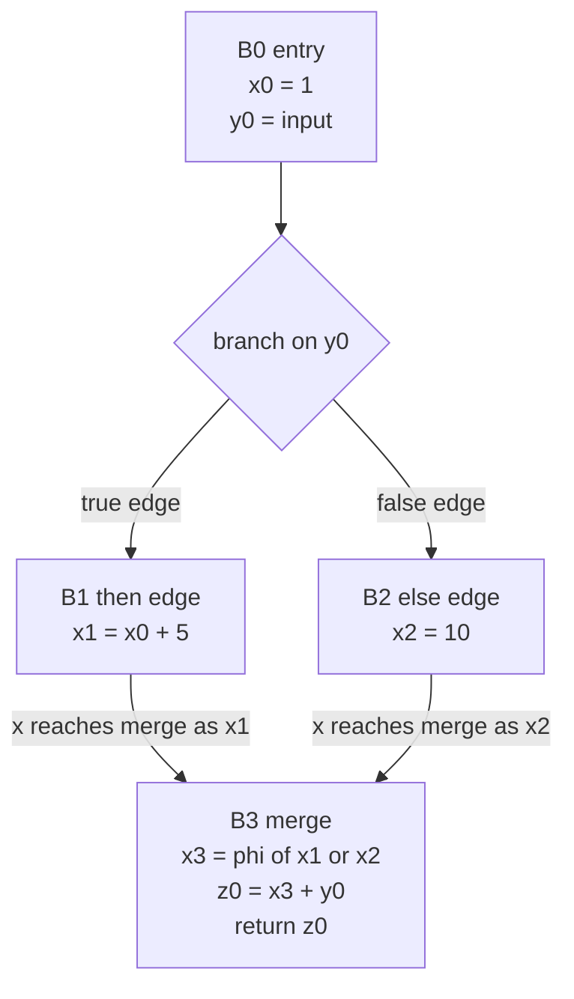

# 🔢 Static Single Assignment (SSA) Form

> [!abstract] TL;DR
> **Static Single Assignment (SSA)** is the intermediate representation that revolutionized modern compiler optimization. Its one rule: **every variable is assigned exactly once.** Each redefinition of `x` becomes a *fresh numbered version* — `x1`, `x2`, `x3` — so every *use* has exactly **one reaching definition**. Where two control paths merge and a variable could hold different versions, a **phi function** `x3 = phi(x1, x2)` picks the right one based on which edge control arrived from. Making definitions unique turns tangled data-flow into explicit, sparse **def-use chains**, so optimizations like constant propagation, dead-code elimination, and global value numbering become simple, fast, and precise. SSA is the *de facto* standard IR of LLVM, GCC (GIMPLE-SSA), V8, and HotSpot.

---

## Intuition

**Analogy — a shared document where anyone can overwrite "x" at any time.** Imagine a shared spreadsheet cell labeled `x` that dozens of people edit throughout the day. At 4 p.m. someone reads `x` and gets `42`. *Where did that value come from?* You have no idea — you must replay the entire edit history, branch by branch, to find which edit last touched the cell before that read. Every question about "what value flows here?" becomes an archaeology dig through overwrites.

Now change one rule: **nobody may overwrite a cell — every new value goes into a brand-new cell with a fresh name.** The first value is `x1`, the next is `x2`, then `x3`, and so on. Suddenly every reader points at *exactly one* cell, and that cell was written *exactly once*. Tracing "where did this value come from?" is now trivial: follow the single arrow back to its unique definition. That is SSA. The only wrinkle is what happens when two paths of the story merge — the "if" branch wrote `x2`, the "else" branch wrote `x3`, and now they rejoin. SSA handles this with a small piece of bookkeeping called a **phi function** that says "the value here is `x2` if we came from the then-branch, else `x3`" — a fresh cell `x4` that records *the value depends on the path taken*.

---

## How It Works

### Core Mechanics

SSA transforms an ordinary intermediate representation (see the forthcoming sibling `Intermediate_Representations`) so that **each variable name is the target of exactly one assignment in the whole procedure.** Construction and use rest on four ideas.

**1. Versioning (the single-assignment rule).** Walk the code and, every time a variable is *defined*, mint a fresh version: `x = ...` at three different points becomes `x1 = ...`, `x2 = ...`, `x3 = ...`. Every *use* is rewritten to name the specific version that reaches it. Because each version is written once, the **def-use relationship becomes explicit**: from any use you jump directly to its one and only definition, and from any definition you have the exact list of uses. This is what makes SSA "sparse" — analyses attach facts to *values* (one per name) rather than recomputing facts at *every program point*, which is the source of SSA's speed and precision. (See the forthcoming `Control_Flow_and_Data_Flow_Analysis` for the classic dense alternative.)

**2. Phi functions (the merge device).** Straight-line code versions cleanly, but branches break the "one definition" promise: after an `if`/`else`, a later use of `x` could see the then-version *or* the else-version depending on the runtime path. SSA restores the invariant by inserting, at the **merge block**, a **phi function**:

```
x3 = phi(x1, x2)   # x1 from the then-predecessor, x2 from the else-predecessor
```

A phi is not a real computation — it is a *pseudo-instruction* meaning "select the operand corresponding to the control edge we actually traversed." It sits conceptually at the *top* of the merge block, and it has exactly one operand per predecessor edge. Phi functions are how SSA expresses **"the value depends on the path taken"** without violating single assignment: the selection itself is a fresh, single definition.

**3. Where to place phis — dominance and dominance frontiers.** Naively inserting a phi for every variable at every merge (a "maximal" SSA) is correct but wasteful. The classic algorithm of **Cytron, Ferrante, Rosen, Wegman, and Zadeck (1991)** places phis precisely using graph **dominance**. Block *A* **dominates** block *B* if every path from entry to *B* passes through *A*. The **dominance frontier** of a block *D* is the set of blocks where *D*'s influence "runs out" — the first blocks *not* strictly dominated by *D* that are reachable from it. The rule: **a variable defined in block *D* needs a phi at every block in *D*'s (iterated) dominance frontier.** Computing dominators and dominance frontiers is pure graph work on the control-flow graph — a [[DFS]] to build the dominator tree (relatives of [[Lowest_Common_Ancestor]] queries appear here), then a frontier sweep. Variants trade insertion effort against precision: **minimal** SSA (Cytron's, phis only at iterated dominance frontiers), **semi-pruned** (skip variables never live across a block boundary), and **pruned** (use liveness to drop phis whose result is dead).

**4. Destruction (out-of-SSA / lowering).** Phi functions are not machine instructions — no CPU has a "pick-based-on-incoming-edge" opcode. Before register allocation and code generation, SSA is **destructed**: each phi `x3 = phi(x1, x2)` is replaced by **copies inserted on the incoming edges** — `x3 = x1` at the end of the then-predecessor and `x3 = x2` at the end of the else-predecessor. Done carelessly this introduces two famous bugs: the **lost-copy problem** (a critical edge or overlapping live ranges makes an inserted copy clobber a still-needed value) and the **swap problem** (parallel phis like `a2 = phi(b1, ...)`, `b2 = phi(a1, ...)` must be treated as *simultaneous* assignments, so a naive sequential lowering swaps the wrong way). Correct destruction splits critical edges and sequences the parallel copies (often via a temporary), work that feeds directly into `Register_Allocation` and `Code_Generation_and_Instruction_Selection`.

### Flow / Architecture

The diagram below shows a diamond control-flow graph before and after SSA. Each assignment gets a unique version; the merge block `B3` gets a phi that selects the right version of `x` depending on which predecessor edge control arrived from.



*Two definitions of `x` reach `B3` along different edges. The phi `x3 = phi(x1, x2)` re-establishes single assignment so the later use `z0 = x3 + y0` has exactly one reaching definition. `y` never gets a phi — it has the same version `y0` on both incoming edges, so there is nothing to select.*

---

## Key Concepts

**Secondary (intuitive, no CS background needed)**
- **Write each name once** — instead of overwriting `x` over and over, give every new value a new name (`x1`, `x2`, `x3`). Now "where did this value come from?" always has one answer.
- **Merging paths need a chooser** — when an "if" branch and an "else" branch rejoin, a little marker records "use the branch's value that we actually took." That marker is the phi function.
- **Why bother** — with one name per value, a tool can rewrite and simplify the program without getting confused about which `x` is which.

**Undergraduate (a first compilers or PL course)**
- **Single-assignment invariant and reaching definitions** — SSA guarantees *exactly one* reaching definition per use, collapsing reaching-definitions analysis into a lookup and making **def-use chains** explicit.
- **Phi functions as merge selectors** — one operand per predecessor edge; conceptually at the block top; semantically "select by incoming edge."
- **Dominators and dominance frontiers** — the CFG machinery (`A dom B` iff every entry-to-`B` path hits `A`) that tells you *exactly where* phis are required (iterated dominance frontier of each definition).
- **Cytron et al.'s construction** — compute the dominator tree, compute dominance frontiers, insert phis, then rename variables into versions in a dominator-tree walk.
- **Out-of-SSA lowering** — replace phis with edge copies before codegen; beware the lost-copy and swap problems.
- **Optimizations made easy** — constant propagation, copy propagation, and dead-code elimination reduce to trivial passes over unique names.

**Graduate (advanced compilation)**
- **Minimal / semi-pruned / pruned SSA** — the precision-versus-cost spectrum for phi placement, using liveness to prune dead phis.
- **Sparse conditional constant propagation (SCCP)** — Wegman & Zadeck's lattice algorithm that propagates constants *and* prunes unreachable branches simultaneously, uniquely enabled by SSA's sparse def-use edges.
- **Global value numbering (GVN) and CSE** — SSA's one-name-per-value property makes value equivalence a hash-cons lookup, unifying common-subexpression elimination and redundancy removal.
- **SSA-based register allocation** — under SSA the interference graph is **chordal**, so it can be colored in polynomial time (no NP-hard Chaitin-style spilling heuristics needed for coloring itself), splitting allocation into clean color/spill phases; ties into `Register_Allocation`.
- **SSA is functional programming** — Appel's insight: phi functions correspond to **function parameters**, and an SSA procedure is isomorphic to a set of mutually recursive functions (or a continuation-passing-style program). Dominator-tree structure mirrors lexical scoping — see [[Recursive_Functions_and_Lambda_Calculus]].
- **Extensions** — **Memory SSA** (versioning heap/aliasing state so loads/stores get def-use edges), **Gated SSA / GSA** (phis annotated with the *predicate* that selects them, enabling demand-driven and value-flow analyses), and **sea-of-nodes** (Cliff Click's IR fusing control and data dependence into one SSA graph, used in HotSpot's C2 and V8's TurboFan).

---

## Python Demo

```python
# CONVERTING A PROGRAM TO SSA FORM, then showing why SSA makes optimization trivial.
#
# Part 1: take a small branching program (straight-line code in B0, a then/else
#         diamond in B1/B2, and a merge in B3), RENAME every assignment to a
#         versioned name (x -> x1, x2, ...), and INSERT a phi function at the merge
#         block wherever two predecessors supply different versions of a variable.
# Part 2: visualize the control-flow graph with SSA versions and the phi node.
# Part 3: run a trivial constant-propagation pass on a straight-line SSA snippet to
#         show that "one definition per name" makes the optimization a one-liner.
#
# Pure standard library (collections) + matplotlib.  numpy not required.

from collections import defaultdict
import matplotlib.pyplot as plt
import matplotlib.patches as mpatches

# ---------------------------------------------------------------------------
# The ORIGINAL (non-SSA) program as a control-flow graph of basic blocks.
# Each instruction is (destination_variable, [rhs tokens]).
#
#   B0:  x = 1 ;  y = input          (straight-line entry)
#   B1:  x = x + 5                    (the "then" edge)
#   B2:  x = 10                       (the "else" edge)
#   B3:  z = x + y ; return z         (the merge)
# ---------------------------------------------------------------------------
blocks_src = {
    "B0": [("x", ["1"]),        ("y", ["input"])],
    "B1": [("x", ["x", "+", "5"])],
    "B2": [("x", ["10"])],
    "B3": [("z", ["x", "+", "y"])],
}
preds = {"B0": [], "B1": ["B0"], "B2": ["B0"], "B3": ["B1", "B2"]}
order = ["B0", "B1", "B2", "B3"]   # reverse postorder: preds processed before merges

def is_var(tok):
    return tok.isidentifier() and tok != "input"   # "input" is a symbolic source, not a var

# ---------------------------------------------------------------------------
# SSA CONSTRUCTION (versioning + phi insertion).
#   counter[v]  -> next version number for variable v
#   out_ver[b]  -> {var: versioned_name reaching the EXIT of block b}
#   phis[b]     -> list of (dst_version, var, {pred: version}) placed at block b
# ---------------------------------------------------------------------------
counter = defaultdict(int)
def fresh(var):
    counter[var] += 1
    return f"{var}{counter[var]}"

out_ver, ssa_blocks, phis = {}, {}, {}

for b in order:
    # 1. Build the incoming environment by merging predecessors.
    env, ps = {}, preds[b]
    if len(ps) == 1:                                   # single predecessor: inherit as-is
        env = dict(out_ver[ps[0]])
    elif len(ps) > 1:                                  # MERGE point: maybe insert phis
        allvars = set().union(*(out_ver[p].keys() for p in ps))
        block_phis = []
        for var in sorted(allvars):
            versions = {p: out_ver[p].get(var) for p in ps}
            if len(set(versions.values())) > 1:        # predecessors DISAGREE -> need a phi
                dst = fresh(var)
                block_phis.append((dst, var, versions))
                env[var] = dst
            else:                                      # all agree -> no phi needed
                env[var] = next(iter(versions.values()))
        phis[b] = block_phis

    # 2. Rename this block's instructions: uses take the current version, defs mint a fresh one.
    rendered = []
    for dst, rhs in blocks_src[b]:
        new_rhs = [env.get(t, t) if is_var(t) else t for t in rhs]   # rename USES (old versions)
        new_dst = fresh(dst)                                          # mint a NEW version for the DEF
        env[dst] = new_dst
        rendered.append((new_dst, new_rhs))
    ssa_blocks[b] = rendered
    out_ver[b] = env

# ---------------------------------------------------------------------------
# PRINT the before / after.
# ---------------------------------------------------------------------------
def fmt_phi(dst, var, versions, block):
    args = ", ".join(versions[p] for p in preds[block])
    return f"{dst} = phi({args})"

print("=" * 58)
print("ORIGINAL (variables reassigned freely):")
print("=" * 58)
for b in order:
    print(f"  {b}:")
    for dst, rhs in blocks_src[b]:
        print(f"      {dst} = {' '.join(rhs)}")

print("\n" + "=" * 58)
print("SSA FORM (each name assigned exactly once; phi at merge):")
print("=" * 58)
for b in order:
    print(f"  {b}:")
    for ph in phis.get(b, []):
        print(f"      {fmt_phi(*ph, b)}")
    for dst, rhs in ssa_blocks[b]:
        print(f"      {dst} = {' '.join(rhs)}")

# ---------------------------------------------------------------------------
# VISUALIZE the CFG with SSA versions + the phi node highlighted at the merge.
# ---------------------------------------------------------------------------
pos = {"B0": (2.0, 3.0), "B1": (0.6, 2.0), "B2": (3.4, 2.0), "B3": (2.0, 1.0)}
edges = [("B0", "B1", "true"), ("B0", "B2", "false"), ("B1", "B3", ""), ("B2", "B3", "")]

def block_lines(b):
    lines = [b]
    for ph in phis.get(b, []):
        lines.append(fmt_phi(*ph, b))
    for dst, rhs in ssa_blocks[b]:
        lines.append(f"{dst} = {' '.join(rhs)}")
    return "\n".join(lines)

fig, ax = plt.subplots(figsize=(9, 7))
for a, c, lbl in edges:                                   # draw edges first (behind boxes)
    x0, y0 = pos[a]; x1, y1 = pos[c]
    ax.annotate("", xy=(x1, y1 + 0.22), xytext=(x0, y0 - 0.22),
                arrowprops=dict(arrowstyle="->", lw=1.8, color="#555555"))
    if lbl:
        ax.text((x0 + x1) / 2 + 0.15, (y0 + y1) / 2, lbl,
                fontsize=10, color="#b34700", fontweight="bold")

for b in order:
    x, y = pos[b]
    has_phi = bool(phis.get(b))
    box = mpatches.FancyBboxPatch((x - 0.85, y - 0.30), 1.7, 0.60,
            boxstyle="round,pad=0.04",
            facecolor="#ffe8cc" if has_phi else "#e7f0ff",
            edgecolor="#b34700" if has_phi else "black",
            linewidth=2.2 if has_phi else 1.2, zorder=2)
    ax.add_patch(box)
    ax.text(x, y, block_lines(b), ha="center", va="center",
            fontsize=9.5, family="monospace", zorder=3)

ax.text(2.0, 0.30, "orange block carries a phi node at the control-flow merge",
        ha="center", fontsize=9, color="#b34700", style="italic")
ax.set_xlim(-0.6, 4.6); ax.set_ylim(0.0, 3.6); ax.axis("off")
ax.set_title("Control-flow graph in SSA form\n(unique versions per assignment, phi at the merge)",
             fontsize=12)
plt.tight_layout()
plt.savefig("ssa_cfg.png", dpi=130)
print("\nSaved SSA control-flow graph to ssa_cfg.png")

# ---------------------------------------------------------------------------
# WHY SSA IS POWERFUL: constant propagation becomes trivial.
# Because each name is defined ONCE, a name's value is unambiguous -- we never
# have to worry that some later assignment overwrote it. Fold operands whose
# definitions are known constants; substitute; repeat in a single forward pass.
# ---------------------------------------------------------------------------
straight_ssa = [
    ("a1", ["3"]),
    ("b1", ["a1", "+", "4"]),
    ("c1", ["b1", "*", "2"]),
    ("d1", ["c1", "-", "a1"]),
]
const_env = {}                     # ssa_name -> constant value, safe because single-assignment
folded = []
OPS = {"+": lambda p, q: p + q, "-": lambda p, q: p - q, "*": lambda p, q: p * q}

for dst, rhs in straight_ssa:
    if len(rhs) == 1 and rhs[0].lstrip("-").isdigit():
        val = int(rhs[0])
    elif len(rhs) == 3 and rhs[0] in const_env and rhs[2] in const_env:
        val = OPS[rhs[1]](const_env[rhs[0]], const_env[rhs[2]])   # both operands known -> fold
    else:
        val = None
    if val is not None:
        const_env[dst] = val
        folded.append(f"{dst} = {val}        (folded)")
    else:
        folded.append(f"{dst} = {' '.join(rhs)}")

print("\n" + "=" * 58)
print("CONSTANT PROPAGATION on straight-line SSA (trivial pass):")
print("=" * 58)
print("  before:")
for dst, rhs in straight_ssa:
    print(f"      {dst} = {' '.join(rhs)}")
print("  after:")
for line in folded:
    print(f"      {line}")
```

Running it prints the original program (where `x` is reassigned three times), then the **SSA form** — `x0=1, y0=input` in `B0`; `x1 = x0 + 5` in `B1`; `x2 = 10` in `B2`; and in `B3` the inserted phi `x3 = phi(x1, x2)` followed by `z0 = x3 + y0`. Note `y` gets *no* phi: both predecessors carry the same `y0`, so there is nothing to choose. The saved `ssa_cfg.png` draws the diamond with the phi-bearing merge block highlighted. Finally the constant-propagation pass collapses `a1=3, b1=a1+4, c1=b1*2, d1=c1-a1` into the constants `3, 7, 14, 11` in a single forward sweep — trivial precisely *because* each SSA name has exactly one definition, so its value can never be silently overwritten by a later assignment.

---

## Real-World Applications

> **Example — LLVM IR is SSA "all the way down."** Every value in [LLVM](https://llvm.org/docs/LangRef.html) IR is an SSA register: a `%`-prefixed name is defined by exactly one instruction, and control-flow merges are expressed with explicit `phi` instructions (`%x3 = phi i32 [ %x1, %then ], [ %x2, %else ]`). LLVM's entire optimization pipeline — `InstCombine`, `SCCP` (sparse conditional constant propagation), `GVN`, `ADCE` (aggressive dead-code elimination), and its loop passes — is built to exploit SSA def-use edges directly, which is a large part of why Clang, Rust, and Swift all inherit world-class optimization by lowering to the same IR (the forthcoming `Compiler_Toolchains_and_LLVM` covers this reuse).

SSA is the standard modern IR across the industry:

- **GCC's GIMPLE-SSA.** GCC's mid-end optimizer runs on GIMPLE in SSA form; its tree-SSA infrastructure hosts dominance-frontier phi placement, SCCP, and value-range propagation.
- **JIT compilers — V8 (TurboFan) and HotSpot (C2).** Both use a **sea-of-nodes** SSA graph that fuses control and data dependences into one representation, enabling aggressive speculative optimization on hot code (see the forthcoming `Just_In_Time_Compilation`). WebAssembly engines and Android's ART use SSA-based backends similarly.
- **Register allocation.** Because SSA interference graphs are chordal, SSA-based allocators (used in LLVM's and GCC's backends) get clean polynomial-time coloring and simpler spilling, improving both allocation quality and compile speed — the payoff flows into `Register_Allocation` and `Code_Generation_and_Instruction_Selection`.
- **Static analyzers and verifiers.** Tools that reason about data flow (bounds checkers, taint analyzers, memory-safety verifiers) build on SSA (often **Memory SSA** for heap state) because sparse def-use edges make flow-sensitive analysis both faster and more precise than dense, per-point iteration.

---

## Common Pitfalls

- **Thinking a phi function computes something at runtime.** A phi is a *pseudo-instruction*, not a machine op — it selects an operand by incoming edge and exists only inside SSA. Forgetting to **destruct** it (lower it to edge copies) before code generation produces IR the backend cannot emit.
- **Naive out-of-SSA: the lost-copy and swap problems.** Blindly turning `x3 = phi(x1, x2)` into copies at predecessor ends breaks when live ranges overlap (lost copy) or when parallel phis must act *simultaneously* (swap). Correct lowering **splits critical edges** and sequences parallel copies through a temporary. This is the single most bug-prone step in an SSA pipeline.
- **Placing phis by hand or maximally.** Inserting a phi at every merge for every variable is correct but bloats the IR and slows every downstream pass. Use **dominance frontiers** (Cytron et al.) for minimal placement, and **liveness** for pruned SSA — don't guess.
- **Confusing "assigned once statically" with "executed once dynamically."** The *static* single assignment rule means each name appears as a definition once *in the program text*. A definition inside a loop still executes many times — SSA versions the loop body once and uses a phi at the loop header to merge the entry value with the back-edge value.
- **Ignoring that SSA needs a proper CFG first.** Dominance, dominance frontiers, and phi placement are all defined over the control-flow graph. Irreducible control flow (unstructured `goto` spaghetti) complicates dominator computation and can force extra phis or node splitting — build and clean the CFG before going into SSA.
- **Treating memory like registers.** Plain SSA only versions scalar values in virtual registers; loads and stores through pointers are *not* versioned by default (aliasing makes it unsound). Reasoning about heap state requires **Memory SSA** or explicit alias analysis — don't assume `*p` gets a clean def-use edge for free.

---

## Related Concepts

- [[Compilers_Overview]] — the parent pipeline; SSA is the middle-end IR that the optimizer and backend consume after semantic analysis.
- [[Lexical_Analysis_and_Tokenization]] — the front-end phase that begins the journey; SSA lives many phases later, after the AST is lowered to IR.
- [[Top_Down_and_Recursive_Descent_Parsing]] — produces the AST that is subsequently lowered into the IR that SSA construction operates on.
- [[Context_Free_Grammars_for_Parsing]] — the grammar layer whose output (structured program) eventually becomes the CFG that SSA versions.
- [[DFS]] — the traversal used to build the dominator tree and compute dominance frontiers for phi placement.
- [[Graph_Representation]] — a control-flow graph is a directed graph of basic blocks; SSA is graph analysis applied to it.
- [[Strongly_Connected_Components]] — loop structure in the CFG (SCCs / natural loops) determines where loop-header phis go.
- [[Lowest_Common_Ancestor]] — dominator-tree queries and iterated-dominance-frontier reasoning share the ancestry machinery of LCA.
- [[Recursive_Functions_and_Lambda_Calculus]] — the "SSA is functional programming" insight: phi functions correspond to function parameters; an SSA procedure is a set of mutually recursive functions.
- [[Theory_of_Computation_Overview]] — the theoretical backdrop connecting compiler IRs, graphs, and computability.

*Forthcoming Compilers siblings referenced in prose (not yet created): `Intermediate_Representations`, `Control_Flow_and_Data_Flow_Analysis`, `Local_and_Global_Optimizations`, `Register_Allocation`, `Code_Generation_and_Instruction_Selection`, `Compiler_Toolchains_and_LLVM`, `Just_In_Time_Compilation`.*

---

## Review Questions

1. **(Conceptual)** Using the shared-document analogy, explain *why* SSA needs phi functions at all. In the diamond CFG from the diagram, why does `x` require a phi at the merge block while `y` does not? What does the phi's operand list encode?
2. **(Scenario)** You are lowering `x3 = phi(x1, x2)` out of SSA before register allocation and you insert `x3 = x1` at the end of the then-block and `x3 = x2` at the end of the else-block. A colleague says this can silently clobber a value on graphs with critical edges. Name the failure mode, give a concrete situation where it manifests, and describe the standard fix.
3. **(Trade-off)** Cytron et al. place phis at the iterated dominance frontier of each definition (minimal SSA), while a simpler compiler might insert a phi at every merge for every live variable (maximal SSA). Compare the two on compile time, IR size, and downstream optimization precision — and explain how pruned SSA uses liveness to improve on both.

---

## Sources

- Cytron, R., Ferrante, J., Rosen, B. K., Wegman, M. N., Zadeck, F. K. "Efficiently Computing Static Single Assignment Form and the Control Dependence Graph." *ACM TOPLAS* 13(4), 1991 — the foundational dominance-frontier construction algorithm.
- Appel, A. W. "SSA is Functional Programming." *ACM SIGPLAN Notices* 33(4), 1998 — the classic note relating phi functions to function parameters.
- Braun, M., Buchwald, S., Hack, S., Leißa, R., Mallon, C., Zwinkau, A. "Simple and Efficient Construction of Static Single Assignment Form." *Compiler Construction (CC)*, 2013 — a modern, on-the-fly SSA construction algorithm.
- Cooper, K., Torczon, L. *Engineering a Compiler*, 3rd ed. Morgan Kaufmann, 2022 — thorough treatment of SSA construction, destruction, and SSA-based optimization.
- *LLVM Language Reference Manual* — the `phi` instruction and SSA-based IR in a production compiler ([llvm.org/docs/LangRef.html](https://llvm.org/docs/LangRef.html)).

---

#compilers #ssa #static-single-assignment #phi-functions #optimization
