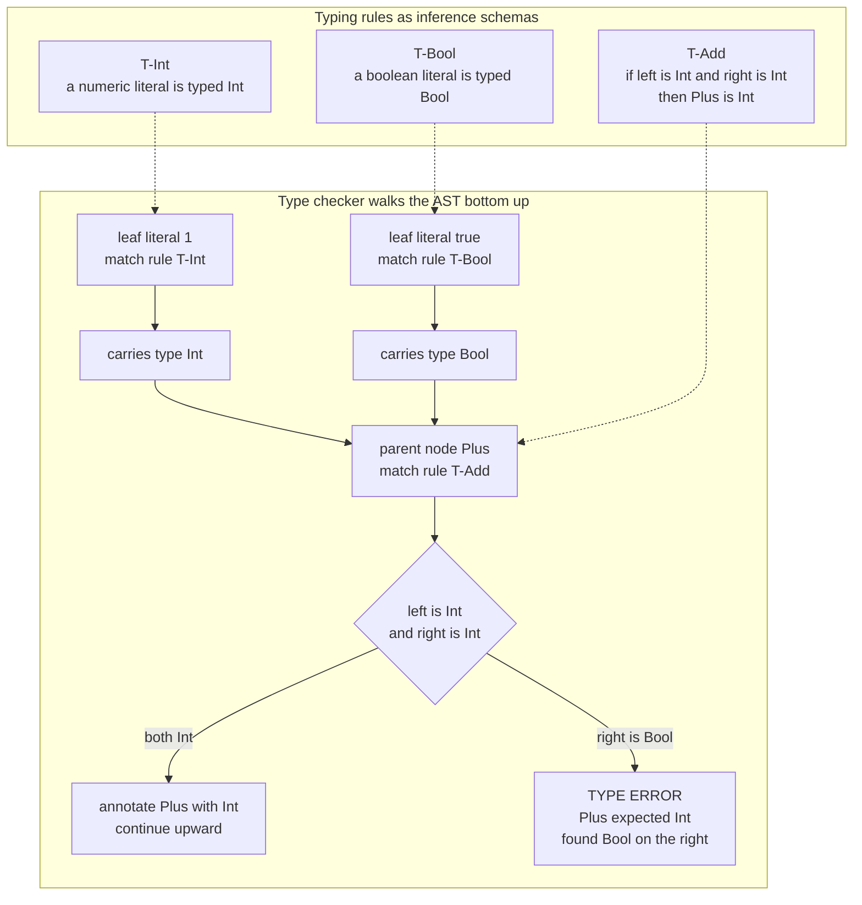

# 🏷️ Type Checking and Type Systems

> [!abstract] TL;DR
> A **type system** is a formal, decidable set of rules that assigns a **type** to every expression and constrains how typed values may be combined. It is a lightweight formal method: by checking these rules at compile time, a **type checker** proves the *absence* of an entire category of runtime errors before the program ever runs — Milner's slogan is **"well-typed programs don't go wrong."** Type checking is the heart of the **semantic analysis** phase: it walks the AST, uses the symbol table to resolve names, assigns a type to each node bottom-up, rejects mismatches like `1 + true`, and hands typed IR to later phases that use those types to pick machine instructions and memory layouts.

---

## Intuition

**Analogy — safety labels on shipping containers.** Imagine a warehouse where every container carries labels: `fragile`, `liquid`, `electronics`, `max 3 kg`. Before anything ships, an inspector checks that every operation respects the labels — you **cannot pour a liquid into a box marked "electronics,"** you cannot stack a heavy crate on a `fragile` one, and a slot that expects a `liquid` drum rejects a pallet of laptops. The labels are cheap to attach and the inspection is mechanical, yet they catch whole classes of disasters *before the truck leaves the loading dock* rather than after a customer opens a ruined package.

A **type** is exactly such a label attached to a value or expression: `Int`, `Bool`, `String`, `List<User>`, `Int -> Bool`. A **type system** is the rulebook saying which combinations are legal ("you can add two `Int`s but not an `Int` and a `Bool`; you can only *call* something whose label says `Function`"). The **type checker** is the inspector who walks the whole program mechanically and refuses to let it ship if a single label is violated. The payoff is the same as the warehouse: a large family of bugs (`null.field`, `"5" - 3`, calling a non-function, mismatched branches) becomes *impossible to express*, caught at compile time instead of exploding in production.

---

## How It Works

### 1. What a type system actually is

Formally, a type system is a **decidable relation** between programs and types. It assigns a type to every well-formed expression and defines which operations are permitted on which types. Because the check is decidable and runs before execution, a type system is a **lightweight formal method** — it does not prove your program computes the *right* answer, but it *does* prove your program will never commit certain **type errors** at runtime (dereferencing a non-pointer, adding a boolean to a function). This is the precise content of Milner's **"well-typed programs don't go wrong."**

### 2. Judgments and typing rules

Type checkers are implementations of a small pile of **inference rules** written as **typing judgments**. The core judgment is:

$$\Gamma \vdash e : T$$

read *"in the typing context Γ (a mapping from variable names to their types, supplied by the **symbol table**), expression `e` has type `T`."* Rules are written as premises over a line and a conclusion under it. A few canonical rules for a tiny language:

- **Literals (T-Int, T-Bool):** with no premises, `Γ ⊢ 3 : Int` and `Γ ⊢ true : Bool`. Literals are self-evidently typed.
- **Variables (T-Var):** if the binding `x : T` is in `Γ`, then `Γ ⊢ x : T`. This is where the checker consults the symbol table.
- **Addition (T-Add):** *if* `Γ ⊢ e1 : Int` *and* `Γ ⊢ e2 : Int`, *then* `Γ ⊢ e1 + e2 : Int`. Mismatched operands have **no derivation** — that absence *is* the type error.
- **Conditional (T-If):** *if* `Γ ⊢ c : Bool` and both branches have the *same* type `T`, *then* `Γ ⊢ if c then e1 else e2 : T`. A non-`Bool` condition or mismatched branches is rejected.
- **Abstraction (T-Abs):** if `Γ, x:A ⊢ body : B` then `Γ ⊢ (λx:A. body) : A -> B`.
- **Application (T-App):** if `Γ ⊢ f : A -> B` and `Γ ⊢ arg : A`, then `Γ ⊢ f arg : B`. Calling a non-function, or passing the wrong argument type, has no derivation.

A **type checker is just the executable form of these rules**: recurse into sub-expressions, obtain their types, then apply the matching rule — succeeding with a type or failing with a diagnostic.

### 3. Static vs dynamic typing

- **Static typing** (C, Java, Rust, Haskell, TypeScript) checks types at **compile time** by analyzing the source without running it. Errors are caught early, the compiler exploits types for **optimization and codegen**, and types double as machine-verified **documentation** and IDE fuel.
- **Dynamic typing** (Python, JavaScript, Ruby) attaches types to *values at runtime* and checks operations as they execute. This buys flexibility and less ceremony but defers `TypeError` to production and forfeits type-driven optimization. (See the planned sibling **Dynamic_Language_Implementation** for how dynamic runtimes recover speed via inline caches and JIT type feedback.)

The tradeoff is early-error-detection + performance + documentation **versus** flexibility + brevity. **Gradual typing** (TypeScript, Python's `mypy`) deliberately blends the two: annotate what you want checked, leave the rest dynamic.

### 4. The other axes

- **Strong vs weak:** a **strong** system refuses to silently reinterpret a value's bits (`"5" + 5` is an error or explicit conversion). A **weak** system performs surprising implicit **coercions** (C's pointer/int punning, JavaScript's `==`). Strong/weak is orthogonal to static/dynamic.
- **Nominal vs structural:** **nominal** typing (Java, C++, Rust) says two types are compatible only if they share a *declared name/lineage*; **structural** typing (TypeScript, Go interfaces, OCaml objects) says compatibility is by *shape* — "if it has the fields I need, it fits."

### 5. Type soundness: progress and preservation

A type system is only worth trusting if it is **sound** — if the checker accepts a program, execution genuinely will not hit a type error. Soundness is proved (relative to the language's **formal semantics**) by two theorems, the Wright–Felleisen recipe:

- **Preservation (subject reduction):** if `e : T` and `e` steps to `e'`, then `e' : T`. Evaluation never changes an expression's type out from under it.
- **Progress:** if `e : T`, then either `e` is a final value or it can take another step. A well-typed program is never *stuck* on a nonsensical operation.

Together: **well-typed programs don't get stuck** — the formal version of Milner's slogan. This connects directly to the planned sibling **Formal_Semantics_and_Verified_Compilers**, where these proofs are machine-checked.

### Diagram — bottom-up type checking of `1 + true`



---

## Key Concepts

### Secondary (intuition level)
- A **type** is a label on a value — `number`, `text`, `yes-or-no` — that says what you may do with it.
- `"5" + 5` is a bug because you are mixing labels the way you would mix `liquid` and `electronics`.
- **Static** languages check the labels *before* running (like a pre-flight inspection); **dynamic** languages check them *while* running (they only notice mid-flight).
- Types are free documentation: the label `Int -> Bool` tells you a function takes a number and answers yes/no without reading its body.

### Undergraduate (mechanics level)
- **Typing judgment** `Γ ⊢ e : T` and **inference rules** for literals, variables, application, and conditionals; the checker is a recursive AST traversal implementing them.
- **Type checking vs type inference:** *checking* verifies code against annotations you wrote; *inference* **deduces** types you omitted (see the planned sibling **Type_Inference_and_Hindley_Milner** for Algorithm W and let-polymorphism).
- **Static vs dynamic**, **strong vs weak**, **nominal vs structural** as three independent axes.
- **Composite types:** records/structs, arrays, tuples, and **sum/union** types; **function types** `A -> B`.
- **Parametric polymorphism / generics:** one definition, many types (`List<T>`, `id : forall a. a -> a`).
- **Subtyping and variance:** if `Cat <: Animal`, where may a `Cat` stand in for an `Animal`? **Covariance**, **contravariance**, **invariance** answer this for containers and function arguments.
- **Coercion:** implicit conversions (`int` to `double`) versus explicit casts, and why silent coercion is the hallmark of weak typing.

### Graduate (theory level)
- **Type soundness** via **progress** and **preservation**, proved against a small-step operational semantics.
- **System F** (second-order polymorphism), **Hindley–Milner** as its decidable fragment, and **bidirectional type checking** (splitting rules into *checking* and *synthesis* modes) that scales to rich systems.
- **Algebraic data types** with **exhaustive pattern matching** verified by the checker; **generalized ADTs**.
- **Substructural types:** **linear** and **affine** types treat values as consumable resources. **Rust's ownership and borrow checker** is an affine type system that enforces memory and data-race safety at compile time with no garbage collector.
- **Dependent types** (Agda, Idris, Coq, Lean) let types mention values (`Vector n`), unifying programs and proofs; **effect systems** track side effects in types.
- **Curry–Howard(–Lambek) correspondence:** propositions are types, proofs are programs, and (via category theory) both are arrows in a cartesian closed category — so a type checker is quite literally a proof checker.
- **Gradual typing** formalized: the **dynamic type** and consistency relation that let static and dynamic code interoperate soundly.

---

## Python Demo

A complete **type checker** for a small typed expression language. It represents types (`Int`, `Bool`, function types), implements the typing rules as a **recursive AST traversal** that annotates each node with its inferred type and checks operator/argument compatibility, and reports **type errors** (`1 + true`, calling a non-function, an `if` whose condition is not `Bool`). It runs on well-typed and ill-typed programs, then **visualizes the typed AST** with matplotlib — each node labelled with its inferred type, the offending node marked in red. Pure stdlib plus matplotlib.

```python
# Type checker for a tiny typed language: literals, variables, arithmetic,
# comparison, if/then/else, lambda abstraction, and application.
# Implements the typing rules T-Int, T-Bool, T-Var, T-Add, T-If, T-Abs, T-App
# as a recursive AST walk, then draws the typed AST with matplotlib.

from dataclasses import dataclass, field
from typing import Optional
import matplotlib.pyplot as plt

# ---------- Types ----------
class Type: ...
@dataclass(frozen=True)
class TInt(Type):  pass
@dataclass(frozen=True)
class TBool(Type): pass
@dataclass(frozen=True)
class TFun(Type):
    arg: Type
    ret: Type

def type_str(t: Optional[Type]) -> str:
    if isinstance(t, TInt):  return "Int"
    if isinstance(t, TBool): return "Bool"
    if isinstance(t, TFun):  return f"{type_str(t.arg)} -> {type_str(t.ret)}"
    return "?"

# ---------- Expression AST (each node also carries .ty and .err at runtime) ----------
@dataclass
class Expr:
    ty: Optional[Type] = field(default=None, init=False, repr=False)
    err: bool = field(default=False, init=False, repr=False)

@dataclass
class IntLit(Expr):  value: int = 0
@dataclass
class BoolLit(Expr): value: bool = False
@dataclass
class Var(Expr):     name: str = ""
@dataclass
class BinOp(Expr):   op: str = "+"; left: Expr = None; right: Expr = None
@dataclass
class If(Expr):      cond: Expr = None; then: Expr = None; els: Expr = None
@dataclass
class Lam(Expr):     param: str = ""; param_ty: Type = None; body: Expr = None
@dataclass
class App(Expr):     func: Expr = None; arg: Expr = None

# ---------- The type checker ----------
class TypeCheckError(Exception):
    def __init__(self, msg, node):
        super().__init__(msg)
        self.msg, self.node = msg, node

def infer(e: Expr, env: dict) -> Type:
    """Return the type of e in context env, annotating e.ty; raise on mismatch."""
    if isinstance(e, IntLit):                      # T-Int
        e.ty = TInt();  return e.ty
    if isinstance(e, BoolLit):                     # T-Bool
        e.ty = TBool(); return e.ty
    if isinstance(e, Var):                         # T-Var (consult the context / symbol table)
        if e.name not in env:
            e.err = True
            raise TypeCheckError(f"unbound variable '{e.name}'", e)
        e.ty = env[e.name]; return e.ty
    if isinstance(e, BinOp):
        lt, rt = infer(e.left, env), infer(e.right, env)
        if e.op in ("+", "-", "*"):                # T-Add: Int x Int -> Int
            if not (isinstance(lt, TInt) and isinstance(rt, TInt)):
                e.err = True
                raise TypeCheckError(
                    f"'{e.op}' expects Int and Int, found {type_str(lt)} and {type_str(rt)}", e)
            e.ty = TInt();  return e.ty
        if e.op in ("<", "=="):                    # comparison: Int x Int -> Bool
            if not (isinstance(lt, TInt) and isinstance(rt, TInt)):
                e.err = True
                raise TypeCheckError(
                    f"'{e.op}' expects Int and Int, found {type_str(lt)} and {type_str(rt)}", e)
            e.ty = TBool(); return e.ty
    if isinstance(e, If):                           # T-If
        ct = infer(e.cond, env)
        if not isinstance(ct, TBool):
            e.err = True
            raise TypeCheckError(f"if-condition must be Bool, found {type_str(ct)}", e)
        tt, et = infer(e.then, env), infer(e.els, env)
        if tt != et:
            e.err = True
            raise TypeCheckError(
                f"if-branches disagree: then is {type_str(tt)}, else is {type_str(et)}", e)
        e.ty = tt; return e.ty
    if isinstance(e, Lam):                          # T-Abs
        body_env = dict(env); body_env[e.param] = e.param_ty
        e.ty = TFun(e.param_ty, infer(e.body, body_env)); return e.ty
    if isinstance(e, App):                          # T-App
        ft, at = infer(e.func, env), infer(e.arg, env)
        if not isinstance(ft, TFun):
            e.err = True
            raise TypeCheckError(f"cannot call a non-function of type {type_str(ft)}", e)
        if ft.arg != at:
            e.err = True
            raise TypeCheckError(
                f"argument type mismatch: expected {type_str(ft.arg)}, got {type_str(at)}", e)
        e.ty = ft.ret; return e.ty
    raise TypeCheckError("unknown expression form", e)

# ---------- Rendering helpers ----------
def node_label(e: Expr) -> str:
    if isinstance(e, IntLit):  return f"IntLit {e.value}"
    if isinstance(e, BoolLit): return f"BoolLit {str(e.value).lower()}"
    if isinstance(e, Var):     return f"Var {e.name}"
    if isinstance(e, BinOp):   return f"BinOp '{e.op}'"
    if isinstance(e, If):      return "If"
    if isinstance(e, Lam):     return f"Lam {e.param}:{type_str(e.param_ty)}"
    if isinstance(e, App):     return "App"
    return "?"

def node_children(e: Expr):
    if isinstance(e, BinOp): return [e.left, e.right]
    if isinstance(e, If):    return [e.cond, e.then, e.els]
    if isinstance(e, Lam):   return [e.body]
    if isinstance(e, App):   return [e.func, e.arg]
    return []

def layout(root: Expr):
    pos, counter = {}, [0]
    def walk(node, depth):
        kids = node_children(node)
        if not kids:
            x = counter[0]; counter[0] += 1
        else:
            x = sum(walk(k, depth + 1) for k in kids) / len(kids)
        pos[id(node)] = (x, -depth)
        return x
    walk(root, 0)
    return pos

def draw_ast(ax, root, title):
    pos = layout(root)
    def edges(node):
        x0, y0 = pos[id(node)]
        for k in node_children(node):
            x1, y1 = pos[id(k)]
            ax.plot([x0, x1], [y0, y1], color="0.6", zorder=1)
            edges(k)
    def nodes(node):
        x, y = pos[id(node)]
        if getattr(node, "err", False):
            face, tyline = "#ff8a80", "TYPE ERROR"
        elif node.ty is not None:
            face, tyline = "#bbdefb", ": " + type_str(node.ty)
        else:
            face, tyline = "#e0e0e0", ": (unreached)"
        ax.text(x, y, f"{node_label(node)}\n{tyline}", ha="center", va="center",
                fontsize=8, zorder=2,
                bbox=dict(boxstyle="round,pad=0.35", facecolor=face, edgecolor="black"))
        for k in node_children(node):
            nodes(k)
    edges(root); nodes(root)
    ax.set_title(title, fontsize=11); ax.axis("off")

def check(expr, env=None):
    env = env or {}
    try:
        t = infer(expr, env)
        return True, f"OK :: {type_str(t)}"
    except TypeCheckError as ex:
        return False, f"TYPE ERROR: {ex.msg}"

# ---------- Programs ----------
# Well-typed:  (lambda x:Int. x + x) applied to (if true then 3 else 4)   ==> Int
double = Lam(param="x", param_ty=TInt(),
             body=BinOp(op="+", left=Var(name="x"), right=Var(name="x")))
good = App(func=double, arg=If(cond=BoolLit(value=True),
                               then=IntLit(value=3), els=IntLit(value=4)))

# Ill-typed:   if (1 + true) then 2 else 3   ==> error inside the condition
bad = If(cond=BinOp(op="+", left=IntLit(value=1), right=BoolLit(value=True)),
         then=IntLit(value=2), els=IntLit(value=3))

# A batch demonstrating each error class
demos = [
    ("(lambda x:Int. x+x) (if true then 3 else 4)", good),
    ("1 + true",                                     BinOp(op="+", left=IntLit(1), right=BoolLit(True))),
    ("(5) 3   -- call a non-function",               App(func=IntLit(5), arg=IntLit(3))),
    ("if 7 then 1 else 0   -- cond not Bool",        If(cond=IntLit(7), then=IntLit(1), els=IntLit(0))),
]
for label, prog in demos:
    ok, msg = check(prog)
    print(f"[{'PASS' if ok else 'FAIL'}] {label:<45} -> {msg}")

# ---------- Visualize a well-typed and an ill-typed AST side by side ----------
check(good)   # annotate .ty on every node
check(bad)    # annotate up to the error, mark the failing node
fig, (ax1, ax2) = plt.subplots(1, 2, figsize=(13, 5.5))
draw_ast(ax1, good, "Well-typed AST  ::  Int")
draw_ast(ax2, bad,  "Ill-typed AST  ::  error at BinOp '+'")
fig.suptitle("Typed AST: each node annotated with its inferred type", fontsize=13)
plt.tight_layout()
plt.savefig("typed_ast.png", dpi=120)
plt.show()
```

Expected console output:

```
[PASS] (lambda x:Int. x+x) (if true then 3 else 4)      -> OK :: Int
[FAIL] 1 + true                                         -> TYPE ERROR: '+' expects Int and Int, found Int and Bool
[FAIL] (5) 3   -- call a non-function                   -> TYPE ERROR: cannot call a non-function of type Int
[FAIL] if 7 then 1 else 0   -- cond not Bool            -> TYPE ERROR: if-condition must be Bool, found Int
```

The figure shows the well-typed tree with every node carrying a blue type label bubbling up to `Int`, next to the ill-typed tree where the `BinOp '+'` node is red (`TYPE ERROR`), its children correctly typed `Int` and `Bool`, and the ancestor `If` / branch nodes left grey because the checker never reached them.

---

## Real-World Applications

> **TypeScript** is the industry's most visible **gradual + structural** type system: it type-checks JavaScript against optional annotations at build time, then erases all types to plain JS. Structural compatibility ("duck typing with proofs") and an escape-hatch `any` type make adoption incremental — the poster child for blending static and dynamic checking.

> **Rust's borrow checker** is a **substructural (affine) type system**. Beyond ordinary types, it tracks *ownership* and *lifetimes* so that "one mutable **xor** many shared references" is a **typing rule**, giving memory and data-race safety at compile time with zero garbage collector. See [[Ownership_and_Borrowing]] and [[Lifetimes]].

> **Haskell and ML** built **Hindley–Milner** inference into the language: you write almost no annotations, yet the compiler reconstructs the most general (polymorphic) type and rejects ill-typed programs. Their **algebraic data types** force **exhaustive pattern matching**, turning "forgot a case" into a compile error.

> **Java and C++ generics** deliver parametric polymorphism to the mainstream; Java erases type parameters at compile time (**type erasure**, with declaration-site variance), while C++ templates monomorphize. See [[Traits_and_Generics]] and [[Type_Erasure_and_Variance]].

> **Optimization and codegen:** knowing statically that a value is a 64-bit `Int` lets the compiler pick the right machine instruction, **unbox** it into a register, and choose a struct layout — no runtime tag test. Monomorphization of generics and devirtualization are type-driven. This is the bridge to the planned sibling **Code_Generation_and_Instruction_Selection**. `mypy` brings the same optional static checking to Python; **CompCert** ships a *proved-sound* type checker as part of a verified compiler.

---

## Common Pitfalls

- **Conflating "strong" with "static" (and "weak" with "dynamic").** They are independent axes. Python is dynamic yet fairly strong (`"5" + 5` raises); C is static yet weak (silent pointer/int coercion). Reason about them separately.
- **Trusting unsound corners.** Real systems have soundness holes: Java's **covariant arrays** (`Object[] a = new String[1]; a[0] = 42;`) throw at runtime; TypeScript's `any`, bivariant method parameters, and unchecked casts can lie. "Type-checked" is not "type-safe" if you take the escape hatch.
- **Implicit coercion surprises.** JavaScript `==`, C integer promotion, and float/int mixing produce values that *type-check* but compute nonsense. Prefer explicit conversions; weak typing hides bugs the checker was supposed to catch.
- **Confusing type checking with type inference.** Checking *verifies* annotations you supplied; inference *reconstructs* omitted ones. HM inference can silently give an expression a *more general* type than you intended, so an error surfaces far from its cause — annotate top-level signatures to localize diagnostics.
- **Non-exhaustive matches.** Adding a variant to a sum type without updating every `match`/`switch` is only caught if the checker enforces exhaustiveness; in languages that do not, the missing case becomes a runtime fault.
- **Nominal vs structural mismatch of expectations.** Developers coming from structural systems (Go, TypeScript) are surprised that two nominally distinct Java/Rust types with identical fields are incompatible — and vice versa.
- **The billion-dollar mistake.** Systems where every reference type is implicitly nullable let `null` inhabit any type, defeating soundness; modern systems (Kotlin, Rust `Option`, Swift optionals) put nullability *in the type*.

---

## Related Concepts

- [[Ownership_and_Borrowing]] — Rust's borrow checker as a **substructural (affine) type system** enforcing memory safety at compile time; the practical face of linear types.
- [[Lifetimes]] — lifetime parameters are types that prove references never outlive their referents.
- [[Traits_and_Generics]] — **parametric polymorphism**, bounded generics, and trait-based (typeclass) constraints in a mainstream language.
- [[Enums_and_Pattern_Matching]] — **algebraic data types** with compiler-checked **exhaustive pattern matching**.
- [[Rust_Types_and_Variables]] — nominal primitive and composite types applied in real code.
- [[Recursive_Functions_and_Lambda_Calculus]] — the **simply typed lambda calculus** underlying every type system; typing tames non-termination (strong normalization).
- [[Proof_Theory_and_Natural_Deduction]] — the **Curry–Howard correspondence**: typing rules *are* natural-deduction rules; a type checker is a proof checker.
- [[Scala_Typeclasses]] — structural / typeclass-style polymorphism and implicit resolution.
- [[Type_Erasure_and_Variance]] — how Java implements generics via erasure and declaration-site **variance / subtyping**.
- [[Category_Theory]] — the Curry–Howard–**Lambek** view of types as objects and programs as morphisms in a cartesian closed category.

*Planned siblings in this **Compilers** vault (referenced here, to be wikilinked once created):* **Semantic_Analysis_and_Symbol_Tables** (name resolution and the context Γ the checker walks), **Type_Inference_and_Hindley_Milner** (deducing omitted types via Algorithm W), **Formal_Semantics_and_Verified_Compilers** (progress/preservation soundness proofs), **Dynamic_Language_Implementation** (runtime type tags and JIT type feedback), **Intermediate_Representations**, and **Code_Generation_and_Instruction_Selection** (how static types drive instruction and layout choices).

---

## Review Questions

**Tier 1 — conceptual.** In one sentence, restate Milner's "well-typed programs don't go wrong." What class of guarantee does a type system give, and what does it *not* guarantee? Why is a strongly-but-dynamically-typed language (Python) still able to throw a `TypeError` at runtime?

**Tier 2 — scenario.** You are designing a plugin API and must decide between **nominal** and **structural** typing, and between **static** and **gradual** checking. Given untrusted third-party authors, incremental adoption, and a need for good IDE autocomplete, which combination do you choose and what are the concrete tradeoffs? Then: given the ill-typed program `if (1 + true) then 2 else 3`, trace exactly which typing rule fails, on which AST node, and why the ancestor nodes never get a type.

**Tier 3 — trade-off / theory.** State the **progress** and **preservation** theorems and explain how together they yield type soundness against an operational semantics. Java's covariant arrays are provably *unsound* yet shipped anyway — argue when a language designer should accept a soundness hole, and contrast that with Rust's decision to make its **affine** ownership rules non-negotiable. Finally, sketch how the **Curry–Howard correspondence** makes your answer to "is this program well-typed?" the same question as "is this proof valid?"

---

## Sources

- Benjamin C. Pierce, *Types and Programming Languages* (MIT Press, 2002) — the standard reference for typing rules, soundness, subtyping, and polymorphism. [https://www.cis.upenn.edu/~bcpierce/tapl/](https://www.cis.upenn.edu/~bcpierce/tapl/)
- Robin Milner, "A Theory of Type Polymorphism in Programming," *JCSS* 17 (1978) — origin of "well-typed programs don't go wrong" and of ML-style polymorphic inference. [https://doi.org/10.1016/0022-0000(78)90014-4](https://doi.org/10.1016/0022-0000(78)90014-4)
- A. Wright and M. Felleisen, "A Syntactic Approach to Type Soundness," *Information and Computation* 115(1), 1994 — the progress/preservation proof technique. [https://doi.org/10.1006/inco.1994.1093](https://doi.org/10.1006/inco.1994.1093)
- Aho, Lam, Sethi, Ullman, *Compilers: Principles, Techniques, and Tools* ("Dragon Book"), 2nd ed., Ch. 6 — type checking within semantic analysis. [https://suif.stanford.edu/dragonbook/](https://suif.stanford.edu/dragonbook/)
- Robert Harper, *Practical Foundations for Programming Languages*, 2nd ed. (Cambridge, 2016) — modern, judgment-based treatment of type systems. [https://www.cs.cmu.edu/~rwh/pfpl/](https://www.cs.cmu.edu/~rwh/pfpl/)

---

#compilers #type-systems #type-checking #static-typing #type-safety
