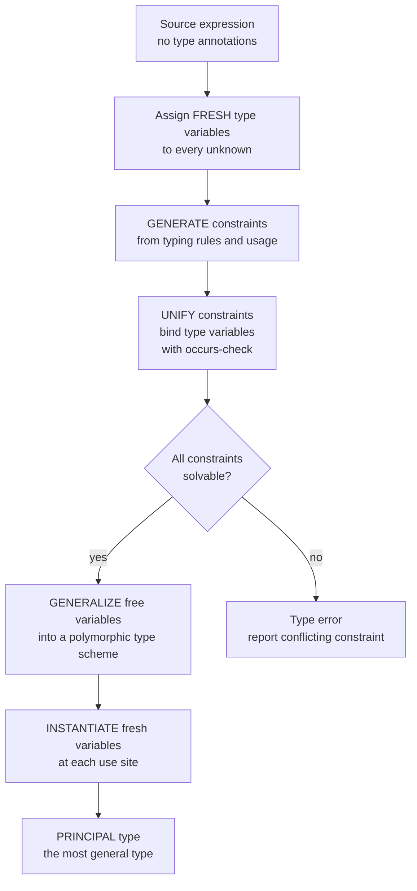

# 🕵️ Type Inference and Hindley-Milner

> [!abstract] TL;DR
> **Type inference** lets you omit type annotations while keeping full static safety: the compiler reconstructs the type of every expression from *how it is used*. The **Hindley-Milner (HM)** type system is the famous sweet spot — it combines **parametric polymorphism** ("generics") with **fully automatic, decidable** inference of a **principal (most-general) type** for every well-typed program. The engine has three moves: assign **fresh type variables** to unknowns, **generate constraints** from usage, then **unify** those constraints to solve for the variables — with **let-generalization** turning solved types into reusable polymorphic schemes. This is why ML, Haskell, and OCaml need almost no annotations, and why Rust, Swift, TypeScript, and C++ `auto` borrowed the idea: **the productivity of a dynamic language with the safety of a static one.**

---

## Intuition

**Analogy — a detective who is never told the answer.** A good detective walks into a room and deduces facts nobody stated out loud. She sees mud on a boot and concludes it rained; she sees two cups and concludes there was a guest. She never asks "please tell me it rained" — she *reconstructs* the truth from evidence.

Type inference is exactly this detective work, applied to code:

- The compiler sees `x + 1`. It has never been told what `x` is — but `+` demands numbers, so it concludes **x must be a number**.
- It sees `f(x)` used where a string is expected. It concludes **f returns a string**.
- It sees `g(x)` and later `x.length`. It concludes **x has a length**, and threads that requirement everywhere `x` flows.

From nothing but the *shape of usage*, the compiler rebuilds every type in the program. You write `let id = \x -> x` with zero annotations, and it silently deduces the **most general** type possible: `a -> a` — identity works for *any* type `a`. You get static type checking, generics, and IDE autocompletion **without writing a single type**. Hindley-Milner is the classic algorithm that makes this detective both *complete* (it always finds a type if one exists) and *principled* (the type it finds is the most general one — the **principal type**).

---

## How It Works

### Core mechanics

HM inference is best understood as **three phases**, whether run in one pass (Milner's **Algorithm W**) or as the modern **generate-then-solve** pipeline:

1. **Assign fresh type variables.** Every unknown — each lambda parameter, each intermediate result — gets a brand-new placeholder like `t0`, `t1`, `t2`. These are the "suspects" whose identity we must deduce.

2. **Generate constraints.** Each syntactic form contributes an *equation between types* dictated by the typing rules:
   - A variable `x` has whatever type the environment binds it to.
   - An abstraction `\x -> body` has type `tx -> tbody`, where `tx` is fresh and `body` is typed with `x : tx` in scope.
   - An **application** `f a` is the workhorse: infer `tf` for `f` and `ta` for `a`, invent a fresh result `tr`, and emit the constraint **`tf = ta -> tr`**. That single equation says "whatever `f` is, it must be a function taking `a`'s type and returning something."

3. **Unify.** **Unification** is the heart of HM: given two type terms, find a **substitution** (an assignment to type variables) that makes them *structurally identical*. Unifying `t0` with `Int -> Bool` binds `t0 := Int -> Bool`. Unifying `t0 -> t1` with `Int -> t2` binds `t0 := Int` and `t1 := t2`. Conflicts (`Int` vs `Bool`, or a function vs an integer) are **type errors**. A crucial guard is the **occurs check**: refusing to bind `a := a -> b`, which would create an *infinite type* — this is what rejects self-application `\x -> x x`.

Two extra moves give HM its power:

- **Generalization (let-polymorphism).** When a `let`-bound value is inferred, its remaining free type variables are **universally quantified** into a **type scheme** `∀a. a -> a`. This is why `let id = \x -> x` can be used at `Int -> Int` and `Bool -> Bool` in the same program.
- **Instantiation.** Each *use* of a polymorphic scheme replaces its quantified variables with **fresh** ones, so different call sites never interfere. Generalize once, instantiate freshly everywhere — that is *let-polymorphism* in one sentence.

**Efficiency note:** unification maintains equivalence classes of type variables and their representative type. This is precisely the [[Union_Find]] (disjoint-set) structure — `find` follows a variable to its binding, `union` merges classes — and it is the same unification used by **Prolog**. That connection is why industrial-strength inference is near-linear in practice.

### Flow / architecture



---

## Key Concepts

### Secondary (intuitive)
- **Type annotation vs inference** — writing `int x` yourself vs letting the compiler figure it out.
- **Static safety without ceremony** — you still catch type mismatches at compile time, but you rarely type the types.
- **Generics for free** — one `id` function works for every type, and you never wrote `<T>`.

### Undergraduate (mechanism)
- **Type variable** — a placeholder standing for a not-yet-known type (`a`, `t0`).
- **Substitution** — a map from type variables to types; applying it "fills in the blanks."
- **Unification** — the algorithm that makes two type terms equal by choosing a substitution; the **occurs check** blocks infinite types.
- **Function type** — `A -> B`, right-associative, the only structured constructor needed for the pure lambda core.
- **Algorithm W** — Milner's original recursive procedure that infers and unifies in a single pass.
- **Constraint-based inference** — the modern split: phase 1 emits a bag of equality constraints, phase 2 solves them; cleaner for error reporting and for adding features.

### Graduate (theory and frontiers)
- **Principal type** — every well-typed HM term has a *unique most-general* type; all other valid types are instances of it. Existence of principal types is what makes annotation-free inference **decidable and complete**.
- **Let-polymorphism / generalization / instantiation** — the precise rule: generalize only at `let`, only over variables *not free in the environment*; instantiate at each occurrence. Lambda-bound parameters are **monomorphic** (no generalization) — the deliberate restriction that keeps inference decidable.
- **Lambda-calculus foundation** — HM is defined over a typed lambda calculus; via the **Curry-Howard correspondence** (see [[Recursive_Functions_and_Lambda_Calculus]]) types are propositions and programs are proofs.
- **Expressiveness limits** — HM cannot infer **higher-rank polymorphism** (functions that take polymorphic arguments), **impredicative** instantiation, or **dependent types**; full type inference for System F is *undecidable*. HM is exactly the largest fragment that stays decidable and principal.
- **Ad-hoc polymorphism** — HM only does *parametric* polymorphism; **type classes** (Haskell) and **traits** (Rust, see [[Traits_and_Generics]]) add overloading on top via constraint dictionaries.
- **Bidirectional type checking** — the pragmatic modern approach: alternate *checking* an expression against an expected type and *synthesizing* a type from it; mixes inference with explicit annotations at boundaries and gives far better errors.

---

## Python Demo

```python
"""
The core of Hindley-Milner type inference in pure Python.

  1. Represent type variables (TVar) and function types (TFun / TCon "->").
  2. UNIFICATION: make two type terms equal by binding type variables,
     including the OCCURS-CHECK that forbids infinite types.
  3. Algorithm-W-style inference over lambda-calculus expressions.
     - infer  \x -> x            gives the polymorphic identity  a -> a
     - infer  \f x -> f (f x)    gives  (a -> a) -> a -> a
     - infer  \x -> x x          FAILS the occurs-check (infinite type).
  4. Visualize the substitution / constraint-solving with matplotlib as a
     union-find-style substitution graph (the same structure Union-Find uses).

Pure stdlib + matplotlib. Run:  python hm_inference.py
"""

import itertools
import matplotlib.pyplot as plt

# ---------------------------------------------------------------- type terms
class Type:
    pass

class TVar(Type):
    """A type variable — an unknown the detective must deduce (t0, t1, ...)."""
    def __init__(self, name):
        self.name = name
    def __repr__(self):
        return self.name

class TCon(Type):
    """A type constructor: Int, Bool, or the function arrow '->' with 2 args."""
    def __init__(self, name, args=None):
        self.name = name
        self.args = args or []
    def __repr__(self):
        if self.name == "->":
            a, b = self.args
            return f"({a} -> {b})"
        return self.name

def TFun(a, b):
    return TCon("->", [a, b])

# ---------------------------------------------------------------- unification
class UnifyError(Exception):
    pass

def prune(t, subst):
    """Follow a chain of variable bindings to its current representative."""
    while isinstance(t, TVar) and t.name in subst:
        t = subst[t.name]
    return t

def occurs(vname, t, subst):
    """Occurs-check: does variable `vname` appear inside type `t`?"""
    t = prune(t, subst)
    if isinstance(t, TVar):
        return t.name == vname
    return any(occurs(vname, a, subst) for a in t.args)

def unify(t1, t2, subst, log):
    """Bind type variables so that t1 and t2 become structurally equal."""
    a, b = prune(t1, subst), prune(t2, subst)
    if isinstance(a, TVar):
        if isinstance(b, TVar) and a.name == b.name:
            return
        if occurs(a.name, b, subst):
            raise UnifyError(f"occurs-check: {a.name} occurs in {b}  ->  infinite type")
        subst[a.name] = b
        log.append((a.name, b))          # record the binding for visualization
        return
    if isinstance(b, TVar):
        unify(b, a, subst, log)
        return
    if a.name != b.name or len(a.args) != len(b.args):
        raise UnifyError(f"cannot unify {a} with {b}")
    for x, y in zip(a.args, b.args):     # arrow vs arrow: unify domains + ranges
        unify(x, y, subst, log)

# ---------------------------------------------------------------- lambda AST
class Var:
    def __init__(self, name): self.name = name
class Lam:
    def __init__(self, param, body): self.param, self.body = param, body
class App:
    def __init__(self, fn, arg): self.fn, self.arg = fn, arg

_fresh = itertools.count()
def fresh():
    return TVar(f"t{next(_fresh)}")

# ---------------------------------------------------------------- inference
def infer(expr, env, subst, log):
    if isinstance(expr, Var):
        return prune(env[expr.name], subst)
    if isinstance(expr, Lam):
        tv = fresh()
        body_t = infer(expr.body, {**env, expr.param: tv}, subst, log)
        return TFun(prune(tv, subst), body_t)
    if isinstance(expr, App):
        fn_t = infer(expr.fn, env, subst, log)          # type of the function
        arg_t = infer(expr.arg, env, subst, log)        # type of the argument
        result = fresh()
        unify(fn_t, TFun(arg_t, result), subst, log)    # the key constraint
        return prune(result, subst)

def resolve(t, subst):
    """Fully apply the substitution to get the final, solved type term."""
    t = prune(t, subst)
    if isinstance(t, TCon):
        return TCon(t.name, [resolve(a, subst) for a in t.args])
    return t

def pretty(t, mapping):
    """Rename internal vars t0,t1,... to friendly a,b,c,... for display."""
    if isinstance(t, TVar):
        mapping.setdefault(t.name, chr(ord("a") + len(mapping)))
        return mapping[t.name]
    if t.name == "->":
        left, right = t.args
        ls = pretty(left, mapping)
        if isinstance(left, TCon) and left.name == "->":
            ls = f"({ls})"                              # parenthesize left arrow
        return f"{ls} -> {pretty(right, mapping)}"
    return t.name

def run(name, expr):
    subst, log = {}, []
    try:
        top = infer(expr, {}, subst, log)
        principal = pretty(resolve(top, subst), {})
        print(f"{name:<16}::  {principal}")
        return principal, log, None
    except UnifyError as e:
        print(f"{name:<16}::  TYPE ERROR — {e}")
        return None, log, str(e)

# ---------------------------------------------------------------- expressions
identity = Lam("x", Var("x"))                                  # \x -> x
twice    = Lam("f", Lam("x", App(Var("f"), App(Var("f"), Var("x")))))  # \f x -> f (f x)
selfapp  = Lam("x", App(Var("x"), Var("x")))                  # \x -> x x  (bad)

print("Inferred principal types:")
run("\\x -> x",        identity)
principal, log, _ = run("\\f x -> f (f x)", twice)
run("\\x -> x x",      selfapp)

# ---------------------------------------------------------------- visualization
def visualize(title, log, principal, filename="hm_inference.png"):
    fig, (ax1, ax2) = plt.subplots(1, 2, figsize=(13, 5))

    # Panel 1 — the constraint-solving log (each unification binding, in order).
    ax1.axis("off")
    ax1.set_title("Constraint solving  (substitution log)", fontsize=13, weight="bold")
    lines = [f"expr:  {title}", ""]
    for i, (v, b) in enumerate(log, 1):
        lines.append(f"step {i}:   {v}  :=  {b}")
    lines += ["", f"principal type:  {principal}"]
    ax1.text(0.02, 0.97, "\n".join(lines), va="top", ha="left",
             family="monospace", fontsize=13, transform=ax1.transAxes)

    # Panel 2 — substitution as a union-find-style graph.
    ax2.axis("off")
    ax2.set_title("Type-variable substitution graph\n(same shape as Union-Find)",
                  fontsize=13, weight="bold")
    nodes, edges, annot = [], [], {}
    for v, b in log:
        if v not in nodes:
            nodes.append(v)
        if isinstance(b, TVar):
            if b.name not in nodes:
                nodes.append(b.name)
            edges.append((v, b.name))          # var := var  ->  a real edge
        else:
            annot[v] = str(b)                  # var := structured type -> label
    pos = {n: (2 * i, 0) for i, n in enumerate(sorted(nodes))}
    for n, (x, y) in pos.items():
        is_sink = all(a != n for a, _ in edges)      # representative of its class
        ax2.scatter([x], [y], s=1900,
                    c=("#ffe0b0" if is_sink else "#cfe8ff"),
                    edgecolors="#1f6fb2", linewidths=2, zorder=3)
        ax2.text(x, y, n, ha="center", va="center", fontsize=13,
                 weight="bold", zorder=4)
        if n in annot:
            ax2.text(x, y + 0.85, f"{n} := {annot[n]}", ha="center",
                     fontsize=11, color="#a33", zorder=4)
    for a, b in edges:
        (xa, ya), (xb, yb) = pos[a], pos[b]
        ax2.annotate("", xy=(xb, yb), xytext=(xa, ya),
                     arrowprops=dict(arrowstyle="->", color="#1f6fb2", lw=2.2,
                                     shrinkA=26, shrinkB=26), zorder=2)
    if pos:
        xs = [p[0] for p in pos.values()]
        ax2.set_xlim(min(xs) - 2, max(xs) + 2)
    ax2.set_ylim(-1.5, 1.8)
    ax2.text(0.5, -0.04, "orange = class representative  |  arrow = a binding, "
             "following arrows to the sink = find()",
             ha="center", va="top", fontsize=9, color="#555",
             transform=ax2.transAxes)

    plt.tight_layout()
    plt.savefig(filename, dpi=120)
    print(f"\nsaved visualization -> {filename}")
    plt.show()

visualize("\\f x -> f (f x)", log, principal)
```

Running it prints the reconstructed **principal types** and rejects the ill-typed term:

```
Inferred principal types:
\x -> x         ::  a -> a
\f x -> f (f x) ::  (a -> a) -> a -> a
\x -> x x       ::  TYPE ERROR — occurs-check: t0 occurs in (t0 -> t1)  ->  infinite type
```

The matplotlib figure shows the two faces of the same computation: on the left the ordered list of substitution bindings that unification produced, and on the right those bindings drawn as a directed graph whose "follow arrows to the sink" structure is exactly the `find` operation of [[Union_Find]].

---

## Real-World Applications

> **ML / OCaml / Haskell** — the birthplace. Milner designed HM for ML's metalanguage; today OCaml and Haskell let you write entire modules with essentially **no type annotations**, and the compiler still guarantees full static safety and infers the most general signatures for you.

> **Rust and Swift — local inference.** Both use HM-descended inference *within* function bodies (`let v = Vec::new(); v.push(3)` deduces `Vec<i32>` from later usage) but deliberately **require annotations at function boundaries**. This "local inference" keeps error messages readable and signatures documentary while still killing 90 percent of the annotation burden. Rust's **traits** (see [[Traits_and_Generics]]) add the ad-hoc-polymorphism layer HM lacks.

> **TypeScript and Flow** — retrofitting inference onto JavaScript. TypeScript infers types for locals, return values, and generics (see [[Generics_in_TypeScript]] and its contextual typing), giving dynamic-language ergonomics with a static safety net — the single biggest driver of TypeScript's adoption.

> **C++ `auto` / C# `var` / Java `var`** — mainstream languages absorbed the *idea* even without full HM: `auto it = m.begin();` reconstructs the iterator type so you never spell out `std::map<K,V>::iterator`.

> **Prolog and constraint solvers** — the very same **unification** engine (variable binding plus occurs-check) is the execution model of logic programming, showing HM's kinship with automated reasoning.

---

## Common Pitfalls

- **Forgetting the occurs-check** — without it, unifying `a` with `a -> b` loops forever or builds a cyclic, infinite type. It is the check that makes self-application `\x -> x x` a *type error* instead of a hang.
- **Generalizing lambda parameters** — only `let`-bound values may be generalized; generalizing a lambda parameter breaks soundness and decidability. This is the subtle reason HM is *let*-polymorphic, not fully polymorphic.
- **The value restriction** — in languages with mutable references, naively generalizing any expression is unsound (a polymorphic mutable cell can be written at one type and read at another). ML restricts generalization to *syntactic values*; skipping this is a classic source of type holes.
- **Expecting inference where HM cannot go** — higher-rank types, impredicative instantiation, and dependent types are *undecidable* to infer. When a language "suddenly demands an annotation," you have usually crossed the HM boundary; supply the type at that boundary.
- **Trusting inferred types silently** — an unannotated top-level function will happily be inferred *more general or more specific than you intended*, and a wrong type propagates far before erroring. Annotate public signatures as documentation and as an error-localization anchor.
- **Cryptic error messages** — inference reports the *conflict site*, which is often far from the real mistake. This notorious "action at a distance" is why modern designs favor **bidirectional checking** and local inference for better blame assignment.

---

## Related Concepts

- [[Recursive_Functions_and_Lambda_Calculus]] — HM is defined over a typed lambda calculus; the **Curry-Howard correspondence** (types as propositions) lives here.
- [[Union_Find]] — the disjoint-set structure that makes unification near-linear; a variable's binding chain is a `find`, merging classes is a `union`.
- [[Traits_and_Generics]] — Rust traits provide the **ad-hoc polymorphism** (overloading) that pure HM lacks, layered on top of HM-style parametric inference.
- [[Generics_in_TypeScript]] — parametric polymorphism and **local/contextual inference** in a mainstream, gradually-typed language.
- [[TypeScript_Fundamentals]] — how a dynamic language retrofits static inference for "types you don't have to write."

*(Sibling compiler notes not yet in the vault — reference in prose until created: `Type_Checking_and_Type_Systems` for the checking counterpart to inference, `Semantic_Analysis_and_Symbol_Tables` for the phase HM lives in, and `Formal_Semantics_and_Verified_Compilers` for soundness proofs of the type system.)*

---

## Review Questions

1. **(Secondary)** In `let id = \x -> x`, the compiler assigns `id` the type `a -> a` without any annotation. In one sentence, what does the "detective" observe that lets it conclude this, and why is `a -> a` better than guessing `Int -> Int`?
2. **(Undergraduate)** Walk through unifying `t0 -> t1` with `Int -> (Bool -> t2)`: which variables get bound to what? Then explain what the **occurs-check** would do if you instead tried to unify `t0` with `t0 -> Bool`, and which program that rejects.
3. **(Graduate)** HM generalizes at `let` but *not* at lambda parameters. (a) Why is this restriction essential for keeping inference decidable and principal? (b) Give an example where generalizing a lambda parameter would let you write something HM rejects, and (c) explain why the **value restriction** is needed once mutable references enter the language.

---

## Sources

- Robin Milner, *A Theory of Type Polymorphism in Programming*, Journal of Computer and System Sciences (1978) — the original HM system. https://doi.org/10.1016/0022-0000(78)90014-4
- Luis Damas & Robin Milner, *Principal Type-Schemes for Functional Programs*, POPL (1982) — Algorithm W and the principal-types theorem. https://dl.acm.org/doi/10.1145/582153.582176
- Benjamin C. Pierce, *Types and Programming Languages*, MIT Press (2002), Ch. 22 "Type Reconstruction". https://www.cis.upenn.edu/~bcpierce/tapl/
- Martin Grabmüller, *Algorithm W Step by Step* (2006) — an executable, annotated HM implementation. https://github.com/mgrabmueller/AlgorithmW
- *Hindley–Milner type system*, Wikipedia. https://en.wikipedia.org/wiki/Hindley%E2%80%93Milner_type_system

---

#compilers #type-inference #hindley-milner #unification #polymorphism
