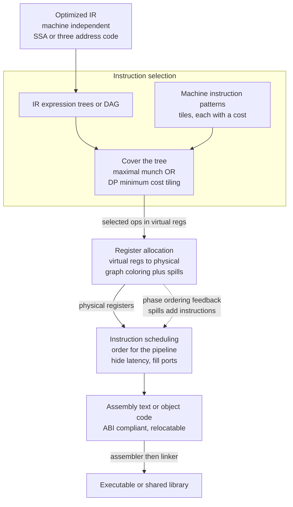

# 🏭 Code Generation and Instruction Selection

> [!abstract] TL;DR
> **Code generation** is the compiler **back end** turning optimized, machine-independent **IR** into concrete **assembly or machine code** for one target ISA. It is really three intertwined problems: **instruction selection** (which real machine instructions implement each IR operation?), **register allocation** (map unlimited IR temporaries onto a finite physical register file), and **instruction scheduling** (order instructions to feed the pipeline and hide latency). This note focuses on **instruction selection**, framed as **covering an IR expression tree or DAG with machine-instruction patterns ("tiles")**, each tile carrying a **cost**. You can tile **greedily** with **maximal munch** (grab the biggest matching tile at each node) or **optimally** with **dynamic programming** (minimize total cost) — and, crucially, the fewest-instruction cover is *not* always the fastest one. The IR stays target-independent so the same optimizer serves every language; the back end is the **retargetable** layer, which is exactly what LLVM's SelectionDAG/GlobalISel and GCC's RTL make declarative through target descriptions.

---

## Intuition

**Analogy — tiling a floor with the fewest, best-fitting tiles.** Imagine you must cover a fixed floor plan (the shape is the program's meaning) using tiles from a catalog. Each catalog tile has a shape and a **price**: small square tiles are cheap but you need many; a large L-shaped tile covers a whole corner in one piece but costs more. Your job is to cover the *entire* floor with *no gaps and no overlaps*, spending as little as possible. A hasty tiler grabs the biggest tile that fits at each spot ("maximal munch") and moves on. A careful tiler realizes that sometimes a big fancy tile is *overpriced*, and three cheap tiles beat it — so it plans the whole layout to minimize total price.

Instruction selection is exactly this. The IR says, abstractly, "load the value at `base + index*4`." The code generator holds a catalog of real machine instructions — an `add`, an `lea`, a shift, a plain `mov`, a fused multiply-add, a complex scaled-index `mov [base + index*4]` — and must **choose the real instructions that cover the abstract operation** at the lowest cost *on this chip*. The abstract "add these two numbers" might become a single `add`, an `lea` that also folds an address computation, or an increment — whichever the cost model says is fastest here. Picking the best real instructions to cover abstract operations is the whole game, and "biggest tile wins" is a heuristic, not the truth.

---

## How It Works

### The back end has three core problems

Once the middle end hands over optimized [[Intermediate_Representations|IR]], the back end must solve three problems that are deeply **interdependent**:

1. **Instruction selection** — *which* target instructions implement the IR operations. An IR multiply-by-4 can become a `mul`, a `shift-left-by-2`, or be *folded* into an addressing mode; an IR add-then-load can collapse into one memory instruction on a CISC machine. Selection is a **pattern-matching / covering** problem over the IR tree or DAG.
2. **Register allocation** — the IR uses *unlimited* virtual temporaries, but the machine has a *fixed, small* register file (32 on RISC-V, 16 general-purpose on x86-64). Allocation maps virtuals to physical registers, and when they do not fit it **spills** to the stack. Classically modeled as **graph coloring** of the interference graph. *(See [[Register_Allocation]].)*
3. **Instruction scheduling** — reorder instructions to keep a pipelined, superscalar, out-of-order CPU busy: separate a load from the use of its result to hide memory latency, spread work across execution ports, avoid stalls. *(See [[Instruction_Scheduling_and_Pipelines]], [[Pipelining_and_Hazards]], and [[Superscalar_and_Out_of_Order_Execution]].)*

**The phase-ordering problem.** These three fight each other. Selecting a fancy instruction that pins operands to specific registers constrains the allocator. Aggressive scheduling that spreads instructions apart lengthens live ranges, raising register pressure and forcing spills — which *adds* instructions the scheduler must then re-handle. There is no globally optimal order to run selection, allocation, and scheduling, so production compilers run them in a fixed pipeline with feedback (and sometimes iterate). This mutual dependence is why "just pick the best instruction" is naive: the *best* instruction depends on what allocation and scheduling will do next.

### Instruction selection as tree/DAG tiling

Model the computation as an **IR expression tree** (or, sharing common subexpressions, a **DAG**). Each machine instruction is described by a **pattern** (a small tree fragment, called a **tile**) plus a **cost**. A tile's leaves that are *non-terminals* (marked "must be in a register") are **holes** where another tile's result plugs in; leaves that are *literals* (an immediate constant) are **folded** into the instruction and consume no separate instruction. A valid **cover** tiles every IR node with no gaps and no overlaps; the emitted program is the sequence of instructions for the chosen tiles, in a post-order that produces each hole's value before it is used.

- **Maximal munch (greedy).** Starting at the root, choose the tile that covers the *most* IR nodes, emit it, and recurse on its holes. Fast and simple, produces the *fewest* instructions, and is what many hand-written back ends do. But "fewest tiles" is not "least cost": a big tile can be overpriced.
- **Optimal tiling (dynamic programming).** Compute, bottom-up, the **minimum-cost** way to produce each node's value in a register: for every tile matching at a node, cost = tile cost + sum of the minimum costs of its holes; keep the cheapest. This is the classic **BURS / bottom-up rewrite system** approach (Aho–Ganapathi–Tjiang, and tools like `iburg`/`burg`). For trees it is provably optimal in **linear time** given a fixed cost model.

**CISC vs RISC changes the catalog.** A CISC target (x86) offers *large* tiles — complex addressing modes like `[base + index*scale + disp]`, `lea` that computes an address as arithmetic, read-modify-write memory operands — so tiling has rich, node-hungry patterns and selection quality matters enormously. A RISC target ([[RISCV_ISA_Fundamentals|RISC-V]]) offers *small, uniform* tiles (load/store are separate, addressing is base+offset only), so selection is simpler but address arithmetic must be *decomposed* into explicit shifts and adds. *(See [[ISA_Design_RISC_vs_CISC]].)*

### The target machine model the generator must respect

Code generation is where a compiler stops being portable. The generator must encode the full **target model**: the **ISA** (opcodes, operand forms), the **register file** (counts, classes — integer vs float vs vector, special roles), the **addressing modes**, instruction **latencies and port assignments** for scheduling, and the **calling convention / ABI**. Emitting an ABI-compliant call means the generator lays out the **stack frame**, passes arguments in the right registers or stack slots, honors caller/callee-saved conventions, and sets up the return. *(See [[ABI_and_Calling_Conventions]] and [[Runtime_Systems_and_the_ABI]].)*

### Special instructions and peephole combining

Modern ISAs bristle with instructions that fuse several IR operations: **fused multiply-add** (`a*b+c` in one rounding step), **SIMD/vector** ops that process many lanes at once (*see [[SIMD_and_Vector_ISA]]*), x86 `lea` that does a multiply-add address computation without touching flags, and **condition-code** setting instructions. Recognizing these is partly the selector's tile catalog and partly a **peephole** pass that combines adjacent instructions after selection (LLVM's DAGCombiner and the MachineCombiner do exactly this). *(See [[Local_and_Global_Optimizations]].)*

### Machine-independent vs machine-dependent, and retargetability

The whole architecture rests on a split: the **IR stays target-independent** so the entire optimizer is written once, and the **back end is the retargetable layer**. Rather than hand-code a back end per chip, modern compilers **describe** the target declaratively — LLVM's **TableGen** `.td` files list registers, instructions, patterns, and costs; the generator matches [[Intermediate_Representations|IR]] against those patterns. This is why adding a target to LLVM is a *description* task, not a rewrite. LLVM offers two selectors: the older **SelectionDAG** (builds a DAG per basic block, legalizes, then pattern-matches) and the newer **GlobalISel** (a global, more incremental pipeline). GCC uses **RTL** (register transfer language) with machine-description `.md` patterns. *(See [[Compiler_Toolchains_and_LLVM]].)*

### Stack machines vs register machines, and the output

The *target model* shapes codegen fundamentally. For a **stack machine** (JVM bytecode, WebAssembly, CPython) codegen is a trivial post-order walk emitting push/op instructions — no register allocation needed, which is why bytecode is compact and easy to generate. For a **register machine** (real hardware) codegen must solve allocation and scheduling. *(See [[Bytecode_and_Virtual_Machines]].)* The **output** is either **assembly text** (handed to an assembler) or **object code** emitted directly; either way the **assembler** encodes instructions to bytes and records **relocations** the **linker** later resolves. *(See [[Linkers_and_Loaders]].)* A **JIT** does the same selection/allocation/scheduling but emits bytes straight into executable memory and jumps to them, trading peak code quality for compile speed. *(See [[Just_In_Time_Compilation]].)*

### Flow / Architecture



*The three back-end problems are a pipeline with feedback: selection fixes what instructions exist, allocation maps them to hardware registers, scheduling orders them — but spills from allocation create new instructions, so the phases are interdependent, not strictly sequential.*

---

## Key Concepts

### Secondary (plain-language takeaway)
- The **back end** is the translator that turns the compiler's internal notes into the actual instructions a specific chip runs.
- **Instruction selection** is choosing *which* real machine instructions do the job — like picking the best-fitting tiles to cover a floor with no gaps.
- Fewer instructions is **not** automatically faster: one big fancy instruction can be slower than three simple ones.
- The back end also decides **which registers** hold values and **what order** to run instructions in.

### Undergraduate (a compilers or architecture course)
- The **three back-end problems** — instruction selection, register allocation (graph coloring), instruction scheduling — and their **phase-ordering** interdependence.
- Instruction selection as **tree/DAG tiling**: instructions are **patterns (tiles)** with **costs**; a cover has no gaps or overlaps.
- **Maximal munch** greedy tiling (fewest instructions) vs **dynamic-programming optimal tiling** (minimum cost); why greedy can be suboptimal.
- **RISC vs CISC** effect on the tile catalog: complex addressing modes and `lea`/FMA are *large* tiles; RISC forces *decomposition* into shifts and adds.
- The **target model**: ISA, register classes, addressing modes, instruction latencies, and the **ABI / calling convention** codegen must obey.
- **Machine-independent IR vs machine-dependent codegen**: the retargetable back end and the M + N economy.
- **Output forms**: assembly text vs object code; the assembler and **relocation** for the linker.

### Graduate (advanced code generation)
- **BURS / bottom-up rewrite systems** and the **Aho–Ganapathi–Tjiang** dynamic-programming tiling; tools like `burg`/`iburg`/`lburg`; tree-grammar cost minimization in linear time; extending from trees to **DAGs** (NP-hard in general, so heuristics).
- **LLVM SelectionDAG** (type/operation **legalization**, DAGCombine, pattern ISel from TableGen) vs **GlobalISel** (`IRTranslator → Legalizer → RegBankSelect → InstructionSelect`); **GCC RTL** and machine-description `.md` files.
- **Integrated / cooperative** approaches that couple selection with scheduling and allocation, and **PBQP** or ILP-based selection; **SSA-based** register allocation and its polynomial chordal-graph coloring.
- **Cost models tied to the microarchitecture**: instruction latency, throughput, µop counts, decoder/port constraints, macro-op fusion, and how they feed both selection and scheduling (*see [[Superscalar_and_Out_of_Order_Execution]]*).
- **Auto-vectorization** and SIMD selection; **FMA** contraction and its numerical-semantics caveats; **peephole / DAG combining** to catch fused forms after selection.
- **JIT codegen** trade-offs (fast, tiered, profile-guided) versus AOT; and **verified** instruction selection (translation validation, CompCert-style correctness of the selector).

---

## Python Demo

```python
"""
Tree-pattern INSTRUCTION SELECTION: greedy maximal munch vs optimal DP tiling.

We take one IR expression tree for the address-and-load  M[ base + index*4 ]
(loading a[i] where the element size is 4) and cover it with a catalog of
machine-instruction PATTERNS ("tiles"), each carrying a COST:

  * MAXIMAL MUNCH (greedy) grabs the LARGEST matching tile at each node.
    Here that is the single CISC-style scaled-index load  lw (base + index*4),
    which covers the whole tree in ONE instruction -- but on this cost model
    the complex addressing mode is SLOW (cost 6, it decodes to many micro-ops).

  * OPTIMAL (dynamic programming) minimizes TOTAL cost. It decomposes into
    a shift + add + simple load (cost 1 + 1 + 3 = 5), spending MORE
    instructions to reach a LOWER cost.

Punchline: the fewest-instruction cover is NOT the fastest cover. We print both
instruction sequences and their costs, then VISUALIZE the tree twice with the
chosen tiles overlaid (thick colored edges = one tile; dashed = tile boundary).

Pure standard library + matplotlib (no numpy).
"""

from itertools import count
import matplotlib.pyplot as plt


# ------------------------------------------------------------------ IR tree
class Node:
    __slots__ = ("kind", "children", "value", "name")

    def __init__(self, kind, *children, value=None, name=None):
        self.kind = kind            # "Reg" | "Const" | "Add" | "Mul" | "Load"
        self.children = list(children)
        self.value = value          # for Const
        self.name = name            # for Reg


def Reg(name):  return Node("Reg", name=name)
def Const(v):   return Node("Const", value=v)
def Add(a, b):  return Node("Add", a, b)
def Mul(a, b):  return Node("Mul", a, b)
def Load(a):    return Node("Load", a)

# IR for   M[ base + index*4 ]
IR = Load(Add(Reg("base"), Mul(Reg("index"), Const(4))))


# ------------------------------------------------------- machine-instr tiles
# A pattern is a nested tuple.  "R" = a HOLE (this subtree must be produced in
# a register -> a recursion point / tile boundary).  "C" = must be a Const,
# FOLDED into the instruction as an immediate (consumed, not a hole).
class Tile:
    def __init__(self, name, pattern, cost):
        self.name, self.pattern, self.cost = name, pattern, cost


TILES = [
    Tile("USE",    ("Reg",),                                    0),  # already in a reg
    Tile("LI",     ("Const",),                                  1),  # li  rd, imm
    Tile("ADD",    ("Add", "R", "R"),                           1),  # add rd, rs1, rs2
    Tile("ADDI",   ("Add", "R", "C"),                           1),  # addi rd, rs, imm
    Tile("SLLI",   ("Mul", "R", "C"),                           1),  # shift: mul-by-2^k
    Tile("MUL",    ("Mul", "R", "R"),                           3),  # mul rd, rs1, rs2
    Tile("LW",     ("Load", "R"),                               3),  # lw rd, 0(rs)
    Tile("LWDISP", ("Load", ("Add", "R", "C")),                 3),  # lw rd, imm(rs)
    Tile("LWIDX",  ("Load", ("Add", "R", ("Mul", "R", "C"))),   6),  # CISC scaled-index (slow)
]


def matches(pat, node):
    """Does `pat` match at `node`?  'R' matches anything (a hole)."""
    if pat == "R":
        return True
    if pat == "C":
        return node.kind == "Const"
    if node.kind != pat[0] or len(pat) - 1 != len(node.children):
        return False
    return all(matches(sp, ch) for sp, ch in zip(pat[1:], node.children))


def coverage(pat, node):
    """How many IR nodes this tile consumes (holes excluded) -> tile 'size'."""
    if pat == "R":
        return 0
    if pat == "C":
        return 1
    return 1 + sum(coverage(sp, ch) for sp, ch in zip(pat[1:], node.children))


def collect(pat, node, holes, consts):
    """Gather, left-to-right, the hole subtrees and the folded constant values."""
    if pat == "R":
        holes.append(node)
    elif pat == "C":
        consts.append(node.value)
    else:
        for sp, ch in zip(pat[1:], node.children):
            collect(sp, ch, holes, consts)


def render(tile, d, node, regs, consts):
    """Emit the assembly text for a tile.  Returns (instruction_or_None, result_reg)."""
    n = tile.name
    if n == "USE":    return None, node.name                # value already in a register
    if n == "LI":     return f"li    {d}, {node.value}", d
    if n == "ADD":    return f"add   {d}, {regs[0]}, {regs[1]}", d
    if n == "ADDI":   return f"addi  {d}, {regs[0]}, {consts[0]}", d
    if n == "SLLI":   return f"slli  {d}, {regs[0]}, {consts[0].bit_length() - 1}", d
    if n == "MUL":    return f"mul   {d}, {regs[0]}, {regs[1]}", d
    if n == "LW":     return f"lw    {d}, 0({regs[0]})", d
    if n == "LWDISP": return f"lw    {d}, {consts[0]}({regs[0]})", d
    if n == "LWIDX":  return f"lw    {d}, ({regs[0]} + {regs[1]}*{consts[0]})", d


# ------------------------------------------------------------- the two choosers
def greedy_choice(node):
    """MAXIMAL MUNCH: largest matching tile; tie-break by lower cost."""
    cands = [t for t in TILES if matches(t.pattern, node)]
    return max(cands, key=lambda t: (coverage(t.pattern, node), -t.cost))


def optimal_tables(root):
    """DP: minimum cost to produce each node in a register, plus the winning tile."""
    best_cost, best_tile = {}, {}

    def solve(node):
        k = id(node)
        if k in best_cost:
            return best_cost[k]
        bc, bt = float("inf"), None
        for t in TILES:
            if not matches(t.pattern, node):
                continue
            holes, consts = [], []
            collect(t.pattern, node, holes, consts)
            c = t.cost + sum(solve(h) for h in holes)
            if c < bc:
                bc, bt = c, t
        best_cost[k], best_tile[k] = bc, bt
        return bc

    solve(root)
    return best_tile


# ------------------------------------------------------------------- emission
def emit(node, choose, program, regs_gen):
    """Post-order walk: produce each hole first, then emit this tile's instruction."""
    tile = choose(node)
    holes, consts = [], []
    collect(tile.pattern, node, holes, consts)
    hole_regs = [emit(h, choose, program, regs_gen) for h in holes]
    d = None if tile.name == "USE" else f"t{next(regs_gen)}"
    instr, result = render(tile, d, node, hole_regs, consts)
    if instr is not None:
        program.append((instr, tile.cost))
    return result


def run(choose, label):
    program = []
    result = emit(IR, choose, program, count(1))
    total = sum(c for _, c in program)
    print(f"\n=== {label} ===")
    for instr, c in program:
        print(f"   {instr:34} cost {c}")
    print(f"   result in {result:>3};  instructions = {len(program)};  TOTAL COST = {total}")
    return total, len(program)


# ------------------------------------------------------ tile ownership + layout
def assign_owners(node, choose, owner, tiles_used):
    """Tag every node with the id of the tile that consumes it (for coloring)."""
    tile = choose(node)
    tid = len(tiles_used)
    holes = []

    def walk(pat, nd):
        if pat == "R":
            holes.append(nd)
        elif pat == "C":
            owner[id(nd)] = tid
        else:
            owner[id(nd)] = tid
            for sp, ch in zip(pat[1:], nd.children):
                walk(sp, ch)

    walk(tile.pattern, node)
    tiles_used.append(tile)
    for h in holes:
        assign_owners(h, choose, owner, tiles_used)


def layout(node, depth, pos, counter):
    if not node.children:
        x = counter[0]; counter[0] += 1
    else:
        xs = [layout(c, depth + 1, pos, counter) for c in node.children]
        x = sum(xs) / len(xs)
    pos[id(node)] = (x, -depth)
    return x


def label_of(node):
    if node.kind == "Reg":   return node.name
    if node.kind == "Const": return str(node.value)
    return node.kind


def draw_panel(ax, root, choose, title):
    pos = {}
    layout(root, 0, pos, [0])
    owner, tiles_used = {}, []
    assign_owners(root, choose, owner, tiles_used)
    palette = plt.cm.Set2.colors

    def color(tid):
        return palette[tid % len(palette)] if tid is not None else "#dddddd"

    def edges(node):
        for ch in node.children:
            x0, y0 = pos[id(node)]; x1, y1 = pos[id(ch)]
            same = owner.get(id(node)) == owner.get(id(ch))
            if same:
                ax.plot([x0, x1], [y0, y1], "-", lw=5, color=color(owner[id(node)]), zorder=1)
            else:
                ax.plot([x0, x1], [y0, y1], "--", lw=1.3, color="#999999", zorder=1)
            edges(ch)

    def nodes(node):
        x, y = pos[id(node)]
        ax.scatter([x], [y], s=1700, color=color(owner.get(id(node))),
                   edgecolors="black", zorder=2)
        ax.text(x, y, label_of(node), ha="center", va="center",
                fontsize=11, fontweight="bold", zorder=3)
        for ch in node.children:
            nodes(ch)

    edges(root)
    nodes(root)
    ax.set_title(title, fontsize=11)
    ax.axis("off")
    ax.margins(0.16)


if __name__ == "__main__":
    print("IR expression tree:  Load( Add( base, Mul( index, 4 ) ) )")

    g_cost, g_n = run(greedy_choice, "MAXIMAL MUNCH  (greedy, largest tile first)")
    best_tile = optimal_tables(IR)
    opt_choice = lambda nd: best_tile[id(nd)]
    o_cost, o_n = run(opt_choice, "OPTIMAL  (DP minimum-cost tiling)")

    print(f"\nGreedy: {g_n} instruction(s), cost {g_cost}   |   "
          f"Optimal: {o_n} instruction(s), cost {o_cost}")
    print("The greedy cover uses FEWER instructions but the complex scaled-index")
    print("load is slower; optimal tiling spends more instructions for a lower cost.")

    fig, (axg, axo) = plt.subplots(1, 2, figsize=(13, 6))
    draw_panel(axg, IR, greedy_choice,
               f"Maximal munch (greedy)\n{g_n} instruction, total cost = {g_cost}")
    draw_panel(axo, IR, opt_choice,
               f"Optimal DP tiling\n{o_n} instructions, total cost = {o_cost}")
    fig.suptitle("Instruction selection by tree tiling: greedy vs optimal\n"
                 "thick colored edges = one tile   |   dashed gray = tile boundary (register hole)",
                 fontsize=12)
    plt.tight_layout(rect=[0, 0, 1, 0.92])
    plt.savefig("instruction_selection_tiling.png", dpi=130)
    print("\nSaved tiling visualization -> instruction_selection_tiling.png")
```

Running it prints two instruction sequences for the *same* IR. **Maximal munch** grabs the one big CISC-style tile and emits a single scaled-index load `lw t1, (base + index*4)` at **total cost 6**. **Optimal DP** instead emits three simple instructions — `slli t1, index, 2` (strength-reduced multiply-by-4), `add t2, base, t1`, `lw t3, 0(t2)` — at **total cost 5**. The saved figure draws the tree twice with the chosen tiles overlaid: on the left one giant tile swallows almost the whole tree; on the right three small tiles partition it, with dashed edges marking the register "holes" where one tile's result feeds the next. The lesson is visible at a glance — the **fewest-instruction** cover is not the **least-cost** cover, which is exactly why real selectors carry a microarchitecture-aware cost model rather than just munching maximally.

---

## Real-World Applications

> **Example — LLVM's back end, from IR to machine code.** After LLVM's target-independent optimizer finishes, the back end lowers **LLVM IR** into a **SelectionDAG** per basic block, **legalizes** operations and types the target cannot handle directly, runs **DAGCombine** peephole fusions, then **pattern-matches** the DAG against instruction patterns declared in **TableGen** `.td` files — the tiling step. It then runs **register allocation** (greedy or PBQP) and **instruction scheduling** driven by a per-CPU **scheduling model** (latencies, ports), and finally emits assembly or object code. Adding a new CPU is largely a matter of writing the `.td` target description, because the selector, allocator, and scheduler are generic. The newer **GlobalISel** pipeline (`IRTranslator → Legalizer → RegBankSelect → InstructionSelect`) does the same job with better compile-time scaling. *(See [[Compiler_Toolchains_and_LLVM]], plus [[RISCV_ISA_Fundamentals]] and [[ISA_Design_RISC_vs_CISC]] for the targets a back end emits.)*

Where code generation and instruction selection show up:

- **Every native compiler.** GCC (via **RTL** and machine-description `.md` patterns), Clang/LLVM, the Go compiler, and `rustc` (through LLVM or Cranelift) all run selection → allocation → scheduling to produce x86-64, ARM64, or RISC-V code.
- **JIT compilers.** HotSpot (JVM), V8 (JavaScript), and .NET's RyuJIT do the same three back-end tasks at run time, but favor *fast* selection and linear-scan allocation over maximal code quality, then recompile hot code more aggressively (*tiered compilation*, see [[Just_In_Time_Compilation]]).
- **Auto-vectorizers.** Selecting **SIMD** instructions (AVX-512, ARM SVE) is instruction selection over vectorizable IR — matching wide operations to vector opcodes (*see [[SIMD_and_Vector_ISA]]*).
- **FMA and DSP contraction.** Matching `a*b + c` to a single **fused multiply-add** is a tile that fuses two IR nodes; DSP back ends aggressively pattern-match multiply-accumulate chains.
- **CISC addressing-mode folding.** On x86, folding an address computation into a `mov`'s addressing mode or into `lea` is the canonical large-tile selection win — precisely the scenario the demo models.
- **WebAssembly and bytecode.** Emitting for a **stack machine** skips register allocation entirely, which is why WebAssembly and JVM bytecode are compact and quick to generate — the codegen difference between stack and register targets (*see [[Bytecode_and_Virtual_Machines]]*).

---

## Common Pitfalls

- **Assuming maximal munch is optimal.** Greedily grabbing the biggest tile minimizes *instruction count*, not *cost*. A complex addressing mode or a fancy fused instruction can decode to many micro-ops and run slower than a short sequence of simple ops — exactly the demo's cost-6 scaled-index load losing to a cost-5 shift/add/load. Use a real cost model.
- **Ignoring the phase-ordering interdependence.** Selecting an instruction that forces operands into specific registers, or scheduling that stretches live ranges, changes register pressure and can *cause spills* — new instructions that undo the supposed win. Selection, allocation, and scheduling must be reasoned about together.
- **A cost model detached from the microarchitecture.** Counting "instructions" or even "cycles" naively misses latency vs throughput, execution-port contention, decoder limits, and macro-op fusion. A tile cheap on one CPU generation is expensive on another; a portable-but-wrong cost model produces slow code.
- **Forgetting the ABI.** Codegen that computes correct values but violates the calling convention (wrong argument registers, misaligned stack, clobbering callee-saved registers) produces code that crashes at call boundaries. ABI compliance is not optional. *(See [[ABI_and_Calling_Conventions]].)*
- **Treating selection as independent of scheduling on wide cores.** On a superscalar out-of-order CPU, the *best* instruction choice depends on what can issue in parallel; picking a serially-dependent chain that a smarter selection could break apart starves the execution ports (*see [[Superscalar_and_Out_of_Order_Execution]]*).
- **Baking target assumptions into the IR.** If the middle end starts assuming a specific register count or addressing mode, the IR is no longer retargetable and the M + N economy collapses. Keep IR machine-independent; confine target knowledge to the back end.
- **Optimal tree tiling does not generalize free to DAGs.** Sharing common subexpressions turns the tree into a DAG, and optimal DAG tiling is NP-hard; production selectors use heuristics or restrict optimality to trees/basic-block DAGs.

---

## Related Concepts

- [[Intermediate_Representations]] — the machine-independent input to code generation; the tree/DAG this phase tiles into machine instructions.
- [[Register_Allocation]] — the second back-end problem: map the unlimited virtual registers selection produces onto a finite physical register file via graph coloring and spilling.
- [[Instruction_Scheduling_and_Pipelines]] — the third back-end problem: order the selected instructions to hide latency and feed a pipelined superscalar core.
- [[Local_and_Global_Optimizations]] — peephole and DAG-combining passes that catch fused forms (FMA, `lea`) selection alone may miss.
- [[Runtime_Systems_and_the_ABI]] — the calling convention, stack-frame layout, and register-saving contract codegen must emit.
- [[Linkers_and_Loaders]] — what consumes the back end's object-code output: the assembler encodes bytes and records relocations the linker resolves.
- [[Compiler_Toolchains_and_LLVM]] — how LLVM (SelectionDAG/GlobalISel/TableGen) and GCC (RTL/`.md`) make the retargetable back end declarative.
- [[Bytecode_and_Virtual_Machines]] — codegen for a stack machine, which skips register allocation entirely.
- [[Just_In_Time_Compilation]] — the same three back-end problems solved at run time, trading peak code quality for compile speed.
- [[Compilers_Overview]] — the full front/middle/back-end pipeline this note zooms into at the code-generation phase.
- [[ISA_Design_RISC_vs_CISC]] — the target ISA shapes the tile catalog: CISC offers large addressing-mode tiles, RISC forces decomposition.
- [[RISCV_ISA_Fundamentals]] — a clean, uniform target; the exact opcodes (`add`, `slli`, `lw`) the demo's tiles emit.
- [[Assembly_Programming]] — the human-readable form of the back end's output.
- [[ABI_and_Calling_Conventions]] — the runtime contract codegen must obey when emitting calls.
- [[Pipelining_and_Hazards]] — why instruction scheduling exists: order instructions to avoid pipeline stalls.
- [[Superscalar_and_Out_of_Order_Execution]] — the wide, dynamically-scheduled core whose latencies and ports the cost model must reflect.
- [[SIMD_and_Vector_ISA]] — vector instructions are large tiles an auto-vectorizing selector matches against wide IR operations.

---

## Review Questions

1. **(Secondary / conceptual)** Using the floor-tiling analogy, explain why "cover the program with the *fewest* instructions" is not the same goal as "cover it with the *cheapest* instructions." Give one concrete situation where a single large instruction is worse than several small ones.
2. **(Undergraduate / scenario)** You must select instructions for the IR expression `Load(Add(base, Mul(index, 4)))` on (a) a RISC-V target with only base+offset addressing and (b) an x86-64 target with a scaled-index addressing mode. For each, sketch the tiling and the emitted instructions, and explain how the *target's tile catalog* changes the answer even though the IR is identical.
3. **(Graduate / trade-off)** Instruction selection, register allocation, and instruction scheduling are mutually dependent (the phase-ordering problem). Pick two of the three, describe a concrete way that fixing one first *pessimizes* the other, and argue how a modern back end (LLVM SelectionDAG or GlobalISel) mitigates the conflict rather than solving all three jointly and optimally.

---

## Sources

- Aho, A., Lam, M., Sethi, R., Ullman, J. *Compilers: Principles, Techniques, and Tools* ("The Dragon Book"), 2nd ed., Pearson, 2006 — Chapter 8 (code generation) and the tree-tiling / dynamic-programming instruction-selection treatment.
- Appel, A. *Modern Compiler Implementation in ML*, Cambridge University Press — Chapter 9, "Instruction Selection" (maximal munch and DP tree tiling, the canonical worked example).
- Aho, A., Ganapathi, M., Tjiang, S. "Code Generation Using Tree Matching and Dynamic Programming." *ACM TOPLAS* 11(4), 1989 — the foundational BURS / optimal tree-tiling paper.
- Cooper, K., Torczon, L. *Engineering a Compiler*, 3rd ed., Morgan Kaufmann, 2022 — Chapter 11 on instruction selection and the interaction with allocation and scheduling.
- LLVM Project. "The LLVM Target-Independent Code Generator" and "Global Instruction Selection." — https://llvm.org/docs/CodeGenerator.html and https://llvm.org/docs/GlobalISel/index.html (SelectionDAG, GlobalISel, TableGen patterns).

---

#compilers #code-generation #instruction-selection #backend #machine-code
