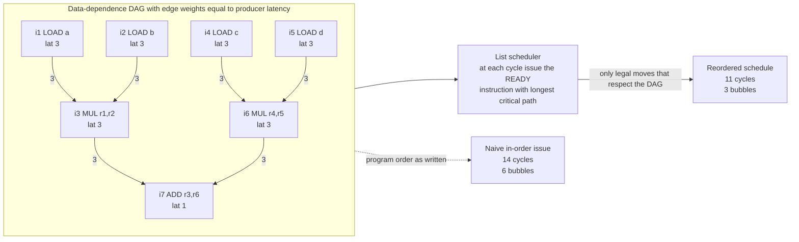

# 🧩 Instruction Scheduling and Pipelines

> [!abstract] TL;DR
> **Instruction scheduling** is a compiler back-end pass that **reorders machine instructions** so they run faster on **pipelined, superscalar** hardware. Modern CPUs overlap the *fetch → decode → execute → writeback* stages of many instructions at once and can *issue several per cycle*, but a **data hazard** — an instruction needing a result that a slow load, multiply, or divide has not finished producing — forces the pipeline to **stall**, inserting idle **bubbles**. The scheduler builds a **data-dependence DAG** (with edge weights equal to producer latencies) and slides **independent** work into those latency gaps, maximizing **instruction-level parallelism (ILP)** while respecting every dependence. The workhorse heuristic is **list scheduling**: walk the DAG in topological order, and at each cycle greedily issue the *ready* instruction with the longest **critical path** ahead of it. Optimal scheduling is **NP-hard**, so heuristics rule. It matters most for **in-order and VLIW** cores (DSPs, GPUs, Itanium), but still helps out-of-order CPUs by cutting the hardware's rescheduling work.

---

## Intuition

**Analogy — a chef cooking a multi-course meal.** Suppose one dish is a roast that takes 40 minutes in the oven, and the rest of the meal is chopping, saucing, and plating. A careless cook does the courses *in the order written on the menu*: they chop everything, plate the salad, and only *then* slide the roast in — and now they stand around for 40 idle minutes waiting for it. A good cook reads the whole recipe first, notices the roast is on the **critical path**, and **starts it immediately** so its long idle time *overlaps* with all the chopping. Same dishes, same oven, far less total time — because the slow thing's latency was *hidden* behind independent work.

A pipelined CPU is that kitchen. A `LOAD` from memory or a floating-point `MUL` is the roast: it takes several cycles before its result is usable. If the very next instruction *needs* that result, the CPU stalls — a **bubble** on the assembly line. Instruction scheduling is the compiler playing head chef: it reorders the *independent* instructions to fill those bubbles, keeping every functional unit busy. Crucially, it may only reorder work that does not depend on unfinished results — you cannot plate a sauce before you have made it. That legality constraint is exactly the **data-dependence DAG**.

---

## How It Works

### The hardware context — why reordering pays off

A **pipelined** processor splits each instruction into stages (a classic RISC five-stage pipeline is *fetch, decode, execute, memory, writeback*) and, like a factory line, keeps a different instruction in each stage every cycle — so in steady state it *retires* roughly one instruction per cycle despite each taking five cycles end to end. A **superscalar** processor goes further and issues *multiple* instructions per cycle across duplicated functional units (integer ALUs, load/store units, an FP multiplier). See [[Pipelining_and_Hazards]] and [[Superscalar_and_Out_of_Order_Execution]] for the microarchitecture.

The catch is **hazards**. A **data hazard** occurs when an instruction needs an operand that an earlier, still-in-flight instruction has not yet written back. Because real operations have **multi-cycle latencies** — a cache-hitting load might be 3–5 cycles, an FP multiply 4–5, a divide 20+ — a dependent instruction cannot issue for several cycles, and the pipeline inserts **stall cycles (bubbles)**. (Structural hazards from a busy functional unit and control hazards from branches add more.) The compiler cannot change the latencies, but it *can* change the **order**, sliding unrelated instructions into the gap so the CPU has real work to do instead of stalling.

### The goal — maximize ILP, respect dependences

The scheduler's objective is to extract **instruction-level parallelism (ILP)**: arrange instructions so that at every cycle there is independent work ready to issue, hiding the latency of long-running operations and keeping functional units saturated. It may perform *only* legal reorderings — those that preserve the program's data and control dependences.

### Dependences and the dependence DAG

Three kinds of data dependence constrain legality:

- **True / flow dependence (RAW, read-after-write)** — instruction B reads a value A writes. B *must* run after A finishes. These are *real* and cannot be removed by reordering; the DAG edges carrying producer latency are these.
- **Anti-dependence (WAR, write-after-read)** — B *overwrites* a register that A still needs to read. B must not clobber it early.
- **Output dependence (WAW, write-after-write)** — A and B write the same register; their relative order fixes who wins.

Anti- and output dependences are **false** (name) dependences — artifacts of *reusing* a register — and can often be dissolved by **register renaming** (giving one of them a fresh register), which is exactly what out-of-order hardware does. True dependences are fundamental.

From these, the scheduler builds a **data-dependence DAG (DDG)**: nodes are instructions, a directed edge `A → B` means B depends on A, and the **edge weight is A's latency** (the minimum cycles between issuing A and issuing B). A schedule is a legal topological order of this DAG that also respects the *timing* on each edge. (Dependence and liveness information comes from data-flow analysis, the subject of the forthcoming sibling note `Control_Flow_and_Data_Flow_Analysis`.)



*The two `MUL`s and the four `LOAD`s in different sub-computations are mutually independent, so the scheduler can interleave the second pair of loads into the first multiply's latency window instead of stalling.*

### List scheduling — the dominant heuristic

Finding the *optimal* schedule (minimum cycles) for a general DAG with latencies and finite functional units is **NP-hard** (a classic result; see [[NP_Completeness_and_the_Cook_Levin_Theorem]]). So real compilers use a greedy heuristic — **list scheduling**:

1. Build the dependence DAG and compute a **priority** for each node, most commonly its **critical-path length**: the longest latency-weighted path from that node to any sink. Nodes that gate the most downstream work get scheduled first.
2. Maintain a **ready list** of instructions whose predecessors are all *scheduled and whose results are available by the current cycle*.
3. Advance cycle by cycle. Each cycle, from the ready list, **greedily pick the highest-priority ready instruction** (ties broken by, e.g., program order) for each free issue slot. If nothing is ready, emit a **bubble** and advance.
4. Repeat until every instruction is placed.

This is a scheduling variant of **topological sort** (see [[Topological_Sort]]) with a priority function layered on top. It is fast (near-linear in practice), and critical-path prioritization typically lands within a few percent of optimal.

### The tension with register allocation

Scheduling and **register allocation** pull in opposite directions — the classic **phase-ordering problem**. Aggressive scheduling spreads independent computations out to expose parallelism, which *increases register pressure*: more values are simultaneously **live**, needing more physical registers. Register allocation wants the *opposite* — fewer live values, so it can color the interference graph without spilling to memory. Schedule first and you may create pressure the allocator cannot satisfy (forcing spills that reintroduce the very stalls you removed); allocate first and the allocator may reuse registers in a way that adds **false dependences** and handcuffs the scheduler. Production compilers juggle this with pre-allocation scheduling, allocation, then post-allocation re-scheduling, or with integrated (register-pressure-aware) schedulers. (Details in the forthcoming sibling `Register_Allocation`.)

### Local vs global vs software pipelining

- **Local (basic-block) scheduling** reorders within a single straight-line block. Simplest and safest, but a basic block is small, so the exploitable ILP is limited.
- **Global scheduling** moves instructions *across* basic-block boundaries to find more independent work: **trace scheduling** and **superblock scheduling** pick a hot path, schedule it as one long region, and add compensation code on the off-paths.
- **Software pipelining / modulo scheduling** is the loop analog: it overlaps *iterations* of a loop so that, in steady state, the CPU is simultaneously executing the load of iteration *i+2*, the multiply of *i+1*, and the store of *i*. It is the most powerful form of static ILP extraction and is essential on VLIW/DSP targets. (The forthcoming sibling `Loop_Optimizations` covers modulo scheduling and its interaction with unrolling.)

### In-order vs out-of-order — where the compiler matters most

- On **out-of-order** superscalar CPUs (modern x86, Apple/ARM big cores), the hardware itself buffers a window of instructions, renames registers, and **dynamically reschedules** around stalls. Here the compiler's static schedule is a *hint*: good scheduling still helps by shortening the hardware's search, reducing power, and easing the front-end, but the CPU can recover from a mediocre order.
- On **in-order** cores — DSPs, many mobile/embedded cores, GPU execution lanes, and the **VLIW** family — the hardware executes instructions in the order given and stalls literally as told. Here **static compiler scheduling is the whole game**: a bad schedule *is* the runtime penalty, with no hardware to bail you out.

### Delay slots and VLIW — history's two lessons

- **Delay slots.** Early RISC ISAs (MIPS, SPARC) exposed the pipeline directly: the instruction *after* a branch or load (the **delay slot**) always executes, so the compiler had to find a useful independent instruction to fill it or waste it with a `nop`. A leaky abstraction that tied the ISA to one pipeline depth — abandoned in modern designs.
- **VLIW / EPIC.** Very Long Instruction Word machines make the *compiler* bundle several parallel operations into one wide instruction, moving all ILP discovery to compile time to simplify the hardware. Intel's **Itanium (EPIC)** bet the farm on this. The lesson: compilers cannot statically predict cache misses and dynamic behavior as well as out-of-order hardware can react to them, so aggressive general-purpose VLIW largely lost to out-of-order superscalar — but VLIW thrives where behavior *is* predictable (DSPs, some ML accelerators). See [[ISA_Design_RISC_vs_CISC]] and [[SIMD_and_Vector_ISA]].

---

## Key Concepts

**Secondary (intuitive, no CS background needed)**
- **Assembly line / bubble** — the CPU overlaps stages of many instructions; a "bubble" is an idle slot where it waits instead of working.
- **Reorder to fill gaps** — start the slow thing early and do independent work while it finishes; same instructions, less total time.
- **You can't skip ahead unfairly** — an instruction that needs a not-yet-ready result must wait; only *independent* work can move.

**Undergraduate (architecture / compilers course)**
- **Pipeline hazards** — data (RAW), structural, and control hazards; multi-cycle latencies of loads/multiplies/divides as the source of stalls.
- **Data-dependence DAG** — RAW/WAR/WAW dependences, edges weighted by latency; legal schedules are latency-respecting topological orders.
- **List scheduling** — ready list, critical-path priority, greedy per-cycle issue; a topological-sort variant.
- **ILP** — instruction-level parallelism and how superscalar width plus scheduling exploit it.
- **False vs true dependence** — why register renaming removes WAR/WAW but never RAW.

**Graduate (advanced compilation / microarchitecture)**
- **NP-hardness of optimal scheduling** — why heuristics dominate; ILP/branch-and-bound only for tiny regions.
- **Phase-ordering with register allocation** — register-pressure-aware scheduling, pre- vs post-allocation passes, integrated approaches.
- **Global scheduling** — trace/superblock scheduling with compensation code; region formation on hot paths.
- **Software pipelining / modulo scheduling** — initiation interval, resource and recurrence constraints, iterated modulo scheduling.
- **Target machine models** — port/latency/throughput models (LLVM's scheduling model, `llvm-mca`), and static scheduling for in-order/VLIW versus hints for out-of-order.

---

## Python Demo

```python
# LIST SCHEDULING over a data-dependence DAG, from scratch.
#
# We model a SINGLE-ISSUE, IN-ORDER pipeline where an instruction issued at
# cycle c with latency L makes its result available at cycle c + L (so a
# dependent consumer may issue no earlier than c + L). One instruction issues
# per cycle; if nothing is ready, the cycle is a BUBBLE (a pipeline stall).
#
# We compare:
#   (1) NAIVE  : issue in program order, stalling whenever operands aren't ready
#   (2) LIST-SCHEDULED : greedily issue the READY instruction whose CRITICAL PATH
#                        (longest latency-weighted path to a sink) is longest
# ...then VISUALIZE the dependence DAG and a pipeline Gantt with bubbles marked.
#
# Pure standard library (heapq) + matplotlib. numpy not required.

import heapq
import matplotlib.pyplot as plt
from matplotlib.patches import Rectangle, FancyArrowPatch

# ---------------------------------------------------------------------------
# The program: compute  (a*b) + (c*d)  with slow loads and multiplies.
# Each instruction: name, op class (for coloring), latency, and predecessors.
# ---------------------------------------------------------------------------
INSTR = {
    1: dict(name="i1 LOAD a",       op="LOAD", lat=3, preds=[]),
    2: dict(name="i2 LOAD b",       op="LOAD", lat=3, preds=[]),
    3: dict(name="i3 MUL r1,r2",    op="MUL",  lat=3, preds=[1, 2]),
    4: dict(name="i4 LOAD c",       op="LOAD", lat=3, preds=[]),
    5: dict(name="i5 LOAD d",       op="LOAD", lat=3, preds=[]),
    6: dict(name="i6 MUL r4,r5",    op="MUL",  lat=3, preds=[4, 5]),
    7: dict(name="i7 ADD r3,r6",    op="ADD",  lat=1, preds=[3, 6]),
}
PROGRAM_ORDER = [1, 2, 3, 4, 5, 6, 7]

lat   = {i: INSTR[i]["lat"]   for i in INSTR}
preds = {i: INSTR[i]["preds"] for i in INSTR}
succs = {i: [] for i in INSTR}
for i in INSTR:
    for p in preds[i]:
        succs[p].append(i)

# ---------------------------------------------------------------------------
# Critical-path length: longest latency-weighted path from node to any sink,
# INCLUDING the node's own latency. This is the list-scheduling priority.
# ---------------------------------------------------------------------------
def critical_path(i, memo={}):
    if i in memo:
        return memo[i]
    best = lat[i] + max((critical_path(s) for s in succs[i]), default=0)
    memo[i] = best
    return best

CP = {i: critical_path(i) for i in INSTR}

# ---------------------------------------------------------------------------
# (1) NAIVE in-order schedule: keep program order, stall until operands ready.
# ---------------------------------------------------------------------------
def schedule_inorder(order):
    issue = {}
    next_free = 1                       # earliest cycle the single issue port is free
    for i in order:
        earliest = next_free
        for p in preds[i]:              # obey every true dependence's latency
            earliest = max(earliest, issue[p] + lat[p])
        issue[i] = earliest
        next_free = earliest + 1        # single-issue: next instr no sooner than +1
    return issue

# ---------------------------------------------------------------------------
# (2) LIST SCHEDULER: cycle-driven, greedy by critical path via a max-heap.
# ---------------------------------------------------------------------------
def schedule_list():
    issue, scheduled, cycle = {}, set(), 1
    while len(scheduled) < len(INSTR):
        ready = []                      # heap keyed by (-priority, index) -> max CP first
        for i in INSTR:
            if i in scheduled:
                continue
            if all(p in scheduled and issue[p] + lat[p] <= cycle for p in preds[i]):
                heapq.heappush(ready, (-CP[i], i))
        if ready:
            _, best = heapq.heappop(ready)
            issue[best] = cycle
            scheduled.add(best)
        cycle += 1                      # advance; if nothing issued this was a bubble
    return issue

def total_cycles(issue):
    return max(issue[i] + lat[i] for i in issue)   # cycle at which last result is ready

def bubbles(issue):
    used = set(issue.values())
    span = range(1, max(issue.values()) + 1)
    return [c for c in span if c not in used]

naive = schedule_inorder(PROGRAM_ORDER)
sched = schedule_list()

print("critical-path priority:", CP)
print(f"\nNAIVE  issue cycles: {dict(sorted(naive.items()))}")
print(f"NAIVE  total = {total_cycles(naive)} cycles, "
      f"bubbles at cycles {bubbles(naive)}")
print(f"\nSCHED  issue cycles: {dict(sorted(sched.items()))}")
print(f"SCHED  total = {total_cycles(sched)} cycles, "
      f"bubbles at cycles {bubbles(sched)}")
print(f"\nSpeedup: {total_cycles(naive)} -> {total_cycles(sched)} cycles "
      f"({total_cycles(naive) - total_cycles(sched)} stall cycles removed)")

# ===========================================================================
# VISUALIZE: dependence DAG (top) + two pipeline Gantt charts (bottom).
# ===========================================================================
COLOR = {"LOAD": "#74c0fc", "MUL": "#ffa94d", "ADD": "#8ce99a"}

fig = plt.figure(figsize=(13, 10))
gs = fig.add_gridspec(3, 1, height_ratios=[1.4, 1, 1], hspace=0.45)
ax_dag, ax_naive, ax_sched = (fig.add_subplot(gs[k]) for k in range(3))

# ---- DAG panel: layer nodes by longest path from a source ----
level = {}
def depth(i):
    if i in level:
        return level[i]
    d = 0 if not preds[i] else 1 + max(depth(p) for p in preds[i])
    level[i] = d
    return d
for i in INSTR:
    depth(i)

by_level = {}
for i in INSTR:
    by_level.setdefault(level[i], []).append(i)
pos = {}
for lv, nodes in by_level.items():
    for k, i in enumerate(sorted(nodes)):
        y = (len(nodes) - 1) / 2.0 - k     # center each layer vertically
        pos[i] = (lv * 3.0, y)

for i in INSTR:                             # edges with latency labels
    x0, y0 = pos[i]
    for s in succs[i]:
        x1, y1 = pos[s]
        ax_dag.add_patch(FancyArrowPatch((x0 + 0.55, y0), (x1 - 0.55, y1),
                          arrowstyle="-|>", mutation_scale=14,
                          color="#868e96", lw=1.4, zorder=1))
        ax_dag.text((x0 + x1) / 2, (y0 + y1) / 2 + 0.08, str(lat[i]),
                    fontsize=9, color="#c92a2a", ha="center")
for i in INSTR:                             # nodes
    x, y = pos[i]
    ax_dag.add_patch(Rectangle((x - 0.6, y - 0.28), 1.2, 0.56,
                     facecolor=COLOR[INSTR[i]["op"]], edgecolor="black", zorder=2))
    ax_dag.text(x, y, INSTR[i]["name"], ha="center", va="center",
                fontsize=8, fontweight="bold", zorder=3)
ax_dag.set_xlim(-1, max(level.values()) * 3 + 1)
ax_dag.set_ylim(-2.2, 2.2)
ax_dag.axis("off")
ax_dag.set_title("Data-dependence DAG  (red numbers = producer latency on each edge)",
                 fontsize=11)

# ---- shared Gantt renderer: rows = instruction, x = cycle, bar = [issue, issue+lat] ----
def gantt(ax, issue, title):
    T = max(issue.values()) + max(lat.values())
    for c in bubbles(issue):                # shade stall cycles across all rows
        ax.axvspan(c - 1, c, color="#f1f3f5", zorder=0)
        ax.text(c - 0.5, len(INSTR) + 0.4, "bubble", rotation=90,
                fontsize=7, color="#adb5bd", ha="center", va="bottom")
    for i in INSTR:                         # program index on the y-axis (fixed order)
        row = len(INSTR) - i
        c = issue[i]
        ax.add_patch(Rectangle((c - 1, row - 0.4), lat[i], 0.8,
                     facecolor=COLOR[INSTR[i]["op"]], edgecolor="black", zorder=2))
        ax.text(c - 1 + lat[i] / 2, row, INSTR[i]["name"].split()[0],
                ha="center", va="center", fontsize=8, fontweight="bold", zorder=3)
    ax.set_xlim(0, T)
    ax.set_ylim(0, len(INSTR) + 1)
    ax.set_yticks([len(INSTR) - i for i in INSTR])
    ax.set_yticklabels([f"i{i}" for i in INSTR])
    ax.set_xticks(range(0, T + 1))
    ax.set_xlabel("cycle")
    ax.grid(axis="x", color="#dee2e6", zorder=0)
    ax.set_title(f"{title}   total = {total_cycles(issue)} cycles, "
                 f"{len(bubbles(issue))} bubbles", fontsize=11)

gantt(ax_naive, naive, "NAIVE in-order")
gantt(ax_sched, sched, "LIST-SCHEDULED")

fig.suptitle("List scheduling hides load/multiply latency by filling pipeline bubbles",
             fontsize=13, y=0.98)
plt.savefig("instruction_scheduling.png", dpi=130, bbox_inches="tight")
print("\nSaved DAG + pipeline Gantt to instruction_scheduling.png")
```

Running it prints the critical-path priorities (the four loads score 7, the two multiplies 4, the add 1), then the two schedules. The **naive** in-order order issues at cycles `{i1:1, i2:2, i3:5, i4:6, i5:7, i6:10, i7:13}` and finishes in **14 cycles with 6 bubbles** — it stalls right after each pair of loads because it immediately tries to multiply. The **list-scheduled** order interleaves the second pair of loads into the first multiply's latency window, issuing at `{i1:1, i2:2, i4:3, i5:4, i3:5, i6:7, i7:10}` and finishing in **11 cycles with 3 bubbles**. Same instructions, same latencies, three stall cycles removed purely by legal reordering. The saved figure shows the dependence DAG (edges labeled with producer latency) above two pipeline Gantt charts, with the shaded "bubble" columns visibly shrinking from the naive to the scheduled timeline.

---

## Real-World Applications

> **Example — LLVM's `MachineScheduler`.** After instruction selection and before/around register allocation, LLVM runs a target-parameterized list scheduler on the machine-instruction DAG. Each back end supplies a **scheduling model** (`TargetSchedModel`) describing per-instruction **latencies**, **functional-unit ports**, and **issue width**; the generic `MachineScheduler` uses that model to order instructions while a *register-pressure tracker* keeps it from spilling. You can literally see the model at work with `llvm-mca`, which simulates the pipeline of a given CPU and reports stalls, port pressure, and ILP for a block of assembly.

Where instruction scheduling is decisive in practice:

- **In-order mobile and embedded cores.** ARM Cortex-A5x/A7x little cores and Cortex-M microcontrollers execute in order; the compiler's schedule *is* the performance, so `-O2`/`-O3` scheduling directly determines cycle counts and energy.
- **DSPs and VLIW accelerators.** TI C6000 DSPs, Qualcomm Hexagon, and many ML/NPU accelerators are VLIW: the compiler must **bundle** parallel operations and **software-pipeline** inner loops, or the wide issue slots sit empty.
- **GPUs.** Each SIMT lane executes in program order; NVIDIA's `ptxas` and AMD's shader compiler schedule to hide memory and math latency (interleaving independent warps' work at the ISA level), a major factor in kernel throughput. See [[GPU_Architecture_and_CUDA]].
- **The Itanium/EPIC experiment.** Intel Itanium exposed all ILP to the compiler (explicit bundles, predication, speculation). It proved how far static scheduling *and* its limits go — the reason mainstream CPUs kept out-of-order hardware.
- **Out-of-order x86/ARM big cores.** Even here GCC's `-fschedule-insns2` and LLVM scheduling help: a good static order reduces reorder-buffer pressure, front-end bottlenecks, and power, and matters most for code the hardware window is too small to reorder across.
- **JIT compilers.** V8, HotSpot C2, and .NET's RyuJIT schedule at run time, trading compile speed for enough reordering to feed the pipeline on hot paths.

---

## Common Pitfalls

- **Reordering across a true (RAW) dependence.** Moving a consumer ahead of its producer, or ignoring the *latency* on the edge (issuing the consumer one cycle after the producer when the result needs three), silently corrupts results. Legality is defined by the dependence DAG *including edge timing*, not just topological order.
- **Forgetting false dependences block the scheduler.** WAR/WAW (name) dependences from register *reuse* pin instructions in place even though no real data flows. If you allocate registers before scheduling without renaming, you hand the scheduler artificial chains and it cannot reorder. Rename or schedule on virtual registers first.
- **Ignoring register pressure (the phase-ordering trap).** Scheduling purely for ILP can raise the number of simultaneously live values past the physical register count, forcing **spills** to memory whose latency reintroduces the stalls you removed — a net loss. Use register-pressure-aware scheduling.
- **Assuming out-of-order hardware makes scheduling pointless.** The reorder buffer is finite (a few hundred instructions); it cannot see far enough to fix a badly clustered schedule, and it costs power to do dynamically what the compiler could do for free. Static scheduling still helps.
- **Using a wrong or generic latency model.** Scheduling with default latencies instead of the *target's* real load/multiply/divide latencies and port constraints produces a schedule tuned for the wrong machine. Always drive the scheduler with the target model (and validate with tools like `llvm-mca`).
- **Chasing optimal schedules.** Optimal list scheduling is NP-hard; branch-and-bound over a whole function will blow up. Greedy critical-path list scheduling is the right default; reserve exhaustive search for tiny hot kernels.

---

## Related Concepts

- [[Pipelining_and_Hazards]] — the microarchitecture that creates bubbles: pipeline stages, data/structural/control hazards, and multi-cycle latencies the scheduler hides.
- [[Superscalar_and_Out_of_Order_Execution]] — multi-issue and dynamic hardware rescheduling; explains why static scheduling matters most for in-order cores and still helps out-of-order ones.
- [[ISA_Design_RISC_vs_CISC]] — how instruction set design (delay slots, VLIW/EPIC bundles) shifts the ILP burden between compiler and hardware.
- [[SIMD_and_Vector_ISA]] — wide/vector execution where compiler bundling and scheduling fill parallel issue slots.
- [[GPU_Architecture_and_CUDA]] — in-order SIMT lanes where the shader/PTX compiler's schedule and latency hiding drive kernel throughput.
- [[Branch_Prediction]] — the control-hazard counterpart; branches and their misprediction penalties constrain global scheduling across blocks.
- [[Topological_Sort]] — the graph-ordering backbone of list scheduling; a legal schedule is a priority-guided topological order of the dependence DAG.
- [[NP_Completeness_and_the_Cook_Levin_Theorem]] — why optimal scheduling is intractable and heuristics dominate.
- [[Reductions_and_NP_Complete_Problems]] — the reduction machinery that classifies scheduling among NP-hard problems.
- [[Compilers_Overview]] — the whole pipeline; instruction scheduling is a back-end pass alongside instruction selection and register allocation.

*(Forthcoming Compilers siblings referenced in prose — `Code_Generation_and_Instruction_Selection`, `Register_Allocation`, `Loop_Optimizations`, and `Control_Flow_and_Data_Flow_Analysis` — are not yet in the vault and are intentionally left unlinked.)*

---

## Review Questions

1. **(Conceptual)** Using the chef-and-roast analogy, explain why *true (RAW)* dependences are the only ones that fundamentally limit reordering, while *anti (WAR)* and *output (WAW)* dependences can be eliminated. What single hardware technique dissolves the false ones, and what is its compiler-side equivalent?
2. **(Scenario)** You are compiling the same numeric kernel for two targets: an in-order ARM Cortex-M microcontroller and a wide out-of-order Apple CPU. Explain how much effort the compiler's scheduler should spend on each and why, and what specifically the out-of-order machine can and cannot recover from a mediocre static schedule.
3. **(Trade-off)** A colleague reports that turning on aggressive instruction scheduling *slowed down* a hot loop. Give the most likely explanation in terms of the interaction between scheduling and register allocation, describe how you would confirm it, and name two mitigations.

---

## Sources

- Cooper, K., Torczon, L. *Engineering a Compiler*, 3rd ed. Morgan Kaufmann, 2022 — Chapter 12, "Instruction Scheduling," covering the dependence DAG, list scheduling, and regional/global techniques.
- Aho, A., Lam, M., Sethi, R., Ullman, J. *Compilers: Principles, Techniques, and Tools*, 2nd ed. Pearson, 2006 — Chapter 10, "Instruction-Level Parallelism," including software pipelining.
- Hennessy, J., Patterson, D. *Computer Architecture: A Quantitative Approach*, 6th ed. Morgan Kaufmann, 2017 — Chapter 3 on ILP, hazards, static vs dynamic scheduling, and VLIW/EPIC.
- Muchnick, S. *Advanced Compiler Design and Implementation*. Morgan Kaufmann, 1997 — detailed treatment of scheduling, register allocation, and their phase-ordering interaction.
- LLVM Project. "MachineScheduler" and "Writing an LLVM Backend / TargetSchedModel" documentation, plus the `llvm-mca` machine-code analyzer ([llvm.org/docs](https://llvm.org/docs/)).

---

#compilers #instruction-scheduling #pipelining #list-scheduling #ilp
