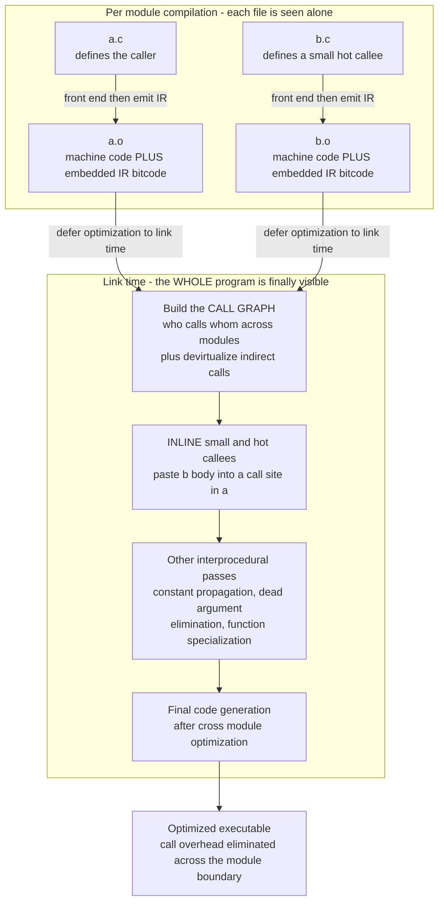

# 🔗 Interprocedural and Link-Time Optimization

> [!abstract] TL;DR
> **Interprocedural optimization (IPO)** looks *across* function calls instead of one function at a time, letting the compiler relax the worst-case assumptions it must make at every call boundary — and its single most important transformation is **inlining**, which replaces a call with the callee's body, killing call overhead *and* exposing the callee to the caller's context for further optimization. The catch: traditional **separate compilation** hands each source file to the compiler alone, so it can't see across module boundaries; the linker just concatenates object files. **Link-time optimization (LTO)** breaks that wall by emitting **IR (e.g. LLVM bitcode) into object files** and deferring the interprocedural passes to *link time*, when the whole program is finally visible. The payoff is real production speed and size wins; the cost is build time, memory, and debuggability.

---

## Intuition

**Analogy — editing a book chapter by chapter vs. reading the whole thing.** Imagine you are the editor of a long technical book, and you edit each chapter *in complete isolation*, never reading the others. You can tighten the prose *within* chapter 3, but you have no idea that chapter 3 always jumps to chapter 7 with the exact same setup paragraph, or that chapter 12 is a single short page every other chapter quotes verbatim. Editing each chapter alone is **intraprocedural** optimization: you make locally good edits but must assume the worst about everything outside the chapter — "some other chapter might depend on this, so I dare not touch it."

**Interprocedural** optimization is what a good editor does: read the *whole book* first. Now you can see that the tiny chapter 12 is quoted everywhere, so you **paste it inline** where it is used and delete the cross-reference (that is **inlining**). You notice chapter 3 always calls chapter 7 with the identical argument, so you **specialize** chapter 7 for that value and delete the now-redundant parameter (**interprocedural constant propagation** and **dead-argument elimination**).

But there is a publishing-house complication. In a big shop each chapter is **typeset and printed separately** by a different press (**separate compilation**), and the **binder** at the end merely staples the finished pages together in order (**the linker**) — the binder can't re-edit prose. **Link-time optimization** is the fix: instead of sending the binder *finished printed pages*, each press hands over the *editable manuscript* (the **IR**), and a final editor reads all the manuscripts together at binding time and does the cross-chapter edits *then*, just before the book goes to print.

---

## How It Works

### Core Mechanics

**1. Why per-function optimization is conservative.** A classic optimizer works one function at a time (this is *intraprocedural*, the world of `Local_and_Global_Optimizations`). At every **call site** it hits a wall of ignorance: it does not know the callee's side effects, whether the callee's pointer arguments alias the caller's memory, or what concrete values the arguments hold. To stay correct it must assume the *worst case* — "the call might clobber every reachable memory location" — which pessimizes register allocation, blocks code motion across the call, and defeats constant propagation. **Interprocedural analysis** relaxes these assumptions by actually *looking across the call* to learn the callee's real behavior.

**2. The call graph — the substrate for everything.** Interprocedural analysis runs over the **call graph**: a directed graph whose nodes are functions and whose edges are "caller → callee" call sites. It is a graph-theory object (`Graph_Representation`), and the interesting analyses are graph traversals — you often process it **bottom-up** (callees before callers, a reverse-`Topological_Sort` order) so a callee's summary is ready when you analyze its caller, and you use **`Strongly_Connected_Components`** to find the mutually-recursive cycles that would otherwise make a naive bottom-up pass loop forever. Building the call graph is easy for direct calls but *hard* when the target is a **function pointer**, a **virtual method**, or a **dynamically dispatched** message: you must first do **call-graph construction** / points-to analysis to figure out which functions an indirect call can actually reach. Resolving a virtual call to a single concrete target is **devirtualization**, and it is what *unlocks* inlining of polymorphic code.

**3. Inlining — the workhorse.** Inlining replaces a call `y = f(a, b)` with a fresh copy of `f`'s body, wiring the arguments in. Two distinct wins:
- **Direct win:** the call/return sequence, argument marshaling, and stack-frame setup vanish. For a tiny hot callee this overhead can dominate its actual work.
- **Cascading win (usually the bigger one):** once the body is pasted into the caller, it is exposed to the caller's context. Constants the caller passes now **propagate into the callee**, branches become dead, common subexpressions merge, and further inlining opportunities open up *inside* the freshly inlined code. Inlining is the enabler that makes the other optimizations fire.

The **cost** is code-size growth: every inlined call site is another copy of the body. Bigger code means **instruction-cache pressure** and, past a point, *more* stalls than you saved — the very failure the demo below quantifies. So real compilers use an **inlining heuristic** that weighs benefit against size: inline callees that are **small** (cheap to copy) or **hot** (called often, so overhead removal pays off), throttle recursion with an **inline depth** limit, and stop before the program stops fitting in cache.

**4. Other interprocedural optimizations.** Beyond inlining: **interprocedural constant propagation** (a parameter that is always the same constant is baked in), **dead-argument / dead-return elimination**, **function specialization / cloning** (make a bespoke copy of a function for one hot call pattern), **devirtualization**, **escape analysis** (if an object never escapes its allocating function you can stack-allocate it or scalar-replace it — the same analysis that lets a `Garbage_Collection`-managed runtime avoid heap traffic), whole-program **alias / points-to analysis**, and **tail-call optimization**.

**5. The separate-compilation problem and LTO.** Traditionally each `.c` / `.cpp` is compiled to an object file *independently* and the **linker** (`Linkers_and_Loaders`) merely concatenates sections and resolves symbols — it never re-optimizes. So a hot callee in `b.c` can *never* be inlined into a caller in `a.c`; the module boundary is an optimization firewall. **Link-time optimization** dissolves the firewall: the compiler emits its **intermediate representation** (LLVM **bitcode**, GCC **GIMPLE**) *into* the object files instead of, or alongside, final machine code. At **link time** a plugin loads *all* the IR together, builds the whole-program call graph, runs the interprocedural passes across module boundaries, and only *then* does final code generation. **Monolithic LTO** merges everything into one giant IR module (maximal optimization, poor scalability). **ThinLTO** keeps modules separate but exchanges compact *function summaries* and a global call-graph index, then does cross-module inlining/import in parallel — nearly the quality of full LTO at a fraction of the memory and with incremental, parallel builds.

**6. Whole-program limits — closed vs. open world.** True whole-program optimization assumes a **closed world**: every caller and callee is visible. **Dynamic libraries, `dlopen` plugins, and separately-shipped modules** break that assumption (**open world**) — you cannot devirtualize a call if a future subclass might be loaded at runtime, and you cannot delete an "unused" exported function a plugin might call. LTO's reach stops at the boundary of what is linked in.

**7. Profile-guided synergy.** The inliner's hardest question is *which* calls are hot. A **profile** answers it directly (see `Profile_Guided_and_Adaptive_Optimization`): PGO + LTO together let the compiler inline exactly the edges that dominate runtime and leave cold code compact. This pairing (Clang/GCC `-flto` plus PGO, or ThinLTO) is what production ships.

### Flow / Architecture



*Without LTO the two object files would already be finished machine code and the linker could only staple them together. By carrying IR into the object files and deferring optimization, LTO lets the callee in `b.c` be inlined into the caller in `a.c` — an edit impossible under plain separate compilation.*

---

## Key Concepts

**Secondary (intuitive, no CS background needed)**
- **A function call has a cost** — jumping to another routine and coming back is not free; doing it billions of times adds up.
- **Copy-paste a tiny helper** — if a one-line helper is used everywhere, pasting it in place is faster than calling it, but pastes more code overall.
- **See the whole program, not one file** — you can only remove a redundant call if you can see *both* the caller and the callee at once.
- **Bigger is not always faster** — too much pasted code overflows the fast on-chip memory (cache) and can slow things back down.

**Undergraduate (a first compilers / systems course)**
- **Intraprocedural vs. interprocedural** — one function at a time (conservative at call sites) vs. reasoning across calls to relax those assumptions.
- **The call graph** as a directed graph; direct vs. indirect calls; bottom-up processing order; recursion as cycles (SCCs).
- **Inlining mechanics and the size/speed tradeoff** — the direct win (removed overhead) vs. the cascading win (exposed optimizations) vs. the code-size / i-cache cost, mediated by a heuristic on callee size and hotness.
- **Separate compilation and the linker as an optimization firewall** — why `.o` files block cross-module optimization.
- **LTO in one sentence** — emit IR into object files, optimize across modules at link time, then generate code.
- **Interprocedural constant propagation, dead-argument elimination, devirtualization** as concrete IPO passes.

**Graduate (advanced compilation)**
- **Call-graph construction under indirect dispatch** — points-to / class-hierarchy analysis, rapid type analysis (RTA), speculative devirtualization with runtime guards and deoptimization.
- **Context-sensitive interprocedural data-flow analysis** — call-strings vs. functional (summary) approaches, the IFDS/IDE frameworks, and the precision/scalability tradeoff.
- **Inlining as an optimization problem** — bottom-up vs. top-down (priority-guided) inlining, cost models, the interaction of inlining order with abstract-interpretation-based specialization; recursion inlining and unrolling budgets.
- **ThinLTO's architecture** — per-module summaries, the combined global index, cross-module function importing, parallel and incremental backends; distributed LTO in large build systems.
- **Escape / points-to analysis across calls** — enabling stack allocation, scalar replacement, and lock elision; the same machinery a JIT uses for `Garbage_Collection` allocation elimination.
- **Open-world constraints** — how dynamic linking, `dlopen`, and symbol interposition (LTO visibility / `-fvisibility`, `internalize`) bound whole-program assumptions.

---

## Python Demo

```python
# Demonstrate INLINING on a CALL GRAPH. We model a small program's functions
# (each with a code SIZE) and its call sites (each with a dynamic CALL COUNT =
# how HOT it is, and whether the caller passes a CONSTANT argument that unlocks
# specialization once inlined). We then decide which calls to inline with a
# COST HEURISTIC -- "inline callees no larger than a size threshold" -- and
# quantify the tradeoff as the threshold rises:
#     BENEFIT = eliminated call overhead + specialization gains  (cycles saved)
#     COST    = pasted code-size growth  -> instruction-cache pressure
# Increasing the threshold inlines more: benefit rises then PLATEAUS while size
# cost keeps CLIMBING, and once big callees are pasted the program overflows the
# i-cache and NET improvement collapses. Pure stdlib + matplotlib (numpy optional).

import matplotlib.pyplot as plt

# ---- 1. Model a small program as a CALL GRAPH --------------------------------
FUNC_SIZE = {                      # code size of each function, in instructions
    "main": 30, "parse": 40, "compute": 15,
    "format": 25, "hot_helper": 6, "clamp": 3, "log": 50,
}

# (caller, callee, dynamic_call_count, const_arg_enables_specialization)
CALL_SITES = [
    ("main",    "parse",       1,     False),
    ("main",    "compute",     100,   True),
    ("main",    "log",         1,     False),
    ("parse",   "format",      200,   False),
    ("compute", "clamp",       5000,  True),    # tiny + extremely hot -> ideal
    ("compute", "hot_helper",  3000,  False),   # small + hot
    ("compute", "log",         2,     False),   # huge + cold -> never worth it
    ("format",  "clamp",       1500,  True),
]

CALL_SAVE = 6      # cycles saved per eliminated call/return + arg setup
SPEC_SAVE = 4      # extra cycles saved per call when a const arg specializes body
BASE_SIZE = sum(FUNC_SIZE.values())
ICACHE    = BASE_SIZE + 45         # code fits until inlining bloats it past this
ALPHA     = 45                     # i-cache-miss penalty weight beyond the budget

def inline_decision(threshold):
    """Inline every call site whose CALLEE is no larger than `threshold`
    (the classic 'inline the small callees' heuristic), and score the result."""
    inlined, benefit, size_cost = [], 0, 0
    for caller, callee, calls, const_arg in CALL_SITES:
        if FUNC_SIZE[callee] <= threshold:
            inlined.append((caller, callee))
            per_call = CALL_SAVE + (SPEC_SAVE if const_arg else 0)
            benefit  += calls * per_call
            size_cost += FUNC_SIZE[callee]           # one pasted copy per site
    total_size = BASE_SIZE + size_cost
    over       = max(0, total_size - ICACHE)
    penalty    = ALPHA * over * over                 # quadratic i-cache cliff
    return inlined, benefit, size_cost, total_size, penalty, benefit - penalty

# ---- 2. Sweep the inlining threshold and record the tradeoff -----------------
thresholds = list(range(0, 56))
benefits = [inline_decision(t)[1] for t in thresholds]
costs    = [inline_decision(t)[2] for t in thresholds]
best_t   = max(thresholds, key=lambda t: inline_decision(t)[5])

# ---- 3. Report the decision at the net-optimal threshold ---------------------
inlined, benefit, size_cost, total_size, penalty, net = inline_decision(best_t)
print(f"Net-optimal inlining threshold found by the heuristic: {best_t} instrs\n")
print("Inlined call sites (small / hot callees pasted into their callers):")
for caller, callee in inlined:
    print(f"   {caller:8s} -> {callee:10s}  callee size {FUNC_SIZE[callee]}")
skipped = [(c, e) for c, e, *_ in CALL_SITES if (c, e) not in set(inlined)]
print("Left OUT of line (too big -- pasting them would blow the i-cache):")
for caller, callee in skipped:
    print(f"   {caller:8s} -> {callee:10s}  callee size {FUNC_SIZE[callee]}")
print(f"\nCall overhead + specialization saved : {benefit:,} cycles")
print(f"Code-size growth                     : +{size_cost} instrs "
      f"(total {total_size}, i-cache budget {ICACHE})")
print(f"i-cache penalty                      : {penalty:,} cycles")
print(f"NET improvement                      : {net:,} cycles")

# ---- 4. Visualize: call graph (before/after) + the tradeoff curves -----------
fig = plt.figure(figsize=(14, 6))
axg = fig.add_subplot(1, 2, 1)
axc = fig.add_subplot(1, 2, 2)

POS = {  # hand-placed call-graph layout (root at top, leaves at bottom)
    "main": (0.0, 3.0), "parse": (-1.7, 2.0), "compute": (1.7, 2.0),
    "format": (-1.7, 1.0), "hot_helper": (0.7, 1.0),
    "log": (2.7, 1.0), "clamp": (0.7, 0.0),
}
inlined_set = set(inlined)
for caller, callee, calls, const_arg in CALL_SITES:
    x0, y0 = POS[caller]; x1, y1 = POS[callee]
    is_inlined = (caller, callee) in inlined_set
    axg.annotate("", xy=(x1, y1), xytext=(x0, y0),
        arrowprops=dict(arrowstyle="-|>",
            color="#e8590c" if is_inlined else "#adb5bd",
            lw=1.0 + (calls ** 0.5) / 12.0, shrinkA=20, shrinkB=20))
for fn, (x, y) in POS.items():
    small_enough = FUNC_SIZE[fn] <= best_t
    axg.scatter([x], [y], s=2300, zorder=3, edgecolors="black",
                color="#ffd8a8" if small_enough else "#d0ebff")
    axg.text(x, y, f"{fn}\n[{FUNC_SIZE[fn]}]", ha="center", va="center",
             fontsize=8, zorder=4)
axg.set_title(f"Call graph  (orange = INLINED at threshold {best_t})\n"
              "node label [n] = code size, edge width ~ hotness", fontsize=10)
axg.axis("off"); axg.margins(0.15)

l1, = axc.plot(thresholds, benefits, color="#2b8a3e", lw=2.2,
               label="Performance benefit (cycles saved)")
axc.set_xlabel("Inlining size threshold  (inline callees no larger than this)")
axc.set_ylabel("Cycles saved", color="#2b8a3e")
axc.tick_params(axis="y", labelcolor="#2b8a3e")
axc2 = axc.twinx()
l2, = axc2.plot(thresholds, costs, color="#c92a2a", lw=2.2, ls="--",
                label="Code-size cost (instructions added)")
axc2.set_ylabel("Instructions added", color="#c92a2a")
axc2.tick_params(axis="y", labelcolor="#c92a2a")
axc.axvline(best_t, color="#1971c2", ls=":", lw=2)
axc.text(best_t + 1, max(benefits) * 0.45,
         f"net-optimal\nthreshold = {best_t}", color="#1971c2", fontsize=9)
axc.set_title("The inlining tradeoff\nbenefit rises then plateaus; "
              "size cost keeps climbing", fontsize=10)
axc.legend(handles=[l1, l2], loc="center right", fontsize=8)

plt.tight_layout()
plt.savefig("inlining_tradeoff.png", dpi=130)
print("\nSaved call graph + inlining-tradeoff plot to inlining_tradeoff.png")
```

Running it, the heuristic inlines the **tiny, blistering-hot `clamp`** (size 3, called 6,500 times across two sites, and specializable) and **`hot_helper`** (size 6), plus the moderately hot **`compute`** — but deliberately leaves the large **`log`** (size 50, nearly cold), **`format`**, and **`parse`** *out of line*, because pasting them would push the program past the instruction-cache budget and the quadratic cache-miss penalty would swamp the trivial call overhead they save. The plotted curves make the tradeoff visible: the green **benefit** curve leaps up as soon as `clamp` becomes inlinable and then **plateaus** (the remaining callees are cold), while the red **size-cost** curve keeps **climbing linearly** and finally explodes when the big callees cross the threshold — so **net** improvement peaks at a *moderate* threshold, exactly where production inliners aim.

---

## Real-World Applications

> **Example — ThinLTO in Chrome and Android.** Google ships Chrome and the Android platform built with **ThinLTO** (Clang/LLVM). Each translation unit is compiled to an object file carrying **LLVM bitcode** plus a compact *summary*; the linker's LTO plugin builds a **combined global index**, decides cross-module function *imports* and inlines from the summaries, and then runs per-module backends **in parallel** — recovering most of monolithic LTO's speed and size wins without its memory blowup or serial link. Combined with **PGO**, ThinLTO delivers double-digit-percent performance and meaningful binary-size improvements on codebases far too large for full LTO. This is `Compiler_Toolchains_and_LLVM` and `Linkers_and_Loaders` working together at scale.

Where interprocedural / link-time optimization shows up:

- **`-flto` in Clang and GCC.** The standard production switch to enable cross-module inlining, interprocedural constant propagation, and dead-code stripping across the whole program; `-flto=thin` selects the scalable ThinLTO path.
- **C++ devirtualization + inlining.** Whole-program (or LTO) visibility lets the compiler prove a virtual call has a single target, devirtualize it, and then inline it — turning idiomatic polymorphic C++ into straight-line code. Combined with `-fwhole-program-vtables`.
- **The JVM / V8 / .NET JITs.** Managed runtimes do interprocedural optimization *dynamically*: HotSpot and V8 inline hot callees observed at runtime, speculatively devirtualize monomorphic call sites, and **deoptimize** if the speculation is later violated — the open-world version of these ideas (`Profile_Guided_and_Adaptive_Optimization`).
- **Rust and Swift.** Both lower to LLVM IR and benefit from cross-crate / cross-module inlining and LTO; Rust's `#[inline]` hints and `codegen-units` / `lto` cargo settings expose the same tradeoff directly to developers.
- **Escape analysis for allocation elision.** Go's compiler and JVM JITs use interprocedural escape analysis to stack-allocate objects that never escape, removing `Garbage_Collection` pressure — an interprocedural analysis with a direct runtime payoff.

---

## Common Pitfalls

- **Over-inlining bloats the binary and *slows* it down.** Chasing "inline everything" past the size sweet spot increases instruction-cache misses and TLB pressure until you lose more than you saved — exactly the collapse the demo's net curve shows. Inlining is a *budgeted* transformation, not a free one.
- **Expecting LTO to see across a dynamic-library boundary.** LTO optimizes only what is *linked into the same LTO unit*. Symbols behind a shared object, a `dlopen`ed plugin, or an interposable exported symbol stay opaque — the **open-world** assumption forbids devirtualizing or deleting them. Marking internal symbols `hidden` / `internalize` is what lets LTO actually act.
- **Broken or missing call graph for indirect calls.** Function pointers, virtual calls, and dynamic dispatch produce edges the compiler cannot resolve without points-to / class-hierarchy analysis. An incomplete call graph silently disables interprocedural passes on that code — or, if built unsoundly, produces *wrong* code. Devirtualization must be provably safe or guarded.
- **Assuming `inline` (the keyword) forces inlining.** In C/C++ the `inline` keyword is chiefly a *linkage* rule (permit multiple definitions); the *decision* is the compiler's heuristic. Conversely, `__attribute__((always_inline))` and `[[gnu::noinline]]` are the real hammers — and misusing them fights the cost model.
- **Recursion without a depth/size budget.** Inlining a recursive call inlines a copy that contains another call to itself; without an **inline-depth** cap this either loops or explodes code size. Self-recursive and SCC cycles in the call graph need special handling.
- **Ignoring the build-cost and debuggability tax.** LTO moves heavy optimization to *link* time, so the link step becomes long and memory-hungry, incremental builds suffer, and inlined/cloned frames confuse debuggers and profilers (`-g` line info gets muddier). The performance win must be weighed against slower iteration.
- **Forgetting the profile.** Without PGO the inliner *guesses* which edges are hot from static heuristics (loop depth, call-site count) and often guesses wrong. IPO/LTO and PGO are complementary, not alternatives.

---

## Related Concepts

- [[Compilers_Overview]] — the full pipeline; interprocedural/link-time optimization is the middle-end's most powerful, and most expensive, stage.
- [[Graph_Representation]] — the **call graph** is a directed graph; every interprocedural analysis is a graph algorithm over it.
- [[DFS]] — depth-first traversal of the call graph underlies reachability, cycle detection, and bottom-up analysis ordering.
- [[Strongly_Connected_Components]] — SCCs identify mutually-recursive function groups that a bottom-up interprocedural pass must treat as a unit.
- [[Topological_Sort]] — processing callees before callers (reverse-topological order) so each callee's summary is ready when its caller is analyzed.

*(Forthcoming Compilers siblings referenced above in prose — `Local_and_Global_Optimizations`, `Linkers_and_Loaders`, `Profile_Guided_and_Adaptive_Optimization`, `Compiler_Toolchains_and_LLVM`, `Garbage_Collection`, `Code_Generation_and_Instruction_Selection`, and `Intermediate_Representations` — are not yet created, so they are named in backticks rather than linked.)*

---

## Review Questions

1. **(Conceptual)** A compiler optimizing one function at a time must assume the worst at every call site. Give two *specific* worst-case assumptions it is forced to make, and explain for each how *inlining the callee* removes the assumption and unlocks a downstream optimization.
2. **(Scenario)** You have a hot leaf function `clamp(x, lo, hi)` (5 instructions) called 20 million times from three different modules, and a 400-instruction `serialize()` called twice at startup. Under `-flto`, which does the inliner choose to inline and which does it leave out of line, and *why* — argue from the benefit-vs-code-size cost model, not from a rule of thumb.
3. **(Trade-off)** Your team's C++ service gains 12% throughput from monolithic LTO + PGO, but link time jumps from 40 s to 9 min, peak linker RAM triples, and crash backtraces become hard to read. Explain how **ThinLTO** changes each of those four costs, what it gives up relative to full LTO, and how the **open-world** problem (a `dlopen`ed plugin) still bounds what any of these can achieve.

---

## Sources

- Aho, A., Lam, M., Sethi, R., Ullman, J. *Compilers: Principles, Techniques, and Tools*, 2nd ed. Pearson, 2006 — Chapter 12, interprocedural analysis and the call graph ("the Dragon Book").
- Cooper, K., Torczon, L. *Engineering a Compiler*, 3rd ed. Morgan Kaufmann, 2022 — inlining, interprocedural analysis, and optimization ordering.
- Muchnick, S. *Advanced Compiler Design and Implementation*. Morgan Kaufmann, 1997 — Chapters 19–20, interprocedural analysis, call-graph construction, and procedure integration (inlining).
- Johnson, T., Amini, M., Li, D. "ThinLTO: Scalable and Incremental LTO." *IEEE/ACM CGO*, 2017 — the design of ThinLTO's summary-based, parallel link-time optimization ([research.google/pubs/thinlto](https://research.google/pubs/thinlto-scalable-and-incremental-lto/)).
- LLVM Project. "LLVM Link Time Optimization: Design and Implementation." *LLVM documentation* — how bitcode in object files enables cross-module optimization ([llvm.org/docs/LinkTimeOptimization.html](https://llvm.org/docs/LinkTimeOptimization.html)).

---

#compilers #inlining #link-time-optimization #interprocedural #whole-program
