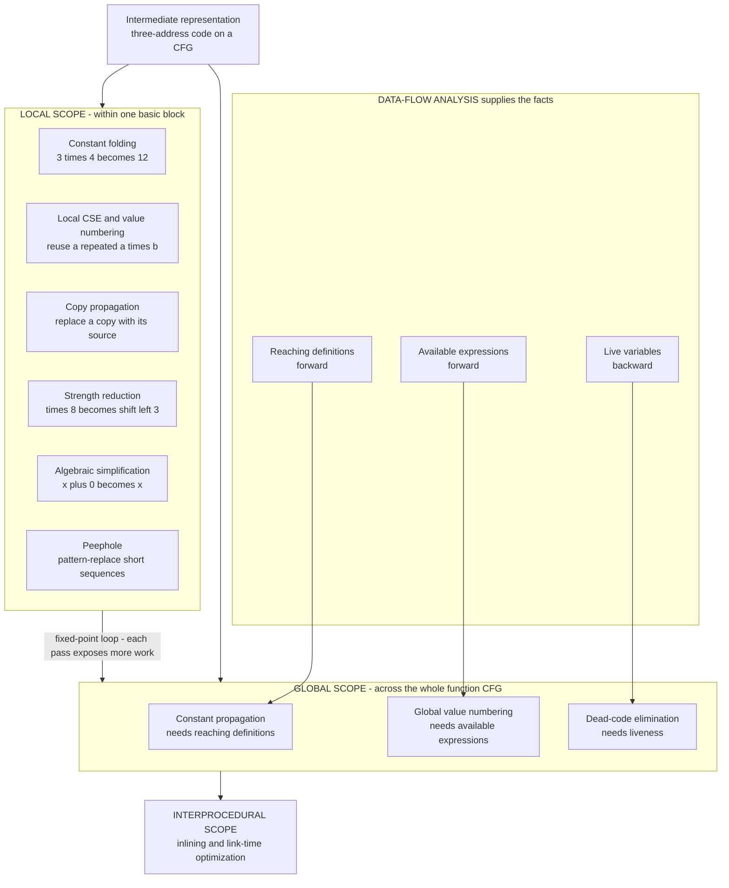

# 🛠️ Local and Global Optimizations

> [!abstract] TL;DR
> A compiler **optimization** is a *semantics-preserving* transformation of a program's intermediate representation that makes the code **run faster and/or take less space while computing the identical result**. The classic catalog — **constant folding**, **constant/copy propagation**, **common-subexpression elimination (CSE)**, **dead-code elimination (DCE)**, **strength reduction**, **algebraic simplification**, and **peephole** rewriting — is applied at three widening **scopes**: **local** (within one basic block), **global** (across the whole control-flow graph of a function, powered by **data-flow analysis**), and **interprocedural** (across function boundaries). The golden rule dwarfs all cleverness: an optimization must **preserve observable behavior**; if it changes what the program *does*, it is not an optimization, it is a bug.

---

## Intuition

**Analogy — a great copy-editor tightening a manuscript without changing its meaning.** Hand a skilled editor a wordy draft and watch what they do, one red-pen pass at a time:

- They notice the author wrote **"two plus two"** and just replace it with **"four"** — the value never changes, so why make the reader compute it? *(This is **constant folding**: evaluate `3 * 4` to `12` at compile time.)*
- They spot the **same long phrase repeated three times** and rewrite it once, referring back to it afterward. *(This is **common-subexpression elimination**: compute `a * b` once, reuse the result.)*
- They **delete a whole paragraph nobody ever reads** — it feeds into nothing later in the argument. *(This is **dead-code elimination**: drop computations whose results are never used.)*
- They replace a **copy of a copy** ("the aforementioned value, which is x") with the original word **x**. *(This is **copy propagation**.)*
- They swap an **expensive construction for a cheaper synonym that means exactly the same thing** — "multiply by eight" becomes "shift the digits." *(This is **strength reduction**.)*

Every edit obeys one non-negotiable rule: **the meaning must survive intact**. A compiler's optimizer is precisely this editor working on your code's intermediate representation — tightening it into something faster and smaller that still produces the *same answer*. Note the word "optimization" is a flattering misnomer: like the editor, the compiler *improves* the draft; it almost never reaches the provably *optimal* one (that is undecidable in general — see [[The_Halting_Problem_and_Undecidability]]).

---

## How It Works

### Core Mechanics

Optimizations run in the compiler's **middle end**, transforming the machine-independent **intermediate representation** (IR) — most often **three-address code** laid out over a **control-flow graph (CFG)** of **basic blocks** (straight-line instruction runs with one entry and one exit). The optimizer's building blocks, roughly in increasing scope:

**1. Constant folding.** Evaluate any expression whose operands are all compile-time constants. `t = 3 * 4` becomes `t = 12`. The runtime never does the multiply.

**2. Constant propagation.** If a variable is known to hold a constant, substitute that constant into later uses. `x = 12; y = x + 2` becomes `y = 12 + 2`, which folding then collapses to `y = 14`. Folding and propagation feed each other.

**3. Copy propagation.** When one variable is a plain copy of another (`b = a`), replace later uses of `b` with `a`. This exposes the copy as dead so DCE can delete it.

**4. Common-subexpression elimination (CSE) and value numbering.** If the same expression is computed twice with the same operand values, compute it once and reuse the result. **Local CSE** works inside a block with a hash table of expressions (a form of **value numbering**); **global value numbering** extends this across the CFG. Hashing expressions to canonical "value numbers" is exactly the [[Hash_Table_Fundamentals|hash-table]] trick applied to code.

**5. Dead-code elimination (DCE).** Remove any instruction whose result is **never used** on any path to the program's outputs, provided it has no side effects. DCE is driven by **liveness analysis** — a variable is *live* at a point if its current value may be read later.

**6. Strength reduction.** Replace an expensive operation with a cheaper one of equal value: `x * 8` becomes `x << 3`, `x / 2` becomes a shift, and in loops an induction-variable multiply becomes a running add.

**7. Algebraic simplification.** Apply identities: `x + 0 → x`, `x * 1 → x`, `x * 0 → 0`, `x - x → 0`, `x & x → x`.

**8. Peephole optimization.** Slide a small window over the emitted instruction stream and pattern-replace short, obviously-improvable sequences (a redundant load after a store, a jump to the next instruction, `push`/`pop` pairs).

**Scope — the three widening rings.**

- **Local** — within a **single basic block**. No branches to reason about, so no data-flow analysis is needed; local CSE, local constant folding, and local copy propagation are cheap and always safe.
- **Global** — across **all blocks of one function**, following the CFG's branches and merges. This requires **data-flow analysis** to prove facts hold on *every* path. It is called "global" in the classical (Dragon Book) sense of *whole-function*, not whole-program.
- **Interprocedural** — across **function boundaries**: **inlining**, interprocedural constant propagation, and **link-time optimization (LTO)**. Covered in the forthcoming `Interprocedural_and_Link_Time_Optimization` sibling; **loop-specific** transforms live in `Loop_Optimizations`.

**Data-flow analysis is the engine of global optimization.** Three classic analyses each unlock one optimization by computing facts that hold across the CFG (the framework itself is the subject of the forthcoming `Control_Flow_and_Data_Flow_Analysis` sibling):

| Analysis | Direction | Fact it computes | Optimization it enables |
|---|---|---|---|
| **Reaching definitions** | forward | which assignments may reach here | constant / copy propagation |
| **Available expressions** | forward | which expressions are already computed and still valid | global CSE |
| **Live variables** | backward | which values may be read later | dead-code elimination |

**Static single assignment (SSA) makes these sparse and simple.** In SSA form each variable is assigned exactly *once*, so "which definition reaches this use?" has a single, syntactic answer — no data-flow fixed point needed for propagation, and CSE/DCE become nearly trivial. This is why every serious optimizer (LLVM, GCC's GIMPLE, V8's Sea-of-Nodes) is built on SSA; the mechanics live in the forthcoming `Static_Single_Assignment_Form` sibling. *(The Python demo below uses single-assignment temporaries precisely so propagation and CSE are safe without a redefinition check.)*

**Phase ordering — the deep, unsolved problem.** Optimizations **enable one another**: constant propagation exposes dead branches, which DCE removes, which exposes more constants, which enables more folding. But they can also *disable* one another, and no order is best for all programs — choosing an order is a genuinely hard search problem. Real compilers respond by (a) fixing a hand-tuned **pass pipeline** and (b) **running passes to a fixed point** (repeat until nothing changes). LLVM's `PassManager` and GCC's pass list encode decades of this tuning; the toolchain view is the forthcoming `Compiler_Toolchains_and_LLVM` sibling.

**Undefined behavior — the controversial power source.** In languages like C/C++, the standard declares certain operations **undefined** (signed overflow, out-of-bounds access, null deref). The optimizer is permitted to **assume they never happen**, which unlocks aggressive rewrites — but if the programmer *does* trigger UB, the "optimization" produces surprising, sometimes dangerous results. This tension (aggressive optimization vs predictability) is why UB is both a performance gift and a footgun, and why type/language design (the forthcoming `Type_Checking_and_Type_Systems` sibling) matters so much.

**Correctness first, always.** Because a wrong optimization is among the worst possible bugs (it silently miscompiles *correct* source), the field's mandate is *correctness before speed*. The ultimate expression of this is **formally verified compilation** (CompCert), where each transformation carries a machine-checked proof that it preserves semantics — the topic of the forthcoming `Formal_Semantics_and_Verified_Compilers` sibling.

### Flow / Architecture



*Local optimizations need no analysis; global optimizations are unlocked by data-flow facts; every pass may expose fresh opportunities for the others, so the pipeline is iterated toward a fixed point.*

---

## Key Concepts

**Secondary (intuitive, no CS background needed)**
- **Same answer, less work** — optimization changes *how* the program computes, never *what* it computes.
- **Precompute the obvious** — if the answer is fixed ahead of time, bake it in *(constant folding)*.
- **Don't repeat yourself** — compute a repeated thing once and reuse it *(common-subexpression elimination)*.
- **Delete what nobody reads** — remove work whose result is never used *(dead-code elimination)*.
- **"Optimize" means "improve," not "perfect"** — the compiler makes it better, rarely the best possible.

**Undergraduate (a first compilers course)**
- **Basic block and control-flow graph** — the straight-line unit of *local* optimization and the graph that *global* optimization traverses.
- **The classic catalog** — folding, constant/copy propagation, CSE, DCE, strength reduction, algebraic simplification, peephole.
- **Local vs global vs interprocedural scope** — widening rings of visibility and cost.
- **Data-flow analysis** — reaching definitions (propagation), available expressions (CSE), liveness (DCE); iterate to a fixed point over a lattice.
- **Optimization levels** — `-O0` (none, debuggable) through `-O1/-O2/-O3` (increasing aggressiveness) and `-Os` (optimize for size).

**Graduate (advanced compilation)**
- **SSA form** — single-assignment IR that makes propagation, CSE, and DCE sparse and near-trivial; phi-nodes at merges.
- **Global value numbering and partial-redundancy elimination** — CSE generalized across the CFG and along partial paths.
- **Phase-ordering as search** — the interaction, enabling, and disabling of passes; iterative and superoptimization approaches.
- **Undefined behavior as an optimization enabler** — the semantic license the compiler exploits, and its safety/predictability costs.
- **Verified optimization** — semantics-preserving proofs (CompCert, Alive2 for LLVM peephole rules); *translation validation*.
- **Profile-guided and adaptive optimization** — using measured behavior to drive inlining, layout, and specialization *(forthcoming `Profile_Guided_and_Adaptive_Optimization` sibling)*.

---

## Python Demo

```python
# A tiny OPTIMIZATION PIPELINE over three-address code (TAC).
# We run four classic, semantics-preserving passes on one sample program:
#   1. CONSTANT FOLDING            evaluate 3 * 4 to 12 at compile time
#   2. CONSTANT / COPY PROPAGATION substitute known constants and copies, then re-fold
#   3. COMMON-SUBEXPRESSION ELIM   reuse a repeated x * y instead of recomputing
#   4. DEAD-CODE ELIMINATION       drop assignments whose results are never used (liveness)
# We print the code before/after each pass, count instructions removed, PROVE the
# optimized code computes the identical result, and VISUALIZE the shrink + transforms.
# The TAC is single-assignment (each temp written once) so propagation and CSE are
# safe without a redefinition check -- exactly why real optimizers use SSA form.
# Pure standard library + matplotlib.

from collections import namedtuple
import operator
import matplotlib.pyplot as plt

# An instruction is:  dst = a op b     (binary)   e.g. Instr('t5','+','t3','t4')
#                or:  dst = a          (copy)     e.g. Instr('t1','copy',12,None)
# Operands are int literals (constants) or str variable names.
Instr = namedtuple("Instr", ["dst", "op", "a", "b"])
APPLY = {"+": operator.add, "-": operator.sub, "*": operator.mul, "//": operator.floordiv}

def is_lit(x):
    return isinstance(x, int)

def fmt(ins):
    if ins.op == "copy":
        return f"{ins.dst} = {ins.a}"
    return f"{ins.dst} = {ins.a} {ins.op} {ins.b}"

def show(title, prog):
    print(f"\n{title}  ({len(prog)} instructions)")
    for ins in prog:
        print("   " + fmt(ins))

# --- A concrete TAC interpreter, to PROVE meaning is preserved. -------------
def evaluate(prog, inputs):
    env = dict(inputs)
    for ins in prog:
        if ins.op == "copy":
            env[ins.dst] = ins.a if is_lit(ins.a) else env[ins.a]
        else:
            a = ins.a if is_lit(ins.a) else env[ins.a]
            b = ins.b if is_lit(ins.b) else env[ins.b]
            env[ins.dst] = APPLY[ins.op](a, b)
    return env

# --- PASS 1: constant folding. Both operands literal => evaluate now. -------
def constant_folding(prog):
    out, folds = [], 0
    for ins in prog:
        if ins.op != "copy" and is_lit(ins.a) and is_lit(ins.b):
            out.append(Instr(ins.dst, "copy", APPLY[ins.op](ins.a, ins.b), None))
            folds += 1
        else:
            out.append(ins)
    return out, folds

# --- PASS 2: constant + copy propagation. Substitute known copies. ---------
def propagate(prog):
    known, out, subs = {}, [], 0     # known: var -> literal or source var
    for ins in prog:
        def sub(o):
            nonlocal subs
            if isinstance(o, str) and o in known:
                subs += 1
                return known[o]
            return o
        ni = Instr(ins.dst, ins.op, sub(ins.a), sub(ins.b) if ins.b is not None else None)
        out.append(ni)
        if ni.op == "copy":
            known[ni.dst] = ni.a     # remember this variable's known value/source
        else:
            known.pop(ni.dst, None)
    return out, subs

def fold_prop_fixpoint(prog):
    total_f = total_s = 0
    while True:
        propd, s = propagate(prog)
        folded, f = constant_folding(propd)
        total_f += f; total_s += s
        if folded == prog:
            return folded, total_f, total_s
        prog = folded

# --- PASS 3: common-subexpression elimination (local value numbering). -----
def cse(prog):
    seen, out, elim = {}, [], 0
    for ins in prog:
        if ins.op in ("+", "-", "*", "//"):
            operands = tuple(sorted([str(ins.a), str(ins.b)])) \
                if ins.op in ("+", "*") else (str(ins.a), str(ins.b))  # commutativity
            key = (ins.op, operands)
            if key in seen:
                out.append(Instr(ins.dst, "copy", seen[key], None))    # reuse earlier result
                elim += 1
                continue
            seen[key] = ins.dst
        out.append(ins)
    return out, elim

# --- PASS 4: dead-code elimination, driven by backward liveness. -----------
def dce(prog, outputs):
    live = set(outputs)
    kept = []
    for ins in reversed(prog):
        if ins.dst in live:                 # result is needed -> keep
            kept.append(ins)
            live.discard(ins.dst)
            for o in (ins.a, ins.b):        # its operands become live
                if isinstance(o, str):
                    live.add(o)
    kept.reverse()
    return kept, len(prog) - len(kept)

# ---------------------------------------------------------------------------
# SAMPLE PROGRAM.  Inputs x, y are unknown at compile time (they stay symbolic,
# which keeps x * y a genuine CSE opportunity rather than a foldable constant).
#   t1 = 3 * 4        -> foldable to 12
#   t2 = t1 + 2       -> after propagation, 12 + 2 -> 14
#   t3 = x * y        -> not constant
#   t4 = x * y        -> DUPLICATE of t3  (CSE will reuse t3)
#   t5 = t3 + t4      -> after CSE+prop becomes t3 + t3
#   d1 = x + 5        -> DEAD: never used anywhere
#   t6 = t5 + t2      -> after prop becomes t5 + 14
#   result = t6       -> the only OUTPUT
# ---------------------------------------------------------------------------
program = [
    Instr("t1", "*", 3, 4),
    Instr("t2", "+", "t1", 2),
    Instr("t3", "*", "x", "y"),
    Instr("t4", "*", "x", "y"),
    Instr("t5", "+", "t3", "t4"),
    Instr("d1", "+", "x", 5),
    Instr("t6", "+", "t5", "t2"),
    Instr("result", "copy", "t6", None),
]
OUTPUTS = {"result"}
INPUTS = {"x": 6, "y": 7}

gold = evaluate(program, INPUTS)["result"]         # the answer we must preserve

show("STAGE 0 - Original", program)
counts = [len(program)]

p1, f1 = constant_folding(program)
show("STAGE 1 - Constant folding", p1);              counts.append(len(p1))
p2, f2, s2 = fold_prop_fixpoint(p1)
show("STAGE 2 - Const/copy propagation (+ re-fold)", p2); counts.append(len(p2))
p3a, cse_n = cse(p2)
p3, s3 = propagate(p3a)
show("STAGE 3 - Common-subexpression elimination", p3);   counts.append(len(p3))
p4, removed = dce(p3, OUTPUTS)
show("STAGE 4 - Dead-code elimination", p4);              counts.append(len(p4))

# --- Prove correctness: same result, fewer instructions. -------------------
opt = evaluate(p4, INPUTS)["result"]
print(f"\nRESULT CHECK  original -> {gold}   optimized -> {opt}   "
      f"{'PRESERVED' if gold == opt else 'BROKEN!'}")
print(f"INSTRUCTIONS  {len(program)} -> {len(p4)}   "
      f"({len(program) - len(p4)} removed, {100*(len(program)-len(p4))//len(program)}% smaller)")

# ---------------------------------------------------------------------------
# VISUALIZE: (left) instruction count through the pipeline;
#            (right) transformations applied by each pass.
# ---------------------------------------------------------------------------
stages = ["Original", "Folding", "Propagation", "CSE", "DCE"]
fig, (axL, axR) = plt.subplots(1, 2, figsize=(13, 5))

axL.plot(stages, counts, "-o", color="#1f77b4", lw=2, markersize=9)
for x, c in enumerate(counts):
    axL.annotate(str(c), (x, c), textcoords="offset points", xytext=(0, 10),
                 ha="center", fontweight="bold")
axL.set_ylim(0, max(counts) + 2)
axL.set_ylabel("instructions")
axL.set_title("Instruction count through the pipeline\n"
              "folding, propagation and CSE expose dead code; DCE reaps it")
axL.grid(axis="y", alpha=0.3)

passes = ["Constant\nfolding", "Const/copy\npropagation", "CSE", "Dead-code\nelim"]
transforms = [f1 + f2, s2 + s3, cse_n, removed]
bars = axR.bar(passes, transforms,
               color=["#ffd8a8", "#b2f2bb", "#a5d8ff", "#ffc9c9"], edgecolor="black")
for b, t in zip(bars, transforms):
    axR.text(b.get_x() + b.get_width() / 2, b.get_height() + 0.08, str(t),
             ha="center", fontweight="bold")
axR.set_ylabel("transformations applied")
axR.set_title("What each pass did\n(all semantics-preserving)")
axR.set_ylim(0, max(transforms) + 1)

plt.tight_layout()
plt.savefig("optimization_pipeline.png", dpi=130)
print("\nSaved visualization to optimization_pipeline.png")
```

Running it prints the program shrinking from **8 instructions to 4** (`t3 = x * y`, `t5 = t3 + t3`, `t6 = t5 + 14`, `result = t6`) while the **result stays 98** for `x = 6, y = 7`. The key lesson is visible in the count plot: folding, propagation, and CSE keep the instruction count *flat at 8* — they don't delete anything themselves, they **transform code so that DCE can finally remove four instructions**. That flat-line-then-cliff is exactly the **phase-ordering** phenomenon: optimizations pay off by *enabling* each other, so real compilers iterate them to a fixed point rather than running each once.

---

## Real-World Applications

> **Example — LLVM's `-O2` pipeline, the optimizer behind Clang, Rust, and Swift.** When you compile with `clang -O2`, LLVM runs dozens of these exact passes over its SSA-based IR: `InstCombine` (algebraic simplification + peephole), `SCCP` (sparse conditional constant propagation = folding + propagation + dead-branch removal in one lattice pass), `GVN` (global value numbering = CSE across the CFG), `EarlyCSE`, `DCE`/`ADCE` (aggressive dead-code elimination via liveness), and strength-reduction inside `LoopStrengthReduce`. Crucially, LLVM runs many of these **repeatedly to a fixed point** because each exposes work for the others — precisely the phase-ordering interaction the demo shows in miniature.

Where these optimizations show up in production:

- **Every optimizing native compiler.** GCC (on its GIMPLE SSA IR) and LLVM implement the full classic catalog; `-O0` disables them for debuggability, `-O2` is the production default, `-Os`/`-Oz` trade speed for size.
- **JIT compilers.** The [[JVM_Execution_Model|JVM's]] HotSpot C2 compiler and V8's TurboFan build an SSA "sea of nodes" and run folding, GVN, and DCE on *hot* methods at run time — plus speculative optimizations an ahead-of-time compiler cannot do because they need runtime type feedback.
- **Strength reduction on real hardware.** Compilers turn `x * 8` into `x << 3` and `x % 8` into a mask because shifts/ands are single-cycle while multiply/divide are not — a transformation whose payoff depends on the target [[ISA_Design_RISC_vs_CISC|instruction set]] (see [[RISCV_ISA_Fundamentals]] for one such target and [[Bit_Manipulation]] for the bit tricks).
- **Databases and ML compilers.** PostgreSQL and Spark Catalyst constant-fold and eliminate common subexpressions in query plans; XLA and TVM run CSE and DCE over tensor graphs before emitting GPU kernels.
- **Verified and validated optimizers.** CompCert ships proofs that its passes preserve C semantics; Alive2 formally checks LLVM's peephole rules for correctness — the correctness-first mandate made literal.

---

## Common Pitfalls

- **Assuming "optimization" means "optimal."** It almost never does. Producing provably optimal code is undecidable in general (reduces to questions like [[The_Halting_Problem_and_Undecidability|the halting problem]]); compilers apply *heuristic improvements* that usually help and occasionally don't.
- **Breaking observable behavior.** Reordering or eliminating operations that have side effects (I/O, `volatile` reads, atomics, memory ordering) silently miscompiles correct code. The transformation is only legal if it preserves *observable* behavior on *all* inputs — the single hardest and most important constraint.
- **Optimizing across undefined behavior surprises.** In C/C++, the compiler may *assume* UB (signed overflow, OOB access) never happens and delete "impossible" checks. Code that relies on UB "working" breaks at higher `-O` levels. This is a language-semantics issue, not a compiler bug.
- **CSE/propagation without respecting redefinitions or aliasing.** Reusing a "previously computed" `a * b` is only valid if `a` and `b` have not changed and no aliased pointer wrote through them since. The demo sidesteps this via single assignment; real compilers need **available-expressions** analysis and **alias analysis** to be safe.
- **Believing DCE handles side-effecting code.** Dead-code elimination may remove an instruction only if its result is unused *and* it has no side effects. Deleting a call that prints or frees memory is not DCE, it is a miscompile.
- **Ignoring phase ordering and fixed points.** Running each pass exactly once leaves easy wins on the table, because passes enable each other. Conversely, an unlucky order can *hide* opportunities. Skipping iteration is a classic naive-optimizer mistake.
- **Trusting intuition over measurement.** Not every "optimization" helps on real hardware (it can raise register pressure, hurt cache behavior, or bloat code). Every transform must be validated by **benchmarks**; adaptive compilers use **profile-guided optimization** to decide.

---

## Related Concepts

- [[Compilers_Overview]] — the full pipeline; optimization is the middle-end stage between IR generation and code generation.
- [[The_Halting_Problem_and_Undecidability]] — why perfect optimization (and many precise program analyses) is undecidable, forcing heuristics and conservative approximation.
- [[Hash_Table_Fundamentals]] — the data structure behind value numbering and local CSE: hash each expression to a canonical value number.
- [[ISA_Design_RISC_vs_CISC]] — the target architecture that determines which strength reductions and peephole rewrites actually pay off.
- [[RISCV_ISA_Fundamentals]] — a concrete back-end target whose cheap shifts/adds make strength reduction worthwhile.
- [[Bit_Manipulation]] — the shift/mask identities that strength reduction and algebraic simplification exploit.
- [[Assembly_Programming]] — the level at which peephole optimization operates on the final instruction stream.
- [[JVM_Execution_Model]] — a runtime that JIT-applies these same optimizations to hot code using runtime profiles.

*(Forthcoming Compilers siblings referenced in prose — `Intermediate_Representations`, `Control_Flow_and_Data_Flow_Analysis`, `Static_Single_Assignment_Form`, `Loop_Optimizations`, `Interprocedural_and_Link_Time_Optimization`, `Profile_Guided_and_Adaptive_Optimization`, `Compiler_Toolchains_and_LLVM`, `Type_Checking_and_Type_Systems`, `Formal_Semantics_and_Verified_Compilers` — will be linked once created.)*

---

## Review Questions

1. **(Conceptual)** Using the copy-editor analogy, explain why **local** optimizations (within one basic block) need *no* data-flow analysis while **global** optimizations do. What changes when control flow branches and merges, and which specific analysis (reaching definitions, available expressions, liveness) does each of constant propagation, CSE, and DCE depend on?
2. **(Scenario)** You compile a hot function and find that constant folding alone removes zero instructions, yet after also running propagation and DCE the function shrinks by 40%. Explain, in terms of **phase ordering** and passes *enabling* one another, why folding "did nothing" on its own, and why a real compiler runs these passes to a **fixed point** rather than once each.
3. **(Trade-off)** A team reports that their C program behaves correctly at `-O0` but produces wrong output at `-O2`. Give two distinct plausible causes — one involving **undefined behavior** and one involving a missing **side-effect/aliasing** constraint — and explain why "the optimizer is buggy" is usually *not* the right first conclusion. How would formally verified compilation (CompCert) or a checker like Alive2 change your confidence?

---

## Sources

- Aho, A., Lam, M., Sethi, R., Ullman, J. *Compilers: Principles, Techniques, and Tools*, 2nd ed. Pearson, 2006 — Chapters 8–9 on the code-optimization catalog and data-flow analysis ("the Dragon Book").
- Cooper, K., Torczon, L. *Engineering a Compiler*, 3rd ed. Morgan Kaufmann, 2022 — modern, SSA-and-optimization-centric treatment (value numbering, DCE, scope of optimization).
- Muchnick, S. *Advanced Compiler Design and Implementation*. Morgan Kaufmann, 1997 — the encyclopedic reference on global and interprocedural optimizations.
- Lattner, C., Adve, V. "LLVM: A Compilation Framework for Lifelong Program Analysis and Transformation." *CGO*, 2004 — the reusable, IR-centric optimizer used by Clang/Rust/Swift ([llvm.org](https://llvm.org)).
- Leroy, X. "Formal verification of a realistic compiler." *Communications of the ACM*, 2009 — CompCert and the case for optimizations proven to preserve semantics.

---

#compilers #optimization #dead-code-elimination #constant-folding #common-subexpression
