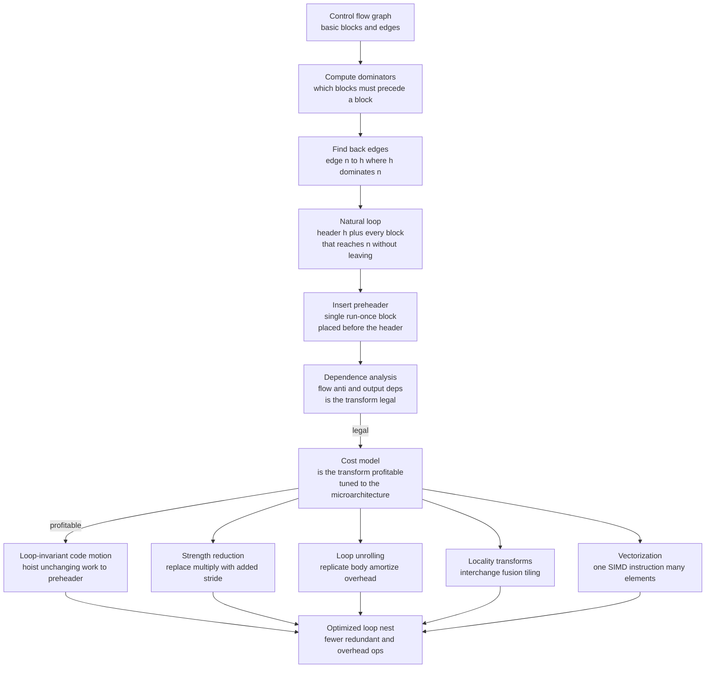

# 🔁 Loop Optimizations

> [!abstract] TL;DR
> **Loop optimizations** are the compiler transformations aimed squarely at loops, because that is where programs spend almost all of their execution time — the empirical **90/10 rule**: roughly 90% of the run time is burned inside about 10% of the code, and that hot 10% is nearly always a loop nest. The compiler first **identifies natural loops** in the control-flow graph (via **back edges** and **dominators**), builds a **preheader**, then applies transformations that each preserve meaning while cutting work: **loop-invariant code motion** (hoist computations that never change out of the loop), **induction-variable strength reduction** (turn a per-iteration `i*4` into a running add of the stride), **loop unrolling** (replicate the body to amortize branch/counter overhead and expose instruction-level parallelism), **loop interchange / tiling / fusion** (restructure memory access for cache locality), and **auto-vectorization** (rewrite a scalar loop into SIMD instructions that process many elements per instruction). Every one of these is gated by two independent questions: is it **legal** — proven by **dependence analysis** — and is it **profitable** — judged by a **cost model** tuned to the target microarchitecture.

---

## Intuition

**Analogy — the assembly line, not the sketch on the whiteboard.** Imagine you run a workshop and you have to stamp a logo onto a million identical mugs. There are two very different kinds of "improvement" you could make. You could reorganize the *paperwork you fill out once* at the start of the day — that helps a little. Or you could improve the *single motion you repeat a million times* — even shaving a fraction of a second off one stamp, multiplied by a million, dwarfs everything else. That repeated inner motion is the loop, and it is the only thing worth obsessing over.

Now think about what a smart line manager actually does. If a worker walks to the same shelf to fetch the *same* jig before *every* mug, the manager moves that jig to the workbench *once* before the run starts — that is **loop-invariant code motion**. If the worker measures out a distance with a ruler each time, the manager instead lets them keep a running tally and just add the fixed step — that is **strength reduction**. If the start-stop of "grab one mug, stamp, put it down, reach for the next" wastes motion, the manager batches four mugs per reach — that is **loop unrolling**. And if the machine can stamp four mugs in a single press, the manager feeds it four at a time — that is **vectorization**. Loop optimization is exactly this manager's craft, applied automatically to machine code: attack the hottest repeated work, because that is where every saved instruction is multiplied a million-fold.

Crucially, the manager can only do any of this if it is *safe*: you cannot batch or reorder steps if step 5 depends on the result of step 3. Deciding what is safe is **dependence analysis**, and it is the hard, mathematical heart of the whole field.

---

## How It Works

### Core Mechanics

The pipeline from "a pile of basic blocks" to "an optimized loop nest" runs in stages. This note assumes you have already met control-flow and data-flow analysis; the sibling note `Control_Flow_and_Data_Flow_Analysis` builds the CFG, and `Local_and_Global_Optimizations` covers the block-level and whole-function transforms that loop optimization sits on top of.

**1. Find the loops — natural loops from back edges and dominators.** A compiler does not see `for` and `while` keywords by the time it optimizes; it sees a **control-flow graph (CFG)** of basic blocks. A loop is recovered structurally. Block `h` **dominates** block `n` if every path from the entry to `n` must pass through `h`. A **back edge** is a CFG edge `n → h` where the target `h` *dominates* the source `n`. Each back edge defines exactly one **natural loop**: the header `h`, plus every block that can reach `n` without going through `h`. This gives loop nesting (loops whose blocks are subsets of others are inner loops), loop headers, and the invariant region. *(Details: `Control_Flow_and_Data_Flow_Analysis`.)*

**2. Build a preheader.** The compiler inserts a **preheader** — a single, guaranteed-once block placed immediately before the header, on the path from outside the loop. It is the parking spot for anything hoisted *out* of the loop: code placed there runs exactly once no matter how many iterations execute. Working on **static single assignment (SSA)** form (sibling `Static_Single_Assignment_Form`) makes the "does this value change in the loop?" question almost trivial, because each variable has exactly one definition.

**3. Loop-invariant code motion (LICM).** A computation is **loop-invariant** if all of its operands are constants, or are defined *outside* the loop, or are themselves loop-invariant. LICM finds these to a fixpoint and **hoists** them into the preheader, so `b*c` computed identically on every iteration is computed once. Legality caveats: the instruction must dominate all loop exits (or be safe to speculate) and must have no side effects.

**4. Induction-variable analysis and strength reduction.** An **induction variable** advances by a fixed amount each iteration (the loop counter `i`, or anything derived from it like `i*4` for an array offset). **Strength reduction** replaces an expensive operation recomputed each time — a multiply `addr = base + i*4` — with a cheaper one: keep a running `addr` and *add* the stride `4` every iteration. Multiplies become adds; on many machines this is a real win and it also feeds address generation.

**5. Loop unrolling.** Replicate the body `u` times and step the counter by `u`. This **amortizes loop overhead** (the increment, compare, and conditional branch happen once per `u` iterations instead of once each) and, more importantly, **exposes instruction-level parallelism** so the [[Superscalar_and_Out_of_Order_Execution|out-of-order engine]] and the pipeline have independent work to overlap. The cost is **code size** (bigger loop body, more instruction-cache pressure) and a **remainder loop** for iteration counts not divisible by `u`. Choosing `u` is the classic **unroll-factor tradeoff** covered by the cost model. *(Ties to `Instruction_Scheduling_and_Pipelines` and [[Pipelining_and_Hazards]].)*

**6. Locality transforms — interchange, fusion/fission, tiling.** These reshape *memory access*, not arithmetic. **Loop interchange** swaps the order of nested loops so the innermost stride walks memory contiguously (row-major order), converting cache-miss-heavy column traversal into cache-friendly row traversal. **Loop fusion** merges two adjacent loops over the same range so data touched by both is reused while still hot in cache; **fission** splits one loop to isolate a vectorizable part or reduce register pressure. **Loop tiling (blocking)** restructures a loop nest to operate on sub-blocks that fit in cache — the standard trick that makes matrix multiply fast. All of these are about the [[Cache_Hierarchy|memory hierarchy]] and the OS-level [[Memory_Hierarchy_and_Caching|caching behavior]], not the ALU.

**7. Vectorization (SIMD).** **Auto-vectorization** rewrites a scalar loop so each vector instruction processes several array elements at once — 4, 8, 16, or more per instruction on wide [[SIMD_and_Vector_ISA|SIMD / AVX]] hardware. The speedup is large but the analysis is hard: the compiler must prove no **aliasing** (do two pointers overlap?), no cross-iteration **dependence** that would be violated by doing elements in parallel, and often must handle **alignment** and a scalar remainder. This is why real auto-vectorizers are fragile and why performance code so often falls back to hand-written intrinsics.

**8. Dependence analysis — the legality gate.** None of steps 5–7 is safe without proving it preserves the program's meaning. **Data dependences** come in three kinds: **flow (true, read-after-write)**, **anti (write-after-read)**, and **output (write-after-write)**. Compilers compute **dependence-distance and direction vectors** across loop iterations to decide which reorderings and parallelizations are legal. The **polyhedral model** represents loop iterations as points in a geometric space and dependences as affine constraints, enabling powerful, composable transformations (used by LLVM's Polly and the isl library). *(See `Parallelizing_and_GPU_Compilation`.)*

**9. Legality vs profitability — two separate questions.** A transformation must be **correct** *and* **worthwhile**. Dependence analysis answers legality; a **cost model** answers profitability. Unrolling too aggressively bloats the instruction cache and can *slow code down*; vectorizing a loop with short trip counts or misaligned data can lose to scalar code. Because the payoff of a good decision is multiplied across the whole loop, compilers can justify expensive analysis here — and this is exactly where **profile-guided optimization** (`Profile_Guided_and_Adaptive_Optimization`) earns its keep, telling the compiler which loops are actually hot and what their real trip counts are.

### Flow / Architecture



*The two diamonds — dependence analysis and the cost model — are the gatekeepers. Legality is a proof about correctness; profitability is a bet about the hardware. A transform must clear both.*

---

## Key Concepts

**Secondary (intuitive, no CS background needed)**
- **The 90/10 rule** — most of a program's time is spent in a tiny fraction of its code, almost always a loop; that is where optimization pays off.
- **Do setup once** — if the same fixed work is repeated every lap, do it before the race starts (loop-invariant code motion).
- **Batch the repeated motion** — handling several items per "grab and reset" wastes less effort than one at a time (unrolling).
- **Don't break the order that matters** — you can only reorder or batch steps that don't depend on each other's results (dependence).

**Undergraduate (a first compilers course)**
- **Natural loops, back edges, dominators, headers, and preheaders** — how loops are recovered structurally from the CFG.
- **Loop-invariant code motion** — the fixpoint that identifies unchanging computations and hoists them.
- **Induction variables and strength reduction** — turning per-iteration multiplies into running adds.
- **Loop unrolling and the unroll-factor tradeoff** — overhead amortization and ILP versus code size and a remainder loop.
- **Locality transforms** — interchange for stride, fusion/fission for reuse, tiling/blocking for cache-sized working sets.
- **Data dependences** — flow (RAW), anti (WAR), and output (WAW), and why they constrain legal reordering.

**Graduate (advanced compilation)**
- **Dependence distance and direction vectors** — the vector algebra of when a loop transform is legal.
- **The polyhedral model** — iteration spaces as integer polyhedra, dependences as affine constraints, and composable transformations (Polly, isl, Pluto).
- **Auto-vectorization internals** — SLP vs loop vectorization, alignment and remainder handling, if-conversion and masking, and why aliasing defeats it.
- **Automatic parallelization** — proving iterations independent for multicore threads and [[GPU_Architecture_and_CUDA|GPU]] offload, and the DOALL/DOACROSS distinction.
- **Cost models and machine tuning** — modeling issue width, cache levels, prefetching, and [[Branch_Prediction|branch prediction]] to decide unroll factors and vector widths.
- **Interaction with SSA and scalar evolution** — LLVM's `ScalarEvolution` (SCEV) as the analysis backbone for induction variables and trip counts.

---

## Python Demo

```python
# Demonstrates two classic loop optimizations on a loop written in
# THREE-ADDRESS CODE (TAC), then MODELS the performance payoff.
#
#   1. LOOP-INVARIANT CODE MOTION (LICM): find instructions whose operands
#      never change across iterations and HOIST them into a run-once preheader.
#   2. LOOP UNROLLING: replicate the (post-LICM) loop body by a factor u so the
#      per-iteration loop overhead (increment, compare, branch) is amortized.
#
# Finally we MODEL dynamic instruction count and static code size versus the
# unroll factor and plot both -- showing diminishing returns and the code-size
# tradeoff. Pure standard library + matplotlib (no numpy required).

import matplotlib.pyplot as plt

# ---------------------------------------------------------------------------
# A tiny three-address-code loop. Each instruction is (dest, arg1, op, arg2).
# op == None means a copy/load "dest = arg1". A store looks like ("A[i]", "t4").
# The loop computes, for i in 0..N-1:   A[i] = (b*c + base) + i*s
# where b, c, base, s are all set BEFORE the loop (loop-invariant),
# and i is the induction variable.
# ---------------------------------------------------------------------------
LOOP_VAR = "i"
# Names defined/modified INSIDE the loop body (targets on the left-hand side):
LOOP_BODY = [
    ("t1", "b", "*", "c"),      # invariant: b, c not written in the loop
    ("t2", "t1", "+", "base"),  # invariant: t1 invariant, base from outside
    ("t3", "i", "*", "s"),      # NOT invariant: depends on the induction var i
    ("t4", "t2", "+", "t3"),    # NOT invariant: depends on t3
    ("A[i]", "t4", None, None), # store: NOT invariant (writes memory each lap)
]

def fmt(instr):
    dest, a1, op, a2 = instr
    if op is None:
        return f"{dest} = {a1}"
    return f"{dest} = {a1} {op} {a2}"

# ---------------------------------------------------------------------------
# LICM: compute the set of loop-invariant instructions to a FIXPOINT.
# An instruction is invariant if every operand is either:
#   - a constant, or
#   - defined OUTSIDE the loop (not in the set of loop-defined names), or
#   - defined by an instruction already proven invariant,
# and the instruction has no side effects (stores/memory writes are excluded).
# ---------------------------------------------------------------------------
def is_const(name):
    return name is None or name.isdigit()

def licm(body, loop_var):
    defined_in_loop = {ins[0] for ins in body}          # LHS targets
    invariant_names = set()
    hoisted = []
    changed = True
    while changed:                                       # iterate to fixpoint
        changed = False
        for ins in body:
            dest, a1, op, a2 = ins
            if ins in hoisted:
                continue
            if dest.endswith("]"):                       # a store: has a side effect
                continue
            if dest == loop_var:                         # the induction var itself
                continue
            def operand_ok(x):
                if is_const(x):
                    return True
                if x == loop_var:                        # depends on i -> varies
                    return False
                if x not in defined_in_loop:             # from outside the loop
                    return True
                return x in invariant_names              # invariant so far
            if operand_ok(a1) and (op is None or operand_ok(a2)):
                hoisted.append(ins)
                invariant_names.add(dest)
                changed = True
    remaining = [ins for ins in body if ins not in hoisted]
    return hoisted, remaining

# ---------------------------------------------------------------------------
# UNROLLING: replicate the remaining body u times, renaming the induction
# expression from i to i, i+1, ..., i+(u-1). We only rewrite occurrences of the
# loop var so temporaries stay per-copy-distinct in a real pass; here we just
# tag the copy index for readability of the emitted code.
# ---------------------------------------------------------------------------
def unroll(remaining, u):
    out = []
    for k in range(u):
        idx = "i" if k == 0 else f"i+{k}"
        for (dest, a1, op, a2) in remaining:
            # remap the induction var and the array subscript for this copy
            nd = dest.replace("[i]", f"[{idx}]")
            na1 = idx if a1 == "i" else a1
            na2 = idx if a2 == "i" else a2
            out.append((nd, na1, op, na2))
    return out

# ---------------------------------------------------------------------------
# Run the transformations and print the emitted code.
# ---------------------------------------------------------------------------
hoisted, remaining = licm(LOOP_BODY, LOOP_VAR)

print("ORIGINAL LOOP BODY (runs every iteration):")
for ins in LOOP_BODY:
    print("   ", fmt(ins))

print("\nAFTER LICM")
print("  preheader (runs ONCE):")
for ins in hoisted:
    print("     ", fmt(ins))
print("  loop body (runs every iteration):")
for ins in remaining:
    print("     ", fmt(ins))

U_SHOW = 4
print(f"\nAFTER LICM + UNROLL x{U_SHOW} (body replicated, overhead amortized):")
print("  preheader (runs ONCE):")
for ins in hoisted:
    print("     ", fmt(ins))
print(f"  loop body (runs every {U_SHOW} iterations, step i by {U_SHOW}):")
for ins in unroll(remaining, U_SHOW):
    print("     ", fmt(ins))

# ---------------------------------------------------------------------------
# PERFORMANCE MODEL
#   B  = useful body instructions per iteration AFTER LICM (here len(remaining))
#   V  = loop-overhead instructions per iteration boundary (inc + cmp + branch)
#   N  = total iterations
# Baseline (no opt): every iteration also recomputes the hoisted instrs.
#   dynamic = N * (len(LOOP_BODY) + V)
# After LICM: hoisted instrs run once in the preheader.
#   dynamic = len(hoisted) + N * (B + V)
# After LICM + unroll by u: overhead is paid once per u iterations.
#   dynamic = len(hoisted) + N * B + (N / u) * V         (per-element -> B + V/u)
# Static code size grows LINEARLY with u:  size = len(hoisted) + u * B + V
# ---------------------------------------------------------------------------
B = len(remaining)
V = 3                     # increment counter, compare, conditional branch
N = 1_000_000
H = len(hoisted)

baseline_dyn = N * (len(LOOP_BODY) + V)
licm_dyn     = H + N * (B + V)

factors = list(range(1, 17))
per_elem = [B + V / u for u in factors]                          # diminishing returns
total_dyn = [H + N * B + (N / u) * V for u in factors]           # total dynamic instrs
code_size = [H + u * B + V for u in factors]                     # static footprint

licm_unroll_dyn = total_dyn[factors.index(4)]                    # at u = 4

print("\nMODELED DYNAMIC INSTRUCTION COUNT for N = 1,000,000 iterations:")
print(f"   baseline (no opt)          : {baseline_dyn:>12,}")
print(f"   + LICM                     : {licm_dyn:>12,}"
      f"   ({100*(1-licm_dyn/baseline_dyn):.1f}% fewer)")
print(f"   + LICM + unroll x4         : {int(licm_unroll_dyn):>12,}"
      f"   ({100*(1-licm_unroll_dyn/baseline_dyn):.1f}% fewer)")

# ---------------------------------------------------------------------------
# VISUALIZE: left = the diminishing-returns curve for per-element instructions
# with static code size on a twin axis; right = the three-way dynamic-count bars.
# ---------------------------------------------------------------------------
fig, (axL, axR) = plt.subplots(1, 2, figsize=(13, 5.2))

# --- left: per-element instrs (diminishing returns) + code-size tradeoff ---
axL.plot(factors, per_elem, "o-", color="#1f77b4",
         label="dynamic instrs per element  (B + V/u)")
axL.axhline(B, ls="--", color="#1f77b4", alpha=0.5,
            label=f"floor = useful work B = {B}")
axL.set_xlabel("unroll factor  u")
axL.set_ylabel("dynamic instructions per element", color="#1f77b4")
axL.tick_params(axis="y", labelcolor="#1f77b4")
axL.set_title("Loop unrolling: diminishing returns\nvs. linear code-size growth")

axL2 = axL.twinx()
axL2.plot(factors, code_size, "s-", color="#d62728",
          label="static code size (instructions)")
axL2.set_ylabel("static loop-body code size", color="#d62728")
axL2.tick_params(axis="y", labelcolor="#d62728")

lines = axL.get_lines() + axL2.get_lines()
axL.legend(lines, [ln.get_label() for ln in lines], loc="upper center", fontsize=8)

# --- right: total dynamic instructions for the three variants ---
labels = ["baseline", "+ LICM", "+ LICM\n+ unroll x4"]
values = [baseline_dyn, licm_dyn, licm_unroll_dyn]
bars = axR.bar(labels, values, color=["#999999", "#2ca02c", "#ff7f0e"])
axR.set_ylabel("total dynamic instructions (N = 1e6)")
axR.set_title("Fewer redundant + overhead instructions\nper optimization applied")
for bar, v in zip(bars, values):
    axR.text(bar.get_x() + bar.get_width() / 2, v, f"{int(v):,}",
             ha="center", va="bottom", fontsize=9)
axR.margins(y=0.15)

plt.tight_layout()
plt.savefig("loop_optimizations.png", dpi=130)
print("\nSaved model visualization to loop_optimizations.png")
```

Running it prints the original 5-instruction body, then the post-LICM form where `t1 = b * c` and `t2 = t1 + base` have been **hoisted into the preheader** (leaving a 3-instruction body), then the `x4` unrolled body. The performance model shows LICM alone removing the two redundant computations from every one of a million iterations, and unrolling amortizing the branch/counter overhead. The figure makes the two central lessons visual: the **diminishing-returns curve** `B + V/u` flattens toward the useful-work floor `B` as `u` grows (going from `u=1` to `u=2` helps far more than `u=8` to `u=16`), while the **code size grows linearly** — the exact tension a real cost model must resolve when it picks an unroll factor.

---

## Real-World Applications

> **Example — LLVM's loop pipeline and Polly.** LLVM runs a whole sequence of loop passes on its SSA-form IR: `LICM` (hoists loop-invariant code and sinks stores), `LoopStrengthReduce` (rewrites induction-variable expressions into cheaper additions, tightly integrated with `ScalarEvolution`), `LoopUnroll` and `LoopUnrollAndJam`, the `LoopVectorize` and `SLPVectorize` passes that emit AVX/NEON vector instructions, and `LoopInterchange`. The **Polly** polyhedral optimizer, built on the **isl** integer-set library, layers tiling and advanced loop-nest transformations on top for locality and parallelism. GCC has the parallel structure with its `-funroll-loops`, `-ftree-vectorize`, and Graphite polyhedral framework. In both, the loop passes are where the `-O2`-to-`-O3` performance gap mostly comes from.

Where loop optimization shows up in practice:

- **Numerical and HPC kernels.** Matrix multiply, stencils, FFTs, and BLAS routines live or die by **loop tiling** and **vectorization**; a tiled, vectorized GEMM can be 10–100x faster than the naive triple loop purely from cache-friendly blocking and SIMD, both driven by the [[Cache_Hierarchy|cache hierarchy]].
- **Machine-learning compilers.** XLA, TVM, and Triton generate fused, tiled, vectorized/parallelized loop nests for tensor operations, offloading the hottest loops to [[GPU_Architecture_and_CUDA|GPUs]] and multicore CPUs — loop transformation is the core of an ML compiler's job.
- **Auto-vectorization in everyday builds.** Compiling ordinary C/C++ at `-O3 -march=native` silently turns array loops into [[SIMD_and_Vector_ISA|AVX]] code; when it fails (due to aliasing or dependences), performance engineers reach for `restrict`, `#pragma omp simd`, or hand-written intrinsics.
- **Database and query engines.** Vectorized execution engines (DuckDB, ClickHouse, Velox) process columns in tight, unrolled, SIMD-friendly loops — the same 90/10 logic applied to per-tuple work, plus JIT compilation of the hot inner loop.
- **Game and media codecs.** Video encoders/decoders and audio DSP hand-tune and auto-vectorize inner pixel/sample loops because those loops dominate frame time.

---

## Common Pitfalls

- **Optimizing the wrong loop.** Without a profile you may pour effort into a loop that runs 12 times while the real hot loop runs 12 billion. The 90/10 rule cuts both ways: find the actual hot 10% first (`Profile_Guided_and_Adaptive_Optimization`), then optimize.
- **Assuming a transform is legal because it "looks" independent.** A cross-iteration **flow dependence** (`a[i] = a[i-1] + x`) forbids vectorization and parallelization; skipping real **dependence analysis** produces fast, wrong code. Legality is a proof, not an eyeball judgment.
- **Aliasing defeats vectorization silently.** In C, `void f(float *a, float *b)` — the compiler must assume `a` and `b` *might* overlap, so it cannot vectorize. The fix is `restrict` (or `__restrict`); its absence is the single most common reason a loop fails to vectorize.
- **Over-unrolling.** A huge unroll factor bloats the loop body past the instruction cache and increases register pressure, causing spills; the modeled `B + V/u` curve flattens fast, so beyond a small factor you pay code size for almost no dynamic-instruction savings. More is not better.
- **Ignoring the remainder loop.** Unrolling by `u` and vectorizing by width `w` need a scalar epilogue for trip counts not divisible by `u` or `w`. For short or unpredictable trip counts, that epilogue and the setup overhead can make the "optimized" version *slower* than scalar.
- **Wrong nesting order for memory.** Iterating a row-major array in column order strides through memory and thrashes the cache; forgetting **loop interchange** can cost an order of magnitude while the instruction count looks identical. Loop performance is a [[Cache_Hierarchy|memory-hierarchy]] problem as much as an arithmetic one.
- **Hoisting something with side effects.** LICM must not hoist a computation that can trap, divide by zero, or write memory unless it provably dominates all exits — hoisting a faulting op into the preheader changes observable behavior even when the loop would never have executed it.

---

## Related Concepts

- [[Compilers_Overview]] — the whole pipeline; loop optimization lives in the middle-end optimizer between IR generation and code generation.
- [[SIMD_and_Vector_ISA]] — the vector instruction sets (SSE/AVX/NEON/SVE) that auto-vectorization targets, and why wide lanes give big speedups.
- [[Cache_Hierarchy]] — the reason loop interchange, fusion, and tiling exist; locality transforms exploit cache-line and cache-size structure.
- [[Memory_Hierarchy_and_Caching]] — the OS-level view of the same locality that tiling and blocking optimize for.
- [[Pipelining_and_Hazards]] — unrolling exposes the independent instructions that keep the pipeline full and hide latency.
- [[Superscalar_and_Out_of_Order_Execution]] — the ILP that unrolling and software pipelining feed to multiple execution units.
- [[Branch_Prediction]] — loop-overhead branches that unrolling removes, and why predictable loop branches are cheap while the trip-count branch is not.
- [[Multi_Core_Programming]] — the target of automatic parallelization when the compiler proves iterations independent.
- [[GPU_Architecture_and_CUDA]] — massively parallel loop offload, the extreme end of parallelizing independent iterations.
- *(Forthcoming Compilers siblings referenced in prose: `Local_and_Global_Optimizations`, `Control_Flow_and_Data_Flow_Analysis`, `Static_Single_Assignment_Form`, `Instruction_Scheduling_and_Pipelines`, `Parallelizing_and_GPU_Compilation`, `Profile_Guided_and_Adaptive_Optimization`.)*

---

## Review Questions

1. **(Conceptual)** A compiler sees only a control-flow graph, not `for`/`while` keywords. Explain precisely how it recovers a loop: define *dominator* and *back edge*, and describe how a back edge determines the natural loop and where the preheader is inserted. Why is a preheader necessary for loop-invariant code motion to be correct?
2. **(Scenario)** You have `for i in 0..N-1: a[i] = a[i-1] * k + c`. A colleague wants to vectorize it with AVX to process 8 elements per instruction. Using flow/anti/output dependences, state whether this is legal, name the specific dependence involved, and describe what would have to change about the recurrence for vectorization to become possible.
3. **(Trade-off)** Using the model `dynamic instrs per element = B + V/u` and `code size = H + u·B + V`, argue why a compiler would choose an unroll factor of 4 rather than 32 for a hot inner loop. In your answer connect the diminishing-returns curve to instruction-cache pressure, register spills, and the remainder loop — and explain how a *profile* would change your decision.

---

## Sources

- Aho, A., Lam, M., Sethi, R., Ullman, J. *Compilers: Principles, Techniques, and Tools*, 2nd ed. Pearson, 2006 — the "Dragon Book," chapters on machine-independent optimization, loops, and data-flow analysis.
- Cooper, K., Torczon, L. *Engineering a Compiler*, 3rd ed. Morgan Kaufmann, 2022 — modern treatment of SSA, dependence analysis, and loop transformations.
- Muchnick, S. *Advanced Compiler Design and Implementation*. Morgan Kaufmann, 1997 — the deep reference on loop optimization, induction variables, and strength reduction.
- Allen, R., Kennedy, K. *Optimizing Compilers for Modern Architectures: A Dependence-Based Approach*. Morgan Kaufmann, 2001 — the definitive text on dependence analysis and automatic vectorization/parallelization.
- Grosser, T., Groesslinger, A., Lengauer, C. "Polly — Performing Polyhedral Optimizations on a Low-Level Intermediate Representation." *Parallel Processing Letters*, 2012 — the polyhedral loop optimizer in LLVM ([polly.llvm.org](https://polly.llvm.org)).

---

#compilers #loop-optimization #vectorization #loop-unrolling #code-motion
