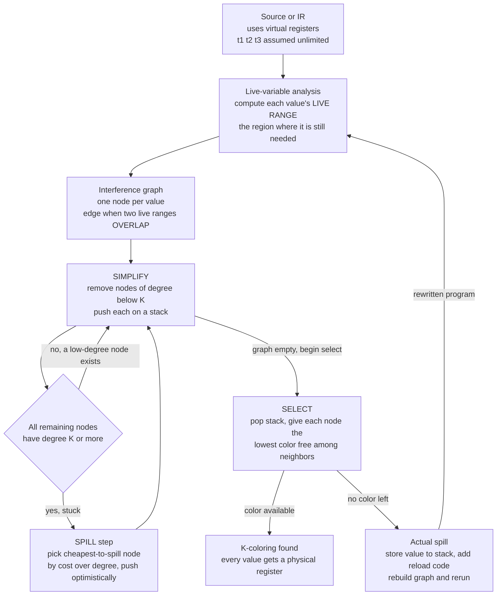

# 🎨 Register Allocation

> [!abstract] TL;DR
> **Register allocation** is the back-end phase that maps a program's *unlimited* virtual registers (the temporaries the IR freely invents) onto a CPU's *tiny fixed* set of **physical registers** — typically 16 to 32. Registers are the fastest storage on the machine, orders of magnitude quicker than even L1 cache, so keeping "hot" values in registers instead of **spilling** them to the stack is one of the single biggest performance levers in code generation. Chaitin's classic formulation turns this into **graph coloring**: build an **interference graph** whose nodes are values and whose edges join any two values that are *simultaneously live* (and so cannot share a register); a valid assignment using K registers is exactly a **K-coloring** of that graph. Because graph K-coloring is **NP-complete**, real compilers use heuristics — the **Chaitin-Briggs** simplify / spill / select algorithm for quality, or **linear scan** for JIT compile speed. When there aren't enough colors, some value is **spilled** to memory; choosing *which* value (the spill-cost heuristic) is where allocators earn their keep. It is the poster child for putting NP-hard graph theory to work in a shipping tool.

---

## Intuition

**Analogy — a chef with a tiny cutting board.** Picture a chef preparing a dish that calls for fifty ingredients, but the cutting board — the fast, right-in-front-of-you workspace — has room for only four things at once. Everything else has to sit back in the pantry down the hall. Fetching from the pantry is slow, so the chef wants the ingredients they are *actively chopping right now* to live on the board, and only trudge to the pantry when forced to.

Here is the crucial saving: two ingredients that are **never needed at the same moment** can share the same spot on the board. The onions you finished with before the garlic ever came out can occupy the very square the garlic will later use. The chef only runs out of room when *too many ingredients are needed simultaneously* — and only then must something get shoved back into the pantry.

That is register allocation exactly. The **cutting board** is the CPU's register file; the **pantry** is main memory / the stack. Each program value wants to live in a register while it is being used. Two values that are "live" at overlapping times **cannot** share a register; two whose lifetimes never overlap **can**. Deciding which values share which registers, and which get shoved back to memory, is — once you draw a node per value and an edge between every pair that overlaps — precisely the problem of **coloring a graph** so that no two adjacent nodes get the same color. The number of colors is the number of registers.

---

## How It Works

### Why registers matter so much

The [memory hierarchy](Cache_Hierarchy) has a brutal cost gradient. A register access is essentially free — it happens inside the [datapath](CPU_Datapath_and_Control) in the same cycle as the arithmetic. An L1 cache hit costs a few cycles; a main-memory access costs *hundreds*. The IR the middle end hands to the back end pretends registers are infinite (it mints a fresh virtual register, `t1`, `t2`, `t3`, ... for every intermediate value), but the real machine exposes only ~16 general-purpose registers on x86-64 or ~31 on AArch64/RISC-V. **Register allocation is the phase that reconciles this fantasy with reality.** Keeping a loop's hot induction variable in a register versus reloading it from the stack every iteration can swing a tight loop's speed by an integer factor. That is why this "bookkeeping" phase is one of the highest-leverage transforms in the whole compiler.

### Live ranges and interference

A value's **live range** is the set of program points where it holds a result that will still be *used later* — from its definition to its last use. Live ranges are computed by **live-variable analysis**, a backward data-flow pass: walking the code in reverse, a variable is live *before* an instruction if it is used there, or if it was live *after* and this instruction did not redefine it. (This is the same data-flow machinery covered by the sibling note `Control_Flow_and_Data_Flow_Analysis`.)

Two values **interfere** if their live ranges overlap — i.e., there is some program point where *both* are live and both still needed. Interfering values **cannot** share a physical register, because a register can hold only one live value at a time. Two values whose live ranges are disjoint may safely be assigned the *same* register. This single relation — "who is alive at the same time as whom" — is the entire input to allocation.

### Chaitin's graph-coloring formulation

Gregory Chaitin's 1981 insight was to encode interference as a graph:

- **Nodes** = values (virtual registers / live ranges).
- **Edges** = interference — an edge joins two nodes exactly when their live ranges overlap.

Now a legal allocation onto **K physical registers is a K-coloring** of this **interference graph**: assign each node one of K colors (registers) such that no two adjacent nodes share a color. If the graph is K-colorable, every value gets a register; if not, something must spill. The [chromatic number](Graph_Theory) of the interference graph is the minimum number of registers that would suffice with no spilling.

This is a genuinely deep connection, not an analogy: **graph K-coloring is NP-complete** for K ≥ 3 (see [[NP_Completeness_and_the_Cook_Levin_Theorem]] and [[Reductions_and_NP_Complete_Problems]]). So optimal register allocation is NP-hard in general — a canonical case of a textbook intractable graph problem sitting at the heart of a tool that must run in milliseconds. Compilers therefore lean on *heuristics* that are fast and usually near-optimal.

### The Chaitin-Briggs algorithm: simplify, spill, select

The workhorse heuristic exploits a simple fact: **a node with fewer than K neighbors can *always* be colored**, no matter how its neighbors end up, because at most K−1 colors are blocked and a Kth remains. The algorithm:

1. **Simplify.** Repeatedly find a node of degree **< K**, push it onto a stack, and remove it from the graph (which lowers its neighbors' degrees, possibly exposing more low-degree nodes). Removing "easy" nodes can cascade the whole graph onto the stack.
2. **Spill.** If every remaining node has degree **≥ K**, the graph is stuck. Pick a node to mark as a *potential spill* using a **spill-cost heuristic**, push it too (this is **Briggs' optimistic coloring** — we gamble it might still color once neighbors are assigned), and keep simplifying.
3. **Select.** Pop nodes off the stack one at a time, assigning each the lowest color not used by its already-colored neighbors. A node with degree < K at push time is guaranteed a color. A *potential-spill* node might still find a free color (the optimism paying off); if it genuinely cannot, it becomes an **actual spill** — its value is stored to memory, reload/store code is inserted, and the whole process reruns on the rewritten program.

The **spill-cost heuristic** typically minimizes `estimated_cost / degree`: spill values that are *cheap to reload* (few accesses) yet *heavily constraining* (high degree). Access counts are weighted by loop depth — a use inside a triple-nested loop counts far more than one in straight-line code — so allocators fight hardest to keep loop-carried values in registers.

### Flow / Architecture



*Read it as a loop: build the interference graph, peel off easy nodes, optimistically defer hard ones, then color on the way back. Anything that cannot be colored is spilled to memory and the whole pass reruns on the patched code.*

---

## Key Concepts

### Secondary (plain-language takeaway)
- A CPU has only a **handful of super-fast registers**; a program has far more values than that.
- Values that are **needed at the same time** must go in **different** registers; values needed at **different** times can **reuse** one.
- Draw a dot per value and connect two dots when their lifetimes overlap — coloring that picture with K crayons so touching dots differ **is** register allocation.
- When you run out of crayons (registers), some value gets pushed out to slow memory — that's a **spill**, and spills cost speed.

### Undergraduate (a compilers-course core)
- **Live range** and **live-variable analysis** (a backward data-flow computation) as the source of interference.
- **Interference graph**: nodes = values, edges = overlapping live ranges; a valid K-register allocation = a **K-coloring**.
- **Graph coloring is NP-complete** (K ≥ 3), so allocation is NP-hard and uses heuristics — the theory-to-practice bridge to [[NP_Completeness_and_the_Cook_Levin_Theorem]].
- **Chaitin-Briggs** simplify / spill / select; the "degree < K ⇒ always colorable" lemma; **optimistic coloring**.
- **Spilling**: store/reload to the stack; **spill cost** ≈ access frequency ÷ degree, weighted by loop depth.
- **Coalescing**: merging move-related nodes to delete register-to-register copies.
- **Precolored nodes** for ABI-mandated registers (argument, return, and reserved registers).

### Graduate (advanced allocation)
- **Rematerialization** — instead of reloading a spilled value, *recompute* it (e.g., a constant or a cheap address) when reloading is dearer than recomputing.
- **Conservative coalescing** (**Briggs** and **George** tests) — merge two move-related nodes only when doing so provably keeps the graph K-colorable, avoiding coalescing that turns a colorable graph uncolorable.
- **Live-range splitting** — cut one long live range into pieces so part lives in a register and part spills, instead of spilling the whole range.
- **SSA-based allocation** — the interference graphs of **Static Single Assignment** programs are **chordal**, and chordal graphs are **optimally colorable in polynomial time**. This dodges the NP-hardness of the *coloring* step (spill and coalescing remain hard) and is a major modern advance; see the sibling `Static_Single_Assignment_Form`.
- **Calling conventions**: **caller-saved** (volatile) vs **callee-saved** (non-volatile) registers, and **precolored** nodes pinning ABI registers — detailed in [[ABI_and_Calling_Conventions]] and the sibling `Runtime_Systems_and_the_ABI`.
- **Phase-ordering**: register allocation vs **instruction scheduling** (sibling `Instruction_Scheduling_and_Pipelines`) trade off — aggressive scheduling raises **register pressure**, and heavy allocation constrains parallelism (ties to [[Pipelining_and_Hazards]]).
- **Linear scan** vs graph coloring: the compile-time / code-quality trade-off exploited by JIT compilers (`Just_In_Time_Compilation`).

---

## Python Demo

```python
"""
Graph-coloring register allocation, Chaitin-Briggs style, from scratch.

Pipeline demonstrated:
  1. A small straight-line program with DEFs and USEs of variables.
  2. LIVE-VARIABLE analysis (backward pass) -> each program point's live set.
  3. Build the INTERFERENCE GRAPH: an edge between any two variables that are
     simultaneously live (their live ranges overlap) and so cannot share a reg.
  4. Chaitin-Briggs allocation for a given K (number of physical registers):
       SIMPLIFY  - repeatedly remove nodes of degree < K, push on a stack;
       SPILL     - if stuck, push the cheapest-to-spill node (cost / degree);
       SELECT    - pop and assign the lowest free color; a node with no free
                   color becomes an ACTUAL SPILL.
  5. Run with K = 3 (everything fits) and K = 2 (one variable must spill).
  6. Visualize the interference graph with its K = 2 coloring, drawing the
     spilled node distinctly, using matplotlib (pure stdlib + matplotlib).
"""

from math import cos, sin, pi
import matplotlib.pyplot as plt
import matplotlib.patches as mpatches

# ---------------------------------------------------------------------------
# 1. A tiny straight-line program. Each instruction: (dest, [operands]).
#    dest = None means "no definition" (e.g. the final return / use).
#    Reading it as pseudo-code:
#        a = 1;  b = 2;  c = a + b;  d = b + c;
#        e = a + d;  f = c + e;  g = d + f;  return g
# ---------------------------------------------------------------------------
PROGRAM = [
    ("a", []),            # a = 1
    ("b", []),            # b = 2
    ("c", ["a", "b"]),    # c = a + b
    ("d", ["b", "c"]),    # d = b + c
    ("e", ["a", "d"]),    # e = a + d
    ("f", ["c", "e"]),    # f = c + e
    ("g", ["d", "f"]),    # g = d + f
    (None, ["g"]),        # return g
]
VARS = ["a", "b", "c", "d", "e", "f", "g"]

# ---------------------------------------------------------------------------
# 2. LIVE-VARIABLE ANALYSIS (backward). For straight-line code:
#        live_before(i) = uses(i) | (live_after(i) - defs(i))
#    We record the live set AFTER each instruction to derive interference.
# ---------------------------------------------------------------------------
def liveness(program):
    n = len(program)
    live_after = [set() for _ in range(n)]
    live = set()
    for i in range(n - 1, -1, -1):
        live_after[i] = set(live)                 # live AFTER instruction i
        dest, uses = program[i]
        if dest is not None:
            live.discard(dest)                    # the def kills the variable
        live |= set(uses)                         # the uses make operands live
    live_before = []                              # (for reporting / edges)
    live = set()
    for i in range(n - 1, -1, -1):
        dest, uses = program[i]
        if dest is not None:
            live.discard(dest)
        live |= set(uses)
        live_before.append((i, set(live)))
    live_before.reverse()
    return live_after, live_before

# ---------------------------------------------------------------------------
# 3. INTERFERENCE GRAPH: two variables interfere if they are ever co-live.
#    We add an edge between every pair inside each live set (before & after).
# ---------------------------------------------------------------------------
def interference_graph(program):
    live_after, live_before = liveness(program)
    graph = {v: set() for v in VARS}
    live_sets = [s for _, s in live_before] + live_after
    for s in live_sets:
        members = sorted(s)
        for i in range(len(members)):
            for j in range(i + 1, len(members)):
                u, w = members[i], members[j]
                graph[u].add(w)
                graph[w].add(u)
    return graph

# ---------------------------------------------------------------------------
# Spill cost = number of defs + uses (access frequency). In a real allocator
# each access is weighted by loop nesting depth (10**depth). Chaitin spills the
# node minimizing cost / degree: cheap to reload yet highly constraining.
# ---------------------------------------------------------------------------
def spill_costs(program):
    cost = {v: 0 for v in VARS}
    for dest, uses in program:
        if dest is not None:
            cost[dest] += 1
        for u in uses:
            cost[u] += 1
    return cost

# ---------------------------------------------------------------------------
# 4. CHAITIN-BRIGGS allocation for K registers.
# ---------------------------------------------------------------------------
def allocate(graph, K, cost):
    remaining = set(graph)
    degree = {v: len(graph[v] & remaining) for v in remaining}
    stack = []
    potential_spills = set()

    def cur_degree(v):
        return len(graph[v] & remaining)

    while remaining:
        low = [v for v in remaining if cur_degree(v) < K]
        if low:
            v = min(low)                                   # SIMPLIFY (deterministic)
        else:                                              # SPILL: pick min cost/degree
            v = min(remaining, key=lambda x: cost[x] / max(1, cur_degree(x)))
            potential_spills.add(v)
        stack.append(v)
        remaining.discard(v)

    color = {}
    spilled = set()
    for v in reversed(stack):                              # SELECT
        used = {color[n] for n in graph[v] if n in color}
        free = [c for c in range(K) if c not in used]
        if free:
            color[v] = free[0]
        else:
            spilled.add(v)                                 # optimism failed -> real spill
    return color, spilled

# ---------------------------------------------------------------------------
# Driver: build the graph, report it, and allocate for K = 3 and K = 2.
# ---------------------------------------------------------------------------
graph = interference_graph(PROGRAM)
cost = spill_costs(PROGRAM)

print("INTERFERENCE GRAPH (who cannot share a register):")
for v in VARS:
    print(f"  {v}: interferes with {sorted(graph[v])}  (degree {len(graph[v])})")

results = {}
for K in (3, 2):
    color, spilled = allocate(graph, K, cost)
    results[K] = (color, spilled)
    print(f"\n=== Allocation with K = {K} physical registers ===")
    for v in VARS:
        if v in spilled:
            print(f"  {v} -> SPILLED to memory/stack")
        else:
            print(f"  {v} -> register R{color[v]}")
    if spilled:
        print(f"  ! ran out of registers: spilled {sorted(spilled)}")
    else:
        print("  all values kept in registers, no spills")

# ---------------------------------------------------------------------------
# 6. VISUALIZE the interference graph with the K = 2 coloring.
#    Circular layout (pure matplotlib, no networkx). Spilled node drawn gray.
# ---------------------------------------------------------------------------
color_K2, spilled_K2 = results[2]
REG_COLORS = ["#4c72b0", "#dd8452", "#55a868", "#c44e52"]   # R0, R1, R2, ...

n = len(VARS)
pos = {v: (cos(2 * pi * i / n + pi / 2), sin(2 * pi * i / n + pi / 2))
       for i, v in enumerate(VARS)}

fig, ax = plt.subplots(figsize=(7.5, 7.5))

# edges first (behind nodes)
drawn = set()
for u in VARS:
    for w in graph[u]:
        if (w, u) in drawn:
            continue
        drawn.add((u, w))
        x0, y0 = pos[u]; x1, y1 = pos[w]
        ax.plot([x0, x1], [y0, y1], color="#999999", lw=1.3, zorder=1)

# nodes on top
for v in VARS:
    x, y = pos[v]
    if v in spilled_K2:
        face, edge, hatch, txt = "#dddddd", "black", "xxx", f"{v}\nSPILL"
    else:
        face, edge, hatch, txt = REG_COLORS[color_K2[v]], "black", None, f"{v}\nR{color_K2[v]}"
    ax.add_patch(mpatches.Circle((x, y), 0.16, facecolor=face, edgecolor=edge,
                                 hatch=hatch, lw=1.8, zorder=2))
    ax.text(x, y, txt, ha="center", va="center", fontsize=11,
            fontweight="bold", zorder=3)

used_regs = sorted({color_K2[v] for v in VARS if v not in spilled_K2})
legend = [mpatches.Patch(facecolor=REG_COLORS[c], edgecolor="black", label=f"register R{c}")
          for c in used_regs]
legend.append(mpatches.Patch(facecolor="#dddddd", edgecolor="black", hatch="xxx",
                             label="spilled to memory"))
ax.legend(handles=legend, loc="upper left", fontsize=10, frameon=True)

ax.set_xlim(-1.4, 1.4); ax.set_ylim(-1.4, 1.4)
ax.set_aspect("equal"); ax.axis("off")
ax.set_title("Interference graph colored with K = 2 registers\n"
             "adjacent nodes need different registers; the uncolorable node spills",
             fontsize=12)
plt.tight_layout()
plt.savefig("register_allocation.png", dpi=130)
print("\nSaved interference-graph coloring -> register_allocation.png")
```

Running it prints the interference graph (for example, `c` interferes with `a, b, d, e` — degree 4, the most constrained value because it sits inside three overlapping lifetimes), then two allocations. With **K = 3** the Chaitin simplify pass peels the whole graph onto the stack and select colors every node — **no spills**, since the graph's chromatic number is 3. With **K = 2** the pass gets stuck (three mutually-interfering values form triangles that need three colors), marks the cheapest-per-degree node `c` as a potential spill, and on `select` finds `c` genuinely uncolorable — so `c` is **spilled to the stack** while every other value still gets a register. The saved figure shows the interference graph with the K = 2 coloring: blue and orange nodes are physical registers R0/R1, and the hatched gray node is the value that had to spill.

---

## Real-World Applications

> **Example — LLVM's Greedy register allocator.** LLVM's default allocator (named `greedy`) is *not* a textbook Chaitin colorer but a priority-based allocator working over **live intervals** with **live-range splitting** and a spill-cost model weighted by loop depth. It orders live ranges by a priority heuristic, assigns physical registers, and when it cannot, it *splits* a range (register part + spilled part) rather than spilling the whole thing — a refinement of the Chaitin ideas tuned for real code and honoring x86-64 / AArch64 [calling conventions](ABI_and_Calling_Conventions) via precolored ranges. GCC uses **IRA** (Integrated Register Allocator), a regional graph-coloring allocator. Both are direct descendants of Chaitin-Briggs.

Where register allocation shows up in practice:

- **Every optimizing AOT compiler.** GCC (IRA + LRA reload) and LLVM/Clang (greedy) run register allocation as one of the last back-end phases; the quality of this phase is a major reason `-O2` code beats `-O0` code, which keeps almost everything on the stack.
- **JIT compilers use linear scan.** HotSpot's C1 tier, older V8, and many trace-JITs use **linear-scan allocation** — sort live intervals by start point and sweep once, assigning free registers and spilling the interval that ends latest when out. It produces slightly worse code than graph coloring but runs in near-linear time, which is essential when *compilation happens while the user waits* (`Just_In_Time_Compilation`).
- **SSA-based allocators.** Modern research and some production back ends allocate directly on **SSA form**, exploiting the chordality of SSA interference graphs to color optimally in polynomial time (sibling `Static_Single_Assignment_Form`).
- **GPU and DSP compilers.** Wide-SIMD and VLIW targets have large but *banked* register files with placement constraints; their allocators are graph-coloring variants with extra adjacency rules, and register pressure directly caps GPU **occupancy** (how many threads run concurrently).
- **WebAssembly and bytecode-to-native.** Baseline and optimizing WASM engines (Wasmtime/Cranelift, V8's Liftoff/TurboFan) allocate registers when lowering stack-based bytecode to a register machine.

---

## Common Pitfalls

- **Confusing "colorable" with "assignable to *this* register."** Coloring finds *some* K-coloring, but real targets add constraints: two-address instructions, fixed operand registers (x86 `div` clobbers `RDX:RAX`), and ABI-precolored argument registers. A plain colorer that ignores these produces illegal code — precolored nodes and move constraints must be baked into the graph.
- **Naive spill-everywhere.** Spilling a value by storing after *every* def and reloading before *every* use is correct but catastrophically slow, especially inside loops. Good allocators split live ranges and rematerialize cheap values instead of blindly round-tripping through memory.
- **Spilling in a hot loop.** A spilled loop-carried variable adds a load and store to *every iteration*. Spill costs must be weighted by loop nesting depth (roughly `10**depth`) so the allocator spills cold, straight-line values first and fights to keep loop values in registers.
- **Ignoring coalescing — or coalescing too aggressively.** Not coalescing leaves useless register-to-register `mov`s everywhere. But *aggressive* coalescing merges move-related nodes and can raise a node's degree past K, turning a colorable graph uncolorable and forcing a spill. Use **conservative** (Briggs/George) coalescing that only merges when K-colorability is provably preserved.
- **Treating allocation and scheduling independently.** Instruction scheduling to hide latency lengthens live ranges and *raises register pressure*; overlapping many operations for parallelism can force spills that erase the scheduling win. This **phase-ordering** tension has no perfect answer (ties to `Instruction_Scheduling_and_Pipelines`).
- **Forgetting caller/callee-saved semantics.** Putting a value that must survive a function call into a **caller-saved** register means the callee may clobber it — the allocator must either use a **callee-saved** register (and save/restore it in the prologue) or spill around the call. Getting this wrong yields values silently corrupted across calls.
- **Assuming more registers is always strictly better.** Extra callee-saved registers must be saved/restored in the prologue/epilogue; using one for a rarely-live value can cost more than it saves. Allocation is an optimization problem, not "use every register you can."

---

## Related Concepts

- [[Compilers_Overview]] — where register allocation sits in the back end of the phase pipeline, after instruction selection and before final code emission.
- [[Graph_Theory]] — graph coloring and the chromatic number; the pure-math object the interference graph is an instance of.
- [[NP_Completeness_and_the_Cook_Levin_Theorem]] — why optimal K-coloring (and thus optimal allocation) is intractable, forcing heuristics.
- [[Reductions_and_NP_Complete_Problems]] — graph coloring as a canonical NP-complete problem; the reduction context for allocation's hardness.
- [[Graph_Representation]] — adjacency lists / matrices; how the interference graph is actually stored and traversed in an allocator.
- [[CPU_Datapath_and_Control]] — the register file the allocator targets, and why register access is a single-cycle datapath operation.
- [[Cache_Hierarchy]] — the memory cost gradient that makes spilling to the stack expensive and register residency valuable.
- [[ABI_and_Calling_Conventions]] — caller-saved vs callee-saved registers and precolored, ABI-mandated register constraints the allocator must respect.
- [[Pipelining_and_Hazards]] — instruction scheduling raises register pressure; the allocation-vs-scheduling phase-ordering trade-off.
- [[ISA_Design_RISC_vs_CISC]] — how the number and kind of registers an ISA exposes shapes how hard allocation is.

> Sibling Compilers notes referenced in prose (forthcoming, not yet linked): `Code_Generation_and_Instruction_Selection`, `Control_Flow_and_Data_Flow_Analysis` (live-variable analysis), `Static_Single_Assignment_Form` (chordal SSA allocation), `Instruction_Scheduling_and_Pipelines` (pressure vs parallelism), `Runtime_Systems_and_the_ABI`, `Memory_Management_and_Allocation_Runtime` (the stack that spills land on), and `Just_In_Time_Compilation` (linear scan).

---

## Review Questions

1. **(Undergraduate / conceptual)** Explain, using live ranges, why two variables that are *never live at the same time* can be assigned the same physical register. Then state precisely how the interference graph encodes this, and what a valid assignment onto K registers corresponds to in graph terms.
2. **(Graduate / scenario)** A function has an interference graph in which one variable interferes with 9 others, and the target has 8 registers. Walk through what Chaitin-Briggs does: which step gets stuck, how the spill candidate is chosen, why *optimistic* coloring might still let that node get a register, and what happens if it cannot. If this variable is the induction variable of a hot inner loop, how should the spill-cost heuristic treat it and why?
3. **(Graduate / trade-off)** You are building the register allocator for a **JIT** compiler where compilation latency is on the critical path of program execution. Contrast **linear-scan** allocation with full **graph-coloring** allocation on compile-time complexity and resulting code quality, and justify which you would ship for (a) the JIT's fast baseline tier and (b) its top optimizing tier. Then explain how allocating directly on **SSA form** changes the coloring problem's tractability.

---

## Sources

- Chaitin, G. J. "Register Allocation and Spilling via Graph Coloring." *ACM SIGPLAN Symposium on Compiler Construction*, 1982 — the founding paper of graph-coloring register allocation.
- Briggs, P., Cooper, K. D., Torczon, L. "Improvements to Graph Coloring Register Allocation." *ACM TOPLAS* 16(3), 1994 — optimistic coloring and conservative coalescing (the "Chaitin-Briggs" allocator).
- Cooper, K., Torczon, L. *Engineering a Compiler*, 3rd ed. Morgan Kaufmann, 2022 — Chapter 13, "Register Allocation" (live ranges, coloring, spilling, coalescing).
- Appel, A. *Modern Compiler Implementation in ML*. Cambridge University Press, 1998 — Chapters 10–11, a hands-on build of a graph-coloring allocator with coalescing.
- Poletto, M., Sarkar, V. "Linear Scan Register Allocation." *ACM TOPLAS* 21(5), 1999 — the fast one-pass allocator used by JIT compilers.
- Hack, S., Grund, D., Goos, G. "Register Allocation for Programs in SSA Form." *Compiler Construction (CC)*, 2006 — chordal SSA interference graphs and polynomial-time coloring.

---

#compilers #register-allocation #graph-coloring #interference-graph #spilling
