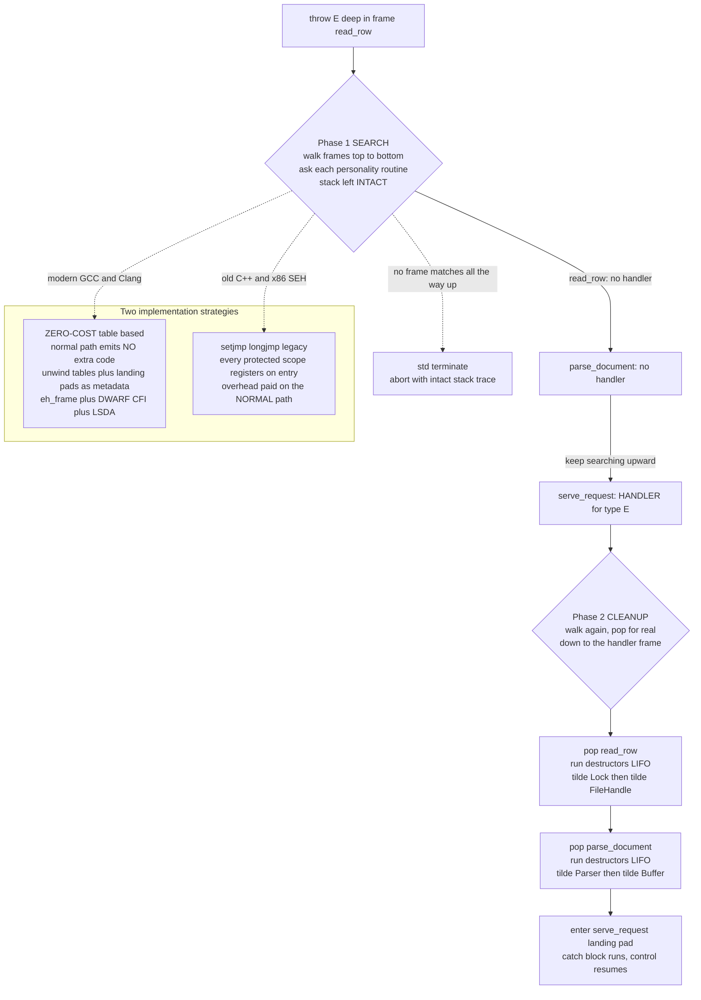

# 🚨 Exception Handling and Stack Unwinding

> [!abstract] TL;DR
> An **exception** transfers control from a failing point deep in the call stack to a **handler** that may be many frames above it, abandoning every intervening computation. To do this safely the runtime performs **stack unwinding**: it pops each abandoned frame one at a time and, at each frame, runs that frame's **cleanup** — C++ destructors, Rust `Drop`, Go deferred functions, `finally` blocks — so resources are released before control leaves. Modern compilers implement this with **zero-cost, table-based** unwinding: the compiler emits **unwind tables** and **landing pads** as metadata (the Itanium C++ ABI's `.eh_frame` / DWARF CFI), so the normal non-throwing path pays *nothing* and only a real throw consults the tables, in a **two-phase** search-then-cleanup walk driven by per-language **personality routines**.

---

## Intuition

**Analogy — a fire alarm in a high-rise.** You are working on the twentieth floor when something goes catastrophically wrong. Someone pulls the **fire alarm**. You do not stop to finish your spreadsheet, poll your boss, and file a report — control *instantly evacuates outward*. But the evacuation is not chaos: on the way down, each floor has a warden who must run that floor's **cleanup** before letting people pass — shut off the gas, close the fire doors, account for everyone (close files, unlock mutexes, free memory). The alarm keeps propagating **down through every floor** until it reaches a floor whose emergency team actually knows how to deal with *this specific kind* of fire — that team is the **handler**. If no floor can handle it, the whole building is condemned: the program **terminates**.

**Stack unwinding is that orderly evacuation.** A `throw` deep in the call stack is the alarm; each stack frame is a floor; the frame's destructors are the floor warden's shutdown checklist; the matching `catch` is the emergency team. The genius of the modern design is that on a normal, alarm-free day nobody pays a cent for the fire drills — the evacuation machinery lives in a **map on the wall** (the unwind tables) that is only ever read when the alarm actually sounds.

---

## How It Works

### 1. The problem: non-local control transfer

Under normal execution, a function returns to *exactly* its caller: the call stack (see [[Runtime_Systems_and_the_ABI]], which defines the frame layout, the return address, and the calling convention) grows on `call` and shrinks on `ret`, one frame at a time. An exception breaks this contract. A `throw` in frame `read_row` may have to reach a `catch` in `serve_request` four frames up, **skipping** `parse_document` and everything in between. Those intervening frames never got to run their remaining code, yet they hold live resources: an open file handle, a held lock, a heap buffer. Simply jumping to the handler with a raw `longjmp` would **leak every one of those resources** and leave locks held forever. The runtime therefore cannot just transfer control — it must **walk the stack**, and at every abandoned frame run that frame's cleanup, before delivering the exception to the handler.

### 2. Stack unwinding, frame by frame

**Unwinding** is the process of popping stack frames one at a time, from the throw point upward toward the handler, running **cleanup actions** at each frame. Every mainstream language ties cleanup to lexical scope so that unwinding is automatic and total:

- **C++ destructors** — every object with automatic storage has its destructor called as its scope is abandoned.
- **Rust `Drop`** — `drop` glue runs for every live value owned by an unwound frame.
- **Go deferred functions** — `defer`red calls run in LIFO order as a panic unwinds (until a `recover`).
- **`finally` blocks** — Java, C#, Python run `finally` on the way out regardless of how the block is left.

The unifying discipline is **RAII — Resource Acquisition Is Initialization**: a resource's lifetime is bound to an object's scope, so *acquiring* it means constructing a guard and *releasing* it means the guard's destructor. Because unwinding runs destructors for exactly the objects a frame owns, in **reverse order of construction (LIFO)**, RAII makes unwinding **exception-safe by construction** — you never write manual cleanup on the error path, and there is no error path to forget. This is the same scope-and-ownership discipline that drives [[Memory_Management_Cpp]] and [[Memory_Management_and_Allocation_Runtime]]; unwinding is what makes stack-bound ownership survive a mid-computation failure.

### 3. Two implementation strategies

**Legacy: `setjmp` / `longjmp` and per-frame registration.** The old approach threads a linked list of active handlers through the stack. On entering any `try` (or any scope with a destructor), the code *registers* an entry — pushes a node describing "if an exception passes through here, run this cleanup / this handler." A `throw` walks that list and `longjmp`s. The fatal flaw: **every frame pays on the normal path**. Setting up and tearing down the registration on entry/exit of protected scopes costs instructions and defeats optimization *even when nothing ever throws*. This is Windows x86 SEH's classic frame-based model and the historical C++ implementation.

**Modern: zero-cost, table-based unwinding.** The insight is to move all the bookkeeping **off the hot path and into static metadata**. The compiler, knowing exactly which objects each region of code owns and where each `try`/`catch` is, emits **out-of-line tables**:

- **Unwind tables / Call Frame Information (`.eh_frame`, DWARF CFI)** describe, for every instruction address, how to restore registers and find the caller's frame — enough to "virtually pop" any frame.
- **A per-function LSDA (language-specific data area)** maps program-counter ranges to **landing pads** — the compiler-generated cleanup-and-catch code for that region.
- **Landing pads** are the blocks the unwinder jumps *into* to run destructors and, if this frame catches, the `catch` body.

On the **normal path the emitted code is identical to code with no exceptions at all** — no registration, no checks, hence *zero-cost*. Only an actual `throw` invokes the runtime unwinder, which reads the tables to walk and clean up the stack. This is codified by the **Itanium C++ Exception ABI**, used by GCC and Clang across Linux/macOS, with `libunwind`/`libgcc_s` providing the unwinder. The tables are laid down by the compiler and stitched together by the linker (see [[Linkers_and_Loaders]], which places `.eh_frame` and registers it for runtime lookup).

### 4. Two-phase unwinding and the personality routine

The Itanium ABI runs unwinding in **two passes**, and the reason is subtle but important:

1. **Search phase.** The unwinder walks up the stack *without modifying it*, asking each frame's **personality routine** (a per-language callback named in the frame's unwind info) "do you have a handler for *this* exception type?" It runs destructors for **nothing** yet. If it finds a handler, it proceeds to phase 2; if it reaches the top of the stack with no handler, it calls **`terminate`** — and crucially, because the stack is still intact, a debugger can print a **full stack trace from the throw point**. (If unwinding destroyed frames while searching, that context would be gone.)
2. **Cleanup phase.** Now the unwinder walks up *again*, this time **actually popping** frames and, at each, invoking the personality routine to run that frame's landing pad — destructors first, then, at the handler frame, transferring into the `catch`.

The **personality routine** is the language-specific brain: C++'s `__gxx_personality_v0` knows how to match `catch` clauses by type; Rust's personality runs `Drop` glue; each language plugs its own semantics into a shared unwinder. This is what lets a Rust frame unwind cleanly through a boundary described by the same DWARF machinery as a C++ frame.

### 5. The compiler's role

The compiler does the heavy lifting at build time, leaning on its control- and data-flow analysis (see [[Control_Flow_and_Data_Flow_Analysis]]) to:

- Track, per program region, **which objects are live and need destruction** if an exception exits that region.
- **Generate landing pads** and the LSDA mapping PC ranges to them.
- Emit **CFI directives** so the unwinder can virtually pop each frame.
- Enforce **exception-safety** invariants around `noexcept`/`throw()` boundaries and insert calls to `terminate` where an exception must not escape.

### Diagram — a throw unwinds the stack, table-based vs setjmp/longjmp



---

## Key Concepts

### Secondary (intuition level)
- An **exception** is an alarm raised deep in a program that jumps control up to code that knows how to handle it, skipping everything in between.
- **Stack unwinding** is the orderly evacuation: as control leaves each function, that function's **cleanup** runs so nothing is left open or leaked.
- **RAII** means "tie every resource to a scope," so cleanup happens automatically no matter how you leave — normal return *or* exception.
- If **no handler** exists anywhere up the stack, the program **terminates**.

### Undergraduate (mechanics level)
- **The mechanism:** a `throw` transfers control to a possibly-distant handler; the runtime must *find* the handler and *clean up* every frame it skips.
- **Cleanup forms across languages:** C++ destructors, Rust `Drop`, Go `defer`, `finally` — all run during unwinding, in **LIFO** order.
- **Zero-cost vs setjmp/longjmp:** table-based unwinding makes the non-throwing path free but makes a throw slow; the legacy model taxes every protected scope up front.
- **Landing pads and unwind tables:** compiler-emitted cleanup/catch code plus the `.eh_frame`/LSDA metadata that maps addresses to it.
- **Error-handling models:** exceptions/unwinding **vs** explicit result values (Rust `Result` + `?`, Go multiple returns, functional `Either`/`Option`). Happy-path clarity vs explicitness of hidden control flow.

### Graduate (theory / systems level)
- **Two-phase unwinding:** a **search** pass (find the handler, stack intact, so stack traces survive) then a **cleanup** pass (actually pop and run landing pads); the **personality routine** encodes per-language matching semantics.
- **The Itanium C++ Exception ABI**, **DWARF CFI / `.eh_frame`**, the **LSDA**, and unwinder libraries (`libunwind`, `libgcc_s`); contrast **Windows SEH** (`__try`/`__except`, frame-based on x86, table-based `.pdata`/`.xdata` on x64) and **JVM/CLR exception tables**.
- **Exception-safety guarantees:** **basic** (no leaks, invariants preserved), **strong** (commit-or-rollback / transactional), **nothrow** (`noexcept`); and how they compose with resource management and concurrency.
- **`noexcept` and its teeth:** a `noexcept` function that throws calls `terminate`; it enables move optimizations (`std::vector` uses `noexcept` moves to keep the strong guarantee on reallocation).
- **Panic vs recoverable errors:** Rust `panic!` can **unwind** *or* **abort** (`panic = "abort"`), and `Result` is the recoverable channel; when to unwind vs terminate is a policy decision.
- **Signals vs exceptions:** hardware faults (segfault, divide-by-zero) arrive as OS **traps/signals** (see [[Interrupts_Traps_and_Dual_Mode_Operation]]), a *different* mechanism from language exceptions — converting one to the other is fragile and generally unsafe.
- **Reuse of unwind info:** the very same tables power **backtraces**, **profilers**, and **debuggers**, not just exceptions.

---

## Python Demo

This simulation makes **stack unwinding** concrete. It models a **call stack** of frames, where each frame may acquire **RAII-managed resources** (whose destructors must run on the way out) and may install a **try/catch handler** for certain exception types. It then **throws** an exception from the deepest frame and performs **two-phase unwinding**: a *search* pass that walks up the stack (leaving it intact) to find a matching handler, then a *cleanup* pass that pops frames from the top down, running each frame's destructors in **reverse (LIFO)** order, until it reaches the handler. If no handler is found anywhere, it **terminates**. Every step is traced, and the shrinking stack is **visualized** with matplotlib. Pure standard library plus matplotlib.

```python
# Simulate exception propagation and STACK UNWINDING.
# A call stack is a list of frames (index 0 = main at the bottom, last = deepest).
# Each frame acquires RAII resources (destructors run LIFO on unwind) and may
# install a try/catch handler for certain exception types. We throw from the
# deepest frame and run TWO-PHASE unwinding: (1) SEARCH up the stack for a
# handler without touching it, (2) CLEANUP by popping frames and running
# destructors until the handler frame is reached. No handler => terminate.

from dataclasses import dataclass
from typing import List, Tuple, Optional
import matplotlib.pyplot as plt
import matplotlib.patches as mpatches


@dataclass
class Frame:
    name: str
    resources: List[str]        # RAII resources acquired, in construction order
    catches: Tuple[str, ...] = ()  # exception type names this frame's catch handles

    def destructors(self) -> List[str]:
        # Destructors run in REVERSE order of acquisition (LIFO), like scope exit.
        return [f"~{r}" for r in reversed(self.resources)]


# main -> serve_request -> parse_document -> read_row (deepest)
STACK = [
    Frame("main",           ["Logger"],             catches=("FatalError",)),
    Frame("serve_request",  ["Connection"],         catches=("IOError",)),
    Frame("parse_document", ["Buffer", "Parser"],   catches=()),
    Frame("read_row",       ["FileHandle", "Lock"], catches=()),
]


def unwind(frames: List[Frame], exc_type: str):
    """Two-phase stack unwinding. Returns (snapshots, log, handler_index)."""
    live = list(frames)           # working copy we pop from during cleanup
    log: List[str] = []
    snaps: List[dict] = []

    def snap(active: Optional[int], phase: str, note: str):
        snaps.append({
            "frames": [(f.name, list(f.resources), f.catches) for f in live],
            "active": active, "phase": phase, "note": note,
        })

    n = len(live)
    log.append(f"throw {exc_type} in '{live[-1].name}'")
    snap(n - 1, "throw", f"throw {exc_type}")

    # ---- Phase 1: SEARCH (top -> bottom, stack left INTACT) ----
    handler_idx = None
    for i in range(n - 1, -1, -1):
        hit = exc_type in live[i].catches
        log.append(f"[search] {live[i].name}: {'HANDLER found' if hit else 'no handler'}")
        snap(i, "search", f"search {live[i].name}: {'match' if hit else 'no'}")
        if hit:
            handler_idx = i
            break

    if handler_idx is None:
        log.append(f"[terminate] no handler for {exc_type}  ->  std::terminate")
        snap(None, "terminate", f"no handler for {exc_type}: TERMINATE")
        return snaps, log, None

    # ---- Phase 2: CLEANUP (pop top down to handler, run destructors LIFO) ----
    while len(live) - 1 > handler_idx:
        top = live[-1]
        dtors = top.destructors()
        for d in dtors:
            log.append(f"[cleanup] {top.name}: run {d}")
        snap(len(live) - 1, "cleanup",
             f"unwind {top.name}: {', '.join(dtors) if dtors else 'no resources'}")
        live.pop()

    caught = live[-1]
    log.append(f"[caught] {caught.name} catches {exc_type}")
    snap(len(live) - 1, "caught", f"{caught.name} CATCHES {exc_type}")
    return snaps, log, handler_idx


COLORS = {
    "throw":     "#ef9a9a",   # red   - throw site
    "search":    "#90caf9",   # blue  - inspecting for handler
    "cleanup":   "#ffcc80",   # amber - running destructors + popping
    "caught":    "#a5d6a7",   # green - handler frame
    "terminate": "#e57373",   # deep red - fatal
}


def draw(snaps: List[dict], exc_type: str, path: str):
    k = len(snaps)
    cols = min(4, k)
    rows = (k + cols - 1) // cols
    fig, axes = plt.subplots(rows, cols, figsize=(4.3 * cols, 3.5 * rows))
    axes = list(axes.ravel()) if k > 1 else [axes]
    top_y = len(STACK) + 1

    for ax, s in zip(axes, snaps):
        ax.set_xlim(0, 10)
        ax.set_ylim(0, top_y)
        for j, (name, res, catches) in enumerate(s["frames"]):
            active = (s["active"] == j)
            color = COLORS[s["phase"]] if active else "#eceff1"
            ax.add_patch(mpatches.FancyBboxPatch(
                (0.6, j + 0.12), 8.8, 0.78, boxstyle="round,pad=0.02",
                facecolor=color, edgecolor="black", linewidth=1.2))
            label = name + ("  [catch " + "/".join(catches) + "]" if catches else "")
            ax.text(0.95, j + 0.5, label, va="center", fontsize=8)
            ax.text(9.05, j + 0.5, ", ".join(res) if res else "-", va="center",
                    ha="right", fontsize=7, color="0.35")
        ax.text(5, top_y - 0.35, s["phase"].upper(), ha="center",
                fontsize=9, fontweight="bold")
        ax.text(5, top_y - 0.72, s["note"], ha="center", fontsize=7.5, color="0.25")
        ax.axis("off")

    for ax in axes[k:]:
        ax.axis("off")
    fig.suptitle(f"Stack unwinding of {exc_type}   (bottom = main, top = deepest frame)",
                 fontsize=12)
    plt.tight_layout(rect=(0, 0, 1, 0.96))
    plt.savefig(path, dpi=120)
    plt.show()


def run(exc_type: str, png: str):
    print("=" * 64)
    print(f"SCENARIO: throw {exc_type}")
    snaps, log, hidx = unwind(STACK, exc_type)
    for line in log:
        print("  " + line)
    outcome = ("terminated (no handler)" if hidx is None
               else f"caught by '{STACK[hidx].name}'")
    print(f"  RESULT: {outcome}")
    draw(snaps, exc_type, png)


# Scenario A: IOError -> caught by serve_request; read_row and parse_document unwind.
run("IOError", "unwind_caught.png")
# Scenario B: SegfaultError -> no matching handler -> std::terminate.
run("SegfaultError", "unwind_terminate.png")
```

Expected console output:

```
================================================================
SCENARIO: throw IOError
  throw IOError in 'read_row'
  [search] read_row: no handler
  [search] parse_document: no handler
  [search] serve_request: HANDLER found
  [cleanup] read_row: run ~Lock
  [cleanup] read_row: run ~FileHandle
  [cleanup] parse_document: run ~Parser
  [cleanup] parse_document: run ~Buffer
  [caught] serve_request catches IOError
  RESULT: caught by 'serve_request'
================================================================
SCENARIO: throw SegfaultError
  throw SegfaultError in 'read_row'
  [search] read_row: no handler
  [search] parse_document: no handler
  [search] serve_request: no handler
  [search] main: no handler
  [terminate] no handler for SegfaultError  ->  std::terminate
  RESULT: terminated (no handler)
```

The first figure shows the four-frame stack, then the **search** pass highlighting each frame in turn until `serve_request` matches, then the **cleanup** pass in which `read_row` and `parse_document` pop off the top while their destructors fire in reverse order (`~Lock` before `~FileHandle`), ending green on `serve_request`. The second figure shows the search pass reaching `main` with still no match and the stack collapsing to a red **TERMINATE**. Note how the search phase never pops a frame — that is exactly what preserves the full stack trace for the terminate handler and the debugger.

---

## Real-World Applications

> **GCC and Clang on Linux/macOS** implement the **Itanium C++ Exception ABI** with **zero-cost** table-based unwinding. The compiler emits `.eh_frame` (DWARF CFI) and an LSDA per function; at throw time `libgcc_s`/`libunwind` runs the two-phase walk, calling `__gxx_personality_v0` to match `catch` clauses. Non-throwing code is byte-for-byte identical to `-fno-exceptions` code on the hot path.

> **Rust** unwinds panics through the *same* DWARF/`libunwind` machinery, running `Drop` glue as it goes — which is why a panicking thread still releases its `MutexGuard`s and `File`s. Projects can flip `panic = "abort"` in `Cargo.toml` to skip unwinding entirely, shrinking the binary and removing landing pads where a crash-only policy is acceptable (many embedded and latency-critical builds do this). See [[Rust_Error_Handling]] and [[Ownership_and_Borrowing]].

> **Go** has no exceptions in the C++ sense: normal errors are explicit `error` return values (see [[Go_Error_Handling]]), while `panic`/`recover` provides a restricted unwinding path that runs `defer`red functions LIFO — used sparingly for truly unrecoverable states, with `recover` at goroutine boundaries to keep a server alive.

> **Windows / MSVC** uses **Structured Exception Handling (SEH)**: frame-based (`__try`/`__except` with a registration chain) on x86, but **table-based** (`.pdata`/`.xdata`) on x64 and ARM64, mirroring the zero-cost idea. C++ exceptions ride on top of SEH via the same tables.

> **The JVM and .NET CLR** ship per-method **exception tables** in the bytecode/metadata: each entry maps a bytecode range to a handler PC and caught type. The interpreter/JIT consults them on `athrow`, and the JIT reuses the same info to keep the common path fast. Stack traces come straight from walking these tables.

> **Debuggers, profilers, and crash reporters** reuse unwind info for a completely different purpose: `gdb`/`lldb` backtraces, sampling profilers (`perf`), and tools like Google Breakpad all walk `.eh_frame`/CFI to reconstruct the call stack — one metadata format, many consumers (bridge to [[Runtime_Systems_and_the_ABI]] and [[Performance_Analysis_and_OS_Tuning]]).

---

## Common Pitfalls

- **Throwing from a destructor (or a `noexcept` function).** If a destructor throws *while the stack is already unwinding*, the runtime faces two live exceptions and calls `terminate`. Destructors and cleanup code must be `noexcept`; a `noexcept` function that lets an exception escape likewise terminates immediately.
- **Assuming exceptions are cheap on the throw path.** They are zero-cost *until thrown*; a real throw walks tables, calls personality routines, and runs destructors — orders of magnitude slower than a normal return. Never use exceptions for ordinary control flow in a hot loop; that is what result values are for.
- **Losing the strong guarantee by mutating before committing.** For the **strong (transactional)** guarantee, do all work that can throw *first* into a temporary, then swap/commit with **nothrow** operations. Writing partial state before a throwing step leaves broken invariants (only the **basic** guarantee).
- **Naked resources across a `try`.** A raw `new`/`fopen`/`lock` with no RAII guard leaks when an exception unwinds past it. Wrap every resource in an RAII type ([[Cpp_Smart_Pointers]], `lock_guard`, `File`); rely on [[Move_Semantics]] to move guards cheaply rather than copy.
- **`-fno-exceptions` linked against throwing code.** Disabling exceptions removes landing pads; if such a translation unit is linked with a library that throws *through* it, unwinding hits a frame with no cleanup info and terminates. The whole binary's exception policy must be consistent.
- **Confusing signals with exceptions.** A segfault or `SIGFPE` is a hardware **trap** delivered by the OS (see [[Interrupts_Traps_and_Dual_Mode_Operation]]), not a C++/Rust exception. You cannot portably `catch` a segfault; converting a signal into an exception runs handler code in an async-signal context and is generally undefined.
- **Ignoring the ABI boundary.** Unwinding across a language boundary (C++ exception through a C frame compiled without unwind tables, or through an `extern "C"` callback) is undefined unless every frame in between carries proper CFI. Mark boundaries `noexcept`/`nounwind`.
- **Silently discarding result-style errors.** The dual pitfall: in `Result`/error-code models it is easy to forget to check a return. Use `?`, `#[must_use]`, `errcheck`/linters so an unhandled error is not silently dropped the way an uncaught exception at least is loud.

---

## Related Concepts

- [[Runtime_Systems_and_the_ABI]] — defines the call stack, frames, and calling convention that unwinding walks; the ABI names the personality routine and CFI the unwinder consults.
- [[Memory_Management_and_Allocation_Runtime]] — the stack/heap ownership that RAII cleanup releases during a throw; unwinding is what keeps allocation safe under failure.
- [[Linkers_and_Loaders]] — place and runtime-register `.eh_frame`/`.eh_frame_hdr` so the unwinder can find tables across object files and shared libraries.
- [[Control_Flow_and_Data_Flow_Analysis]] — the liveness/region analysis the compiler uses to decide which objects need destruction and where to emit landing pads.
- [[Cpp_Exception_Handling]] — the concrete `try`/`catch`/`throw`, `noexcept`, and RAII-driven unwinding that this note explains at the compiler/ABI level.
- [[Rust_Error_Handling]] — the **exceptions-vs-values** contrast in practice: `Result` + `?` for recoverable errors, `panic!` for unwind/abort.
- [[Go_Error_Handling]] — explicit `error` returns plus the restricted `panic`/`recover`/`defer` unwinding model; another point in the design space.
- [[Type_Checking_and_Type_Systems]] — checked exceptions and `Result`/`Either` are **type-level** encodings of failure; the type system decides whether errors are visible in signatures.
- [[Memory_Management_Cpp]] — RAII and scope-bound ownership are what make unwinding safe; destructors *are* the cleanup the unwinder runs.
- [[Cpp_Smart_Pointers]] — `unique_ptr`/`shared_ptr` are the canonical RAII guards that release heap memory during unwinding.
- [[Move_Semantics]] — `noexcept` move operations let containers keep the **strong** guarantee while relocating on reallocation.
- [[Ownership_and_Borrowing]] — Rust's ownership is the affine-type discipline whose `Drop` glue runs during panic unwinding.
- [[Interrupts_Traps_and_Dual_Mode_Operation]] — hardware **traps/signals** vs language exceptions: two distinct fault mechanisms that are often confused.
- [[Performance_Analysis_and_OS_Tuning]] — profilers and debuggers reuse the *same* unwind tables to build backtraces.

---

## Review Questions

**Tier 1 — conceptual.** In one sentence each: what is stack unwinding, and why must cleanup run at every abandoned frame rather than only at the throw point and the handler? Explain what "zero-cost exceptions" means and precisely *which* path pays the cost.

**Tier 2 — scenario.** A `throw` occurs in `read_row`, which holds a `Lock` then a `FileHandle`; its callers `parse_document` (holds `Buffer`, `Parser`) and `serve_request` (holds `Connection`, catches `IOError`) sit above it, with `main` (catches `FatalError`) at the bottom. Trace the **two-phase** unwind for an `IOError`: which frames does the search phase visit, in what order do the destructors run during cleanup, and where does control resume? Now change the thrown type to `SegfaultError` — what happens differently, and why is it valuable that the search phase did **not** already pop the frames?

**Tier 3 — trade-off / design.** Compare **exceptions/unwinding** against **explicit result values** (Rust `Result` + `?`, Go multiple returns) along: hot-path cost, throw/error-propagation cost, visibility of control flow in signatures, and API ergonomics. Given a latency-critical trading engine that must never pause unpredictably, argue for a specific policy (exceptions on, `panic = "abort"`, `-fno-exceptions`, or all-`Result`) and state what you give up. Finally, explain how the **strong exception-safety guarantee** is achieved using `noexcept` move/swap, and why a throwing destructor breaks the whole model.

---

## Sources

- Itanium C++ ABI, "Exception Handling" — the definitive spec for two-phase unwinding, personality routines, and the LSDA. [https://itanium-cxx-abi.github.io/cxx-abi/abi-eh.html](https://itanium-cxx-abi.github.io/cxx-abi/abi-eh.html)
- The LLVM Project, "Exception Handling in LLVM" — landing pads, `.eh_frame`, and how the compiler lowers exceptions. [https://llvm.org/docs/ExceptionHandling.html](https://llvm.org/docs/ExceptionHandling.html)
- Ian Lance Taylor, "`.eh_frame`" and the stack-unwinding blog series — a hands-on tour of DWARF CFI and how unwinders read it. [https://www.airs.com/blog/archives/460](https://www.airs.com/blog/archives/460)
- The Rustonomicon, "Unwinding" — how Rust panics unwind, `Drop` glue, and `panic = "abort"`. [https://doc.rust-lang.org/nomicon/unwinding.html](https://doc.rust-lang.org/nomicon/unwinding.html)
- Microsoft Learn, "Structured Exception Handling (C/C++)" and x64 exception handling — the SEH frame-based vs `.pdata`/`.xdata` table-based models. [https://learn.microsoft.com/en-us/cpp/cpp/structured-exception-handling-c-cpp](https://learn.microsoft.com/en-us/cpp/cpp/structured-exception-handling-c-cpp)

---

#compilers #exception-handling #stack-unwinding #raii #error-handling
