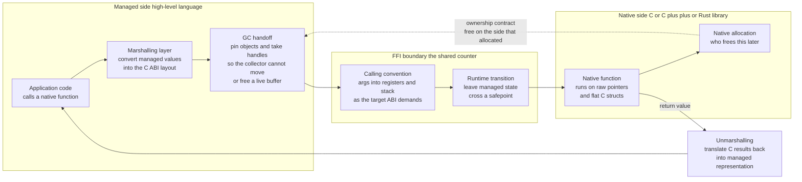

# 🔌 Foreign Function Interfaces and Interop

> [!abstract] TL;DR
> A **Foreign Function Interface (FFI)** is the machinery that lets a program written in one language **call functions and share data with code written in another** — Python calling a C image library, Java calling a native crypto routine, Rust calling into the operating system, WebAssembly importing host functions. No language is an island: the entire polyglot software world is glued together by FFI. It works because both sides agree on an **ABI** — a binary contract covering the **calling convention** (how arguments land in registers and on the stack), **data layout** (how a struct or array is arranged in memory), and **symbol naming** — and because almost every language can speak the **C ABI**, which is the universal lingua franca of interop (`extern "C"` disables name mangling to expose that contract). The hard parts are not the call itself but everything around it: **marshalling** (converting a managed string or array into a raw C `char*` or pointer-plus-length, often copying), **memory ownership** (deciding who allocates and who frees, and stopping a garbage collector from moving or freeing a buffer the native side still holds — hence **pinning** and **GC handles**), **error handling** (exceptions do not cross the boundary, so they must be flattened into error codes), and **call overhead** (each crossing costs marshalling plus ABI translation plus sometimes a GC safepoint transition, which is why **chatty** fine-grained FFI is slow and **batching** work into a few **coarse** calls is the master optimization). FFI is inherently **unsafe** — it bypasses the managed language's guarantees, so one bad native call can corrupt memory or crash the whole runtime.

---

## Intuition

**Analogy — the trading counter between two merchants who do not share a language.** Imagine a merchant who speaks only Portuguese and another who speaks only Cantonese, meeting to do business at a border. They cannot converse, but they can still trade if they agree, in advance, on a **shared protocol at the counter**: goods are handed over *this* way (stacked, labelled, in an agreed unit), money is counted out *that* way (coins in a tray, largest first), and a nod means "done." Neither has to learn the other's language — they only have to agree on the ritual at the counter. Each merchant privately translates the ritual into their own way of thinking, but the counter itself is neutral, fixed, and understood by both.

A Foreign Function Interface is exactly that counter between two programming languages. Python does not understand Rust, and the CPU running compiled Rust does not understand Python objects. But if both sides agree on a shared protocol — pass an integer *this* way, hand over a text buffer *that* way (a pointer plus a length), signal an error with a return code — then Python can call the Rust function and get an answer back. The agreed ritual is the **Application Binary Interface (ABI)**, and the act of packing your side's data into the counter's fixed format (and unpacking what comes back) is **marshalling**. Everything expensive and dangerous about interop comes from that translation at the counter: it takes time, and if you get the handoff protocol even slightly wrong, you do not get a polite error — you get corrupted goods, or the whole marketplace burns down.

---

## How It Works

### Core Mechanics

An FFI call is far more than "jump to another function." The call itself is one machine instruction; the interop cost is the choreography around it. Walking a single call from a managed language into a native library:

**1. The ABI is the foundation — usually the C ABI.** Two pieces of compiled code can only call each other if they agree on the **Application Binary Interface**: which registers hold which argument, how the stack frame is laid out, who cleans it up, how a struct is packed and padded, how integers and floats and pointers are represented, and what symbol name the callee is published under. Every language could invent its own ABI, but then every pair of languages would need a custom bridge. Instead the industry converged on the **C ABI** as the universal contract, because it is simple, stable, and every platform's operating system exposes its own APIs through it. So Rust, Go, Swift, Java, and Python all learned to speak C at the boundary even when they do nothing like C internally. In C++, `extern "C"` tells the compiler "publish this function under the plain C ABI with no **name mangling**," so `add(int,int)` is exported as the symbol `add` instead of `_Z3addii` — that one keyword is what makes a C++ library callable from anything. *(The ABI, calling conventions, and name mangling are covered in depth by the forthcoming sibling `Runtime_Systems_and_the_ABI`, and how symbols are resolved and bound at load time by `Linkers_and_Loaders`.)*

**2. Marshalling — translating data across the boundary.** The two sides represent data differently, so arguments must be **marshalled**: a managed (heap-boxed, header-carrying, possibly UTF-16) string becomes a raw C `char*` (a bare pointer to NUL-terminated bytes); a high-level dynamic array becomes a **pointer plus a length**; a language object becomes a flat C `struct` with matching field order, sizes, and padding. Simple scalars (an `int`, a `double`) are nearly free — they already match the C representation and may pass in a register. Aggregates are expensive: strings and arrays are often **copied** into a native buffer, and structs must be **repacked** field by field. **Boxing/unboxing** appears here too — a managed `Integer` object may need to be unwrapped to a raw machine `int` before it can be handed across. Marshalling cost is proportional to the *amount and shape* of data, and it is the dominant per-call tax for anything richer than a scalar.

**3. Calling convention and the runtime transition.** Once the arguments are in C-ABI form, the caller places them exactly where the target's calling convention demands — the first few integer arguments in specific registers, the rest on the stack — and executes the call. For a runtime with a **garbage collector or green threads**, there is an extra step: the thread must **transition out of managed execution state** (cross a **safepoint**, tell the runtime "I am now in native code and will not touch managed objects"), so the collector knows not to expect this thread to poll for GC and so a stack scan does not mistake native frames for managed ones. This transition is why FFI in GC languages (Go's cgo, the JVM's JNI) carries a fixed per-call cost that a thin, no-GC binding (a C-to-C call, or Python `ctypes` on a simple function) does not.

**4. Execution and the return trip.** Native code runs on raw pointers and C structs, oblivious to the managed world. When it returns, everything happens in reverse: the C return value is **unmarshalled** back into a managed representation (a returned `char*` copied into a managed string, an out-parameter buffer wrapped into a managed array), the thread transitions back into managed state and re-synchronizes with the GC, and control returns to the caller.

**5. Memory ownership — the hardest problem.** The single question that causes the most FFI bugs is **who owns this memory, and who frees it.** If the native side returns a pointer to a buffer it `malloc`ed, the managed side must eventually call the matching `free` — using the *same allocator* — or leak. If the managed side hands a pointer into a GC-managed buffer to native code, two disasters loom: the collector might **move** the object (compacting GCs relocate live objects, invalidating the raw pointer the native side is holding), or **free** it (if the managed side drops its last reference while native code still uses it, that is a **use-after-free**). The fix is **pinning** (asking the GC "do not move or collect this object until I release it") via **GC handles**. Lifetimes must be reasoned about *across* a boundary the type system cannot see through, which is why ownership is the graduate-level heart of FFI. *(Ties to the forthcoming `Garbage_Collection` and `Memory_Management_and_Allocation_Runtime`; the OS-level allocator view is `Memory_Management_and_Allocation`.)*

**6. Callbacks and reentrancy.** Interop is rarely one-directional. Native libraries often take a **function pointer** (a callback) to call back into your code — a comparator for a sort, a progress handler, an event notification. This means the native side re-enters managed code, which raises its own hazards: the callback may run **on a native thread the runtime does not know about** (it must be attached to the runtime first), or **while the GC is in a state that forbids allocation**, or **re-entrantly** while a managed lock is held. Passing a managed method as a C function pointer requires the runtime to generate a stable native thunk and keep it (and any captured state) pinned for as long as the native side might invoke it.

**7. Error handling across the boundary.** **Exceptions do not cross FFI.** A C function has no notion of a Java `throw` or a Python exception; a compiled Rust `panic` unwinding across the C ABI into a foreign runtime is **undefined behavior**. So errors must be **translated at the counter**: the native side returns an **error code** or sets an out-parameter, and the binding layer on the managed side checks it and re-raises a proper exception. Getting this wrong — letting an exception or panic unwind across the boundary — corrupts the stack. *(The mechanics of unwinding and why it cannot cross an ABI boundary are the forthcoming sibling `Exception_Handling_and_Stack_Unwinding`.)*

**8. The per-language mechanisms.** Every ecosystem exposes the same underlying ABI contract through different tooling: **Python** has `ctypes` (call any shared library at runtime with no compile step), `cffi` (declare the C API and let it generate the glue), and the low-level **CPython C-API** (write a native extension that manipulates `PyObject*` directly, subject to the GIL). **Java** has the classic **JNI** (verbose, error-prone, with explicit `Get/ReleaseArrayElements` marshalling) and the modern **Project Panama / Foreign Function & Memory API** (`java.lang.foreign`), which replaces hand-written JNI with a safer, faster, largely code-generated interface. **Rust** uses `extern "C"` blocks plus `#[repr(C)]` types, with `bindgen` generating Rust declarations from C headers and `cbindgen` generating C headers from Rust. **Go** has **cgo**, powerful but carrying a notably high per-call cost because of the goroutine-to-OS-thread and GC-state transition. **Node.js** exposes **N-API** for stable native addons; **Swift** bridges transparently to Objective-C and C; and **WebAssembly** defines interop declaratively through its **import/export** interface. *(cgo's cost model is detailed in [[Go_CGO]]; CPython's C-API and GIL interaction in [[Python_Internals]]; the WebAssembly host boundary in [[Rust_WebAssembly]]; JVM bytecode and JNI context in [[Bytecode_and_JVM]].)*

**9. Binding generators and WebAssembly's typed future.** Writing marshalling glue by hand is tedious and unsafe, so **generators** automate it: **SWIG** produces bindings for many target languages from annotated C/C++ headers; `bindgen` and `cbindgen` do the same for Rust. Looking forward, **WebAssembly and its Component Model** propose a *typed* interop story — instead of everyone flattening to untyped C pointers, components describe their interfaces in a high-level **Interface Type** language (WIT), and the runtime generates the marshalling, promising safe, language-agnostic interop without a shared unsafe C ABI. *(This "typed successor to the C ABI" idea recurs in the forthcoming `WebAssembly_and_Portable_Targets` and `The_Future_of_Compilers`.)*

### Flow / Architecture



*The call instruction itself is trivial; everything that makes FFI slow and dangerous lives in the two outer bands — marshalling data into ABI shape on the way in and out, and the memory-ownership handoff drawn as the dashed contract between the native allocation and the managed GC.*

---

## Key Concepts

**Secondary (intuitive, no CS background needed)**
- **The trading counter** — two languages that cannot understand each other can still cooperate by agreeing on a fixed handoff ritual at the boundary.
- **Repackaging goods** — data must be translated into the shared format before it crosses, and unpacked on the way back; that repackaging is marshalling, and it takes time.
- **Who cleans up** — if one side leaves a buffer at the counter, someone has to agree to dispose of it later, or it piles up forever (a leak).
- **Chatty versus batched** — making a thousand tiny trips across the counter is far slower than making one trip with a full cart; batch the work.

**Undergraduate (a systems / languages course)**
- **The ABI as the contract** — calling convention, register and stack argument passing, struct layout and padding, and name mangling, with the **C ABI** as the universal interop lingua franca and `extern "C"` as the switch that exposes it.
- **Marshalling of strings, arrays, and structs** — managed string to `char*`, dynamic array to pointer-plus-length, object to `#[repr(C)]`/POD struct, and the copy costs involved.
- **Per-language FFI mechanisms** — Python `ctypes`/`cffi`/C-API, Java JNI vs Panama, Rust `extern`/`bindgen`, Go cgo, Node N-API, and their differing overheads.
- **Error translation** — why exceptions cannot cross the boundary and must become return codes / out-parameters.
- **Binding generators** — SWIG, bindgen, cbindgen turning headers into glue.

**Graduate (runtime and safety internals)**
- **Memory ownership and lifetimes across the boundary** — pinning, GC handles, compacting-collector object movement, the allocator-mismatch free bug, and use-after-free / leak hazards the type system cannot see.
- **The runtime transition** — safepoints, managed-to-native state changes, stack scanning, and why GC/green-thread runtimes pay a fixed per-call FFI tax (cgo, JNI) that thin bindings do not.
- **Callbacks, reentrancy, and thread attachment** — invoking managed code from unknown native threads, GC-forbidden regions, and generating stable native thunks for managed closures.
- **Undefined behavior at the boundary** — panics/exceptions unwinding across a C ABI frame, ABI mismatches, and the FFI trust boundary as a security surface.
- **Typed interop** — the WebAssembly Component Model / Interface Types as a proposed safe, language-agnostic successor to the untyped C ABI.

---

## Python Demo

```python
# MODELS the core performance lesson of FFI: every crossing of the language
# boundary pays a FIXED cost (marshalling arguments into the C ABI layout,
# unmarshalling results, and -- in a GC runtime -- a safepoint / GC-state
# transition) ON TOP OF the actual useful native work.
#
# We compare two interop styles for processing N items through a "native"
# function:
#   * CHATTY  : one FFI call per item        -> N boundary crossings
#   * BATCHED : one FFI call per B items      -> N / B boundary crossings
#
# The model shows why CHATTY fine-grained FFI is slow (overhead dominates)
# and why BATCHING work into fewer, coarser calls amortizes the fixed cost
# toward the pure-native throughput ceiling. We plot THROUGHPUT vs
# WORK-PER-CALL (batch size), and the fraction of time spent crossing the
# boundary. Pure standard library + matplotlib (no numpy required).

import math
import matplotlib.pyplot as plt

# ---------------------------------------------------------------------------
# Cost model, all times in NANOSECONDS.
#   BOUNDARY_NS  = fixed cost paid ONCE PER FFI CALL, independent of batch size:
#                  marshalling setup + ABI/calling-convention translation +
#                  (for a GC runtime) the safepoint / managed<->native transition.
#   PER_ITEM_NS  = cost that scales with the number of items: per-element
#                  marshalling (copy/convert one value) + the useful native work.
# We model an EXPENSIVE crossing (cgo / JNI style, with a GC transition) and a
# CHEAP crossing (thin ctypes-style call) to show batching helps most when the
# boundary is dear.
# ---------------------------------------------------------------------------
N            = 1_000_000        # total items to process
BOUNDARY_EXPENSIVE_NS = 250.0   # e.g. cgo / JNI: transition dominates a tiny call
BOUNDARY_CHEAP_NS     = 25.0    # e.g. a thin native call, no GC transition
PER_ITEM_NS  = 5.0              # per-item marshal + useful native work

def total_time_ns(n, batch, boundary_ns, per_item_ns):
    """Total wall time to process n items in calls of `batch` items each."""
    calls = math.ceil(n / batch)                 # number of boundary crossings
    return calls * boundary_ns + n * per_item_ns # fixed-per-call + per-item

def throughput_items_per_sec(n, batch, boundary_ns, per_item_ns):
    t_ns = total_time_ns(n, batch, boundary_ns, per_item_ns)
    return n / (t_ns * 1e-9)                      # items per second

def overhead_fraction(batch, boundary_ns, per_item_ns):
    """Share of time spent crossing the boundary rather than doing useful work."""
    per_call = boundary_ns + batch * per_item_ns
    return boundary_ns / per_call

# The pure-native ceiling: boundary cost amortized to zero (batch -> infinity).
CEILING = 1.0 / (PER_ITEM_NS * 1e-9)             # items/sec if crossings were free

# ---------------------------------------------------------------------------
# Sweep batch size (work-per-call) on a log scale.
# batch = 1 IS the chatty extreme (one crossing per item).
# ---------------------------------------------------------------------------
batches = [1, 2, 5, 10, 20, 50, 100, 200, 500, 1000, 2000, 5000, 10000]

tput_expensive = [throughput_items_per_sec(N, b, BOUNDARY_EXPENSIVE_NS, PER_ITEM_NS) for b in batches]
tput_cheap     = [throughput_items_per_sec(N, b, BOUNDARY_CHEAP_NS,     PER_ITEM_NS) for b in batches]
ovh_expensive  = [overhead_fraction(b, BOUNDARY_EXPENSIVE_NS, PER_ITEM_NS) for b in batches]

# ---------------------------------------------------------------------------
# Report the headline numbers: chatty (batch=1) vs a coarse batch.
# ---------------------------------------------------------------------------
chatty = throughput_items_per_sec(N, 1, BOUNDARY_EXPENSIVE_NS, PER_ITEM_NS)
coarse = throughput_items_per_sec(N, 1000, BOUNDARY_EXPENSIVE_NS, PER_ITEM_NS)
print("Expensive crossing (cgo / JNI style, GC transition per call):")
print(f"  chatty  (1 item  per call): {chatty:15,.0f} items/sec")
print(f"  batched (1000 items/call) : {coarse:15,.0f} items/sec")
print(f"  speedup from batching     : {coarse / chatty:6.1f}x")
print(f"  pure-native ceiling       : {CEILING:15,.0f} items/sec")
print(f"  chatty reaches only {100 * chatty / CEILING:4.1f}% of the ceiling;"
      f" batched reaches {100 * coarse / CEILING:4.1f}%.")

# ---------------------------------------------------------------------------
# VISUALIZE.
#   Left : throughput vs work-per-call for expensive vs cheap crossing, with
#          the native ceiling as a dashed line -- both curves climb toward it
#          as batching amortizes the fixed crossing cost.
#   Right: the fraction of time wasted crossing the boundary, which starts near
#          100% when chatty and collapses toward 0% as the batch grows.
# ---------------------------------------------------------------------------
fig, (axL, axR) = plt.subplots(1, 2, figsize=(13, 5.2))

axL.plot(batches, tput_expensive, "o-", color="#d62728",
         label="expensive crossing (cgo / JNI + GC transition)")
axL.plot(batches, tput_cheap, "s-", color="#1f77b4",
         label="cheap crossing (thin ctypes-style call)")
axL.axhline(CEILING, ls="--", color="#2ca02c", alpha=0.8,
            label="pure-native ceiling (crossings free)")
axL.set_xscale("log")
axL.set_xlabel("work per call  =  batch size  (items per FFI crossing)")
axL.set_ylabel("throughput (items / second)")
axL.set_title("Batching amortizes the fixed FFI cost\nchatty (batch=1) is far below the ceiling")
axL.legend(fontsize=8, loc="lower right")
axL.grid(True, which="both", alpha=0.3)

axR.plot(batches, [100 * f for f in ovh_expensive], "o-", color="#d62728")
axR.set_xscale("log")
axR.set_xlabel("work per call  =  batch size  (items per FFI crossing)")
axR.set_ylabel("time spent crossing the boundary (percent)")
axR.set_title("Chatty interop wastes almost all its time\nat the boundary; batching reclaims it")
axR.grid(True, which="both", alpha=0.3)
axR.annotate("chatty: overhead dominates", xy=(1, 100 * ovh_expensive[0]),
             xytext=(3, 70), fontsize=8,
             arrowprops=dict(arrowstyle="->", color="#555555"))

plt.tight_layout()
plt.savefig("ffi_marshalling_overhead.png", dpi=130)
print("\nSaved model visualization to ffi_marshalling_overhead.png")
```

Running it prints that, for the expensive (cgo/JNI-style) crossing, **chatty** interop — one FFI call per item — reaches only a few percent of the pure-native throughput ceiling because roughly 98% of every call is fixed boundary cost, while **batching** a thousand items per call amortizes that fixed cost to near zero and recovers almost the full ceiling, tens of times faster for the identical useful work. The left plot shows both the expensive and cheap crossings climbing toward the native ceiling as work-per-call grows — and that the batching payoff is *larger* when the boundary is more expensive. The right plot makes the waste visceral: at batch size 1 the boundary consumes almost all the time; by batch size 1000 it is a rounding error. This is the single most important practical FFI lesson — **design a coarse-grained boundary, never a chatty one.**

---

## Real-World Applications

> **Example — NumPy, the archetypal "thin Python skin over fast native code."** NumPy is a Python API wrapping C (and BLAS/LAPACK Fortran) numerical kernels through the CPython C-API. The reason `a + b` on two million-element NumPy arrays is orders of magnitude faster than a Python `for` loop is *exactly* this note's lesson: the Python loop makes millions of chatty, per-element boundary crossings through the interpreter, while NumPy makes **one coarse FFI call** that marshals the whole array (a pointer plus a length plus a dtype) into a C loop that runs entirely on the native side with no re-entry. The array is a contiguous C buffer precisely so it needs *no* per-element marshalling — the batching is baked into the data model.

Where FFI is the load-bearing glue:

- **Reusing mature C/C++ libraries everywhere.** OpenSSL, SQLite, libcurl, FFmpeg, zlib, and the CUDA runtime are C libraries called from Python, Ruby, Node, Go, Rust, and the JVM through FFI — nobody rewrites them per language. SQLite alone is embedded via bindings into essentially every language.
- **The "rewrite the hot loop in C/Rust" pattern.** Profile a service, find the 10% of code burning the time, and move just that kernel behind a **thin C or Rust shim** exposed over the C ABI — keeping the ergonomic managed language for the other 90%. Python's `cryptography`, `pydantic-core`, `orjson`, and `polars` are Rust cores behind a Python API; the `PyO3`/`maturin` toolchain exists for exactly this.
- **Calling the operating system.** Every OS exposes its services through a C ABI, so `ctypes`, cgo, JNI, and Rust `libc` are how managed languages reach `open`, `mmap`, `ioctl`, sockets, and platform APIs (Win32, Cocoa) — FFI is the layer between a runtime and the [[System_Calls_and_the_Kernel_Interface|kernel interface]].
- **Embedding scripting languages.** Games and applications embed **Lua**, **Python**, or **V8/JavaScript** as a native library and expose host functions back to the script through the reverse direction of the same FFI — a C host calling into a managed interpreter and registering callbacks.
- **WebAssembly host interop.** A Wasm module (compiled from Rust, C, or Go) runs in a sandbox and reaches the outside world *only* through explicitly declared **imports and exports** — a strict, capability-style FFI boundary; WASI and the Component Model are standardizing it as typed, language-agnostic interop (see [[Rust_WebAssembly]]).

---

## Common Pitfalls

- **A chatty boundary.** Calling a native function once per element in a tight loop pays the fixed marshalling-plus-transition cost millions of times; the useful work drowns in overhead. This is the single most common FFI performance bug — and the demo's whole point. **Fix:** redesign the API to pass whole arrays/batches and do the loop *inside* native code. In Go, cgo's per-call cost makes this rule especially harsh ([[Go_CGO]]).
- **Ownership confusion — who frees this?** Freeing native-allocated memory with the wrong allocator, forgetting to free it (leak), or double-freeing it are classic crashes. The buffer a C function returns must be released by the matching `free` on the side and heap that allocated it. **Fix:** document and encode the ownership contract at the boundary; provide an explicit `xxx_free(ptr)` export and call it deterministically.
- **Letting the GC move or collect a buffer the native side holds.** A compacting collector can relocate a live object, invalidating a raw pointer already handed to C; or drop the last managed reference mid-call, causing a **use-after-free**. **Fix:** **pin** the object / take a **GC handle** for the entire duration native code may touch it, and only then hand over the pointer.
- **Letting an exception or panic unwind across the boundary.** A Rust `panic!` or a C++ exception propagating across a C ABI frame into a foreign runtime is undefined behavior and corrupts the stack. **Fix:** catch at the boundary (`catch_unwind`, a top-level `try`), translate to an error code, and never let unwinding escape ([[Bytecode_and_JVM]] and the forthcoming `Exception_Handling_and_Stack_Unwinding` cover why).
- **Struct layout mismatch.** If the managed declaration of a C struct disagrees on field order, integer width, alignment, or padding, reads land at the wrong offsets and silently return garbage. **Fix:** use `#[repr(C)]` / explicit layout, generate the binding from the real header (`bindgen`, `cffi`), and never hand-transcribe a struct.
- **String encoding and NUL-termination.** Passing a managed UTF-16 or non-terminated string where C expects a NUL-terminated UTF-8 `char*` truncates or reads out of bounds. **Fix:** marshal strings explicitly (encode, NUL-terminate) and be clear about who owns the resulting buffer.
- **Callbacks on the wrong thread or in a GC-forbidden state.** A native library invoking your managed callback from a thread the runtime never attached, or while the collector forbids allocation, deadlocks or crashes. **Fix:** attach native threads to the runtime before they call in, keep callback thunks and their captured state pinned, and keep callback bodies minimal.
- **Treating FFI as safe.** FFI **bypasses the managed language's guarantees** — memory safety, bounds checking, type safety all stop at the counter. One bad native call can corrupt the heap or crash the entire process, and it is a genuine security **trust boundary** ([[OS_Security_and_Isolation]]). **Fix:** minimize the unsafe surface, validate everything crossing in, and wrap the raw FFI in a small audited safe layer.

---

## Related Concepts

- [[Compilers_Overview]] — the end-to-end pipeline; FFI lives at the runtime/linking edge where a compiled artifact must interoperate with foreign code.
- [[Go_CGO]] — Go's C interop and its notably high per-call cost — the canonical real-world example of why cgo boundaries must be coarse, not chatty.
- [[Python_Internals]] — the CPython C-API, `ctypes`, and the GIL, i.e. how Python's own FFI mechanisms and marshalling work.
- [[Rust_WebAssembly]] — Wasm's explicit import/export interface as a modern, sandboxed, increasingly *typed* interop boundary.
- [[Bytecode_and_JVM]] — the JVM context for JNI and Project Panama, and why exceptions cannot unwind across the native boundary.
- [[System_Calls_and_the_Kernel_Interface]] — the C-ABI boundary between a managed runtime and the OS; FFI is how languages reach syscalls and platform APIs.
- [[OS_Security_and_Isolation]] — FFI as a trust boundary; native code escapes the managed language's safety guarantees and can compromise the whole process.
- [[Memory_Management_and_Allocation]] — the allocator view behind the ownership problem: who `malloc`s, who `free`s, and why allocator mismatch corrupts the heap.
- *(Forthcoming Compilers siblings referenced in prose: `Runtime_Systems_and_the_ABI`, `Linkers_and_Loaders`, `Garbage_Collection`, `Memory_Management_and_Allocation_Runtime`, `Exception_Handling_and_Stack_Unwinding`, `WebAssembly_and_Portable_Targets`, `The_Future_of_Compilers`.)*

---

## Review Questions

1. **(Conceptual)** Explain why the **C ABI** became the universal interop contract even though almost no modern language works like C internally. In your answer define what an ABI actually specifies (calling convention, data layout, name mangling), and describe precisely what `extern "C"` does to a C++ function and why that is what makes the function callable from Python, Rust, or the JVM.
2. **(Scenario)** You are exposing a Rust routine that scores a batch of records to a Python service, and a first cut calls the Rust function once per record inside a Python loop; it is disappointingly slow despite Rust being "fast." Using the fixed-per-call versus per-item cost model, explain where the time is going, redesign the interface to fix it, and state what has to be true about the data representation for the fix to eliminate per-item marshalling entirely.
3. **(Trade-off)** A native function will `malloc` a result buffer and return a pointer to it, and the managed caller is a language with a **compacting garbage collector**. Walk through *every* memory-ownership hazard across the boundary — GC object movement, use-after-free, leak, and allocator mismatch on free — and describe the mechanisms (pinning / GC handles, an explicit free export, ownership documentation) you would use to make the boundary correct. Why can none of this be checked by the managed language's type system?

---

## Sources

- Levine, J. *Linkers and Loaders*. Morgan Kaufmann, 1999 — symbol resolution, name mangling, and the loading of native shared libraries that FFI depends on.
- Liang, S. *The Java Native Interface: Programmer's Guide and Specification*. Addison-Wesley, 1999 — the canonical treatment of JNI marshalling, local/global references, and pinning.
- Python Software Foundation. *ctypes — A foreign function library for Python* and *Extending and Embedding the Python Interpreter* (CPython C-API docs), [docs.python.org](https://docs.python.org/3/library/ctypes.html).
- The Rust Project. *The Rustonomicon — Foreign Function Interfaces* and the `bindgen` User Guide, [doc.rust-lang.org/nomicon/ffi.html](https://doc.rust-lang.org/nomicon/ffi.html).
- The Go Authors. *cgo command documentation* and Cockroach Labs, "The Cost and Complexity of Cgo," [pkg.go.dev/cmd/cgo](https://pkg.go.dev/cmd/cgo).
- WebAssembly Community Group. *WebAssembly Component Model and Interface Types (WIT)* design, [github.com/WebAssembly/component-model](https://github.com/WebAssembly/component-model).

---

#compilers #ffi #interop #marshalling #language-bindings
