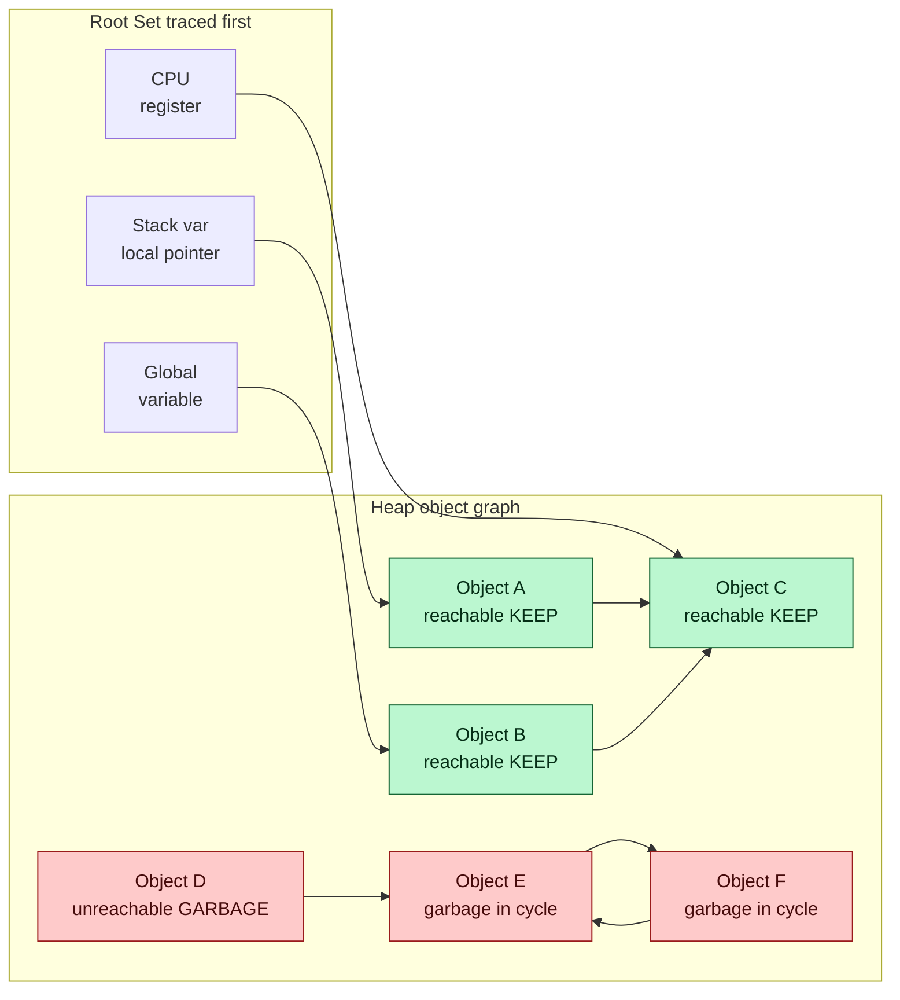

# ♻️ Garbage Collection

> [!abstract] TL;DR
> **Garbage collection (GC)** is automatic reclamation of heap memory the program can no longer reach. Instead of the programmer calling `free`/`delete` — and getting it wrong (leaks, use-after-free, double-free) — the runtime periodically finds every object still **reachable** from a **root set** (stack variables, globals, registers) and treats everything else as garbage to recycle. The workhorse algorithms are **reference counting** (immediate but blind to cycles) and **tracing collectors** (**mark-and-sweep**, **mark-compact**, **copying**), refined in production by the **generational** design that exploits "most objects die young." GC trades *determinism and control* for *safety and productivity*, and it only works because the **compiler cooperates** — emitting stack maps and safe points so the collector can find the roots.

---

## Intuition

**Analogy — the office you never have to tidy.** Imagine an office where you never throw out your own trash. A janitor walks in periodically and asks a single question about every sheet of paper on every desk: *"Starting from the things people are actively holding — the documents in their hands, the folders on the shared reference shelf, the notes pinned to the board — can I reach this paper by following the trail of sticky-note pointers from one to the next?"* Every paper reachable that way is still in use and stays. Every paper that **nothing points to any longer** — no hand, no shelf, no chain of references leads to it — is unreachable by definition, so nobody could ever read it again. The janitor recycles it. Crucially, the janitor doesn't care *why* a paper was abandoned or *how long* ago; the only test is **reachability**.

That is exactly garbage collection. The "hands, shelf, and board" are the **root set** (stack, globals, registers). The "trail of sticky notes" is the **object graph** of pointers. An object is **live** if reachable from a root and **garbage** if not — and unreachable memory is provably safe to reclaim because the program has no way to name it again. GC frees the programmer from manual cleanup by making "is this still needed?" a mechanical graph-reachability question the runtime answers on its own.

---

## How It Works

### Core Mechanics

1. **The problem GC solves.** Manual memory management (`malloc`/`free`, `new`/`delete`) is a correctness minefield: forget to free and you **leak**; free too early and you get **use-after-free**; free twice and you get **double-free** (heap corruption, the classic exploit primitive). These are among the most common and most dangerous bugs in C/C++. GC automates deallocation, eliminating the *whole class* of leak/use-after-free/double-free bugs in exchange for less control over *when* memory is released. (See the planned sibling **Memory_Management_and_Allocation_Runtime** for the allocator side — free lists, bump pointers, size classes.)

2. **Reachability is the definition of "live."** An object is **live** if and only if there is a path of references reaching it from the **root set** — the pointers the running program can access *directly*: local variables on the **stack**, **global**/static variables, and values in CPU **registers**. Everything not reachable is **garbage**. This is a pure **graph-traversal** problem: the heap is a directed graph (objects are nodes, references are edges), roots are the starting set, and GC computes the set of nodes reachable by [[DFS]] or [[BFS]] (see [[Graph_Representation]]). Reachability *over-approximates* liveness — an object may be reachable yet never used again — but it is a **sound, cheap, decidable** proxy the runtime can compute without predicting the future.

3. **Reference counting (RC).** Each object stores a counter of how many references point to it. Assigning a reference increments it; dropping one decrements it; when it hits **zero**, the object is freed *immediately*. Pros: prompt reclamation, no long pauses, simple, cache-friendly locality. Cons: **cannot collect cycles** (two dead objects pointing at each other keep each other's count at 1 forever), plus per-pointer-write overhead and thread-safety cost on the counters. Used by **CPython** (refcounting + a cycle detector), **Swift ARC**, and C++ `shared_ptr`.

4. **Tracing collectors.** Rather than track counts continuously, tracers periodically *trace* the graph from the roots:
   - **Mark-and-sweep:** **MARK** — walk from roots, set a mark bit on every reachable object. **SWEEP** — scan the whole heap; anything unmarked is garbage and goes back on the free list. Simple, collects cycles, but leaves the surviving heap **fragmented**.
   - **Mark-compact:** after marking, slide live objects together to one end, eliminating fragmentation at the cost of moving objects and fixing up all their pointers.
   - **Copying / semi-space:** split the heap in two; allocate from one half; on GC, **copy** live objects to the other half (compacting for free) and flip. Allocation becomes a trivial pointer bump and dead objects cost *nothing* to reclaim — but you pay by using only **half** the heap and by moving every survivor.

5. **Generational GC — the weak generational hypothesis.** Empirically, **most objects die young**: a huge fraction of allocations become garbage almost immediately (temporaries, intermediate results), while the few that survive tend to live a long time. Generational collectors exploit this by splitting the heap into a small **young generation / nursery** and an **old generation**. **Minor collections** scan only the cheap nursery *frequently*, reclaiming the flood of short-lived objects; survivors are **promoted (tenured)** to the old generation, which is collected *rarely* by an expensive **major/full** collection. To trace the young gen without scanning the whole old gen, the runtime tracks **old→young pointers** using **write barriers** that populate a **remembered set** (or card table). This is the dominant production design: **JVM (HotSpot G1, ZGC)**, **.NET CLR**, and **V8** all use it.

6. **Stop-the-world vs concurrent/incremental.** The simplest collector **stops the world**: it pauses every application ("mutator") thread while it traces, guaranteeing a stable graph. Great for throughput, terrible for **latency** — a multi-hundred-millisecond pause is fatal for interactive or real-time systems. Modern low-latency collectors run **concurrently** with the mutator using **tri-color marking** (white = unvisited, gray = seen but children not yet scanned, black = fully scanned) plus **read/write barriers** to preserve the tri-color invariant as the graph mutates *during* the trace. **Incremental** collectors do a little marking at a time; **parallel** collectors use many GC threads. Low-pause collectors like **ZGC**, **Shenandoah**, and **Go's** concurrent collector keep pauses in the sub-millisecond range — trading raw throughput and barrier overhead for predictable latency.

7. **Escape analysis reduces GC pressure.** The compiler can prove that some objects never **escape** the function (or thread) that creates them. Such objects can be **stack-allocated** (freed automatically on return) or **scalar-replaced** (exploded into registers) instead of ever touching the GC heap — fewer allocations means fewer collections. This is a standard optimization in HotSpot and the Go compiler (see [[Go_Pointers_and_Memory]] for Go's escape analysis, and the planned **Interprocedural_and_Link_Time_Optimization** sibling for whole-program escape reasoning).

8. **Compiler / runtime cooperation — finding the roots.** GC is only correct if the collector can *find every root and every pointer*. The compiler emits **stack maps** describing, at each **GC safe point**, exactly which stack slots and registers currently hold live pointers. At a safe point the runtime can pause a thread, read its stack map, and enumerate roots precisely — this is **precise (exact) GC**. **Conservative GC** (e.g., the Boehm collector) instead treats *any* stack word that *looks like* a heap pointer as a root; it needs no compiler support but can retain garbage on false positives and cannot safely move objects. The compiler's stack maps and safe points are what make precise, moving, generational collectors possible (see the planned **Runtime_Systems_and_the_ABI** and **Bytecode_and_Virtual_Machines** siblings, and [[JIT_Compilation]] for how JITs keep stack maps consistent with optimized code).

9. **The alternative — no GC at all.** **Rust** achieves memory safety with **zero** runtime GC by pushing the analysis to *compile time*: its **ownership and borrowing** system statically proves when each value's lifetime ends and inserts the `free` for you (see [[Ownership_and_Borrowing]] and [[Type_Checking_and_Type_Systems]]). Other GC-free strategies include manual management, **region/arena** allocation (free a whole region at once), and RAII. These give deterministic reclamation and no pauses — at the cost of a stricter programming model or manual discipline.

### Flow / Architecture



The mark phase colors everything reachable from a root **live** (green). Objects `D`, `E`, `F` have no path from any root — `E` and `F` even form a **cycle** that keeps both reference counts at 1 forever — so a tracing collector reclaims all three while pure reference counting would leak the cycle.

---

## Key Concepts

**Secondary (plain-English foundation).**
- **Garbage** = memory the program can no longer reach, so it can never be used again → safe to recycle.
- **Root set** = the pointers the program holds *directly*: stack locals, globals, registers.
- **Reference counting** = "count who points at me; free me when nobody does" — simple but leaks cycles.
- GC frees you from writing `free`/`delete`, removing leaks and use-after-free bugs.

**Undergraduate (CS-background depth).**
- **Reachability as graph traversal:** the heap is a directed graph; live set = nodes reachable from roots via DFS/BFS.
- **Tracing family:** mark-and-sweep (mark bits + heap scan), mark-compact (defragment), copying/semi-space (bump-pointer allocation, half-heap cost).
- **Generational GC + weak generational hypothesis:** young/old split, cheap frequent minor collections, promotion of survivors, write barriers + remembered sets for old→young references.
- **Stop-the-world pause:** why a naive collector must halt all mutator threads, and why that hurts tail latency.

**Graduate (systems-level mastery).**
- **Tri-color invariant** and concurrent marking: no black object may point directly to a white object without a gray intermediary; **read/write barriers** (Dijkstra insertion barrier, Yuasa deletion/SATB barrier) enforce it under mutation.
- **Precise vs conservative** collection: stack maps + GC safe points enable exact, *moving* collectors; conservative scanning trades compiler support for retention and immovability.
- **Latency-oriented collectors:** ZGC/Shenandoah **load-value/read barriers** and colored pointers enabling concurrent relocation with sub-millisecond pauses; the **throughput vs latency vs footprint** trilemma.
- **Escape analysis, scalar replacement, and region inference** as compile-time ways to *avoid* the GC heap; contrast with Rust's ownership as a static-analysis alternative to any collector.

---

## Python Demo

```python
"""
Mark-and-Sweep Garbage Collection, from scratch.

We model a heap as a set of objects; each object holds references to
other objects, forming a directed OBJECT GRAPH. A ROOT SET anchors
liveness. The MARK phase traces every object reachable from the roots;
the SWEEP phase reclaims everything left unmarked -- including an
unreachable CYCLE that naive reference counting would leak forever.

Pure standard library for the algorithm; matplotlib only to visualize.
"""

from dataclasses import dataclass, field
import math
import random
import matplotlib.pyplot as plt
import matplotlib.patches as mpatches


# --------------------------------------------------------------------------
# Heap model
# --------------------------------------------------------------------------
@dataclass
class HeapObject:
    name: str
    refs: list = field(default_factory=list)  # outgoing references (edges)
    marked: bool = False                       # GC mark bit
    refcount: int = 0                          # for the reference-counting comparison


class Heap:
    def __init__(self):
        self.objects = {}     # name -> HeapObject
        self.roots = set()    # names directly reachable from the root set

    def alloc(self, name):
        self.objects[name] = HeapObject(name)

    def add_ref(self, src, dst):
        self.objects[src].refs.append(dst)
        self.objects[dst].refcount += 1       # dst gains an incoming reference

    def add_root(self, name):
        self.roots.add(name)
        self.objects[name].refcount += 1       # a root edge counts too

    # ---- MARK: trace reachable objects from the roots (iterative DFS) -----
    def mark(self):
        for obj in self.objects.values():
            obj.marked = False
        worklist = list(self.roots)            # the "gray" set in tri-color terms
        while worklist:
            obj = self.objects[worklist.pop()]
            if obj.marked:
                continue
            obj.marked = True                  # blacken this object
            for child in obj.refs:             # push its white children
                if not self.objects[child].marked:
                    worklist.append(child)

    # ---- SWEEP: reclaim every unmarked object -----------------------------
    def sweep(self):
        collected = [n for n, o in self.objects.items() if not o.marked]
        for n in collected:
            del self.objects[n]
        return collected

    def collect(self):
        self.mark()
        return self.sweep()


# --------------------------------------------------------------------------
# Build a scenario:  roots -> A, B ; A,B -> C (shared, live) ;
#                    D standalone garbage ; E <-> F unreachable CYCLE
# --------------------------------------------------------------------------
heap = Heap()
for name in ["A", "B", "C", "D", "E", "F"]:
    heap.alloc(name)

heap.add_root("A")
heap.add_root("B")
heap.add_ref("A", "C")
heap.add_ref("B", "C")     # C is shared and reachable
heap.add_ref("D", "E")     # D -> E ...
heap.add_ref("E", "F")     # E -> F ...
heap.add_ref("F", "E")     # F -> E  => E and F form a cycle, unreachable

# Snapshot reference counts BEFORE collecting (for the RC comparison).
rc_before = {n: o.refcount for n, o in heap.objects.items()}

# Run mark first so we can color the graph, then sweep.
heap.mark()
reachable = {n: o.marked for n, o in heap.objects.items()}
positions = {                     # fixed layout for a clean drawing
    "A": (0, 2), "B": (0, 0), "C": (2, 1),
    "D": (4, 3), "E": (5, 1), "F": (6, 2),
}
edges = [("A", "C"), ("B", "C"), ("D", "E"), ("E", "F"), ("F", "E")]

# Reference counting would free anything whose count hits 0 (D, once nothing
# points to it) but NEVER frees the E<->F cycle: each keeps the other at 1.
rc_would_leak = [n for n in ("E", "F") if rc_before[n] > 0]
collected = heap.sweep()

print("Reference counts before GC:", rc_before)
print("Reachable from roots     :", [n for n, m in reachable.items() if m])
print("Tracing GC collected     :", sorted(collected))
print("Reference counting LEAKS :", rc_would_leak, "(the unreachable cycle)")
print("Survivors after sweep    :", sorted(heap.objects))


# --------------------------------------------------------------------------
# Generational hypothesis: simulate object lifetimes -> "most die young"
# --------------------------------------------------------------------------
random.seed(0)
N = 20000
# Lifetimes (in # of minor collections survived) are heavily skewed young.
lifetimes = [random.expovariate(1 / 2.0) for _ in range(N)]  # mean ~2 collections
ages = list(range(0, 15))
survival = [sum(1 for L in lifetimes if L >= a) / N for a in ages]


# --------------------------------------------------------------------------
# Visualize: (1) object graph colored live/garbage, (2) survival curve
# --------------------------------------------------------------------------
fig, (ax1, ax2) = plt.subplots(1, 2, figsize=(13, 5.5))

# ---- (1) object graph ----
LIVE, DEAD = "#22c55e", "#ef4444"
for src, dst in edges:                         # draw directed edges first
    x0, y0 = positions[src]
    x1, y1 = positions[dst]
    ax1.annotate("", xy=(x1, y1), xytext=(x0, y0),
                 arrowprops=dict(arrowstyle="-|>", color="#475569", lw=1.6,
                                 shrinkA=16, shrinkB=16,
                                 connectionstyle="arc3,rad=0.12"))
for name, (x, y) in positions.items():         # then nodes on top
    color = LIVE if reachable[name] else DEAD
    ax1.add_patch(plt.Circle((x, y), 0.34, color=color, ec="black", zorder=3))
    ax1.text(x, y, name, ha="center", va="center",
             color="white", fontweight="bold", zorder=4)
    if name in heap.roots:                      # mark the roots with an arrow-in
        ax1.annotate("root", xy=(x, y + 0.34), xytext=(x - 1.1, y + 0.9),
                     ha="center", fontsize=9, color="#1e3a8a",
                     arrowprops=dict(arrowstyle="-|>", color="#1e3a8a", lw=1.4))
ax1.set_xlim(-1.7, 7); ax1.set_ylim(-1, 4)
ax1.set_aspect("equal"); ax1.axis("off")
ax1.set_title("Object graph: reachable (green) survive, garbage (red) swept\n"
              "E<->F is a cycle a tracing GC reclaims but refcounting leaks")
ax1.legend(handles=[mpatches.Patch(color=LIVE, label="reachable / live"),
                    mpatches.Patch(color=DEAD, label="unreachable / garbage")],
           loc="lower left")

# ---- (2) generational survival curve ----
ax2.plot(ages, survival, "o-", color="#7c3aed", lw=2)
ax2.fill_between(ages, survival, color="#7c3aed", alpha=0.15)
ax2.set_title("Weak generational hypothesis: most objects die young")
ax2.set_xlabel("age (minor collections survived)")
ax2.set_ylabel("fraction still alive")
ax2.grid(True, alpha=0.3)
ax2.annotate("steep early death ->\ncollect the nursery cheaply & often",
             xy=(2, survival[2]), xytext=(5, 0.7), fontsize=9,
             arrowprops=dict(arrowstyle="->", color="#334155"))

plt.tight_layout()
plt.savefig("garbage_collection.png", dpi=120)
print("\nSaved visualization to garbage_collection.png")
```

Running it prints the reachable set (`A, B, C`), shows the tracing collector reclaiming `D, E, F`, and confirms that reference counting would **leak** the `E <-> F` cycle (both counts stay at 1). The left plot colors the object graph by reachability; the right plot shows the steep early-death survival curve that motivates generational collection.

---

## Real-World Applications

> **Example — the JVM's generational collectors.** HotSpot's default **G1** collector partitions the heap into fixed-size regions and treats a dynamic subset as the young generation. Minor collections evacuate live young objects into survivor/old regions (a copying collector), using **card tables** as the remembered set for old→young references and the compiler's **oop maps** (stack maps) to find precise roots at safe points. When latency matters more than throughput, **ZGC** and **Shenandoah** use colored pointers and **load barriers** to relocate objects *concurrently*, holding pauses under a millisecond even on multi-terabyte heaps. Tuning `-Xmx`, pause-time goals, and generation sizes is a core JVM performance skill (see [[JVM_Architecture]] and [[JVM_Tuning]]).

- **CPython** uses **reference counting** for prompt reclamation *plus* a periodic **generational cycle detector** to catch the reference cycles RC alone cannot (see [[Python_Internals]]).
- **Go** ships a **concurrent, tri-color, non-generational** mark-and-sweep collector tuned for low pause times; GC runs concurrently with goroutines, pausing only briefly at safe points (see [[Goroutines_and_Scheduler]] and [[Go_Pointers_and_Memory]] for how escape analysis keeps objects off the GC heap).
- **V8 (Chrome/Node.js)** uses **Orinoco**: a generational design with a copying **Scavenger** for the young space and concurrent/incremental mark-compact ("Marking/Sweeping") for the old space.
- **.NET CLR** uses a three-generation (0/1/2) collector with a separate large-object heap.

---

## Common Pitfalls

- **"GC means no memory leaks."** GC eliminates *unreachable*-object leaks, not *logical* leaks. An ever-growing cache, a static list, or a forgotten event-listener registration keeps objects **reachable**, so the collector correctly refuses to free them. Managed leaks are about lingering references, not missing `free`.
- **Reference counting silently leaks cycles.** Two objects referencing each other (parent↔child, doubly linked node pairs) keep each other's count above zero forever. Use **weak references** to break the cycle, or a runtime that adds cycle detection (CPython) or tracing.
- **Fighting the collector by over-tuning.** Chasing GC flags without measuring often makes things worse. Reducing **allocation rate** (object pooling, value types, escape-friendly code) usually beats knob-twiddling — fewer allocations means fewer collections.
- **Assuming finalizers run promptly (or at all).** `finalize`/`__del__`/destructors triggered by GC run at an *unpredictable* time and may be skipped entirely. Never release scarce resources (files, sockets, locks) via finalizers — use explicit `close`/`try-with-resources`/context managers.
- **Ignoring GC in latency-critical paths.** A stop-the-world pause during a trading tick or a game frame is a visible glitch. Pick a low-latency collector, pre-allocate off the hot path, or use a GC-free language (Rust) where pauses are unacceptable.
- **Conservative-GC false retention.** Conservative collectors can mistake an integer that *looks like* a pointer for a live reference, pinning dead memory. Precise GC (via compiler stack maps) avoids this but requires runtime/compiler cooperation.

---

## Related Concepts

- [[Ownership_and_Borrowing]] — Rust's compile-time alternative to GC: static lifetime analysis inserts frees, achieving memory safety with zero collector and no pauses.
- [[Type_Checking_and_Type_Systems]] — the same static-analysis machinery that powers ownership/borrow checking; types tell the runtime which fields are pointers the GC must trace.
- [[DFS]] — the mark phase is literally a depth-first traversal of the object graph from the roots.
- [[BFS]] — an equally valid marking order; copying collectors often use breadth-first (Cheney's algorithm) evacuation.
- [[Graph_Representation]] — the heap is a directed graph of objects and references; representation choices affect trace cost.
- [[Python_Internals]] — CPython's reference counting plus generational cycle detector, a concrete hybrid design.
- [[Go_Pointers_and_Memory]] — Go's escape analysis decides stack vs heap allocation, directly reducing GC pressure.
- [[Goroutines_and_Scheduler]] — Go's concurrent collector coordinates with the goroutine scheduler at safe points.
- [[JIT_Compilation]] — JITs must emit stack maps consistent with optimized code so the GC can find precise roots.
- [[JVM_Architecture]] — where the heap, generations, and collectors live inside the JVM runtime.
- [[JVM_Tuning]] — practical GC tuning: heap sizing, pause-time goals, collector selection.

Planned Compilers siblings referenced above (not yet in the vault): **Memory_Management_and_Allocation_Runtime** (allocator internals), **Runtime_Systems_and_the_ABI** (stack maps, safe points, calling conventions), **Bytecode_and_Virtual_Machines** (managed runtimes), and **Interprocedural_and_Link_Time_Optimization** (whole-program escape analysis).

---

## Review Questions

1. **(Conceptual)** Precisely define when an object is *garbage*, and explain why reachability from the root set is a *sound but not complete* proxy for liveness. Give an example of an object that is reachable yet effectively dead.
2. **(Scenario)** You have two objects that reference each other but are otherwise unreachable from any root. Trace what happens under (a) pure reference counting and (b) mark-and-sweep. Which one leaks, and exactly why? How would a weak reference change the outcome?
3. **(Trade-off)** You are building a low-latency order-matching engine (99.9th-percentile latency budget: 1 ms) versus a nightly batch analytics job (maximize throughput, latency irrelevant). For each, choose between a stop-the-world generational collector, a concurrent low-pause collector (ZGC/Go), and a GC-free language (Rust). Justify each choice in terms of the throughput/latency/footprint trilemma and the cost of write/read barriers.

---

## Sources

- Jones, Hosking & Moss, *The Garbage Collection Handbook: The Art of Automatic Memory Management*, 2nd ed. (CRC Press, 2023).
- Wilson, "Uniprocessor Garbage Collection Techniques" (IWMM 1992) — the classic survey of tracing, generational, and incremental GC.
- [Oracle — HotSpot Garbage Collection Tuning Guide (JDK)](https://docs.oracle.com/en/java/javase/21/gctuning/index.html)
- [Go Blog — "A Guide to the Go Garbage Collector"](https://go.dev/doc/gc-guide)
- [V8 Blog — "Trash talk: the Orinoco garbage collector"](https://v8.dev/blog/trash-talk)
- [CPython Developer Guide — Garbage Collector Design](https://devguide.python.org/internals/garbage-collector/)

---

#compilers #garbage-collection #mark-and-sweep #generational-gc #memory-management
