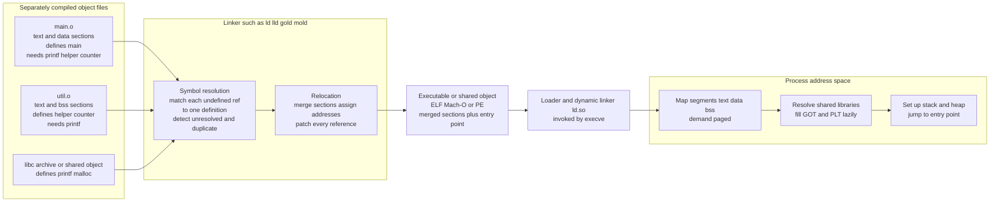

# 🔗 Linkers and Loaders

> [!abstract] TL;DR
> Real programs are not compiled all at once — they are split into many source files compiled **independently** into **object files**, each holding machine code plus metadata but riddled with **unresolved references** (`call printf`, `load counter`) because the compiler had no idea where those live. The **linker** finishes the job in two steps: **symbol resolution** — matching every undefined reference to exactly one definition somewhere (and screaming about *unresolved* or *duplicate* symbols) — and **relocation** — assigning every code and data section a final address and *patching* each reference to point at it, producing a single **executable**. The **loader** is the OS component that then reads that executable, builds the process **address space**, memory-maps the segments (demand-paged), resolves any **dynamic** shared-library dependencies through the dynamic linker `ld.so`, and jumps to the entry point. This note lives in the *Runtime Systems and Memory* section and is the bridge where the compiler pipeline hands off to the operating system.

---

## Intuition

**Analogy — assembling a jigsaw whose pieces were cut in separate rooms.** Imagine a giant puzzle built by a team, but each person works alone in their own room and never sees the others' pieces. Because they cannot see the neighboring pieces, they leave every connecting edge with a **labeled dangling tab** instead of a real interlock: one tab reads *"the `printf` piece goes here,"* another reads *"call my `helper` piece there,"* a third reads *"the shared `counter` slot connects here."* Each finished piece is a self-contained square of picture (the machine code) surrounded by these little paper flags pointing at pieces it has never met.

The **linker** is the person who finally gathers every piece onto one big table. Their first job is **symbol resolution**: for each dangling tab labeled *"printf,"* find the one and only piece that actually *is* `printf` and note where it sits — and if *two* people both drew a `printf` piece (duplicate) or *nobody* drew one (unresolved), refuse to continue. Their second job is **relocation**: now that all pieces are laid out on the table at real positions, go back to every dangling tab and **replace the label with the actual coordinates** of its target, cutting a real interlock so the picture becomes one continuous whole. The result is a single finished puzzle — the **executable**.

The **loader** comes last: it does not care how the puzzle was assembled, it just needs to **place the finished picture onto the wall** (into memory) at a spot the CPU can reach, hang any shared framed sections the picture depends on, and point the viewer's eye at the top-left corner (the entry point) so the show can begin.

---

## How It Works

### Core Mechanics

**1. The separate-compilation model — why linking exists at all.** A large program is deliberately split into many source files (`main.c`, `util.c`, `parser.c`, …) so they can be compiled **independently**. This buys two enormous wins: **modularity** (each file is a comprehensible unit with its own interface) and **incremental builds** (change one file, recompile *only* that file, then relink — instead of recompiling millions of lines). The price is that when the compiler translates `main.c`, it emits a `call` to `printf` and a reference to a global `counter` that live in *other* files it has never seen. It cannot know their addresses, so it leaves a **placeholder** and a note saying *"someone please fill this in later."* That "later" is **link time**, and the tool that keeps the promise is the **linker**. *(This is the natural continuation of the pipeline in [[Compilers_Overview]] and the symbol-table machinery of [[Semantic_Analysis_and_Symbol_Tables]].)*

**2. The object file — code plus a to-do list.** A `.o` (or `.obj`) file is not raw machine code; it is a structured container with distinct **sections**:

- **`.text`** — the executable machine code.
- **`.data`** — initialized global/static variables (values stored in the file).
- **`.bss`** — uninitialized globals; only a *size* is stored (zero-filled at load), so `.bss` costs nothing on disk.
- **symbol table** — every name this file **defines** (exports) and every name it **references but does not define** (**undefined / external** symbols).
- **relocation table** — a list of *"at this offset in this section there is a reference to symbol X; patch it once X's address is known."*

The on-disk format is OS-specific: **ELF** on Linux/BSD, **Mach-O** on macOS, **PE/COFF** on Windows — but all three encode the same idea of sections + symbols + relocations. A subtlety that trips up C++ programmers: the symbol names in the table are **mangled** — `int add(int,int)` might appear as `_Z3addii` so that overloads and namespaces get distinct names. The exact mangling and the layout of arguments/registers a call must obey are the province of the **ABI** *(sibling [[Runtime_Systems_and_the_ABI]]; see also [[ABI_and_Calling_Conventions]])*.

**3. The linker's first job — symbol resolution.** The linker scans every object file's symbol table and builds one **global symbol table** mapping each name to its single definition. It enforces the **one-definition rule**:

- A name that is **undefined everywhere** → **unresolved symbol** error (`undefined reference to 'printf'`) — the most infamous linker error on Earth.
- A name that is **defined in two places** → **duplicate symbol** error (`multiple definition of 'foo'`).

When resolving references into a **static library** (a `.a` archive, just a bundle of `.o` files), the linker is *lazy*: it pulls in only the archive members that satisfy a currently-unresolved symbol, which is why **link order matters** for archives (a library must appear *after* the objects that use it on the command line). *(Instruction selection and the back-end code the linker stitches together come from the code-generation section — sibling `Local_and_Global_Optimizations`.)*

**4. The linker's second job — relocation.** With every symbol resolved to *which* object it lives in, the linker now assigns **final runtime addresses**. It merges same-kind sections across all objects (all `.text` together, all `.data` together, all `.bss` together), assigns each a base address, and thereby fixes the absolute address of every symbol. Then it walks every relocation entry and **patches** the placeholder bytes: the `call printf` whose operand was `0x00000000` becomes `call 0x400070`, the load of `counter` gets `counter`'s real address written into it. The output is a single **executable** (or another `.o` / shared object) with merged sections and a designated **entry point**.

**5. Static vs dynamic linking — copy now or resolve later.**

- **Static linking** copies the needed library code *into* the executable at link time. The result is **self-contained** (no runtime dependencies, trivial deployment, no version skew) but **larger**, and a security fix in the library requires **relinking and redeploying every program** that used it.
- **Dynamic linking** leaves references to shared libraries (`.so` on Linux, `.dll` on Windows, `.dylib` on macOS) *unresolved in the executable*, to be resolved at **load time** or lazily at **run time** by the **dynamic linker/loader** (`ld.so` / `ld-linux.so`). One copy of `libc` in physical memory is **shared** (via read-only, memory-mapped, copy-on-write pages) across every process, saving huge amounts of RAM, and a patched library benefits all programs at once — at the cost of **versioning and dependency complexity** ("DLL hell," `symbol not found`, `GLIBC_2.34 not found`).

**6. Position-independent code, the GOT, and the PLT.** A shared library can be mapped at a *different* virtual address in every process, so its code must not hard-code absolute addresses — it must be **position-independent code (PIC)**. PIC reaches global data and functions **indirectly** through two per-process tables written by the dynamic linker:

- **GOT (Global Offset Table)** — a table of the *actual addresses* of external data/functions. Code loads an address from the GOT rather than embedding it, so relocating the library means fixing up one table, not thousands of instructions.
- **PLT (Procedure Linkage Table)** — a trampoline that enables **lazy binding**: the first call to `printf` jumps into the PLT stub, which invokes the dynamic linker to resolve `printf`, writes the result into the GOT, and then all *subsequent* calls go straight through the GOT with no overhead. You pay resolution cost only for functions you actually call.

Because PIC lets code run at *any* base address, it is also what makes **ASLR (Address Space Layout Randomization)** possible — the loader can randomize where libraries and the executable land, a core exploit-mitigation defense *(see [[OS_Security_and_Isolation]])*.

**7. The loader — from file to running process.** The **loader** is the OS component (invoked by `execve`) that turns an executable file into a live process. It: parses the ELF/Mach-O/PE headers; creates a fresh **virtual address space**; **memory-maps** the `text` and `data` segments (usually **demand-paged**, so pages fault in lazily rather than being read up front — see [[Virtual_Memory_and_Demand_Paging]]); zero-initializes `.bss`; sets up the **stack** (with `argv`/`envp`) and **heap**; hands control to the **dynamic linker** to map and bind shared-library dependencies; and finally **jumps to the entry point** (`_start`, which sets up the runtime and calls `main`). This is exactly where the compiler's world ends and the operating system's [[Processes_and_the_Process_Model|process model]] begins.

**8. Link-time optimization and runtime linking.** Two modern extensions bookend the topic. **LTO (link-time optimization)** defers optimization to link time by shipping the compiler's **IR** *inside* the object files, letting the linker inline and specialize *across* file boundaries the front end could never see — the interprocedural payoff *(sibling [[Interprocedural_and_Link_Time_Optimization]]; connects to [[Intermediate_Representations]])*. At the other end, **runtime linking** via `dlopen`/`dlsym` loads a shared object *while the program runs* — the mechanism behind **plugins** and the foundation of foreign-function interfaces *(sibling [[Foreign_Function_Interfaces_and_Interop]])*. The same machinery enables **`LD_PRELOAD` interposition** — forcing your own `.so` ahead of others to override symbols like `malloc` — a powerful debugging/profiling trick and, in the wrong hands, a rootkit technique.

### Flow / Architecture



*Left to right: independently compiled objects with dangling references flow into the linker, which resolves symbols and relocates addresses into one executable; the loader then builds the address space and binds shared libraries before jumping to the entry point.*

---

## Key Concepts

**Secondary (intuitive, no CS background needed)**
- **Split then join** — big programs are built from many small files compiled separately, then joined into one runnable program.
- **Dangling reference** — a compiled file mentions things it does not contain (like `printf`); a "please fill in later" placeholder.
- **Linker = assembler of pieces** — finds the real target of every placeholder and stitches everything together.
- **Loader = places it in memory** — the last step that puts the finished program where the CPU can run it.

**Undergraduate (an OS or compilers course)**
- **Object file sections** — `.text`, `.data`, `.bss`, symbol table, relocation table; the ELF/Mach-O/PE container.
- **Defined vs undefined symbols** and the **one-definition rule** — resolution, unresolved-reference and duplicate-symbol errors.
- **Relocation** — merging sections, assigning final addresses, and patching every reference to point at its target.
- **Static vs dynamic linking** — self-contained-but-large versus shared-but-versioned; `.a` vs `.so`/`.dll`.
- **Static libraries and archive selection** — why link order matters and only needed members are pulled in.

**Graduate (systems-level thinking)**
- **Position-independent code, GOT, PLT, and lazy binding** — how shared libraries run at arbitrary addresses with per-process indirection tables.
- **The dynamic linker (`ld.so`)** — load-time symbol binding, `DT_NEEDED` dependency walking, `LD_LIBRARY_PATH`, `RPATH`/`RUNPATH`.
- **Symbol visibility and versioning** — exported vs hidden symbols, `__attribute__((visibility))`, symbol versioning (`GLIBC_2.x`), **weak symbols**, and interposition.
- **ASLR and PIE** — why relocatable/position-independent executables enable address randomization as an exploit mitigation.
- **Link-time optimization** — shipping IR in objects for cross-module inlining; the link step as a build **bottleneck** and modern parallel linkers (**gold**, **lld**, **mold**).
- **Runtime linking** — `dlopen`/`dlsym`, plugin architectures, and `LD_PRELOAD` interposition with its security implications.

---

## Python Demo

```python
# A miniature LINKER, in pure Python + matplotlib.
#
# We model several OBJECT FILES, each with:
#   - SECTIONS (.text/.data/.bss) and their sizes,
#   - a SYMBOL TABLE: symbols it DEFINES (name -> section+offset) and
#     symbols it references but does NOT define (undefined/external),
#   - RELOCATION entries: "at this offset in this section there is a
#     reference to symbol S; patch it once S's final address is known."
#
# The linker then performs the two classic jobs:
#   1. SYMBOL RESOLUTION  - match each undefined reference to exactly one
#                           definition; detect UNRESOLVED and DUPLICATE symbols.
#   2. RELOCATION         - merge same-kind sections, assign each a final
#                           address, compute every symbol's address, and PATCH
#                           each reference to point at its resolved target.
#
# It prints the linked symbol table + memory layout, then VISUALIZES the
# separate object files combining into one address space with resolved
# cross-reference arrows. Standard library + matplotlib only.

from dataclasses import dataclass, field
from typing import Dict, List, Tuple
import matplotlib.pyplot as plt
from matplotlib.patches import FancyArrowPatch

# ---------------------------------------------------------------------------
# DATA MODEL
# ---------------------------------------------------------------------------
@dataclass
class Reloc:
    section: str      # section holding the reference, e.g. ".text"
    offset: int       # byte offset of the reference within that section
    symbol: str       # the symbol being referenced (to be patched in)

@dataclass
class ObjectFile:
    name: str
    sizes: Dict[str, int]                    # section -> size in bytes
    defined: Dict[str, Tuple[str, int]]      # symbol -> (section, offset)
    undefined: List[str]                     # external symbols this file needs
    relocs: List[Reloc] = field(default_factory=list)

# Three objects forming a tiny program: main.o calls helper + printf and reads
# the global 'counter'; util.o defines helper + counter (in .bss) and calls
# printf; libc.o provides printf. Every reference resolves.
OBJECTS = [
    ObjectFile(
        name="main.o",
        sizes={".text": 0x40, ".data": 0x10},
        defined={"main": (".text", 0x00)},
        undefined=["helper", "printf", "counter"],
        relocs=[Reloc(".text", 0x10, "helper"),
                Reloc(".text", 0x24, "printf"),
                Reloc(".text", 0x30, "counter")],
    ),
    ObjectFile(
        name="util.o",
        sizes={".text": 0x30, ".bss": 0x08},
        defined={"helper": (".text", 0x00), "counter": (".bss", 0x00)},
        undefined=["printf"],
        relocs=[Reloc(".text", 0x1C, "printf")],
    ),
    ObjectFile(
        name="libc.o",
        sizes={".text": 0x80, ".data": 0x20},
        defined={"printf": (".text", 0x00)},
        undefined=[],
        relocs=[],
    ),
]

SEGMENT_ORDER = [".text", ".data", ".bss"]
BASE_ADDRESS  = 0x400000
ALIGN         = 0x1000

def align_up(addr: int, a: int) -> int:
    return (addr + a - 1) // a * a

# ---------------------------------------------------------------------------
# STEP 1 - SYMBOL RESOLUTION
# ---------------------------------------------------------------------------
def resolve_symbols(objects: List[ObjectFile]):
    """Build the global symbol table; report duplicate and unresolved symbols."""
    table: Dict[str, Tuple[str, str, int]] = {}   # sym -> (objname, section, offset)
    errors: List[str] = []
    for obj in objects:                            # collect all definitions
        for sym, (sec, off) in obj.defined.items():
            if sym in table:
                errors.append(f"duplicate symbol '{sym}': "
                              f"defined in {table[sym][0]} and {obj.name}")
            else:
                table[sym] = (obj.name, sec, off)
    for obj in objects:                            # every external must resolve
        for sym in obj.undefined:
            if sym not in table:
                errors.append(f"undefined reference to '{sym}' in {obj.name}")
    return table, errors

# ---------------------------------------------------------------------------
# STEP 2 - RELOCATION: merge sections, assign addresses, patch references
# ---------------------------------------------------------------------------
def assign_addresses(objects: List[ObjectFile]):
    """Merge same-kind sections across objects and assign base addresses."""
    section_base: Dict[Tuple[str, str], int] = {}      # (obj, section) -> addr
    segments = []                                      # (seg, start, end, contribs)
    cursor = BASE_ADDRESS
    for seg in SEGMENT_ORDER:
        cursor = align_up(cursor, ALIGN)
        seg_start, contribs = cursor, []
        for obj in objects:
            size = obj.sizes.get(seg, 0)
            if size == 0:
                continue
            section_base[(obj.name, seg)] = cursor
            contribs.append((obj.name, cursor, size))
            cursor += size
        if contribs:
            segments.append((seg, seg_start, cursor, contribs))
    return section_base, segments

def symbol_addresses(table, section_base):
    return {sym: section_base[(objn, sec)] + off
            for sym, (objn, sec, off) in table.items()}

def apply_relocations(objects, section_base, sym_addr):
    """Patch every reference: site address -> resolved target address."""
    patched = []
    for obj in objects:
        for r in obj.relocs:
            site   = section_base[(obj.name, r.section)] + r.offset
            target = sym_addr[r.symbol]
            patched.append((obj.name, site, r.symbol, target))
    return patched

# ---------------------------------------------------------------------------
# DRIVE THE LINKER
# ---------------------------------------------------------------------------
table, errors = resolve_symbols(OBJECTS)
if errors:
    print("LINK FAILED:")
    for e in errors:
        print("  error:", e)
else:
    print("Symbol resolution OK - all references matched to one definition.\n")

section_base, segments = assign_addresses(OBJECTS)
sym_addr = symbol_addresses(table, section_base)
patched  = apply_relocations(OBJECTS, section_base, sym_addr)

print("LINKED SYMBOL TABLE")
print(f"  {'symbol':<10}{'address':<12}{'defined in'}")
for sym in sorted(sym_addr, key=lambda s: sym_addr[s]):
    print(f"  {sym:<10}0x{sym_addr[sym]:06X}  {table[sym][0]}")

print("\nMEMORY LAYOUT (merged sections)")
for seg, start, end, contribs in segments:
    print(f"  {seg:<6} 0x{start:06X}-0x{end:06X}")
    for objn, addr, size in contribs:
        print(f"       0x{addr:06X}  {objn} contributes 0x{size:X} bytes")

print("\nRELOCATIONS APPLIED (each reference patched to its target)")
for objn, site, sym, target in patched:
    print(f"  {objn}: site 0x{site:06X}  ->  {sym} @ 0x{target:06X}")

# ---------------------------------------------------------------------------
# Bonus: prove the resolver catches broken input (duplicate + unresolved).
# ---------------------------------------------------------------------------
BROKEN = [
    ObjectFile("a.o", {".text": 0x10}, {"foo": (".text", 0)}, ["malloc"]),
    ObjectFile("b.o", {".text": 0x10}, {"foo": (".text", 0)}, []),   # dup foo, no malloc
]
_, broken_errors = resolve_symbols(BROKEN)
print("\nERROR-DETECTION CHECK on a deliberately broken program:")
for e in broken_errors:
    print("  detected:", e)

# ---------------------------------------------------------------------------
# VISUALIZE: separate objects (left) combining into one address space (right)
# ---------------------------------------------------------------------------
COLORS = {"main.o": "#4c9be8", "util.o": "#f0932b", "libc.o": "#6ab04c"}
SCALE  = 0.02   # vertical units per byte

fig, (axL, axR) = plt.subplots(1, 2, figsize=(13, 7),
                               gridspec_kw={"width_ratios": [1, 1.15]})

# --- LEFT: object files as stacks of section boxes with dangling refs ---
y = 0.0
for obj in OBJECTS:
    top = y
    for seg in SEGMENT_ORDER:
        size = obj.sizes.get(seg, 0)
        if size == 0:
            continue
        h = max(size * SCALE, 0.35)
        axL.add_patch(plt.Rectangle((0.15, y), 1.5, h,
                      facecolor=COLORS[obj.name], edgecolor="black", alpha=0.85))
        axL.text(0.9, y + h / 2, f"{seg}  0x{size:X}B",
                 ha="center", va="center", fontsize=8)
        y += h + 0.05
    axL.text(0.9, top - 0.28, obj.name, ha="center", va="top",
             fontsize=10, fontweight="bold")
    if obj.undefined:
        axL.text(1.75, top + 0.1, "needs: " + ", ".join(obj.undefined),
                 ha="left", va="top", fontsize=7.5, color="#c0392b")
    y += 0.55
axL.set_xlim(0, 3.4)
axL.set_ylim(-0.6, y)
axL.axis("off")
axL.set_title("BEFORE: separate object files\n(red = dangling undefined references)",
              fontsize=10)

# --- RIGHT: one merged address space; map addr -> y and draw reloc arrows ---
boxes = []          # (obj, section, addr_start, size, y_start, y_height)
yy = 0.0
for seg, start, end, contribs in segments:
    for objn, addr, size in contribs:
        h = max(size * SCALE, 0.35)
        axR.add_patch(plt.Rectangle((0.7, yy), 1.6, h,
                      facecolor=COLORS[objn], edgecolor="black", alpha=0.85))
        axR.text(1.5, yy + h / 2, f"{objn} {seg}", ha="center", va="center",
                 fontsize=8)
        axR.text(0.63, yy, f"0x{addr:06X}", ha="right", va="bottom", fontsize=7)
        boxes.append((objn, seg, addr, size, yy, h))
        yy += h
    yy += 0.35   # visual gap between merged segments (alignment padding)

def addr_to_y(a: int):
    for (_o, _s, a0, size, y0, yh) in boxes:
        if a0 <= a < a0 + size:
            return y0 + (a - a0) / size * yh
    return None

# mark each resolved symbol at its final address
for sym, a in sym_addr.items():
    ys = addr_to_y(a)
    if ys is not None:
        axR.plot(2.3, ys, "o", color="black", markersize=5)
        axR.text(2.4, ys, sym, ha="left", va="center", fontsize=8,
                 fontweight="bold")

# draw resolved cross-reference arrows: call site -> target symbol
for objn, site, sym, target in patched:
    y0, y1 = addr_to_y(site), addr_to_y(target)
    if y0 is None or y1 is None:
        continue
    axR.add_patch(FancyArrowPatch((2.3, y0), (2.3, y1),
                  connectionstyle="arc3,rad=0.45",
                  arrowstyle="->", color="#8e44ad", lw=1.4,
                  mutation_scale=12))

axR.set_xlim(0, 4.2)
axR.set_ylim(-0.4, yy)
axR.axis("off")
axR.set_title("AFTER: merged address space\n(purple = relocated, resolved references)",
              fontsize=10)

plt.tight_layout()
plt.savefig("linker_demo.png", dpi=130)
print("\nSaved 'before vs after' link visualization to linker_demo.png")
```

Running it prints the **linked symbol table** (`main @ 0x400000`, `helper @ 0x400040`, `printf @ 0x400070`, `counter @ 0x402000`), the **memory layout** (all `.text` merged from `0x400000`, `.data` page-aligned at `0x401000`, `.bss` at `0x402000`), and the **relocations applied** (e.g. `main.o` site `0x400024 -> printf @ 0x400070`). The error-detection check on the broken program correctly reports both `duplicate symbol 'foo'` and `undefined reference to 'malloc'`. The saved figure shows the "before" object files with red dangling references on the left transforming into one merged address space with purple resolved cross-reference arrows on the right — a linker in miniature.

---

## Real-World Applications

> **Example — one `libc.so.6` shared by every process on a Linux box.** Run `ldd /bin/ls` and you will see `ls` depends on `libc.so.6`, `libselinux`, and the dynamic linker `ld-linux-x86-64.so.2` itself. `ls` was *dynamically linked*: its executable contains only *undefined* references to `printf`, `malloc`, `opendir`, and a to-do list of `.so` files. At `execve` time the loader maps `ls`, then the dynamic linker walks the `DT_NEEDED` list, `mmap`s each shared library, and binds symbols — but the **physical pages of `libc`'s read-only `.text` are shared** across every one of the hundreds of processes on the machine that use it. That is why patching a single `libc` package fixes a vulnerability system-wide without relinking one binary, and why `ls` on disk is tiny (a few hundred KB) rather than statically bundling megabytes of C library.

Where linkers and loaders show up in practice:

- **Every build you run.** `gcc main.c util.c -o app` silently invokes the compiler per file and then the **linker** (`ld`) to join them; the `undefined reference to ...` message is the single most common build failure programmers hit.
- **Static binaries for containers and distribution.** Go and Rust can produce **fully static** executables (musl/CGO-off, `-C target-feature=+crt-static`) that run in a `FROM scratch` Docker image with no shared libraries at all — trading size for zero runtime dependencies.
- **Plugins via runtime linking.** Web servers (Apache/nginx modules), Python C-extensions, game mods, and editor plugins all use `dlopen`/`dlsym` (or Windows `LoadLibrary`/`GetProcAddress`) to load a `.so`/`.dll` *while the program runs* — the [[Foreign_Function_Interfaces_and_Interop]] mechanism.
- **`LD_PRELOAD` interposition.** Profilers (`jemalloc`, `tcmalloc`, `valgrind`), debuggers, and fault injectors force their own `malloc`/`free` ahead of the real ones; the same trick powers some rootkits, which is why `LD_PRELOAD` is ignored for setuid binaries.
- **Fast linkers as a build bottleneck fix.** On huge C++ projects the *link* step, not compilation, dominates iteration time. Google's **gold**, LLVM's **lld**, and Rui Ueyama's **mold** parallelize linking to cut multi-minute links to seconds — a direct developer-productivity win.
- **Security: ASLR and PIE.** Modern distros compile executables as **PIE** (position-independent executables) so the loader can randomize their base address, defeating exploits that rely on fixed addresses (see [[OS_Security_and_Isolation]]).

---

## Common Pitfalls

- **"Undefined reference" is not a compiler error.** It comes from the *linker*, after every file compiled fine. The cause is a missing definition — a library you forgot to link (`-lm`, `-lpthread`), a source file left off the command line, or a C++ name-mangling mismatch (forgetting `extern "C"` around a C header). Read *which* symbol is missing and *who* references it.
- **Link order matters for static libraries.** The linker scans left to right and pulls archive members only to satisfy *currently* unresolved symbols. Putting `-lfoo` *before* the object that uses it means the symbol was not yet "wanted," so it is skipped — leading to a baffling undefined-reference error even though the library is on the line. Libraries go **last**.
- **One-definition-rule violations from headers.** Defining a non-`inline` function or a global variable *in a header* that is included by multiple `.cpp` files yields **duplicate symbol** errors (or silent ODR undefined behavior). Declare in headers, define once in a `.cpp`; use `inline`/`static`/`constexpr` where appropriate.
- **"DLL hell" / version skew.** A binary built against `GLIBC_2.34` will refuse to start on a host with older glibc (`version 'GLIBC_2.34' not found`). Dynamic linking couples you to the *runtime* environment; static linking or careful symbol versioning / building against the oldest supported ABI avoids it.
- **Assuming the address you see is fixed.** With ASLR/PIE, shared libraries and even the main executable load at *randomized* addresses each run, so hard-coded addresses and naive address comparisons across runs break. This is a *feature* (a security mitigation), not a bug.
- **`.bss` is free on disk but not in memory.** Uninitialized globals cost zero bytes in the object file (only a size), but the loader still zero-fills that memory at load, and a giant static array is still a giant runtime footprint. Do not confuse "small binary" with "small memory use."
- **Stripping symbols breaks debugging, not correctness.** Relocation and resolution happen at link time; `strip` removes the symbol table *afterward* to shrink the binary. The program still runs — but stack traces become address soup. Keep separate debug-info files (`.debug`) for production binaries.

---

## Related Concepts

- [[Compilers_Overview]] — the pipeline `compile → assemble → link → load`; this note is the *link/load* handoff at the pipeline's tail.
- [[Runtime_Systems_and_the_ABI]] — the runtime contract (register/stack usage, name mangling, symbol layout) the linker's stitched-together code must obey.
- [[Interprocedural_and_Link_Time_Optimization]] — LTO works by shipping IR inside object files so the linker can optimize across module boundaries.
- [[Foreign_Function_Interfaces_and_Interop]] — `dlopen`/`dlsym` runtime linking is the substrate FFIs and plugin systems build on.
- [[Semantic_Analysis_and_Symbol_Tables]] — the compiler's *internal* symbol table; the linker's global symbol table is its cross-file cousin, resolving what one file could not.
- [[Intermediate_Representations]] — link-time optimization works by shipping IR inside object files so the linker can optimize across module boundaries.
- [[ABI_and_Calling_Conventions]] — the architecture-level calling convention and register usage the relocated code must follow.
- [[Assembly_Programming]] — the human-readable form of the `.text` the linker relocates and patches.
- [[Processes_and_the_Process_Model]] — what the loader *creates*: a fresh address space with stack, heap, and mapped segments, then a jump to the entry point.
- [[Virtual_Memory_and_Demand_Paging]] — how the loader memory-maps segments so pages fault in lazily and shared-library pages are shared across processes.
- [[Virtual_Memory_and_TLB]] — the hardware translation layer that makes position-independent, per-process address spaces possible.
- [[Memory_Management_and_Allocation]] — the heap the loader sets up and that `malloc` (often the classic interposed symbol) manages.
- [[OS_Security_and_Isolation]] — ASLR/PIE, `LD_PRELOAD` restrictions for setuid binaries, and why position-independent code is a security primitive.
- [[The_Boot_Process_and_System_Initialization]] — the bootloader is a *loader* one level down, loading the kernel before any user process exists.
- [[ISA_Design_RISC_vs_CISC]] — the relocation types and PC-relative addressing modes available to the linker depend on the target ISA.
- [[Linux_Fundamentals]] — where `ldd`, `nm`, `objdump`, `readelf`, and `LD_LIBRARY_PATH` live in day-to-day practice.

---

## Review Questions

1. **(Conceptual)** Using the jigsaw analogy, explain the linker's *two* distinct jobs and why they must happen in order. Why can *symbol resolution* fail with a "duplicate symbol" error while *relocation* never does? What information does the linker have during relocation that it did not have during compilation?
2. **(Scenario)** You ship a C++ service as a Docker image and hit `error while loading shared libraries: libssl.so.3: cannot open shared object file` on a customer's older host, even though it runs fine on your build machine. Explain the root cause in terms of dynamic linking and the dynamic linker's search, and give **two** different fixes — one that changes *how you link* and one that changes *what you deploy* — with their trade-offs.
3. **(Trade-off)** A latency-sensitive server calls a hot function in a shared library millions of times per second. Contrast **static linking**, **dynamic linking with lazy binding (PLT/GOT)**, and **dynamic linking with eager binding (`LD_BIND_NOW`)** on: first-call latency, steady-state per-call overhead, memory sharing across processes, startup time, and the ability to hot-patch the library. Which would you pick, and what measurement would settle it?

---

## Sources

- Levine, John R. *Linkers and Loaders*. Morgan Kaufmann, 1999 — the definitive book-length treatment of object formats, symbol resolution, relocation, and dynamic linking.
- Drepper, Ulrich. *How To Write Shared Libraries*, 2011 — the authoritative deep dive on ELF dynamic linking, PIC, the GOT/PLT, lazy binding, and symbol visibility/versioning ([akkadia.org/drepper/dsohowto.pdf](https://www.akkadia.org/drepper/dsohowto.pdf)).
- Tool Interface Standard (TIS). *Executable and Linking Format (ELF) Specification*, v1.2, 1995 — the section/symbol-table/relocation layout used across Unix systems.
- Bryant, R., O'Hallaron, D. *Computer Systems: A Programmer's Perspective*, 3rd ed. Pearson, 2015 — Chapter 7 ("Linking") is the standard course treatment of static/dynamic linking, relocation, and loading.
- Bendersky, Eli. *Position Independent Code (PIC) in shared libraries* and *Load-time relocation of shared libraries*, 2011 — clear worked explanations of relocation vs PIC and the GOT/PLT ([eli.thegreenplace.net](https://eli.thegreenplace.net/2011/11/03/position-independent-code-pic-in-shared-libraries/)).

---

#compilers #linker #loader #relocation #dynamic-linking
