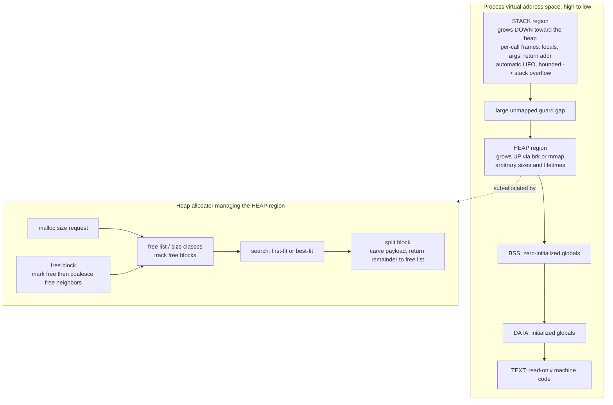

# 🧱 Memory Management and Allocation (Runtime)

> [!abstract] TL;DR
> A program's live data lives in two very different places that the **language runtime** manages on top of the OS's raw pages. The **stack** is automatic, last-in-first-out, and blindingly fast — every function call bumps a pointer to make room for its locals and return address, and returning bumps it back; the compiler knows the layout at compile time and inserts the frees for free. The **heap** is a general warehouse for objects whose size or lifetime the compiler *cannot* predict: you ask an **allocator** (`malloc`) for an arbitrary-sized block and hand it back (`free`) whenever you like. That flexibility costs a search through a **free list**, bookkeeping metadata per block, and the slow accumulation of **fragmentation**. Whether you free the heap by hand (C/C++), have a collector do it (Java/Go), or have the compiler prove *at compile time* exactly where to insert frees (Rust) is one of the defining choices in language design.

---

## Intuition

**Analogy — the cafeteria tray stack and the warehouse.** Picture two ways to store things.

The first is a **stack of cafeteria trays**. You only ever touch the top: to store something you drop a tray on top, to retrieve it you lift the top tray off. There is no searching, no fragmentation, no decision to make — the whole discipline is "top only," so putting a tray on and taking it off are single, instant motions. The catch is rigid: you *cannot* pull out the third tray from the bottom while others sit on top of it. This is exactly the **stack** of a running program: each function call drops a **frame** (its locals, arguments, return address) on top; when the call returns, its frame is lifted off. Because calls nest perfectly — the last one to start is the first to finish — last-in-first-out is a perfect fit, and the machine allocates and frees a frame by simply adding to or subtracting from one register.

The second is a **big warehouse**. Here you can request a slot of *any* size at *any* time and return *any* slot whenever you're done, in any order. Enormously flexible — but now someone must keep a ledger of which shelves are free, hunt for a gap big enough when you ask, and cope with the mess that builds up when small returned slots leave the floor pocked with unusable gaps between full ones. That warehouse is the **heap**, and the ledger-keeper is the **allocator**. The rest of this note is about how that ledger works and what it costs.

---

## How It Works

A compiled program does not see physical RAM. It sees a **virtual address space** the OS hands it, and *within* that space the language runtime decides how to use the two dynamic regions. The OS-level view — how physical frames back these addresses, and how the kernel itself allocates memory to processes — is covered in the operating-systems note [[Memory_Management_and_Allocation]]; here we take the *language / runtime* view of what sits inside a single process.

### The process address-space layout

By convention a process's virtual space is carved into fixed regions, from low addresses to high:

1. **Text** — the read-only machine code, mapped from the executable.
2. **Data** — initialized global and static variables.
3. **BSS** — uninitialized globals, zero-filled at load.
4. **Heap** — dynamically allocated storage, **grows upward** (toward higher addresses) as the program asks for more.
5. **Stack** — per-call frames, **grows downward** (toward lower addresses) from the top of the space.

The heap and stack grow *toward each other* across a large unmapped gap; if they ever collide the program is out of memory (a heap allocation fails, or the stack overflows).

### The stack: automatic, LIFO, trivial

Each function call pushes an **activation record** (stack frame) holding its parameters, local variables, saved registers, and the return address. The layout of every frame is fixed by the compiler and the platform **ABI** — which registers pass arguments, where the return address sits, how the frame is aligned — the same conventions detailed in [[ABI_and_Calling_Conventions]]. Allocation is a single instruction that *subtracts* the frame size from the stack pointer; deallocation on return *adds* it back. Consequences:

- **Speed:** allocation/free are pointer arithmetic — no search, no bookkeeping, no fragmentation. Stack memory is also nearly always hot in cache.
- **Automatic lifetime:** a local dies exactly when its function returns; the compiler emits the "free" for you.
- **Hard limits:** the stack is a bounded region (often a few MB). Deep or infinite recursion, or a huge local array, blows past it — a **stack overflow**. Its LIFO discipline also means you cannot keep a value alive past the call that created it (returning a pointer to a local is a classic bug).

Recursion is the stack made visible: each recursive call is another frame, and the call depth *is* the stack height. This is why the runtime's handling of calls and frames belongs with the forthcoming compiler sibling *Runtime Systems and the ABI*.

### The heap: general, flexible, fragmenting

When size or lifetime is unknown at compile time — a list that grows, an object returned from a factory, a buffer sized by user input — the value must go on the heap. The runtime asks the OS for big chunks of pages (via `brk`/`sbrk` to extend the heap, or `mmap` to map fresh regions) and then **sub-allocates** small blocks out of them so that most `malloc` calls never touch the kernel at all.

**How `malloc` and `free` work.** The allocator maintains a **free list**: a data structure tracking which regions are free. A request walks the free list looking for a block big enough:

- **First-fit** takes the first block that fits — fast, but leaves debris near the list head.
- **Best-fit** scans for the smallest block that fits — less wasted space per allocation, more search and more tiny leftovers.
- **Segregated / size-class fits** keep *separate* free lists per size bucket (e.g. 16, 32, 48, 64 bytes), turning the search into an O(1) lookup in the right bucket. This is what production allocators actually do.

When a chosen free block is larger than the request, the allocator **splits** it: carve off the requested bytes and return the remainder to the free list. On `free`, the allocator marks the block free and **coalesces** it with any adjacent free neighbors, merging small holes back into large ones so future big requests can be satisfied. Two structural families make coalescing and size-lookup efficient:

- **Buddy system** — memory is split into power-of-two blocks; a freed block merges instantly with its "buddy" (its power-of-two sibling) if that buddy is also free. Fast merge, but rounds requests up to a power of two → **internal fragmentation**.
- **Slab allocation** — pre-carve caches of same-sized objects (used heavily in the Linux kernel for structs like inodes); allocation is popping from a per-type free list, with near-zero fragmentation for that type.

**Metadata and fragmentation — the two taxes on the heap.** Every block carries a small **header** (its size, a free/used bit, sometimes links) so `free` can find its size and neighbors — this is **allocator metadata overhead**, and with millions of tiny allocations it adds up. Meanwhile free space degrades in two ways: **internal fragmentation** is space *inside* an allocated block the user isn't using (from rounding up to a size class); **external fragmentation** is free space scattered into holes each too small to satisfy a request even though their *sum* is plenty. External fragmentation can make an allocation fail on a heap that is mostly empty. The OS analog of these same two failure modes appears in [[Memory_Management_and_Allocation]].

**Production allocators.** Real-world designs fight lock contention and cache effects that the textbook free list ignores:

- **dlmalloc / ptmalloc** (glibc's default) — bins by size, with per-thread **arenas** to reduce lock contention.
- **tcmalloc** (Google) and **jemalloc** (Facebook) — **thread-local caches** so most allocations are lock-free, plus size classes and arena-per-thread; jemalloc is prized for low fragmentation on long-running servers.
- **mimalloc** (Microsoft) — free-list sharding and cache-friendly layout for modern multicore.

The design goals — minimize lock contention, keep hot free lists per core, bound fragmentation, stay cache-friendly — are exactly the concerns of high-scale systems, tying this note to both operating-systems and system-design material.



---

## Key Concepts

**Secondary (name-drop level).** Memory has two "rooms": the **stack** (automatic, fast, LIFO, for short-lived locals and call state) and the **heap** (flexible, for objects whose size or lifetime you don't know upfront). In C you take heap memory with `malloc` and give it back with `free`; forget to give it back and you have a **memory leak**. Some languages (Java, Python, Go) clean up automatically; others (C, C++) make you do it by hand.

**Undergraduate (mechanism level).** The stack pointer bumps down on call and up on return, so stack allocation is a single instruction and never fragments. The heap is managed by an **allocator** that keeps a **free list**, uses **first-fit** or **best-fit** or **segregated size classes** to find a block, **splits** blocks that are too big, and **coalesces** adjacent free blocks on release. Two waste modes appear: **internal fragmentation** (rounding a request up) and **external fragmentation** (free memory shattered into too-small holes). Per-block **headers** are the allocator's metadata tax. **Manual** management (`malloc`/`free`, `new`/`delete`) risks **use-after-free**, **double-free**, **dangling pointers**, and **leaks**; **garbage collection** removes that burden at the cost of runtime overhead and pauses.

**Graduate (design & optimization level).** The three-way design space is **manual** (C/C++ — maximum control, maximum footguns), **tracing GC** (Java/Go — safety at the cost of throughput and latency, see the forthcoming *Garbage Collection* sibling), and **compile-time ownership** (Rust — the compiler's **borrow checker** proves at compile time that each value has exactly one owner and inserts the `free` deterministically at end of scope, giving memory safety with *no* GC). **RAII** in C++ ties a resource's lifetime to a stack object's scope so its destructor frees it automatically; smart pointers `unique_ptr`/`shared_ptr` encode ownership in the type system, tying this to [[Type_Checking_and_Type_Systems]]. **Escape analysis** is a compiler optimization that proves an object never *escapes* its creating function, allowing it to be **stack-allocated** instead of heap-allocated — eliminating a `malloc`/GC round trip entirely (used in the JVM and in Go's compiler); it is an interprocedural analysis akin to those in the forthcoming *Interprocedural and Link-Time Optimization* sibling and interacts with the *Just-In-Time Compilation* sibling. **Data layout** — struct field ordering, alignment/padding, array-of-structs vs struct-of-arrays — is the compiler's lever on cache behavior; laying out hot fields together turns memory-bound code fast, connecting to [[Cache_Hierarchy]] and [[Memory_Hierarchy_and_Caching]]. **Arena / region / pool** allocators trade per-object `free` for a single bulk free of the whole region, giving huge speedups for phase-structured workloads (per-request arenas in servers, per-frame arenas in games).

---

## Python Demo

Python hides the heap behind its own object allocator and garbage collector, so we *simulate* a C-style heap: a fixed byte **arena** with a first-fit **free list**, **splitting** on `malloc` and **coalescing** on `free`. We run a randomized workload, track **fragmentation** and **metadata overhead** over time, and visualize the heap layout. A trivial LIFO **stack allocator** is shown for contrast — no search, no fragmentation, but you can only free the most recent block.

```python
"""
Heap allocator simulation vs a trivial stack allocator.
Pure stdlib + matplotlib. Run: python heap_allocator_demo.py
"""
import random
import matplotlib.pyplot as plt
import matplotlib.patches as mpatches

HEADER      = 8      # bytes of allocator metadata per block (bookkeeping tax)
ARENA_SIZE  = 1024   # total bytes in our simulated heap
MIN_PAYLOAD = 1      # a split-off remainder must hold at least HEADER + this


class HeapAllocator:
    """Byte arena with a first-fit free list, block splitting, and coalescing."""
    def __init__(self, size=ARENA_SIZE):
        self.size = size
        # blocks are kept in address order. size = HEADER + payload capacity.
        # req = bytes the user actually asked for (0 when the block is free).
        self.blocks = [dict(start=0, size=size, free=True, req=0)]

    # ---- malloc: first-fit search, then split ------------------------------
    def malloc(self, nbytes):
        need = HEADER + nbytes
        for i, b in enumerate(self.blocks):
            if b["free"] and b["size"] >= need:
                remainder = b["size"] - need
                if remainder >= HEADER + MIN_PAYLOAD:
                    # split: shrink this block, insert the free remainder after it
                    tail = dict(start=b["start"] + need, size=remainder,
                                free=True, req=0)
                    b["size"] = need
                    self.blocks.insert(i + 1, tail)
                # else: remainder too small to be useful -> leave it inside (internal frag)
                b["free"] = False
                b["req"] = nbytes
                return b["start"]
        return None  # out of memory: external fragmentation may cause this

    # ---- free: mark free, then coalesce with free neighbors -----------------
    def free(self, start):
        for i, b in enumerate(self.blocks):
            if b["start"] == start and not b["free"]:
                b["free"] = True
                b["req"] = 0
                if i + 1 < len(self.blocks) and self.blocks[i + 1]["free"]:
                    b["size"] += self.blocks[i + 1]["size"]      # merge next
                    del self.blocks[i + 1]
                if i - 1 >= 0 and self.blocks[i - 1]["free"]:
                    self.blocks[i - 1]["size"] += b["size"]      # merge previous
                    del self.blocks[i]
                return True
        return False

    # ---- metrics -----------------------------------------------------------
    def free_bytes(self):
        return sum(b["size"] for b in self.blocks if b["free"])

    def largest_free(self):
        holes = [b["size"] for b in self.blocks if b["free"]]
        return max(holes) if holes else 0

    def external_frag(self):
        # fraction of free memory that is NOT in the single largest hole
        free = self.free_bytes()
        return 0.0 if free == 0 else 1.0 - self.largest_free() / free

    def metadata_overhead(self):
        return HEADER * len(self.blocks)      # one header per block


class StackAllocator:
    """LIFO bump allocator: allocate = pointer add, free = pointer subtract.
    No search, no fragmentation -- but you may only free the most recent block."""
    def __init__(self, size=ARENA_SIZE):
        self.size, self.top, self.marks = size, 0, []

    def push(self, nbytes):
        if self.top + nbytes > self.size:
            return None
        start, self.top = self.top, self.top + nbytes
        self.marks.append(start)
        return start

    def pop(self):
        if self.marks:
            self.top = self.marks.pop()


# --- run a randomized allocation / free workload ---------------------------
random.seed(7)
heap, live = HeapAllocator(), []
ext_series, meta_series = [], []

for _ in range(400):
    # free sometimes (or when nearly full); otherwise allocate a random size
    if live and (random.random() < 0.45 or heap.free_bytes() < 64):
        heap.free(live.pop(random.randrange(len(live))))
    else:
        start = heap.malloc(random.choice([8, 16, 24, 32, 48, 64, 96]))
        if start is not None:
            live.append(start)
    ext_series.append(heap.external_frag())
    meta_series.append(heap.metadata_overhead())

print("live allocations :", len(live))
print("free bytes       :", heap.free_bytes())
print("largest hole     :", heap.largest_free())
print("external frag    : %.2f" % heap.external_frag())
print("metadata overhead: %d bytes across %d blocks"
      % (heap.metadata_overhead(), len(heap.blocks)))

# contrast: the stack allocator is O(1) and cannot fragment
st = StackAllocator()
st.push(64); st.push(128); st.pop()   # pop frees ONLY the most recent block
print("stack top after push/push/pop:", st.top, "(no search, no holes)")

# --- visualize heap layout + fragmentation over time -----------------------
fig, (ax_map, ax_ts) = plt.subplots(1, 2, figsize=(13, 4))

for b in heap.blocks:
    color = "#d9534f" if not b["free"] else "#c8e6c9"   # red=alloc, green=free
    ax_map.barh(0, b["size"], left=b["start"], height=0.6,
                color=color, edgecolor="black", linewidth=0.5)
ax_map.set_xlim(0, heap.size)
ax_map.set_yticks([])
ax_map.set_xlabel("byte offset in the arena")
ax_map.set_title("Heap layout snapshot")
ax_map.legend(handles=[mpatches.Patch(color="#d9534f", label="allocated"),
                       mpatches.Patch(color="#c8e6c9", label="free")],
              loc="upper right")

ax_ts.plot(ext_series, color="#c0392b", label="external fragmentation")
ax_ts.set_xlabel("operation #")
ax_ts.set_ylabel("external fragmentation", color="#c0392b")
ax_ts.set_ylim(0, 1)
ax2 = ax_ts.twinx()
ax2.plot(meta_series, color="#2980b9", label="metadata bytes")
ax2.set_ylabel("allocator metadata bytes", color="#2980b9")
ax_ts.set_title("Fragmentation and metadata overhead over time")

plt.tight_layout()
plt.savefig("heap_layout.png", dpi=110)
print("wrote heap_layout.png")
```

The heap-layout bar shows the arena speckled red (allocated) and green (free) — the visual signature of **external fragmentation**: many small green holes no single request can reuse. The time-series shows fragmentation climbing as small blocks scatter, while metadata bytes rise with block count. The stack allocator, by contrast, is a single moving pointer: `push`/`pop` are O(1) and the region can never fragment — the price is that you must free in exact reverse order, which is why it only works for the perfectly nested lifetimes of function calls.

---

## Real-World Applications

- **glibc `malloc` (ptmalloc):** the default C allocator uses size-classed **bins**, splitting and coalescing exactly as modeled above, plus per-thread **arenas** so concurrent `malloc` calls don't serialize on one lock.
- **jemalloc in production servers:** Facebook, Rust's historical default, and many databases use jemalloc for its low fragmentation over month-long uptimes and its thread-cache design; Redis ships with jemalloc specifically to curb fragmentation from its churny workload.
- **The Linux kernel slab allocator:** frequently-allocated kernel structs (inodes, task_structs) come from per-type slab caches — allocation is popping a same-sized object off a free list, avoiding both search and fragmentation.
- **Rust's ownership model:** the compiler inserts `drop` (the free) at the end of each value's scope with no runtime GC, so systems software (the Firefox rendering engine, `ripgrep`, embedded firmware) gets memory safety at C-like speed — see [[Ownership_and_Borrowing]] and [[Lifetimes]].
- **JVM and Go escape analysis:** both compilers stack-allocate objects proven not to escape their method, eliminating heap traffic and GC pressure in hot loops — a routine reason Go benchmarks show "0 allocs/op."
- **Game engines and request-scoped arenas:** frame allocators reset a whole region to empty at the end of each frame; web servers use per-request arenas freed in one shot when the response is sent, avoiding thousands of individual `free` calls.

---

## Common Pitfalls

- **Memory leak** — allocating and losing the last pointer to a block without freeing it. On long-running servers, resident set size (RSS) creeps up until the OOM killer strikes. Tools: Valgrind, ASan, heap profilers.
- **Use-after-free / dangling pointer** — reading or writing through a pointer whose block was already freed. The memory may be reused, so the bug is silent then catastrophic. This is the exact class Rust's borrow checker makes a *compile error* rather than a runtime crash.
- **Double-free** — calling `free` twice on the same block corrupts the allocator's free list and is a common exploit primitive. Set pointers to null after freeing, or use ownership types.
- **Returning a pointer to a stack local** — the frame vanishes on return, so the pointer dangles. A textbook consequence of the stack's LIFO lifetime.
- **Assuming allocation is cheap in a hot loop** — each `malloc` is a free-list search plus possible kernel call and cache miss. Pool/arena allocators or stack allocation via escape analysis are the fix; measure with an allocation profiler.
- **Ignoring alignment/padding in struct layout** — poor field ordering bloats structs and wrecks cache density; the fix is grouping hot fields and ordering by size (see [[Cache_Hierarchy]]).
- **Treating fragmentation as "leaked" memory** — a heap can be 40% free yet unable to serve a large request because the free space is shattered. This is external fragmentation, not a leak, and it needs a better allocator or compaction, not a bug hunt.
- **Buffer overflow** — writing past an allocated block's bounds smashes adjacent heap metadata or an adjacent object, the root of countless security exploits; the memory-safety and mitigation angle is in [[OS_Security_and_Isolation]].

---

## Related Concepts

- [[Memory_Management_and_Allocation]] — the OS-level counterpart: how the kernel backs virtual addresses with physical frames and allocates memory to whole processes; this note lives *inside* one such process.
- [[Virtual_Memory_and_Demand_Paging]] — where the pages the heap grows into actually come from, and how `brk`/`mmap` requests are satisfied lazily.
- [[Ownership_and_Borrowing]] — Rust's compile-time answer to heap safety: the third path between manual `free` and garbage collection.
- [[Lifetimes]] — the mechanism by which Rust's compiler knows exactly when to insert each free.
- [[Smart_Pointers]] — Rust's `Box`/`Rc`/`RefCell` encode heap ownership in the type system.
- [[Cpp_Smart_Pointers]] — C++ `unique_ptr`/`shared_ptr` implement RAII-based automatic heap cleanup.
- [[Memory_Management_Cpp]] — C++ `new`/`delete`, RAII, and allocator internals from the language side.
- [[C_Pointers_and_Memory]] — raw `malloc`/`free` and pointer mechanics that this allocator model imitates.
- [[Type_Checking_and_Type_Systems]] — how ownership and smart-pointer safety is enforced by the type checker at compile time.
- [[Cache_Hierarchy]] — why stack allocation and cache-conscious data layout are fast: locality.
- [[Memory_Hierarchy_and_Caching]] — the broader memory-latency picture that motivates arena and slab allocators.
- [[Virtual_Memory_and_TLB]] — address translation underneath every heap access.
- [[ABI_and_Calling_Conventions]] — the platform rules that fix each stack frame's exact layout.
- [[Paging_and_Page_Tables]] — the page granularity at which the runtime obtains heap memory from the OS.
- [[OS_Security_and_Isolation]] — buffer overflows, heap exploitation, and the mitigations that guard the heap.

The forthcoming Compilers siblings *Runtime Systems and the ABI*, *Garbage Collection*, *Interprocedural and Link-Time Optimization*, and *Just-In-Time Compilation* extend this note into call frames, automatic reclamation, escape analysis, and runtime-specialized allocation respectively.

---

## Review Questions

1. **(Undergraduate)** Explain why stack allocation needs no free list, cannot fragment, and is a single instruction, whereas heap allocation needs all three. What property of function-call lifetimes makes the stack's LIFO discipline sufficient, and what kind of value *cannot* live on the stack because of it?
2. **(Scenario)** A long-running service shows steadily rising RSS but a heap-checker reports no leaks; a large allocation still occasionally fails while the heap is 45% free. Diagnose what is happening, distinguish it from a memory leak, and give two concrete mitigations at the allocator or data-structure level.
3. **(Trade-off / design)** Compare the three memory-management strategies — manual `malloc`/`free`, tracing garbage collection, and Rust-style compile-time ownership — along safety, runtime overhead, latency predictability, and programmer burden. Then explain how **escape analysis** lets a GC'd language recover some of the manual/stack performance, and what proof the compiler must establish to apply it.

---

## Sources

- Andrew W. Appel, *Modern Compiler Implementation in ML/Java/C* — chapters on activation records, stack frames, and runtime storage management.
- Bryant & O'Hallaron, *Computer Systems: A Programmer's Perspective* (3rd ed.), Chapter 9 "Virtual Memory" — the `malloc`/`free`, free-list, splitting, and coalescing treatment this demo follows.
- Doug Lea, "A Memory Allocator" (dlmalloc design notes) — [https://gee.cs.oswego.edu/dl/html/malloc.html](https://gee.cs.oswego.edu/dl/html/malloc.html)
- Jason Evans, "A Scalable Concurrent malloc(3) Implementation for FreeBSD" (jemalloc) — [https://www.bsdcan.org/2006/papers/jemalloc.pdf](https://www.bsdcan.org/2006/papers/jemalloc.pdf)
- The Rust Programming Language book, "Understanding Ownership" — [https://doc.rust-lang.org/book/ch04-00-understanding-ownership.html](https://doc.rust-lang.org/book/ch04-00-understanding-ownership.html)
- Wilson, Johnstone, Neely & Boles, "Dynamic Storage Allocation: A Survey and Critical Review" (1995) — the classic survey of allocation strategies and fragmentation.

---

#compilers #memory-management #heap-allocation #malloc #stack-vs-heap
