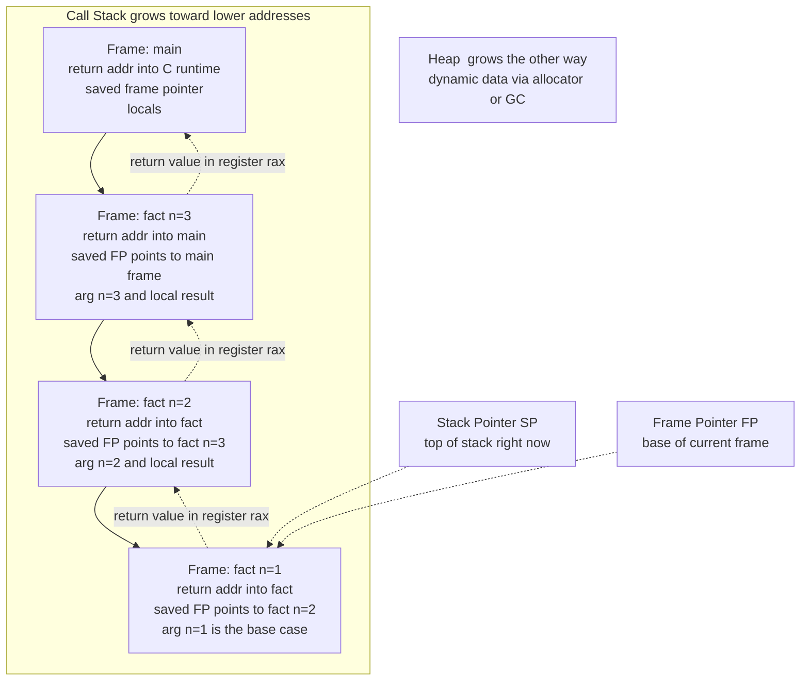

# 🏗️ Runtime Systems and the ABI

> [!abstract] TL;DR
> Compiled code never runs alone. The **runtime system** is the always-present support crew — call-stack management, the memory allocator, the garbage collector, exception unwinding, startup and shutdown code, threading, and type metadata — that keeps a program alive as it executes. The **ABI (Application Binary Interface)** is the shared rulebook that lets *separately compiled* pieces of machine code cooperate: exactly how arguments are passed, which **registers** are caller-saved vs callee-saved, where the return value goes, how a **stack frame / activation record** is laid out, and how structs are aligned in memory. The ABI is the *binary* counterpart to a source-level API — the reason a program compiled today can call a shared library compiled a decade ago on the same OS, and the reason mixing C, Rust, and Python in one process is even possible.

---

## Intuition

**Analogy — the workbench handoff and the support crew.** Picture two workers who share one workbench. Worker A does part of a job, then hands the half-finished piece to Worker B, who finishes it and hands the result back. For nothing to get dropped, they follow a *strict, pre-agreed handoff protocol*: "put the part on the left corner, put your tools back exactly where you found them, and leave the finished result in the middle tray." Neither worker can see inside the other's head — they only trust the protocol. If A leaves the part in the wrong place, or B forgets to restore a tool A was relying on, the whole job silently corrupts.

That handoff protocol is the **calling convention**, the core of the **ABI**. When function A calls function B, they must *agree* on where the arguments go (which registers, which stack slots), who is responsible for saving which registers, where the return value lands, and where the return address is stored — all without ever reading each other's source code.

Now zoom out. Behind both workers is a whole *support crew* nobody sees: the person who set up the workbench before the shift started, the one who hands out fresh materials on demand and reclaims scrap, the one who handles emergencies by clearing the bench. That invisible crew is the **runtime system** — the startup code that built the stack and called `main`, the allocator handing out heap memory, the garbage collector reclaiming it, and the exception machinery that cleans up when something throws. Your compiled instructions are just the worker's hands; the runtime and the ABI are the bench, the crew, and the rulebook that make those hands useful.

---

## How It Works

### Core mechanics

A running program is a collaboration between three layers: the **machine code** your compiler emitted (see the sibling note `Code_Generation_and_Instruction_Selection`), the **runtime system** linked into the process, and the **ABI** contract that both sides obey.

**1. The runtime system — the code present *while* the program runs.** It is everything the language needs at execution time that is not your own logic:

- **Startup / shutdown.** On a Unix-like system the kernel loads the executable and jumps to `_start` (provided by `crt0` / the C runtime), *not* to `main`. `_start` sets up the initial stack, wires up `argc`, `argv`, and the environment, runs global constructors and C library init, calls `main`, and then invokes `exit` to run destructors and flush buffers. This is the runtime's on-ramp and off-ramp.
- **Call-stack management.** Pushing and popping activation records on every call and return (detailed below).
- **Memory services.** The heap **allocator** (`malloc`/`free` or the language runtime's own) and, in managed languages, the **garbage collector** — covered by the sibling note `Memory_Management_and_Allocation_Runtime`.
- **Exception machinery.** The tables and unwinder that walk the stack, run cleanup handlers, and transfer control to a `catch` — the sibling `Exception_Handling_and_Stack_Unwinding`.
- **Type info, reflection, threading, and language support** — RTTI/vtables, thread creation and thread-local storage, coroutine schedulers, bounds checks, etc.

Runtimes span a huge spectrum. A **C** program has a *thin* runtime (a few kilobytes of startup and libc glue). The **JVM** or **CLR** is a *heavy managed runtime*: a bytecode interpreter, a JIT compiler, a garbage collector, a class loader, and reflection, all bundled together.

**2. The ABI — the binary contract.** Where an *API* is a source-level promise ("this function takes a `string` and returns an `int`"), the **ABI** is the *machine-level* promise: the `string` is a pointer in register `rdi`, the return `int` comes back in `eax`, this struct's second field sits at byte offset 8, and this class's virtual methods live in a vtable at offset 0. Anything that must interoperate at the binary level — a program and a shared library, your code and the OS kernel — must agree on the ABI. Its main components are the **calling convention**, the **data layout / type representation**, and the **object-file / symbol-naming** rules.

**3. The calling convention — who does what during a call.** This is the part of the ABI the compiler's back end must obey exactly (register allocation, the sibling `Register_Allocation`, is *constrained* by it):

- **Argument passing.** The first several integer/pointer arguments go in **registers** for speed; the rest **spill to the stack**. On **System V AMD64** (Linux, macOS) the integer arg registers are `rdi, rsi, rdx, rcx, r8, r9`; **Windows x64** uses `rcx, rdx, r8, r9` plus a caller-provided *shadow space*; **ARM AAPCS** uses `x0`–`x7`. These differ, which is exactly why an ABI is *per-platform*.
- **Return value.** Small results come back in a register (`rax`/`eax` on x86-64, `x0` on ARM); large structs are returned via a hidden pointer the caller passes in.
- **Caller-saved vs callee-saved registers.** *Callee-saved* (e.g. `rbx`, `rbp`, `r12`–`r15`) must be preserved across the call — if B wants to use them, B saves and restores them. *Caller-saved* (e.g. `rax`, `rcx`, `r10`) may be clobbered freely, so if A still needs them it saves them first. Getting this partition wrong is a silent data-corruption bug.
- **The return address.** The `call` instruction pushes the address to resume at; `ret` pops it. Stack cleanup responsibility (caller vs callee) is fixed by the convention.

**4. The call stack and activation records.** Every function call pushes one **stack frame** (a.k.a. **activation record**) onto the call stack. A frame typically holds: the **return address**, the **saved frame pointer** of the caller, **incoming arguments** that spilled to the stack, **local variables**, and **spilled/saved registers**. Two pointers track it: the **stack pointer (SP)** marks the current top (the stack usually grows *downward*, toward lower addresses), and the optional **frame pointer (FP / `rbp`)** marks the fixed base of the current frame so locals can be addressed at constant offsets even as SP moves. On return, the frame is popped, SP and FP are restored, and control jumps to the return address. This LIFO discipline is what makes **recursion** work — and what makes **stack overflow** happen when recursion never unwinds.

**5. Data layout and name mangling.** The ABI also fixes **struct field alignment and padding**, **endianness**, and **vtable layout** for virtual dispatch. And because languages with overloading (C++, Rust) can have many functions sharing a source name, the compiler performs **name mangling** — encoding the namespace, type signature, and template arguments into a unique linker symbol like `_ZN3fooEi`. This is the ABI's symbol-naming aspect, consumed by the linker (sibling `Linkers_and_Loaders`).

### Diagram — the call stack growing with activation records



The stack fills from `main` downward as calls nest; each `ret` unwinds one frame back up. The heap, managed by the runtime's allocator, grows from the opposite end of the address space — the two never collide until memory is exhausted.

---

## Key Concepts

### Secondary (intuitive)
- **Runtime vs your code** — the support crew (allocator, GC, startup) that is always present versus the business logic you actually wrote.
- **The rulebook idea** — an **ABI** is a binary handshake; if both sides follow it, code compiled separately (even years apart, in different languages) can call each other.
- **Stack vs heap** — locals live on the fast, automatic, LIFO **stack**; long-lived or dynamically sized data lives on the **heap**.
- **Stack overflow** — recursion that never returns keeps pushing frames until the stack runs out of room and the program crashes.

### Undergraduate (mechanism)
- **Activation record / stack frame** — the per-call bundle: return address, saved frame pointer, arguments, locals, spilled registers.
- **Frame pointer vs stack pointer** — FP is a stable anchor for addressing locals at constant offsets; SP tracks the moving top. Frame-pointer *omission* frees a register but requires unwind tables to reconstruct the stack.
- **Caller-saved vs callee-saved registers** — the split that decides who is responsible for preserving each register across a call; violating it corrupts data with no crash at the call site.
- **Calling convention** — the concrete rules: System V AMD64 vs Windows x64 vs ARM AAPCS differ in arg registers, cleanup, and shadow space.
- **Name mangling** — encoding types and namespaces into unique linker symbols so overloaded/generic functions get distinct names.
- **ABI vs API** — API is the *source* contract (signatures, types you write); ABI is the *binary* contract (registers, offsets, layout) after compilation.

### Graduate (theory and frontiers)
- **ABI stability and its cost** — the **System V ABI** and the **Itanium C++ ABI** are stable, published contracts; changing a struct's layout or a vtable's ordering breaks every binary compiled against the old version. This is why the C ABI is the *lingua franca* of interop and why C++'s richer ABI is far more fragile (adding a virtual method or a private field can break binary compatibility).
- **The syscall ABI** — calling into the kernel is its *own* convention (on Linux x86-64: syscall number in `rax`, args in `rdi, rsi, rdx, r10, r8, r9`, the `syscall` instruction), distinct from the user-space function ABI. The runtime's libc wraps these.
- **Unwinding and zero-cost exceptions** — modern C++/Rust use table-driven unwinding (`.eh_frame`, DWARF CFI) so the *non-throwing* path costs nothing; the runtime consults these tables only when an exception propagates.
- **Managed vs unmanaged runtimes** — a spectrum: C (thin), Go (a substantial runtime with GC, goroutine scheduler, and stack management using *growable* segmented/contiguous stacks), and the JVM/CLR/CPython (heavy — GC, reflection, JIT). Managed runtimes trade raw control for safety, portable bytecode, and automatic memory management.
- **Red zone, alignment, and variadic quirks** — System V's 128-byte *red zone* below SP that leaf functions may use without adjusting SP; mandatory 16-byte stack alignment at call sites; special rules for passing `...` variadic and floating-point args (SSE registers, `al` holding the vector-register count).
- **ABI as ecosystem enabler** — a stable ABI is what makes a *software ecosystem* possible: shared libraries (`.so`/`.dll`), plugins, foreign-function interfaces, and language mixing all rest on it (sibling `Foreign_Function_Interfaces_and_Interop`).

---

## Python Demo

We cannot easily inspect real machine registers from Python, but we *can* build a faithful model of the call stack — the single most important runtime data structure. The demo below simulates a **call stack of activation records**: each function call pushes a `Frame` holding its arguments, locals, and return address; each return pops it. We drive **recursion** (`factorial`) and a **mutually-recursive pair** (`is_even`/`is_odd`), record the maximum depth, visualize the stack growing and unwinding over time, and finally show how **unbounded recursion overflows** a bounded stack.

```python
"""
A model of the runtime CALL STACK and its ACTIVATION RECORDS.

  1. Frame     -> one activation record: function name, arguments, locals,
                  and the return address (where control resumes on return).
  2. CallStack -> a bounded LIFO of frames that records a TIMELINE of every
                  push/pop and each frame's LIFETIME, and detects overflow.
  3. Simulated functions push/pop frames exactly where a real function would:
        - sim_factorial : linear recursion (stack grows then unwinds)
        - sim_is_even / sim_is_odd : MUTUAL recursion (alternating frames)
        - sim_runaway   : UNBOUNDED recursion -> stack overflow
  4. matplotlib visualizes the stack depth over time and each frame's
     lifetime as a bar (frames stacking up, then unwinding).

Pure stdlib + matplotlib. Run:  python call_stack.py
"""

import matplotlib.pyplot as plt


class StackOverflow(Exception):
    """Raised when the bounded call stack is exhausted."""


class Frame:
    """One activation record / stack frame."""
    def __init__(self, func, args, ret_addr):
        self.func = func            # function name
        self.args = args            # dict of incoming arguments
        self.ret_addr = ret_addr    # symbolic 'return address'
        self.locals = {}            # local variables filled in as we go
        self.push_step = None       # event index when pushed
        self.depth = None           # stack depth when pushed

    def label(self):
        arglist = ", ".join(f"{k}={v}" for k, v in self.args.items())
        return f"{self.func}({arglist})"


class CallStack:
    """A bounded LIFO of frames that traces its own history."""
    def __init__(self, limit=64):
        self.frames = []
        self.limit = limit
        self.max_depth = 0
        self.step = 0            # monotonic event counter (our 'time')
        self.timeline = []       # (step, depth_after, event, label)
        self.lifetimes = []      # per-frame: {label, start, end, depth, ret}

    def push(self, frame):
        if len(self.frames) >= self.limit:                 # no room left
            raise StackOverflow(
                f"exceeded {self.limit} frames while pushing {frame.label()}"
            )
        self.frames.append(frame)
        depth = len(self.frames)
        self.max_depth = max(self.max_depth, depth)
        frame.push_step, frame.depth = self.step, depth
        self.timeline.append((self.step, depth, "call", frame.label()))
        self.step += 1
        return frame

    def pop(self, retval):
        frame = self.frames.pop()                          # LIFO discipline
        self.lifetimes.append({
            "label": frame.label(),
            "start": frame.push_step,
            "end": self.step,
            "depth": frame.depth,
            "ret": retval,
        })
        self.timeline.append(
            (self.step, len(self.frames), "return", f"{frame.label()} -> {retval}")
        )
        self.step += 1
        return retval                                      # value 'in a register'


# --------------------------------------------------------- simulated functions
def sim_factorial(stack, n, ret_addr="caller"):
    """Linear recursion: push, recurse (frame stays live), then pop."""
    frame = stack.push(Frame("fact", {"n": n}, ret_addr))
    if n <= 1:
        return stack.pop(1)                                # base case unwinds
    sub = sim_factorial(stack, n - 1, ret_addr="fact:multiply")
    result = n * sub
    frame.locals["result"] = result
    return stack.pop(result)


def sim_is_even(stack, n, ret_addr="caller"):
    """Mutual recursion: is_even defers to is_odd, staying on the stack."""
    stack.push(Frame("is_even", {"n": n}, ret_addr))
    if n == 0:
        return stack.pop(True)
    return stack.pop(sim_is_odd(stack, n - 1, ret_addr="is_even"))


def sim_is_odd(stack, n, ret_addr="caller"):
    stack.push(Frame("is_odd", {"n": n}, ret_addr))
    if n == 0:
        return stack.pop(False)
    return stack.pop(sim_is_even(stack, n - 1, ret_addr="is_odd"))


def sim_runaway(stack, n=0):
    """Unbounded recursion: never pops -> guaranteed stack overflow."""
    stack.push(Frame("runaway", {"depth": n}, "runaway"))
    return sim_runaway(stack, n + 1)


def run(fn, *args, limit=64):
    stack = CallStack(limit=limit)
    result = fn(stack, *args)
    return stack, result


# --------------------------------------------------------- drive the sims
fact_stack, fact_val = run(sim_factorial, 6)
print(f"factorial(6) = {fact_val}   max stack depth = {fact_stack.max_depth}")

even_stack, even_val = run(sim_is_even, 7)
print(f"is_even(7)   = {even_val}   max stack depth = {even_stack.max_depth}")

overflow_stack = CallStack(limit=32)
try:
    sim_runaway(overflow_stack)
except StackOverflow as e:
    print(f"STACK OVERFLOW: {e}")
    print(f"depth at crash = {overflow_stack.max_depth} (the fixed limit)")


# --------------------------------------------------------- visualization
def visualize(stack, title, filename="call_stack.png"):
    fig, (ax1, ax2) = plt.subplots(1, 2, figsize=(13, 5))

    # Panel 1 -- stack DEPTH over time (grows, then unwinds).
    xs = list(range(len(stack.timeline) + 1))
    ys = [0] + [depth for _, depth, _, _ in stack.timeline]
    ax1.step(xs, ys, where="post", lw=2.4, color="#1f6fb2")
    ax1.fill_between(xs, ys, step="post", alpha=0.15, color="#1f6fb2")
    ax1.axhline(stack.limit, ls="--", color="#c0392b", lw=1.6,
                label=f"stack limit = {stack.limit}  (overflow ceiling)")
    ax1.set_title(f"Stack depth over time\n{title}", fontsize=12, weight="bold")
    ax1.set_xlabel("event step (each call or return)")
    ax1.set_ylabel("live frames on the stack")
    ax1.set_ylim(0, max(stack.limit, stack.max_depth) + 1)
    ax1.legend(loc="upper right", fontsize=9)
    ax1.grid(alpha=0.3)

    # Panel 2 -- each FRAME's lifetime as a bar (stacking up, then unwinding).
    cmap = plt.get_cmap("viridis")
    maxd = max(lt["depth"] for lt in stack.lifetimes)
    for lt in stack.lifetimes:
        ax2.barh(lt["depth"], lt["end"] - lt["start"], left=lt["start"],
                 height=0.7, color=cmap(lt["depth"] / (maxd + 1)),
                 edgecolor="black", linewidth=0.6)
        ax2.text(lt["start"] + 0.1, lt["depth"], lt["label"],
                 va="center", ha="left", fontsize=8, color="white", weight="bold")
    ax2.set_title("Frame lifetimes\n(a bar lives while its frame is on the stack)",
                  fontsize=12, weight="bold")
    ax2.set_xlabel("event step")
    ax2.set_ylabel("stack depth of the frame")
    ax2.set_ylim(0.3, maxd + 0.8)
    ax2.grid(alpha=0.3, axis="x")

    plt.tight_layout()
    plt.savefig(filename, dpi=120)
    print(f"saved visualization -> {filename}")
    plt.show()


visualize(fact_stack, "factorial(6)")
```

Running it prints the results and the overflow, and saves a two-panel figure:

```
factorial(6) = 720   max stack depth = 6
is_even(7)   = False   max stack depth = 8
STACK OVERFLOW: exceeded 32 frames while pushing runaway(depth=32)
depth at crash = 32 (the fixed limit)
```

The left panel shows the classic triangular signature of recursion — depth climbing one frame per call, then unwinding one frame per return — with a red dashed *overflow ceiling*. The right panel draws each activation record as a horizontal bar: the deepest frames are the shortest-lived (they push and pop quickly), while `main`/the outermost `fact` frame spans the entire run, exactly mirroring how real stack frames nest.

---

## Real-World Applications

> **The System V AMD64 ABI** is the reason a Linux binary can dynamically link `libc`, `libssl`, and your own `.so` files — all compiled by different tools at different times — and have every function call *just work*. Register assignments (`rdi, rsi, ...`), the 128-byte red zone, and 16-byte stack alignment are all fixed by this document.

> **The Itanium C++ ABI** standardizes C++ name mangling, vtable layout, and RTTI on Linux/macOS. Because it is stable, GCC- and Clang-compiled C++ objects link together — but its richness is also why C++ has notorious binary-compatibility fragility: reordering members or inserting a virtual function silently breaks every dependent binary.

> **Foreign function interfaces** (Python `ctypes`/CFFI, Rust `extern "C"`, Java JNI/Panama, Go `cgo`) all work by conforming to the **C ABI** — the universal lowest common denominator. That is why nearly every language can call C libraries but rarely call each other's *native* ABIs directly.

> **The JVM and CLR** are heavy **managed runtimes**: portable bytecode is executed by an interpreter and then **JIT-compiled** to native code, with a garbage collector and reflection always present. Here the "ABI" is largely internal and *hidden* behind the bytecode, giving binary portability across CPUs at the cost of a bundled runtime.

> **Syscall wrappers in libc** bridge the user-space calling convention and the *kernel* syscall ABI — a separate contract (syscall number in `rax`, `syscall` instruction) that the OS guarantees to keep stable so old binaries keep running across kernel upgrades.

---

## Common Pitfalls

- **Clobbering a callee-saved register** — hand-written assembly or a mis-generated function that overwrites `rbx`/`r12`–`r15` without restoring them corrupts the caller's state with *no crash at the call site*; the bug surfaces far away, making it brutal to debug.
- **ABI mismatch across the boundary** — compiling one object with the System V convention and calling it as if it were Windows x64 (or passing a struct by value where the ABI expects a hidden pointer) puts arguments in the wrong registers. It may even "work" for simple cases and then corrupt on the first spilled argument.
- **Struct layout / alignment assumptions** — hard-coding a field offset, ignoring padding, or forgetting endianness breaks the moment you cross compilers, architectures, or a `#pragma pack` boundary. Never assume `sizeof(struct)` equals the sum of its fields.
- **Breaking ABI on a shared library while keeping the API** — adding a virtual method, reordering members, or changing a struct's size is *source-compatible* but *binary-incompatible*; every program linked against the old `.so`/`.dll` breaks until recompiled. This is why mature libraries version their SONAME and freeze layout.
- **Unbounded or deep recursion** — each call consumes a frame; without a base case (or with too-deep legitimate recursion) the stack overflows. Fixes: convert to iteration, use an explicit heap-allocated stack, or rely on tail-call optimization where the language guarantees it.
- **Forgetting the runtime exists** — assuming `main` is the first thing that runs, or that memory is free of setup, ignores `crt0`/`_start`, global constructors, and allocator initialization. Bugs in static-initialization order or in signal-safety of the runtime bite hardest here.
- **Name-mangling surprises in FFI** — forgetting `extern "C"` in C++ leaves the symbol mangled, so the linker cannot find `foo` from C; conversely, relying on a specific mangled name across compiler versions is fragile.

---

## Related Concepts

- [[ABI_and_Calling_Conventions]] — the hardware-level companion: the RISC-V register roster, argument/return registers, and prologue/epilogue that this note's calling-convention section abstracts.
- [[Assembly_Programming]] — where you actually *write* prologues, epilogues, and stack-frame setup by hand and see the ABI in raw instructions.
- [[Memory_Management_and_Allocation]] — the OS view of the process stack and heap that the runtime's allocator sits on top of.
- [[System_Calls_and_the_Kernel_Interface]] — the *syscall ABI*: a distinct calling convention for crossing into the kernel, wrapped by the C runtime.
- [[Processes_and_the_Process_Model]] — the process address space (stack, heap, code, data segments) the runtime initializes and lives within.
- [[The_Boot_Process_and_System_Initialization]] — the layer below program startup; conceptual sibling to how `crt0`/`_start` bootstraps a single process.
- [[Garbage_Collection]] — the heaviest runtime service in managed languages; reclaims heap memory the compiler cannot free deterministically.
- [[Bytecode_and_JVM]] — the managed-runtime extreme: portable bytecode, a JIT, and a bundled runtime hiding the native ABI.
- [[JIT_Compilation]] — how a managed runtime turns bytecode into native code that must still honor the platform ABI to call into libraries and the OS.
- [[Object_Memory_Layout]] — field alignment, padding, and header layout — the data-layout half of an ABI, seen from the JVM side.
- [[C_Pointers_and_Memory]] — stack vs heap, pointers, and manual memory that make the calling convention and frame layout concrete in C.
- [[C_Cpp_Interop_and_FFI]] — mixing languages by conforming to the C ABI; the practical payoff of ABI stability.
- [[Cpp_Exception_Handling]] — the throw/catch machinery whose table-driven **stack unwinding** is a core runtime service.

*(Sibling Compilers notes not yet in the vault — reference in prose until created: `Code_Generation_and_Instruction_Selection`, `Register_Allocation`, `Memory_Management_and_Allocation_Runtime`, `Exception_Handling_and_Stack_Unwinding`, `Linkers_and_Loaders`, and `Foreign_Function_Interfaces_and_Interop`.)*

---

## Review Questions

1. **(Secondary)** Explain in plain terms why two functions compiled by *different* tools years apart can still call each other correctly. What is the shared "rulebook," and name three specific things it must pin down.
2. **(Undergraduate)** A function `A` keeps a value in register `rbx` across a call to `B`, and after `B` returns the value is garbage. Given the System V AMD64 convention, is `rbx` caller-saved or callee-saved, whose responsibility was it to preserve it, and where exactly is the bug? Then describe what a stack frame for `B` contains and how the frame pointer lets `B` address its locals even as the stack pointer moves.
3. **(Graduate)** You maintain a widely used C++ shared library. A colleague proposes adding one new *virtual* method to a public class and one new private field. Both changes are source-compatible, so the header still compiles for everyone. Explain precisely why each change is nonetheless an **ABI break**, referencing vtable layout and object size, what happens to already-compiled programs that link against the old `.so`, and how a C-style ABI or the pImpl idiom would have avoided the problem.

---

## Sources

- *System V Application Binary Interface, AMD64 Architecture Processor Supplement* (the x86-64 psABI) — the authoritative calling-convention and data-layout spec. https://gitlab.com/x86-psABIs/x86-64-ABI
- *Itanium C++ ABI* — the cross-vendor standard for C++ name mangling, vtables, and RTTI used by GCC and Clang. https://itanium-cxx-abi.github.io/cxx-abi/abi.html
- Aho, Lam, Sethi, Ullman, *Compilers: Principles, Techniques, and Tools* (2nd ed.), Ch. 7 "Run-Time Environments" — activation records, the call stack, and runtime organization. https://suif.stanford.edu/dragonbook/
- Eli Bendersky, *Stack frame layout on x86-64* — a hands-on walkthrough of frames, the red zone, and argument passing. https://eli.thegreenplace.net/2011/09/06/stack-frame-layout-on-x86-64
- ARM, *Procedure Call Standard for the Arm 64-bit Architecture (AAPCS64)* — the ARM calling convention counterpart. https://github.com/ARM-software/abi-aa/blob/main/aapcs64/aapcs64.rst

---

#compilers #runtime-system #abi #calling-convention #stack-frame
