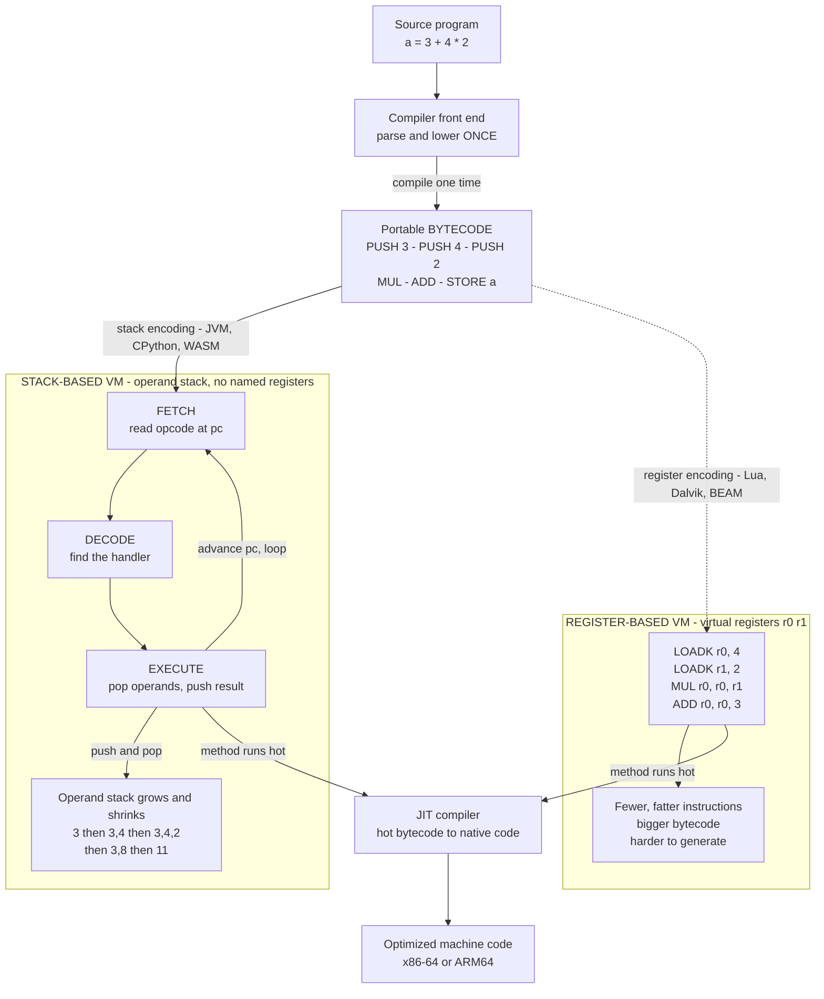

# 🧮 Bytecode and Virtual Machines

> [!abstract] TL;DR
> A **tree-walking interpreter** re-walks the messy syntax tree of a program every time it runs it — slow, because each step re-navigates pointers and re-dispatches on node types. A **bytecode virtual machine** breaks the job in two: **compile the source *once*** into a compact, flat, portable list of tiny numbered instructions — **bytecode** — and then execute that list on a **software CPU** whose whole life is a tight **fetch-decode-execute** loop over an **operand stack**. This is faster than tree-walking because the program is pre-flattened into simple opcodes with good memory locality and cheap dispatch, and it is **portable** because the bytecode is not tied to any real chip: the *same* compiled artifact runs anywhere the VM runs — the "**write once, run anywhere**" model behind the **JVM**, **.NET CLR**, **CPython**, **Lua**, **Erlang BEAM**, and **WebAssembly**. Bytecode VMs occupy the middle ground between slow tree-walkers and fast-but-non-portable native code, and they naturally evolve one step further: **JIT-compile** the *hot* bytecode into machine code at run time.

---

## Intuition

**Analogy — the messy blueprint versus the tidy numbered recipe.** A [tree-walking interpreter](Interpreters_and_Tree_Walking) is like a cook who, every single time they make a dish, re-reads a sprawling architectural *blueprint* of the whole meal — flipping between nested pages, re-deciding at every fork "is this a sauce step or a plating step?" — before doing anything. It works, but the constant re-navigation and re-deciding is pure overhead, repaid on every single run and every loop iteration.

Now imagine you **flatten** that blueprint **once** into a tidy, numbered **recipe of one-line steps**: `1. put 3 on the counter. 2. put 4 on the counter. 3. put 2 on the counter. 4. multiply the top two. 5. add the top two.` Each step is trivially simple, they sit in order in a straight line, and there is no tree to re-walk. That flattened recipe is **bytecode**. And the cook who runs it in a mechanical, do-the-next-number loop — grab the next step, figure out which it is, do it, advance — is a **virtual machine**: a *software CPU* that reads bytecode instructions and executes them fast, keeping intermediate values on a small stack of "things on the counter." Because the recipe is written in generic counter-and-bowl steps rather than for one specific kitchen, the **same recipe runs in any kitchen** that understands those steps — write once, run anywhere.

---

## How It Works

### Core Mechanics

**1. Compile once into a flat instruction stream.** The front end parses the source and lowers it — not to a tree that gets re-walked, but to **bytecode**: a compact, linear sequence of low-level instructions, each an *opcode* (what to do) plus zero or more *operands* (constants, variable slots, jump targets). Compared with a syntax tree, this buys three things that make interpretation faster: the program is **pre-decoded** into primitive steps so no re-parsing happens per run; instructions sit **contiguously in memory** so the instruction fetch has excellent cache locality; and control flow becomes **explicit numbered jumps** instead of recursive tree descent. The flattening happens once and is amortized over every execution.

**2. The virtual machine is a software CPU.** A bytecode VM mirrors a real processor. It has a **program counter** (`pc`) pointing at the next instruction, an **operand stack** (or virtual registers) holding intermediate values, and a variable/local store. Its entire job is a loop:

- **FETCH** — read the instruction at `pc`.
- **DECODE** — determine which operation the opcode names and find its handler.
- **EXECUTE** — run the handler, which mutates the stack, variables, or `pc`; then advance `pc` and loop.

This is literally the [instruction cycle of a CPU](ISA_Design_RISC_vs_CISC), implemented in software.

**3. Interpreter dispatch — where the performance actually hides.** The surprising depth of a bytecode VM is in the *dispatch*: how the loop gets from one instruction's handler to the next. Options, from simplest to fastest:

- **Switch dispatch** — a giant `switch(opcode)` (or a dict of handlers). Simple and portable, but each iteration pays a bounds check and an indirect branch the CPU's branch predictor struggles to predict.
- **Direct / indirect threaded code** — instead of returning to a central switch, each handler *jumps directly* to the next handler (via a table of label addresses). This removes the central dispatch bottleneck and gives the branch predictor per-opcode history. Implemented in C with **computed gotos** (the `&&label` GCC extension).
- **Superinstructions** — fuse common opcode *pairs* (e.g. `LOAD` then `ADD`) into a single combined opcode, cutting the number of dispatches. Related tricks: **stack caching** (keep the top-of-stack in a register) and **quickening** (rewrite a generic opcode into a specialized one after the first execution).

A well-engineered interpreter using threaded code and superinstructions can be several times faster than a naive switch loop — dispatch engineering is a real subfield.

**4. Stack-based versus register-based VMs — the classic trade-off.**

- A **stack VM** has no named registers; instructions implicitly consume operands from, and push results onto, an **operand stack**. `PUSH 3; PUSH 4; PUSH 2; MUL; ADD` computes `3 + 4 * 2`. Bytecode is **compact** (operands are implicit, opcodes are tiny) and **trivial to generate** (post-order tree traversal *is* stack code — see [[Intermediate_Representations]]), but it needs **more instructions** (all the push/pop churn), so more fetch-decode-execute cycles. **JVM, CPython, and WebAssembly** are stack machines.
- A **register VM** gives instructions explicit virtual operands: `MUL r0, r1, r2`. This needs **fewer, fatter instructions** (values are named, not shuffled through a stack) and typically **runs faster** with fewer dispatches, but the bytecode is **larger** and **harder to generate** (the compiler must do virtual [register allocation](Register_Allocation), a whole extra pass). **Lua 5, Android's Dalvik, and Erlang's BEAM** are register machines. Dalvik famously moved Java stack bytecode to a register form for exactly this speed/size reason.

**5. Portability — bytecode as a distribution format.** Because bytecode targets an *abstract* machine rather than x86 or ARM, the **same compiled artifact runs on any platform that has the VM**. You ship the bytecode, not source and not native binaries. This is the JVM/CLR/BEAM/Python model, and it is why bytecode is both a *compiler IR* and a *distribution format*: Java, Kotlin, and Scala all compile to one JVM bytecode; C#, F#, and VB compile to .NET CIL; Rust, Go, C++, and dozens more compile to WebAssembly. The VM is the single per-platform native component; everything above it is portable.

**6. The VM's runtime responsibilities.** A production VM is far more than a dispatch loop. Before running untrusted bytecode it performs **verification** (type/stack-safety checks so a malformed `.class` cannot corrupt memory). At run time it provides a whole **managed runtime**: [garbage collection](Garbage_Collection), [exception handling and stack unwinding](Exception_Hierarchy_and_Handling), threading, class loading and linking (see [[ClassLoader_System]]), and **sandboxing** (the applet/WASM security model — see [[OS_Security_and_Isolation]]). The bytecode format and the runtime together are what people mean by "the JVM" or "the CLR."

**7. The JIT connection.** Pure bytecode interpretation beats tree-walking but still loses to native code — every instruction pays interpretive overhead. The natural next step is to **JIT-compile hot bytecode into machine code** at run time. Modern engines run **tiered**: interpret cold code (cheap startup, gathers profiles), then hand *hot* methods to a [JIT compiler](JIT_Compilation) that emits optimized native code guided by those profiles ([profile-guided / adaptive optimization](Profile_Guided_and_Adaptive_Optimization)). HotSpot (interpreter → C1 → C2), V8 (Ignition bytecode → TurboFan), and the CLR all follow this interpret-then-JIT arc. Bytecode is the *input* to that pipeline.

### Flow / Architecture



*Source is compiled **once** to portable bytecode. A **stack VM** runs it in a fetch-decode-execute loop over an operand stack that grows and shrinks; a **register VM** encodes the same program in fewer, fatter register instructions. Either way, **hot** code is handed to a JIT that lowers bytecode to native instructions.*

---

## Key Concepts

**Secondary (intuitive, no CS background needed)**
- **Flatten once, run fast** — turn a tangled program into a simple numbered list of steps so you never re-untangle it while running.
- **A software CPU** — the virtual machine is a program that pretends to be a chip, doing "read the next step, figure out what it is, do it" over and over.
- **A stack of things on the counter** — most VMs keep in-progress values on a small pile; each step adds to or takes from the top.
- **Write once, run anywhere** — because the steps aren't written for one real machine, the same compiled program works on any device that has the VM.

**Undergraduate (a first compilers / architecture course)**
- **Bytecode as a linear IR** — opcode + operands; contiguous, pre-decoded, explicit jumps; why this beats re-walking an AST.
- **The fetch-decode-execute loop** — program counter, operand stack, variable store; the VM as a software instruction cycle.
- **Stack VM vs register VM** — compact-but-more-instructions versus fewer-instructions-but-larger; JVM/CPython/WASM vs Lua/Dalvik/BEAM; the classic trade-off.
- **Post-order codegen = stack code** — why a tree walk that emits operands before operators produces stack bytecode for free.
- **Portability and distribution** — bytecode as a target-independent shipping format; one VM per platform, portable code above it.
- **Verification** — the safety check a VM runs before trusting bytecode (stack depth, type consistency).

**Graduate (VM engineering / advanced compilation)**
- **Dispatch techniques** — switch dispatch vs direct/indirect **threaded code** with computed gotos; branch-prediction effects; the real interpreter speed knob.
- **Superinstructions, stack caching, quickening** — fusing opcodes, keeping top-of-stack in a register, and specializing opcodes after first execution.
- **Interpret-then-JIT tiering** — cheap interpreted startup + profiling, then adaptive JIT of hot methods; deoptimization when speculative assumptions break (see [[JIT_Compilation]]).
- **VM as polyglot runtime** — many languages targeting one VM (JVM: Kotlin/Scala/Clojure; CLR: C#/F#; WASM: everything); shared GC, threading, and interop ([foreign function interfaces](Foreign_Function_Interfaces_and_Interop)).
- **Security and sandboxing** — bytecode verification plus a confined execution model (applets historically, WASM today) as the basis of running untrusted code.
- **Register allocation for register VMs** — the extra codegen pass a register bytecode demands, and why stack VMs skip it.

---

## Python Demo

```python
# A STACK-BASED VIRTUAL MACHINE in pure Python.
# We define a tiny BYTECODE instruction set, compile the expression
#       3 + 4 * 2
# into a linear list of bytecode instructions, then run a classic
# FETCH-DECODE-EXECUTE loop over an OPERAND STACK, tracing the stack after
# every instruction until the result 11 lands on top.  Finally we VISUALIZE
# the operand stack evolving step by step with matplotlib, and contrast the
# instruction count against an equivalent REGISTER-based VM.
# Pure standard library + matplotlib.

import matplotlib.pyplot as plt
import matplotlib.patches as mpatches

# ---------------------------------------------------------------------------
# 1. THE INSTRUCTION SET.  Each instruction is an (opcode, operand) tuple.
#    Opcodes are plain strings so the printed trace stays readable.
# ---------------------------------------------------------------------------
PUSH  = "PUSH"    # push a constant onto the operand stack
LOAD  = "LOAD"    # push the value of a variable
STORE = "STORE"   # pop the top and store it into a variable
ADD   = "ADD"     # pop b, pop a, push a + b
SUB   = "SUB"     # pop b, pop a, push a - b
MUL   = "MUL"     # pop b, pop a, push a * b
DIV   = "DIV"     # pop b, pop a, push a // b
JUMP  = "JUMP"    # unconditional jump to an instruction index
JZ    = "JZ"      # pop the top; jump if it is zero (conditional control flow)
PRINT = "PRINT"   # pop the top and print it
HALT  = "HALT"    # stop the machine

BINOP = {"+": ADD, "-": SUB, "*": MUL, "/": DIV}

# ---------------------------------------------------------------------------
# 2. A TINY COMPILER: lower an expression AST to stack bytecode.
#    AST nodes:  ("num", 3)  |  ("var", "x")  |  ("bin", "*", left, right)
#    POST-ORDER emission is exactly what produces stack code: evaluate both
#    operands (leaving them on the stack) THEN emit the operator.
# ---------------------------------------------------------------------------
def compile_expr(node, code):
    kind = node[0]
    if kind == "num":
        code.append((PUSH, node[1]))
    elif kind == "var":
        code.append((LOAD, node[1]))
    elif kind == "bin":
        _, op, left, right = node
        compile_expr(left, code)          # sub-result 1 -> stack
        compile_expr(right, code)         # sub-result 2 -> stack
        code.append((BINOP[op], None))    # operator consumes the top two
    return code

# AST for  3 + 4 * 2   ('*' binds tighter than '+')
ast = ("bin", "+", ("num", 3), ("bin", "*", ("num", 4), ("num", 2)))

expr_code = compile_expr(ast, [])         # just the expression
program = expr_code + [
    (STORE, "result"),                    # save the answer in a variable
    (LOAD,  "result"),                    # ...and read it back
    (PRINT, None),                        # show it
    (HALT,  None),
]

# ---------------------------------------------------------------------------
# 3. THE VIRTUAL MACHINE: a fetch-decode-execute loop over an operand stack.
#    DECODE is a dict from opcode -> handler ("switch dispatch"); real VMs use
#    computed gotos / threaded code for speed, but the shape is identical.
# ---------------------------------------------------------------------------
class StackVM:
    def __init__(self, code):
        self.code = code
        self.pc = 0                 # program counter
        self.stack = []             # THE operand stack
        self.vars = {}              # variable store
        self.trace = []             # (index, opcode, operand, stack snapshot)

    def run(self):
        while True:
            idx = self.pc
            opcode, operand = self.code[idx]      # FETCH
            handler = self.DISPATCH[opcode]       # DECODE
            self.pc += 1
            stop = handler(self, operand)         # EXECUTE (may change pc/stack)
            self.trace.append((idx, opcode, operand, list(self.stack)))
            if stop:
                break

    # --- instruction handlers ---
    def op_push(self, x):    self.stack.append(x)
    def op_load(self, name): self.stack.append(self.vars[name])
    def op_store(self, name): self.vars[name] = self.stack.pop()
    def op_add(self, _): b = self.stack.pop(); a = self.stack.pop(); self.stack.append(a + b)
    def op_sub(self, _): b = self.stack.pop(); a = self.stack.pop(); self.stack.append(a - b)
    def op_mul(self, _): b = self.stack.pop(); a = self.stack.pop(); self.stack.append(a * b)
    def op_div(self, _): b = self.stack.pop(); a = self.stack.pop(); self.stack.append(a // b)
    def op_jump(self, target): self.pc = target
    def op_jz(self, target):
        if self.stack.pop() == 0:
            self.pc = target
    def op_print(self, _): print("   VM OUTPUT ->", self.stack.pop())
    def op_halt(self, _): return True

StackVM.DISPATCH = {
    PUSH: StackVM.op_push, LOAD: StackVM.op_load, STORE: StackVM.op_store,
    ADD: StackVM.op_add, SUB: StackVM.op_sub, MUL: StackVM.op_mul, DIV: StackVM.op_div,
    JUMP: StackVM.op_jump, JZ: StackVM.op_jz, PRINT: StackVM.op_print, HALT: StackVM.op_halt,
}

# ---------------------------------------------------------------------------
# 4. PRINT THE BYTECODE, then RUN and TRACE the operand stack.
# ---------------------------------------------------------------------------
def fmt_instr(i, instr):
    op, arg = instr
    return f"{i:>2}  {op:<6}{'' if arg is None else arg}"

print("BYTECODE for  3 + 4 * 2  (stack machine):\n")
for i, instr in enumerate(program):
    print("   " + fmt_instr(i, instr))

print("\nFETCH-DECODE-EXECUTE trace (operand stack AFTER each step):\n")
vm = StackVM(program)
vm.run()
for idx, op, arg, snap in vm.trace:
    label = f"{op} {arg}" if arg is not None else op
    print(f"   step {idx:>2} : {label:<12} -> stack {snap}")

# ---------------------------------------------------------------------------
# 5. CONTRAST: the SAME expression on a REGISTER machine.
#    Register code names its operands, so it needs FEWER, FATTER instructions.
# ---------------------------------------------------------------------------
register_code = [
    "LOADK r0, 4",
    "LOADK r1, 2",
    "MUL   r0, r0, r1",   # r0 = 4 * 2  -> 8
    "ADD   r0, r0, 3",    # r0 = r0 + 3 -> 11
]
print("\nINSTRUCTION-COUNT CONTRAST for the expression  3 + 4 * 2 :")
print(f"   stack VM    : {len(expr_code)} instructions  (PUSH PUSH PUSH MUL ADD)")
print(f"   register VM : {len(register_code)} instructions  (values named, no push/pop churn)")

# ---------------------------------------------------------------------------
# 6. VISUALIZE the operand stack evolving across the instruction sequence.
#    Each column is one execution step; boxes stacked upward are the operand
#    stack AFTER that instruction ran.  Watch it grow with each PUSH and shrink
#    when MUL / ADD pop two and push one, until 11 remains and then drains.
# ---------------------------------------------------------------------------
fig, ax = plt.subplots(figsize=(13, 6))
max_depth = max((len(snap) for _, _, _, snap in vm.trace), default=1)

for x, (idx, op, arg, snap) in enumerate(vm.trace):
    lbl = f"{op}\n{arg}" if arg is not None else op        # opcode under the column
    ax.text(x, -0.85, lbl, ha="center", va="top", fontsize=9, family="monospace")
    for depth, value in enumerate(snap):
        top = (depth == len(snap) - 1)
        ax.add_patch(mpatches.Rectangle(
            (x - 0.4, depth), 0.8, 0.85,
            facecolor="#ffd8a8" if top else "#cce3ff",
            edgecolor="black", zorder=2))
        ax.text(x, depth + 0.42, str(value), ha="center", va="center",
                fontsize=12, fontweight="bold", zorder=3)

ax.set_xlim(-0.8, len(vm.trace) - 0.2)
ax.set_ylim(-1.8, max_depth + 0.6)
ax.set_xticks(range(len(vm.trace)))
ax.set_xticklabels([f"s{i}" for i in range(len(vm.trace))])
ax.set_yticks(range(max_depth + 1))
ax.set_ylabel("operand stack depth")
ax.set_xlabel("execution step  (opcode shown below each column)")
ax.set_title("Stack-based VM executing  3 + 4 * 2  ->  11\n"
             "operand stack after each fetch-decode-execute step "
             "(orange = top of stack)")
ax.grid(axis="y", linestyle=":", alpha=0.4)
plt.tight_layout()
plt.savefig("stack_vm_trace.png", dpi=130)
print("\nSaved operand-stack evolution visualization to stack_vm_trace.png")
```

Running it prints the **bytecode** (`PUSH 3 / PUSH 4 / PUSH 2 / MUL / ADD / STORE result / LOAD result / PRINT / HALT`), then traces the **operand stack** after every step — `[3] -> [3, 4] -> [3, 4, 2] -> [3, 8] -> [11]` — showing exactly how `MUL` pops `2` and `4` to push `8`, then `ADD` pops `8` and `3` to push the answer **11**. It prints the **instruction-count contrast** (5 stack instructions versus 4 register instructions for the same expression — the classic trade-off), and saves a figure where each column is one fetch-decode-execute step and the stacked boxes are the operand stack, so you can *watch the stack grow with each `PUSH` and collapse as the arithmetic opcodes fold operands into results.* That grow-and-collapse rhythm is the beating heart of a stack VM.

---

## Real-World Applications

> **Example — the JVM, the archetype of "write once, run anywhere."** The Java compiler `javac` lowers source into **JVM bytecode** stored in `.class` files (see [[Bytecode_and_JVM]] and [[JVM_Execution_Model]]). That bytecode targets an *abstract* stack machine, so one compiled `.class` runs unmodified on Windows, Linux, macOS, and phones — the platform-specific piece is the **JVM**, not the program. Before execution the JVM's **bytecode verifier** proves the code is stack-safe and type-consistent; the [class loader](ClassLoader_System) links it; and the [garbage collector](Garbage_Collection) and [exception machinery](Exception_Hierarchy_and_Handling) provide the managed runtime. HotSpot first *interprets* the bytecode (fast startup, gathers profiles) and then [JIT-compiles](JIT_Compilation) hot methods to native code — the full interpret-then-JIT arc built on bytecode as the input format.

Where bytecode VMs show up in practice:

- **.NET CLR.** C#, F#, and VB compile to **Common Intermediate Language (CIL)**, a stack-based bytecode; the CLR verifies, JITs, and runs it with its own GC — Microsoft's answer to the JVM model.
- **CPython.** Python source compiles to **CPython bytecode** (`.pyc` files) executed by a giant stack-based evaluation loop in `ceval.c` (see [[Python_Internals]]); the `dis` module shows you the exact `LOAD_FAST` / `BINARY_OP` opcodes.
- **WebAssembly.** A modern, portable, stack-based bytecode designed as a *safe, sandboxed* compile target for the web and beyond. Rust, Go, C, and C++ all lower to it (see [[Rust_WebAssembly]] and [[Go_WebAssembly]]); every browser ships a WASM VM. It is the p-code idea reborn for the internet era.
- **Register VMs: Lua, Dalvik, BEAM.** Lua 5's register VM is famous for being one of the fastest interpreters; Android's **Dalvik** re-encoded Java stack bytecode into register form (`.dex`) for speed and size on mobile; Erlang's **BEAM** register VM underpins WhatsApp-scale soft-real-time concurrency.
- **AOT as the alternative.** [GraalVM native-image](GraalVM_Native_Image) compiles JVM bytecode *ahead of time* to a standalone native binary — trading the VM's portability and warmup-then-peak behavior for instant startup, showing the endpoints of the interpret / JIT / AOT spectrum.

---

## Common Pitfalls

- **Believing bytecode is "already optimized."** Bytecode is a *portable interchange* format, not peak-performance code. JVM bytecode and WASM are deliberately simple; the heavy optimization happens *afterward* in the JIT or AOT engine that consumes them. Do not micro-optimize by staring at `javac` output — the JIT will reshape it entirely.
- **Assuming a stack VM is slow because it "has more instructions."** Instruction *count* is not run time. A stack VM with **threaded-code dispatch** and **superinstructions** can beat a naive register VM. Dispatch technique, cache locality, and JIT quality dominate; the stack-vs-register choice is a codegen trade-off, not a verdict on speed.
- **Writing a naive switch loop and calling it done.** The central `switch(opcode)` costs an unpredictable indirect branch every iteration. Serious interpreters use **computed gotos / direct threading** so each handler jumps straight to the next, giving the branch predictor per-opcode history — often a 20 to 50 percent speedup for free.
- **Forgetting verification when running untrusted bytecode.** A VM that executes unverified bytecode is a memory-safety hole: malformed code can underflow the operand stack or forge types. The JVM verifier and WASM's structured validation exist precisely to make **sandboxed** execution safe (see [[OS_Security_and_Isolation]]); skipping them defeats the security model.
- **Confusing the bytecode format with the runtime.** "The JVM" is the *format* (class files, verification) **plus** the *runtime* (GC, threads, class loading, JIT). A language "targeting the JVM" inherits all of it; you cannot adopt the bytecode without adopting the runtime's semantics (its exception model, its memory model).
- **Expecting portability without the runtime installed.** "Write once, run anywhere" is really "run anywhere *the VM is present*." Bytecode is not a native binary; shipping a `.jar` still requires a JRE, and a `.wasm` still requires a host with a WASM engine.

---

## Related Concepts

- [[Intermediate_Representations]] — bytecode *is* a stack-based IR; this note is the "IR as a distribution format and execution engine" branch of that one.
- [[Compilers_Overview]] — the parent map: bytecode + VM is the middle ground between tree-walking and native code generation.
- [[Bytecode_and_JVM]] — a concrete, detailed look at the JVM's stack bytecode, class files, and verification.
- [[JVM_Execution_Model]] — how the JVM interprets then compiles bytecode; the canonical VM in action.
- [[JVM_Architecture]] — the runtime structure (heap, stack, method area, code cache) a production VM provides around the dispatch loop.
- [[JIT_Compilation]] — the natural evolution: tiered interpret-then-JIT of hot bytecode into native machine code, with deoptimization.
- [[Garbage_Collection]] — a core VM runtime responsibility that automatic memory management makes the managed runtime possible.
- [[ClassLoader_System]] — class loading, linking, and where bytecode verification fits in the JVM lifecycle.
- [[Exception_Hierarchy_and_Handling]] — exception dispatch and stack unwinding are handled by the VM runtime, not the bytecode itself.
- [[Python_Internals]] — CPython's bytecode and its stack-based evaluation loop; a second archetypal stack VM.
- [[GraalVM_Native_Image]] — the ahead-of-time alternative to bytecode + VM: trade portability/warmup for instant native startup.
- [[Stack]] — the operand-stack data structure the VM runs on; LIFO push/pop is the whole execution model.
- [[ISA_Design_RISC_vs_CISC]] — the VM's fetch-decode-execute loop mirrors a real CPU, and stack-vs-register echoes real ISA design debates.
- [[RISCV_ISA_Fundamentals]] — a concrete register machine the JIT ultimately lowers bytecode onto.
- [[Rust_WebAssembly]] — Rust compiling to WebAssembly, portable stack bytecode in the wild.
- [[Go_WebAssembly]] — Go targeting the same portable WASM bytecode; the interlingua idea on the web platform.

*(Forthcoming Compilers siblings referenced in prose above — `Interpreters_and_Tree_Walking`, `Just_In_Time_Compilation`, `Register_Allocation`, `WebAssembly_and_Portable_Targets`, `Runtime_Systems_and_the_ABI`, `Profile_Guided_and_Adaptive_Optimization`, `Dynamic_Language_Implementation`, and `Foreign_Function_Interfaces_and_Interop` — are not yet linked because their notes do not exist in the vault.)*

---

## Review Questions

1. **(Conceptual)** Using the "messy blueprint versus tidy numbered recipe" analogy, explain three concrete reasons a bytecode VM executes a program faster than a tree-walking interpreter, *and* explain why bytecode simultaneously makes the program **portable**. Which single per-platform component is the "kitchen that understands the recipe"?
2. **(Scenario)** You are handed the AST for `(a - b) * (a + b)` and must target (a) a **stack VM** and (b) a **register VM**. Write both instruction sequences, count the instructions, and explain the trade-off: which is more compact, which is easier for the compiler to generate, and which typically issues fewer fetch-decode-execute cycles — and why Android's Dalvik chose the register form.
3. **(Trade-off)** A team's bytecode interpreter is correct but slow. Rank these three changes by expected payoff and justify each: (a) switch from a `switch(opcode)` loop to **direct-threaded code with computed gotos**, (b) add **superinstructions** for the two hottest opcode pairs, (c) bolt on a **tiered JIT** that compiles hot methods to native code. What does each cost in engineering complexity, and at what program size does the JIT start to dominate?

---

## Sources

- Aho, A., Lam, M., Sethi, R., Ullman, J. *Compilers: Principles, Techniques, and Tools*, 2nd ed. Pearson, 2006 — the "Dragon Book"; abstract machines, stack code generation, and runtime organization.
- Lindholm, T., Yellin, F., Bracha, G., Buckley, A. *The Java Virtual Machine Specification, Java SE Edition*. Oracle — the authoritative bytecode format, the operand stack, and the verification algorithm ([docs.oracle.com/javase/specs](https://docs.oracle.com/javase/specs/)).
- Ertl, M. A., Gregg, D. "The Structure and Performance of Efficient Interpreters." *Journal of Instruction-Level Parallelism*, 2003 — threaded code, dispatch techniques, and why interpreter engineering matters.
- Ierusalimschy, R., de Figueiredo, L. H., Celes, W. "The Implementation of Lua 5.0." *Journal of Universal Computer Science*, 2005 — the design of a fast **register-based** VM and its trade-offs against stack VMs.
- Haas, A., et al. "Bringing the Web up to Speed with WebAssembly." *PLDI*, 2017 — the design of a modern portable, sandboxed stack bytecode; see also the [WebAssembly specification](https://webassembly.github.io/spec/).

---

#compilers #bytecode #virtual-machine #stack-machine #jvm
