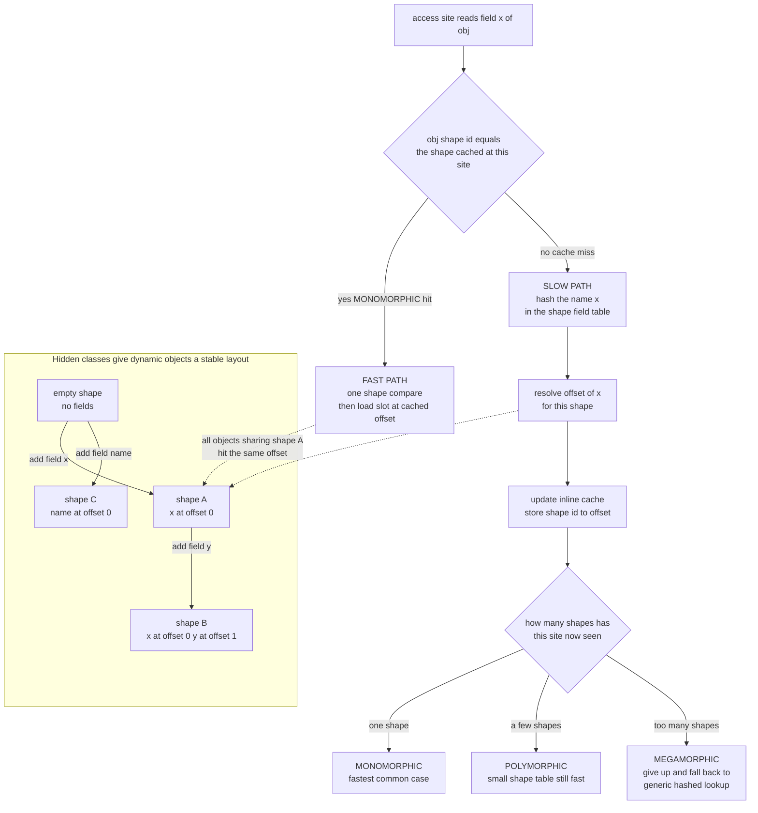

# ⚡ Dynamic Language Implementation

> [!abstract] TL;DR
> **Dynamic languages** (Python, JavaScript, Ruby, Lua, PHP) attach types to *values at runtime*, so the compiler cannot know ahead of time whether `a + b` is an integer add, a float add, or a string concatenation, whether `obj.x` lives at a fixed offset, or which `method` a call resolves to. A naive implementation re-answers "what are you?" on *every* operation and is **10–100x slower** than a statically-typed language. Modern engines close that gap not by removing dynamism but by **exploiting its runtime regularity**: **hidden classes / shapes** give dynamically-structured objects a stable layout, **inline caches** remember the type/shape a given site saw last time and skip the lookup when it repeats, and a **speculative JIT** records observed types, compiles specialized fast paths ("assume int"), and **deoptimizes** with guards when a speculation is wrong. These three ideas — invented for **Self** and **Smalltalk** in the 1980s — are why today's JavaScript and Python are fast.

---

## Intuition

**Analogy — a warehouse with labeled versus unlabeled boxes.** In a **statically-typed** language the compiler is a warehouse where every shelf slot is pre-labeled: slot 3 is always a 32-bit integer, slot 4 is always a pointer to a `User`. A worker fetching an item never has to inspect it — the label guarantees what is there, so the operation is a single instruction. In a **dynamic** language the boxes carry *no shelf labels*: a variable can hold an int now and a string later, and an object can *grow a new field at runtime*. So before every single operation the worker must **open the box and ask "what are you?"** — is this a number I can add, or a string I must concatenate? Does this object even *have* a field called `x`, and if so where? That per-operation interrogation is exactly why naive dynamic runtimes are slow.

The trick that makes them fast is a human one: **notice that the same shelf slot almost always holds the same kind of thing.** The worker who fetched an integer from slot 3 a thousand times in a row stops re-inspecting it — they **cache the answer** ("slot 3 → integer at this offset") and only re-check if the box turns out to be different. That cached answer, attached to the *place in the code where the access happens*, is an **inline cache**; the stable per-object layout that makes "offset 2" a reliable answer is a **hidden class**. Dynamic languages are fast today because they bet on regularity and cache it, falling back to the slow interrogation only when the bet fails.

---

## How It Works

### 1. The challenge: dynamic typing defeats ahead-of-time knowledge

Four properties make dynamic languages hard to compile well:

1. **Values carry types, variables do not.** `x + y` has no single meaning: `+` might be integer add, IEEE-754 float add, string concatenation, list concatenation, or an overloaded `__add__`/`valueOf`. The runtime must dispatch on the *runtime* types of both operands.
2. **Object shape is mutable.** In JavaScript or Python you can add and delete fields on a live object (`obj.newField = 1`). There is no fixed struct layout to compile against, so a field access is, semantically, a **hash-table lookup by name**.
3. **Methods resolve dynamically.** `obj.foo()` walks a prototype / MRO / metatable chain at call time; monkey-patching can change the answer between two calls.
4. **Everything is boxed.** A "number" is a heap object with a type tag, not a raw register value, so even `1 + 2` may allocate. Boxing and unboxing dominate naive interpreters.

The consequence is the **performance gap** dynamic-language implementers exist to close: a tree-walking or simple bytecode interpreter re-does name resolution, type tests, and boxing on every operation. (Static languages sidestep all of this precisely because a **type system** proves the answers at compile time — see [[Type_Checking_and_Type_Systems]].)

### 2. Hidden classes / shapes / maps: giving dynamic objects a stable layout

The foundational idea, from the **Self** language, is that although *any individual object* may change shape, **objects created the same way share the same shape**. Instead of every object owning its own name→value hash map, the engine factors out a **hidden class** (V8's term; SpiderMonkey calls it a **Shape**, Self called it a **map**) that stores *only the layout* — a mapping from field name to a fixed slot **offset**. The object itself becomes a compact array of values plus a pointer to its hidden class.

- All objects built by the same constructor with the same fields in the same order **share one hidden class**, so a field access becomes "read slot at offset 2" instead of "hash the string 'x' and probe a table."
- Adding a field triggers a **transition** to a new hidden class along a **transition tree**; the empty shape has a child for `+x`, that child has a child for `+y`, and so on. Two objects that added `x` then `y` converge on the same shape.
- This is why field-insertion *order* matters for performance and why deleting fields (which forces a slow dictionary-mode object) is discouraged.

Hidden classes turn "dynamic property access" back into "fixed-offset load" — *for objects that share a shape*.

### 3. Inline caches: the single most important technique

An **inline cache (IC)** attaches a small memory to *each property-access or call **site*** in the code (not to the object). The first time `obj.x` executes it does the slow path — find `x`'s offset in `obj`'s hidden class — and then **records at that site: "the last shape I saw was S; for shape S, `x` is at offset 2."** The next execution first checks `obj.shape == S`; if so it takes the **fast path** (a shape compare plus a direct slot load) and skips the hash lookup entirely. Sites are classified by how many shapes they observe:

- **Monomorphic** — the site only ever sees one shape (the overwhelmingly common case in real code). Nearly free: one guard plus one load.
- **Polymorphic** — the site sees a handful of shapes (say a loop over `Circle` and `Square`). The IC keeps a small table of `shape → offset` entries and is still fast.
- **Megamorphic** — the site sees too many shapes (generic code touching arbitrary objects). The IC gives up and falls back to the generic hashed lookup; this is a real performance cliff.

Inline caches are what make method dispatch and field access in Self, Smalltalk, JavaScript, and Ruby fast; **type feedback** for the JIT (below) is literally *reading what the inline caches recorded*.

### 4. Type feedback, speculation, and deoptimization

An IC does more than speed up one access — it **profiles**. After a function runs hot, the **JIT** reads the ICs to learn "at this site the operands were always small integers; that object was always shape S." It then compiles a **specialized fast path** that *assumes* those types — unboxed integer arithmetic, direct offset loads, an inlined resolved method — guarded by cheap **type guards**. If a guard ever fails (someone finally passes a string where every prior call passed an int), the engine **deoptimizes**: it bails out of the specialized code back to the interpreter/baseline, reconstructs the interpreter state, and continues correctly. This tight loop — *observe types, speculate, guard, deoptimize* — is the deep synergy between dynamic languages and **just-in-time compilation** and is a form of profile-guided, adaptive optimization. (See the planned sibling **Just_In_Time_Compilation** and **Profile_Guided_and_Adaptive_Optimization**.)

### 5. Value representation: NaN-boxing and tagged pointers

To avoid heap-allocating every number, engines pack small integers, pointers, and doubles into a single 64-bit machine word:

- **Tagged pointers / small-integer tagging:** steal the low bits of an aligned pointer as a tag, so a "Smi" (small integer, V8) needs no allocation and no unboxing.
- **NaN-boxing:** IEEE-754 doubles have a huge space of unused NaN bit patterns; JavaScriptCore and SpiderMonkey hide pointers and integers *inside* NaN payloads, so a value is a raw double when it is a number and a tagged pointer when it is anything else. This keeps the common numeric path allocation-free while still representing every dynamic type in one word. Boxing/unboxing still costs when a value crosses between the fast unboxed path and the generic boxed heap object.

### Diagram — property access through an inline cache backed by hidden classes



---

## Key Concepts

### Secondary (intuition level)
- A **dynamic language** lets a variable hold anything and lets objects grow new fields while the program runs, so the computer must keep asking "what are you?"
- Asking that question every single time is slow; the fix is to **remember last time's answer** at the exact spot in the code where the question is asked — an **inline cache**.
- Objects built the same way get the same **hidden layout** so a field can be found by a fixed position instead of by searching for its name.
- Fast when the same spot keeps seeing the *same* kind of object (**monomorphic**); slow when a spot sees *many* different kinds (**megamorphic**).

### Undergraduate (mechanics level)
- **Boxing / unboxing** and type tags; why `1 + 2` can allocate in a naive runtime and how tagged small integers avoid it.
- **Hidden classes / shapes / maps** and the **transition tree** created as fields are added; shared shapes turn name lookup into fixed-offset load.
- **Inline caches** at property-access and call sites; the **monomorphic → polymorphic → megamorphic** progression and the megamorphic cliff.
- **Method dispatch** over prototype chains (JS), the **MRO** (Python), and **metatables** (Lua), and how ICs cache the resolved target.
- **Bytecode virtual machines** as the baseline execution tier below the JIT (see the planned sibling **Bytecode_and_Virtual_Machines** and, for CPython specifically, [[Python_Internals]]).
- **Gradual / optional typing** (TypeScript, `mypy`, Sorbet) adds static types for tooling and safety *without changing runtime semantics*.

### Graduate (systems level)
- **Type feedback and speculation:** the JIT specializes on IC-recorded types, inserts **type guards**, and performs **on-stack replacement** and **deoptimization** when guards fail; correctness requires reconstructing interpreter state at safepoints.
- **Polymorphic inline caches (PICs)** as both a dispatch mechanism and a *profiling data structure* feeding the optimizer (Hölzle, Chambers, Ungar).
- **NaN-boxing** and pointer-tagging schemes; the cost model of crossing the boxed/unboxed boundary.
- **Meta-tracing versus method JITs:** PyPy traces the *interpreter loop* (RPython meta-tracing) rather than compiling methods, versus V8/SpiderMonkey/JSC method-based tiered JITs; LuaJIT's trace compiler.
- **The GIL** as an implementation constraint: reference-counting memory management plus C-extension safety pushed CPython to a single lock; the **free-threaded** (`nogil`, PEP 703) and per-interpreter-GIL directions (see [[Concurrency_in_Python]]).
- **Metaprogramming versus optimization:** `eval`, monkey-patching, `__getattr__`, and reflection invalidate ICs and speculation, forcing bailouts — the structural tension between dynamic flexibility and peak speed.

---

## Python Demo

This models the core of a dynamic runtime **in pure Python**: objects with runtime **shapes (hidden classes)** and a **transition tree**, a property-access **site** that normally does a slow hashed lookup, and a **monomorphic/polymorphic inline cache** bolted onto that site. We charge an abstract cost — a slow hashed lookup costs several work units, a cache hit costs one — then run **monomorphic, polymorphic, and megamorphic** workloads and plot the average lookup cost and cache-hit rate. The result reproduces the real engine behavior: cheap while monomorphic, still cheap while polymorphic *if the cache is big enough*, and a sharp cliff to the slow path once the site goes megamorphic. Pure stdlib plus matplotlib.

```python
# Inline caches for dynamic property lookup.
# Objects have a "shape" (hidden class) mapping field name -> slot offset, plus a
# flat slot array. Adding a field transitions to a new shape (shapes are shared,
# so objects built the same way converge on one hidden class). A property-access
# SITE normally hashes the field name in the shape to find the offset (slow path).
# A MONOMORPHIC/POLYMORPHIC inline cache at the site remembers (shape id -> offset)
# and takes a fast path (shape compare + direct slot index) when a shape repeats.
# Too many shapes -> the site goes MEGAMORPHIC and falls back to the slow path.

import random
import matplotlib.pyplot as plt

SLOW_COST = 12   # abstract work for a hashed lookup in the shape's field table
HIT_COST  = 1    # abstract work for a shape compare + direct slot index

# ---------- Hidden classes (shapes) with a memoized transition tree ----------
class Shape:
    _next_id = 0
    def __init__(self, fields):
        self.fields = fields          # name -> offset (a stable layout)
        self.transitions = {}         # field name -> child Shape
        self.id = Shape._next_id
        Shape._next_id += 1
    def offset_of(self, name):        # slow path: probe the field table by name
        return self.fields.get(name)

ROOT = Shape({})                      # the empty-object shape

def add_field(shape, name):
    """Shape reached by adding `name`; transitions are memoized so objects built
    the same way SHARE one hidden class."""
    if name in shape.transitions:
        return shape.transitions[name]
    new_fields = dict(shape.fields)
    new_fields[name] = len(new_fields)     # append at the next free slot
    child = Shape(new_fields)
    shape.transitions[name] = child
    return child

# ---------- Dynamic objects: flat slots + a shape pointer ----------
class Obj:
    __slots__ = ("shape", "slots")
    def __init__(self):
        self.shape = ROOT
        self.slots = []
    def set(self, name, value):
        off = self.shape.offset_of(name)
        if off is None:                    # new field -> hidden-class transition
            self.shape = add_field(self.shape, name)
            self.slots.append(value)
        else:
            self.slots[off] = value

# ---------- The inline cache at ONE property-access site ----------
class InlineCache:
    """Caches up to `capacity` (shape id -> offset) entries for a single site.
       capacity 1 behaves monomorphically; small capacity is polymorphic;
       exceeding it makes the site megamorphic (fall back to the slow path)."""
    def __init__(self, name, capacity=1):
        self.name = name
        self.capacity = capacity
        self.entries = {}              # shape id -> offset
        self.megamorphic = False
        self.hits = self.misses = self.cost = 0

    def load(self, obj):
        sid = obj.shape.id
        if not self.megamorphic and sid in self.entries:   # FAST PATH (cache hit)
            self.hits += 1
            self.cost += HIT_COST
            return obj.slots[self.entries[sid]]
        # SLOW PATH: hash the name in this shape, then fill or spill the cache
        self.misses += 1
        self.cost += SLOW_COST
        off = obj.shape.offset_of(self.name)
        if not self.megamorphic:
            if len(self.entries) < self.capacity:
                self.entries[sid] = off                    # cache this shape
            else:
                self.megamorphic = True                    # too many shapes: give up
                self.entries.clear()
        return obj.slots[off]

# ---------- Build objects with genuinely different hidden classes ----------
def make_object(variant):
    """Prepend `variant` filler fields so the field 'x' lands at a different
    offset in each variant -> distinct shapes that MUST be distinguished."""
    o = Obj()
    for i in range(variant):
        o.set(f"f{i}", i)
    o.set("x", 100 + variant)      # the field our access site reads
    return o

def run_workload(num_shapes, cache_capacity, n_accesses=20000, seed=0):
    rng = random.Random(seed)
    pool = [make_object(v) for v in range(num_shapes)]
    ic = InlineCache("x", capacity=cache_capacity)
    for _ in range(n_accesses):
        ic.load(rng.choice(pool))
    total = ic.hits + ic.misses
    return {"avg_cost": ic.cost / total,
            "hit_rate": ic.hits / total,
            "megamorphic": ic.megamorphic}

def sweep(cache_capacity, shapes_range):
    return [run_workload(k, cache_capacity) for k in shapes_range]

shapes_range = list(range(1, 11))
mono = sweep(1, shapes_range)     # a purely monomorphic cache (capacity 1)
poly = sweep(4, shapes_range)     # a polymorphic cache (capacity 4)

print(f"{'#shapes':>7} {'mono cost':>10} {'mono hit':>9} {'poly cost':>10} {'poly hit':>9}")
for k, m, p in zip(shapes_range, mono, poly):
    print(f"{k:>7} {m['avg_cost']:>10.2f} {m['hit_rate']:>9.2f} "
          f"{p['avg_cost']:>10.2f} {p['hit_rate']:>9.2f}")

# ---------- Visualize the speedup and the megamorphic cliff ----------
fig, (ax1, ax2) = plt.subplots(1, 2, figsize=(13, 5))

ax1.plot(shapes_range, [r["avg_cost"] for r in mono], "o-", label="monomorphic cache cap 1")
ax1.plot(shapes_range, [r["avg_cost"] for r in poly], "s-", label="polymorphic cache cap 4")
ax1.axhline(HIT_COST,  ls=":", color="green", label="fast-path floor")
ax1.axhline(SLOW_COST, ls=":", color="red",   label="slow-path ceiling")
ax1.set_xlabel("distinct shapes seen at the access site")
ax1.set_ylabel("avg work per access")
ax1.set_title("Lookup cost: cheap while cached, cliff at megamorphic")
ax1.legend(); ax1.grid(alpha=0.3)

ax2.plot(shapes_range, [r["hit_rate"] for r in mono], "o-", label="monomorphic cache cap 1")
ax2.plot(shapes_range, [r["hit_rate"] for r in poly], "s-", label="polymorphic cache cap 4")
ax2.set_xlabel("distinct shapes seen at the access site")
ax2.set_ylabel("cache hit rate")
ax2.set_title("Hit rate collapses once the site goes megamorphic")
ax2.legend(); ax2.grid(alpha=0.3)

for ax in (ax1, ax2):                         # shade the three regimes
    ax.axvspan(0.5, 1.5,  color="green", alpha=0.06)   # monomorphic
    ax.axvspan(1.5, 4.5,  color="gold",  alpha=0.08)   # polymorphic
    ax.axvspan(4.5, 10.5, color="red",   alpha=0.06)   # megamorphic

fig.suptitle("Inline cache: monomorphic (green) vs polymorphic (yellow) vs megamorphic (red)",
             fontsize=13)
plt.tight_layout()
plt.savefig("inline_cache.png", dpi=120)
plt.show()
```

Expected console output (abbreviated):

```
#shapes  mono cost  mono hit  poly cost  poly hit
      1       1.00      1.00       1.00      1.00
      2      12.00      0.00       1.00      1.00
      4      12.00      0.00       1.00      1.00
      5      12.00      0.00      12.00      0.00
```

The capacity-1 cache is fast only while the site is **monomorphic** and falls off a cliff to the slow path the moment a second shape appears. The capacity-4 **polymorphic** cache stays fast through four shapes, then collapses to the slow path at five — exactly the **megamorphic** behavior real engines exhibit, and exactly why field-access sites that touch "any object" are slow.

---

## Real-World Applications

> **Google V8 (TurboFan / Maglev / Sparkplug), used in Chrome and Node.js** invented the modern **hidden class** design: every JS object points to a hidden class describing its layout, property-access sites carry inline caches, and hot functions are speculatively optimized by TurboFan/Maglev with deoptimization back to the Ignition bytecode interpreter when type guards fail. Writing object fields in a consistent order to keep sites monomorphic is the canonical V8 performance advice.

> **SpiderMonkey (Firefox)** uses **Shapes** for object layout and a tiered pipeline (Baseline interpreter → Baseline JIT → the **WarpMonkey/IonMonkey** optimizing JIT) driven by IC-collected type information; **JavaScriptCore (Safari)** runs four tiers (LLInt → Baseline → DFG → FTL) and popularized **NaN-boxing** for value representation.

> **CPython** is a classic bytecode VM; the **Faster CPython** effort (3.11+) added **specializing adaptive interpreter** bytecodes — inline caches embedded in the bytecode that swap a generic `LOAD_ATTR`/`BINARY_OP` for a specialized form once a site is seen to be monomorphic — and **3.13 ships an experimental copy-and-patch JIT**. See [[Python_Internals]].

> **PyPy** takes a different route: **meta-tracing**. Instead of compiling Python methods, it traces the *RPython interpreter loop* executing hot Python code and compiles the trace, achieving large speedups on numeric and loop-heavy workloads. **LuaJIT** is a legendary trace-compiling implementation of Lua; **Ruby's YJIT** (a lazy basic-block-versioning JIT contributed by Shopify) and **TruffleRuby** (GraalVM) bring the same speculative techniques to Ruby.

> **Gradual typing tools** — **TypeScript** for JavaScript, **mypy**/**Pyright** for Python, **Sorbet** for Ruby — add optional static types for tooling, refactoring, and safety **without changing runtime semantics**; the types are erased before execution and do not (directly) drive the JIT. See [[TypeScript_Fundamentals]] and [[Type_Hints_and_Static_Analysis]].

---

## Common Pitfalls

- **Making a hot site polymorphic or megamorphic by accident.** Constructing "the same" object with fields in different orders, tacking on optional fields conditionally, or writing generic code that touches arbitrarily-shaped objects splinters a site across many hidden classes and pushes it off the megamorphic cliff. Keep constructors consistent and initialize all fields up front.
- **Deleting properties / using objects as dictionaries.** `delete obj.x` (JS) or heavy dynamic attribute churn drops an object into slow **dictionary mode**, discarding its hidden class. Use real maps (`Map`, `dict`) for key-value data and reserve objects for fixed-shape records.
- **Assuming the JIT is magic and stable.** Speculative optimization can **deoptimize** at any time; a single call that passes an unexpected type can invalidate specialized code and tank a benchmark. Megamorphic sites, `arguments` abuse, `try/finally` in hot paths, and megamorphic prototype chains are classic deopt triggers.
- **Metaprogramming defeats optimization.** `eval`, monkey-patching, `__getattr__`/`__setattr__`, reflection, and reopening classes invalidate inline caches and force bailouts to the interpreter. The flexibility is real but it has a measurable speed cost on hot paths.
- **Fighting the GIL instead of the workload.** CPython's **Global Interpreter Lock** serializes bytecode execution, so threads do not give CPU-bound speedup on one interpreter; reaching for threads for parallel *computation* is a mistake (use processes, native extensions that release the GIL, or free-threaded builds). See [[Concurrency_in_Python]] and, for the OS-level model, [[Threads_and_Concurrency_Models]].
- **Micro-benchmarking a warm-up artifact.** Timing a loop that never gets hot enough to JIT, or timing only the first iterations, measures the interpreter/baseline tier, not the optimized code — a common source of misleading dynamic-language benchmarks.
- **Confusing gradual type annotations with runtime speed.** Adding TypeScript or `mypy` annotations improves tooling and catches bugs but does **not** by itself make the program faster — the types are erased and the same inline-cache/JIT machinery runs underneath.

---

## Related Concepts

- [[Type_Checking_and_Type_Systems]] — the static counterpart: dynamic languages pay at runtime for exactly the guarantees a static type system establishes at compile time; **gradual typing** bridges the two.
- [[Memory_Management_and_Allocation_Runtime]] — boxing/unboxing, tagged values, and the garbage collector that a dynamic runtime leans on; value representation choices live here.
- [[Python_Internals]] — CPython as a bytecode VM, the specializing adaptive interpreter, reference counting, and the experimental 3.13 JIT.
- [[Concurrency_in_Python]] — the **Global Interpreter Lock** as a dynamic-language implementation constraint and the free-threaded / `nogil` direction.
- [[JS_Fundamentals]] — the semantics (prototype chains, dynamic properties, coercions) that V8 and SpiderMonkey must implement fast.
- [[TypeScript_Fundamentals]] — optional, erased static typing layered on a dynamic language for tooling and safety.
- [[Type_Hints_and_Static_Analysis]] — Python's `typing` module, `mypy`/Pyright, and the gradual-typing spectrum.
- [[Decorators_and_Metaprogramming]] — the reflection/monkey-patching features that give dynamic languages their flexibility and cost the optimizer its speculations.
- [[Threads_and_Concurrency_Models]] — OS threads and concurrency models that the GIL debate sits on top of.

*Planned siblings in this **Compilers** vault (referenced here, to be wikilinked once created):* **Just_In_Time_Compilation** (the speculative JIT that consumes type feedback), **Bytecode_and_Virtual_Machines** (the interpreter tier below the JIT), **Interpreters_and_Tree_Walking** (the slow baseline these techniques accelerate), and **Profile_Guided_and_Adaptive_Optimization** (observe-specialize-deoptimize as adaptive optimization).

---

## Review Questions

**Tier 1 — conceptual.** Explain, using the warehouse analogy, why a naive dynamic-language interpreter is 10–100x slower than a static language for a simple `obj.x` access. What *two* cooperating mechanisms — one attached to the *object* and one attached to the *code site* — turn that access back into a near-constant-time operation, and how do they cooperate?

**Tier 2 — scenario.** You profile a JavaScript hot loop and find one property-access site is **megamorphic**. Trace concretely what that means in terms of hidden classes and the inline cache, list three coding patterns that could have caused it, and describe what you would change so the site becomes monomorphic. Then, in the Python demo, predict how the `avg_cost` and `hit_rate` curves for the capacity-4 cache would move if you raised the cache capacity to 8 — and why real engines still cap polymorphic caches rather than growing them without limit.

**Tier 3 — trade-off / systems.** A speculative JIT records "this arithmetic site always saw small integers" and compiles an unboxed integer fast path guarded by a type check, with **deoptimization** on failure. Explain the full observe→speculate→guard→deoptimize loop, why deoptimization must reconstruct interpreter state at a safepoint, and what it costs when a workload repeatedly violates a speculation. Then argue the broader thesis: are dynamic languages fast *despite* their dynamism or *because* of it? Use inline caches, hidden classes, and type feedback to justify your answer, and explain how metaprogramming (`eval`, monkey-patching) and CPython's GIL each sit at the tension between flexibility and peak performance.

---

## Sources

- C. Chambers, D. Ungar, E. Lee, "An Efficient Implementation of SELF, a Dynamically-Typed Object-Oriented Language Based on Prototypes," *OOPSLA 1989* — the origin of maps (hidden classes) and inline caches. [https://doi.org/10.1145/74877.74884](https://doi.org/10.1145/74877.74884)
- U. Hölzle, C. Chambers, D. Ungar, "Optimizing Dynamically-Typed Object-Oriented Languages with Polymorphic Inline Caches," *ECOOP 1991* — PICs as dispatch and as type feedback for the optimizer. [https://doi.org/10.1007/BFb0057013](https://doi.org/10.1007/BFb0057013)
- V8 team, "Fast properties in V8" and the hidden-classes / inline-cache design notes. [https://v8.dev/blog/fast-properties](https://v8.dev/blog/fast-properties)
- Mozilla, "The Baseline Interpreter: a faster JS interpreter in Firefox 70" and SpiderMonkey Shapes documentation. [https://hacks.mozilla.org/2019/08/the-baseline-interpreter-a-faster-js-interpreter-in-firefox-70/](https://hacks.mozilla.org/2019/08/the-baseline-interpreter-a-faster-js-interpreter-in-firefox-70/)
- Python core team, "What's New in Python 3.11" (the specializing adaptive interpreter / Faster CPython) and PEP 659, PEP 703. [https://docs.python.org/3/whatsnew/3.11.html](https://docs.python.org/3/whatsnew/3.11.html)
- C. F. Bolz, A. Cuni, M. Fijalkowski, A. Rigo, "Tracing the Meta-Level: PyPy's Tracing JIT Compiler," *ICOOOLPS 2009* — meta-tracing for dynamic languages. [https://doi.org/10.1145/1565824.1565827](https://doi.org/10.1145/1565824.1565827)

---

#compilers #dynamic-languages #inline-caches #hidden-classes #v8
