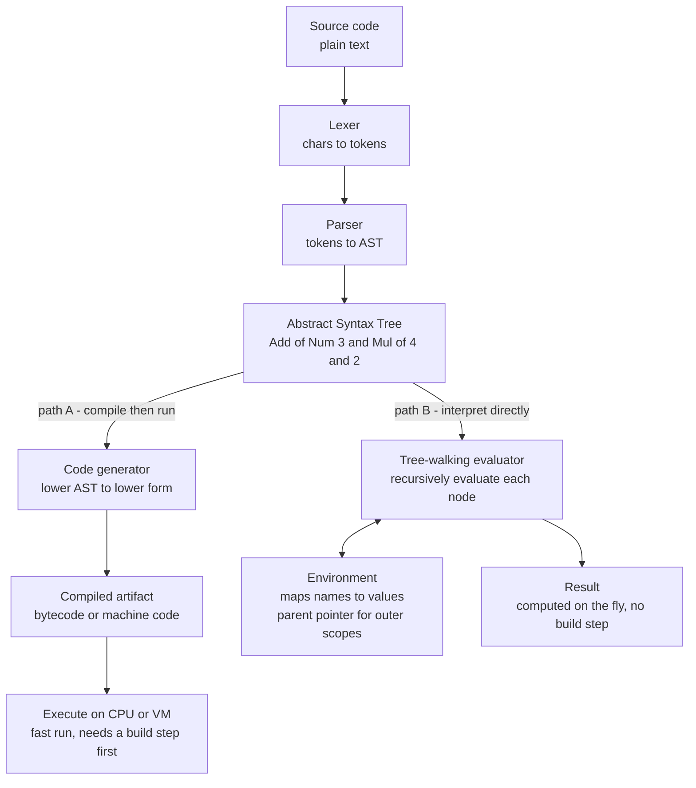

# 🌿 Interpreters and Tree Walking

> [!abstract] TL;DR
> An **interpreter** runs a program by *directly performing its actions* instead of first translating it to machine code. The simplest kind, a **tree-walking interpreter**, takes the **abstract syntax tree** produced by parsing and **recursively evaluates each node**: an `Add` node evaluates its two children and adds the results, a `While` node re-evaluates its body until its condition goes false, a `Var` node looks its name up in an **environment** mapping variables to values. It is the shortest path from source text to running behavior — you can build one in an afternoon — which is exactly why it is where nearly every language starts. The price is speed: pointer-chasing the tree and re-dispatching on every node makes tree-walkers typically **10x–100x slower** than compiled code, which is why serious implementations later graduate to **bytecode VMs** and **JIT** compilers. Compilation and interpretation are not opposites but two ends of one spectrum of *when* translation happens.

---

## Intuition

**Analogy — the translator who writes a book vs the interpreter at the conference.** A **compiler** is a book translator: you hand over the whole English manuscript, they disappear for a while, and they hand back a complete, polished Japanese edition. All the work happened *ahead of time*; afterward the reader flies through the finished book at full speed, and if a sentence was ungrammatical the translator caught it before printing.

An **interpreter** is the live human interpreter standing beside the speaker at a conference. There is no finished book — as each sentence is spoken, they translate and voice it *on the spot*, sentence by sentence, in real time. Nothing is produced ahead of time; the "output" is the act of speaking itself. It starts instantly with no build step, it adapts to whatever is said next, but each sentence carries the cost of being translated *the moment it is needed*, every single time it is said.

A **tree-walking interpreter** is that live interpreter reading from the program's *structure* rather than a flat script. Parsing has already organized the source into an **abstract syntax tree** — `3 + 4 * 2` becomes `Add(Num 3, Mul(Num 4, Num 2))`. To run the program, the interpreter **walks the tree and executes each node directly**: it evaluates `Add` by first evaluating its left child to `3`, then its right child (which is itself a `Mul` it must recurse into, getting `8`), then adding them to get `11`. Run the program by walking its tree — that is the whole idea.

---

## How It Works

### Core mechanics: recursively evaluate every node

A tree-walking interpreter is one recursive function, conventionally called `eval`, whose job is: *given an AST node and an environment, return the node's value (and perform its side effects)*. It dispatches on the node's type and knows one rule per construct:

1. **Literal / constant node** — `Num 42` evaluates to the number `42`. The base case: the value is right there in the node.
2. **Binary-operation node** — `BinOp("+", left, right)` first evaluates `left`, then evaluates `right`, then combines them with the operator. The recursion *is* the evaluation order; the tree's shape already encodes precedence, so no arithmetic re-parsing is needed.
3. **Variable reference** — `Var "x"` is a *lookup*: search the **environment** for the binding named `x` and return its value.
4. **Assignment** — `Assign("x", expr)` evaluates `expr`, then stores the result under `x` in the environment.
5. **Conditional** — `If(cond, then, else)` evaluates `cond`; if truthy it walks the `then` subtree, otherwise the `else` subtree. Only one branch is ever visited.
6. **Loop** — `While(cond, body)` re-evaluates `cond`; while truthy it walks `body` and loops. Control flow is just *re-walking a subtree*.
7. **Function definition** — evaluates to a **closure**: the parameter list, the body subtree, *and a pointer to the environment in which the function was defined* (this captured environment is what makes closures work).
8. **Function call** — evaluate the callee to a closure, evaluate the argument subtrees, create a **new environment** whose parent is the closure's captured environment, bind parameters to argument values, then walk the body. Recursion in the source language becomes recursion in `eval` itself.

This one-method-per-node-type structure is usually written with the **visitor / eval pattern** (see [[Abstract_Syntax_Trees_and_Parser_Design]]): a stable AST node hierarchy plus a walker that supplies a `visit_X` method for each node kind. Every tree-walking interpreter is fundamentally a specialized **post-order-ish traversal** (see [[Tree_Traversals]]) where "visiting" a node means *doing what it says*.

### Environments and closures — where variables live at runtime

An **environment** is the runtime data structure that maps variable names to values. Lexical (static) scoping is implemented as an **environment chain**: each scope holds its own bindings plus a pointer to its *enclosing* environment. A variable lookup walks *up* the chain — inner scopes shadow outer ones, and the global scope sits at the root.

A **closure** captures the environment where a function was *defined*, not where it is *called*. Because the interpreter stores that environment pointer inside the function value, an inner function can still read the outer function's variables long after the outer call has returned. This one design choice — "a function value carries its defining environment" — is the entire mechanism behind closures, currying, and much of functional programming, and it maps directly onto the substitution model of the [[Recursive_Functions_and_Lambda_Calculus|lambda calculus]].

### Compile-then-run vs interpret-directly

The AST is a fork in the road. From it you can take **path A (compile then run)** — lower the tree to bytecode or native code, save that artifact, and execute it later at full machine speed — or **path B (interpret directly)** — walk the tree right now and produce the answer with no intermediate artifact.



The trade is stark: **path A** pays a large up-front cost and detects many errors before running, then runs fast; **path B** starts instantly, is trivially portable (ship the source, run anywhere the interpreter runs), and gives you a REPL and rich runtime introspection for free, but re-does the interpretive work on every execution of every node.

### The spectrum of interpreters — from tree-walking to JIT

"Interpreter" is not one thing but a performance ladder that real languages climb:

- **Tree-walking interpreter** *(this note)* — execute the AST directly. Simplest to write, slowest to run. Great for prototypes, config languages, and teaching.
- **Bytecode interpreter / virtual machine** — first *compile* the AST once into a compact linear **bytecode** (a made-up instruction set), then loop over those instructions. Flattening the tree into an array removes pointer-chasing and gives far better locality and dispatch, typically several times faster. This is the model of CPython, Ruby's YARV, and Lua. *(Vault sibling: `Bytecode_and_Virtual_Machines`.)*
- **JIT compiler** — start by interpreting bytecode, **profile which code is hot**, then compile those hot paths to *native machine code at run time*, specializing on the types and values actually observed. This can *beat* an ahead-of-time compiler because it knows things static compilation could only guess. This is HotSpot for the [[JVM_Execution_Model|JVM]], V8 for JavaScript, and PyPy for Python. *(Vault sibling: `Just_In_Time_Compilation`.)*

CPython, Ruby, and early JavaScript engines all walked this exact path — from tree-walker to bytecode VM to JIT — as performance demands grew. *(Vault sibling: `Dynamic_Language_Implementation`.)*

---

## Key Concepts

### Secondary (intuition-level)
- **Interpret vs compile.** A compiler translates the *whole* program first and you run the result; an interpreter reads the program and *performs its actions* on the fly, with nothing saved in between.
- **Walk the tree, run the program.** The AST already holds the program's structure; executing a node means *doing what that node says* and recursing into its children.
- **Environment = the variable scoreboard.** A live table mapping each name in scope to its current value.
- **Instant start, slower run.** No build step means you can type a line and see it run immediately — the essence of a REPL — but each run redoes the interpretive work.

### Undergraduate (mechanism-level)
- **The `eval` function and dispatch.** One recursive function dispatching on node type; each node type has exactly one evaluation rule. This is the visitor / eval pattern over the AST.
- **Environment chains and lexical scoping.** Nested scopes as a linked list of frames; lookups walk outward; inner names shadow outer ones.
- **Closures capture their defining environment.** A function value bundles its body with the environment where it was created, so free variables resolve to the *definition* site, not the call site.
- **Control flow as re-traversal.** `if` picks one subtree to walk; `while` re-walks a subtree until a condition fails; a function call walks the body in a fresh child environment. Source-level recursion becomes recursion in `eval`.
- **Return, break, and continue as non-local exits.** Cleanest to implement as exceptions (or explicit signal values) that unwind the recursive walk to the right handler.
- **The progression to bytecode.** Once tree-walking is too slow, compile the AST once into a flat bytecode and interpret *that* — the standard next step.

### Graduate (design-tradeoff-level)
- **Why tree-walkers are slow — the mechanical reasons.** Every step chases a pointer to a heap-scattered node (no cache locality), pays a **dispatch** cost to decide the node's type, re-boxes/unboxes values, and re-does all of this on *every* re-execution of the same node. The interpreter's own control flow (the `eval` call tree) dominates over the useful work. Bytecode fixes locality and dispatch; JIT removes the per-instruction interpretation entirely for hot code.
- **Evaluation strategies.** **Eager / strict** (call-by-value) evaluates arguments before the call; **lazy** (call-by-need) defers evaluation until a value is demanded and memoizes it (Haskell); **call-by-name** re-evaluates on each use. These are choices in *when* `eval` recurses into an argument subtree, and they connect straight to reduction order in the [[Recursive_Functions_and_Lambda_Calculus|lambda calculus]].
- **Metacircular interpreters.** An interpreter for a language written *in that same language* (Lisp's `eval`/`apply`, the SICP metacircular evaluator). It lays bare that `eval` is the definitional heart of a language's semantics.
- **The Futamura projections — interpretation and compilation are one idea.** Partially evaluating (specializing) an interpreter with respect to a *fixed source program* yields a *compiled* version of that program; specializing the *specializer* itself yields a compiler; and specializing it once more yields a compiler-generator. The deep result: **a compiler is just an interpreter with the program baked in ahead of time.** *(Vault sibling: `The_Future_of_Compilers`.)*
- **Runtime representation choices.** Environments as hash maps (flexible, slow) vs pre-resolved slot indices / de Bruijn indices (fast, requires a resolution pass); tagged unions vs NaN-boxing for values; these choices are where a tree-walker recovers much of its lost speed before you even reach bytecode. *(Vault sibling: `Runtime_Systems_and_the_ABI`.)*

---

## Python Demo

Pure standard library for the interpreter (an AST of `dataclasses` plus an `Environment` with a parent chain), and `matplotlib` to visualize the interpretation overhead. The interpreter supports **arithmetic, variables and assignment, conditionals, a `while` loop, and user-defined functions with recursion**. We run a small program that computes a **factorial recursively** and a **sum via a while loop**, print the results, then **measure and plot** how a tree-walker's wall-clock time compares to a native (modeled "compiled") baseline — motivating why tree-walkers are simple but slow.

```python
"""
A TREE-WALKING INTERPRETER for a tiny imperative language, plus a measurement
of its interpretation overhead versus a native (modeled 'compiled') baseline.

Language features:
  - numbers, variables, assignment
  - binary arithmetic (+ - * /) and comparisons (< > == <=)
  - if / else
  - while
  - user-defined functions with recursion and closures (lexical scope)
  - print

Everything runs by recursively EVALUATING each AST node against an ENVIRONMENT.
Pure standard library + matplotlib.
"""

from __future__ import annotations
from dataclasses import dataclass, field
from typing import List, Optional
from time import perf_counter
import matplotlib.pyplot as plt

# ---------------------------------------------------------------------------
# AST node types -- the parser's output. We build trees by hand here.
# ---------------------------------------------------------------------------
@dataclass
class Num:    value: float
@dataclass
class Var:    name: str
@dataclass
class BinOp:  op: str; left: "Node"; right: "Node"
@dataclass
class Assign: name: str; expr: "Node"
@dataclass
class If:     cond: "Node"; then: "Node"; els: Optional["Node"]
@dataclass
class While:  cond: "Node"; body: "Node"
@dataclass
class Block:  stmts: List["Node"] = field(default_factory=list)
@dataclass
class FuncDef: name: str; params: List[str]; body: "Node"
@dataclass
class Call:    callee: str; args: List["Node"]
@dataclass
class Return:  expr: "Node"
@dataclass
class Print:   expr: "Node"

Node = object  # (structural union; kept loose for the demo)

# ---------------------------------------------------------------------------
# ENVIRONMENT: names -> values, with a parent pointer for lexical scoping.
# ---------------------------------------------------------------------------
class Environment:
    def __init__(self, parent: Optional["Environment"] = None):
        self.vars = {}
        self.parent = parent
    def define(self, name, value):        # bind in THIS scope
        self.vars[name] = value
    def get(self, name):                  # walk OUTWARD until found
        env = self
        while env is not None:
            if name in env.vars:
                return env.vars[name]
            env = env.parent
        raise NameError(f"undefined variable {name!r}")
    def assign(self, name, value):        # update nearest existing binding
        env = self
        while env is not None:
            if name in env.vars:
                env.vars[name] = value
                return
            env = env.parent
        self.vars[name] = value           # or create in current scope

# A function VALUE is a closure: params + body + the DEFINING environment.
@dataclass
class Closure:
    params: List[str]
    body: "Node"
    env: Environment

class ReturnSignal(Exception):            # non-local exit for `return`
    def __init__(self, value): self.value = value

# ---------------------------------------------------------------------------
# THE INTERPRETER: one recursive `eval` dispatching on node type.
# A global counter records how many nodes we DISPATCH ON -- the raw work
# a tree-walker does, and the source of its overhead.
# ---------------------------------------------------------------------------
DISPATCH = [0]

class Interpreter:
    def eval(self, node, env: Environment):
        DISPATCH[0] += 1                              # every node = one dispatch
        return getattr(self, "eval_" + type(node).__name__)(node, env)

    def eval_Num(self, n, env):    return n.value
    def eval_Var(self, n, env):    return env.get(n.name)

    def eval_BinOp(self, n, env):
        a = self.eval(n.left, env)                    # recurse into children
        b = self.eval(n.right, env)
        return {"+": a + b, "-": a - b, "*": a * b, "/": a / b,
                "<": a < b, ">": a > b, "==": a == b, "<=": a <= b}[n.op]

    def eval_Assign(self, n, env):
        env.assign(n.name, self.eval(n.expr, env)); return None

    def eval_If(self, n, env):
        if self.eval(n.cond, env):
            return self.eval(n.then, env)
        elif n.els is not None:
            return self.eval(n.els, env)

    def eval_While(self, n, env):
        while self.eval(n.cond, env):                 # re-walk the body subtree
            self.eval(n.body, env)

    def eval_Block(self, n, env):
        result = None
        for s in n.stmts:
            result = self.eval(s, env)
        return result

    def eval_FuncDef(self, n, env):
        env.define(n.name, Closure(n.params, n.body, env))   # capture env
        return None

    def eval_Call(self, n, env):
        fn = env.get(n.callee)
        args = [self.eval(a, env) for a in n.args]
        local = Environment(parent=fn.env)            # new scope over closure env
        for p, v in zip(fn.params, args):
            local.define(p, v)
        try:
            self.eval(fn.body, local)
        except ReturnSignal as r:
            return r.value
        return None

    def eval_Return(self, n, env):
        raise ReturnSignal(self.eval(n.expr, env))

    def eval_Print(self, n, env):
        print("  [program output]", self.eval(n.expr, env)); return None

# ---------------------------------------------------------------------------
# PROGRAM 1: recursive factorial + a while-loop sum. Built as an AST by hand.
#   func fact(k) { if (k <= 1) { return 1 } return k * fact(k - 1) }
#   print fact(10)
#   s = 0; i = 1; while (i <= 5) { s = s + i; i = i + 1 }; print s
# ---------------------------------------------------------------------------
fact_def = FuncDef("fact", ["k"], Block([
    If(BinOp("<=", Var("k"), Num(1)), Return(Num(1)), None),
    Return(BinOp("*", Var("k"), Call("fact", [BinOp("-", Var("k"), Num(1))]))),
]))

program = Block([
    fact_def,
    Print(Call("fact", [Num(10)])),
    Assign("s", Num(0)), Assign("i", Num(1)),
    While(BinOp("<=", Var("i"), Num(5)), Block([
        Assign("s", BinOp("+", Var("s"), Var("i"))),
        Assign("i", BinOp("+", Var("i"), Num(1))),
    ])),
    Print(Var("s")),
])

print("Running the tree-walking interpreter:")
Interpreter().eval(program, Environment())   # prints 3628800 and 15

# ---------------------------------------------------------------------------
# MEASURE THE OVERHEAD. A `while` loop that sums 1..N is our workload.
# We time the INTERPRETER against a NATIVE Python loop doing the same sum
# (our stand-in for 'compiled' code). We also record nodes dispatched.
# ---------------------------------------------------------------------------
def sum_program(N):
    return Block([
        Assign("s", Num(0)), Assign("i", Num(1)),
        While(BinOp("<=", Var("i"), Num(N)), Block([
            Assign("s", BinOp("+", Var("s"), Var("i"))),
            Assign("i", BinOp("+", Var("i"), Num(1))),
        ])),
    ])

def native_sum(N):                       # the 'compiled baseline'
    s, i = 0, 1
    while i <= N:
        s += i; i += 1
    return s

sizes = [2000, 4000, 8000, 16000, 32000, 64000]
interp_t, native_t, nodes = [], [], []
for N in sizes:
    prog = sum_program(N)
    DISPATCH[0] = 0
    t0 = perf_counter(); Interpreter().eval(prog, Environment()); t1 = perf_counter()
    interp_t.append(t1 - t0); nodes.append(DISPATCH[0])
    t0 = perf_counter(); native_sum(N); t1 = perf_counter()
    native_t.append(max(t1 - t0, 1e-9))

slowdown = [it / nt for it, nt in zip(interp_t, native_t)]
per_node_us = [it / nd * 1e6 for it, nd in zip(interp_t, nodes)]
print(f"\nNodes dispatched at N=64000: {nodes[-1]:,}")
print(f"Tree-walker slowdown vs native: {slowdown[-1]:.0f}x  "
      f"(~{per_node_us[-1]:.2f} microseconds per node dispatch)")

# ---------------------------------------------------------------------------
# VISUALIZE: (left) interpreter vs native runtime; (right) the slowdown factor.
# ---------------------------------------------------------------------------
fig, (ax1, ax2) = plt.subplots(1, 2, figsize=(12, 5))

ax1.plot(sizes, interp_t, "o-", color="#d62728", label="Tree-walking interpreter")
ax1.plot(sizes, native_t, "s-", color="#2ca02c", label="Native loop (compiled baseline)")
ax1.set_xscale("log"); ax1.set_yscale("log")
ax1.set_xlabel("Loop iterations N"); ax1.set_ylabel("Wall-clock time (s, log)")
ax1.set_title("Tree-walking is simple but slow"); ax1.legend(); ax1.grid(True, which="both", ls=":")

ax2.bar([str(s) for s in sizes], slowdown, color="#ff7f0e", edgecolor="black")
ax2.axhspan(10, 100, color="#cccccc", alpha=0.35, label="typical 10x-100x band")
ax2.set_xlabel("Loop iterations N"); ax2.set_ylabel("Slowdown factor (interp / native)")
ax2.set_title("Overhead: pointer-chasing + per-node dispatch"); ax2.legend()

plt.tight_layout()
plt.savefig("tree_walking_overhead.png", dpi=130)
print("Saved tree_walking_overhead.png")
```

**What to notice.** The interpreter really runs the language: `fact(10)` prints `3628800` and the while-loop sum prints `15`, all by recursively evaluating AST nodes against environments — recursion in the source becomes recursion in `eval`, and the closure captured by `fact` lets it call *itself*. The measurement then makes the cost visible: every iteration of the interpreted loop dispatches on a dozen-plus nodes (`While`, `BinOp`, `Var`, `Assign`, ...), each costing a Python method call, a dict lookup, and a pointer hop, so the tree-walker lands squarely in the classic **10x–100x slower** band versus the native loop. That gap is precisely the motivation for compiling the AST down to bytecode — the subject of the sibling `Bytecode_and_Virtual_Machines` note.

---

## Real-World Applications

> **Ruby's original MRI interpreter (pre-1.9) was a pure tree-walker.** Matz's Ruby Interpreter parsed source into an AST and walked it directly — beautifully simple, and slow. Ruby 1.9 replaced it with **YARV**, a bytecode virtual machine, for a large speedup, and later versions added a JIT (MJIT/YJIT). This is the canonical "tree-walker → bytecode VM → JIT" evolution playing out in one language.

Where tree-walking (and interpretation broadly) shows up:

- **Shells and glue.** Bash, Zsh, and PowerShell interpret scripts line by line — fast startup and immediate feedback matter far more than raw throughput for a shell.
- **Config languages and DSLs.** JSON logic engines, HCL (Terraform), and countless embedded rule/expression languages are tree-walked over a small AST because the workloads are tiny and simplicity wins. *(Vault sibling: `Domain_Specific_Languages`.)*
- **Spreadsheet formulas and template engines.** Excel/Sheets formula evaluation and templating systems (Jinja, Liquid, Handlebars) parse expressions to a tree and evaluate nodes against a data environment — exactly a tree-walker with a variable scope.
- **Embedded scripting.** Lua and Wren embed in games and apps; the AST/bytecode interpreter model gives a tiny, portable runtime with a live REPL.
- **Teaching and the reference semantics.** Robert Nystrom's *Crafting Interpreters* builds `jlox`, a tree-walking interpreter, as the first half of the book precisely because it is the clearest way to *define* a language before optimizing it into a bytecode VM (`clox`) in the second half.
- **CPython's front half.** CPython parses to an AST, then compiles that AST to bytecode and runs it on a stack VM — a step *past* pure tree-walking, but the AST-to-value mental model is identical. See [[Python_Internals]].

---

## Common Pitfalls

- **Confusing dynamic scope with lexical scope.** If a closure resolves free variables against the *caller's* environment instead of its *defining* environment, you have accidentally built dynamic scoping and closures break. The fix is structural: a function value must store the environment it was *created* in (as `Closure.env` does above).
- **Sharing one environment across recursive calls.** Every function call must get a *fresh* child environment; reusing a single frame means a recursive call clobbers its parent's parameters. Recursion in the source language demands a new scope per activation.
- **Implementing `return`/`break`/`continue` with flags.** Threading boolean "should I stop?" flags through every node is fragile. Non-local exits are cleanest as exceptions (or explicit control signals) that unwind the recursive walk to the enclosing handler.
- **Re-evaluating side-effecting subtrees.** In a naive `While` or short-circuit `and`/`or`, evaluating a condition or argument twice runs its side effects twice. Be deliberate about *how many times* and *in what order* each subtree is walked.
- **Assuming an interpreter is just a slow compiler.** It occupies a different point on the spectrum, with genuine wins compilers lack: instant startup, no build step, trivial portability, a REPL, and full runtime introspection for debugging. "Slower" is a per-workload judgment, not a verdict.
- **Skipping semantic analysis and pushing all errors to runtime.** A pure tree-walker can defer *every* check (undeclared names, arity, types) to evaluation time. That is flexible but gives late, per-execution error discovery; a resolution/[[Semantic_Analysis_and_Symbol_Tables|symbol-table]] pass before evaluation catches many bugs earlier and speeds up variable lookup.
- **Deep recursion blowing the host stack.** Because source recursion becomes host-language recursion in `eval`, a deeply recursive interpreted program can overflow the interpreter's own call stack. Real implementations bound recursion depth or trampoline/CPS-convert the evaluator.

---

## Related Concepts

- [[Compilers_Overview]] — situates interpretation on the AOT-compile / interpret / JIT spectrum; interpreters skip the code-generation back end and execute the AST or bytecode directly.
- [[Abstract_Syntax_Trees_and_Parser_Design]] — the AST is the exact structure a tree-walker walks; the visitor / eval pattern used here comes straight from that note.
- [[Semantic_Analysis_and_Symbol_Tables]] — name resolution and scope checking; a resolution pass turns slow environment-chain lookups into fast slot indices and moves errors before runtime.
- [[Type_Checking_and_Type_Systems]] — where a compiler catches type errors *before* running; a pure tree-walker often defers these to evaluation time.
- [[Intermediate_Representations]] — the flatter forms an AST is lowered into; bytecode is one such IR that the next rung of interpreters executes.
- [[Recursive_Functions_and_Lambda_Calculus]] — the theoretical core of evaluation: substitution, reduction order (eager vs lazy), and the semantics closures implement.
- [[Tree_Traversals]] — every AST walk is a specialized DFS; "visiting" a node here means executing it.
- [[Python_Internals]] — CPython as a concrete parse-to-AST-to-bytecode-then-interpret pipeline, one step past pure tree-walking.
- [[JVM_Execution_Model]] — a production bytecode-plus-JIT runtime, the destination languages reach after outgrowing tree-walking.

Not-yet-written Compilers siblings this note anticipates: `Bytecode_and_Virtual_Machines`, `Just_In_Time_Compilation`, `Dynamic_Language_Implementation`, `Runtime_Systems_and_the_ABI`, `Domain_Specific_Languages`, and `The_Future_of_Compilers`.

---

## Review Questions

1. **(Conceptual)** Using the live-conference-interpreter analogy, explain why a tree-walking interpreter re-does work on every execution of a node while a compiler does that work once. Then name two concrete mechanical reasons a tree-walker is 10x–100x slower than compiled code, and say which one bytecode fixes and which one only a JIT removes.
2. **(Scenario)** You are adding a small expression/rule language to a product: users type formulas that run occasionally against changing data, and they need instant feedback and a REPL. Would you build a tree-walking interpreter, a bytecode VM, or an AOT compiler? Justify the choice in terms of startup latency, implementation effort, portability, and throughput — and state the condition under which you would later switch.
3. **(Trade-off)** Explain how the same AST node type — say a function definition — is handled by (a) a tree-walking interpreter, (b) a bytecode compiler, and (c) a JIT. Then connect the Futamura projections to your answer: in what precise sense is a compiler "an interpreter with the program baked in ahead of time"?

---

## Sources

- Nystrom, R. *Crafting Interpreters*. Genever Benning, 2021 — builds `jlox`, a full tree-walking interpreter (Part II), then a bytecode VM ([craftinginterpreters.com](https://craftinginterpreters.com)).
- Abelson, H., Sussman, G. *Structure and Interpretation of Computer Programs*, 2nd ed. MIT Press — the metacircular evaluator and the eval/apply core of interpretation ([sicp full text](https://mitpress.mit.edu/9780262510875/structure-and-interpretation-of-computer-programs/)).
- Aho, Lam, Sethi, Ullman. *Compilers: Principles, Techniques, and Tools*, 2nd ed. ("The Dragon Book"), ch. 1 & 6 — compilers vs interpreters and syntax-directed evaluation.
- Futamura, Y. "Partial Evaluation of Computation Process — An Approach to a Compiler-Compiler." *Higher-Order and Symbolic Computation*, 12(4), 1999 (reprint) — the projections linking interpreters and compilers.
- Ball, T. *Writing an Interpreter in Go*. 2016 — a modern, hands-on tree-walking interpreter with environments and closures ([interpreterbook.com](https://interpreterbook.com)).

---

#compilers #interpreters #tree-walking #ast-evaluation #interpretation
