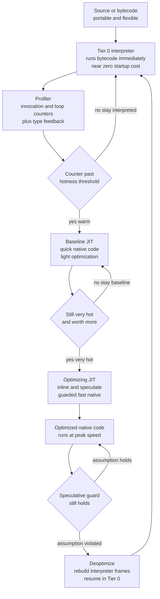

# ⚡ Just-In-Time Compilation

> [!abstract] TL;DR
> **Just-In-Time (JIT) compilation** translates a program to native machine code *while it is running*, instead of entirely ahead of time. It exists to resolve a genuine dilemma: an **ahead-of-time (AOT)** compiler produces fast code but is blind to how the program actually behaves and what real data it sees; an **interpreter** is portable and flexible but slow. A JIT gets *both* by starting execution in an interpreter or quick baseline compiler, **profiling** at run time to discover the small set of **hot** methods and loops where nearly all time is spent, then **compiling just those** to aggressively optimized native code — specialized using facts only visible at run time, like "this variable is always an integer" or "this call site always hits one type." Because those facts are *speculative*, the JIT installs cheap **guards** and, when a guard fails, safely **deoptimizes** back to the interpreter. The price is **warmup**: the JIT spends compile time during execution, hurting startup latency and short-lived programs — the central tension between peak throughput and fast start that drives everything from HotSpot's tiers to GraalVM native images.

---

## Intuition

**Analogy — the factory that automates only the motions it sees repeated a thousand times.** Imagine you open a small workshop that has to fill a stream of customer orders. On day one you have no specialized machinery, so every order is done *by hand* following the written instructions. This is slow per item, but it is safe and flexible: you can handle any order that walks in, and you needed zero setup to open the doors. That is the **interpreter** — immediate start, universal, but slow on each execution.

Now, the naive alternative is to build a fully automated assembly line for *every conceivable step* before opening — that is **ahead-of-time compilation**. It runs fast once built, but you paid enormous setup cost up front, you had to guess which products customers would actually order, and you couldn't tailor a machine to the fact that "99% of orders are the blue size-medium variant" because you didn't know that yet.

The JIT is the clever middle path a real factory manager would take. **Open the doors doing everything by hand, but watch.** Keep a tally on the wall of which exact motion gets repeated — and the moment you notice that "attach the left bracket" has been done ten thousand times today, you stop and *build a dedicated jig* for just that one motion. You even specialize the jig to what you have *observed*: since every bracket so far has been the standard aluminum one, you build a jig that only handles aluminum — with a quick sensor that beeps if a titanium bracket ever shows up, at which point you fall back to doing it by hand. You never waste effort automating the motions done twice. You automate the hot ones, tuned to reality, and you keep a safety fallback. That watching-then-specializing loop, applied to machine code at run time, is **just-in-time compilation**.

---

## How It Works

### Core mechanics

A JIT is fundamentally a feedback loop bolted onto an interpreter or bytecode VM. It never runs the program in only one mode; it *migrates* code between execution tiers based on measured behavior. This note assumes you have met the machinery it builds on — the bytecode virtual machine that supplies the interpreter and portable instruction stream (forthcoming sibling `Bytecode_and_Virtual_Machines`), the tree-walking and bytecode interpreters it starts from (forthcoming `Interpreters_and_Tree_Walking`), and the run-time profiling it depends on (forthcoming `Profile_Guided_and_Adaptive_Optimization`). See [[Compilers_Overview]] for where JIT sits relative to the classic AOT pipeline.

**1. Start by executing, not compiling.** Execution begins immediately in a **Tier 0 interpreter** (or a very quick baseline compiler). There is essentially no startup delay — the VM can begin running bytecode the instant it is loaded, exactly like an interpreter. This is what lets a JITed language boot as fast as a scripting language even though it will end up as fast as native code.

**2. Profile to find the hot spots.** While interpreting, the runtime cheaply gathers profile data: **invocation counters** per method, **back-edge counters** per loop (loops are counted separately because a single long-running loop can dominate time without the enclosing method being called often), and **type feedback** at call sites and field accesses recording which concrete types actually flowed through. This rests on the **hot-spot principle** — the same 90/10 empirical fact behind [[Loop_Optimizations]] — that the overwhelming majority of run time is spent in a tiny fraction of the code. You do not need to compile everything; you need to find *that fraction*. Profiling is done by counters or by **sampling** (periodically interrupting to see where the program counter is), trading precision for overhead.

**3. Compile the hot code to optimized native.** When a counter crosses a **hotness threshold**, the JIT compiles that method (or loop) to native machine code, running the standard middle-end optimizations — inlining, [[Local_and_Global_Optimizations|constant folding and global value numbering]], the [[Loop_Optimizations|loop transforms]] — but now armed with the profile. From then on, calls dispatch to the native code instead of the interpreter. The compiled code is stored in a **code cache**.

**4. Tiered compilation — trade compile time for code quality.** Rather than one JIT, production VMs use **multiple tiers**, each a different point on the compile-time-versus-code-quality curve. A **quick baseline JIT** compiles fast to mediocre code (get *some* speedup, keep collecting profile); an **aggressive optimizing JIT** spends far more time to produce the best native code, reserved for the very hottest methods. Java's **HotSpot** uses the interpreter → **C1** (client, fast) → **C2** (server, optimizing) progression; V8 for JavaScript uses **Ignition** interpreter → **Sparkplug** baseline → **Maglev** mid-tier → **TurboFan** optimizer. Code climbs the tiers as it proves itself hot, which is why performance *ramps up* over the first seconds of a run — the **warmup progression**.

**5. Speculative / adaptive optimization — the JIT superpower.** This is the payoff a static compiler can never match. Using the recorded type feedback, the optimizing JIT makes **optimistic assumptions**: "this variable is always an `int`," "this virtual call is **monomorphic** — it always resolves to one class, so I can replace the dynamic dispatch with a direct call and **inline** the callee," "this branch is never taken," "this field is never null." It then emits *specialized* fast code under those assumptions and installs a cheap **guard** that checks the assumption still holds. **Inline caches** remember the last-seen type at a call site so the common case skips the full method lookup. This is how JITs make [[Local_and_Global_Optimizations|inlining]] pay off across dynamic dispatch — the biggest single win for dynamic languages (forthcoming `Dynamic_Language_Implementation`).

**6. Deoptimization — what makes aggressive speculation safe.** A speculative assumption *will* eventually be violated: a call site that was monomorphic for a million calls suddenly sees a second type, or a value that was always `int` becomes a `float`. When a guard fails, the JIT performs **deoptimization**: it bails out of the native code and reconstructs the exact interpreter state — rebuilding the interpreter's stack frames and local variables from the optimized frame — so execution can *safely resume in the Tier 0 interpreter* as if the fast code had never run. This is **on-stack replacement in reverse**. The forward version, **OSR (on-stack replacement)**, is equally important: it lets the VM *enter* freshly-JITed code in the **middle** of a still-running long loop, rather than waiting for the next method call — essential for a program stuck in one giant hot loop. Deoptimization interacts intimately with the [[Runtime_Systems_and_the_ABI|runtime and stack-frame layout]], because the JIT must be able to materialize a valid interpreter frame at every guard.

**7. Warmup, caches, and recompilation.** Because the JIT spends compile time *during* execution, a program pays a **warmup penalty** before reaching peak speed — bad for short-lived processes and startup-latency-sensitive services. The **code cache** is finite and must be managed (evicting or recompiling); code that deoptimizes may be **recompiled** with the failed assumption removed, and repeatedly-deopting code may be left interpreted. To avoid warmup entirely, some systems compile ahead of time into a **native image** (GraalVM) — trading peak throughput and the JIT's runtime specialization for instant startup.

### Flow / Architecture



*The loop is the whole idea: code circulates between the interpreter, the baseline JIT, and the optimizing JIT under the control of the profiler, and any speculative guard failure short-circuits straight back to the safe interpreter via deoptimization.*

---

## Key Concepts

### Secondary (intuitive, no CS background needed)
- **Interpret first, watch, then specialize** — start doing everything the slow-but-flexible way, keep a tally of what repeats, and build a fast dedicated machine only for the motions repeated thousands of times.
- **Hot spots** — nearly all the time is spent in a tiny bit of the code; find that bit instead of speeding up everything.
- **Warmup** — a JITed program is *slow for its first moments* while it learns and builds fast code, then gets fast; a program that only runs briefly never gets to enjoy the speedup.
- **Optimistic assumption with a safety net** — build a machine that assumes the common case and beeps to fall back to hand-work if something unexpected shows up (guard and deoptimization).

### Undergraduate (mechanism)
- **AOT vs interpret vs JIT** — the three-way tradeoff: AOT is fast but blind to run-time behavior and slow to build; interpretation is instant and portable but slow per execution; JIT blends them, buying fast steady-state *and* run-time information at the cost of warmup.
- **Profiling** — invocation counters, loop back-edge counters, and type feedback; counter-based vs sampling-based, and why loops need their own counters.
- **Hotness threshold** — the call/iteration count that triggers compilation; the knob trading warmup speed against wasted compilation of not-actually-hot code.
- **Tiered compilation** — interpreter → baseline JIT → optimizing JIT; each tier a different compile-time/code-quality point, with code promoted as it proves hot.
- **Inlining and inline caches** — replacing a hot call with the callee's body, and caching the resolved type at a call site so the common path is a cheap type check plus direct call.
- **Code cache** — the region of executable memory holding compiled methods, and why it must be sized and managed.

### Graduate (theory and frontiers)
- **Speculative / adaptive optimization** — monomorphic-vs-polymorphic dispatch, class-hierarchy analysis, guarded devirtualization, branch and value speculation, and how observed types drive specialization a static compiler cannot perform.
- **Deoptimization and OSR** — reconstructing interpreter state from an optimized frame (deopt), and on-stack replacement to *enter* JITed code mid-loop; the metadata (scope descriptors, deopt tables) the JIT must emit at every safepoint to make this possible.
- **Method-based vs trace-based JITs** — compile a whole hot *method* (HotSpot, V8, RyuJIT) versus compile a hot *execution trace / path* through possibly many methods (TraceMonkey, LuaJIT's trace compiler, PyPy's **meta-tracing**). Traces give great straight-line specialization and cross-method inlining for free but suffer on unpredictable, branchy control flow ("trace explosion"); methods are more robust but coarser.
- **Warmup vs peak vs footprint** — the multi-objective optimization behind tier policies; why serverless and CLI tools favor AOT/native-image (GraalVM, CRaC, checkpoint-restore) while long-running servers favor an aggressive JIT.
- **JIT as online PGO** — a JIT is **profile-guided optimization performed continuously at run time**; the offline analog is AOT PGO where an instrumented run produces a profile fed back into a static compile (forthcoming `Profile_Guided_and_Adaptive_Optimization`). The JIT's advantage is *fresh, phase-aware* profiles; its cost is doing the work on the critical path.
- **Security and complexity** — a JIT writes executable code at run time, breaking simple **W^X** (write-xor-execute) memory hygiene and enabling **JIT-spraying** attacks; mitigations include dual-mapped code pages, constant blinding, and control-flow integrity. JITs are also enormous, bug-prone artifacts with high memory cost for the code cache.

---

## Python Demo

We cannot emit real machine code from Python, but we can build a faithful *model* of the thing that actually matters for a JIT: **tiered execution and warmup economics**. The demo below simulates a program as a stream of method calls with highly skewed frequencies (the hot-spot principle). A **pure interpreter** pays a fixed slow cost on every call. A **JIT** counts calls per method; once a method crosses a **hotness threshold**, it pays a one-time **compile cost** and every later call runs cheaply as "native." We plot **cumulative execution time** for interpreter vs JIT to expose the JIT's early **warmup penalty** and its **crossover** into a faster steady state — then sweep the threshold to show it trading warmup against peak.

```python
"""
A model of JIT TIERED EXECUTION and WARMUP economics.

  - Workload: a stream of method calls with Zipf-skewed frequencies -- a few
    HOT methods dominate (the hot-spot principle).
  - Interpreter: every call costs a fixed slow INTERP_COST. No warmup, no peak.
  - JIT: counts calls per method; when a method's count crosses the HOTNESS
    THRESHOLD it pays a one-time COMPILE_COST, then every later call runs at the
    cheap NATIVE_COST. This is the warmup penalty followed by a steady-state win.

We plot CUMULATIVE time (interpreter vs JIT) to show the warmup hump and the
crossover, then sweep the threshold to reveal the warmup-vs-peak tradeoff:
too LOW over-compiles lukewarm code that never repays its compile cost; too HIGH
leaves hot code interpreted for too long.

Pure standard library + matplotlib (no numpy required).  Run: python jit_warmup.py
"""

import random
import matplotlib.pyplot as plt

# --- abstract cost model (time units) -----------------------------------
INTERP_COST  = 100     # run a method body once via the interpreter
NATIVE_COST  = 8       # run the same body once as JIT-compiled native code
COMPILE_COST = 5000    # one-time cost to JIT-compile a method (the warmup hit)
SAVING = INTERP_COST - NATIVE_COST                 # saved per call after compiling
BREAKEVEN = COMPILE_COST / SAVING                  # native calls needed to repay a compile

# --- synthetic workload: skewed call frequencies (a few methods are hot) --
N_METHODS = 200
N_CALLS   = 100_000
ZIPF_S    = 1.2

random.seed(7)
ranks   = list(range(1, N_METHODS + 1))
weights = [1.0 / r ** ZIPF_S for r in ranks]       # method 1 hottest, long cold tail
trace   = random.choices(ranks, weights=weights, k=N_CALLS)   # the call stream

def run_interpreter(calls):
    """Fixed slow cost per call -- a flat cumulative slope, no warmup, no peak."""
    t, cum = 0, []
    for _ in calls:
        t += INTERP_COST
        cum.append(t)
    return cum

def run_jit(calls, threshold):
    """Compile a method once its call count crosses `threshold`, then run native.
    Returns cumulative time, number of compiles, and the first crossover event."""
    count, compiled = {}, set()
    t, cum, n_compiles, crossover = 0, [], 0, None
    for i, m in enumerate(calls):
        count[m] = count.get(m, 0) + 1
        if m in compiled:
            t += NATIVE_COST                              # steady state: fast native
        elif count[m] >= threshold:
            t += INTERP_COST + COMPILE_COST               # interpret + one-time compile
            compiled.add(m)
            n_compiles += 1
        else:
            t += INTERP_COST                              # still cold: interpret
        cum.append(t)
        if crossover is None and t < (i + 1) * INTERP_COST:
            crossover = i                                 # JIT total dips below interpreter
    return cum, n_compiles, crossover

# --- run the models ------------------------------------------------------
interp_cum = run_interpreter(trace)
fast_cum, nf, xf = run_jit(trace, threshold=50)     # aggressive: compiles early
slow_cum, ns, xs = run_jit(trace, threshold=500)    # conservative: compiles late

print(f"compile repays after {BREAKEVEN:.0f} native calls\n")
print(f"pure interpreter total : {interp_cum[-1]:>12,}")
print(f"JIT threshold=50       : {fast_cum[-1]:>12,}   "
      f"compiles={nf:3d}   crossover at call {xf:,}")
print(f"JIT threshold=500      : {slow_cum[-1]:>12,}   "
      f"compiles={ns:3d}   crossover at call {xs:,}")

# --- threshold sweep: the warmup-vs-peak tradeoff ------------------------
thresholds = [5, 10, 20, 50, 100, 200, 500, 1000, 2000, 5000]
totals, compiles = [], []
for T in thresholds:
    cum, nc, _ = run_jit(trace, T)
    totals.append(cum[-1])
    compiles.append(nc)
best = min(range(len(thresholds)), key=lambda k: totals[k])

# --- visualize -----------------------------------------------------------
fig, (axL, axR) = plt.subplots(1, 2, figsize=(13.5, 5.4))

# left: cumulative time -- warmup penalty, then crossover to a faster slope
axL.plot(interp_cum, color="#c0392b", lw=2.2, label="pure interpreter (flat slow slope)")
axL.plot(fast_cum,   color="#1f77b4", lw=2.0, label="JIT threshold=50 (fast warmup)")
axL.plot(slow_cum,   color="#2ca02c", lw=2.0, label="JIT threshold=500 (slow warmup)")
if xf is not None:
    axL.axvline(xf, ls=":", color="#1f77b4", alpha=0.7)
    axL.annotate("crossover: JIT\novertakes interpreter",
                 xy=(xf, fast_cum[xf]),
                 xytext=(xf + N_CALLS * 0.15, fast_cum[xf] * 0.55),
                 fontsize=8, color="#1f77b4",
                 arrowprops=dict(arrowstyle="->", color="#1f77b4"))
axL.set_title("Cumulative execution time:\nwarmup penalty, then steady-state win")
axL.set_xlabel("execution event  (method call number)")
axL.set_ylabel("cumulative time units")
axL.legend(loc="upper left", fontsize=8)
axL.grid(alpha=0.3)

# zoomed inset on the early warmup hump (JIT briefly ABOVE the interpreter)
zoom = 4000
axins = axL.inset_axes([0.50, 0.10, 0.46, 0.40])
axins.plot(range(zoom), interp_cum[:zoom], color="#c0392b", lw=1.5)
axins.plot(range(zoom), fast_cum[:zoom],   color="#1f77b4", lw=1.5)
axins.set_title("early warmup: compile spikes\npush JIT above interpreter", fontsize=7)
axins.tick_params(labelsize=6)
axins.grid(alpha=0.3)

# right: threshold sweep -- U-shaped tradeoff
axR.plot(thresholds, totals, "o-", color="#8e44ad", lw=2.0)
axR.axhline(interp_cum[-1], ls="--", color="#c0392b", alpha=0.7,
            label="pure interpreter baseline")
axR.scatter([thresholds[best]], [totals[best]], s=150, zorder=5,
            color="#f39c12", edgecolor="black",
            label=f"best threshold = {thresholds[best]}")
axR.set_xscale("log")
axR.set_title("Threshold tradeoff:\ntoo low over-compiles, too high interprets too long")
axR.set_xlabel("hotness threshold  (calls before compiling)  [log scale]")
axR.set_ylabel("total execution time units")
axR.legend(fontsize=8)
axR.grid(alpha=0.3, which="both")

plt.tight_layout()
plt.savefig("jit_warmup.png", dpi=130)
print("\nSaved visualization to jit_warmup.png")
```

Running it prints something like:

```
compile repays after 54 native calls

pure interpreter total :   10,000,000
JIT threshold=50       :    1,7xx,xxx   compiles=1xx   crossover at call    ~9xx
JIT threshold=500      :    1,6xx,xxx   compiles= 6x   crossover at call  ~5,xxx
```

The left panel shows the essential JIT signature. Both curves start on the *same* flat interpreter slope; the moment methods begin crossing the threshold, the JIT curve takes **compile-cost spikes** that briefly push it *above* the pure interpreter — the **warmup penalty**, magnified in the inset. But each compiled hot method then accrues savings on every subsequent call, bending the JIT curve to a much shallower slope until it **crosses below** the interpreter and stays there. The aggressive threshold (50) warms up sooner but wastes compile cost on lukewarm methods; the conservative threshold (500) warms up later but is leaner. The right panel makes the tradeoff explicit: sweeping the threshold produces a **U-shape** — too *low* and you pay 5000 to compile methods that never accumulate the ~54 native calls needed to repay it; too *high* and your genuinely hot code runs interpreted far too long. Real VMs tune exactly this knob, per tier, which is why HotSpot's `-XX:CompileThreshold` and V8's tier-up heuristics are performance-critical.

---

## Real-World Applications

> **The JVM HotSpot VM** is the canonical tiered JIT: an interpreter (Tier 0) gathers profiles, the **C1** client compiler (Tiers 1–3) produces quick code while still profiling, and the **C2** server compiler (Tier 4) applies aggressive inlining, escape analysis, and speculative devirtualization to the hottest methods. Deoptimization and OSR let it speculate boldly yet stay correct. This is why Java routinely *matches C++ after warmup* — and why every serious Java benchmark must discard warmup iterations (JMH exists precisely for this). See [[JIT_Compilation]] and [[JIT_Compilation_and_Tuning]].

> **V8** powers Chrome and Node.js and makes dynamically-typed JavaScript fast. It runs **Ignition** (bytecode interpreter) → **Sparkplug** (fast baseline) → **Maglev** (mid-tier) → **TurboFan** (optimizing), leaning heavily on **inline caches** and **hidden classes / shapes** to turn "a property access on an object of unknown type" into a monomorphic, inlined field load — the single biggest source of JS speed. A "shape change" triggers deoptimization back down the tiers.

> **PyPy** replaces CPython with a **meta-tracing** JIT: rather than tracing the *user's* Python, it traces the *interpreter loop* executing the user's program, then specializes it — automatically deriving a JIT for the language from its interpreter. It routinely runs pure-Python workloads several times faster than CPython. Trace-based **LuaJIT** and Mozilla's historical **TraceMonkey** used the same "compile hot execution traces" philosophy.

> **CPython 3.13's experimental JIT** adds a **copy-and-patch** micro-op JIT on top of the new Tier-2 interpreter — a pragmatic, low-complexity design that stitches together pre-compiled machine-code templates for bytecode micro-ops, aiming to speed up hot loops without the engineering weight of a full optimizing compiler. See [[Python_Internals]].

> **.NET RyuJIT** JIT-compiles CIL to native on first method call (with tiered compilation and dynamic PGO added in modern .NET), while **GraalVM** offers *both* a top-tier JIT for the JVM and a **native-image** AOT mode that compiles ahead of time to eliminate warmup entirely — the explicit "peak throughput vs instant startup" fork that matters enormously for serverless and CLI tools.

---

## Common Pitfalls

- **Benchmarking without warmup.** Measuring a JITed program's first few iterations captures the interpreter and compile cost, not steady-state speed — the most common performance-measurement mistake in Java/JS/.NET. Always warm up and discard early samples, or use a harness (JMH) that does.
- **Assuming AOT is always faster.** AOT wins on *startup* but *loses the JIT's run-time specialization*: it cannot devirtualize based on observed types, cannot speculate on values it never saw, and cannot re-profile across program phases. For long-running throughput workloads a good JIT frequently beats naive AOT.
- **Megamorphic call sites destroying inlining.** A call site that stays monomorphic (one type) is inlined and fast; one that sees many types goes **megamorphic**, the inline cache degrades to a full lookup, and the JIT stops inlining — a common silent regression when a hot interface has too many implementations flowing through one site.
- **Deopt storms.** Code that repeatedly deoptimizes — speculating, failing a guard, deoptimizing, recompiling, failing again — can be *slower* than never compiling at all. It usually signals genuinely unstable behavior (e.g., a value oscillating between `int` and `float`); the fix is to stabilize the types, not to blame the JIT.
- **Sizing the code cache wrong.** A full code cache stops the JIT from compiling *anything more*, silently pinning hot new code to the interpreter. Large, long-lived apps must monitor and size the code cache (HotSpot's `ReservedCodeCacheSize`).
- **Short-lived processes paying pure warmup.** CLI tools, serverless functions, and CI jobs that run for a fraction of a second may never reach the crossover — they pay the JIT's compile overhead and reap none of the steady-state benefit. This is the entire motivation for native-image AOT and checkpoint/restore (CRaC, snapshotting).
- **Ignoring the security surface.** JITs write executable memory at run time and are a classic target for **JIT-spraying**; disabling protections for "performance" or shipping a JIT in a hardened sandbox without W^X mitigations is a real exploit risk.

---

## Related Concepts

- [[Compilers_Overview]] — the AOT pipeline a JIT is defined *against*; JIT moves the back-end code generation from build time to run time.
- [[Loop_Optimizations]] — the hot-spot 90/10 principle a JIT relies on to know *what* to compile, and the loop transforms it applies (with OSR to enter hot loops mid-flight).
- [[Local_and_Global_Optimizations]] — the middle-end optimizations (inlining, constant folding, GVN, dead-code elimination) the optimizing tier runs, now profile-driven.
- [[Runtime_Systems_and_the_ABI]] — deoptimization must materialize valid interpreter stack frames, and JITed code must honor the platform ABI to call libraries and the OS.
- [[Intermediate_Representations]] — JITs lower bytecode into an SSA-based IR (HotSpot's sea-of-nodes, V8's TurboFan graph) before optimizing.
- [[Static_Single_Assignment_Form]] — the IR form virtually every optimizing JIT uses internally to make its analyses cheap.
- [[Control_Flow_and_Data_Flow_Analysis]] — the analyses (dominators, liveness, reaching definitions) that JIT optimization and deopt-metadata generation rest on.
- [[JIT_Compilation]] — the JVM-specific companion: HotSpot C1/C2 tiers, compile thresholds, and warmup from the Java side.
- [[JIT_Compilation_and_Tuning]] — practical HotSpot tuning of tiers, code cache, and inlining knobs.
- [[Bytecode_and_JVM]] — the portable bytecode and interpreter the JVM JIT starts from and compiles up from.
- [[GraalVM_and_Native_Image]] — the AOT alternative that trades JIT specialization for zero warmup.
- [[Python_Internals]] — CPython's interpreter and the new 3.13 copy-and-patch JIT.

*(Forthcoming Compilers siblings referenced in prose until created: `Bytecode_and_Virtual_Machines`, `Interpreters_and_Tree_Walking`, `Dynamic_Language_Implementation`, `Profile_Guided_and_Adaptive_Optimization`.)*

---

## Review Questions

1. **(Secondary/Conceptual)** Explain, using the factory analogy, why a JIT *starts by interpreting* instead of compiling everything up front, and why it only compiles a small fraction of the code. Then describe in plain terms what "warmup" is and why a program that runs for only a fraction of a second might be *slower* with a JIT than with a plain interpreter.
2. **(Undergraduate/Scenario)** A hot method contains a virtual call `shape.area()`. Profiling shows that for the first ten million calls `shape` is always a `Circle`. Describe precisely what the optimizing JIT does with this observation — name the specialization (devirtualization, inlining, the guard) — and then describe exactly what happens, step by step, the first time a `Square` flows through that call site. Which mechanism keeps this correct, and what is the cost if `Circle` and `Square` keep alternating?
3. **(Graduate/Trade-off)** You are choosing an execution strategy for two deployments of the same service: (a) a long-running throughput-critical API server, and (b) a serverless function invoked briefly and unpredictably. Using the model that a compile costs a fixed amount and repays itself only after enough native executions, argue which of AOT native-image, a conservative-threshold JIT, and an aggressive-threshold JIT you would pick for each, and why. Then explain how *trace-based* versus *method-based* JIT design would change your reasoning for a workload dominated by one enormous, branchy hot loop.

---

## Sources

- Aycock, J. "A Brief History of Just-in-Time." *ACM Computing Surveys*, 35(2), 2003 — the standard survey of JIT history and techniques. https://doi.org/10.1145/857076.857077
- Paleczny, M., Vick, C., Click, C. "The Java HotSpot Server Compiler." *USENIX JVM Symposium*, 2001 — HotSpot C2, deoptimization, and speculative optimization. https://www.usenix.org/legacy/events/jvm01/full_papers/paleczny/paleczny.pdf
- Hölzle, U., Chambers, C., Ungar, D. "Debugging Optimized Code with Dynamic Deoptimization" (PLDI 1992) and "Optimizing Dynamically-Typed Object-Oriented Languages with Polymorphic Inline Caches" (ECOOP 1991) — the origins of deoptimization and inline caches in the SELF project. https://dl.acm.org/doi/10.1145/143095.143114
- Bolz, C. F., Cuni, A., Fijalkowski, M., Rigo, A. "Tracing the Meta-Level: PyPy's Tracing JIT Compiler." *ICOOOLPS*, 2009 — meta-tracing and trace-based JIT design. https://doi.org/10.1145/1565824.1565827
- V8 team, "Ignition, Sparkplug, Maglev, and TurboFan" and "Launching Ignition and TurboFan" — the V8 JavaScript engine's tiered pipeline. https://v8.dev/blog/launching-ignition-and-turbofan

---

#compilers #jit #just-in-time #tiered-compilation #deoptimization
