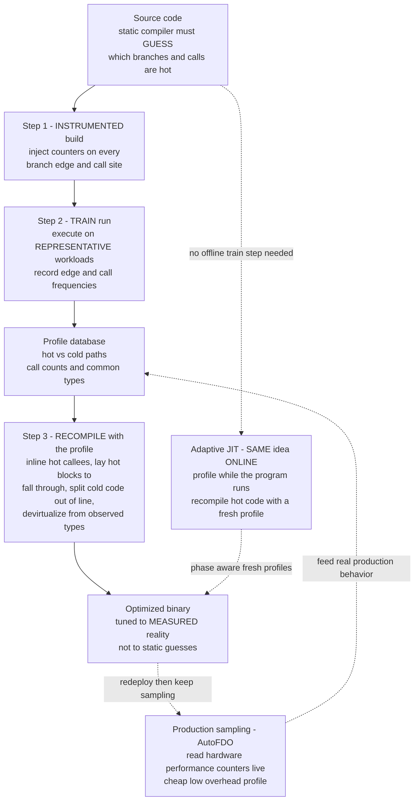

# 📊 Profile-Guided and Adaptive Optimization

> [!abstract] TL;DR
> A static (ahead-of-time) compiler is forced to **guess** the answers to the questions that matter most for fast code — *which branch is usually taken, which call is hot, which type actually flows through this virtual dispatch, how many times does this loop really run* — and, lacking a crystal ball, it guesses from crude static heuristics that are frequently wrong. **Profile-guided optimization (PGO)**, also called **feedback-directed optimization (FDO)**, replaces the guess with a **measurement**: build an **instrumented** binary that counts branches and calls, **run it on representative workloads** to collect a **profile**, then **recompile** using that profile to inline the genuinely hot callees, lay hot basic blocks out to *fall through* while shoving cold code out of line, hint branches, favor hot regions in register allocation, and devirtualize from observed types. **Adaptive optimization** is the *online* form of the same philosophy — a **JIT** profiles continuously as the program runs and recompiles hot code with a *fresh* profile, adapting to workload and phase changes. The unifying maxim is **measure, then optimize**; the recurring danger is an **unrepresentative or stale profile** that optimizes hard for a reality that never arrives — and can leave the program *slower than no PGO at all*.

---

## Intuition

**Analogy — the city planner who watches the traffic before widening the roads.** Imagine a planner handed a fresh street map and a budget to reduce congestion. A *naive* planner optimizes **blind**: they widen roads that merely *look* important on the map — the ones drawn thickest, the ones near the center — and they add turning lanes wherever an intersection has many arms. Some of those guesses help; many waste the entire budget widening a scenic lane nobody drives while the actual rush-hour artery stays a single choked lane. This is a static compiler guessing branch weights from syntax: "a loop back-edge is probably hot, an `if` is probably fifty-fifty, an error handler is probably rare" — reasonable priors that are often flatly wrong for *this* program on *this* data.

A **profile-guided** planner does something the blind planner cannot: they install traffic counters for a week and **watch reality**. Now they *know* which routes carry ninety-nine percent of the cars, which turns are taken twenty times a day, which on-ramp jams every morning. Armed with counts, they widen exactly the hot arteries, straighten the busiest sequence of intersections so drivers hit **green after green with no stops** (the compiler's equivalent: order hot basic blocks so control *falls through* instead of taking a branch), and they relocate the rarely-used service roads and emergency detours **off to the edge of town** so they no longer clutter the center (hot/cold splitting for instruction-cache locality). By measuring how traffic *actually* behaves, the planner optimizes for reality instead of for the map's appearance.

But the analogy also warns you: if you counted traffic during a **holiday week** and then paved for that pattern, you have optimized for a reality that does not hold on an ordinary Monday — and you may have made the everyday commute *worse*. That is the training-data problem at the heart of every PGO deployment, and the reason a **JIT** — which re-counts traffic continuously and re-paves on the fly — is the adaptive answer for workloads whose "rush hour" keeps moving.

---

## How It Works

### Core Mechanics

**1. The core insight — a static compiler must guess, and guesses badly.** Nearly every high-value optimization is *profile-sensitive*. Inlining wants to know which call sites are hot (see [[Interprocedural_and_Link_Time_Optimization]]); block layout and branch hinting want to know which edge of each conditional dominates; register allocation wants to know which variables live in the hottest loops; loop unrolling wants a realistic trip count (see [[Loop_Optimizations]]); devirtualization wants to know which concrete type shows up at a call. A static compiler estimates all of this from *syntax* — nesting depth, static call-site counts, "an `if (error)` is probably cold" heuristics. Those priors are right often enough to be useful and wrong often enough to leave large speedups on the table. **PGO's premise is simply: stop estimating; measure.**

**2. The AOT PGO workflow — instrument, train, rebuild.** Classic offline PGO is a **three-phase, train-then-optimize cycle**:
- **Phase 1 — instrumented build.** Compile with instrumentation (`clang -fprofile-generate`, `gcc -fprofile-generate`). The compiler injects **counters**: an increment on every **control-flow edge** (so it can later reconstruct per-branch taken/not-taken frequencies), on every **call site** (call counts), and often **value profiles** (e.g., the most common value of a divisor, so an expensive division can be specialized, or the most common *type* at an indirect call, enabling devirtualization). This binary is slower and larger — it is a measurement instrument, not the product.
- **Phase 2 — training run.** Execute the instrumented binary on **representative workloads** — inputs that resemble production traffic. It dumps a **profile** (`.profraw`/`.gcda`): edge frequencies, call counts, value histograms. *The representativeness of these inputs is the single biggest determinant of whether PGO helps.*
- **Phase 3 — profile-guided rebuild.** Recompile from source, now feeding the profile back in (`-fprofile-use`). The optimizer treats the measured frequencies as ground truth and makes every profile-sensitive decision accordingly.

**3. Sampling-based PGO / AutoFDO — profiling production for free.** Instrumentation is heavy (slow binary, and you must maintain a separate build and a training harness), and a hand-built training workload may not match reality. The modern alternative is **sampling-based** PGO: run the *optimized, unmodified* binary in **production** and let the CPU's **hardware performance counters** (via `perf`, PMU sampling, LBR/last-branch-record) periodically snapshot where the program is and which branches it took. Google's **AutoFDO** converts these low-overhead samples back into a compiler profile, closing the loop with *real* production behavior at negligible cost. This is the same "measure the running system" discipline as OS-level [[Performance_Analysis_and_OS_Tuning]] — sampling profilers are the shared tool.

**4. What PGO actually improves.** Given real frequencies, the compiler can do things it would never risk on a guess:
- **Inlining hot callees.** Spend the code-size budget of inlining exactly on the call *edges* that dominate runtime, and leave cold callees as out-of-line calls — the profile turns the inliner's hardest question (which edges are hot?) into a lookup. This is why **PGO + LTO** is the production pairing (see [[Interprocedural_and_Link_Time_Optimization]]).
- **Basic-block and function layout.** Order the hot blocks so control **falls through** (the not-taken direction, which the front-end fetches for free and the branch predictor loves), and perform **hot/cold splitting**: relocate cold blocks (error handlers, rare slow paths) into a separate region far from the hot path. Hot code becomes contiguous, so it packs into fewer cache lines and TLB entries — a direct win for the instruction side of the [[Memory_Hierarchy_and_Caching|memory hierarchy]]. This is the classic **Pettis-Hansen code positioning**, and the effect the Python demo below quantifies.
- **Branch hints / fall-through direction.** Emit the likely path as the straight-line continuation and mark unlikely branches, cooperating with hardware [[Branch_Prediction]] instead of fighting it.
- **Register allocation favoring hot regions.** Spill in cold code, keep hot-loop variables in registers.
- **Devirtualization from type profiles.** If a virtual/indirect call site was monomorphic in the profile (one type ninety-nine percent of the time), speculatively replace the dynamic dispatch with a direct call plus a cheap type check, then inline.
- **Loop transforms** — realistic unroll factors and better [[Instruction_Scheduling_and_Pipelines|scheduling]] of the hot loop body.

**5. Adaptive / online optimization = the JIT.** A [[Just_In_Time_Compilation|JIT]] performs **PGO continuously, at run time**: it starts in an interpreter, profiles invocation and loop-back-edge counters *while the program runs*, and recompiles hot methods with the **fresh** profile — then keeps watching and *re-optimizes if behavior shifts* between program phases. The JIT's advantage over offline PGO is exactly that its profile is always current and workload-specific; its cost is doing the measurement and compilation on the critical path (warmup). Offline PGO and JIT are the same idea split across the AOT/online divide.

**6. Speculation driven by profiles.** Profiles license *optimistic* transformations that would be unsafe without a fallback. From **type feedback** a JIT builds **monomorphic inline caches**, does **speculative inlining** through a virtual call, or assumes a value is never null — each guarded by a cheap check that, on failure, triggers **deoptimization** back to the interpreter (see [[Dynamic_Language_Implementation]] and [[Just_In_Time_Compilation]]). Offline PGO speculates too, but more conservatively, because it cannot deoptimize as fluidly at run time.

### Flow / Architecture



*Offline PGO is the solid loop: instrument, train, rebuild — with AutoFDO short-circuiting the instrumented build by sampling the production binary directly. The JIT (dotted) collapses the whole loop into one continuous run-time process, trading offline convenience for always-fresh, phase-aware profiles.*

---

## Key Concepts

### Secondary (intuitive, no CS background needed)
- **Measure before you optimize.** Do not widen the road that *looks* busy; count the cars first, then widen the one that *is* busy.
- **Hot vs cold code.** A tiny fraction of the code runs almost all the time (the hot path); most code — error handlers, rare cases — barely runs (cold). Optimize the hot, banish the cold to the sidelines.
- **Fall-through is free.** Straightening the busy route so drivers coast through green after green, with no stops, is the compiler laying hot blocks so control continues straight instead of jumping.
- **The training-data trap.** If you count traffic during an unusual week and pave for it, you can make the *normal* week worse. A profile is only as good as how well the training run resembles real use.

### Undergraduate (mechanism)
- **The instrument/train/rebuild cycle** — `-fprofile-generate` → representative run → `-fprofile-use`; what a `.profraw`/`.gcda` profile records (edge frequencies, call counts, value histograms).
- **Basic-block layout and hot/cold splitting** — Pettis-Hansen code positioning: chain blocks so the heaviest edges become fall-throughs, and relocate cold blocks out of line for instruction-cache and TLB locality.
- **Profile-guided inlining** — using measured call-edge weights to spend the inliner's code-size budget on the hot edges; why PGO and LTO combine.
- **Instrumentation vs sampling** — heavy exact counters vs cheap approximate hardware-counter sampling (AutoFDO); the accuracy/overhead trade.
- **Devirtualization from type profiles** — turning a monomorphic indirect call into a guarded direct call plus inline.
- **JIT as online PGO** — invocation and loop back-edge counters, hotness thresholds, recompilation with fresh profiles.

### Graduate (theory and frontiers)
- **Speculative optimization with deoptimization** — type feedback, polymorphic vs monomorphic inline caches, speculative inlining guarded by checks that fall back to the interpreter; the interplay with on-stack replacement (see [[Just_In_Time_Compilation]]).
- **Profile representativeness and staleness** — quantifying the divergence between training and production distributions; profile *maintenance* as source drifts (stale profiles silently misguide the compiler); mixing/averaging multiple training profiles to cover input diversity.
- **Post-link and binary optimization** — **BOLT** and **Propeller** re-optimize *already-linked* binaries from sampled profiles, re-laying functions and blocks after all other optimizations have run, capturing i-cache/iTLB wins the compiler could not because layout is inherently a whole-binary decision.
- **Sampling-to-source attribution (AutoFDO)** — reconstructing edge frequencies from LBR/PMU samples and mapping them back through inlining and optimization to source, including the discretization and skew problems of sampled counts.
- **Multi-objective adaptive policies** — online systems balancing warmup, peak throughput, footprint, and phase adaptation; recompilation and deopt-storm avoidance.
- **Learned optimization heuristics — the frontier.** Replacing hand-tuned inlining/unrolling/layout cost models with **machine-learned** policies (e.g., LLVM's ML inliner and register-allocation eviction models trained with reinforcement learning), a natural extension of "let data, not the compiler author's guess, drive the decision" — the topic of [[The_Future_of_Compilers]] and a bridge to the AI-ML vault.

---

## Python Demo

We cannot emit machine code from Python, but we can build a faithful *model* of the transformation where PGO's payoff is most visible and most measurable: **profile-guided basic-block layout**. The demo models one function as a **control-flow graph** of basic blocks (a hot request path threaded with rare error handlers and slow paths). Each edge has a **true execution frequency that is only knowable from a profile**. We compare three layouts under the *real* profile:

1. **No PGO** — lay blocks out in **source order** (cold error handlers sit inline, right between hot blocks). The hot path must **branch over** each cold handler, and the hot blocks are scattered across many instruction-cache lines.
2. **PGO with a representative profile** — a Pettis-Hansen-style greedy pass makes the heaviest edges **fall through** (hot path becomes contiguous straight-line code) and pushes cold handlers **out of line** to the end.
3. **PGO with a stale/unrepresentative profile** — the training run was error-heavy, so PGO packs the *wrong* blocks together; evaluated on the *real* profile it can be **worse than no PGO at all**.

The cost model has two profile-sensitive terms: a **branch cost** (every hot edge that is *not* a fall-through pays a taken-branch penalty per execution) and an **i-cache cost** (proportional to how many distinct cache lines the *hot* blocks span — contiguous hot code touches few lines). We then sweep profile *representativeness* to show PGO's benefit eroding, and crossing below zero, as the profile diverges from reality.

```python
"""
PROFILE-GUIDED BASIC-BLOCK LAYOUT, modeled and measured.

A function is a control-flow graph of basic blocks. The TRUE taken/not-taken
frequency of each branch is knowable ONLY from a profile. We compare layouts:

  * No PGO      : source order  -> cold error handlers sit BETWEEN hot blocks,
                  so the hot path branches over them and hot code is scattered.
  * PGO (good)  : greedy Pettis-Hansen chaining on a REPRESENTATIVE profile ->
                  heavy edges become FALL-THROUGHS, cold code goes OUT OF LINE.
  * PGO (stale) : same algorithm but trained on an UNREPRESENTATIVE (error-heavy)
                  profile -> packs the wrong blocks; under real traffic it can be
                  WORSE than doing nothing.

Cost(layout, actual_profile) = branch_cost + icache_cost
  branch_cost : per execution, a taken (non fall-through) edge costs TAKEN units.
  icache_cost : MISS_PENALTY * (distinct cache lines the HOT blocks occupy).

Pure standard library + matplotlib (no numpy). Run: python pgo_layout.py
"""

import matplotlib.pyplot as plt

# --- cost-model constants ------------------------------------------------
LINE         = 16      # instructions per i-cache line
TAKEN        = 2       # cost of a taken (non fall-through) branch, per execution
FALL         = 0       # cost of a fall-through edge (front-end fetches it free)
MISS_PENALTY = 6000    # aggregate i-cache tax per distinct HOT cache line
HOT_THRESH   = 1000    # a block is "hot" if it executes at least this often

# --- the function's basic blocks, in SOURCE ORDER, with code sizes -------
BLOCKS = ["entry", "validate", "err_invalid", "parse", "err_parse",
          "cache_lookup", "cache_miss", "compute", "slow_path",
          "finalize", "exit"]
SIZE = {"entry": 4, "validate": 10, "err_invalid": 20, "parse": 14,
        "err_parse": 22, "cache_lookup": 8, "cache_miss": 30, "compute": 40,
        "slow_path": 25, "finalize": 12, "exit": 4}

EDGES = [
    ("entry", "validate"), ("validate", "err_invalid"), ("validate", "parse"),
    ("err_invalid", "exit"), ("parse", "err_parse"), ("parse", "cache_lookup"),
    ("err_parse", "exit"), ("cache_lookup", "cache_miss"),
    ("cache_lookup", "compute"), ("cache_miss", "compute"),
    ("compute", "slow_path"), ("compute", "finalize"),
    ("slow_path", "finalize"), ("finalize", "exit"),
]

# REAL profile: the hot request path dominates; errors/slow paths are rare.
REAL = {
    ("entry", "validate"): 10000, ("validate", "err_invalid"): 20,
    ("validate", "parse"): 9980,  ("err_invalid", "exit"): 20,
    ("parse", "err_parse"): 30,   ("parse", "cache_lookup"): 9950,
    ("err_parse", "exit"): 30,    ("cache_lookup", "cache_miss"): 300,
    ("cache_lookup", "compute"): 9650, ("cache_miss", "compute"): 300,
    ("compute", "slow_path"): 15, ("compute", "finalize"): 9935,
    ("slow_path", "finalize"): 15, ("finalize", "exit"): 9950,
}
# STALE/UNREPRESENTATIVE profile: training was an error-heavy stress test,
# so the compiler is misled into thinking the ERROR paths are the hot ones.
BAD = {
    ("entry", "validate"): 10000, ("validate", "err_invalid"): 7000,
    ("validate", "parse"): 3000,  ("err_invalid", "exit"): 7000,
    ("parse", "err_parse"): 2000, ("parse", "cache_lookup"): 1000,
    ("err_parse", "exit"): 2000,  ("cache_lookup", "cache_miss"): 800,
    ("cache_lookup", "compute"): 200, ("cache_miss", "compute"): 800,
    ("compute", "slow_path"): 150, ("compute", "finalize"): 50,
    ("slow_path", "finalize"): 150, ("finalize", "exit"): 200,
}

def exec_counts(profile):
    """Per-block execution count = max of its in-flow and out-flow (handles the
    entry block, which has no predecessors, and exit, which has no successors)."""
    out = {b: 0 for b in BLOCKS}
    inc = {b: 0 for b in BLOCKS}
    for (u, v), f in profile.items():
        out[u] += f
        inc[v] += f
    return {b: max(out[b], inc[b]) for b in BLOCKS}

def pgo_layout(profile):
    """Greedy Pettis-Hansen chaining: process edges from heaviest to lightest,
    gluing chains end-to-head so the hottest edges become FALL-THROUGHS. Then
    order the resulting chains by weight -> hot chain first, cold handlers last."""
    chain_of = {b: [b] for b in BLOCKS}          # each block starts in its own chain
    for (u, v) in sorted(EDGES, key=lambda e: -profile.get(e, 0)):
        cu, cv = chain_of[u], chain_of[v]
        if cu is cv:                              # already in the same chain
            continue
        if cu[-1] == u and cv[0] == v:            # u is a tail, v is a head -> glue
            merged = cu + cv
            for b in merged:
                chain_of[b] = merged
    # collect distinct chains, preserving first appearance
    seen, chains = set(), []
    for b in BLOCKS:
        c = chain_of[b]
        if id(c) not in seen:
            seen.add(id(c))
            chains.append(c)
    bc = exec_counts(profile)
    chains.sort(key=lambda c: sum(bc[b] for b in c), reverse=True)
    return [b for c in chains for b in c]

def cost(layout, actual):
    """Total cost of a LAYOUT under the ACTUAL profile: taken-branch cost plus
    the i-cache footprint tax of the hot blocks."""
    idx = {b: i for i, b in enumerate(layout)}
    off, cur = {}, 0
    for b in layout:
        off[b] = cur
        cur += SIZE[b]
    bc = exec_counts(actual)
    branch = 0
    for (u, v), f in actual.items():
        branch += f * (FALL if idx[v] == idx[u] + 1 else TAKEN)
    hot_lines = set()
    for b in BLOCKS:
        if bc[b] >= HOT_THRESH:
            start, end = off[b], off[b] + SIZE[b] - 1
            for ln in range(start // LINE, end // LINE + 1):
                hot_lines.add(ln)
    return branch, MISS_PENALTY * len(hot_lines)

# --- evaluate the three layouts under the REAL profile -------------------
scenarios = [
    ("No PGO\n(source order)",       BLOCKS),
    ("PGO\n(representative)",        pgo_layout(REAL)),
    ("PGO\n(stale profile)",         pgo_layout(BAD)),
]
print(f"{'scenario':28s} {'branch':>10s} {'i-cache':>10s} {'TOTAL':>10s}")
branch_terms, icache_terms, totals = [], [], []
for name, layout in scenarios:
    b, i = cost(layout, REAL)
    branch_terms.append(b); icache_terms.append(i); totals.append(b + i)
    print(f"{name.replace(chr(10), ' '):28s} {b:>10,} {i:>10,} {b + i:>10,}")

# --- sweep profile REPRESENTATIVENESS: blend REAL and BAD training -------
def blend(alpha):
    return {e: alpha * REAL.get(e, 0) + (1 - alpha) * BAD.get(e, 0) for e in EDGES}

alphas = [k / 20 for k in range(21)]
sweep = [sum(cost(pgo_layout(blend(a)), REAL)) for a in alphas]
naive_total = sum(cost(BLOCKS, REAL))

# --- visualize -----------------------------------------------------------
fig, (axL, axR) = plt.subplots(1, 2, figsize=(13.5, 5.4))

xs = range(len(scenarios))
axL.bar(xs, branch_terms, color="#c0392b",
        label="branch cost (hot taken branches)")
axL.bar(xs, icache_terms, bottom=branch_terms, color="#f39c12",
        label="i-cache cost (hot footprint)")
for x, t in zip(xs, totals):
    axL.text(x, t + 3000, f"{t:,}", ha="center", fontsize=9, fontweight="bold")
axL.set_xticks(list(xs))
axL.set_xticklabels([s[0] for s in scenarios], fontsize=9)
axL.set_ylabel("execution cost units (evaluated on REAL profile)")
axL.set_title("Profile-guided block layout:\ngood profile wins big, "
              "stale profile can lose")
axL.legend(fontsize=8, loc="upper center")
axL.grid(axis="y", alpha=0.3)

axR.plot(alphas, sweep, "o-", color="#1f77b4", lw=2.0,
         label="PGO total cost under real traffic")
axR.axhline(naive_total, ls="--", color="#c0392b",
            label="No-PGO baseline (source order)")
axR.fill_between(alphas, sweep, naive_total,
                 where=[s <= naive_total for s in sweep],
                 color="#2ca02c", alpha=0.15)
axR.fill_between(alphas, sweep, naive_total,
                 where=[s > naive_total for s in sweep],
                 color="#c0392b", alpha=0.15)
axR.annotate("profile matches reality:\nPGO helps",
             xy=(0.95, sweep[-1]), xytext=(0.55, sweep[-1] + 45000),
             fontsize=8, color="#2b8a3e",
             arrowprops=dict(arrowstyle="->", color="#2b8a3e"))
axR.annotate("profile is wrong:\nPGO HURTS",
             xy=(0.05, sweep[0]), xytext=(0.12, sweep[0] - 55000),
             fontsize=8, color="#c0392b",
             arrowprops=dict(arrowstyle="->", color="#c0392b"))
axR.set_xlabel("profile representativeness  "
               "(fraction of training that matches real workload)")
axR.set_ylabel("total execution cost units")
axR.set_title("The training-data problem:\nbenefit erodes and inverts "
              "as the profile goes stale")
axR.legend(fontsize=8, loc="upper right")
axR.grid(alpha=0.3)

plt.tight_layout()
plt.savefig("pgo_layout.png", dpi=130)
print("\nSaved visualization to pgo_layout.png")
```

Running it prints (numbers are deterministic from the model):

```
scenario                         branch    i-cache      TOTAL
No PGO (source order)            79,130     54,000    133,130
PGO (representative)              1,460     36,000     37,460
PGO (stale profile)             98,990     54,000    152,990
```

The story is stark. Under **No PGO**, the source order interleaves each cold error handler *between* the hot blocks, so every hot edge (`validate -> parse`, `parse -> cache_lookup`, `cache_lookup -> compute`, `compute -> finalize`) must **branch over** a cold handler — paying a taken-branch penalty ten thousand times each — and the seven hot blocks are smeared across **nine** cache lines. **Representative PGO** chains the hot path into contiguous straight-line code so those heavy edges all become *fall-throughs* (branch cost collapses from 79,130 to 1,460) and the hot blocks pack into **six** cache lines — a roughly **3.5x** total improvement. The **stale profile** is the cautionary tale: trained on error-heavy traffic, PGO packed the *error* path together and scattered the real hot path, so on real traffic it is **worse than doing nothing** (152,990 vs 133,130) — it even turned the previously-free `finalize -> exit` fall-through into a taken branch. The right panel sweeps profile representativeness: PGO sits comfortably below the no-PGO baseline (green, "PGO helps") while the profile resembles reality, but as training diverges the curve rises and **crosses into the red** — a live picture of the training-data problem that makes PGO deployments delicate.

---

## Real-World Applications

> **Clang/GCC `-fprofile-generate` / `-fprofile-use`.** The canonical offline PGO switches. Build instrumented, run a representative workload, rebuild with the profile. Real projects — Python interpreters, database engines, browsers — routinely report **10-20 percent** speedups from PGO alone, and CPython's own release builds are PGO+LTO precisely because the interpreter dispatch loop is exquisitely branch-layout-sensitive.

> **Google AutoFDO + ThinLTO across the fleet.** Rather than maintain instrumented builds, Google samples **hardware performance counters** on *production* binaries with `perf`, converts the samples back into compiler profiles (**AutoFDO**), and feeds them into Clang with **ThinLTO** (see [[Interprocedural_and_Link_Time_Optimization]]). At warehouse scale this yields double-digit-percent performance gains on search, ads, and storage servers essentially for free — the profile is *real* traffic, and the overhead of sampling is negligible.

> **Meta's BOLT (Binary Optimization and Layout Tool).** BOLT re-optimizes an **already-compiled, already-linked** binary using a `perf` profile, re-laying functions and basic blocks for instruction-cache and iTLB locality *after* every other optimization has run. Because code layout is a whole-binary decision the compiler cannot fully make per-module, BOLT extracts an *additional* 5-15 percent on top of an already PGO+LTO-optimized binary for large front-end-bound services like HHVM and databases. Google's **Propeller** does the same idea with a relinking-based design.

> **JVM HotSpot and V8 — adaptive optimization in the wild.** Managed runtimes do PGO *online*. HotSpot's tiered compiler profiles invocation and loop back-edge counts, then C2 speculatively inlines and **devirtualizes** monomorphic call sites, guarding with checks that **deoptimize** if a new type appears. V8 leans on **inline caches** and hidden-class/shape feedback to turn dynamically-typed property access into inlined field loads. Both continuously re-profile and re-optimize across program phases — the adaptive form of everything above (see [[Just_In_Time_Compilation]] and [[Dynamic_Language_Implementation]]).

> **.NET Dynamic PGO.** Modern .NET added **dynamic PGO**: the tier-0 JIT instruments hot methods, and the optimizing tier-1 JIT uses that runtime profile to guide inlining and (guarded) devirtualization — offline-PGO-quality decisions produced automatically at run time, on by default in recent releases.

---

## Common Pitfalls

- **Unrepresentative training data.** The number-one PGO failure. A profile gathered from a microbenchmark, a demo, or an atypical input teaches the compiler to optimize a reality that never occurs — and, as the demo shows, can make the program *slower than no PGO*. The training workload must resemble production; when inputs are diverse, gather and *merge* multiple profiles.
- **Profile staleness.** Source code drifts after the profile was collected — functions added, branches restructured — so the profile maps imperfectly onto the new code, silently misguiding layout and inlining. Profiles need re-collection on a cadence; sampling-based AutoFDO helps because re-profiling production is cheap.
- **The build-complexity tax.** Offline instrumented PGO means a *three-stage* build (instrument → run → rebuild) plus maintaining and running a representative training harness in CI. Teams underestimate this operational cost and let profiles rot; it is the main reason sampling-based PGO is winning.
- **Over-specialization.** Baking in the profile's most-common value/type/path can pessimize the (now rarer, but not nonexistent) other cases. Devirtualizing to the observed type still needs a correct fallback; specializing a loop for the common trip count must not wreck the uncommon one.
- **Instrumentation overhead distorting the profile.** A heavily instrumented binary runs slower and can shift *timing-dependent* behavior (contention, cache effects), so the counts you collect are not quite the counts the fast binary would produce. Sampling on the optimized binary avoids this observer effect.
- **Confusing PGO with a substitute for LTO (or vice versa).** They are complementary: LTO exposes cross-module optimization opportunities; PGO tells the optimizer *which* of them are worth taking. Ship both (`-flto` + `-fprofile-use`), not one or the other.
- **Expecting offline PGO to adapt to phases.** A single baked-in profile cannot follow a program whose hot set changes between phases (startup vs steady state, batch vs interactive). That is precisely what an adaptive JIT is for; if you need phase adaptation from an AOT binary, you need multiple profiles or a fundamentally different (online) strategy.

---

## Related Concepts

- [[Just_In_Time_Compilation]] — the *online* form of PGO: profile continuously while running and recompile hot code with a fresh, phase-aware profile; contrasts with offline instrument-train-rebuild.
- [[Dynamic_Language_Implementation]] — where profile-driven **type feedback**, inline caches, and speculative devirtualization pay off most, because dynamic dispatch is otherwise opaque to static analysis.
- [[Interprocedural_and_Link_Time_Optimization]] — PGO's closest partner: profiles tell the inliner *which* call edges are hot, and PGO+LTO is the production pairing for cross-module inlining and devirtualization.
- [[Local_and_Global_Optimizations]] — the intraprocedural transforms (block layout, branch hinting, register allocation) that a profile makes *targeted* instead of guessed.
- [[Loop_Optimizations]] — realistic trip counts and hot-loop identification come from the profile; unroll factors and hot/cold loop splitting are profile-guided.
- [[Instruction_Scheduling_and_Pipelines]] — scheduling favors the hot path the profile identifies, and cooperates with the layout PGO chooses.
- [[Branch_Prediction]] — profile-directed fall-through and branch hints exist to *cooperate* with the hardware predictor rather than fight it.
- [[Memory_Hierarchy_and_Caching]] — hot/cold splitting and code positioning exist to shrink the hot instruction footprint for the i-cache and iTLB, the whole point of layout PGO (and of BOLT/Propeller).
- [[Performance_Analysis_and_OS_Tuning]] — the same "measure the running system, then act" discipline; sampling profilers (`perf`, PMU counters) are the shared instrument, and AutoFDO is that data feeding the compiler.
- [[Compilers_Overview]] — situates PGO in the pipeline: it re-runs the middle-end and back-end with measured facts instead of static estimates.
- [[The_Future_of_Compilers]] — machine-learned optimization heuristics (LLVM's ML inliner, RL-trained register allocation) are the natural extension of PGO's "let data drive the decision" philosophy, bridging into the AI-ML vault.

---

## Review Questions

1. **(Secondary/Conceptual)** Using the city-planner analogy, explain why a static compiler laying out code "blind" often widens the wrong roads, and what profile-guided optimization does differently. Then explain in plain terms why counting traffic during an *unusual* week can leave the *ordinary* week worse off — and connect that to why a JIT keeps re-counting instead of counting once.
2. **(Undergraduate/Scenario)** You have a request-handler function whose hot path is threaded with three rare error handlers written inline in source order. Profiling shows the hot path executes ten million times and each handler at most a few dozen times. Describe *concretely* what profile-guided **basic-block layout** does to this function — name the two distinct wins (fall-through vs taken branches, and instruction-cache footprint) — and explain why the compiler could *not* safely make this change without the profile.
3. **(Graduate/Trade-off)** Compare **offline instrumented PGO**, **sampling-based PGO (AutoFDO)**, **post-link optimization (BOLT)**, and an **adaptive JIT** for a long-running, phase-shifting production service. For each, state what profile it uses, its overhead and staleness characteristics, and one thing it can do that the others cannot. Which combination would you deploy, and how does the **unrepresentative/stale profile** risk manifest differently in each?

---

## Sources

- Pettis, K., Hansen, R. C. "Profile Guided Code Positioning." *ACM SIGPLAN PLDI*, 1990 — the foundational paper on profile-driven basic-block and function layout. https://doi.org/10.1145/93542.93550
- Chen, D., Li, D. X., Moseley, T. "AutoFDO: Automatic Feedback-Directed Optimization for Warehouse-Scale Applications." *IEEE/ACM CGO*, 2016 — sampling-based PGO from production hardware counters. https://research.google/pubs/pub45290/
- Panchenko, M., Auler, R., Nell, B., Ottoni, G. "BOLT: A Practical Binary Optimizer for Data Centers and Beyond." *IEEE/ACM CGO*, 2019 — post-link code layout optimization from sampled profiles. https://arxiv.org/abs/1807.06735
- Arnold, M., Fink, S. J., Grove, D., Hind, M., Sweeney, P. F. "A Survey of Adaptive Optimization in Virtual Machines." *Proceedings of the IEEE*, 93(2), 2005 — the canonical survey of online/adaptive (JIT) profile-guided optimization. https://doi.org/10.1109/JPROC.2004.840305
- LLVM/Clang Project. "Profile Guided Optimization" (Clang User's Manual) — instrumentation vs sampling PGO in a production toolchain. https://clang.llvm.org/docs/UsersManual.html#profile-guided-optimization

---

#compilers #profile-guided-optimization #pgo #adaptive-optimization #feedback-directed
