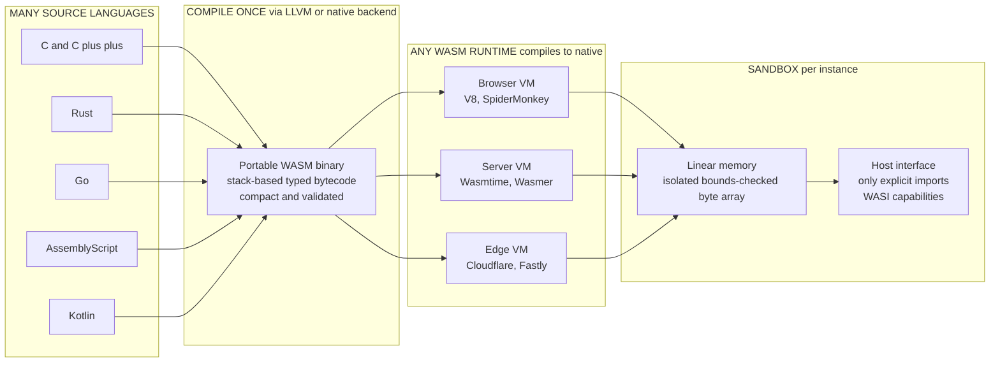

# 🕸️ WebAssembly and Portable Targets

> [!abstract] TL;DR
> **WebAssembly (Wasm)** is a compact, statically-typed, **stack-based binary instruction format** designed as a *portable compilation target* for high-level languages. A program written in C, Rust, or Go compiles **once** to a single `.wasm` artifact that runs **anywhere a Wasm runtime exists** — browser, server, or edge — at **near-native speed** and inside a **strict sandbox** with *no ambient access* to memory or the host: it can touch only the capabilities explicitly **imported** into it. It began as a way to run native code in the browser and has grown into a general **secure, portable compute substrate** — extended beyond the web by **WASI** (a capability-secure syscall interface) and the **Component Model** (typed, language-agnostic module interop). Think of it as the M-languages-to-one-target payoff of a shared IR, but shipped as a distributable, safe-by-construction binary.

---

## Intuition

**Analogy — the universal shipping container.** Before standardized containers, moving goods meant repacking cargo by hand for every truck, ship, and train — slow, lossy, and different everywhere. The **intermodal container** fixed this with one agreed box: pack your goods *once*, and any truck, crane, ship, or rail car can carry it unchanged, anywhere in the world, without ever opening it. The container also *isolates* its contents — the dockworker moves the sealed box without rummaging inside.

**WebAssembly is that container for code.** You compile your program once into a compact, sealed binary, and any Wasm runtime — a browser, a cloud server, a tiny edge node — can pick it up and run it at near-native speed *without knowing or caring what language it was written in*. And like the sealed container, the runtime moves and executes the module **without letting it rummage through the host**: the code sees only its own linear memory and the specific "doors" (imported functions) the host chose to open. Portable, fast, and sealed — that is the whole pitch.

---

## How It Works

### Core Mechanics

**1. What Wasm actually is.** Wasm is a **binary instruction format for a virtual stack machine**. It is *not* a language you write by hand (though a text format `.wat` exists) and *not* raw machine code — it is a **portable bytecode**, a distribution-grade [[Intermediate_Representations|intermediate representation]] that front ends emit and runtimes consume. Four design goals drive every decision:

- **Portable** — one binary runs on any conforming runtime, regardless of OS or CPU. The bytecode targets an abstract machine, not x86 or ARM.
- **Fast** — the format is designed for **predictable near-native performance**. It is easy to validate in one linear pass and easy to compile to native code either **ahead-of-time (AOT)** or via **streaming/tiered** compilation while the bytes are still downloading.
- **Safe** — every module runs in a **strict sandbox**. There is *no ambient authority*: a module cannot read arbitrary process memory, open files, or make network calls unless the host **explicitly imports** that capability into it.
- **Compact** — a dense binary encoding means small artifacts that download and parse quickly, which matters on the web and for fast serverless cold starts.

**2. The execution model — a typed stack machine.** Wasm executes on an **operand stack**. Instructions **push** and **pop** typed values (`i32`, `i64`, `f32`, `f64`, plus reference types); for example `i32.add` pops two `i32`s and pushes their sum. Around that core:

- **Structured control flow.** Unlike raw assembly's arbitrary `goto`, Wasm has **structured** `block`, `loop`, and `if` constructs with typed entry/exit. This makes modules **verifiable in a single pass** and keeps control flow reducible — a deliberate safety and compile-speed choice.
- **Typed locals and globals.** Functions declare typed local variables (`local.get` / `local.set`) and modules declare globals — no untyped register soup.
- **Linear memory.** A module's heap is a single **contiguous, sandboxed byte array** that can grow in 64 KiB pages. Every load/store is **bounds-checked** against the current size, so an out-of-bounds access **traps** instead of corrupting the host. The module literally cannot address anything outside this array.
- **Imports and exports.** A module declares **imports** (functions, memories, globals, tables it needs from the host) and **exports** (what it offers back). The import list *is* the module's entire attack surface — nothing else is reachable.
- **Validation before execution.** Every module is **type-checked and structurally validated** before a single instruction runs. Stack effects, control-flow nesting, and memory bounds are proven statically, so a validated module cannot violate type or memory safety at run time.

**3. How runtimes make it fast.** A Wasm engine does **not** tree-walk the bytecode. It compiles it to native machine code, typically with a **tiered** strategy: a fast **baseline** compiler emits code quickly for immediate startup, while an **optimizing** compiler (often built on the same infrastructure as a [[Compilers_Overview|production compiler back end]]) recompiles hot functions in the background. Because Wasm is already a low-level, typed, validated IR, this compilation is far more predictable than JITing a dynamic language — the engine does the same kind of just-in-time / ahead-of-time code generation a native toolchain does, but on a portable input.

**4. Wasm as a compilation target — the M-to-one payoff.** This is the compiler-theory heart of Wasm. Just as a shared IR turns the *M languages × N machines* problem into *M + N* (see [[Intermediate_Representations]]), Wasm gives every language **one** portable back end to target. Many front ends already emit it: **LLVM**-based **C/C++/Rust/Swift** (via `wasm32` targets, `Emscripten`, `wasm-pack`), **Go** (native `GOOS=js`/WASI backends), **AssemblyScript** (a TypeScript-like language built for Wasm), and **Kotlin/Wasm**. Write the language once, reach the browser, the server, and the edge for free.

**5. Beyond the browser — WASI and the Component Model.** Wasm started in the browser, but a sandbox with no syscalls is useless on a server. **WASI (the WebAssembly System Interface)** is a **portable, capability-secure syscall-like interface**: instead of ambient access to the whole filesystem, a WASI module receives *specific* pre-opened directories and handles — capabilities, not global authority. The **Component Model** adds **interface types**: typed, language-agnostic contracts so a module written in Rust can call one written in Go with rich types (strings, records, lists) across the boundary — a modern, safe **foreign-function-interface** story for polyglot systems.

### Flow / Architecture



*Many front ends fan **into** one portable binary; that single artifact fans **out** to any runtime, each of which compiles it to native code. Every instance runs boxed inside its own linear memory and may reach the host only through explicitly imported capabilities.*

---

## Key Concepts

**Secondary (intuitive, no CS background needed)**
- **Compile once, run anywhere-safely** — one sealed binary that any Wasm runtime can carry and execute, like a standard shipping container.
- **A sealed box** — the code can only touch what it was handed; it cannot rummage through the computer it runs on.
- **Fast because it is close to the machine** — the format is simple and low-level, so the runtime can turn it into real CPU instructions quickly.
- **Small on purpose** — compact binaries download and start fast.

**Undergraduate (a first compilers / systems course)**
- **Stack machine execution** — operand stack, typed instructions (`i32.const`, `i32.add`, `local.get`), and structured control flow (`block`/`loop`/`if`) instead of arbitrary jumps.
- **Linear memory and bounds checking** — the heap as a single growable byte array; every access is checked and out-of-bounds **traps** rather than corrupting the host.
- **Validation** — one-pass static type/structure checking that proves safety *before* execution.
- **Imports/exports as the sandbox boundary** — the import list is the module's entire capability set and its whole attack surface.
- **Wasm as a compilation target** — the M-languages-to-one-target economy; LLVM/`Emscripten`/`wasm-pack` front ends emitting `wasm32`.
- **AOT vs streaming/tiered compilation** — how a runtime turns portable bytecode into native code.

**Graduate (advanced systems / language runtimes)**
- **Capability-based security** — no ambient authority; WASI hands out specific handles (pre-opened dirs, sockets) instead of global filesystem/network access, and why that makes Wasm a superior untrusted-code sandbox versus native plugins.
- **The Component Model and interface types** — typed, language-agnostic ABI for cross-module interop; a principled replacement for hand-rolled FFI marshalling.
- **Structured, reducible control flow** — how the absence of unstructured `goto` enables single-pass validation and simplifies the engine's own optimizer.
- **Evolving proposals** — **threads** (shared memory + atomics), **SIMD**, **tail calls**, **exception handling**, and the **GC** proposal that lets managed languages avoid shipping their own collector.
- **Comparison to JVM/CLR** — a leaner, language-agnostic, security-first portable target that applies their bytecode-VM lessons but drops language bias and centers isolation.
- **Performance ceiling** — near-native but not native: bounds checks, indirect-call type checks, and the host-boundary crossing cost are the structural overheads.

---

## Python Demo

```python
# A TINY WASM-STYLE STACK MACHINE (pure stdlib + matplotlib).
#
# We model the essence of WebAssembly execution:
#   * a handful of TYPED STACK INSTRUCTIONS: i32.const, i32.add, i32.mul,
#     local.get, local.set, and call
#   * a program is a flat list of instructions executed on an OPERAND STACK
#   * a SANDBOX: `call` can invoke ONLY host functions that were explicitly
#     IMPORTED into the module. Anything else TRAPS -- there is no ambient
#     access to the host (mirroring Wasm's capability model).
#
# We hand-assemble the polynomial  p(x) = 2*x*x + 3*x + 1  (Horner form) as
# stack bytecode, execute it while TRACING the stack, then:
#   (1) demonstrate the sandbox by allowing an imported host call and
#       rejecting a non-imported one, and
#   (2) compare -- with matplotlib -- the modeled execution cost of the
#       compact stack VM versus a tree-walking interpreter and native code.

import matplotlib.pyplot as plt


# --------------------------------------------------------------------------
# The runtime: a stack machine plus an import table (the ONLY host doors).
# --------------------------------------------------------------------------
class Trap(Exception):
    """A Wasm runtime trap -- the sandbox refused an operation."""


class StackVM:
    def __init__(self, imports=None):
        # `imports` is the module's ENTIRE capability set. If a host function
        # is not listed here, the module simply cannot reach it.
        self.imports = imports or {}

    def run(self, code, local_vars, trace=None):
        stack = []
        for pc, instr in enumerate(code):
            op = instr[0]
            if op == "i32.const":
                stack.append(instr[1])
            elif op == "i32.add":
                b = stack.pop(); a = stack.pop(); stack.append(a + b)
            elif op == "i32.mul":
                b = stack.pop(); a = stack.pop(); stack.append(a * b)
            elif op == "local.get":
                stack.append(local_vars[instr[1]])
            elif op == "local.set":
                local_vars[instr[1]] = stack.pop()
            elif op == "call":
                name = instr[1]
                if name not in self.imports:            # <-- SANDBOX BOUNDARY
                    raise Trap(f"call to '{name}' REJECTED: "
                               f"not an imported capability")
                arg = stack.pop()
                stack.append(self.imports[name](arg))
            else:
                raise Trap(f"illegal opcode: {op}")
            if trace is not None:
                trace.append((pc, op, list(stack)))
        return stack[-1] if stack else None


# --------------------------------------------------------------------------
# Hand-assembled bytecode for  p(x) = 2*x*x + 3*x + 1  via Horner's method:
#   ((2 * x) + 3) * x + 1        (x lives in local 0)
# --------------------------------------------------------------------------
POLY = [
    ("i32.const", 2),   # push 2
    ("local.get", 0),   # push x
    ("i32.mul",),       # 2*x
    ("i32.const", 3),   # push 3
    ("i32.add",),       # 2*x + 3
    ("local.get", 0),   # push x
    ("i32.mul",),       # (2*x + 3) * x
    ("i32.const", 1),   # push 1
    ("i32.add",),       # (2*x + 3)*x + 1  ==  2*x*x + 3*x + 1
]

vm = StackVM()
trace = []
X = 5
result = vm.run(POLY, local_vars=[X], trace=trace)

print(f"p(x) = 2*x*x + 3*x + 1 ,  x = {X}")
print(f"stack VM result = {result}   (check: {2*X*X + 3*X + 1})")
print(f"\nEXECUTION TRACE ({len(POLY)} instructions):")
for pc, op, snap in trace:
    print(f"  pc={pc:>2}  {op:<12}  stack -> {snap}")

# --------------------------------------------------------------------------
# SANDBOX DEMO: `call` may reach ONLY explicitly imported host functions.
# --------------------------------------------------------------------------
print("\nSANDBOX DEMO")
host_log = lambda v: (print(f"  [host.log] module said: {v}"), v)[1]
sandboxed = StackVM(imports={"log": host_log})   # only 'log' is granted

# Allowed: compute p(x), then call the imported host 'log'.
allowed = POLY + [("call", "log")]
sandboxed.run(allowed, local_vars=[X], trace=None)

# Denied: try to call a syscall-like capability that was NOT imported.
denied = [("i32.const", 42), ("call", "read_file")]
try:
    sandboxed.run(denied, local_vars=[])
except Trap as t:
    print(f"  TRAP: {t}")

# --------------------------------------------------------------------------
# A TREE-WALKING interpreter over the SAME polynomial, counting node visits.
# --------------------------------------------------------------------------
def num(n):        return ("num", n)
def var(i):        return ("var", i)
def add(a, b):     return ("add", a, b)
def mul(a, b):     return ("mul", a, b)

# 2*x*x + 3*x + 1  as an AST
AST = add(add(mul(num(2), mul(var(0), var(0))),
              mul(num(3), var(0))),
          num(1))

class Counter:
    n = 0

def eval_ast(node, env):
    Counter.n += 1                    # one recursive visit == one node
    tag = node[0]
    if tag == "num":  return node[1]
    if tag == "var":  return env[node[1]]
    if tag == "add":  return eval_ast(node[1], env) + eval_ast(node[2], env)
    if tag == "mul":  return eval_ast(node[1], env) * eval_ast(node[2], env)
    raise ValueError(tag)

tree_result = eval_ast(AST, [X])
tree_nodes = Counter.n
print(f"\ntree-walker result = {tree_result}   "
      f"({tree_nodes} node visits vs {len(POLY)} stack instructions)")

# --------------------------------------------------------------------------
# MODELED per-operation cost (nanoseconds). These are ILLUSTRATIVE constants
# reflecting typical overheads, not measurements:
#   tree-walker : recursion + tag dispatch + tuple indexing  ~ heavy
#   stack VM    : tight loop, one pop/push per op            ~ light
#   native      : straight-line, pipelined arithmetic        ~ minimal
# --------------------------------------------------------------------------
TREE_NS, STACK_NS = 12.0, 3.0
tree_cost   = tree_nodes  * TREE_NS
stack_cost  = len(POLY)   * STACK_NS
native_cost = 1.2                      # whole eval, pipelined mul/add

print("\nMODELED COST PER EVALUATION")
print(f"  tree-walker : {tree_cost:6.1f} ns")
print(f"  wasm VM     : {stack_cost:6.1f} ns   "
      f"({tree_cost/stack_cost:.1f}x faster than tree-walker)")
print(f"  native      : {native_cost:6.1f} ns")

# --------------------------------------------------------------------------
# VISUALIZE: (left) the operand stack at each step; (right) modeled cost.
# --------------------------------------------------------------------------
fig, (ax1, ax2) = plt.subplots(1, 2, figsize=(15, 6),
                               gridspec_kw={"width_ratios": [1.7, 1]})

max_depth = max(len(s) for _, _, s in trace)
for step, (pc, op, snap) in enumerate(trace):
    for depth, val in enumerate(snap):
        top = (depth == len(snap) - 1)
        ax1.add_patch(plt.Rectangle((step, depth), 0.88, 0.88,
                      facecolor="#ffc27a" if top else "#ffe8c7",
                      edgecolor="black", linewidth=1.2))
        ax1.text(step + 0.44, depth + 0.44, str(val),
                 ha="center", va="center", fontsize=10, fontweight="bold")
    ax1.text(step + 0.44, -0.65, op, ha="right", va="top",
             rotation=40, fontsize=8, family="monospace")

ax1.set_xlim(-0.5, len(trace) + 0.3)
ax1.set_ylim(-2.4, max_depth + 0.4)
ax1.set_yticks([d + 0.44 for d in range(max_depth)])
ax1.set_yticklabels([f"slot {d}" for d in range(max_depth)])
ax1.set_xticks([])
ax1.set_ylabel("operand stack (bottom -> top)")
ax1.set_title("Wasm-style stack machine: operand stack after each instruction\n"
              "p(x) = 2*x*x + 3*x + 1  at x = 5  ->  final top = "
              f"{result}", fontsize=11)

labels = ["Tree-walker\ninterpreter", "WASM stack VM\n(this demo)",
          "Native machine\ncode"]
costs  = [tree_cost, stack_cost, native_cost]
colors = ["#e57373", "#4d9de0", "#77b255"]
bars = ax2.bar(labels, costs, color=colors, edgecolor="black")
for bar, c in zip(bars, costs):
    ax2.text(bar.get_x() + bar.get_width() / 2, bar.get_height() + 2,
             f"{c:.1f} ns", ha="center", va="bottom",
             fontsize=10, fontweight="bold")
ax2.set_ylabel("modeled cost per evaluation (ns, lower is better)")
ax2.set_title("Compact bytecode -> near-native speed\n"
              "Wasm sits between a tree-walker and native code", fontsize=11)
ax2.set_ylim(0, tree_cost * 1.2)

plt.tight_layout()
plt.savefig("wasm_stack_machine.png", dpi=130)
print("\nSaved visualization to wasm_stack_machine.png")
```

Running it prints the full **execution trace** (the operand stack after each of the 9 instructions, ending in `78`), demonstrates the **sandbox** — the imported `log` capability succeeds while the un-imported `read_file` call **traps** — and reports the modeled costs: the compact stack VM runs the same polynomial in far fewer, cheaper steps than the tree-walker, landing **between** the tree-walker and native code. The saved figure shows the stack growing and shrinking instruction-by-instruction (left) and the three-way cost comparison (right) that captures Wasm's core promise: *compact bytecode that a runtime turns into near-native speed, inside a box.*

---

## Real-World Applications

> **Example — Fastly and Cloudflare running untrusted edge functions.** Edge platforms need to run *thousands of customers' functions* on shared machines with **millisecond cold starts** and hard isolation. Fastly's **Compute** and parts of Cloudflare's edge use **Wasm** exactly because it delivers both: a Wasm module is a small, pre-validated binary that a runtime (Fastly built **Lucet/Wasmtime**-style AOT compilation) turns into native code, and its **capability sandbox** means one tenant's function *structurally cannot* read another's memory or the host filesystem. Traditional containers or native code cannot start that fast or isolate that cheaply — this is the "run anywhere safely, and start instantly" niche Wasm owns.

Where Wasm shows up in practice:

- **Browser apps and games.** Figma's rendering engine, AutoCAD Web, Photoshop on the web, and Unity/Unreal game exports ship C++/Rust compiled to Wasm for near-native compute the DOM and plain JS cannot match.
- **Serverless / edge functions.** Fast cold starts and dense multi-tenancy (Fastly Compute, Cloudflare, Shopify's Functions, `wasmCloud`).
- **Plugin systems.** Envoy proxy filters, Istio extensions, and Envoy's WasmPlugin let operators load **untrusted extensions** far more safely than native `.so` plugins; Zellij, Lapce, and databases use Wasm for user plugins.
- **Blockchain smart contracts.** Chains such as **Polkadot**, **NEAR**, **CosmWasm**, and **Internet Computer** execute contracts as Wasm — a deterministic, sandboxed, metered VM (contrast with the EVM in [[EVM_Architecture]], which is a purpose-built stack VM Wasm-based chains improve on).
- **Polyglot embedding and portable CLIs.** Runtimes like **Wasmtime**, **Wasmer**, and **WasmEdge** embed Wasm into servers, and WASI lets the *same* `.wasm` binary run as a portable command-line tool across OSes.

Both [[Rust_WebAssembly|Rust]] and [[Go_WebAssembly|Go]] have first-class Wasm targets and are among the most common front ends feeding these use cases.

---

## Common Pitfalls

- **Assuming Wasm "is fast" with no caveats.** It is *near*-native, not native. Bounds checks on every memory access, type checks on indirect calls, and the cost of crossing the host boundary are real overheads. Chatty designs that cross the JS↔Wasm or host↔module boundary in a hot loop can be **slower** than staying on one side — batch data across the boundary, do the heavy compute inside.
- **Forgetting Wasm has no ambient I/O.** A freshly compiled module cannot print, read files, or open sockets. Everything comes through **imports** (in the browser) or **WASI** (on servers). Newcomers are surprised that "hello world" needs a host function imported to do the actual writing — that *is* the sandbox working as designed.
- **Shipping a whole language runtime by accident.** Languages with a garbage collector or large standard library (Go's older Wasm backend, some managed languages) can produce **multi-megabyte** binaries because the runtime is bundled in. Use size-optimized targets (`opt-level=z`, `wasm-opt`, TinyGo, or the GC proposal) and measure — a bloated `.wasm` defeats the "compact, fast download" goal.
- **Treating the linear memory as safe *inside* the module.** The sandbox protects the *host* from the module, not the module from *itself*. A C/C++ program compiled to Wasm can still have a buffer overflow *within its own linear memory* — memory-unsafe source stays memory-unsafe internally; Wasm only guarantees the host is isolated.
- **Confusing Wasm with a fixed "web-only" thing.** Wasm long ago left the browser. Ignoring **WASI** and the **Component Model** means missing the entire server/edge/plugin story where much of Wasm's growth now happens.
- **Expecting full parity with native today.** **Threads, SIMD, tail calls, exceptions, and GC** are staged proposals at varying maturity across runtimes. Code assuming they exist may fail on engines that have not shipped them — check runtime support before relying on a proposal.

---

## Related Concepts

- [[Intermediate_Representations]] — Wasm *is* a portable, distribution-grade IR; it applies the M-languages-to-one-target economy that motivates every shared IR.
- [[Compilers_Overview]] — the front-end/back-end split whose *back end* Wasm serves as a universal target, and whose optimizer tech the runtimes reuse to JIT it.
- [[OS_Security_and_Isolation]] — the sandboxing, capability, and isolation principles Wasm enforces at the language-runtime layer, complementing OS-level defenses.
- [[Rust_WebAssembly]] — a concrete front end: Rust compiling to Wasm via `wasm-pack`/`wasm-bindgen` for near-native, GC-free browser code.
- [[Go_WebAssembly]] — the same portable target reached from Go, illustrating the runtime-size trade-off of a GC'd language.
- [[EVM_Architecture]] — a purpose-built stack VM for smart contracts; a useful contrast to Wasm-based contract chains that trade the EVM for a general portable VM.
- [[JVM_Execution_Model]] — the earlier bytecode-VM lineage (portable, sandboxed, JIT-compiled) whose lessons Wasm applies more leanly and language-agnostically.
- [[Bytecode_and_JVM]] — a detailed stack-based distribution bytecode; the direct conceptual ancestor of Wasm's stack machine.

*(Forthcoming Compilers siblings referenced in prose — `Bytecode_and_Virtual_Machines`, `Just_In_Time_Compilation`, `Foreign_Function_Interfaces_and_Interop`, `Compiler_Toolchains_and_LLVM`, and `The_Future_of_Compilers` — are not yet linked because their notes do not exist in the vault.)*

---

## Review Questions

1. **(Conceptual)** Using the shipping-container analogy, explain the four Wasm design goals (portable, fast, safe, compact) and identify which language feature or format decision delivers each one. Why does structured control flow (no arbitrary `goto`) serve *both* the "fast" and "safe" goals?
2. **(Scenario)** You are building a plugin system that will run **untrusted** third-party code inside your service. Compare loading native `.so` plugins versus compiling plugins to Wasm and running them in a runtime like Wasmtime. What specifically can the native plugin do that the Wasm plugin cannot, and how do **imports/WASI capabilities** bound the Wasm plugin's authority?
3. **(Trade-off)** A team wants to move a compute-heavy image filter from JavaScript to Wasm and expects a large speedup, but after porting it runs only marginally faster. Give two structural reasons Wasm might not deliver the expected gain here (think boundary crossings and memory), and describe how you would restructure the data flow to actually realize near-native performance.

---

## Sources

- Haas, A., Rossberg, A., Schuff, D., et al. "Bringing the Web up to Speed with WebAssembly." *PLDI 2017* — the foundational paper defining Wasm's stack machine, type system, and formal safety guarantees.
- [WebAssembly Core Specification](https://webassembly.github.io/spec/core/) — the official normative spec for the instruction set, validation, and execution model (W3C).
- [WASI: The WebAssembly System Interface](https://wasi.dev/) — the capability-secure system interface enabling Wasm outside the browser.
- [The WebAssembly Component Model](https://component-model.bytecodealliance.org/) — Bytecode Alliance documentation on interface types and typed, language-agnostic module interop.
- Clark, L. "A cartoon intro to WebAssembly." *Mozilla Hacks*, 2017 — an accessible visual explanation of the format, compilation pipeline, and sandbox ([hacks.mozilla.org](https://hacks.mozilla.org/2017/02/a-cartoon-intro-to-webassembly/)).

---

#compilers #webassembly #wasm #portable-bytecode #sandboxing
