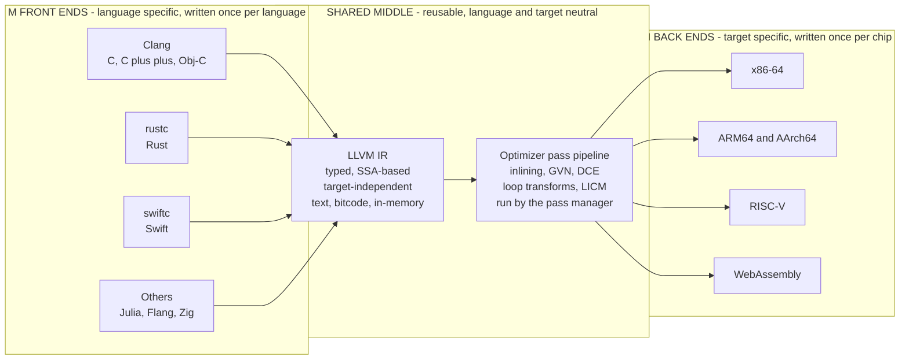

# 🧩 Compiler Toolchains and LLVM

> [!abstract] TL;DR
> A **compiler toolchain** is the full assembly line that turns source into a running program — a *driver* orchestrating a **preprocessor → compiler → assembler → linker**, plus loaders, sanitizers, and build tooling around them. **LLVM** revolutionized this world by taking the front-end / middle-end / back-end split of [[Compilers_Overview]] to its logical extreme as a *library-based, permissively-licensed* framework: reusable **front ends** (Clang, rustc, swiftc) lower source into a single **typed, SSA-based LLVM IR**, a shared **pass pipeline** optimizes that IR, and reusable **back ends** (x86-64, ARM64, RISC-V, WebAssembly) emit target code. This **three-phase architecture** solves the M-by-N problem — *M* languages plus *N* targets need only **M + N** components instead of **M × N** whole compilers — so a new language writes one front end and inherits world-class optimization and every CPU target for free. That reusable, layered infrastructure is why Rust, Swift, Julia, Clang, and Zig all exist in the form they do; **MLIR** now generalizes the idea to many *dialects* at many abstraction levels. This note closes the Compilers vault's Advanced section.

---

## Intuition

**Analogy — from forging your own tools to building with LEGO.** Before LLVM, writing a compiler was like opening a restaurant where you had to *forge your own knives, weld your own stove, and lay your own plumbing* before you could cook a single dish. Every new language re-implemented, from scratch, its own optimizer and its own code generator for every chip it wanted to run on — an enormous, duplicated, error-prone effort that only large, well-funded teams could afford. The optimizer for Language A could not be borrowed by Language B; the x86 back end written for Compiler X was locked inside Compiler X.

LLVM turned compiler construction into **LEGO**: reusable, well-documented, snap-together pieces. There is a **common IR** in the middle that every language agrees to speak, a **library shelf of optimization passes** that anyone can pull from, and a set of **ready-made back ends** for real CPUs. A new language just writes the *one* custom piece — a **front end** that lowers its syntax into LLVM IR — and immediately gets a production-grade optimizer and every supported CPU, GPU, and WebAssembly target *for free*. The reason a wave of new systems languages (Rust, Swift, Julia, Zig, Crystal) appeared in a single decade is precisely that the expensive parts had become shared infrastructure. **Reusable, layered infrastructure is the enabler of innovation** — that is the whole lesson of this note.

---

## How It Works

### The toolchain: an assembly line, not a single tool

"The compiler" in everyday speech is really a **pipeline of separate programs** coordinated by a **driver**. When you type `clang hello.c -o hello`, the `clang` driver silently runs four stages:

1. **Preprocessor** — expands `#include`, `#define`, and conditional `#if` directives, producing a single expanded translation unit of pure source. (In many modern languages this stage is folded into the front end or absent.)
2. **Compiler proper** — the front end + middle end: lex, parse, type-check, lower to IR, optimize, and emit **assembly** (a `.s` text file) or an object directly.
3. **Assembler** — translates assembly into a **relocatable object file** (`.o`), a binary of machine code plus a symbol table and relocation entries.
4. **Linker** — stitches many object files and libraries into one **executable or shared library**, resolving cross-object symbol references and laying out sections (see [[Linkers_and_Loaders]]). At run time, the **loader** maps that image into memory and performs dynamic linking.

The **driver** is the unsung hero: it knows the target triple, the sysroot, which runtime libraries to pull in, and how to invoke each stage — so you experience one command instead of four. Around this core sits the wider **build ecosystem** — `make`, CMake, Bazel, Cargo — that decides *which* files to compile, in what order, with what flags, and caches results for incremental builds.

### LLVM's three-phase architecture — the heart of the matter

LLVM factors the compiler into three cleanly separated tiers connected only through the IR:

- **Front ends (language-specific).** One per source language: **Clang** (C/C++/Objective-C), **rustc** (Rust, via its own MIR then LLVM IR), **swiftc** (Swift, via SIL then LLVM IR), Julia, Flang (Fortran), Zig. A front end knows everything about its language and *nothing* about any CPU. Its job ends when it has **lowered** the program into LLVM IR.
- **The middle end (shared, neutral).** A library of **optimization passes** operating purely on LLVM IR: inlining, global value numbering, dead-code elimination, loop transforms, vectorization. Written **once**, reused by *every* front end and *every* target. This is where the reuse pays off.
- **Back ends (target-specific).** One per target ISA: x86-64, ARM64/AArch64, RISC-V, WebAssembly, GPUs. A back end knows everything about its chip and *nothing* about your source language. It performs instruction selection, register allocation, and scheduling to emit machine code.

Because front ends and back ends communicate **only** through the IR, adding a language costs *one* front end (reused across all targets) and adding a chip costs *one* back end (reused across all languages). This is the **M + N economy** made concrete, and it is the same architectural insight described in [[Intermediate_Representations]] and [[Compilers_Overview]] — LLVM simply industrialized it as a set of libraries.

### LLVM IR — the contract in the middle

The pivot is **LLVM IR**: a **typed, SSA-based, target-independent** low-level language (see [[Static_Single_Assignment_Form]] for the single-assignment discipline it is built on). It exists in three interchangeable forms — a human-readable **textual** form (`.ll`), a compact on-disk **bitcode** (`.bc`), and an in-memory data structure the passes mutate. It reads like a well-specified assembly for an abstract machine with unlimited virtual registers and explicit types:

```llvm
define i32 @square(i32 %x) {
entry:
  %r = mul i32 %x, %x    ; typed, SSA: %r is assigned exactly once
  ret i32 %r
}
```

The IR is the *stable interface* between the three phases. As long as your front end emits valid IR, the entire optimizer and every back end just work.

### The pass pipeline — analysis and transformation

Optimization in LLVM is a **pipeline of passes** run by a **pass manager**. Passes come in two flavours:

- **Analysis passes** compute facts without changing the IR — dominator trees, alias analysis, loop info, scalar evolution.
- **Transform passes** rewrite the IR using those facts — inlining, GVN/CSE, dead-code elimination (see [[Local_and_Global_Optimizations]]), loop-invariant code motion and unrolling (see [[Loop_Optimizations]]), instruction scheduling (see [[Instruction_Scheduling_and_Pipelines]]).

**Pass ordering matters enormously** — this is the *phase-ordering problem*. Inlining exposes constants that folding then simplifies; folding exposes dead code that DCE then removes; running the same pass again after another can find new opportunities. The default `-O2`/`-O3` pipelines are carefully tuned sequences, and results depend on the order (there is no universally optimal ordering, which is an active research area).

### Flow / Architecture



*M front ends fan **into** one IR; N back ends fan **out** of it — the cost is M + N, not M × N. The reusable optimizer in the middle is written once and pays off for every language and every target.*

### The LLVM project — a family of libraries

"LLVM" the project is a **collection of composable libraries and tools**, not one monolith:

- **LLVM core** — the IR, the pass infrastructure, the code generators.
- **Clang** — the C/C++/Objective-C front end (also a fast, high-quality diagnostic engine and the basis of clangd, clang-format, clang-tidy).
- **LLD** — a fast, cross-platform linker (an alternative to GNU ld/gold).
- **Code generators** — instruction selection via **SelectionDAG** (the mature path) and **GlobalISel** (the newer, more incremental path), with target machines described declaratively in **TableGen** so much back-end boilerplate is generated.
- **LLDB** — the debugger; **compiler-rt** — low-level runtime routines and sanitizers; **libc++** / **libc++abi** — the C++ standard library.

Everything is designed as a **library first, tool second**: you can embed LLVM in your own program to generate code at run time, which is exactly what JIT compilers and databases do.

---

## Key Concepts

**Secondary (intuitive, no CS background needed)**
- **Toolchain = assembly line** — many small programs (preprocess, compile, assemble, link) run in sequence, coordinated by a driver you invoke with one command.
- **Shared middle** — every language speaks one common "middle language," so tools built for it help every language at once.
- **Write once, target everything** — a new language writes only its own front piece and gets every CPU and a good optimizer for free.
- **Passes** — optimization happens as a *sequence of cleanup steps*, each making the program a little faster or smaller.

**Undergraduate (a first compilers course)**
- **The M × N vs M + N argument** — why a shared IR decouples front ends from back ends, and how LLVM realizes it as libraries.
- **The three phases** — language-specific front end, neutral optimizer, target-specific back end, connected only by the IR.
- **LLVM IR properties** — typed, SSA-based, target-independent; textual / bitcode / in-memory forms.
- **The four toolchain stages** — preprocessor, compiler, assembler, linker; drivers and the loader (see [[Linkers_and_Loaders]]).
- **Analysis vs transform passes and the pass manager** — separating fact-finding from rewriting; why pass *ordering* changes results.
- **GCC as the other giant** — GENERIC → GIMPLE (SSA mid-level) → RTL (low-level), and the licensing/design contrast with LLVM.

**Graduate (advanced compilation)**
- **Instruction selection engines** — SelectionDAG vs GlobalISel, and **TableGen**-driven target descriptions that generate matchers, encoders, and schedules.
- **The phase-ordering problem** — no universally optimal pass sequence; profile-guided and ML-driven pass selection.
- **Link-time optimization (LTO)** — shipping bitcode and optimizing across translation-unit boundaries at link time (`-flto`); ThinLTO for scalable, parallel whole-program optimization (see [[Interprocedural_and_Link_Time_Optimization]]).
- **JIT via LLVM** — **MCJIT** and the modern **ORC** (On-Request Compilation) APIs that embed LLVM as a runtime code generator (see [[Just_In_Time_Compilation]]).
- **MLIR and dialects** — a multi-level IR framework where many *dialects* (tensor, affine, GPU, LLVM) coexist and lower into one another; the substrate of modern ML and hardware compilers (explored in [[The_Future_of_Compilers]]).
- **Cross-compilation and sysroots** — target triples, sysroots, and toolchain files that let one host build for many targets.

---

## Python Demo

```python
# TWO ILLUSTRATIONS OF WHY THE LLVM ARCHITECTURE WON.
#
# PART A - THE M-BY-N ARCHITECTURAL PAYOFF OF A SHARED IR.
#   WITHOUT a shared IR, every (language, target) pair needs its own whole
#   compiler:  M * N  monolithic components.
#   WITH   a shared IR, you need only M reusable front ends + N reusable back
#   ends:  M + N  components. We sweep n = number of languages = number of
#   targets and plot both, shading the savings.
#
# PART B - AN OPTIMIZATION PASS PIPELINE on a tiny three-address IR.
#   We apply constant folding -> common-subexpression elimination -> dead-code
#   elimination to a small program and watch CODE QUALITY improve per pass
#   (runtime cost falls, so the speedup vs the unoptimized baseline rises).
#
# Pure standard library + matplotlib (numpy optional, unused here).

import matplotlib.pyplot as plt

# ===========================================================================
# PART A - M x N (no shared IR)  vs  M + N (shared IR)
# ===========================================================================
def components_without_ir(M, N):
    return M * N          # one monolithic compiler per language-target pair

def components_with_ir(M, N):
    return M + N          # M reusable front ends + N reusable back ends

ns       = list(range(1, 13))                       # n languages AND n targets
without  = [components_without_ir(n, n) for n in ns]   # n * n
with_ir  = [components_with_ir(n, n)    for n in ns]   # 2 * n

print("=== PART A: components needed (n languages x n targets) ===")
print(" n | without IR (MxN) | with IR (M+N) | saved")
for n, w, s in zip(ns, without, with_ir):
    print(f"{n:>2} | {w:>16} | {s:>13} | {w - s:>5}")

# ===========================================================================
# PART B - a real (tiny) optimization pass pipeline over three-address code.
# An instruction is (dst, op, a, b).  ops: 'const' (a is a literal), 'add', 'mul'.
# ===========================================================================
PROGRAM = [
    ("t1", "mul",   "3",  "4"),   # 3 * 4      -> constant-foldable to 12
    ("t2", "add",   "t1", "5"),   # 12 + 5     -> foldable to 17 (propagated)
    ("t3", "add",   "a",  "b"),
    ("t4", "add",   "a",  "b"),   # duplicate of t3          -> CSE target
    ("t5", "mul",   "t3", "t4"),
    ("t6", "const", "0",  ""),    # never used               -> dead code
    ("x",  "add",   "t5", "t2"),  # the observable result
]
OUTPUT = "x"

def is_int(s):
    try:
        int(s); return True
    except (ValueError, TypeError):
        return False

def constant_folding(prog):
    """Fold constant expressions and propagate known constant values."""
    consts, out = {}, []
    for dst, op, a, b in prog:
        if op == "const" and is_int(a):
            consts[dst] = int(a)
            out.append((dst, op, a, b)); continue
        a = str(consts.get(a, a)); b = str(consts.get(b, b))
        if op in ("add", "mul") and is_int(a) and is_int(b):
            val = int(a) + int(b) if op == "add" else int(a) * int(b)
            consts[dst] = val
            out.append((dst, "const", str(val), ""))
        else:
            out.append((dst, op, a, b))
    return out

def common_subexpression_elimination(prog):
    """Reuse an earlier identical computation instead of recomputing it."""
    seen, alias, out = {}, {}, []
    canon = lambda x: alias.get(x, x)
    for dst, op, a, b in prog:
        a, b = canon(a), canon(b)
        key = (op, a, b)
        if op in ("add", "mul") and key in seen:
            alias[dst] = seen[key]                 # redirect uses; drop this instr
        else:
            if op in ("add", "mul"):
                seen[key] = dst
            out.append((dst, op, a, b))
    return out

def dead_code_elimination(prog, output):
    """Keep only instructions whose result feeds (transitively) the output."""
    used = {output}
    for dst, op, a, b in reversed(prog):
        if dst in used:
            for operand in (a, b):
                if operand and not is_int(operand):
                    used.add(operand)
    return [ins for ins in prog if ins[0] in used]

def runtime_cost(prog):
    # constants are materialized as immediates -> zero runtime work;
    # only add/mul instructions actually execute.
    return sum(1 for (_, op, _, _) in prog if op in ("add", "mul"))

# Run the pipeline, snapshotting after each pass.
stages, progs, p = ["baseline"], [PROGRAM], PROGRAM
for name, fn in [("const-fold", lambda pr: constant_folding(pr)),
                 ("CSE",        lambda pr: common_subexpression_elimination(pr)),
                 ("DCE",        lambda pr: dead_code_elimination(pr, OUTPUT))]:
    p = fn(p); stages.append(name); progs.append(p)

sizes   = [len(pr)          for pr in progs]          # code size (instr count)
costs   = [runtime_cost(pr) for pr in progs]          # runtime work
speedup = [costs[0] / c     for c in costs]           # quality vs baseline

print("\n=== PART B: pass pipeline on the tiny IR ===")
print("stage       | instrs | runtime-cost | speedup")
for st, sz, ct, sp in zip(stages, sizes, costs, speedup):
    print(f"{st:<11} | {sz:>6} | {ct:>12} | {sp:>6.2f}x")

print("\nFinal optimized program:")
for dst, op, a, b in progs[-1]:
    print(f"   {dst} = {a}" if op == "const"
          else f"   {dst} = {a} {op} {b}")

# ===========================================================================
# VISUALIZE both stories side by side.
# ===========================================================================
fig, (axA, axB) = plt.subplots(1, 2, figsize=(14, 6))

# --- Part A: M x N vs M + N ---
axA.plot(ns, without, "o-", color="#c0392b", lw=2, label="Without shared IR  (M x N)")
axA.plot(ns, with_ir, "s-", color="#2e7d32", lw=2, label="With shared IR  (M + N)")
axA.fill_between(ns, with_ir, without, color="#c0392b", alpha=0.12,
                 label="Components saved by LLVM")
axA.set_xlabel("n  (number of languages = number of targets)")
axA.set_ylabel("compiler components needed")
axA.set_title("The M-by-N payoff of a shared IR\nLLVM turns M x N into M + N")
axA.legend(loc="upper left")
axA.grid(alpha=0.3)

# --- Part B: pass pipeline quality (twin axes) ---
xs = range(len(stages))
axB.plot(xs, sizes, "o-", color="#1565c0", lw=2, label="code size (instructions)")
axB.set_xticks(list(xs)); axB.set_xticklabels(stages)
axB.set_ylabel("instructions in the program", color="#1565c0")
axB.tick_params(axis="y", labelcolor="#1565c0")
axB.set_xlabel("optimization pass applied (in order)")
axB.set_title("A pass pipeline improving code per pass\nsmaller + faster after each transform")

axB2 = axB.twinx()
axB2.plot(xs, speedup, "s--", color="#2e7d32", lw=2, label="speedup vs baseline")
axB2.set_ylabel("speedup vs unoptimized baseline", color="#2e7d32")
axB2.tick_params(axis="y", labelcolor="#2e7d32")
for x, sp in zip(xs, speedup):
    axB2.annotate(f"{sp:.2f}x", (x, sp), textcoords="offset points",
                  xytext=(0, 8), ha="center", fontsize=9, color="#2e7d32")

lines = axB.get_lines() + axB2.get_lines()
axB.legend(lines, [l.get_label() for l in lines], loc="center right")
axB.grid(alpha=0.3)

plt.tight_layout()
plt.savefig("llvm_toolchain.png", dpi=130)
print("\nSaved M+N economy + pass-pipeline visualization to llvm_toolchain.png")
```

Part A prints the component table — at **n = 10** languages and targets, the naive design needs **100** whole compilers while the shared-IR design needs just **20**, and the gap widens quadratically as `n` grows (that widening red band *is* the value LLVM captured). Part B runs a genuine three-pass optimizer on `PROGRAM`: constant folding collapses `t1`/`t2` into the literal `17` and propagates it, CSE notices `t4 = a + b` duplicates `t3` and drops it, and DCE removes the now-dead constants and the unused `t6` — shrinking **7 instructions to 3** and lifting the modelled speedup from **1.00x to 2.00x**. The saved figure shows both: the M + N savings on the left and code quality climbing per pass on the right — the two reasons the LLVM architecture won.

---

## Real-World Applications

> **Example — the language renaissance LLVM made possible.** Before LLVM, a serious new systems language needed a small army to build an optimizer and a code generator per CPU; after LLVM, it needed **one front end**. **Rust** lowers through its own MIR into LLVM IR and inherits LLVM's optimizer and every back end; **Swift** does the same through SIL; **Julia** JIT-compiles numerical code to native via LLVM at run time; **Clang** replaced hand-rolled front ends with a fast, diagnostics-first C/C++ compiler; **Zig** even ships as a drop-in C/C++ cross-compiler on top of LLVM. None of these would look the way they do without reusable, permissively (Apache-2.0-with-exceptions) licensed infrastructure.

Where compiler toolchains and LLVM show up in practice:

- **System compilers.** Clang/LLVM is the default toolchain on Apple platforms and FreeBSD, and a first-class option everywhere; Chrome, Android, and much of the BSD world build with it.
- **GCC, the other giant.** The GNU Compiler Collection uses **GENERIC → GIMPLE (SSA mid-level) → RTL (low-level)** IRs. It predates LLVM, powers Linux, and is deliberately **GPL-licensed and historically monolithic** — a design/licensing contrast that shaped LLVM's *permissive, library-first* choices (LLVM's license was a deliberate reaction, enabling proprietary and research reuse GCC discouraged).
- **JIT compilers and databases.** LLVM's **ORC/MCJIT** APIs let you embed the code generator as a runtime service: PostgreSQL JIT-compiles expression evaluation, and countless language runtimes and query engines generate native code on the fly (see [[Just_In_Time_Compilation]]).
- **ML and hardware compilers via MLIR.** TensorFlow/XLA, IREE, Triton, and CIRCT lower tensor and hardware descriptions through **MLIR dialects** down to LLVM IR or hardware — the multi-level IR future generalizing LLVM beyond one fixed representation (see [[Compilers_for_Machine_Learning]]).
- **Cross-compilation and LTO.** With target triples, sysroots, and `-flto`/ThinLTO, one host builds optimized binaries for many targets and optimizes across translation-unit boundaries (see [[Interprocedural_and_Link_Time_Optimization]]).
- **Building your own language.** The **Kaleidoscope** tutorial teaches exactly this: emit LLVM IR from your parser and get optimization, JIT, and native codegen for free — the canonical "how to bootstrap a language on LLVM" walkthrough. Front-end helpers like ANTLR and Bison generate parsers (see [[Bottom_Up_and_LR_Parsing]]), while compiler-rt's sanitizers (ASan, UBSan, TSan) and profilers plug into the same toolchain.

---

## Common Pitfalls

- **Thinking "the compiler" is one program.** It is a **driver orchestrating a pipeline** — preprocessor, compiler, assembler, linker, loader. Many confusing build failures are actually *linker* errors (undefined/duplicate symbols) or *loader* errors (missing shared library at run time), not compile errors; knowing which stage failed is half the fix (see [[Linkers_and_Loaders]]).
- **Assuming pass order does not matter.** The **phase-ordering problem** is real: inlining before folding exposes constants that folding then simplifies, and re-running a pass can find new opportunities. There is no universally optimal ordering — `-O2`/`-O3` are tuned heuristic sequences, and a "correct" set of passes in the wrong order leaves performance on the table.
- **Confusing LLVM IR forms.** Textual `.ll`, binary `.bc`, and the in-memory module are the **same IR** in three encodings — not three different IRs. Optimizing bitcode is optimizing LLVM IR; there is nothing extra "already optimized" about the bitcode form.
- **Treating LLVM IR as fully target-independent.** It is *target-independent in structure* but not in *semantics*: pointer size, endianness, ABI lowering, and `datalayout` make IR generated for one triple subtly wrong for another. Portable IR is a goal you approximate, not a guarantee you get for free.
- **Expecting a new front end to be trivial.** LLVM gives you the optimizer and back ends, but the front end must still handle name resolution, type checking, and *correct* IR lowering — and emitting *poorly shaped* IR (missing SSA structure, bad `noalias`/`nsw` flags) silently defeats optimizations. The reuse is real, but the front end is still real work.
- **Ignoring the GCC/LLVM licensing and culture difference.** They are not interchangeable: GPL vs permissive, monolithic-by-tradition vs library-first. Choosing a toolchain has legal and architectural consequences beyond raw benchmark numbers.
- **Believing MLIR replaces LLVM.** MLIR *complements* it: dialects at higher abstraction levels lower **into** LLVM IR for final code generation. MLIR generalizes the IR idea; it does not discard the back ends LLVM already provides.

---

## Related Concepts

- [[Compilers_Overview]] — the parent map; LLVM is the front/middle/back end split of that note taken to its industrial extreme.
- [[Intermediate_Representations]] — the M + N argument and the IR spectrum; LLVM IR is the canonical real-world realization.
- [[Static_Single_Assignment_Form]] — the single-assignment discipline LLVM IR (and GCC's GIMPLE) is built on, making its optimizer efficient.
- [[Local_and_Global_Optimizations]] — the classic transform passes (folding, DCE, CSE, GVN) that live in LLVM's shared middle end.
- [[Loop_Optimizations]] — loop-invariant code motion, unrolling, and vectorization passes in the pipeline.
- [[Instruction_Scheduling_and_Pipelines]] — the back-end concern LLVM code generators handle after IR lowering.
- [[Interprocedural_and_Link_Time_Optimization]] — LTO/ThinLTO: optimizing across translation units by shipping and re-optimizing bitcode at link time.
- [[Linkers_and_Loaders]] — the assembler/linker/loader stages the driver orchestrates around the compiler proper.
- [[Just_In_Time_Compilation]] — LLVM as a runtime code generator via the ORC/MCJIT APIs.
- [[Bottom_Up_and_LR_Parsing]] — the parsing theory behind front-end generators like Bison/ANTLR that feed a toolchain.
- [[WebAssembly_and_Portable_Targets]] — WebAssembly as one of LLVM's back-end targets; the portable-target idea.
- [[Bytecode_and_Virtual_Machines]] — a contrasting reuse strategy: one VM bytecode versus LLVM's one shared IR.
- [[The_Future_of_Compilers]] — MLIR, dialects, and extensible compiler infrastructure explored in depth; where LLVM's ideas are heading.
- [[Compilers_for_Machine_Learning]] — domain-specific ML/GPU compilers (XLA, TVM, Triton) built on MLIR dialects and LLVM back ends.
- [[JVM_Execution_Model]] — the JVM realizes the same M + N idea through portable bytecode and a JIT rather than an AOT IR library.
- [[RISCV_ISA_Fundamentals]] — a clean back-end target LLVM emits code for.
- [[Cargo_and_Toolchain]] — Rust's build system driving rustc, which lowers to LLVM IR to reach every target.
- [[Rust_WebAssembly]] — Rust reaching the WebAssembly target through the LLVM back end.

*(Forthcoming Compilers sibling referenced in prose above — `Code_Generation_and_Instruction_Selection` (SelectionDAG/GlobalISel) — is not yet linked because its note does not exist in the vault.)*

---

## Review Questions

1. **(Conceptual)** Using the LEGO-versus-forge-your-own-tools analogy, explain the LLVM three-phase architecture. Name the one artifact that connects the three phases, state exactly which concerns each phase is allowed to know about, and give the component count to support 4 source languages on 5 targets *with* and *without* a shared IR.
2. **(Scenario)** Your team is bootstrapping a new systems language. A junior engineer proposes hand-writing a code generator for x86-64, ARM64, and RISC-V. Argue for building a front end that emits LLVM IR instead: what do you get for free, what work remains genuinely yours, and what could go wrong if your front end emits poorly shaped IR?
3. **(Trade-off)** Contrast the LLVM and GCC toolchains along three axes — IR design (LLVM IR vs GENERIC/GIMPLE/RTL), licensing (permissive vs GPL), and architecture (library-first vs historically monolithic). Then explain the *phase-ordering problem* and why there is no single optimal pass sequence, using an inlining → constant-folding → dead-code-elimination chain as your example.

---

## Sources

- Lattner, C., Adve, V. "LLVM: A Compilation Framework for Lifelong Program Analysis and Transformation." *CGO*, 2004 — the founding paper on LLVM's reusable, IR-centric architecture.
- LLVM Project. *LLVM Language Reference Manual* and *"My First Language Frontend with LLVM" (Kaleidoscope) Tutorial* — [llvm.org/docs/LangRef.html](https://llvm.org/docs/LangRef.html), [llvm.org/docs/tutorial](https://llvm.org/docs/tutorial/).
- Lattner, C., et al. "MLIR: Scaling Compiler Infrastructure for Domain Specific Computation." *CGO*, 2021 — the multi-level, multi-dialect generalization of the IR idea ([mlir.llvm.org](https://mlir.llvm.org)).
- Cooper, K., Torczon, L. *Engineering a Compiler*, 3rd ed. Morgan Kaufmann, 2022 — modern treatment of IRs, pass pipelines, and code generation.
- GNU Project. *GCC Internals Manual* — GENERIC/GIMPLE/RTL IRs and the contrasting design/licensing of the other major toolchain ([gcc.gnu.org/onlinedocs/gccint](https://gcc.gnu.org/onlinedocs/gccint/)).

---

#compilers #llvm #compiler-toolchain #clang #mlir
