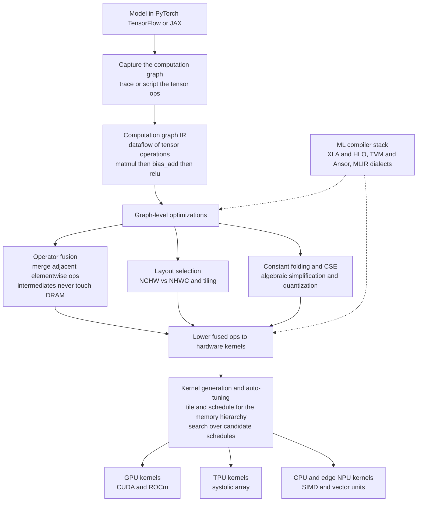

# ⚙️ Compilers for Machine Learning

> [!abstract] TL;DR
> An **ML compiler** (XLA, TVM, MLIR, `torch.compile`) takes a deep-learning model — expressed as a **computation graph of tensor operations** in PyTorch, TensorFlow, or JAX — and compiles it into fast, hardware-specific code for a GPU, TPU, CPU, or edge NPU. It exists to solve two problems at once. **First**, naive execution runs each tensor op as its own kernel, and since ML kernels are overwhelmingly **memory-bandwidth bound**, that means constantly writing intermediate tensors out to DRAM and reading them straight back — wasted traffic. The single most important optimization, **operator fusion**, merges adjacent ops (especially elementwise ones) into one kernel so intermediates never touch memory. **Second**, there is an **M-by-N explosion**: many frameworks times many hardware targets. Rather than hand-write every combination, ML compilers use a shared **graph IR** plus a **lowering** pipeline — exactly the M-plus-N trick a classic compiler uses with a shared IR. On top of fusion they do constant folding, layout selection, quantization, and **auto-tuned** kernel generation (tiling and scheduling for the memory hierarchy). It is fundamentally *classic compiler technology applied to tensors* — fusion is loop fusion, layout is data-layout optimization, auto-tuning is profile-guided scheduling — and because the efficiency of every large model depends on it, it is one of the hottest areas in systems today.

---

## Intuition

**Analogy — the dishwasher vs the assembly line.** A neural network is really a *recipe* made of thousands of enormous matrix operations. Imagine you have to wash a giant pile of dishes, and the recipe is: **wash** every dish, then **dry** every dish, then **put away** every dish. The naive way is to run three completely separate passes: wash all thousand dishes and stack them wet on the counter, then come back and dry all thousand, re-stacking them, then come back a *third* time and put them all away. Each pass re-handles the entire pile — you move every dish onto the counter and pick it back up again, three times over. All that shuffling to and from the counter is wasted motion.

A smart worker instead sets up an **assembly line**: pick up *one* dish, wash it, dry it, and put it away in a single motion, then move to the next. Each dish is handled once, and the intermediate "wet-but-not-dry" pile on the counter never exists.

That counter is **DRAM (memory)**, the "wet stack" and "dry stack" are **intermediate tensors**, and the wasted trips back and forth are **memory-bandwidth traffic** — the actual bottleneck on a modern GPU, whose compute units sit idle waiting for data far more often than they run out of arithmetic. An **ML compiler** is the worker who reads the *whole* recipe first, sees that "wash → dry → put away" can be **fused** into one streamlined pass, reorders and re-lays-out the work, and then picks the exact hand tools tuned for *this* kitchen — this specific GPU or TPU. Naive framework execution is the three-pass dishwasher; the compiler turns it into the assembly line.

---

## How It Works

### Core Mechanics

**1. Capture the model as a computation graph (the high-level IR).** A model like `out = relu(bias_add(matmul(x, W)))` is not compiled from Python source; it is captured as a **dataflow graph** whose nodes are **tensor operations** (matmul, conv, add, relu, softmax) and whose edges are the tensors flowing between them. This graph *is* the ML compiler's high-level IR — the tensor-domain analogue of the [[Intermediate_Representations|classic IR]] a general compiler builds. Two capture styles exist: **tracing** runs the model once with example inputs and records the ops that fire (fast, but bakes in control flow), and **scripting** analyzes the source to preserve `if`/`for` (more general, harder). This is also the **static vs dynamic graph** distinction — TensorFlow 1.x and JAX build a static graph ahead of time, while eager PyTorch is dynamic until `torch.compile` captures a graph on the fly.

**2. The M-by-N problem, solved by a shared IR.** There are *many* frameworks (PyTorch, TensorFlow, JAX) times *many* hardware targets (NVIDIA GPUs, AMD GPUs, Google TPUs, Apple's Neural Engine, x86/ARM CPUs, edge NPUs). Writing an optimized backend for every framework-target pair is `M × N` engineering. The classic compiler answer — a **shared intermediate representation** — collapses this to `M + N`: every framework lowers *into* the common graph IR, and every hardware target is reached by lowering *out of* it. **MLIR** and **ONNX** are the industry's shared IRs; this is precisely the same insight that lets LLVM support many languages and many chips through one IR.

**3. Graph-level optimizations.** On the captured graph, the compiler runs transformations that are direct tensor analogues of [[Local_and_Global_Optimizations|classic optimizations]]:
- **Operator fusion — the single most important one.** Adjacent ops (above all *elementwise* chains like `bias_add → relu → dropout`) are merged into **one kernel**. Instead of each op reading its input from DRAM and writing its output back, the fused kernel reads once, does all the arithmetic in registers, and writes once — the intermediate tensors are **never materialized**. Because ML is memory-bandwidth bound, this is the dominant win.
- **Constant folding, common-subexpression elimination, algebraic simplification** — precompute constant subgraphs, deduplicate identical subgraphs, simplify identities (`x + 0`, `matmul` followed by `transpose` reassociation).
- **Layout / format selection** — choosing **NCHW vs NHWC** tensor memory layout to match what the hardware's kernels prefer; the wrong layout forces expensive transposes.
- **Quantization** — lowering `float32` to `int8`/`fp8` so tensors are smaller (less traffic) and integer units run faster, primarily for inference.

**4. Kernel generation and auto-tuning.** Fused ops must be **lowered** to actual device code. This is where classic **loop machinery** returns: the compiler must **tile** the computation into blocks that fit the register file and shared memory, **schedule** the loops for the memory hierarchy, and map work onto thousands of GPU threads. The key idea (from **Halide**, adopted by **TVM**) is to **separate the algorithm from the schedule** — *what* to compute is written once, while *how* to compute it (tile sizes, loop order, vectorization, unrolling — see [[Loop_Optimizations]]) is a searchable knob. **Auto-tuning** (TVM's **Ansor**, XLA's autotuner) then *searches* over thousands of candidate schedules, benchmarks them on the real hardware, and keeps the fastest — the tensor-world version of profile-guided, machine-specific scheduling. The **polyhedral model** provides the formal framework for legal loop transformations here.

**5. Training vs inference compilation.** The two workloads pull in different directions. **Inference** favors **latency**, aggressive **quantization**, and small deployment footprints (a fixed forward graph). **Training** favors **throughput**, must carry the **backward pass** (autodiff produces a much larger graph of gradient ops), and keeps activations around for the gradient — so fusion and memory planning matter even more, and rematerialization (recompute instead of store) becomes a lever.

**6. Distributed / large-model compilation.** A model too big for one accelerator must be **partitioned** across many. Compilers like XLA's **GSPMD/SPMD partitioner** take sharding annotations and automatically insert the collective communication (all-reduce, all-gather) and split every op across devices — turning [[Distributed_Training_Overview|distributed training]] into a compiler pass rather than manual plumbing.

### Flow / Architecture



*Every framework funnels into one shared graph IR (the `M + N` trick), gets optimized at the graph level with fusion as the headline pass, then is lowered and auto-tuned down to kernels for whichever accelerator is present.*

---

## Key Concepts

### Secondary (intuition-level)
- **A model is a recipe of huge matrix operations.** Running them one at a time, each writing its result to memory and reading it back, wastes most of the time shuffling data.
- **Fusion = the assembly line.** Combine "wash, dry, put away" into one pass per dish so the half-finished piles never exist. That is operator fusion, and it is the biggest single speedup.
- **Right tool for the kitchen.** The same recipe should run well on a GPU, a TPU, or a phone chip; the compiler picks hardware-specific kernels for each.
- **The bottleneck is memory, not math.** Modern accelerators can multiply faster than they can fetch numbers — so *moving less data* is what makes models fast.

### Undergraduate (mechanism-level)
- **Computation graph IR.** The model as a dataflow graph of tensor ops; static vs dynamic graphs; tracing vs scripting to capture it.
- **The M-by-N explosion and the shared IR.** Many frameworks times many chips; a common IR (MLIR, ONNX) collapses `M × N` backends to `M + N`, exactly like [[Intermediate_Representations|a classic compiler IR]].
- **Operator fusion.** Merging adjacent/elementwise ops into one kernel to avoid materializing intermediate tensors — the core memory-traffic win.
- **The other graph passes.** Constant folding, CSE, algebraic simplification, layout selection (NCHW vs NHWC), and quantization.
- **Lowering and kernels.** Fused ops are lowered to device kernels; tiling and scheduling map them onto the GPU's threads and memory hierarchy.
- **The classic-compiler correspondence.** Fusion = loop fusion; layout = data-layout optimization; auto-tuning = profile-guided scheduling. ML compilers reuse decades of [[Loop_Optimizations|loop-optimization]] theory on tensors.

### Graduate (design-tradeoff-level)
- **Algorithm vs schedule separation.** Halide's central idea, adopted by TVM: express *what* to compute once, then search the space of *how* (tile sizes, loop order, vectorization). Decouples correctness from performance tuning.
- **Auto-tuning and cost models.** TVM's **Ansor** and XLA's autotuner search over huge schedule spaces, using learned cost models plus on-device measurement — the tensor analogue of PGO-driven scheduling. The **polyhedral model** gives the legality theory for the loop transforms.
- **MLIR and multi-level lowering.** A framework of composable **dialects** (from high-level tensor ops down through loops, vectors, and LLVM IR) that lets a compiler lower *progressively* rather than in one leap — the reusable infrastructure unifying ML, HPC, and hardware compilation. Built on LLVM; the natural successor pattern to a single fixed IR.
- **Fusion boundaries and reduction fusion.** Elementwise chains fuse trivially; fusing across **reductions** (softmax, layernorm, attention) or into matmul epilogues is harder but hugely valuable — e.g. **FlashAttention** is fundamentally a fusion + tiling story that keeps the attention matrix off DRAM.
- **Training-graph compilation.** Autodiff doubles the graph; the compiler must plan activation memory, choose **rematerialization** vs storage, and fuse backward ops — memory planning is as important as speed.
- **Hardware/software co-design.** Matching the compiler to the accelerator's memory hierarchy and compute units: **systolic arrays** (TPU) want big fused matmuls with specific tiling; [[GPU_Architecture_and_CUDA|GPU]] tensor cores want particular shapes and layouts. The compiler is co-designed with the chip.
- **Distributed partitioning.** GSPMD/SPMD sharding as automatic graph transformation, inserting collectives to run one logical model across many devices.

---

## Python Demo

We model the headline optimization directly: **operator fusion on a tensor computation graph**. The graph is `out = relu(bias_add(matmul(x, W)))`. We first show that running each op separately **materializes intermediate tensors** (extra DRAM traffic), while **fusing** the elementwise `bias_add + relu` into one pass avoids the intermediate — and produces bitwise-identical output. Then, because ML kernels are **memory-bandwidth bound**, we *model and plot* the elementwise memory traffic (and the resulting bandwidth-bound time) with vs without fusion as the tensor grows, showing why fusion is *the* ML-compiler optimization. Pure `numpy` + `matplotlib`.

```python
# Demonstrates OPERATOR FUSION -- the single most important ML-compiler
# optimization -- on a small tensor COMPUTATION GRAPH:
#
#     out = relu( bias_add( matmul(x, W) ) )
#
# The two ELEMENTWISE ops (bias_add, relu) sit after the matmul.
#
# UNFUSED: each op is its own kernel -> it READS its whole input tensor from
#          DRAM and WRITES its whole output tensor back, so an intermediate
#          tensor is MATERIALIZED between every op.
# FUSED:   bias_add and relu are compiled into ONE kernel that reads the
#          matmul output ONCE, adds the bias, applies relu, and writes ONCE --
#          the intermediate never touches DRAM.
#
# ML kernels are almost always MEMORY-BANDWIDTH bound, so execution time is
# proportional to bytes moved. We (1) verify fused == unfused numerically,
# then (2) MODEL and PLOT elementwise memory traffic vs tensor size.

import numpy as np
import matplotlib.pyplot as plt

BYTES = 4  # float32
rng = np.random.default_rng(0)

def unfused(x, W, b):
    """Every op materializes a full intermediate tensor in DRAM."""
    y = x @ W                  # matmul   -> writes y
    z = y + b                  # bias_add -> reads y, writes z   (intermediate!)
    out = np.maximum(z, 0.0)   # relu     -> reads z, writes out (intermediate!)
    return out, 3              # THREE tensors materialized (y, z, out)

def fused(x, W, b):
    """bias_add + relu fused into one elementwise pass: z never stored."""
    y = x @ W                        # matmul still writes y
    out = np.maximum(y + b, 0.0)     # ONE pass over y -> out, z stays in regs
    return out, 2                    # only TWO tensors materialized (y, out)

# ---- 1. correctness: fusion must NOT change the math --------------------
x = rng.standard_normal((64, 128)).astype(np.float32)
W = rng.standard_normal((128, 256)).astype(np.float32)
b = rng.standard_normal((256,)).astype(np.float32)
o_unf, n_unf = unfused(x, W, b)
o_fus, n_fus = fused(x, W, b)
print("fused output matches unfused output:", np.allclose(o_unf, o_fus, atol=1e-5))
print(f"tensors materialized -- unfused: {n_unf}, fused: {n_fus} "
      f"(fusion removes the intermediate)")

# ---- 2. model ELEMENTWISE DRAM traffic vs tensor size -------------------
# N = number of output elements. Counting read+write passes over an N-tensor:
#   UNFUSED: bias_add reads N + writes N (2N)  and  relu reads N + writes N (2N)
#            = 4N elements  ->  an intermediate z of N elements is materialized
#   FUSED  : read N (the matmul output) + write N (the result) = 2N elements
#            ->  NO intermediate materialized
def elementwise_traffic_bytes(N, is_fused):
    passes = 2 if is_fused else 4          # read+write passes over the N-tensor
    return passes * N * BYTES

sizes = np.array([2 ** k for k in range(10, 25)])          # ~1K .. 16M elements
unf_mb = np.array([elementwise_traffic_bytes(N, False) for N in sizes]) / 1e6
fus_mb = np.array([elementwise_traffic_bytes(N, True)  for N in sizes]) / 1e6

BW = 1500e9                                                # ~1.5 TB/s GPU HBM
unf_ms = unf_mb * 1e6 / BW * 1e3
fus_ms = fus_mb * 1e6 / BW * 1e3

# ---- 3. plot ------------------------------------------------------------
fig, (axL, axR) = plt.subplots(1, 2, figsize=(13, 5.2))

axL.plot(sizes, unf_mb, "o-", color="#d62728",
         label="unfused: 4N traffic, z materialized")
axL.plot(sizes, fus_mb, "s-", color="#2ca02c",
         label="fused: 2N traffic, no intermediate")
axL.set_xscale("log", base=2); axL.set_yscale("log", base=10)
axL.set_xlabel("tensor size N (elements, log2)")
axL.set_ylabel("elementwise DRAM traffic (MB, log10)")
axL.set_title("Operator fusion halves memory traffic\n(gap grows with N)")
axL.legend(fontsize=8); axL.grid(True, which="both", alpha=0.3)

axR.plot(sizes, unf_ms, "o-", color="#d62728", label="unfused")
axR.plot(sizes, fus_ms, "s-", color="#2ca02c", label="fused")
axR.set_xscale("log", base=2)
axR.set_xlabel("tensor size N (elements, log2)")
axR.set_ylabel("modeled kernel time (ms) at 1.5 TB/s")
axR.set_title("Memory-bandwidth bound: fewer bytes -> faster\nfusion is a ~2x elementwise win")
axR.legend(fontsize=9); axR.grid(True, alpha=0.3)

plt.tight_layout()
plt.savefig("operator_fusion_memory_traffic.png", dpi=130)

speedup = unf_mb[-1] / fus_mb[-1]
print(f"At N={sizes[-1]:,} elements: unfused {unf_mb[-1]:.1f} MB vs fused "
      f"{fus_mb[-1]:.1f} MB -> {speedup:.1f}x less elementwise DRAM traffic, "
      f"and one fewer tensor materialized.")
print("Saved operator_fusion_memory_traffic.png")
```

**What to notice.** The fused version produces the *identical* result yet materializes **two** tensors instead of three — the intermediate `z` lives only in registers and never hits DRAM. The model then makes the payoff quantitative: the unfused elementwise region moves `4N` elements while the fused one moves `2N`, so fusion is a clean **2x** reduction in memory traffic, and the absolute gap **grows with N**. Because these kernels are bandwidth-bound, the right-hand plot shows time tracking traffic one-for-one — fewer bytes moved *is* less time. This is exactly why a real ML compiler fuses `bias_add + relu + dropout + add-residual` chains into single kernels, and why fused attention (FlashAttention) is such a large win: the giant intermediate matrix simply never gets written to memory.

---

## Real-World Applications

> **Example — XLA compiling JAX and TensorFlow.** When you wrap a JAX function in `jax.jit` (or run a TensorFlow model with XLA enabled), the framework traces it into **HLO** (High-Level Optimizer IR), XLA's tensor graph IR. XLA then runs graph-level passes — **operator fusion** (its headline optimization), algebraic simplification, layout assignment, and buffer/memory planning — and lowers the result to **TPU** kernels (mapped onto the systolic array) or to **GPU** kernels via LLVM. The fusion pass is exactly what turns a chain of elementwise ops into one kernel so activations stay off HBM. This is why `jax.jit` routinely delivers multi-fold speedups over eager execution on the same hardware.

Where ML compilers show up in production:

- **XLA (TensorFlow, JAX).** The HLO-based compiler powering Google's TPUs and much GPU execution; fusion + layout + memory planning are its core.
- **`torch.compile` / TorchInductor (PyTorch 2.x).** Captures eager PyTorch graphs with **TorchDynamo**, optimizes them, and generates fused GPU kernels — largely by emitting **Triton**, a Python-embedded kernel language that makes writing fused, tiled GPU kernels tractable. This brought ahead-of-time-style compilation to the eager framework most researchers use.
- **Apache TVM.** The open compiler stack with **Ansor** auto-tuning; deploys one model to CPUs, GPUs, and a wide range of **edge NPUs** by searching schedules per target.
- **MLIR.** The multi-level IR framework (from the LLVM project) whose **dialects** unify ML compilation with HPC and hardware design; **IREE** is an MLIR-based end-to-end runtime for mobile/edge.
- **Inference-focused stacks.** **ONNX Runtime**, **TensorRT**, and **Glow** compile trained models for low-latency, often quantized, deployment — the inference side of the training/inference split.
- **FlashAttention.** Not a general compiler, but the canonical proof of the thesis: hand-fusing and tiling the attention computation so the `N×N` score matrix never materializes in HBM gives large speedups and memory savings — exactly what an ML compiler tries to automate.

---

## Common Pitfalls

- **Assuming ML is compute-bound.** Most elementwise and normalization kernels are **memory-bandwidth bound**, not FLOP-bound. Optimizing arithmetic while ignoring data movement misses the actual bottleneck — the whole point of fusion is *traffic*, not math. Measure the roofline before tuning.
- **Graph breaks kill fusion.** Data-dependent Python control flow, unsupported ops, or `.item()`/`print()` calls force the compiler to *break* the graph into separately-compiled fragments, and **you cannot fuse across a graph break**. In `torch.compile` these show up as silent perf cliffs; find and remove them.
- **Dynamic shapes defeat specialization.** Compilers specialize and auto-tune for concrete tensor shapes. Constantly changing sequence lengths or batch sizes trigger endless **recompilation** (or fall back to slow generic kernels). Use padding/bucketing or explicit dynamic-shape support.
- **Compilation and auto-tuning cost time.** The first call pays for tracing, optimization, and (for TVM/XLA) a schedule *search* that can take minutes to hours. This is amortized over many inferences/steps but is a real tax on short jobs and cold starts — cache compiled artifacts.
- **Fusion is not free of numerics.** Reassociating floating-point ops or fusing in lower precision changes rounding; a fused kernel can differ from the unfused reference in the last bits. Usually fine, occasionally the cause of a "why did my loss change after `jit`?" bug.
- **Wrong layout, silent transposes.** Feeding NHWC data to a kernel tuned for NCHW (or vice versa) forces the compiler to insert transposes that can dominate runtime. Let the compiler choose layout, and do not fight it with hand-set formats.
- **Expecting fusion to fix a bad algorithm.** A compiler reorganizes *how* your ops run; it will not replace an `O(n^2)` attention with a better algorithm or shrink an over-parameterized model. Architecture and algorithm choices dominate; the compiler optimizes what you give it.

---

## Related Concepts

- [[Intermediate_Representations]] — the ML-compiler graph IR (HLO, MLIR, ONNX) is the tensor-domain version of a classic compiler IR, and the shared IR is what collapses the M-by-N backend explosion to M-plus-N.
- [[Local_and_Global_Optimizations]] — constant folding, CSE, and algebraic simplification reappear on the tensor graph exactly as they do on scalar IR.
- [[Loop_Optimizations]] — tiling, fusion, unrolling, and vectorization are the loop transforms an ML compiler applies when it lowers fused ops to kernels; operator fusion *is* loop fusion on tensors.
- [[Domain_Specific_Languages]] — tensor DSLs (Halide, TVM, Triton, JAX, MLIR dialects) are the frontier where DSLs and compilers merge; this note is the ML instance of that idea.
- [[The_Future_of_Compilers]] — MLIR dialects and domain-specific compilers are a central theme of where compilation is heading; ML compilers are the leading example.
- [[Neural_Network_Basics]] — the models whose computation graphs these compilers consume; understanding the layers explains which ops get fused.
- [[Backpropagation]] — training compilation must also compile the backward pass, roughly doubling the graph and making memory planning central.
- [[GPU_Architecture_and_CUDA]] — the dominant target; the memory hierarchy and tensor cores the compiler tiles and schedules for, and why data movement is the bottleneck.
- [[NUMA_and_Memory_Bandwidth]] — the bandwidth wall that makes fusion the headline optimization; ML kernels are bound by bytes moved, not FLOPs.
- [[Cache_Hierarchy]] — the same locality logic that drives tiling and blocking on CPUs, reused for GPU shared memory and registers.
- [[SIMD_and_Vector_ISA]] — the CPU/NPU vector units a lowered, fused kernel ultimately targets.
- [[Quantization]] — a graph-level pass (float32 to int8/fp8) that shrinks tensors and speeds inference, especially valuable on the inference path.
- [[Distributed_Training_Overview]] — large models are partitioned across accelerators by a compiler pass (GSPMD/SPMD) that inserts the collective communication automatically.

Not-yet-written Compilers siblings referenced in prose: `Parallelizing_and_GPU_Compilation` (kernel/GPU code generation and the polyhedral model), `Compiler_Toolchains_and_LLVM` (LLVM and MLIR, the shared-IR and lowering machinery), and `Profile_Guided_and_Adaptive_Optimization` (the PGO/auto-tuning analogue).

---

## Review Questions

1. **(Conceptual)** ML compilers call **operator fusion** their single most important optimization, yet fusion does not reduce the number of arithmetic operations at all — a fused `bias_add + relu` does the same adds and comparisons as the unfused version. Explain precisely *why* it still produces a large speedup. Your answer must reference intermediate-tensor materialization, DRAM traffic, and the fact that these kernels are memory-bandwidth bound rather than compute bound.
2. **(Scenario)** You must deploy the *same* trained transformer to (a) a fleet of NVIDIA data-center GPUs for high-throughput serving and (b) an ARM-based mobile phone for on-device inference. Explain how the **M-by-N problem** and a **shared IR** let one compiler stack handle both, which graph-level passes you would prioritize differently for the two targets (think latency, quantization, layout), and why writing hand-tuned kernels for every framework-target pair does not scale.
3. **(Trade-off)** TVM's **Ansor** can *auto-tune* a kernel by searching thousands of candidate schedules and benchmarking them on the real device, often beating a hand-written baseline — but the search can take minutes to hours. Relate this directly to **profile-guided optimization** in classic compilers. When is paying that one-time search cost clearly worth it, when is it not, and how do **dynamic shapes** change the calculus?

---

## Sources

- Chen, T. et al. "TVM: An Automated End-to-End Optimizing Compiler for Deep Learning." *OSDI*, 2018 — the open ML compiler stack, algorithm/schedule separation, and auto-tuning ([tvm.apache.org](https://tvm.apache.org/)).
- Lattner, C. et al. "MLIR: Scaling Compiler Infrastructure for Domain Specific Computation." *CGO*, 2021 — the multi-level IR and dialect framework unifying ML compilation ([mlir.llvm.org](https://mlir.llvm.org/)).
- Ansel, J. et al. "PyTorch 2: Faster Machine Learning Through Dynamic Python Bytecode Transformation and Graph Compilation." *ASPLOS*, 2024 — TorchDynamo/TorchInductor and Triton-based kernel generation ([pytorch.org](https://pytorch.org/)).
- Ragan-Kelley, J. et al. "Halide: A Language and Compiler for Optimizing Parallelism, Locality, and Recomputation in Image Processing Pipelines." *PLDI*, 2013 — the algorithm-vs-schedule idea ML compilers adopted ([halide-lang.org](https://halide-lang.org/)).
- The XLA team. "XLA: Optimizing Compiler for Machine Learning." Google/OpenXLA documentation — HLO IR, fusion, layout, and the TPU/GPU backends ([openxla.org](https://openxla.org/xla)).

---

#compilers #ml-compilers #operator-fusion #xla-tvm #tensor-compilers
