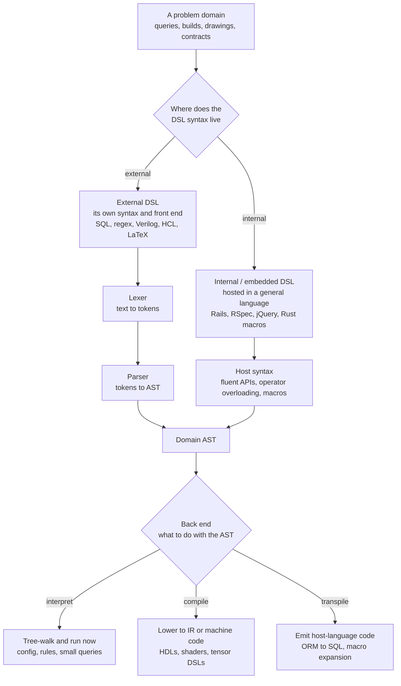

# 🧩 Domain-Specific Languages

> [!abstract] TL;DR
> A **domain-specific language (DSL)** is a *small* programming or notation language purpose-built for **one problem domain** — SQL for querying data, regular expressions for text patterns, HTML/CSS for documents, Make for builds, Terraform for infrastructure. It deliberately **trades generality for expressiveness**: it cannot do everything, but within its domain the vocabulary *is* the domain, so an expert states intent almost directly instead of encoding it in a general-purpose language. DSLs come in two flavours — **external** (their own syntax, lexer, parser, and processor — full freedom, full build cost) and **internal / embedded** (built *inside* a host language using fluent APIs, operator overloading, or macros — cheaper, and you inherit the host's tooling). However you implement one — **interpret** it, **compile** it, or **transpile** it to a host language — you are reusing the exact front-end machinery of a real compiler, which is why *DSLs are compiler technology's single most common real-world application*: nearly every engineer builds or uses one, most without noticing.

---

## Intuition

**Analogy — the Swiss Army knife vs the corkscrew.** A **general-purpose language** (Python, Java, C) is a Swiss Army knife: it has a blade, a screwdriver, scissors, a file — it does *everything* adequately, so you carry one and reach for it whatever the task. A **domain-specific language** is a dedicated **corkscrew**: useless for cutting rope or driving screws, but for the one job of pulling a cork it is *perfect and effortless* — no fiddling, no improvising, the tool's shape *is* the solution to the problem.

That is exactly the bargain of a DSL. `SELECT name FROM users WHERE age > 30` is a corkscrew for data: it says *what* you want with the vocabulary of tables and rows, and cannot do arithmetic loops or open a socket — nor should it. `\d{3}-\d{4}` is a corkscrew for text patterns. `<h1>Title</h1>` is a corkscrew for documents. Each is a **tiny language whose entire vocabulary is its domain**, so a domain expert — not just a programmer — reads and writes it, expressing intent directly instead of buried inside general-purpose control flow.

---

## How It Works

### Core mechanics: a DSL is a small compiler or interpreter

Building a DSL means answering two orthogonal questions, and every DSL is a point in the grid they form.

**Question 1 — where does the syntax live?**

1. **External DSL.** The language has its *own* concrete syntax, unconstrained by any host. You write a **lexer** (see [[Lexical_Analysis_and_Tokenization]]) that turns the raw text into tokens, a **parser** (see [[Top_Down_and_Recursive_Descent_Parsing]]) that turns tokens into an **abstract syntax tree** (see [[Abstract_Syntax_Trees_and_Parser_Design]]), and a **processor** that walks that tree. You get *total freedom* over notation — SQL, regex, Verilog, GLSL, Terraform's HCL, LaTeX all look nothing like a host language — at the cost of building (and documenting, and tooling) an entire front end. This is where classic compiler machinery is reused wholesale.
2. **Internal / embedded DSL.** The DSL is *hosted inside a general-purpose language* and is really just an especially fluent library. It borrows the host's lexer, parser, type checker, debugger, and editor support for free. You shape the "language" with the host's own features: **method chaining** and **fluent interfaces** (`query.select(...).where(...).limit(10)`), **operator overloading** (a matrix DSL redefining `*`), **blocks / higher-order functions** (RSpec's `describe ... do ... end`), or **macros** that rewrite syntax at compile time (Lisp, Rust, Scala). Cheaper to build and instantly tool-supported, but *forever constrained by the host's grammar* — you cannot invent syntax the host cannot parse.

**Question 2 — what happens to the parsed program?** Three back-end strategies, all reusing standard compiler stages:

- **Interpret it.** Tree-walk the DSL's AST and act immediately (see [[Interpreters_and_Tree_Walking]]). Ideal for config, rule engines, and small queries where workloads are tiny and simplicity wins.
- **Compile it.** Lower the AST to an **intermediate representation** (see [[Intermediate_Representations]]) or straight to machine code. Hardware-description languages, GPU **shaders**, and machine-learning **tensor DSLs** do this to get real performance.
- **Transpile / generate code.** Emit source in a host language and hand it off — an ORM turning a query DSL into SQL text, a macro expanding into host AST nodes, a parser generator emitting a parser. The "output" is more code, not a result.

The domain focus is what pays for the effort: because the language *only* describes one domain, its processor can **optimise within that domain** — a SQL engine runs a cost-based **query planner** (see [[Query_Optimizer]]) to reorder joins; a tensor DSL fuses loops and picks tile sizes a general compiler could never infer.

### External vs internal DSLs, and the three back ends



The diagram is the whole design space: **pick a hosting strategy** (own syntax vs borrow the host's), which decides how you *get* an AST, then **pick a back end** (interpret, compile, or transpile), which decides what you *do* with it. Every DSL you have ever used sits somewhere on this grid, and every path funnels through an AST — the same structure a general compiler builds.

---

## Key Concepts

### Secondary (intuition-level)
- **A DSL is a tiny language for one job.** SQL for data, regex for patterns, HTML for pages — narrow on purpose, and unbeatable inside its lane.
- **Generality traded for expressiveness.** A DSL cannot do everything, but within its domain you say *what* you want, not *how* to compute it step by step.
- **Domain experts can read it.** Because the vocabulary is the domain, an analyst can read a SQL query and an accountant can read a spreadsheet formula without being a programmer.
- **You already use dozens.** Config files (YAML), builds (Make), styling (CSS), shell scripts, and search patterns are all DSLs — most people never call them "languages."

### Undergraduate (mechanism-level)
- **External vs internal DSLs.** External = own syntax + own lexer/parser/processor (max freedom, max cost). Internal = a fluent library inside a host language (borrows the host's tooling, bounded by its grammar).
- **The reused front end.** Every external DSL is a small compiler: lexer to tokens, parser to AST, then interpret/compile/transpile. Learning one DSL implementation teaches you all of them.
- **Fluent interfaces and combinators.** Internal DSLs are built from **method chaining**, **operator overloading**, **blocks/lambdas**, and **parser combinators** — small pieces that compose into larger domain expressions.
- **Three back ends.** *Interpret* (walk the AST now), *compile* (lower to IR/machine code), *transpile* (emit code in another language). Same AST, different fate.
- **Language workbenches.** Tools that industrialise DSL building: parser generators **ANTLR** and **tree-sitter**, **Xtext**, and **JetBrains MPS** (projectional editing, where you edit the AST directly rather than text).

### Graduate (design-tradeoff-level)
- **Metaprogramming and macros — code that writes code.** **Lisp** macros operate on the program's own list-structured AST; **Rust** and **Scala** macros and C++ **template metaprogramming** run at *compile time* to generate specialised code. A macro *is* an AST-to-AST transformation (see [[Abstract_Syntax_Trees_and_Parser_Design]]), which is why macro-heavy internal DSLs blur into "just another front end."
- **Hygiene.** A **hygienic macro** guarantees that identifiers it introduces cannot accidentally capture (or be captured by) names at the use site — the macro's `temp` variable will never clash with the caller's `temp`. Non-hygienic macros (raw C `#define`) leak, causing infamous double-evaluation and name-capture bugs; hygiene is the correctness backbone of serious macro systems.
- **The abstraction-level dial.** DSL design is choosing *how high* to lift the vocabulary above the machine: too low and it is just an API; too high and it becomes a leaky, magical framework nobody can debug. Good DSLs "make the common case trivial and the rare case possible."
- **Optimisation as the payoff.** A closed domain enables whole-program reasoning a general compiler cannot do: a **cost-based query planner** reorders relational operators; a **tensor DSL** (Halide, TVM, Triton, and the MLIR ecosystem) fuses operators, tiles loops, and targets GPUs from a high-level spec. This is the leading edge where *DSLs and compilers fully merge* — the sibling notes `Compilers_for_Machine_Learning` and `The_Future_of_Compilers` (MLIR dialects as per-domain compilers) develop this.
- **Language-oriented programming.** The philosophy of solving a problem by first *designing the language* in which the solution is natural, then implementing that language — DSLs as the primary unit of abstraction rather than functions or objects.

---

## Python Demo

We **design and implement a tiny external DSL from scratch** — a mini **turtle-drawing language** — by writing the full front end (a **lexer**, a **recursive-descent parser** producing an AST, and a **tree-walking interpreter**), reusing the exact techniques from [[Lexical_Analysis_and_Tokenization]], [[Top_Down_and_Recursive_Descent_Parsing]], and [[Interpreters_and_Tree_Walking]]. Two DSL programs then show how a single line of *domain intent* (`repeat 5 [ forward 200 right 144 ]`) replaces a dozen lines of general-purpose trigonometry, and we **visualise the DSL's output** — the drawn figures — with matplotlib. Pure standard library plus matplotlib.

```python
"""
A tiny EXTERNAL DSL called 'Turtle' -- a mini drawing language.
We build the whole front end (LEXER -> PARSER -> AST -> INTERPRETER),
exactly the machinery of a real compiler, then run DSL programs and draw them.

Grammar (EBNF-ish):
    program   := statement*
    statement := 'forward' NUMBER | 'back' NUMBER
               | 'right' NUMBER   | 'left' NUMBER
               | 'penup' | 'pendown'
               | 'color' WORD
               | 'repeat' NUMBER '[' statement* ']'
Comments start with '#'. That is the ENTIRE language -- and that is the point.
"""
import math
import re
import matplotlib.pyplot as plt

# ---- 1. LEXER: raw text -> a flat stream of tokens -----------------------
TOKEN_SPEC = [
    ("NUMBER",  r"\d+\.?\d*"),      # 200, 3.5
    ("LBRACK",  r"\["),
    ("RBRACK",  r"\]"),
    ("WORD",    r"[A-Za-z]+"),      # commands AND color names
    ("SKIP",    r"[ \t\r\n]+"),
    ("COMMENT", r"#[^\n]*"),
]
MASTER = re.compile("|".join(f"(?P<{n}>{p})" for n, p in TOKEN_SPEC))

def tokenize(src):
    tokens = []
    for m in MASTER.finditer(src):
        kind, val = m.lastgroup, m.group()
        if kind in ("SKIP", "COMMENT"):
            continue                       # whitespace/comments carry no meaning
        tokens.append((kind, val))
    tokens.append(("EOF", ""))
    return tokens

# ---- 2. PARSER: tokens -> AST, by recursive descent ----------------------
# AST nodes are simple tuples, e.g. ("forward", 200.0) or ("repeat", 5, [...]).
class Parser:
    def __init__(self, tokens):
        self.toks, self.i = tokens, 0
    def peek(self):   return self.toks[self.i]
    def advance(self):
        t = self.toks[self.i]; self.i += 1; return t
    def expect(self, kind):
        t = self.advance()
        if t[0] != kind:
            raise SyntaxError(f"expected {kind}, got {t!r}")
        return t
    def parse_program(self, until="EOF"):
        stmts = []
        while self.peek()[0] != until:
            stmts.append(self.parse_statement())
        return stmts
    def parse_statement(self):
        kind, val = self.advance()
        if kind != "WORD":
            raise SyntaxError(f"expected a command, got {val!r}")
        cmd = val.lower()
        if cmd in ("forward", "back", "right", "left"):
            return (cmd, float(self.expect("NUMBER")[1]))
        if cmd in ("penup", "pendown"):
            return (cmd,)
        if cmd == "color":
            return ("color", self.expect("WORD")[1])
        if cmd == "repeat":                       # a control-flow construct
            n = int(float(self.expect("NUMBER")[1]))
            self.expect("LBRACK")
            body = self.parse_program(until="RBRACK")   # recurse for the block
            self.expect("RBRACK")
            return ("repeat", n, body)
        raise SyntaxError(f"unknown command {cmd!r}")

# ---- 3. INTERPRETER: tree-walk the AST, driving a turtle -----------------
class Turtle:
    def __init__(self):
        self.x = self.y = 0.0
        self.heading = 0.0        # degrees; 0 = east, counter-clockwise positive
        self.pen, self.color = True, "black"
        self.segments = []        # (x0, y0, x1, y1, color) -- the DSL's output
    def move(self, dist):
        rad = math.radians(self.heading)
        nx, ny = self.x + dist * math.cos(rad), self.y + dist * math.sin(rad)
        if self.pen:
            self.segments.append((self.x, self.y, nx, ny, self.color))
        self.x, self.y = nx, ny

def run(ast, t):
    for node in ast:                              # walk each statement in order
        op = node[0]
        if   op == "forward":  t.move(node[1])
        elif op == "back":     t.move(-node[1])
        elif op == "right":    t.heading -= node[1]
        elif op == "left":     t.heading += node[1]
        elif op == "penup":    t.pen = False
        elif op == "pendown":  t.pen = True
        elif op == "color":    t.color = node[1]
        elif op == "repeat":
            for _ in range(node[1]):
                run(node[2], t)                   # RECURSE into the body subtree

# ---- Two DSL programs: pure domain intent, no trigonometry in sight ------
STAR = """
# a 5-pointed star -- ONE line of intent
color crimson
repeat 5 [ forward 200 right 144 ]
"""

ROSETTE = """
# 36 rotated squares -> a flower / rosette
color teal
repeat 36 [
    repeat 4 [ forward 100 right 90 ]
    right 10
]
"""

def render(src, ax, title):
    ast = Parser(tokenize(src)).parse_program()   # lex -> parse -> AST
    t = Turtle(); run(ast, t)                      # interpret the AST
    for x0, y0, x1, y1, c in t.segments:
        ax.plot([x0, x1], [y0, y1], color=c, lw=1.6)
    ax.set_aspect("equal"); ax.axis("off"); ax.set_title(title, fontsize=11)
    return len(t.segments)

fig, (axL, axR) = plt.subplots(1, 2, figsize=(12, 6))
n1 = render(STAR,    axL, "DSL:  repeat 5 [ forward 200 right 144 ]")
n2 = render(ROSETTE, axR, "DSL:  36 rotated squares (a rosette)")
fig.suptitle("A tiny external DSL: one line of domain intent -> a figure", fontsize=13)
plt.tight_layout()
plt.savefig("dsl_turtle_output.png", dpi=130)
print(f"Star drew {n1} segments; rosette drew {n2} segments.")
print("Saved dsl_turtle_output.png")

# ---- Why the DSL wins: the SAME star in general-purpose Python ------------
# The DSL says the intent in 1 line. General-purpose code must spell out the
# geometry -- angles, radians, running (x, y), and the loop -- every time:
print("\nEquivalent general-purpose Python for the star:")
print("""    x, y, heading = 0.0, 0.0, 0.0
    pts = [(x, y)]
    for _ in range(5):
        x += 200 * math.cos(math.radians(heading))
        y += 200 * math.sin(math.radians(heading))
        pts.append((x, y)); heading -= 144        # <- domain buried in trig""")
```

**What to notice.** The DSL program `repeat 5 [ forward 200 right 144 ]` *is* the intent — "step and turn five times" — with the domain (pen, heading, distance, repetition) baked into the vocabulary. The equivalent general-purpose Python must re-derive the geometry with `cos`, `sin`, `radians`, and a hand-managed `(x, y)` on every use; the domain idea drowns in trigonometry. Yet the "magic" is nothing more than a lexer, a 30-line recursive-descent parser, and a tree-walking interpreter — the same three stages a real compiler runs, which is precisely why *building a DSL is building a small compiler*. The rendered figure is the DSL's output made visible: the corkscrew did its one job effortlessly.

---

## Real-World Applications

> **SQL is the DSL everyone leans on.** `SELECT name FROM users WHERE age > 30 ORDER BY name` is an external, *declarative* query DSL: you state *what* rows you want, and a **cost-based query planner** (see [[Query_Optimizer]]) decides *how* — which indexes, join order, and algorithms to use. No general-purpose loop could be reordered so aggressively, because the language's narrowness is exactly what lets the engine reason about the whole query. SQL is a textbook case of the DSL bargain: give up generality, gain domain-level optimisation. See [[SQL_Fundamentals]].

DSLs are everywhere, usually unremarked:

- **Query languages.** SQL, GraphQL (see [[GraphQL_Fundamentals]]), Cypher, PromQL, and Elasticsearch's query DSL — declarative, planner-optimised, read by non-programmers.
- **Patterns and text.** **Regular expressions** are a compact external DSL for string patterns, compiled to a finite automaton before matching (see [[Python_Regular_Expressions]] and the theory in [[Regular_Expressions_and_Kleenes_Theorem]]).
- **Documents and markup.** HTML/CSS for pages, LaTeX for typesetting, Markdown for prose — declarative DSLs where the notation mirrors the artefact.
- **Build and configuration.** Make, Bazel/Starlark, YAML pipelines, and **Terraform's HCL** — declarative infrastructure and build graphs a tool executes.
- **Hardware and graphics.** **Verilog/VHDL** describe circuits; **GLSL/HLSL/WGSL** are GPU shader languages compiled to device code — DSLs that *compile* rather than interpret.
- **Machine-learning / tensor DSLs.** Halide, TVM, Triton, JAX, and MLIR dialects express array computation abstractly, then a domain compiler fuses and tiles it for CPUs/GPUs — the frontier where DSLs *are* compilers (sibling `Compilers_for_Machine_Learning`).
- **Smart contracts.** **Solidity** is a DSL for the Ethereum VM, compiled to EVM bytecode with domain-specific rules for gas and storage (see [[Solidity_Programming]]).
- **Internal / embedded DSLs.** Ruby on Rails' Active Record (`has_many :orders`), **RSpec** (`expect(x).to eq 3`), jQuery's chained selectors, and Rust/Scala macro DSLs — fluent libraries that *feel* like bespoke languages while riding on a host.

---

## Common Pitfalls

- **The "yet another language" tax.** Every DSL needs a grammar, docs, editor support, error messages, versioning, and someone to maintain the implementation. Before building an *external* DSL, ask whether a well-named library or *internal* DSL would deliver 80% of the value for 20% of the cost — you inherit the host's tooling for free.
- **Leaky abstractions.** When the DSL cannot express a needed case, users are forced to peer through it at the underlying machinery (raw SQL escape hatches in an ORM, inline assembly in a shader). Design deliberate, documented escape hatches instead of pretending the abstraction is total.
- **Over-DSLing / scope creep.** Teams keep adding variables, conditionals, functions, and modules until the "little language" has quietly reinvented a bad general-purpose language — without its tooling or community. If your config DSL grows a type system, you may have wanted a library in a real language all along.
- **Poor error messages.** A DSL's whole promise is that domain experts use it, yet a raw parser stack trace helps no one. Errors must speak the *domain's* vocabulary ("unknown table `usrs`") and point at the offending line/column — this is a first-class feature, not an afterthought.
- **Debugging generated / transpiled code.** When a DSL compiles or transpiles, the running code is not what the author wrote. Without source maps or faithful line info, stepping through machine-generated SQL or expanded macros is miserable — invest in traceability early.
- **Non-hygienic macros.** Internal DSLs built on macros can silently capture or double-evaluate identifiers if the macro system is not hygienic. Prefer hygienic macro systems (Scheme, Rust) and treat name capture as a correctness bug, not a curiosity.

---

## Related Concepts

- [[Compilers_Overview]] — the full source-to-execution pipeline; a DSL is a *scoped* instance of it, which is why DSLs are compiler technology's most common real-world application.
- [[Interpreters_and_Tree_Walking]] — the simplest DSL back end: walk the domain AST and act. The demo's turtle interpreter is exactly this pattern.
- [[Abstract_Syntax_Trees_and_Parser_Design]] — the AST every DSL funnels through, and the AST-to-AST transformation that *is* a macro.
- [[Lexical_Analysis_and_Tokenization]] — stage one of an external DSL's front end; the demo's regex-based lexer reuses it directly.
- [[Top_Down_and_Recursive_Descent_Parsing]] — the hand-written parsing technique used for the DSL demo and for most small external DSLs.
- [[Bottom_Up_and_LR_Parsing]] — the LR/bottom-up path that tools like ANTLR and yacc generate for larger, more complex DSL grammars.
- [[Intermediate_Representations]] — the IR a *compiled* DSL lowers to before code generation (shaders, tensor DSLs, HDLs).
- [[Context_Free_Grammars_for_Parsing]] — the grammar formalism in which a DSL's syntax is specified and from which its parser is derived.
- [[SQL_Fundamentals]] — the canonical declarative external query DSL that everyone uses.
- [[Query_Optimizer]] — the domain-specific optimiser SQL's narrowness makes possible; the payoff of trading generality for a closed domain.
- [[GraphQL_Fundamentals]] — a modern external query/schema DSL for APIs.
- [[Python_Regular_Expressions]] — regex as a pattern-matching DSL compiled to an automaton before use.
- [[Regular_Expressions_and_Kleenes_Theorem]] — the automata theory underpinning regex, one of the most-used DSLs on earth.
- [[Solidity_Programming]] — a DSL that compiles to EVM bytecode, with domain rules for gas and storage.

Not-yet-written Compilers siblings this note anticipates: `Compilers_for_Machine_Learning` (tensor DSLs and MLIR as domain compilers) and `The_Future_of_Compilers` (DSLs, embedded compilation, and MLIR dialects).

---

## Review Questions

1. **(Conceptual)** Using the corkscrew-vs-Swiss-Army-knife analogy, explain why a DSL like SQL can be optimised far more aggressively than the equivalent hand-written Python loop. What property of the *language* — not the engine — makes a cost-based query planner possible, and what is the price paid for that property?
2. **(Scenario)** Your team needs a way for *non-programmer analysts* to define alerting rules ("fire if error_rate > 5% for 10 minutes"). Would you build an **external** DSL with its own parser, or an **internal / embedded** DSL in your host language? Justify the choice against implementation cost, editor/tooling support, error-message quality, and who has to read and write the rules — and name one condition that would flip your decision.
3. **(Trade-off)** A DSL can be **interpreted**, **compiled**, or **transpiled** to a host language. For (a) a Terraform-style infrastructure config, (b) a GPU shader language, and (c) an ORM query builder, pick the back end each actually uses and explain why the domain's workload and performance needs drive that choice. Then explain in what precise sense a **macro** is "just another compiler front end."

---

## Sources

- Fowler, M. & Parsons, R. *Domain-Specific Languages*. Addison-Wesley, 2010 — the definitive treatment of external vs internal DSLs, fluent interfaces, and implementation patterns ([martinfowler.com/dsl.html](https://martinfowler.com/dsl.html)).
- Parr, T. *Language Implementation Patterns*. Pragmatic Bookshelf, 2010 — practical lexer/parser/interpreter recipes and the ANTLR parser generator ([antlr.org](https://www.antlr.org/)).
- Nystrom, R. *Crafting Interpreters*. Genever Benning, 2021 — building a language's front end and tree-walking interpreter end to end, the core skill behind any external DSL ([craftinginterpreters.com](https://craftinginterpreters.com)).
- Bentley, J. "Programming Pearls: Little Languages." *Communications of the ACM*, 29(8), 1986 — the classic article that named and championed small, domain-focused languages.
- Lattner, C. et al. "MLIR: Scaling Compiler Infrastructure for Domain Specific Computation." *CGO*, 2021 — reusable dialects that turn domains (including ML) into compilers ([mlir.llvm.org](https://mlir.llvm.org/)).

---

#compilers #dsl #domain-specific-language #language-design #metaprogramming
