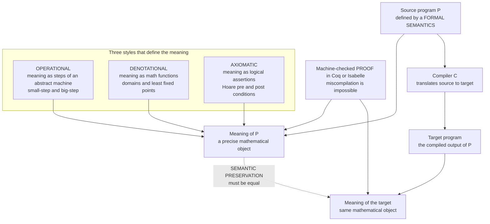

# 🧮 Formal Semantics and Verified Compilers

> [!abstract] TL;DR
> A **formal semantics** gives a programming language a **precise mathematical meaning** — not an English paragraph an engineer might misread, but a definition exact enough to *prove theorems about*. Once "what a program means" is nailed down, you can ask the hardest question in the compiler world: **does the compiler preserve meaning?** A **verified (certified) compiler** ships with a **machine-checked proof of semantic preservation** — a proof, verified by a tool like Coq, that *every* target program it emits behaves exactly like its source. Not "we tested it a lot," but "miscompilation is mathematically impossible." **CompCert** (a verified C compiler, used in avionics) and **CakeML** (a verified ML compiler) are the flagship results; **translation validation**, **abstract interpretation**, and **type-soundness proofs** are the lighter-weight cousins on the same spectrum from testing to full verification.

---

## Intuition

**Analogy — the sworn legal translator.** You hand a binding contract written in French to a translator to render into English. An *ordinary* translator hands you back a plausible-looking English contract; if a clause was subtly mistranslated, you find out only when it blows up in court. A **sworn, certified translator** does something stronger: they attach a signed *attestation* that the translation is faithful — that the English document carries **exactly the same legal meaning** as the French original, clause for clause. You do not have to re-read both and hope; the certificate *guarantees* the meaning survived the translation.

A compiler is a translator from source code to machine code, and an ordinary compiler is the plausible-looking translator: it usually preserves meaning, but a bug can silently turn a *correct* program into a *wrong* executable — and you may never notice until a plane's flight-control loop behaves subtly wrong. To even *state* "same meaning," you first need a **formal semantics**: an unambiguous mathematical definition of what the French (source) and the English (machine code) each *mean*. A **verified compiler** is the sworn translator: it carries a **machine-checked proof** that source-meaning equals target-meaning for every input. The translation is not tested into trustworthiness — it is *proven* trustworthy.

---

## How It Works

### 1. Why "meaning" has to be formal

Language standards written in prose are *ambiguous*, and ambiguity is where compilers quietly disagree. The C standard's phrase "the behavior is undefined" covers hundreds of situations; GCC and Clang have historically compiled the *same* signed-overflow or aliasing code into *different* results because each reads the English differently. A **formal semantics** replaces the prose with mathematics: a set of rules precise enough that, given a program and its inputs, there is **exactly one** defined answer to "what does this do." Once meaning is a mathematical object, three superpowers unlock:

1. You can **prove** properties of individual programs ("this loop never divides by zero").
2. You can **prove** properties of tools ("this optimization never changes results").
3. You can **prove** the language's own metatheory (**type soundness**: well-typed programs don't go wrong).

This is the point where compilers meet the **[[The_Halting_Problem_and_Undecidability|theory of computation]]** and **[[Proof_Theory_and_Natural_Deduction|formal logic]]**: the semantics *is* a formal system, and correctness claims are *theorems* in it.

### 2. The three styles of formal semantics

There are three classical ways to say what a program means. They are complementary lenses on the same object, not rivals.

- **Operational semantics — "meaning is the steps of an abstract machine."** You define a transition relation that says how a program *executes*, one small move at a time. Two flavours:
  - **Small-step / structural** (Plotkin): a relation `e → e'` giving a single reduction. `2 + 3 → 5`; `(1+1) + (2+2) → 2 + (2+2) → 2 + 4 → 6`. The *meaning* is the whole reduction sequence to a final value. This is the style compiler writers reach for, because it exposes intermediate states — exactly what you need to reason about optimizations.
  - **Big-step / natural** (Kahn): a relation `e ⇓ v` saying "e evaluates *directly* to value v," hiding the intermediate steps. Cleaner for whole-program results, weaker for reasoning about divergence.
- **Denotational semantics — "meaning is a mathematical object."** Scott and Strachey mapped each program *fragment* to a mathematical function or value in a **domain**, written `⟦e⟧ = ...`. Loops and recursion become **least fixed points** of continuous functions over these domains. It is the most abstract and *compositional* style — the meaning of a whole is built from the meanings of its parts — and it is where compiler *optimizations* are ultimately justified: two programs are interchangeable if they have the same denotation.
- **Axiomatic semantics — "meaning is what you can prove about it."** Hoare defined meaning through **logical assertions**: the **Hoare triple** `{P} C {Q}` reads "*if* precondition `P` holds before command `C`, *then* postcondition `Q` holds after (if `C` terminates)." From the rules you derive the **weakest precondition** `wp(C, Q)` — the loosest input condition guaranteeing `Q`. This is the direct basis of **program verification** (Dafny, Frama-C, SPARK) and connects straight to **[[Proof_Theory_and_Natural_Deduction|natural-deduction proof systems]]**: verifying a program *is* building a proof tree.

### 3. Type soundness: progress + preservation

A **type system** ([[Type_Checking_and_Type_Systems]]) is only trustworthy if its promise — "well-typed programs don't go wrong" — is a *theorem* relative to the operational semantics. The Wright–Felleisen recipe proves it with two lemmas:

- **Preservation (subject reduction):** if `e : T` and `e → e'`, then `e' : T`. Reduction never changes an expression's type.
- **Progress:** if `e : T`, then `e` is either a final value or can take another step. A well-typed program is never *stuck* on a nonsensical operation like `true + 1`.

Chain them: a well-typed program steps and steps, always staying well-typed, never getting stuck — it runs to a value or diverges, but *never* commits a type error. This is the smallest, most widely-used verified-semantics result in all of PL.

### 4. Verified compilers and semantic preservation

Now the payoff. Give the **source** language a semantics and the **target** language a semantics. A compiler `C` is **correct** if it satisfies **semantic preservation**: for every source program `P`, the behaviours of `C(P)` are among the allowed behaviours of `P`. A **verified compiler** proves this *once and for all*, as a **machine-checked theorem** inside a proof assistant, covering *all* inputs — no test suite can do that.

- **CompCert** (Xavier Leroy, INRIA) is a moderately-optimizing **C compiler proven correct in the Coq proof assistant**. Its central theorem states that the generated assembly refines the semantics of the C source. The empirical vindication: the **Csmith** random-program fuzzer found *hundreds* of bugs in GCC and LLVM but found **zero** miscompilation bugs in CompCert's verified core. It is used in **avionics and safety-critical control** software, where a miscompilation could be lethal.
- **CakeML** is a verified implementation of a substantial subset of **Standard ML**, with an end-to-end proof from source semantics down to **machine code** — including a verified parser, type checker, and runtime, a strictly larger verified surface than CompCert.

The cost is real: CompCert took person-*years* and its proof is many times larger than its code. The payoff is a compiler that *cannot* miscompile within its proven scope — infrastructure you can trust absolutely.

### 5. Lighter-weight points on the spectrum

Full verification is the gold standard but not the only tool:

- **Translation validation** flips the effort: instead of proving the *compiler* correct once, prove *each individual run* correct by checking that this specific output matches this specific input (with a validator that emits a proof or refutation). Cheaper to build, catches bugs per-compilation, but gives no whole-compiler guarantee. LLVM's **Alive2** validates instruction-combining peephole rules this way.
- **Abstract interpretation** (Cousot & Cousot) is *sound static analysis over abstract domains*: run the program in an approximate universe (e.g. "signs" or "intervals" instead of exact integers) that **over-approximates** all real behaviours, so any property proven in the abstract *definitely* holds concretely. It is the theory beneath analyzers like Astrée (which proved absence of runtime errors in Airbus flight software) and links directly to **[[Control_Flow_and_Data_Flow_Analysis|data-flow analysis]]**, which is a lattice-based abstract interpretation.
- **Proof assistants & Curry–Howard.** Coq, Isabelle/HOL, and Lean are the tools that make all of this checkable. They rest on the **Curry–Howard correspondence** — *propositions are types, proofs are programs* — the same idea that powers dependently-typed languages ([[Type_Checking_and_Type_Systems]], [[Recursive_Functions_and_Lambda_Calculus]]). Writing a verified compiler *is* writing a program whose type is the correctness theorem.

### 6. The correctness-vs-optimization tension

Aggressive optimization is where compilers earn their keep *and* where they hide their bugs. **Undefined behaviour** (UB) is the trapdoor: the standard grants the optimizer freedom to *assume* UB never happens (signed overflow, null deref, data races), so an optimization can legally delete a "dead" null-check and turn a merely-buggy program into a catastrophically-wrong one ([[Local_and_Global_Optimizations]]). Fuzzers like **Csmith** and **YARPGen** exploit exactly this seam, generating UB-free programs and finding hundreds of real GCC/LLVM miscompilations — the empirical argument that *serious* software needs *proven* compilers, not just well-tested ones.

### Mermaid — semantic preservation and the three styles



---

## Key Concepts

**Secondary (explain to a curious beginner):**
- A **formal semantics** is a *math definition* of exactly what a program does, replacing vague English.
- A **verified compiler** comes with a *proof* — not just tests — that its output means the same as its input.
- **CompCert** is a real C compiler proven correct and used in aircraft software.

**Undergraduate (CS background):**
- The three styles: **operational** (execution steps), **denotational** (math objects / fixed points), **axiomatic** (Hoare triples `{P} C {Q}`).
- **Small-step** (`e → e'`, structural) vs **big-step** (`e ⇓ v`, natural) operational semantics.
- **Type soundness** = **progress** + **preservation**: well-typed programs don't get stuck.
- **Semantic preservation**: the correctness statement a compiler must satisfy.
- **Translation validation** vs whole-compiler proof; **fuzzing** (Csmith) as the empirical case for verification.

**Graduate (research-level):**
- **Denotational domains**, continuity, and **least-fixed-point** semantics of recursion (Scott/Strachey).
- **Weakest preconditions** `wp(C, Q)` and predicate-transformer semantics (Dijkstra).
- **Abstract interpretation**: Galois connections between concrete and abstract lattices, soundness by over-approximation.
- **Curry–Howard**: propositions-as-types, proofs-as-programs; dependently-typed proof assistants (Coq/Lean).
- **Refinement / simulation relations** as the proof technique behind CompCert's per-pass preservation lemmas.

---

## Python Demo

This demo builds a **small-step operational semantics** interpreter for a tiny expression language with `let`-bindings — each reduction step is a formal inference rule made executable. It then **compiles** the same language to a tiny **stack machine** and performs **differential testing / translation validation**: for many random programs, it checks that the step-by-step interpreter and the compiled stack code agree — an empirical demonstration of **semantic preservation**. Finally it visualizes (1) the reduction sequence shrinking to a value and (2) source-vs-compiled agreement.

```python
# Small-step operational semantics vs a compiled stack machine.
# We demonstrate SEMANTIC PRESERVATION by differential testing:
# the formal step-by-step evaluator and the compiled code must AGREE.
# Pure stdlib + matplotlib (numpy optional).

import random
from dataclasses import dataclass

# ---------- 1. Abstract syntax of the tiny language ----------
# Expr := Num n | Var x | Add | Sub | Mul | Let x = e1 in e2
@dataclass(frozen=True)
class Num: n: int
@dataclass(frozen=True)
class Var: x: str
@dataclass(frozen=True)
class Bin: op: str; l: object; r: object      # op in {'+','-','*'}
@dataclass(frozen=True)
class Let: x: str; e1: object; body: object

def is_value(e):                               # a value is a fully-reduced Num
    return isinstance(e, Num)

def subst(e, x, v):                            # capture-safe: names are globally fresh
    if isinstance(e, Num):  return e
    if isinstance(e, Var):  return Num(v) if e.x == x else e
    if isinstance(e, Bin):  return Bin(e.op, subst(e.l, x, v), subst(e.r, x, v))
    if isinstance(e, Let):  return Let(e.x, subst(e.e1, x, v), subst(e.body, x, v))
    raise TypeError(e)

APPLY = {'+': lambda a, b: a + b, '-': lambda a, b: a - b, '*': lambda a, b: a * b}

# ---------- 2. Small-step semantics: ONE reduction = ONE inference rule ----------
def step(e):
    """Return the next expression after a single reduction, or None if e is a value."""
    if is_value(e):
        return None
    if isinstance(e, Bin):
        if not is_value(e.l):                  # E-Bin-L: reduce the left operand first
            return Bin(e.op, step(e.l), e.r)
        if not is_value(e.r):                  # E-Bin-R: then the right operand
            return Bin(e.op, e.l, step(e.r))
        return Num(APPLY[e.op](e.l.n, e.r.n))  # E-Bin: both are values, compute
    if isinstance(e, Let):
        if not is_value(e.e1):                 # E-Let-1: reduce the bound expression
            return Let(e.x, step(e.e1), e.body)
        return subst(e.body, e.x, e.e1.n)      # E-Let: substitute the value into the body
    raise TypeError(e)

def evaluate(e, trace=None):
    """Reduce to a value, recording the reduction sequence if trace is a list."""
    while not is_value(e):
        if trace is not None:
            trace.append(e)
        e = step(e)
    if trace is not None:
        trace.append(e)
    return e.n

# ---------- 3. Compiler: source -> tiny stack machine ----------
def compile_expr(e):
    if isinstance(e, Num):  return [('PUSH', e.n)]
    if isinstance(e, Var):  return [('LOAD', e.x)]
    if isinstance(e, Bin):  return compile_expr(e.l) + compile_expr(e.r) + [('OP', e.op)]
    if isinstance(e, Let):  return compile_expr(e.e1) + [('STORE', e.x)] + compile_expr(e.body)
    raise TypeError(e)

def run_stack(code):
    stack, store = [], {}
    for instr in code:
        op = instr[0]
        if op == 'PUSH':  stack.append(instr[1])
        elif op == 'LOAD': stack.append(store[instr[1]])
        elif op == 'STORE': store[instr[1]] = stack.pop()
        elif op == 'OP':   b, a = stack.pop(), stack.pop(); stack.append(APPLY[instr[1]](a, b))
    return stack[-1]

# ---------- 4. Random closed-program generator (globally fresh var names) ----------
_counter = [0]
def fresh():
    _counter[0] += 1
    return f"v{_counter[0]}"

def gen(depth, scope):
    if depth <= 0 or (scope and random.random() < 0.25):
        return random.choice([Num(random.randint(0, 9))] +
                             ([Var(random.choice(scope))] if scope else []))
    kind = random.random()
    if kind < 0.65:
        op = random.choice(['+', '-', '*'])
        return Bin(op, gen(depth - 1, scope), gen(depth - 1, scope))
    x = fresh()
    e1 = gen(depth - 1, scope)
    return Let(x, e1, gen(depth - 1, scope + [x]))

# ---------- 5. Differential test: does the compiler PRESERVE meaning? ----------
random.seed(7)
N = 400
interp_results, stack_results, agree = [], [], 0
for _ in range(N):
    p = gen(depth=4, scope=[])
    vi = evaluate(p)                # meaning per the operational semantics
    vs = run_stack(compile_expr(p)) # meaning of the compiled target
    interp_results.append(vi)
    stack_results.append(vs)
    agree += (vi == vs)

print(f"Semantic preservation held on {agree}/{N} random programs "
      f"({100*agree/N:.1f}% agreement)")

# One worked example with its full reduction trace
example = Let('a', Bin('+', Num(2), Num(3)),
              Bin('*', Var('a'), Bin('-', Num(10), Num(4))))
trace = []
val = evaluate(example, trace)
print(f"\nExample reduces in {len(trace)-1} steps to {val}")

# ---------- 6. Visualization ----------
import matplotlib.pyplot as plt

def size(e):                       # AST node count = "how much work remains"
    if isinstance(e, (Num, Var)): return 1
    if isinstance(e, Bin):        return 1 + size(e.l) + size(e.r)
    if isinstance(e, Let):        return 1 + size(e.e1) + size(e.body)
    return 1

fig, (ax1, ax2) = plt.subplots(1, 2, figsize=(13, 5))

# (a) the reduction sequence marching down to a value
sizes = [size(t) for t in trace]
ax1.plot(range(len(sizes)), sizes, marker='o', color='#1f77b4')
ax1.scatter([len(sizes)-1], [sizes[-1]], color='crimson', zorder=5,
            label=f"final value = {val}")
ax1.set_title("Small-step reduction: term size shrinks to a value")
ax1.set_xlabel("reduction step  (each = one inference rule)")
ax1.set_ylabel("remaining AST nodes")
ax1.grid(alpha=0.3); ax1.legend()

# (b) source semantics vs compiled target: every point on y=x means AGREEMENT
lo, hi = min(interp_results + stack_results), max(interp_results + stack_results)
ax2.plot([lo, hi], [lo, hi], '--', color='gray', label="perfect agreement  y = x")
ax2.scatter(interp_results, stack_results, alpha=0.4, color='#2ca02c', s=18)
ax2.set_title(f"Semantic preservation: {agree}/{N} programs agree")
ax2.set_xlabel("result of OPERATIONAL SEMANTICS interpreter")
ax2.set_ylabel("result of COMPILED stack machine")
ax2.grid(alpha=0.3); ax2.legend()

plt.tight_layout()
plt.savefig("semantic_preservation.png", dpi=120)
print("\nSaved plot to semantic_preservation.png")
```

**What it shows.** The left plot is the *operational meaning* of one program: a chain of reduction steps, each a formal rule (`E-Bin`, `E-Let`, ...), with the term shrinking until only a `Num` value remains. The right plot is **translation validation** in miniature: every random program's interpreter result plotted against its compiled result — all points land on `y = x`, empirical evidence that the compiler **preserves semantics**. A real verified compiler replaces this 400-program *test* with a Coq *proof* that the two always coincide for *every* program.

---

## Real-World Applications

- **Avionics & safety-critical control (CompCert + Astrée).** Airbus and other aerospace suppliers use the verified **CompCert** C compiler and the **Astrée** abstract-interpretation analyzer so that both "the analysis is sound" and "the compiler didn't corrupt it" are *proven*, satisfying DO-178C certification at the highest assurance levels.
- **Verified OS kernels (seL4).** The **seL4** microkernel carries a machine-checked proof, in Isabelle/HOL, that its C implementation refines its abstract specification — the same *semantic-preservation / refinement* idea, applied to a kernel instead of a compiler. It relies on a trustworthy compiler underneath so the proof survives to the binary (see [[OS_Structure_and_Kernel_Architectures]]).
- **Verified cryptography.** Projects like **HACL\*** / Project Everest and **Fiat-Crypto** generate formally-verified crypto code (used in Firefox, Linux, and Chrome) — proving that constant-time, correct implementations aren't broken by translation.
- **Compiler-bug hunting at scale.** **Csmith**, **YARPGen**, and **Alive2** (translation validation for LLVM peepholes) are production tools that surface real miscompilations in GCC/LLVM daily — the industrial workhorses of the "test end of the verification spectrum."
- **Program verifiers.** **Dafny**, **Frama-C**, **SPARK/Ada**, and **Viper** put *axiomatic* (Hoare-logic) semantics directly in developers' hands to prove functional correctness of ordinary code.

---

## Common Pitfalls

- **"Verified" is scoped, not absolute.** CompCert proves *the compiler* correct — but only relative to *its* formal model of C and the hardware. Bugs can still live in the *specification*, the unverified parser/pretty-printer, or the assembler below it. Verification moves the trust boundary; it does not delete it.
- **Confusing testing with proof.** Passing a million differential tests (like the demo's 400 programs) is *evidence*, not a *guarantee*. Only a proof quantifies over *all* inputs. Fuzzing finds bugs; it can never certify their absence.
- **Undefined behaviour breaks preservation silently.** If the source semantics leaves a program's behaviour *undefined* (signed overflow, data race), the compiler is *permitted* to do anything — so "the optimizer changed my result" may be *correct* per the semantics. The bug is in *your* reliance on UB, not the compiler ([[Local_and_Global_Optimizations]]).
- **Big-step semantics hides non-termination.** A big-step rule `e ⇓ v` says nothing about programs that *loop forever* — they simply have no derivation, indistinguishable from "stuck." Reasoning about divergence or concurrency usually needs **small-step** semantics.
- **Unsound abstract domains.** An abstract interpretation is only trustworthy if it **over-approximates** every concrete behaviour. A domain that accidentally *drops* a case is *unsound* and will "prove" false things — the cardinal sin of static analysis.
- **Proof rot.** Machine-checked proofs are brittle under change: modify the compiler and the proof must be *re-established*, often the dominant maintenance cost. This is why verified compilers evolve slowly.

---

## Related Concepts

- [[Type_Checking_and_Type_Systems]] — type soundness (progress + preservation) is the most common verified-semantics result, and Curry–Howard ties type checking to proof checking.
- [[Local_and_Global_Optimizations]] — semantic preservation is *exactly* the correctness criterion every optimization must meet; UB is the seam where aggressive optimization hides bugs.
- [[Control_Flow_and_Data_Flow_Analysis]] — data-flow analysis is a lattice-based **abstract interpretation**, the theory behind sound static analyzers and verifiers.
- [[Proof_Theory_and_Natural_Deduction]] — Hoare-logic verification builds proof trees; axiomatic semantics *is* a formal proof system, and proof assistants mechanize it.
- [[Recursive_Functions_and_Lambda_Calculus]] — the lambda calculus is the canonical object of formal semantics; fixed-point semantics of recursion and Curry–Howard both live here.
- [[The_Halting_Problem_and_Undecidability]] — undecidability is *why* verification needs conservative approximation: perfectly deciding arbitrary program properties is impossible.
- [[OS_Structure_and_Kernel_Architectures]] — seL4 applies the same refinement/semantic-preservation proof technique to a microkernel instead of a compiler.
- [[The_Future_of_Compilers]] — as compilers become ever more trusted infrastructure, verification and ML-guided-yet-checked optimization are where the field is heading.

---

## Review Questions

1. **(Undergraduate)** State the two theorems that together establish **type soundness**, and explain in one sentence each what would go wrong if only one held. Why do they jointly imply "well-typed programs don't get stuck"?
2. **(Undergraduate / graduate)** A team says "our compiler is safe — we ran 10 million randomly-generated programs through it and every output matched a reference interpreter." Contrast this with what **CompCert** guarantees. What class of bug could still exist after the 10-million-program test that a verified compiler rules out, and why?
3. **(Graduate)** You must certify a small flight-control component. Position **fuzzing (Csmith)**, **translation validation (per-run checking)**, **abstract interpretation (Astrée-style)**, and **full compiler verification (CompCert)** on the cost-vs-assurance spectrum. Which would you deploy, in what combination, and what residual trust assumptions remain even if you use *all* of them?

---

## Sources

- Xavier Leroy, "Formal verification of a realistic compiler," *Communications of the ACM*, 2009 — the CompCert overview. <https://xavierleroy.org/publi/compcert-CACM.pdf>
- Benjamin C. Pierce, *Types and Programming Languages*, MIT Press, 2002 — operational semantics, progress & preservation, soundness proofs.
- Glynn Winskel, *The Formal Semantics of Programming Languages*, MIT Press, 1993 — operational, denotational, and axiomatic semantics in one text.
- Yang, Chen, Eide, Regehr, "Finding and Understanding Bugs in C Compilers" (Csmith), *PLDI 2011* — the empirical case for verification. <https://www.flux.utah.edu/paper/yang-pldi11>
- Kumar, Myreen, Norrish, Owens, "CakeML: A Verified Implementation of ML," *POPL 2014*. <https://cakeml.org/>
- Cousot & Cousot, "Abstract Interpretation," *POPL 1977* — the foundational sound-static-analysis framework.

---

#compilers #formal-semantics #verified-compiler #compcert #semantic-preservation
