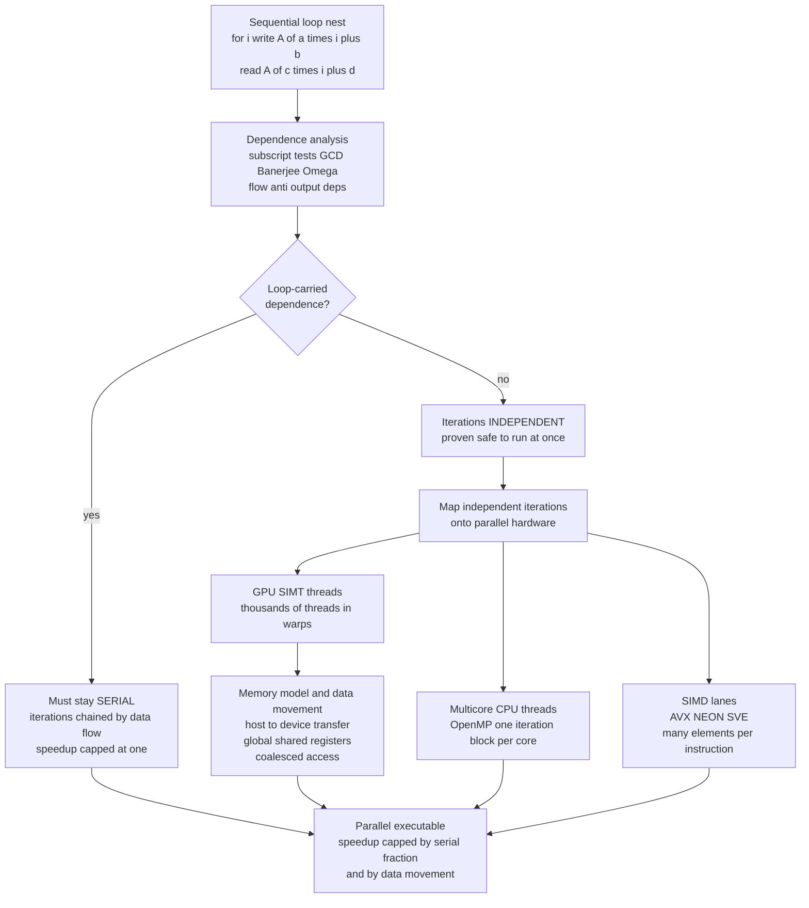

# 🧮 Parallelizing and GPU Compilation

> [!abstract] TL;DR
> **Parallelizing compilation** is the branch of code optimization that maps *sequentially written* programs onto *massively parallel* hardware — multicore CPUs, wide **SIMD** units, and GPUs with thousands of threads. The hardware is parallel; the source code almost never is; the compiler must bridge the gap **safely**. Every decision reduces to one question: **dependence** — which computations are truly independent and can run at the same time, and which are chained by a data flow that forces a serial order. The machinery is **dependence analysis** (flow / anti / output dependences, loop-carried vs loop-independent, distance and direction vectors, and array-subscript tests like **GCD**, **Banerjee**, and **Omega**) to *prove* iterations independent; then the compiler expresses that parallelism three ways: **auto-vectorization** (scalar loop → one SIMD instruction over many elements on SSE/AVX/NEON/SVE), **auto-parallelization** (independent iterations spread across CPU threads, OpenMP-style), and **GPU offload** (the SIMT model — warps of threads over a memory hierarchy of global / shared / registers, emitted through NVCC or LLVM's NVPTX/AMDGPU back ends). The **polyhedral model** (Polly, isl, Pluto) treats loop nests as geometric polyhedra to reason about tiling and skewing for locality *and* parallelism at once. Two hard walls cap every speedup: the **serial fraction** (Amdahl's law) and, on GPUs, **data movement** — host-to-device transfer and kernel-launch overhead that frequently dominate the compute itself.

---

## Intuition

**Analogy — one chef versus a thousand cooks.** Imagine you must prepare a thousand identical salads. One chef assembling them one after another is slow — a thousand times the work of a single salad, done in strict sequence. Now hand the *same recipe card* to a thousand cooks and have them all work at once: if each salad is self-contained, the whole batch finishes in the time of a single salad. That is the promise of parallel hardware — a GPU is literally a kitchen with thousands of cooks.

But there is a catch that decides everything. Suppose the recipe is not a salad but a layer cake where *each cake must be stacked on top of the one before it*. Now the cooks cannot work simultaneously — cook number 500 must wait for cook 499 to finish, who waited for 498, all the way down. The work is *chained*, and a thousand cooks are no faster than one. A **parallelizing compiler's entire job** is to look at a loop and *prove* which situation it is in: are the iterations a thousand independent salads (hand them out across cores and GPU threads), or a chained stack of cakes (they must stay serial)? That proof — and it must be a proof, not a guess, because getting it wrong produces fast, *wrong* answers — is **dependence analysis**, the mathematical heart of the whole field (the same legality question that gates every loop transform in [[Loop_Optimizations]] and every reorder in [[Instruction_Scheduling_and_Pipelines]]).

And even when the cooks *are* independent, there is a second, sneakier cost the analogy captures: if you must *drive every ingredient to a separate kitchen across town and drive every finished salad back*, the driving can take longer than the chopping ever did. That commute is **host-to-device data movement**, and on a GPU it is very often the thing that actually limits your speedup — not the compute.

---

## How It Works

### The challenge — parallel hardware, sequential code

Modern hardware is parallel at three nested scales at once. A CPU chip has *many cores* (each an independent instruction stream). Each core has *wide SIMD units* — one instruction operating on a vector of 4, 8, or 16 elements ([[SIMD_and_Vector_ISA]]). And a GPU pushes this to the extreme with *thousands of lightweight threads* executing in lockstep bundles ([[GPU_Architecture_and_CUDA]]). Yet almost all source code is written as an ordinary sequential loop, one iteration after another. The compiler's task is to *find* the latent parallelism in that sequential text and *express* it in a form the hardware can exploit — without ever changing what the program computes. The bridge from "sequential source" to "parallel machine" is exactly the parallelism story that [[Multi_Core_Programming]] describes from the hardware side.

### Dependence analysis — the one question that matters

Two operations can run in parallel *if and only if* neither depends on the other's result. Formally there are three **data dependences** between a pair of memory accesses to the same location where at least one is a write:

- **Flow (true, read-after-write / RAW)** — B reads a value A wrote. Real and unbreakable; B must run after A.
- **Anti (write-after-read / WAR)** — B overwrites a location A still needs to read. A *false* (name) dependence, often removable by giving B a fresh location (privatization / renaming).
- **Output (write-after-write / WAW)** — A and B write the same location; their order fixes the final value. Also a false dependence.

Inside a loop the crucial distinction is **loop-carried vs loop-independent**. A *loop-independent* dependence lives entirely within one iteration ( `A[i] = A[i] + 1` reads and writes the *same* `i`) and does **not** block parallelization — each iteration is self-contained. A *loop-carried* dependence connects *different* iterations ( `A[i] = A[i-1] + 1` — iteration `i` reads what iteration `i-1` wrote) and **forces a serial order**. The **dependence distance** is `i2 - i1`, and the **direction vector** records whether the source iteration comes before ( `<` ), equal ( `=` ), or after ( `>` ) the sink — the compact algebra that decides which loop transforms are legal (the machinery [[Control_Flow_and_Data_Flow_Analysis]] feeds and that [[Loop_Optimizations]] consumes).

The engineering problem is: given array subscripts like `A[a*i + b]` and `A[c*i + d]`, does a loop-carried dependence *exist*? That reduces to asking whether `a*i1 + b = c*i2 + d` has an integer solution with `i1 != i2` inside the loop bounds — a Diophantine feasibility test. Three classic tests answer it with increasing power and cost:

- **GCD test** — cheap and *necessary but not sufficient*: a solution can exist only if `gcd(a, c)` divides `d - b`. If it does not, there is *provably no dependence* and the loop is parallelizable. If it does, a dependence *might* exist and you look harder.
- **Banerjee test** — uses the loop *bounds* to rule out dependences the GCD test cannot (the integer solution might lie outside the iteration range).
- **Omega test** — an exact decision procedure (Presburger arithmetic) that gives a definitive yes/no for affine subscripts, at higher cost.

### Expressing the parallelism three ways

Once independence is proven, the compiler emits parallel code in whichever form the target rewards:

1. **Auto-vectorization (SIMD).** Rewrite a scalar loop so each instruction processes a whole vector of elements — the SSE/AVX/NEON/SVE lanes. The **loop vectorizer** widens a loop body by the vector width; the **SLP (superword-level parallelism) vectorizer** packs *unrelated* scalar statements into one vector op. It must handle **alignment**, generate **masks** for the leftover scalar remainder, and above all prove no **aliasing** (do two pointers overlap?) and no loop-carried dependence. Robust auto-vectorization is famously fragile — a single unproven alias or an awkward memory pattern silently drops the loop back to scalar.
2. **Auto-parallelization (multicore).** Split the independent iteration space into chunks, one per CPU thread (a **DOALL** loop). In practice full automation is hard — the compiler rarely proves enough to parallelize real code aggressively — so the industry leans on *annotations*: `#pragma omp parallel for` (OpenMP), where the programmer *asserts* independence and the compiler generates the threading, mapping onto OS threads ([[Threads_and_Concurrency_Models]]).
3. **GPU offload (SIMT).** Map each independent iteration to a GPU **thread**; threads run in **warps** (32-wide lockstep bundles) over a **memory hierarchy** — huge slow *global* memory, fast on-chip *shared* memory, and per-thread *registers*. The compiler must arrange **coalesced access** (adjacent threads touching adjacent addresses so one memory transaction serves the whole warp) or throughput collapses.

### The polyhedral model — geometry for loop nests

For dense loop nests, the **polyhedral model** represents each iteration as an integer point in a geometric **polyhedron**, and each dependence as an affine constraint. Transformations — **tiling** (blocking for cache), **skewing** (slanting the iteration space to expose parallel wavefronts across a dependence), **fusion**, **interchange** — become linear-algebra operations on that geometry, and crucially they *compose* and are checked for legality against the dependence constraints all at once. This is the engine behind LLVM's **Polly**, the **isl** integer-set library, the **Pluto** auto-parallelizer, and GCC's **Graphite**.

### The data-movement problem and the scaling wall

Two hard limits cap real speedups, and a good compiler must model both:

- **Amdahl's law.** If a fraction `s` of the program is inherently serial (a reduction, a loop-carried recurrence, setup), then no matter how many processors `P` you throw at the rest, `speedup = 1 / (s + (1 - s) / P)`, which is bounded above by `1 / s`. Five percent serial code caps you at 20x forever.
- **Data movement.** On a GPU the parallel part runs on the device, but the *inputs must be copied host → device and results copied back*, plus a fixed **kernel-launch** latency. This transfer is over PCIe and frequently *dominates* the kernel. As you add threads the compute time shrinks toward zero, but the transfer cost is fixed — so speedup plateaus at roughly `1 / (transfer + serial)`. The standard mitigations are **batching** (amortize one transfer over lots of work), keeping data resident on the device across kernels, and *kernel fusion* (do more per launch). The host-device boundary here is the same interop/marshalling cost surface described in [[Foreign_Function_Interfaces_and_Interop]].

### Flow / Architecture



*The single diamond is the whole game. A loop-carried dependence sends the loop down the serial path where thousands of cores buy nothing; independence unlocks the three parallel mappings — and even then the memory model and the host-device commute decide how much of the theoretical speedup survives.*

---

## Key Concepts

**Secondary (intuitive, no CS background needed)**
- **A thousand cooks vs a stack of cakes** — independent work can be done all at once; chained work cannot, no matter how many hands you add.
- **Prove independence, don't assume it** — running dependent steps in parallel gives fast, *wrong* answers; the compiler must be sure.
- **The commute can beat the cooking** — shipping data to and from the GPU often costs more than the computation it enables.
- **Two ceilings** — the part that must stay serial, and the fixed cost of moving data, both cap how much faster you can go.

**Undergraduate (a first compilers / architecture course)**
- **Flow / anti / output dependences** and **loop-carried vs loop-independent** — which chains block parallelism and which do not.
- **Dependence distance and direction vectors** — the compact algebra deciding legal reorderings.
- **The GCD test** — a fast necessary condition; if `gcd` of the coefficients does not divide the offset difference, the loop is provably parallelizable.
- **Auto-vectorization** — scalar loop to SIMD; alignment, masking, remainder, and why aliasing defeats it.
- **OpenMP-style parallel loops** — DOALL loops across threads; why annotations exist because full automation is hard.
- **Amdahl's law** — `1 / (s + (1 - s)/P)` and the `1/s` ceiling.

**Graduate (advanced / production compilation)**
- **Banerjee and Omega tests** — bounds-aware and exact (Presburger) dependence decision procedures for affine subscripts.
- **The polyhedral model** — iteration spaces as integer polyhedra, dependences as affine constraints, tiling / skewing / fusion as composable transforms (Polly, isl, Pluto, Graphite).
- **SIMT execution and warp divergence** — lockstep warps, the cost of divergent branches, and coalesced vs strided global-memory access over the global / shared / register hierarchy.
- **Data-movement modeling** — host-device transfer, kernel-launch overhead, batching, kernel fusion, and device-resident data as first-class cost terms.
- **Tensor / array compilers** — XLA, TVM, Triton, and **MLIR** dialects lowering fused parallel kernels to LLVM NVPTX / AMDGPU back ends (the modern ML-compiler application; see [[Compilers_for_Machine_Learning]]).
- **Memory-consistency correctness** — the data races a parallelizing compiler must never introduce, and the ordering guarantees it relies on ([[Memory_Consistency_Models]], [[Memory_Barriers_and_Ordering]]).

---

## Python Demo

```python
# PARALLELIZING-COMPILER MODEL, in two acts.
#
#   ACT 1 -- DEPENDENCE ANALYSIS.  Given a loop whose array accesses are affine
#            in the loop index i (index = a*i + b), decide whether the loop
#            carries a LOOP-CARRIED dependence (must run SERIAL) or its
#            iterations are INDEPENDENT (safe to run in PARALLEL). We use the
#            GCD test (fast, necessary-but-not-sufficient) and confirm with an
#            exact within-bounds search, and report the dependence DISTANCE.
#
#   ACT 2 -- SPEEDUP MODEL.  From the classification we derive a serial fraction
#            s, then model speedup vs processor/thread count:
#              * CPU multicore under AMDAHL's law     speedup = 1/(s + (1-s)/P)
#              * GPU with thousands of threads BUT a fixed DATA-MOVEMENT cost D
#                                                     speedup = 1/(s + (1-s)/G + D)
#            and plot where DEPENDENCES (serial loop, flat at 1) and DATA MOVEMENT
#            (GPU plateau at 1/(s+D)) cap the gains.
#
# Pure standard library (math) + matplotlib. numpy optional / not required.

from math import gcd
import matplotlib.pyplot as plt

# ---------------------------------------------------------------------------
# A loop is a list of accesses to named arrays. Each access is:
#   (array_name, kind, a, b)   meaning it touches  array_name[a*i + b]
#   kind is "W" (write) or "R" (read). Index is affine in the loop index i.
# ---------------------------------------------------------------------------
LOOPS = {
    "A[i] = B[i] + C[i]        (elementwise, disjoint arrays)": [
        ("A", "W", 1, 0), ("B", "R", 1, 0), ("C", "R", 1, 0)],
    "A[i] = A[i] + 1           (in-place, same index)": [
        ("A", "W", 1, 0), ("A", "R", 1, 0)],
    "A[i] = A[i-1] + 1         (prefix recurrence)": [
        ("A", "W", 1, 0), ("A", "R", 1, -1)],
    "A[2*i] = A[i]             (stride mismatch)": [
        ("A", "W", 2, 0), ("A", "R", 1, 0)],
    "A[i] = A[i+8] * k         (forward reuse)": [
        ("A", "W", 1, 0), ("A", "R", 1, 8)],
}

N = 64  # iteration count (loop runs i = 0 .. N-1)

def dep_between(acc1, acc2, N):
    """Is there a LOOP-CARRIED dependence between two accesses (same array,
    at least one write) to A[a1*i1+b1] and A[a2*i2+b2] with i1 != i2 in [0,N)?
    Returns (gcd_possible, exact_exists, distance_or_None)."""
    _, _, a1, b1 = acc1
    _, _, a2, b2 = acc2
    # GCD test: a1*i1 - a2*i2 = b2 - b1 has an integer solution only if
    # gcd(a1, a2) divides (b2 - b1). Necessary, NOT sufficient.
    g = gcd(a1, a2)
    rhs = b2 - b1
    gcd_possible = (g != 0 and rhs % g == 0)
    # Exact within-bounds check, requiring i1 != i2 (that is what makes it
    # loop-CARRIED rather than loop-independent).
    exact, dist = False, None
    for i1 in range(N):
        idx = a1 * i1 + b1               # location written/read at iteration i1
        num = idx - b2                   # solve a2*i2 = num
        if a2 != 0 and num % a2 == 0:
            i2 = num // a2
            if 0 <= i2 < N and i2 != i1:
                exact, dist = True, i2 - i1
                break
    return gcd_possible, exact, dist

def classify(loop):
    """A loop is SERIAL iff some pair of accesses to the same array (>=1 write)
    has a loop-carried dependence. Otherwise its iterations are INDEPENDENT."""
    accesses = loop
    carried, notes = False, []
    for x in range(len(accesses)):
        for y in range(len(accesses)):
            if x == y:
                continue
            ax, ay = accesses[x], accesses[y]
            if ax[0] != ay[0]:
                continue                 # different arrays -> no shared memory
            if ax[1] == "R" and ay[1] == "R":
                continue                 # read/read is never a dependence
            gcd_p, exact, dist = dep_between(ax, ay, N)
            if exact:
                carried = True
                notes.append((ax, ay, gcd_p, dist))
    return ("SERIAL" if carried else "PARALLELIZABLE"), notes

print("=" * 74)
print("ACT 1 -- DEPENDENCE ANALYSIS")
print("=" * 74)
results = {}
for name, loop in LOOPS.items():
    verdict, notes = classify(loop)
    results[name] = verdict
    print(f"\n{name}")
    print(f"    verdict: {verdict}")
    for ax, ay, gcd_p, dist in notes:
        print(f"    loop-carried dep: {ax[1]} {ax[0]}[{ax[2]}i+{ax[3]}]  <->  "
              f"{ay[1]} {ay[0]}[{ay[2]}i+{ay[3]}]   distance = {dist}  "
              f"(GCD test said 'possible'={gcd_p})")
    if verdict == "PARALLELIZABLE":
        # Show the GCD test PROVING independence where it can.
        for x in range(len(loop)):
            for y in range(len(loop)):
                if x != y and loop[x][0] == loop[y][0] and not (
                        loop[x][1] == "R" and loop[y][1] == "R"):
                    gp, ex, _ = dep_between(loop[x], loop[y], N)
                    if not gp:
                        print(f"    GCD test PROVES no dependence: "
                              f"gcd does not divide the offset gap -> independent")

# ---------------------------------------------------------------------------
# ACT 2 -- SPEEDUP MODEL
# ---------------------------------------------------------------------------
def amdahl(P, s):
    return 1.0 / (s + (1.0 - s) / P)

def gpu_speedup(G, s, D):
    # D = data-movement + launch overhead, in units of single-core serial time.
    return 1.0 / (s + (1.0 - s) / G + D)

S_PARALLEL = 0.05    # a parallelizable loop: 5% inherently serial (reduction/setup)
S_SERIAL   = 1.00    # a loop-carried recurrence: effectively all serial

P_vals = list(range(1, 65))                        # CPU cores
G_vals = [2 ** k for k in range(0, 15)]            # GPU threads: 1 .. 16384

print("\n" + "=" * 74)
print("ACT 2 -- SPEEDUP MODEL")
print("=" * 74)
print(f"parallelizable loop  s = {S_PARALLEL}:  Amdahl ceiling = {1/S_PARALLEL:.0f}x")
print(f"serial recurrence    s = {S_SERIAL}:  ceiling = {1/S_SERIAL:.0f}x (no gain)")
for D in (0.0, 0.02, 0.10, 0.30):
    cap = 1.0 / (S_PARALLEL + D)
    print(f"GPU data-movement overhead D = {D:>4}:  plateau ~ {cap:5.1f}x "
          f"(reached as threads -> infinity)")

# --- plot ---
fig, (axL, axR) = plt.subplots(1, 2, figsize=(13, 5.4))

# LEFT: CPU multicore under Amdahl -- dependence caps the serial loop at 1x.
axL.plot(P_vals, [amdahl(P, S_PARALLEL) for P in P_vals], "o-", color="#1f77b4",
         markersize=3, label=f"parallelizable loop  s={S_PARALLEL}")
axL.axhline(1 / S_PARALLEL, ls="--", color="#1f77b4", alpha=0.6,
            label=f"Amdahl ceiling 1/s = {1/S_PARALLEL:.0f}x")
axL.plot(P_vals, [amdahl(P, S_SERIAL) for P in P_vals], "s-", color="#d62728",
         markersize=3, label="loop-carried dep  s=1 (SERIAL)")
axL.set_xlabel("processors  P")
axL.set_ylabel("speedup vs 1 core")
axL.set_title("Multicore CPU (Amdahl's law)\na dependence pins the serial loop at 1x")
axL.legend(fontsize=8, loc="center right")
axL.grid(alpha=0.3)

# RIGHT: GPU -- thousands of threads, but data movement plateaus the speedup.
colors = ["#2ca02c", "#ff7f0e", "#9467bd", "#8c564b"]
for D, c in zip((0.0, 0.02, 0.10, 0.30), colors):
    axR.plot(G_vals, [gpu_speedup(G, S_PARALLEL, D) for G in G_vals], "o-",
             color=c, markersize=3, label=f"data-move D={D}")
    axR.axhline(1.0 / (S_PARALLEL + D), ls=":", color=c, alpha=0.5)
axR.set_xscale("log", base=2)
axR.set_xlabel("GPU threads  G  (log2 scale)")
axR.set_ylabel("speedup vs 1 core")
axR.set_title("GPU (SIMT): more threads help until\ndata movement dominates -> plateau")
axR.legend(fontsize=8, loc="upper left")
axR.grid(alpha=0.3, which="both")

fig.suptitle("Dependence sets WHAT can be parallel; Amdahl + data movement set HOW MUCH",
             fontsize=12, y=1.00)
plt.tight_layout()
plt.savefig("parallelizing_and_gpu_compilation.png", dpi=130, bbox_inches="tight")
print("\nSaved model visualization to parallelizing_and_gpu_compilation.png")
```

Running Act 1 classifies each loop. `A[i] = B[i] + C[i]` touches three disjoint arrays, so there is no shared-memory dependence at all — **parallelizable**. `A[i] = A[i] + 1` writes and reads the *same* index every iteration: the only dependence is loop-*independent* (`i1 == i2`), so it too is **parallelizable** (each iteration is self-contained) — and this is the case where the GCD test says "possible" yet the exact check finds no cross-iteration solution, the textbook demonstration that **GCD is necessary but not sufficient**. `A[i] = A[i-1] + 1` has a loop-carried flow dependence of **distance 1** (iteration `i` reads what `i-1` wrote) — **serial**. `A[2*i] = A[i]` shows a stride mismatch (write at `2*i1`, read at `i2 = 2*i1`) — a genuine loop-carried dependence, **serial**. `A[i] = A[i+8]` reuses a location eight iterations later — **serial** with distance 8. Act 2 then turns those verdicts into speedup curves: the left panel shows a parallelizable loop climbing toward the Amdahl ceiling `1/s = 20x` while the serial recurrence stays pinned at **1x no matter how many cores** you add — dependence, not core count, is the limit. The right panel shows the GPU story: with *zero* data movement, thousands of threads approach the same `20x`, but as the host-device transfer overhead `D` grows, the curve **plateaus early** at `1 / (s + D)` — the fixed commute, not the thread count, becomes the wall.

---

## Real-World Applications

> **Example — LLVM's parallel stack (loop vectorizer + Polly + NVPTX).** A single LLVM toolchain (see [[Compiler_Toolchains_and_LLVM]]) shows all three mappings on one IR. The **LoopVectorize** and **SLPVectorize** passes emit AVX/NEON/SVE from scalar loops after proving no aliasing (via `restrict`/alias analysis) and no loop-carried dependence; **Polly**, built on the **isl** integer-set library, applies polyhedral tiling and detects parallel loops; and the **NVPTX** and **AMDGPU** back ends lower GPU kernels to PTX / GCN. GCC mirrors this with `-ftree-vectorize`, the **Graphite** polyhedral framework, and OpenMP offloading. For GPUs specifically, **NVCC** splits CUDA source into host code (handed to the system C++ compiler) and device code (compiled to PTX by `cvvm`/`ptxas`), while **MLIR** (see [[Compilers_for_Machine_Learning]]) provides GPU dialects that fuse and lower tensor ops to these same back ends.

Where parallelizing and GPU compilation is decisive in practice:

- **Machine-learning / tensor compilers.** XLA (TensorFlow/JAX), TVM, Triton, and PyTorch's `torch.compile`/Inductor take array programs and emit **fused, tiled, parallelized GPU kernels** — kernel fusion exists precisely to defeat the data-movement wall by doing more work per launch. This is the single largest modern application of the whole field, and it is where the AI-ML stack meets the compiler ([[Compilers_for_Machine_Learning]], [[CUDA_Fundamentals]], [[GPU_Architecture_and_CUDA]]).
- **HPC and scientific computing.** Stencils, PDE solvers, and dense linear algebra rely on polyhedral tiling (Pluto, PPCG) and OpenMP/OpenACC pragmas to hit multicore and GPU targets from the same Fortran/C source.
- **Everyday `-O3 -march=native` builds.** Compiling ordinary C/C++ silently auto-vectorizes array loops into [[SIMD_and_Vector_ISA]] code; when the vectorizer bails (aliasing, awkward strides) engineers reach for `restrict`, `#pragma omp simd`, or hand-written intrinsics.
- **High-level parallel programming models.** OpenMP (directive-based CPU/GPU), OpenACC (GPU offload pragmas), SYCL and Kokkos (single-source C++ portable across CPU/GPU/FPGA), and CUDA/HIP all lean on the compiler to turn annotated loops into threads, warps, and vector lanes.
- **Databases and media.** Vectorized query engines (DuckDB, ClickHouse, Velox) run SIMD-friendly per-column loops; video codecs and DSP pipelines auto-vectorize and GPU-offload their hot pixel/sample loops.

---

## Common Pitfalls

- **Assuming independence instead of proving it.** A loop that "looks" parallel can hide a loop-carried flow dependence (`a[i] = a[i-1] + x`); parallelizing it produces fast, *wrong* results and a data race. Legality is a proof (GCD/Banerjee/Omega or an honest `#pragma`), never an eyeball judgment — this is the cardinal sin of the whole area.
- **Aliasing silently kills vectorization.** In C, `void f(float *a, float *b)` forces the compiler to assume `a` and `b` *may* overlap, blocking auto-vectorization. The absence of `restrict`/`__restrict` is the single most common reason a loop stays scalar.
- **Ignoring the data-movement wall.** Offloading a small kernel to the GPU and timing only the kernel hides the host→device→host transfer and launch latency, which often *exceed* the compute. Always measure end-to-end; batch and keep data device-resident, and fuse kernels to amortize the transfer.
- **Warp divergence and uncoalesced access.** A branch that sends different threads in a warp down different paths serializes them; a strided or scattered global-memory pattern turns one coalesced transaction into many. Both quietly cost most of the theoretical GPU throughput, and the compiler cannot always fix a bad access pattern for you.
- **Chasing thread count past the Amdahl / data-movement ceiling.** Speedup is bounded by `1/s` (serial fraction) and by `1/(s + D)` (with data movement); adding cores or threads beyond that point buys nothing. Attack the serial fraction and the transfer cost, not the core count.
- **Introducing a data race via an unsafe transform.** A parallelizing compiler must respect the target's memory model; reordering or privatizing incorrectly can create races the sequential source never had. Correctness here is defined by memory consistency ([[Memory_Consistency_and_Concurrent_Data_Structures]], [[Memory_Consistency_Models]]), not by "it worked on my run."
- **Reductions treated as ordinary dependences.** A sum `s += a[i]` *is* a loop-carried dependence on `s`, but it is associative — so it can be parallelized as a **reduction** (partial sums per thread, combined at the end). Missing this leaves easy parallelism on the table; doing it without acknowledging floating-point non-associativity changes the result bit-for-bit.

---

## Related Concepts

- [[Loop_Optimizations]] — the sibling that owns the loop machinery (LICM, unrolling, interchange, tiling); dependence analysis is the shared legality gate, and vectorization/parallelization are its most aggressive transforms.
- [[Instruction_Scheduling_and_Pipelines]] — parallelism at the *instruction* level (ILP) rather than the *data* level; both build a dependence graph and both are limited by true (RAW) dependences.
- [[Control_Flow_and_Data_Flow_Analysis]] — supplies the def-use and reaching-definition information that dependence analysis is built on.
- [[Foreign_Function_Interfaces_and_Interop]] — the host-device boundary marshalling/transfer that makes GPU data movement the dominant cost.
- [[Compiler_Toolchains_and_LLVM]] — the shared LLVM/MLIR IR and retargetable back ends (NVPTX, AMDGPU) that actually emit the vector and GPU code this note describes.
- [[Compilers_for_Machine_Learning]] — tensor/array compilers (XLA, TVM, Triton, MLIR) are the largest modern application of parallelizing and GPU compilation.
- [[The_Future_of_Compilers]] — specialized parallel hardware and ML-as-workload are exactly why retargetable, parallelism-finding compilation is where the field is heading.
- [[SIMD_and_Vector_ISA]] — the vector instruction sets (SSE/AVX/NEON/SVE) that auto-vectorization targets.
- [[GPU_Architecture_and_CUDA]] — the SIMT hardware, warps, and global/shared/register hierarchy that GPU compilation must map onto.
- [[Multi_Core_Programming]] — the multicore/thread model that auto-parallelization and OpenMP target.
- [[Cache_Hierarchy]] — the locality that polyhedral tiling and blocking optimize for alongside parallelism.
- [[NUMA_and_Memory_Bandwidth]] — why data placement and bandwidth, not just core count, cap multicore scaling.
- [[Cache_Coherence_MESI]] — the coherence protocol whose traffic (false sharing) can silently throttle a parallelized loop.
- [[Memory_Consistency_Models]] — the ordering guarantees a parallelizing compiler must respect to stay correct.
- [[Memory_Barriers_and_Ordering]] — the fences that enforce those guarantees across threads and cores.
- [[Memory_Consistency_and_Concurrent_Data_Structures]] — the OS-level view of the races a parallelizing transform must never introduce.
- [[Threads_and_Concurrency_Models]] — the OS threading substrate that auto-parallelized loops run on.
- [[Process_Synchronization_and_Race_Conditions]] — the synchronization the compiler and runtime must insert around any residual dependences.
- [[CUDA_Fundamentals]] — the programming model that tensor/ML compilers emit onto the GPU.
- [[Compilers_Overview]] — where this pass sits in the back-end/optimizer pipeline.

---

## Review Questions

1. **(Conceptual)** Distinguish a *loop-carried* from a *loop-independent* dependence and explain precisely why only one of them blocks parallelization. Then explain why the **GCD test** can *prove independence* but can never, on its own, *prove* that a dependence exists — and give a concrete subscript pair (like `A[i]` and `A[i]`) where GCD says "possible" but no loop-carried dependence actually exists.
2. **(Scenario)** You offload the loop `for i: C[i] = A[i] * B[i]` to a GPU with 10,000 threads and are disappointed by a 3x end-to-end speedup even though the kernel itself is 200x faster than one CPU core. Using the model `speedup = 1 / (s + (1 - s)/G + D)`, identify what `D` represents, explain why adding more threads will not help, and name two compiler/programmer techniques that attack `D` directly.
3. **(Trade-off)** A colleague wants the compiler to auto-parallelize `for i: s = s + a[i]` (a running sum) and another loop `for i: a[i] = a[i-1] + a[i]` (a prefix scan). For each, state whether it is safe to parallelize as written, and if a transform can recover parallelism, name it and explain the correctness caveat (associativity / reduction vs recurrence) the compiler must respect.

---

## Sources

- Allen, R., Kennedy, K. *Optimizing Compilers for Modern Architectures: A Dependence-Based Approach*. Morgan Kaufmann, 2001 — the definitive text on dependence analysis, the GCD/Banerjee tests, and automatic vectorization/parallelization.
- Hennessy, J., Patterson, D. *Computer Architecture: A Quantitative Approach*, 6th ed. Morgan Kaufmann, 2017 — Chapter 4 (data-level parallelism, SIMD, vector) and the GPU/SIMT appendix; Amdahl's law and scaling limits.
- Grosser, T., Groesslinger, A., Lengauer, C. "Polly — Performing Polyhedral Optimizations on a Low-Level Intermediate Representation." *Parallel Processing Letters* 22(4), 2012 — the polyhedral optimizer in LLVM ([polly.llvm.org](https://polly.llvm.org)).
- Pugh, W. "The Omega Test: A Fast and Practical Integer Programming Algorithm for Dependence Analysis." *Supercomputing '91* — the exact dependence-test procedure.
- NVIDIA. *CUDA C++ Programming Guide* and *PTX ISA / NVCC documentation* — the SIMT model, memory hierarchy, coalescing, and the GPU compilation toolchain ([docs.nvidia.com/cuda](https://docs.nvidia.com/cuda/)).
- Lattner, C., et al. "MLIR: Scaling Compiler Infrastructure for the Domain of Machine Learning." *CGO 2021* — the multi-level IR behind modern tensor/GPU compilers.

---

#compilers #parallelization #gpu-compilation #auto-vectorization #polyhedral
