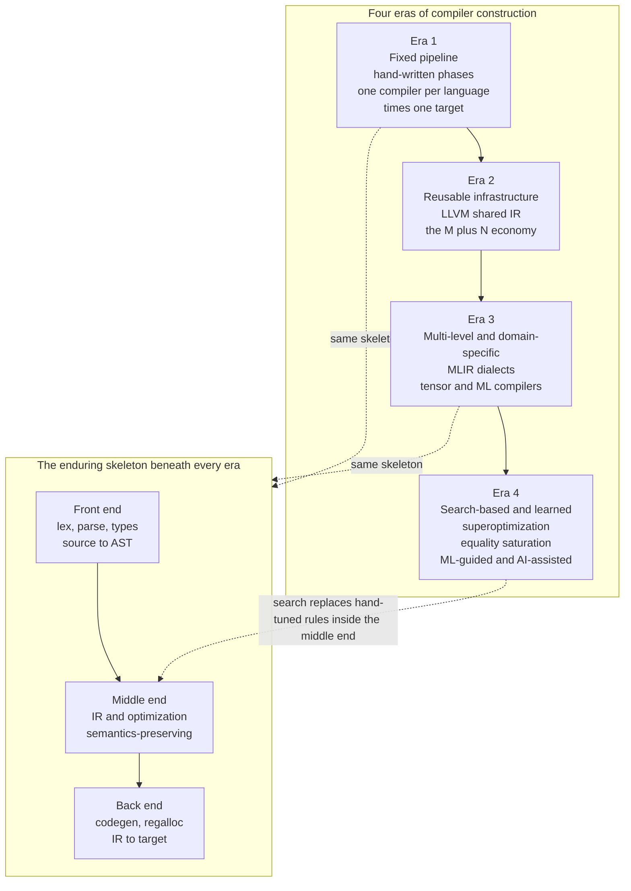

# 🔭 The Future of Compilers

> [!abstract] TL;DR
> For sixty years a compiler was a **master craftsman following a fixed rulebook**: expert-written phases lexing, parsing, type-checking, optimizing, and emitting code for a known CPU. That skeleton — **front end / IR / back end** — has survived every era and remains the foundation. But the craft is being reinvented on three fronts at once: **hardware fragmented** into GPUs, TPUs, NPUs, and FPGAs demanding *retargetable, domain-specific* compilation; **AI became both a giant new workload and a new tool** that can help write the optimizer; and the **hand-tuned rulebooks are giving way to machines that search** — superoptimization, equality saturation, auto-tuning, and ML-guided heuristics — for the best translation. The translator is learning to teach itself. This capstone ties the whole **Compilers** vault together, from [[Lexical_Analysis_and_Tokenization|lexing]] to the frontier, and looks ahead.

---

## Intuition

**Analogy — the master translator gets a research lab.** For decades a compiler was like a legendary literary translator: a lone expert who had internalized a fixed rulebook — *when to prefer this word, when to restructure that clause* — and applied it by hand, the same way, every time, for a language and an audience they knew intimately. The rulebook was written by human experts (the compiler engineers), and it never changed while the book was being translated.

Now three things happen to that translator at once. First, the **audience fractures**: instead of one kind of reader, there are now dozens of wildly different ones — a reader who devours a thousand pages in parallel (a GPU), a reader who only understands tensor-shaped prose (a TPU), a reader locked behind a security glass wall (a browser sandbox). One fixed rulebook cannot serve them all. Second, a **new kind of book** arrives — enormous, repetitive, numerical machine-learning workloads — and *also* a new kind of assistant: an AI that can suggest rewrites and even help write the rulebook itself. Third, and most profound, the translator stops trusting the fixed rulebook alone and builds a **research lab**: instead of applying one memorized rule, it *searches* the space of all equivalent phrasings, tests them for meaning, measures which is cheapest, and keeps the winner. The rules that were once handed down by experts are increasingly *discovered by the machine*. The translator is learning to teach itself — and yet, underneath, it still reads the words, understands the sentences, and produces an edition, exactly as it always has.

---

## How It Works

This capstone is a synthesis, so "how it works" means: **how the whole field fits together, what endures, and what is changing.**

### The enduring core — the skeleton that survives every era

Strip away sixty years of fashion and the same anatomy remains, the one opened in [[Compilers_Overview]]:

1. **Front end (language-specific).** [[Lexical_Analysis_and_Tokenization|Lexing]] turns characters into tokens (a *regular*-language job, [[Finite_Automata_DFA_and_NFA]] / [[Regular_Expressions_and_Kleenes_Theorem]]); parsing turns tokens into an [[Abstract_Syntax_Trees_and_Parser_Design|AST]] via a [[Context_Free_Grammars_for_Parsing|context-free grammar]] ([[Top_Down_and_Recursive_Descent_Parsing]], [[Bottom_Up_and_LR_Parsing]]); [[Semantic_Analysis_and_Symbol_Tables|semantic analysis]] resolves names and enforces meaning; and [[Type_Checking_and_Type_Systems|type checking]] (with [[Type_Inference_and_Hindley_Milner|inference]]) rejects ill-formed programs before they run.
2. **Middle end (target- and language-independent).** The AST is lowered to an [[Intermediate_Representations|intermediate representation]] — usually in [[Static_Single_Assignment_Form|SSA form]] — where [[Control_Flow_and_Data_Flow_Analysis|control- and data-flow analysis]] powers [[Local_and_Global_Optimizations|local and global optimizations]], [[Loop_Optimizations|loop transforms]], and [[Interprocedural_and_Link_Time_Optimization|interprocedural / link-time optimization]].
3. **Back end (target-specific).** Instruction selection, register allocation, and [[Instruction_Scheduling_and_Pipelines|scheduling]] emit code for a concrete ISA ([[RISCV_ISA_Fundamentals]], [[ISA_Design_RISC_vs_CISC]]), obeying the [[Runtime_Systems_and_the_ABI|runtime and the ABI]] ([[ABI_and_Calling_Conventions]]) with support from [[Memory_Management_and_Allocation_Runtime|allocation]], [[Garbage_Collection]], [[Linkers_and_Loaders|linkers/loaders]], [[Foreign_Function_Interfaces_and_Interop|FFI]], and [[Exception_Handling_and_Stack_Unwinding|unwinding]].

The **front end / IR / back end split** — the M-languages × N-targets problem collapsed to M + N — is the field's master idea, and it is *more* relevant in a heterogeneous world, not less. Everything below is a variation on this theme.

### The forces reshaping compilers

- **The end of easy hardware scaling.** Dennard scaling ended and single-thread speedups stalled, so performance now comes from **specialized, parallel hardware**: GPUs, TPUs, NPUs, FPGAs, and custom accelerators. A compiler can no longer target "the CPU" — it must be **retargetable and domain-specific**, mapping high-level intent onto whatever silicon is present (the `Parallelizing_and_GPU_Compilation` sibling; see [[GPU_Architecture_and_CUDA]], [[SIMD_and_Vector_ISA]]).
- **AI as workload *and* tool.** Machine learning is a colossal new compilation target (dense tensor programs over accelerators) *and* a new source of optimization policy (learned heuristics, neural code models). The compiler becomes strategic performance infrastructure for AI (the `Compilers_for_Machine_Learning` sibling).
- **New safe languages and the security imperative.** Rust's ownership types push memory safety into the front end; sandboxed targets and supply-chain integrity push security into the back end. Correctness and trust are first-class goals, not afterthoughts.

### Reusable infrastructure — from LLVM to MLIR

**LLVM** turned the front/middle/back split into an industry: one language-neutral IR, many front ends (Clang, Rustc, Swift), many back ends (x86, ARM, RISC-V, Wasm, GPU). **MLIR (Multi-Level IR)** generalizes this further: instead of one IR, a framework of **dialects** at many abstraction levels — a tensor dialect, a loop dialect, a hardware dialect — that lower into one another. Building a domain compiler becomes *composing reusable infrastructure* rather than starting from scratch (the `Compiler_Toolchains_and_LLVM` sibling, building on [[Intermediate_Representations]]).

### Domain-specific and ML compilers — the growth frontier

Tensor/array compilers (XLA, TVM, Triton, Mojo), hardware-description compilers, and embedded DSLs (the `Domain_Specific_Languages` sibling) are where the action is. They still lex, build an IR, optimize, and emit code — the same skeleton — but the "target" is a fused GPU kernel or an FPGA bitstream, and the optimizations (operator fusion, tiling, [[Quantization|quantization]]) are domain-shaped.

### Search-based and learned compilation — the deepest shift

The biggest change is *how optimization decisions get made*. The old way: an expert writes a heuristic. The new way: **the machine searches.**

- **Superoptimization** searches the space of instruction sequences for a provably-equivalent *cheaper* one — often beating hand-written codegen for hot kernels.
- **Equality saturation / e-graphs** apply many rewrite rules *at once*, growing a compact set of equivalent programs, then *extract* the cheapest — sidestepping the phase-ordering problem where the order you apply optimizations changes the result.
- **Auto-tuning and ML-guided heuristics** learn inlining, loop scheduling, and pass ordering from data; **reinforcement learning** treats compiler decisions as a policy to optimize (the `Profile_Guided_and_Adaptive_Optimization` sibling; conceptually a cousin of [[Neural_Architecture_Search]] over the space of *programs* rather than *networks*).

### AI-assisted compilation and verified trust — in tension

LLMs now write, translate, and optimize code; neural program synthesis blurs the line between "the compiler" and "the AI coding assistant." But an AI that *guesses* a translation is not a compiler until its output is *checked*. Hence the parallel rise of **formally verified compilation** (CompCert-style machine-checked proofs; the `Formal_Semantics_and_Verified_Compilers` sibling): the more aggressive and AI-driven the optimization, the more assurance we need that it still preserves meaning. And portable, sandboxed targets like **WebAssembly** (the `WebAssembly_and_Portable_Targets` sibling) provide a universal *secure* compute substrate from browser to edge to cloud — while [[Just_In_Time_Compilation|JIT]] and dynamic-language techniques ([[Interpreters_and_Tree_Walking]], [[Bytecode_and_Virtual_Machines]]) keep making high-level languages fast.

### The arc — and the skeleton beneath it



*Read the diagram as: the outer arc is what changes across eras; the inner box is what never does. Era 4 does not throw away the skeleton — it swaps hand-written heuristics inside the middle end for automated search.*

---

## Key Concepts

**Secondary (intuitive, no CS background needed)**
- **A compiler is a translator that must preserve meaning** — every program you run passed through one; it is invisible, foundational infrastructure.
- **The same recipe, forever** — read the words, understand the sentences, rewrite for economy, produce the final edition. That recipe has not changed in sixty years.
- **Why the change now** — computers stopped getting automatically faster, so we build *specialized* chips; and AI is both a huge new job for compilers and a new helper that can do part of the compiler's thinking.
- **From rulebook to search** — instead of always applying the same expert rule, the modern compiler can *try many equivalent versions and keep the cheapest*.

**Undergraduate (a first compilers or PL course)**
- **The front / middle / back end decomposition and the shared IR** — the M + N economy that makes retargetable compilers possible ([[Compilers_Overview]], [[Intermediate_Representations]]).
- **SSA and data-flow analysis as the substrate for optimization** ([[Static_Single_Assignment_Form]], [[Control_Flow_and_Data_Flow_Analysis]]).
- **The AOT ↔ interpreter ↔ JIT spectrum** — when translation happens, and the trade-off between startup and peak speed ([[Interpreters_and_Tree_Walking]], [[Bytecode_and_Virtual_Machines]], [[Just_In_Time_Compilation]]).
- **Phase ordering** — applying optimizations in different orders yields different results; the classic reason a single fixed pipeline is suboptimal.
- **Retargetability** — one optimizer, many back ends; the design LLVM made ubiquitous.

**Graduate (research frontier)**
- **Superoptimization** — exhaustive or stochastic search over instruction sequences with equivalence checking (testing, SMT solving, or symbolic execution); e.g. STOKE's Markov-chain-Monte-Carlo search.
- **Equality saturation and e-graphs** — represent an entire congruence class of equivalent programs compactly, apply rewrites non-destructively until saturation, then solve an *extraction* optimization to pull out the cheapest term (egg, Herbie, Tensat).
- **Learned compiler heuristics** — supervised and reinforcement-learning models for inlining, register allocation, vectorization, and pass ordering (MLGO, CompilerGym, AutoTVM/Ansor); a search problem kin to [[Neural_Architecture_Search]].
- **Multi-level IR (MLIR) and progressive lowering** — dialects and rewrite frameworks that make domain compilers composable.
- **Verified and trustworthy compilation** — mechanized proofs of semantic preservation (CompCert, CakeML) and *translation validation*, in tension with aggressive/AI-driven optimization.
- **The deep unifying ideas** — the **Futamura projections** (specializing an interpreter *is* compiling — interpretation and compilation are one spectrum, see [[Recursive_Functions_and_Lambda_Calculus]] and [[Interpreters_and_Tree_Walking]]); the **Chomsky hierarchy** underneath parsing ([[Context_Free_Grammars_and_Languages]]); **types as proofs**; **optimization as semantics-preserving search**; and the **undecidability limits** that no optimizer can escape ([[The_Halting_Problem_and_Undecidability]]).

---

## Python Demo

This demo is a glimpse of the future: instead of a hand-written peephole rule, we **search** the space of programs that are *equivalent* to a bloated starting expression and keep the cheapest one — the essence of **superoptimization** and **equality-saturation-style rewriting**. We start from a deliberately wasteful expression that computes `4 * x`, apply sound rewrite rules (strength reduction `x*2^k → x<<k`, `x*0 → 0`, identity elimination, doubling `a+a → a<<1`, shift fusion `(a<<i)<<j → a<<(i+j)`, constant folding), **verify each candidate by testing** it on many inputs, and use best-first search to drive the cost down. We then plot the cost of the best equivalent program found so far against search progress — the descending staircase that marks the shift from hand-written heuristics to automated search.

```python
# SUPEROPTIMIZATION / EQUALITY-SATURATION-STYLE SEARCH (pure stdlib + matplotlib).
# Goal: start from a bloated expression for 4*x and SEARCH for a cheaper EQUIVALENT
# program, verifying equivalence by TESTING. Plot best-found cost vs search progress.

import heapq
import matplotlib.pyplot as plt

# --- Expression = nested, hashable tuple ---------------------------------
#   ("var",)                 -> variable x
#   ("const", n)             -> integer constant n
#   ("+", a, b) / ("-", a, b) / ("*", a, b)
#   ("<<", a, ("const", k))  -> a shifted left by k
def evaluate(e, x):
    t = e[0]
    if t == "var":   return x
    if t == "const": return e[1]
    if t == "+":     return evaluate(e[1], x) + evaluate(e[2], x)
    if t == "-":     return evaluate(e[1], x) - evaluate(e[2], x)
    if t == "*":     return evaluate(e[1], x) * evaluate(e[2], x)
    if t == "<<":    return evaluate(e[1], x) << e[2][1]
    raise ValueError(e)

# Cost model: a hardware multiply is expensive; shifts/adds are cheap.
OP_COST = {"+": 2, "-": 2, "<<": 1, "*": 8}
def cost(e):
    t = e[0]
    if t in ("var", "const"): return 0
    if t == "<<":             return OP_COST["<<"] + cost(e[1])
    return OP_COST[t] + cost(e[1]) + cost(e[2])

def to_str(e):
    t = e[0]
    if t == "var":   return "x"
    if t == "const": return str(e[1])
    if t == "<<":    return f"({to_str(e[1])} << {e[2][1]})"
    return f"({to_str(e[1])} {t} {to_str(e[2])})"

def is_pow2(n):
    return n > 0 and (n & (n - 1)) == 0

# --- Sound rewrite rules applied AT THE ROOT of an expression ------------
def rewrites_at_root(e):
    out, t = [], e[0]
    if t == "*":
        a, b = e[1], e[2]
        if a[0] == "const":            # commute so the constant sits on the right
            out.append(("*", b, a))
        if b[0] == "const":
            n = b[1]
            if n == 0: out.append(("const", 0))          # x*0 -> 0
            if n == 1: out.append(a)                      # x*1 -> x
            if is_pow2(n):                                # strength reduction
                out.append(("<<", a, ("const", n.bit_length() - 1)))
            p = 1                                         # decompose x*n -> x*p + x*(n-p)
            while p < n:
                out.append(("+", ("*", a, ("const", p)),
                                 ("*", a, ("const", n - p))))
                p <<= 1
    if t == "+":
        a, b = e[1], e[2]
        if b == ("const", 0): out.append(a)              # a+0 -> a
        if a == ("const", 0): out.append(b)              # 0+a -> a
        if a == b:                                        # doubling: a+a -> a<<1
            out.append(("<<", a, ("const", 1)))
    if t == "<<" and e[1][0] == "<<":                     # shift fusion
        out.append(("<<", e[1][1], ("const", e[1][2][1] + e[2][1])))
    if t in ("+", "-", "*") and e[1][0] == "const" and e[2][0] == "const":
        va, vb = e[1][1], e[2][1]                         # constant folding
        out.append(("const", {"+": va + vb, "-": va - vb, "*": va * vb}[t]))
    if t == "<<" and e[1][0] == "const":
        out.append(("const", e[1][1] << e[2][1]))
    return out

# Apply rewrites at EVERY subterm (equality-saturation style breadth of rewriting).
def all_rewrites(e):
    results = set(rewrites_at_root(e))
    t = e[0]
    if t in ("+", "-", "*"):
        for r in all_rewrites(e[1]): results.add((t, r, e[2]))
        for r in all_rewrites(e[2]): results.add((t, e[1], r))
    elif t == "<<":
        for r in all_rewrites(e[1]): results.add(("<<", r, e[2]))
    return results

# Verify equivalence the "future" way: TEST on many inputs (a proxy for an SMT proof).
TESTS = [-13, -5, -1, 0, 1, 2, 3, 7, 11, 64, 1000]
def equivalent(e1, e2):
    return all(evaluate(e1, x) == evaluate(e2, x) for x in TESTS)

# --- Best-first search over equivalent programs -------------------------
start = ("+", ("*", ("var",), ("const", 2)),   # a bloated way to write 4*x:
              ("+", ("*", ("var",), ("const", 2)),   #   (x*2) + ((x*2) + (x*0))
                    ("*", ("var",), ("const", 0))))

seen = {start}
heap = [(cost(start), 0, start)]
counter = 1
best, best_expr = cost(start), start
best_history, discovered = [], []          # staircase line, and every found candidate

MAX_EXPANSIONS = 400
step = 0
while heap and step < MAX_EXPANSIONS:
    c, _, e = heapq.heappop(heap)
    step += 1
    for r in all_rewrites(e):
        if r not in seen and equivalent(r, start):   # keep only verified-equivalent forms
            seen.add(r)
            rc = cost(r)
            heapq.heappush(heap, (rc, counter, r)); counter += 1
            discovered.append((step, rc))
            if rc < best:
                best, best_expr = rc, r
    best_history.append(best)

print(f"START : {to_str(start)}   cost = {cost(start)}")
print(f"BEST  : {to_str(best_expr)}   cost = {best}")
print(f"Explored {len(seen)} verified-equivalent programs; "
      f"found a {cost(start)//max(best,1)}x-cheaper form via search.")

# --- Visualize the search driving cost down -----------------------------
fig, ax = plt.subplots(figsize=(10, 6))
if discovered:
    xs, ys = zip(*discovered)
    ax.scatter(xs, ys, s=22, color="#c9d6ff", edgecolors="#6b7db3",
               zorder=2, label="each equivalent program found")
ax.plot(range(1, len(best_history) + 1), best_history, color="#c92a2a",
        lw=2.4, zorder=3, label="best (cheapest) found so far")
ax.axhline(cost(start), ls="--", color="#868e96", lw=1.2)
ax.text(len(best_history) * 0.5, cost(start) + 0.4,
        f"hand-written start = {cost(start)}", color="#495057", fontsize=10)
ax.annotate(f"search-found optimum = {best}",
            xy=(len(best_history), best), xytext=(len(best_history) * 0.45, best + 4),
            arrowprops=dict(arrowstyle="->", color="#c92a2a"), color="#c92a2a", fontsize=10)
ax.set_xlabel("search progress  (best-first expansions)")
ax.set_ylabel("cost of program  (weighted instruction count)")
ax.set_title("Superoptimization: searching for a cheaper EQUIVALENT program\n"
             "from hand-written heuristics to automated search")
ax.set_ylim(0, cost(start) + 8)
ax.legend(loc="upper right")
ax.grid(True, alpha=0.3)
plt.tight_layout()
plt.savefig("superopt_search.png", dpi=130)
print("Saved search visualization to superopt_search.png")
```

Running it prints the bloated start `((x * 2) + ((x * 2) + (x * 0)))` at cost 28, then reports the search-found optimum `(x << 2)` at cost 1 — a 28×-cheaper, provably-equivalent program discovered by *searching and verifying* rather than by any single hand-written rule. The saved figure shows the descending red staircase (best-so-far) threading through a cloud of every equivalent program the search touched: exactly the shift from expert-authored heuristics toward automated, verified search that defines the modern middle end.

---

## Real-World Applications

> **Example — MLIR and the ML-compiler stack.** When you train a model in PyTorch or JAX, the tensor program is captured, lowered through **MLIR** dialects (tensor → linalg → loops → hardware) inside compilers like **XLA**, **TVM**, or **Triton**, fused and tiled, and finally emitted as GPU/TPU kernels. This is the front/middle/back split ([[Compilers_Overview]], [[Intermediate_Representations]]) applied to accelerators — the *same* skeleton, a new target. Operator fusion, [[Quantization|quantization]], and layout selection are the domain-shaped optimizations; [[GPU_Architecture_and_CUDA]] and [[CUDA_Fundamentals]] are the hardware they target.

- **LLVM everywhere.** Clang, Rustc, and Swift share LLVM's IR and back ends; the `Compiler_Toolchains_and_LLVM` sibling covers the reusable infrastructure that made retargetable compilation the industry default.
- **Search inside production compilers.** LLVM ships an **MLGO** ML-driven inliner and register allocator; **AutoTVM/Ansor** auto-tune tensor schedules; **Halide** separates algorithm from schedule and auto-schedules; **STOKE** superoptimizes x86; **egg** powers equality-saturation optimizers (Herbie for floating-point accuracy, Tensat for tensor graphs).
- **WebAssembly as a universal secure target.** Wasm is spreading from the browser to edge functions and serverless runtimes as a portable, sandboxed compute substrate (the `WebAssembly_and_Portable_Targets` sibling).
- **JIT and dynamic-language performance.** V8 (JavaScript), HotSpot (JVM), PyPy (Python meta-tracing), and database query JITs keep making high-level languages fast at run time ([[Just_In_Time_Compilation]], [[Bytecode_and_Virtual_Machines]]).
- **Verified compilers in safety-critical systems.** CompCert (avionics, certified C) and CakeML show machine-checked semantics-preservation moving toward the mainstream for critical infrastructure (the `Formal_Semantics_and_Verified_Compilers` sibling).
- **AI coding assistants converging with compilers.** LLM-based tools that translate between languages, synthesize code, and suggest optimizations are becoming an informal "front end" whose output still must be *checked* by real compilers and tests.

---

## Common Pitfalls

- **Believing AI will "replace" compilers.** LLMs *guess*; compilers *guarantee*. An unverified neural translation is not a compiler until its output is checked against a semantics. The future is compilers *and* AI, with verification as the bridge — not one replacing the other.
- **Assuming the fundamentals are obsolete.** Every era still lexes, parses, builds an IR, optimizes, and emits code. Skipping [[Static_Single_Assignment_Form|SSA]], [[Control_Flow_and_Data_Flow_Analysis|data-flow analysis]], and [[Type_Checking_and_Type_Systems|type systems]] to jump straight to "AI compilers" leaves you unable to reason about what the machine is actually doing.
- **Treating search as free.** Superoptimization and equality saturation explore combinatorially large spaces; naive search blows up. E-graphs, cost-guided extraction, and bounded/stochastic search exist precisely because the space is huge — related to the NP-hardness lurking in optimal instruction selection and register allocation ([[NP_Completeness_and_the_Cook_Levin_Theorem]]).
- **Verifying equivalence by testing alone.** The demo tests on sample inputs as a *proxy*; real superoptimizers use SMT solvers or symbolic execution because a finite test set can miss a corner case. Testing suggests equivalence; it does not prove it.
- **Ignoring phase ordering.** Applying optimizations in a fixed sequence is fragile — one order helps, another hurts. Equality saturation and search-based methods exist to sidestep this, but assuming a hand-picked pass order is optimal is a classic trap.
- **Forgetting the undecidable ceiling.** No optimizer can perfectly decide all semantic properties ([[The_Halting_Problem_and_Undecidability]]); learned and search-based methods make *better approximations*, not oracles. Optimization is bounded, semantics-preserving *search*, not omniscience.

---

## Related Concepts

- [[Compilers_Overview]] — the opening note; this capstone closes the loop it began, from lexing to the frontier.
- [[Intermediate_Representations]] — the IR is the seam where reuse (LLVM/MLIR) and search-based optimization both live.
- [[Static_Single_Assignment_Form]] — the canonical modern IR form that makes data-flow analysis and optimization tractable.
- [[Control_Flow_and_Data_Flow_Analysis]] — the analysis substrate every optimizer, learned or hand-written, builds on.
- [[Local_and_Global_Optimizations]] — the classic hand-written transforms that search-based methods now automate and reorder.
- [[Loop_Optimizations]] — tiling, fusion, and vectorization; the heart of tensor/ML compilation.
- [[Interprocedural_and_Link_Time_Optimization]] — whole-program optimization, increasingly profile- and ML-guided.
- [[Instruction_Scheduling_and_Pipelines]] — a back-end decision now targeted by auto-tuning and learned heuristics ([[Pipelining_and_Hazards]]).
- [[Type_Checking_and_Type_Systems]] / [[Type_Inference_and_Hindley_Milner]] — types as proofs; the front-end safety that new languages like Rust push further.
- [[Interpreters_and_Tree_Walking]] — interpretation and compilation as one spectrum (the Futamura projections).
- [[Bytecode_and_Virtual_Machines]] / [[Just_In_Time_Compilation]] — portable, runtime-specializing execution; the dynamic-language performance frontier.
- [[Garbage_Collection]] / [[Runtime_Systems_and_the_ABI]] — the runtime the back end targets and depends on.
- [[Theory_of_Computation_Overview]] — the theoretical parent: Chomsky hierarchy, decidability, and complexity underneath every phase.
- [[Recursive_Functions_and_Lambda_Calculus]] — lambda calculus and the specialization/partial-evaluation ideas behind the Futamura projections.
- [[The_Halting_Problem_and_Undecidability]] — why optimization is bounded search, never a perfect oracle.
- [[NP_Completeness_and_the_Cook_Levin_Theorem]] — the hardness inside optimal instruction selection, scheduling, and register allocation that motivates heuristics and search.
- [[Neural_Architecture_Search]] — search over networks; a conceptual sibling of search over *programs* in learned compilation.
- [[GPU_Architecture_and_CUDA]] / [[SIMD_and_Vector_ISA]] / [[CUDA_Fundamentals]] — the heterogeneous, parallel hardware driving domain-specific compilation.

*Forthcoming siblings referenced in prose but not yet linked: `Compiler_Toolchains_and_LLVM`, `Domain_Specific_Languages`, `Compilers_for_Machine_Learning`, `Parallelizing_and_GPU_Compilation`, `WebAssembly_and_Portable_Targets`, `Formal_Semantics_and_Verified_Compilers`, `Profile_Guided_and_Adaptive_Optimization`, `Code_Generation_and_Instruction_Selection`, `Register_Allocation`, and `Dynamic_Language_Implementation`.*

---

## Review Questions

1. **(Conceptual)** The front end / IR / back end skeleton has survived from 1960s FORTRAN compilers to modern MLIR-based ML compilers. Explain *why* this decomposition is so durable, and argue whether the rise of heterogeneous hardware makes it more or less relevant than before.
2. **(Scenario)** You must build a compiler for a new numerical DSL that has to run on CPUs today and a not-yet-released custom accelerator next year. Would you write a monolithic compiler from scratch, build on LLVM, or build on MLIR — and how would the front/middle/back split and progressive lowering shape your answer? Where, if anywhere, would you introduce *search-based* optimization?
3. **(Trade-off)** Contrast a hand-written peephole optimizer, a superoptimizer with SMT-verified equivalence, and an ML-guided (reinforcement-learned) pass-ordering policy. Compare them on optimization quality, compile time, engineering effort, and *trust*. Given the undecidability and NP-hardness lurking underneath ([[The_Halting_Problem_and_Undecidability]], [[NP_Completeness_and_the_Cook_Levin_Theorem]]), what can none of them promise, and how do formally verified compilers change the risk calculus?

---

## Sources

- Lattner, C., et al. "MLIR: Scaling Compiler Infrastructure for Domain Specific Computation." *CGO*, 2021 — the multi-level IR framework generalizing LLVM to many dialects.
- Willsey, M., Nandi, C., Wang, Y. R., Flatt, O., Tatlock, Z., Panchekha, P. "egg: Fast and Extensible Equality Saturation." *POPL*, 2021 — modern e-graphs and equality-saturation optimization.
- Schkufza, E., Sharma, R., Aiken, A. "Stochastic Superoptimization." *ASPLOS*, 2013 — the STOKE search-based superoptimizer for x86.
- Trofin, M., et al. "MLGO: A Machine Learning Guided Compiler Optimizations Framework." arXiv:2101.04808, 2021 — learned inlining and register allocation in LLVM.
- Leroy, X. "Formal Verification of a Realistic Compiler." *Communications of the ACM*, 52(7), 2009 — CompCert and machine-checked semantic preservation.

---

#compilers #future-of-compilers #mlir #superoptimization #capstone
