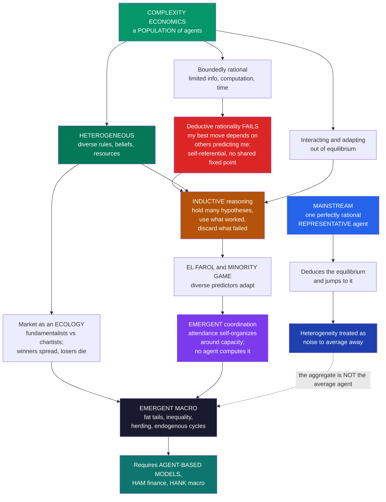

# 🍺 Bounded Rationality and Heterogeneous Agents

> [!abstract] TL;DR
> Complexity economics **rejects** the perfectly-rational **representative agent** of mainstream theory and rebuilds its microfoundations from **boundedly rational** (Herbert Simon: limited information, computation, and time) and, crucially, **heterogeneous** agents — diverse in their rules, beliefs, information, and resources. The reason is deep: in genuinely **complex, interactive** settings, perfect **deductive** rationality is *impossible or ill-defined*, because what is rational for you depends on what everyone else predicts you will do — an infinite regress with **no consistent shared solution**. Brian **Arthur's El Farol Bar problem** (1994) is the canonical parable: 100 people want a bar that is fun only if fewer than ~60 attend, but any strategy everyone shares is self-defeating. Arthur's escape is **inductive reasoning** — agents carry a *diverse cognitive toolbox* of hypotheses, act on whichever has worked recently, and discard those that fail. With **heterogeneous** inductive predictors, attendance *self-organizes* to fluctuate around 60 — an **emergent coordination no agent computes** and that a homogeneous population cannot achieve. The methodological payload: **diversity is not noise to be averaged away** but an *essential, generative* feature. It enables coordination, drives markets as an evolving **ecology of competing strategies** (fundamentalists versus chartists), and produces fat tails, inequality, herding, and endogenous cycles that a representative agent cannot — which is exactly why **agent-based modeling**, heterogeneous-agent finance, and heterogeneous-agent macro (HANK) are necessary.

---

## Intuition

**Analogy:** There is a bar in Santa Fe called **El Farol**, and 100 people would love to go on Thursday nights — *but only if it will not be too crowded*. Say the night is enjoyable only if fewer than **60** people show up; above that it is a miserable crush and you would rather have stayed home. Everyone decides independently, in advance, with no way to coordinate.

Now try to reason your way to the "rational" choice. Suppose everyone is smart and reasons the *same* way. If the shared conclusion is "it will be packed, so I will stay home," then *nobody* goes — the bar is empty and everyone who reasoned this way was **wrong**, they should have gone. But if the shared conclusion is "it will be empty, so I will go," then *everyone* goes — the bar is jammed and everyone was **wrong again**, they should have stayed home. There is **no consistent rational strategy that everyone can share**: the very act of predicting the crowd *changes* the crowd you are predicting. Any "correct" theory of what to do, if everyone adopts it, immediately falsifies itself.

Arthur's El Farol problem shattered the fantasy that there is a *single rational way to think*. Real economies do not run on one omniscient calculator cloned a million times. They run on **diverse agents using different rules of thumb** — some optimists, some contrarians, some trend-followers, some who just copy last week — each forever adapting to what the others are doing. It is precisely the **diversity** of their guesses that lets the crowd settle, on average, near the comfort level that no single one of them could ever deduce.

---

## How It Works

### The move complexity economics makes

Mainstream economics models a market with a **representative agent**: one perfectly rational, perfectly informed optimizer standing in for millions of people, who computes the equilibrium and jumps to it (the benchmark spelled out in [[The_Rational_Actor_Model_and_Its_Limits]] and [[Consumer_Optimization]]). Complexity economics replaces this fiction with a *population* of agents defined by three properties, whose **combination** is the whole point:

1. **Bounded rationality** (Herbert Simon). Agents have limited information, computation, attention, and time, so they cannot optimize over everything. They **satisfice** and lean on **heuristics** — the foundation developed in [[Bounded_Rationality_and_Satisficing]]. This note *inherits* that idea and pushes past it.
2. **Heterogeneity.** Agents are **diverse** — different rules, beliefs, information sets, wealth, and mental models. They are not identical copies with different draws of a shock; they *think differently*.
3. **Interaction.** They act on and adapt to one another, out of equilibrium, often on a network or in a market.

The micro-foundation of complexity economics is exactly **bounded rationality + heterogeneity + interaction**. Drop any one and you are back to conventional modeling; keep all three and you get an economy that must be *grown* in a simulation rather than solved in closed form (the program sketched in the planned siblings *Complexity_Economics_Overview* and *Economies_as_Complex_Adaptive_Systems*).

### Why perfect rationality fails where it is needed most

There are two distinct reasons deductive rationality breaks down in a complex economy, and the second is the killer.

- **The problem is too hard to compute.** Most real decisions are combinatorially or informationally intractable; no mind or machine can enumerate the options and solve for the true optimum. This is Simon's classic point.
- **What is rational depends on what others do — who are trying to predict *you*.** This is the deep problem, and El Farol makes it vivid. Your best action depends on the crowd; the crowd is everyone else's best action; their best action depends on *their* prediction of *you*. To deduce your move you must first know their moves, which requires knowing their model of your move, which requires their model of your model of their model — an **infinite regress with no fixed point** that all can share. As Arthur put it, *you cannot deductively reason your way to a decision when the decision depends on the decisions others are making about your decision.* Rationality does not merely get *hard* here; it becomes **ill-defined**. It breaks down exactly in the self-referential, expectational settings — markets, fashions, bank runs, speculative bubbles — where economics most needs it.

### Inductive reasoning: Arthur's alternative

Since **deduction** fails, Arthur asked how people *actually* cope, and answered: **inductively**. Real agents do not solve the problem; they **form multiple hypotheses** (mental models, forecasting rules), **act on the ones that have worked recently**, and **discard or revise** those that fail — exactly like scientists testing theories, or like an evolving ecology of ideas competing for survival in one head. Each agent carries a **diverse cognitive toolbox** and continually *adapts which tool it trusts*. Rationality becomes a *process of localized, provisional model-building under feedback*, not a one-shot calculation. Belief is **formed and updated**, never assumed correct in advance.

### The El Farol Bar problem and the Minority Game

Arthur's 1994 model makes this concrete. Each of `N = 100` agents decides each week whether to attend, where the bar is enjoyable only if attendance is below a comfort level (~60). There is provably **no deductively rational shared strategy** — expectations are self-defeating. But give each agent a handful of **diverse inductive predictors** (for example: "same as last week," "the mirror image of last week," "the average of the last four weeks," "always 60," a momentum rule), let each agent use whichever of *its* predictors has been most accurate lately, and something remarkable happens: **aggregate attendance self-organizes to fluctuate around 60**. The system finds the comfort level as an **emergent** property — no agent computes it, no agent intends it, and, crucially, it *requires* the predictors to be **heterogeneous**. If everyone used the same rule, they would all move together and the coordination would collapse (as the demo shows). Physicists later distilled this into the **Minority Game** (Challet & Zhang, 1997): `N` agents repeatedly choose one of two sides, and those in the **minority** win. It is the same self-referential structure, stripped to its bones, and it became a workhorse for studying how heterogeneous adaptive agents allocate themselves across options.

### Heterogeneity as essential, not noise

Here is the pivotal methodological claim. Mainstream economics **averages heterogeneity away** — the representative agent *is* the population mean, and dispersion around it is treated as inessential noise. Complexity economics insists the opposite: **diversity is essential and generative.**

- It **enables coordination** — El Farol works *because* agents differ; a homogeneous crowd cannot self-organize.
- It **drives markets** — trade requires *disagreement*. The **no-trade theorems** (Milgrom & Stokey) prove that purely rational agents with common priors would *never* speculatively trade; it is precisely **heterogeneous beliefs** that create volume, price discovery, and dynamics (a sharper version of the information story in [[Asymmetric_Information]]).
- It **produces distributions** — firm-size distributions, wealth **inequality**, and city sizes are outcomes of interacting heterogeneous agents, invisible to a single representative agent who *is* the average.
- It **constitutes the market itself** — a market is a *population of diverse, competing strategies*, an ecology, not a single optimizer.

Heterogeneity is thus a **first-class economic variable**, not an error term.

### Adaptive learning and the ecology of strategies

How do heterogeneous agents form and update beliefs? Through **adaptive expectations and learning** rather than by assuming **rational expectations** correct from the start: reinforcement learning, imitation, genetic-algorithm-like strategy evolution, and **replicator dynamics** (the "imitate the successful" law of [[Replicator_Dynamics]], and the evolutionary microfoundations of [[Evolutionary_Economics_and_Bounded_Rationality]]). Agents are **adaptive predictors in a co-evolving system**: as others adapt, the environment each faces shifts, so the target keeps moving.

Doyne **Farmer's "market ecology"** view crystallizes this: a market is an **evolving ecosystem** of heterogeneous strategies — **fundamentalists** (who bet price returns to value) versus **chartists / trend-followers** (who bet on momentum) versus **contrarians** and **noise traders**. Strategies that make money **spread** (are copied, funded, imitated); strategies that lose **die** (are defunded, abandoned). The strategy landscape is *never* at rest — a successful strategy changes the prices that made it successful, eroding its own edge, so the ecology forever churns. This foreshadows the vault's planned *The_Santa_Fe_Artificial_Stock_Market* and market-ecology notes, and connects to [[Herding_Bubbles_and_Crashes]] and [[Sentiment_and_Noise_Trading]] in behavioral finance.

### Why heterogeneity matters for the macro-aggregate

The payoff is that **the aggregate is not the average agent**. Heterogeneous, adaptive, interacting agents generate **emergent macro phenomena a representative agent structurally cannot**:

- **coordination failures** and multiplicity (El Farol, bank runs);
- **fat-tailed fluctuations** and volatility clustering (chartist-fundamentalist feedback);
- **distributional dynamics** — endogenous inequality and firm-size laws;
- **fashion, herding, and information cascades**;
- **endogenous booms and busts** arising from within, not from external shocks.

This is why the frontier of macro and finance has moved toward **heterogeneous-agent models** — **HAM** in finance (Brock & Hommes), **HANK** (Heterogeneous-Agent New Keynesian) in macro, where the *distribution* of wealth and marginal propensities to consume shapes aggregate demand and the transmission of policy, and full **agent-based** models (the planned siblings *Agent_Based_Modeling_in_Economics* and *Agent_Based_Macroeconomics*).



---

## Key Concepts

### Secondary Level

**One smart robot versus a crowd of different people.** Old-school economics pretends the whole economy is *one* super-smart person who knows everything and never makes mistakes, copied a million times. Complexity economics says: no, an economy is a **crowd of different people**, each a bit clueless, each using their own rough rules, all reacting to each other.

**The El Farol bar.** Imagine a bar that is fun only if it is *not* too crowded. If everyone thinks "it'll be packed, I'll skip it," it ends up empty and they all guessed wrong. If everyone thinks "it'll be empty, I'll go," it's packed and they all guessed wrong. There is *no* single clever answer everyone can use — because your guess changes the very thing you are guessing about.

**Why differences help.** The bar only works out nicely when people guess in **different** ways. Some go, some stay, and by luck of their disagreement the number who show up ends up close to "just right." Sameness breaks it; **variety fixes it.**

### Undergraduate Level

**Deductive vs inductive rationality.** *Deductive* reasoning derives the optimal action from known premises — it needs a well-defined problem and enough compute. In self-referential settings (my optimum depends on your prediction of my optimum) the premises are not well-defined, so deduction has *no closed form*. Arthur's **inductive rationality** replaces it: maintain a set of competing hypotheses, act on the currently best-performing one, update their credibility from feedback, and occasionally generate new hypotheses. Rationality becomes a *learning loop*, not a calculation.

**The representative-agent critique.** A representative-agent model assumes the economy behaves as if run by one optimizing household or firm. This is analytically convenient but suppresses (i) **aggregation effects** (the sum of heterogeneous behaviors is not the behavior of the average — the Sonnenschein-Mantel-Debreu results already warned that aggregate demand need not inherit individual rationality), (ii) **distributional dynamics**, and (iii) **interaction effects**. Complexity economics treats these as the *substance* of the economy, not distractions.

**Adaptive vs rational expectations.** Under **rational expectations** (Muth, Lucas), agents' subjective forecasts equal the model's true conditional expectations — beliefs are *correct on average by assumption*. Under **adaptive/learning** expectations, beliefs are **formed** from past data by boundedly rational rules and are heterogeneous across agents; whether they ever converge to rational expectations is itself an open, model-dependent question. Complexity economics starts from learning, not from imposed correctness.

**Heterogeneous-agent finance (chartists vs fundamentalists).** Brock & Hommes' **Adaptive Belief Systems** populate a market with a few predictor types (fundamentalist, trend-follower, contrarian) whose *shares evolve* by recent profitability (a **discrete-choice/replicator** rule). This simple heterogeneity endogenously generates **bubbles, crashes, fat tails, and volatility clustering** that a rational-representative-agent asset-pricing model cannot produce — the population dynamic behind [[Herding_Bubbles_and_Crashes]].

**No-trade theorems.** If all agents are rational with common priors, Milgrom-Stokey and Aumann's agreeing-to-disagree logic imply **zero speculative trade** — rational agents infer that anyone willing to trade with them must know something, so they refuse. The observed torrent of trading volume is itself evidence that **heterogeneous beliefs**, not a shared rational model, drive markets.

### Graduate Level

**El Farol as a formal ill-posed expectations problem.** Let attendance be `A_t` and comfort level `L`. Each agent's optimal action is `go` iff its forecast `E[A_t] < L`. But `A_t = sum of go-decisions`, so `A_t` is a functional of the *profile* of forecasts. A **homogeneous rational-expectations** fixed point requires a single forecast rule `f` such that everyone using `f` yields `A_t` consistent with `f` — and no such shared deterministic rule exists (any rule predicting `< L` induces `> L` and vice versa). A **mixed-strategy** symmetric equilibrium (each attends with probability `p = L/N`) *does* exist and is the natural game-theoretic resolution (see [[Mixed_Strategies]]), but Arthur's point is behavioral: real agents *reach* the neighborhood of `L` through **heterogeneous inductive adaptation**, and the *ecology of predictors* — not a computed mixed strategy — is what does the work. The **Minority Game** literature (Challet-Zhang, Savit, Marsili) then quantifies this: a control parameter `alpha = 2^m / N` (memory length versus population) governs a **phase transition** between a crowded, inefficient regime and an efficient regime, with fluctuations *minimized* near criticality — a genuine statistical-mechanics result about heterogeneous adaptive agents.

**Why the representative agent is a category error, not an approximation.** Kirman's "Whom or what does the representative agent represent?" argues the reduction is not merely inaccurate but can be *qualitatively wrong*: the aggregate can violate the very axioms (e.g., preference for a Pareto improvement) that each individual satisfies, and comparative statics of the representative agent can reverse those of the true population. Heterogeneity is therefore **irreducible** — you cannot recover the macro dynamics by perturbing a mean agent.

**Learning dynamics and the moving target.** With heterogeneous learners, the data-generating process is *endogenous to beliefs*, so the "true model" agents are learning is itself shifting — a **non-stationary, self-referential** estimation problem. Convergence-of-learning results (Evans & Honkapohja's E-stability; Marcet & Sargent) give conditions under which least-squares learners settle onto a rational-expectations equilibrium, but **misspecification, heterogeneity, and constant-gain (perpetual) learning** generically prevent it, producing endogenous regime-switching, escape dynamics, and excess volatility. This is the rigorous face of the "ecology of strategies."

**Market ecology and its selection dynamics.** Farmer's program treats capital allocation across strategies as a **generalized Lotka-Volterra / replicator** system: a strategy's "population" (capital) grows with its returns, but its market impact *depresses* the returns of correlated strategies (density dependence), yielding predator-prey-like cycles, niches, and diversity. Empirically this predicts crowding, strategy decay, and systemic fragility when the ecology loses diversity — connecting to [[Complex_Adaptive_Systems]], [[Emergence_and_Self_Organization]], and the churn documented in [[Sentiment_and_Noise_Trading]].

**HANK and the distributional macro frontier.** Heterogeneous-Agent New Keynesian models (Kaplan-Moll-Violante) show that with **wealth heterogeneity and borrowing constraints**, the *distribution* of marginal propensities to consume — not a single Euler equation — governs how monetary and fiscal policy transmit: most stimulus works through **indirect general-equilibrium** (income) channels invisible in representative-agent New Keynesian models. Heterogeneity here is not a friction bolted on; it *is* the transmission mechanism.

---

## Python Demo

```python
# ---------------------------------------------------------------------------
# THE EL FAROL BAR PROBLEM  (Brian Arthur, 1994)  /  MINORITY GAME
#
# N=100 people each week decide whether to attend a bar that is enjoyable only
# if attendance stays below a comfort CAPACITY L=60. Nobody can coordinate.
# There is NO deductively rational shared strategy (self-defeating expectations).
#
# Each agent reasons INDUCTIVELY: it carries a small, DIVERSE toolbox of simple
# predictors, uses whichever has been most accurate lately, and goes only if its
# forecast is below L. We show:
#
#   (a) HETEROGENEOUS agents -> aggregate attendance SELF-ORGANIZES to fluctuate
#       around the capacity (60). No agent computes this; it emerges, and it
#       REQUIRES diversity of strategies.
#   (b) HOMOGENEOUS agents (all one shared rule) -> coordination FAILS: the crowd
#       moves in lockstep and attendance swings wildly between empty and packed.
#
# numpy + matplotlib only.
# ---------------------------------------------------------------------------
import numpy as np
import matplotlib
matplotlib.use("Agg")                 # headless-safe backend
import matplotlib.pyplot as plt

N     = 100      # potential bar-goers
L     = 60       # comfort capacity: fun only if attendance <= L
WEEKS = 260      # weeks simulated (first WARM discarded as warm-up)
MEM   = 12       # weeks of history the predictors may read
DECAY = 0.85     # weight on past accuracy when scoring a predictor
WARM  = 30       # warm-up weeks to discard

# --- a DIVERSE pool of predictors: Arthur's "cognitive toolbox" ------------
# Each predictor maps recent attendance history -> a forecast of THIS week.
# They are simple, DIFFERENT rules of thumb; none is "the correct model".
def build_pool():
    pool, names = [], []
    for c in (20, 40, 50, 60, 70):                              # fixed-belief agents
        pool.append(lambda h, c=c: float(c));         names.append(f"const-{c}")
    pool.append(lambda h: float(h[-1]));              names.append("last-week")
    pool.append(lambda h: float(N - h[-1]));          names.append("mirror")     # contrarian
    for w in (2, 4, 8):                                          # trend smoothers
        pool.append(lambda h, w=w: float(np.mean(h[-w:]))); names.append(f"avg-{w}")
    pool.append(lambda h: float(np.clip(2*h[-1]-h[-2], 0, N))); names.append("momentum")
    pool.append(lambda h: float(0.5*(h[-1] + h[-5])));         names.append("cycle-5")
    return pool, names

POOL, NAMES = build_pool()
P = len(POOL)

def run_el_farol(homogeneous=False, K=5, seed=0):
    """One run. K = predictors per agent (1 and identical if homogeneous)."""
    rng  = np.random.default_rng(seed)
    hist = list(rng.integers(0, N + 1, size=MEM).astype(float))  # seed a history
    err  = np.zeros(P)               # recent squared error of each predictor
    seen = np.zeros(P, dtype=bool)   # has a predictor been scored yet?

    if homogeneous:                  # everyone shares ONE identical rule
        toolboxes = [np.array([NAMES.index("avg-4")]) for _ in range(N)]
    else:                            # each agent gets its OWN random subset
        toolboxes = [rng.choice(P, size=K, replace=False) for _ in range(N)]

    attendance, active_share = [], []
    for _ in range(WEEKS):
        h = np.array(hist)
        forecast = np.array([POOL[p](h) for p in range(P)])     # every rule's forecast
        counts, go = np.zeros(P), 0
        for tb in toolboxes:
            scores = np.where(seen[tb], err[tb], 0.0)           # untried -> optimistic
            best   = tb[int(np.argmin(scores))]                 # agent's currently trusted rule
            counts[best] += 1
            if forecast[best] < L:                              # go only if it won't be crowded
                go += 1
        att = go
        attendance.append(att)
        active_share.append(counts / N)
        # reveal the truth; update each predictor's recent squared error
        sq   = (forecast - att) ** 2
        err  = np.where(seen, DECAY*err + (1-DECAY)*sq, sq)
        seen[:] = True
        hist.append(float(att))
    return np.array(attendance), np.array(active_share)

het_att, het_share = run_el_farol(homogeneous=False, K=5, seed=1)
hom_att, _         = run_el_farol(homogeneous=True,        seed=1)

het = het_att[WARM:]
hom = hom_att[WARM:]
weeks = np.arange(WARM, WEEKS)

print("=" * 62)
print("EL FAROL BAR PROBLEM   (N = %d,  capacity L = %d)" % (N, L))
print("=" * 62)
print(f"  HETEROGENEOUS agents : mean {het.mean():5.1f}   std {het.std():5.1f}")
print(f"  HOMOGENEOUS  agents : mean {hom.mean():5.1f}   std {hom.std():5.1f}")
print(f"  -> diversity keeps attendance near {L}; sameness makes it swing wildly.")

# ===========================================================================
# FIGURE
# ===========================================================================
fig, ax = plt.subplots(2, 2, figsize=(15, 10))
fig.suptitle("The El Farol Bar Problem: heterogeneous inductive agents "
             "self-organize to the capacity", fontsize=13, fontweight="bold")

# ---- Panel A: heterogeneous attendance hovers around capacity -------------
axA = ax[0, 0]
axA.plot(weeks, het, color="#2563eb", lw=1.2)
axA.axhline(L, color="#dc2626", ls="--", lw=2, label=f"capacity = {L}")
axA.axhline(het.mean(), color="#059669", ls=":", lw=1.8,
            label=f"mean = {het.mean():.1f}")
axA.set_title("Heterogeneous agents:\nattendance self-organizes AROUND capacity")
axA.set_xlabel("week"); axA.set_ylabel("attendance (of 100)")
axA.set_ylim(0, 100); axA.legend(loc="upper right", fontsize=8); axA.grid(alpha=0.2)

# ---- Panel B: homogeneous agents swing wildly (coordination failure) ------
axB = ax[0, 1]
axB.plot(weeks, hom, color="#7c3aed", lw=1.2)
axB.axhline(L, color="#dc2626", ls="--", lw=2, label=f"capacity = {L}")
axB.set_title("Homogeneous agents (one shared rule):\n"
              "coordination FAILS - wild empty-to-packed swings")
axB.set_xlabel("week"); axB.set_ylabel("attendance (of 100)")
axB.set_ylim(-3, 103); axB.legend(loc="center right", fontsize=8); axB.grid(alpha=0.2)

# ---- Panel C: attendance distributions ------------------------------------
axC = ax[1, 0]
bins = np.arange(0, 102, 4)
axC.hist(het, bins=bins, color="#2563eb", alpha=0.75, label="heterogeneous")
axC.hist(hom, bins=bins, color="#7c3aed", alpha=0.55, label="homogeneous")
axC.axvline(L, color="#dc2626", ls="--", lw=2, label=f"capacity = {L}")
axC.set_title("Attendance distribution:\ndiversity concentrates near capacity")
axC.set_xlabel("attendance"); axC.set_ylabel("weeks")
axC.legend(fontsize=8); axC.grid(alpha=0.2)

# ---- Panel D: the evolving ECOLOGY of active strategies -------------------
axD = ax[1, 1]
axD.stackplot(weeks, het_share[WARM:].T, labels=NAMES)
axD.set_title("Ecology of strategies:\nwhich rule agents trust shifts over time")
axD.set_xlabel("week"); axD.set_ylabel("share of agents using rule")
axD.set_ylim(0, 1); axD.set_xlim(WARM, WEEKS - 1)
axD.legend(ncol=2, fontsize=6, loc="upper right")

plt.tight_layout(rect=[0, 0, 1, 0.95])
plt.savefig("el_farol_minority_game.png", dpi=110, bbox_inches="tight")
plt.show()
```

**What the demo shows:**

- **Panel A (heterogeneous):** with agents carrying *different* inductive toolboxes, weekly attendance settles into a tight band **fluctuating around the capacity of 60**. No agent ever computes 60; it is an **emergent** coordination produced by the population's disagreement. Whenever too many go, high-forecast predictors gain accuracy and their users stay home next time — a self-correcting negative feedback that centers the crowd on the comfort level.
- **Panel B (homogeneous):** when *every* agent uses the identical rule, they all forecast the same number and all move together, so attendance **swings violently between empty and packed**. Sameness destroys coordination — the crowd becomes a single synchronized agent that always over- or under-shoots.
- **Panel C (distributions):** the heterogeneous run's attendance is sharply concentrated near 60; the homogeneous run's is smeared across the extremes. Diversity is what buys the efficient, low-variance outcome.
- **Panel D (ecology of strategies):** the *share* of agents currently trusting each predictor **shifts continuously** — an evolving ecology in which rules rise and fall as the environment they helped create turns against them. This is the market-ecology idea in miniature: no strategy stays dominant, because its own success erodes its edge.

The headline: **heterogeneity is not noise** — it is the ingredient that lets a boundedly rational crowd coordinate on something none of them could deduce.

---

## Real-World Applications

> **Financial markets as a strategy ecology (chartists vs fundamentalists):** Brock & Hommes' Adaptive Belief Systems and Doyne Farmer's market-ecology models populate a market with *heterogeneous* predictor types whose capital shares evolve by recent profitability. This heterogeneity endogenously reproduces the stylized facts real markets show and representative-agent models cannot: **fat-tailed returns, volatility clustering, and bubble-crash cycles** — the population dynamics behind [[Herding_Bubbles_and_Crashes]] and [[Sentiment_and_Noise_Trading]]. The planned *The_Santa_Fe_Artificial_Stock_Market* note builds exactly such an agent-based market.

> **Congestion, routing, and resource allocation (the Minority Game in the wild):** El Farol is the archetype of every "avoid the crowd" problem — choosing a commuting route, a checkout line, a Wi-Fi channel, a server, or a market to enter. Systems where agents benefit from being in the **minority** self-organize (imperfectly) toward efficient load-balancing *only* when the agents are heterogeneous; homogeneous strategies produce destructive oscillation, the reason real load balancers deliberately randomize.

> **Heterogeneous-agent macroeconomics (HANK):** Kaplan-Moll-Violante-style models show that the **distribution** of wealth and marginal propensities to consume — not a single representative Euler equation — governs how monetary and fiscal policy actually transmit through the economy. Stimulus reaches spending mostly through indirect income channels that only exist because households are *diverse*. This is the macro-policy frontier and motivates the planned *Agent_Based_Macroeconomics*.

> **Agent-based models of whole economies:** The complexity-economics method (the planned *Agent_Based_Modeling_in_Economics*, and the general technique in [[Agent_Based_Modeling]]) instantiates populations of diverse adaptive firms and households, lets them interact out of equilibrium, and *grows* macro phenomena — inequality dynamics, business cycles, and cascades — bottom-up, capturing exactly what representative-agent DSGE models assume away.

> **Technology adoption and standards battles:** Heterogeneous agents with different information and switching costs, adapting to one another, produce path dependence and lock-in (QWERTY, VHS) — the evolutionary-selection story developed in [[Evolutionary_Economics_and_Bounded_Rationality]], where diversity plus increasing returns decides which standard wins.

---

## Common Pitfalls

- **Treating bounded rationality as "irrationality."** It is *procedural* rationality: agents use sensible, low-cost rules adapted to a hard, self-referential world. The claim is not that individuals are foolish but that the *aggregate* self-organizes precisely because they are boundedly rational and **diverse**.
- **Thinking El Farol just needs the mixed-strategy equilibrium.** A symmetric mixed equilibrium (attend with probability `L/N`) exists, but it is not how real agents *get there*, it is fragile to any correlation in behavior, and it hides the central lesson — that **heterogeneous inductive adaptation**, not a computed randomization, produces the emergent coordination. Reducing El Farol to its mixed equilibrium throws away the whole point.
- **Averaging heterogeneity away.** The representative-agent shortcut is not a harmless approximation: aggregation of heterogeneous agents can *reverse* comparative statics and violate axioms each individual obeys (Kirman; Sonnenschein-Mantel-Debreu). The aggregate is **not** the average agent.
- **Assuming diversity is always stabilizing.** Diversity *enables* coordination, but too little of it is dangerous in a different way: when a market's strategy ecology **loses diversity** (everyone crowds into the same trade), it becomes fragile and prone to synchronized crashes — the homogeneous-collapse case, live. The lesson cuts both ways.
- **Confusing adaptive learning with rational expectations.** Under learning, beliefs are *formed* and *heterogeneous* and need not converge to the true model; imposing rational expectations assumes away the non-stationary, self-referential dynamics (escapes, regime-switching, excess volatility) that make the system interesting.
- **Expecting a closed-form equilibrium.** With bounded rationality + heterogeneity + interaction, the object of study is an *out-of-equilibrium process*, not a fixed point. The honest tool is **simulation with robustness analysis**, and demanding an analytic solution discards the phenomena.

---

## Related Concepts

- [[Bounded_Rationality_and_Satisficing]] — the Simon foundation this note inherits: limited computation, information, and time, and satisficing over optimizing. This note adds **heterogeneity + interaction** on top.
- [[Evolutionary_Economics_and_Bounded_Rationality]] — the sibling engine: imitation and selection dynamics among boundedly rational agents; explains equilibrium-as-attractor, path dependence, and the ecology-of-routines view of firms.
- [[The_Rational_Actor_Model_and_Its_Limits]] — the perfectly-rational benchmark (and the representative agent) that complexity economics rejects.
- [[Complex_Adaptive_Systems]] — the general framing: many diverse adaptive agents producing emergent aggregate patterns; the economy as one such system.
- [[Emergence_and_Self_Organization]] — how attendance-around-60 (and market order) arises without any agent designing or computing it.
- [[Agent_Based_Modeling]] — the computational method complexity economics needs precisely because heterogeneity has no closed form.
- [[Adaptation_and_Learning_in_Systems]] — the reinforcement/learning dynamics by which heterogeneous agents update which rule they trust.
- [[Replicator_Dynamics]] — the "imitate the successful / winners spread, losers die" law behind strategy-share evolution and the market ecology.
- [[Cyclic_Dynamics_and_Rock_Paper_Scissors]] — the non-convergent, forever-churning dynamics that a diverse strategy ecology naturally displays.
- [[Nash_Equilibrium]] — the fixed-point solution concept El Farol frustrates in pure strategies and complexity economics reinterprets as an attractor at best.
- [[Mixed_Strategies]] — the game-theoretic resolution of El Farol (attend with probability `L/N`) that induction reaches only in aggregate.
- [[Herding_Bubbles_and_Crashes]] — the finance phenomena that heterogeneous chartist-fundamentalist populations generate endogenously.
- [[Sentiment_and_Noise_Trading]] — noise traders as one heterogeneous species in the market ecology; why belief diversity creates trade and volatility.
- [[Behavioral_Finance_Foundations]] — the individual-level heuristics whose population-level, interacting counterpart this note models.
- [[Market_Equilibrium]] — the static supply-demand fixed point recast here as an emergent, possibly out-of-equilibrium state.
- [[Consumer_Optimization]] — the fully-informed optimizer benchmark that bounded rationality departs from.
- [[Utility_Theory]] — the expected-utility framework whose unlimited-optimizer assumption fails in self-referential settings.
- [[Asymmetric_Information]] — the microeconomics of differing information; heterogeneity of *beliefs* generalizes it and underlies the no-trade theorems.
- [[Heuristics_and_Biases_Overview]] — the catalogue of rules of thumb that populate agents' cognitive toolboxes.
- [[Economic_and_Social_Complexity]] — the applied complexity-economics program (Santa Fe, Arthur, Beinhocker) this note anchors to.

> Siblings planned for this *Foundations Beyond Equilibrium* section — *Complexity_Economics_Overview*, *Economies_as_Complex_Adaptive_Systems*, *Agent_Based_Modeling_in_Economics*, *The_Santa_Fe_Artificial_Stock_Market*, *Evolutionary_Economics_and_Selection*, and *Agent_Based_Macroeconomics* — will each link back here as the microfoundational note on bounded rationality and heterogeneity.

---

## Review Questions

### Tier 1 — Conceptual

1. Explain, using the El Farol bar, why there is **no deductively rational strategy that everyone can share**. What is it about the situation that makes perfect deductive reasoning break down, and how is this different from the problem merely being "hard to compute"?
2. In your own words, what does it mean to reason **inductively** rather than **deductively**, and why did Arthur argue this is how people actually cope with complex, interactive decisions?
3. Complexity economics says the representative agent should be replaced by **boundedly rational, heterogeneous** agents. What are the three ingredients of its micro-foundation, and why does dropping any one collapse it back to conventional economics?

### Tier 2 — Applied

4. The demo shows heterogeneous agents keeping attendance near 60 while a homogeneous population swings between empty and packed. Explain the **feedback mechanism** that centers the heterogeneous crowd on the capacity, and explain precisely *why* a single shared rule cannot achieve it.
5. Pick a real "avoid the crowd" or "predict the market" setting (a commute route, a Wi-Fi channel, or a trading strategy). Map it onto the El Farol / Minority Game structure, and argue what would happen if all agents adopted the *same* predictor.
6. The **no-trade theorems** say purely rational agents with common priors would never speculatively trade, yet trading volume is enormous. What does this tell you about the role of **heterogeneous beliefs** in real markets, and how does the "ecology of strategies" view explain persistent trading?

### Tier 3 — Analytical / Open-ended

7. Alan Kirman argues the representative agent is a *category error*, not just an approximation, because aggregation can reverse the comparative statics and violate axioms each individual satisfies. Explain the claim and give one macroeconomic consequence (e.g., for policy transmission) of taking heterogeneity seriously, referencing HANK.
8. Under adaptive learning the "true model" agents estimate is *endogenous to their own beliefs*, making it a non-stationary, self-referential problem. Explain why this generically prevents convergence to rational expectations and what emergent phenomena (excess volatility, regime-switching, escapes) it can produce. Contrast with the E-stability conditions under which learning *does* converge.
9. Farmer's market-ecology models treat capital across strategies as a replicator/Lotka-Volterra system where a strategy's success depresses correlated strategies' returns. Explain how this predicts **strategy crowding and systemic fragility when diversity collapses**, and relate it to why regulators worry about herding into the same trades.

---

## Sources

- [Arthur, W. B. (1994). "Inductive Reasoning and Bounded Rationality." *American Economic Review* 84(2), 406-411 (the El Farol Bar problem)](https://www.jstor.org/stable/2117868)
- [Challet, D. & Zhang, Y.-C. (1997). "Emergence of Cooperation and Organization in an Evolutionary Game." *Physica A* 246(3-4), 407-418 (the Minority Game)](https://doi.org/10.1016/S0378-4371(97)00419-6)
- [Kirman, A. P. (1992). "Whom or What Does the Representative Individual Represent?" *Journal of Economic Perspectives* 6(2), 117-136](https://doi.org/10.1257/jep.6.2.117)
- [Brock, W. A. & Hommes, C. H. (1998). "Heterogeneous Beliefs and Routes to Chaos in a Simple Asset Pricing Model." *Journal of Economic Dynamics and Control* 22(8-9), 1235-1274](https://doi.org/10.1016/S0165-1889(98)00011-6)
- [Kaplan, G., Moll, B. & Violante, G. L. (2018). "Monetary Policy According to HANK." *American Economic Review* 108(3), 697-743](https://doi.org/10.1257/aer.20160042)
- [Farmer, J. D. (2002). "Market Force, Ecology and Evolution." *Industrial and Corporate Change* 11(5), 895-953](https://doi.org/10.1093/icc/11.5.895)
- [Simon, H. A. (1955). "A Behavioral Model of Rational Choice." *Quarterly Journal of Economics* 69(1), 99-118](https://doi.org/10.2307/1884852)

---

#complexity-economics #bounded-rationality #heterogeneous-agents #el-farol #inductive-reasoning
