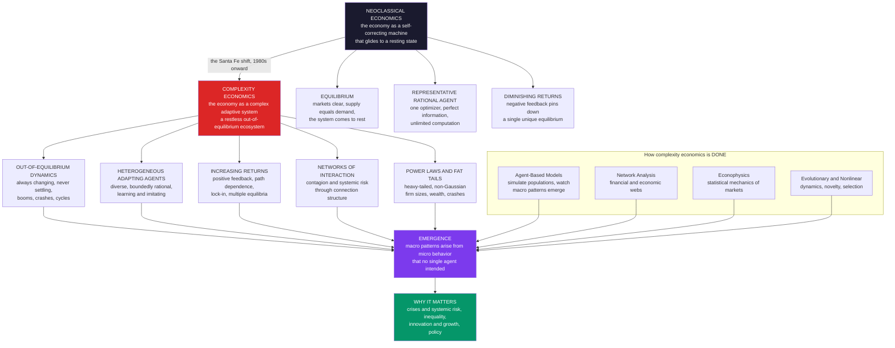

# 🌀 Complexity Economics — An Overview

> [!abstract] TL;DR
> **Complexity economics** treats the economy not as a self-correcting machine gliding to **equilibrium** but as a **complex adaptive system** — a restless, evolving web of **heterogeneous, boundedly-rational, adapting agents** whose interactions produce **emergent, out-of-equilibrium** macro phenomena: booms, crashes, growth, inequality, and innovation. It abandons the three load-bearing assumptions of neoclassical theory — **equilibrium** (markets clear, supply equals demand, the system rests), a **rational representative agent** (one optimizer with perfect information), and **diminishing returns** (negative feedback pinning a unique equilibrium) — and replaces them with **out-of-equilibrium dynamics**, **diverse learning agents**, and **increasing returns / positive feedback** (path dependence, lock-in, multiple equilibria). Pioneered at the **Santa Fe Institute** from the 1980s (W. Brian Arthur, John Holland, Kenneth Arrow, Philip Anderson, Doyne Farmer), it is done bottom-up through **agent-based computational models**, **networks**, and **statistical physics** (econophysics) rather than top-down analytical proofs. Heterodox but rising — and sharply vindicated by the **2008 crisis** that broke equilibrium models — it offers a more realistic, if less tidy, science of crises, inequality, innovation, and policy.

---

## Intuition

**Analogy:** A traffic jam has no cause you can point to. There is no broken-down car, no accident, no traffic light — nothing you could photograph and say "there, *that* is the jam." Yet the jam is unmistakably real: a wave of stopped cars rippling *backward* down the highway while every single car moves *forward*. It **emerged**, unplanned, from thousands of drivers each doing the most local, sensible thing — braking a little when the car ahead brakes. No driver intended a jam; no driver can end one; the pattern lives at a level *above* any individual and obeys its own logic.

Standard economics studies the highway when it flows smoothly — the **equilibrium** where traffic hums along at a steady speed and supply meets demand. Complexity economics studies the **jam**: the booms and crashes, the bubbles and inequality, the innovation and lock-in that emerge, unplanned, from millions of interacting, adapting, imperfect people. It refuses the comforting fiction of a self-correcting machine forever settling into balance and instead treats the economy as what it visibly *is* — a churning, out-of-equilibrium ecosystem that never comes fully to rest. The "jam" is not a market failure to be explained away. Like the traffic wave, it is what a system of locally-reacting agents *does*, and understanding it is the whole point.

The crucial reframing: the macro-patterns economists most care about — crises, wealth distributions, growth, technological revolutions — are **emergent** properties that *cannot be read off* the behavior of a single representative agent, any more than the traffic wave can be read off one car. To see them you must model the crowd.

---

## How It Works

Complexity economics is best understood as a **paradigm shift away from three neoclassical pillars**, each replaced by a richer assumption drawn from the science of [[Complex_Adaptive_Systems]]. The neoclassical program (the world of [[Market_Equilibrium]], [[Supply_and_Demand]], and [[Nash_Equilibrium]]) is powerful precisely because it is tidy: assume enough, and you can *prove* an equilibrium exists and is unique. Complexity economics trades that analytical tidiness for realism.

### The three great departures

1. **From equilibrium to out-of-equilibrium process.** Neoclassical theory studies the *resting state* — the price vector at which every market clears and no agent wishes to move. Complexity economics denies that the economy ever sits still. It is a **process**, perpetually in motion, in which agents' actions continually change the very environment other agents are responding to. The interesting phenomena — business cycles, bubbles, technological revolutions — are *transient, self-generated dynamics*, not deviations from a rest point. This is the world of [[Dissipative_Structures_and_Nonequilibrium]]: order sustained by continuous flux, not by settling down.

2. **From the rational representative agent to heterogeneous, boundedly-rational agents.** Neoclassical models often collapse the whole economy into one "representative" agent who optimizes with perfect information and unlimited computation. Complexity economics insists on **populations** of *diverse* agents who use rules of thumb, learn, imitate, and make systematic mistakes — the [[Bounded_Rationality_and_Satisficing]] of real people, imported wholesale from behavioral science. Heterogeneity is not a nuisance to be averaged away; it is the *engine* of the dynamics. When agents differ and adapt to each other, the aggregate can do things no single agent intends — exactly the [[Emergence_and_Self_Organization]] the traffic-jam analogy captures.

3. **From diminishing returns to increasing returns and path dependence.** Neoclassical theory leans on **negative feedback**: as an activity grows, it gets more expensive or less attractive, pulling the system back to a *unique* equilibrium ([[Returns_to_Scale]] that diminish). W. Brian Arthur's pivotal contribution was to take **increasing returns** and **positive feedback** seriously: technologies, standards, and cities that get ahead can get *further* ahead. This yields **multiple equilibria**, **lock-in**, and **path dependence** — small, early, chance events (who adopted QWERTY, VHS, or a particular chip architecture) can select which of many possible outcomes the economy freezes into. **History matters**, and the outcome is not necessarily the efficient one. This is [[Nonlinearity_and_Feedback]] doing economic work.

Layered on top are two further pillars: **networks** — agents interact through a specific *structure* of connections, so shocks propagate as contagion and systemic risk rather than washing out ([[Small_World_and_Scale_Free_Networks]], [[Cascades_and_Systemic_Risk]]) — and **power laws and fat tails** — firm sizes, city sizes, wealth, and market crashes follow *non-Gaussian* heavy-tailed distributions, the fingerprint of a system near [[Criticality_and_Phase_Transitions]] rather than one in placid equilibrium. Finally, **evolution and innovation**: the economy is an *evolving ecosystem* that generates genuine novelty — new products, technologies, and institutions — through variation, selection, and amplification, a theme shared with [[Evolutionary_Economics_and_Bounded_Rationality]].

### How the science is done — the methods

Complexity economics is a **computational, empirical, bottom-up** discipline, contrasting with the top-down analytical proofs of equilibrium theory. Its signature tool is **agent-based computational modeling (ABM)**: you specify simple behavioral rules for a large population of interacting agents, *simulate*, and watch macro patterns emerge (see [[Agent_Based_Modeling]]). Alongside ABM sit **network analysis** of economic and financial webs, **statistical physics / econophysics** (power laws, scaling laws, market microstructure statistics), **nonlinear dynamics** and **evolutionary models**, and increasingly **big data and machine learning**. Where neoclassical economics asks "what is the equilibrium and is it optimal?", complexity economics asks "what patterns *emerge*, how do they *evolve*, and how *stable* are they?"

### The paradigm shift, in one picture



---

## Key Concepts

### Secondary Level

**What complexity economics is.** Old-school economics pictures the economy as a machine that always balances out — like a scale that quickly settles level. Complexity economics says the economy is more like *weather* or a *traffic jam*: it's always churning, it makes storms and calms on its own, and the big patterns (crashes, booms, who ends up rich) come from millions of ordinary people bumping into each other, not from one grand plan.

**The traffic-jam idea (emergence).** A jam appears with no single cause — it *emerges* from lots of drivers each reacting to the car ahead. In the economy, crashes and bubbles work the same way: no one starts them, but they grow out of everyone copying and reacting to everyone else.

**Why the "perfect balance" story misses so much:**

| The old story says | The real world shows |
|---|---|
| The economy rests at a balance point | It never sits still — it booms and busts |
| One "average" rational person represents all | People are all different and make mistakes |
| Small advantages fade away | Small advantages can snowball (rich get richer) |
| Everyone plans on their own | People copy their neighbors, so panics spread |

**Why it matters.** The 2008 financial crash blindsided models built on "perfect balance." Complexity economics was built to study exactly those storms — so it can help spot fragile, crash-prone situations *before* they blow up.

### Undergraduate Level

#### The neoclassical benchmark and its three assumptions

Complexity economics is defined *against* a benchmark, so name it precisely. The neoclassical core assumes **equilibrium** — a price system at which all markets clear (supply equals demand) and no agent has an incentive to change behavior; a **rational representative agent** — preferences are complete, transitive, and stable, and choice maximizes expected utility using all information with unlimited computation, so the whole economy can be modeled as *one* optimizer; and **diminishing returns / negative feedback** — as an activity expands it becomes less profitable, which mathematically guarantees a *unique* equilibrium the system converges to. These assumptions are what make general-equilibrium theory *provable* and elegant. Complexity economics argues they are also what make it blind to the phenomena that matter most.

#### Increasing returns and path dependence (Arthur)

W. Brian Arthur's central result: when an activity exhibits **increasing returns** (adoption makes it *more* attractive — learning-by-doing, network effects, standardization), the economy has **multiple possible equilibria**, and which one is reached depends on **small, early, historically-contingent events**. The classic illustrations are **QWERTY** keyboards and **VHS versus Betamax** — arguably-inferior standards that *locked in* because early lead compounded. The formal engine is a **nonlinear Polya urn**: add a ball of the colour drawn, and the proportion converges to a *random* limit determined by the path, not by efficiency. This overturns the neoclassical presumption that markets select the optimum: with positive feedback, **history and chance select the outcome**, and it can be inefficient.

#### Emergence, agents, and the bottom-up method

The defining methodological commitment is that **macro is emergent from micro**. Rather than assume aggregate relationships (an economy-wide production function, a representative consumer), you model the *micro-agents* and let the aggregate appear. Thomas Schelling's segregation model is the canonical demonstration: agents with only a *mild* preference for like neighbors produce *sharp* macro-segregation that no agent wanted — a pattern invisible at the individual level. **Agent-based modeling** generalizes this: heterogeneous agents, local interaction rules, adaptation, and simulation. The output is not a proved theorem but an *observed* emergent regularity, which is then compared to real data (fat-tailed returns, firm-size distributions, wealth inequality).

#### Networks, contagion, and fat tails

Neoclassical models typically assume anonymous, well-mixed markets. Complexity economics insists interaction has **structure** — a network of who-trades-with-whom, who-lends-to-whom, who-imitates-whom. Structure changes everything: a shock that would dissipate in a well-mixed market can **cascade** through a network, producing systemic risk (the mechanism behind the 2008 interbank freeze). Related, the *distributions* that emerge are **heavy-tailed**: city sizes and firm sizes follow Zipf/power laws, wealth follows a Pareto tail, and market returns are **leptokurtic** with far more extreme moves than a Gaussian predicts. Fat tails are the statistical signature that the economy operates *out of equilibrium*, often near criticality — the province of **econophysics**.

### Graduate Level

#### Existence and uniqueness versus dynamics and selection

The neoclassical achievement (Arrow–Debreu) is a *static existence* result: under convexity and other conditions, a Walrasian equilibrium *exists*. But two deeper questions were quietly set aside. **Stability**: is the equilibrium *dynamically reached* by any plausible adjustment process? The Sonnenschein–Mantel–Debreu theorem is devastating here — aggregate excess-demand functions are essentially *arbitrary*, so tâtonnement need not converge and equilibrium need not be unique or stable. **Selection**: when there are many equilibria, *which* is chosen? Complexity economics answers both by making the **dynamics primary** — the object of study is the *adjustment process itself* (learning, adaptation, imitation), and equilibrium, if it appears at all, is an emergent, possibly-transient, possibly-multiple resting pattern, not an axiom.

#### The El Farol problem and the Santa Fe Artificial Stock Market

Arthur's **El Farol bar problem** crystallizes the limits of rational-expectations equilibrium. A hundred people each decide whether to go to a bar that is enjoyable only if fewer than 60 attend, using their own *forecasting models* of attendance. There is no consistent rational-expectations solution: if everyone predicts a crowd, none go, so the prediction is wrong; a *homogeneous* rational belief is self-refuting. The resolution is **inductive, heterogeneous** reasoning — agents hold *diverse* predictive hypotheses and discard those that fail — and attendance self-organizes around 60 with persistent fluctuations. Scaled up, this became the **Santa Fe Artificial Stock Market** (Arthur, Holland, LeBaron, Palmer, Tayler): agents co-evolve trading rules, and the market spontaneously reproduces **volatility clustering, fat tails, bubbles, and technical trading** — none assumed, all emergent — that the efficient-markets/rational-expectations model cannot generate endogenously.

#### Econophysics and the statistical mechanics of markets

The **econophysics** program (Mantegna, Stanley, Bouchaud, Farmer) applies statistical mechanics to markets: returns follow **truncated Lévy / power-law** tails with a characteristic exponent near 3, volatility exhibits **long-memory** clustering, and order-flow and price-impact obey scaling laws. The conceptual claim is that markets are **many-body systems** exhibiting universal, scale-free statistics — analogous to systems at a **critical point** — rather than efficient aggregators sitting at a Gaussian equilibrium. This links complexity economics to [[Criticality_and_Phase_Transitions]] and self-organized criticality, and reframes crashes not as exogenous shocks but as *endogenous, avalanche-like* rearrangements of a stressed system.

#### The critique, and the honest status of the field

Complexity economics is **heterodox** — influential and growing, but not (yet) the mainstream. The strongest criticisms are fair and worth stating: agent-based models can lack the **analytical tractability** and **sharp, falsifiable predictions** of equilibrium models; with enough free parameters and behavioral rules, "anything can happen," raising serious **calibration, identification, and validation** challenges (the "you can fit an elephant" worry); and there is as yet no unifying theoretical core comparable to general-equilibrium theory. The counter-case is empirical: mainstream models systematically *fail* on the phenomena complexity economics was built for — endogenous crises, fat tails, persistent inequality dynamics, innovation and growth. After **2008**, when equilibrium/DSGE and efficient-markets models were caught flat-footed, agent-based *macroeconomics* and *systemic-risk* modeling gained real traction with central banks. The productive stance is not "complexity replaces neoclassical" but "different tools for different questions" — and complexity economics owns the questions about *disequilibrium, structure, and change*.

---

## Python Demo

```python
import numpy as np
import matplotlib
matplotlib.use("Agg")
import matplotlib.pyplot as plt

# ----------------------------------------------------------------------
# COMPLEXITY ECONOMICS vs the NEOCLASSICAL EQUILIBRIUM PREDICTION.
#
# A minimal AGENT-BASED market in the spirit of Kirman's "ant" herding
# model. N boundedly-rational traders each hold one of two moods:
#   optimist (+, bullish)  or  pessimist (-, bearish).
# Every step two forces act on each trader:
#   epsilon : idiosyncratic re-thinking  (switch mood on your own)
#   delta   : HERDING / imitation        (drift toward the current majority)
#
# No trader plans a bubble. Yet booms, crashes, volatility clustering,
# and FAT-TAILED returns EMERGE from local imitation alone -- exactly the
# macro structure that the equilibrium view (a flat, self-correcting price
# with Gaussian noise) cannot produce.
# ----------------------------------------------------------------------
rng = np.random.default_rng(7)

N       = 200        # number of traders
epsilon = 0.03       # spontaneous mood flip (independent thinking)
delta   = 0.95       # herding strength   (epsilon + delta < 1 keeps probs valid)
T       = 3000       # trading steps
F       = 100.0      # fundamental value = the neoclassical "equilibrium" price
kappa   = 1.5        # how strongly net demand moves the log-price

opt  = N // 2                    # start balanced: half the crowd is optimistic
sent = np.empty(T)               # sentiment = (fraction optimist) - 1/2  in [-.5,.5]
for t in range(T):
    frac_opt = opt / N
    frac_pes = 1.0 - frac_opt
    # per-agent flip probabilities: rethinking + pull toward the majority
    p_opt_to_pes = epsilon + delta * frac_pes    # optimist turns bearish
    p_pes_to_opt = epsilon + delta * frac_opt    # pessimist turns bullish
    n_down = rng.binomial(opt,     p_opt_to_pes)
    n_up   = rng.binomial(N - opt, p_pes_to_opt)
    opt    = int(np.clip(opt - n_down + n_up, 0, N))
    sent[t] = opt / N - 0.5

# --- COMPLEXITY view: price responds to the change in net demand ---------
ret_cx   = kappa * np.diff(sent, prepend=sent[0])   # emergent returns
price_cx = F * np.exp(np.cumsum(ret_cx))            # emergent boom-bust price

# --- NEOCLASSICAL benchmark: representative rational agent, market clears
#     at fundamental value every period -> price GLUED to F, iid Gaussian
#     noise with the SAME variance as the complexity returns. ------------
ret_eq   = rng.normal(0.0, ret_cx.std(), T)
price_eq = np.full(T, F)                            # flat: no endogenous bubbles

def excess_kurtosis(z):
    """Excess kurtosis: 0 for a Gaussian, > 0 for fat tails."""
    z = z - z.mean()
    return (z**4).mean() / (z**2).mean()**2 - 3.0

k_cx, k_eq = excess_kurtosis(ret_cx), excess_kurtosis(ret_eq)

print("=" * 64)
print("EMERGENT MARKET (complexity)  vs  EQUILIBRIUM PREDICTION")
print("=" * 64)
print(f"  price range (complexity) : {price_cx.min():6.1f} to {price_cx.max():6.1f}"
      f"   (endogenous boom-bust)")
print(f"  price (equilibrium)      : {F:6.1f}  flat  (market always clears at F)")
print(f"  return std : complexity {ret_cx.std():.4f}   equilibrium {ret_eq.std():.4f}"
      f"   (matched)")
print(f"  excess kurtosis : complexity {k_cx:6.2f}   equilibrium {k_eq:6.2f}")
print("  -> same variance, but complexity returns are FAT-TAILED; the")
print("     equilibrium benchmark is Gaussian (excess kurtosis near 0).")

# ------------------------------- FIGURE --------------------------------
fig, (ax1, ax2, ax3) = plt.subplots(1, 3, figsize=(17, 5.2))
fig.suptitle("Complexity Economics: emergent out-of-equilibrium market "
             "vs the neoclassical equilibrium", fontsize=13, fontweight="bold")

# Panel 1: emergent boom-bust price vs the flat equilibrium price
ax1.plot(price_cx, color="#dc2626", lw=1.3,
         label="emergent price (agent-based herding)")
ax1.axhline(F, color="#1a1a2e", ls="--", lw=1.6,
            label="equilibrium price = fundamental F")
ax1.set_title("Price: emergent booms & crashes\nvs a self-correcting equilibrium",
              fontsize=10)
ax1.set_xlabel("time (trading steps)"); ax1.set_ylabel("price")
ax1.legend(fontsize=8, loc="upper left"); ax1.grid(alpha=0.25)

# Panel 2: volatility clustering in the emergent returns
ax2.plot(ret_cx, color="#7c3aed", lw=0.7)
ax2.axhline(0, color="black", lw=0.7)
ax2.set_title("Emergent returns: volatility CLUSTERS\n(calm, then bursts at regime flips)",
              fontsize=10)
ax2.set_xlabel("time (trading steps)"); ax2.set_ylabel("return")
ax2.grid(alpha=0.25)

# Panel 3: fat-tailed return distribution vs the Gaussian benchmark
bins = np.linspace(min(ret_cx.min(), ret_eq.min()),
                   max(ret_cx.max(), ret_eq.max()), 61)
ax3.hist(ret_cx, bins=bins, density=True, color="#dc2626", alpha=0.55,
         label=f"complexity  (excess kurt {k_cx:.1f})")
ax3.hist(ret_eq, bins=bins, density=True, histtype="step", color="#1a1a2e",
         lw=1.8, label=f"equilibrium Gaussian  (excess kurt {k_eq:.1f})")
ax3.set_yscale("log")
ax3.set_title("Return distribution: FAT TAILS\nvs the equilibrium Gaussian",
              fontsize=10)
ax3.set_xlabel("return"); ax3.set_ylabel("density (log scale)")
ax3.legend(fontsize=8, loc="upper center"); ax3.grid(alpha=0.25)

plt.tight_layout(rect=[0, 0, 1, 0.93])
plt.savefig("complexity_economics_overview.png", dpi=110, bbox_inches="tight")
plt.show()
```

**What the demo shows:**

- **Panel 1 (price).** Local imitation with *no* central plan produces an **emergent boom-bust** price that wanders far from the fundamental value `F` and back, again and again. The neoclassical prediction is the flat dashed line at `F`: a market that *always clears at the fundamental*, self-correcting and eventless. The gap between the red trajectory and the black line *is* the phenomenon equilibrium theory throws away.
- **Panel 2 (returns over time).** The emergent returns show **volatility clustering** — long calm stretches punctuated by violent bursts as the crowd's mood regime flips. Equilibrium/efficient-market noise, by contrast, would be homoskedastic (uniform amplitude). Clustering is a hallmark of real financial data that the agent rules were *never told to produce*.
- **Panel 3 (distribution).** With the *same variance* deliberately imposed on both series, the emergent returns are sharply **leptokurtic** — a tall peak and **fat tails** far heavier than the Gaussian benchmark (note the log-scaled y-axis, where the red tails tower over the black Gaussian). Extreme moves that a Gaussian world deems essentially impossible occur routinely. This is the statistical signature of an **out-of-equilibrium** market — and precisely where the 2008-era Gaussian risk models failed catastrophically.

The takeaway in one line: **same building blocks, radically different worlds.** Impose equilibrium and you predict a placid, self-correcting, Gaussian market. Let heterogeneous agents *herd and adapt*, and booms, crashes, clustering, and fat tails emerge on their own — no external shock required.

---

## Real-World Applications

> **Financial crises and systemic risk.** The flagship case. The 2008 crash exposed the failure of equilibrium and efficient-markets models that assumed Gaussian risk and self-correction. Complexity economics reframes crises as **endogenous, network-driven cascades**: a shock propagates through the web of interbank exposures and fire-sale spillovers, amplified by leverage and herding, until a stressed system rearranges avalanche-style. Central banks (the Bank of England, the ECB, the Office of Financial Research) now build **agent-based and network models of systemic risk** and macroprudential stress tests directly on these ideas — see [[Cascades_and_Systemic_Risk]] and [[Global_Financial_Crises]].

> **Inequality and the emergence of wealth distributions.** Wealth is empirically **Pareto/power-law** distributed in the tail — a few hold a hugely disproportionate share. Agent-based and stochastic-multiplicative models show how such heavy tails *emerge* from simple mechanisms (multiplicative returns, increasing returns to capital, network position) rather than from differences in talent or effort alone. Complexity economics thus supplies a *generative* account of inequality dynamics that static equilibrium distribution theory lacks.

> **Innovation, growth, and economic complexity.** Beinhocker's *The Origin of Wealth* frames growth as an **evolutionary search** over a vast space of technologies and business designs — wealth is "knowledge" accumulated by a variation-selection-amplification process. Empirically, Hidalgo and Hausmann's **Economic Complexity Index** and the **product space** show that what a country *can* make — and what it can learn to make next — predicts growth far better than capital stocks, treating development as movement through an evolving network of capabilities.

> **Endogenous business cycles.** Where neoclassical models often need *external* shocks to generate fluctuations, agent-based macro models (the "**agent-based macroeconomics**" program, e.g. the EURACE and Keynes-meets-Schumpeter models) generate **endogenous** cycles, credit booms, and recessions from the interaction of heterogeneous firms, banks, and households — complementing (and challenging) [[Solow_Growth_Model]]-style and DSGE approaches to [[Business_Cycle_Indicators]] and [[Endogenous_Growth_Theory]].

> **Policy and macroprudential regulation.** Because agent-based models let you *experiment* on a synthetic economy, they are increasingly used for **policy design** — stress-testing regulations, tax changes, and interventions in a heterogeneous population before deploying them, capturing distributional and out-of-equilibrium effects that representative-agent models average away.

---

## Common Pitfalls

- **Hearing "out of equilibrium" as "chaos / anything goes."** Out-of-equilibrium does *not* mean random or lawless. Emergent patterns — power-law firm sizes, clustered volatility, ~60 people at El Farol — are *robust, reproducible statistical regularities*. The claim is that these regularities live at the aggregate level and cannot be derived from a single representative agent, not that structure is absent.

- **Treating complexity economics as "neoclassical is wrong."** The mature view is *scope*, not refutation. General-equilibrium theory is a superb tool for questions about allocation, prices, and welfare under stable conditions. Complexity economics owns the *other* questions — disequilibrium, structure, change, crises, novelty. Framing it as a grudge match misrepresents both and invites easy dismissal.

- **Over-fitting agent-based models ("you can fit an elephant").** The field's real methodological weakness. With enough agents, rules, and free parameters, an ABM can reproduce almost any target series, which is *not* evidence the mechanism is right. Credible practice demands **out-of-sample validation**, matching *multiple independent stylized facts* at once, parameter parsimony, and sensitivity analysis — not a single tuned run that hits the data.

- **Confusing "emergent" with "mysterious."** Emergence is a precise, demonstrable phenomenon (Schelling segregation, the traffic jam), not hand-waving about the whole being "more than the sum." If you cannot *simulate* the micro-rules and *watch* the macro-pattern appear, you have not shown emergence — you have asserted it.

- **Assuming fat tails are just "shocks."** Labeling every extreme move an exogenous shock is the equilibrium modeler's escape hatch. The complexity claim is stronger and testable: large moves are often **endogenous** — generated by the system's own herding, leverage, and network structure — so they cannot be regulated away by simply "reducing external shocks."

- **Ignoring that heterogeneity is the point, not a complication.** Averaging diverse agents into a representative agent can *destroy* the very dynamics you are trying to study (herding, contagion, path dependence). If your first move is to collapse the population into its mean, you have quietly re-assumed the neoclassical world.

---

## Related Concepts

**The complex-systems foundations (Systems Thinking vault):**

- [[Complex_Adaptive_Systems]] — the core organizing concept: the economy *is* a CAS of interacting, adapting agents; this vault applies that lens to economics specifically.
- [[Emergence_and_Self_Organization]] — the mechanism behind the traffic-jam analogy; how macro-order arises from micro-interaction without a designer.
- [[Agent_Based_Modeling]] — the signature computational method of complexity economics, imported from complex-systems science.
- [[Nonlinearity_and_Feedback]] — positive feedback is what turns increasing returns into lock-in and path dependence.
- [[Small_World_and_Scale_Free_Networks]] — the interaction structures through which economic shocks propagate and heavy tails arise.
- [[Cascades_and_Systemic_Risk]] — how a local shock becomes a system-wide crisis; the engine of financial-crisis modeling.
- [[Criticality_and_Phase_Transitions]] — the physics of fat tails and sudden regime change; the econophysics link.
- [[Dissipative_Structures_and_Nonequilibrium]] — order sustained by continuous flux, the physical picture of an out-of-equilibrium economy.
- [[Network_Science_Fundamentals]] — the formal toolkit for the "economy as a network of interactions" pillar.
- [[Economic_and_Social_Complexity]] — the Systems Thinking vault's own application note; this vault is its economics deep-dive.

**The neoclassical benchmark being challenged (Micro / Macro / Game Theory):**

- [[Market_Equilibrium]] — the resting-state concept complexity economics de-throttles from axiom to (possibly transient) emergent pattern.
- [[Supply_and_Demand]] — the market-clearing mechanism assumed to always hold in equilibrium theory.
- [[Returns_to_Scale]] — *diminishing* returns give a unique equilibrium; Arthur's *increasing* returns give multiplicity and path dependence.
- [[Nash_Equilibrium]] — the rational-agent equilibrium concept; complexity economics studies the *disequilibrium* adjustment process instead.
- [[Solow_Growth_Model]] — the equilibrium growth benchmark that evolutionary/agent-based growth theory reconceives.
- [[Business_Cycle_Indicators]] — cycles as *endogenous* emergent dynamics rather than responses to external shocks.
- [[Endogenous_Growth_Theory]] — the neoclassical attempt to internalize innovation; complexity economics pushes further into evolutionary novelty.
- [[Global_Financial_Crises]] — the 2008 case that vindicated the complexity critique of equilibrium risk models.

**The behavioral and evolutionary agents (Behavioral Econ / EGT / Quant Finance):**

- [[Bounded_Rationality_and_Satisficing]] — the realistic agent complexity economics builds on, in place of the perfect optimizer.
- [[The_Rational_Actor_Model_and_Its_Limits]] — the representative-rational-agent assumption dissected; shared ground with behavioral economics.
- [[Herding_Bubbles_and_Crashes]] — the imitation dynamics that drive the emergent booms and crashes in this note's demo.
- [[Evolutionary_Economics_and_Bounded_Rationality]] — the economy as an evolving population of strategies; the evolution-and-selection pillar.
- [[Evolutionary_Dynamics_in_Markets_and_Institutions]] — how markets and institutions evolve, complementing the "evolving ecosystem" framing.
- [[GARCH_Models]] — the econometric capture of volatility clustering and fat tails that this vault explains *mechanistically* via agent interaction.

**Forthcoming siblings in this vault (planned, not yet written):** *The Limits of Neoclassical Equilibrium*, *Economies as Complex Adaptive Systems*, *Bounded Rationality and Heterogeneous Agents*, *Increasing Returns and Path Dependence*, *Agent-Based Modeling in Economics*, *The Santa Fe Artificial Stock Market*, *Economic Networks and Interaction Structure*, *Power Laws and Heavy Tails in Economics*, *Evolutionary Economics and Selection*, *Econophysics and Statistical Mechanics of Markets*, *Agent-Based Macroeconomics*, and *The Reach and Future of Complexity Economics*. This overview is the map; those notes are the territory.

---

## Review Questions

### Secondary

1. A traffic jam appears even when there is no crash, no stalled car, and no traffic light. In your own words, what does it mean to say the jam "emerges," and how is a stock-market crash or a bubble like a traffic jam?
2. Old economics pictures the economy as a scale that quickly settles level. Give two ways the real economy behaves *unlike* a scale that settles, and say why "always churning" might describe it better.
3. Why did the 2008 financial crash surprise the "everything balances out" models so badly, and why might a science built to study storms — rather than calm — have a better chance of seeing the next one coming?

### Undergraduate

1. State the three core neoclassical assumptions (equilibrium, representative rational agent, diminishing returns) and, for each, name the complexity-economics replacement and explain what new phenomenon that replacement lets you capture.
2. Explain Arthur's increasing-returns argument using QWERTY or VHS. Why does positive feedback produce *multiple equilibria* and *path dependence*, and why does it break the neoclassical presumption that markets select the efficient outcome?
3. Using the Schelling segregation model or the herding market in this note's demo, explain precisely what "emergence" means and why a representative-agent model — one that averages the population into its mean — would *fail* to reproduce the macro pattern.

### Graduate

1. The Sonnenschein–Mantel–Debreu theorem shows that aggregate excess-demand functions are essentially unrestricted, so Walrasian equilibrium need not be unique or stable. Explain how this result motivates the complexity-economics decision to make *dynamics* primary, and contrast the questions "does an equilibrium exist?" with "what does the adjustment process actually do?"
2. Arthur's El Farol bar problem has *no* consistent rational-expectations equilibrium. Explain why homogeneous rational belief is self-refuting there, how *inductive, heterogeneous* reasoning resolves it, and how the same logic scales up to make the Santa Fe Artificial Stock Market reproduce volatility clustering and fat tails endogenously.
3. State the strongest methodological critique of agent-based economics (tractability, weak falsifiability, the "fit an elephant" over-parameterization problem) and the strongest empirical case in its favor (the 2008 failure of equilibrium risk models; endogenous crises, fat tails, and inequality dynamics). Where do you place the field — replacement for, or complement to, neoclassical theory — and what evidence would move you?

---

## Sources

- [Arthur, W. B. (2021). "Foundations of Complexity Economics." *Nature Reviews Physics* 3, 136–145](https://doi.org/10.1038/s42254-020-00273-3)
- [Arthur, W. B. (2015). *Complexity and the Economy*. Oxford University Press](https://global.oup.com/academic/product/complexity-and-the-economy-9780199334292)
- [Arthur, W. B., Durlauf, S. N. & Lane, D. A. (eds.) (1997). *The Economy as an Evolving Complex System II*. Addison-Wesley / SFI](https://www.taylorfrancis.com/books/edit/10.4324/9780429496639/economy-evolving-complex-system-ii-brian-arthur-steven-durlauf-david-lane)
- [Beinhocker, E. D. (2006). *The Origin of Wealth: Evolution, Complexity, and the Radical Remaking of Economics*. Harvard Business School Press](https://www.hbs.edu/faculty/Pages/item.aspx?num=22090)
- [Farmer, J. D. (2024). *Making Sense of Chaos: A Better Economics for a Better World*. Allen Lane / Yale University Press](https://yalebooks.yale.edu/book/9780300273984/making-sense-of-chaos/)
- [Kirman, A. (2010). *Complex Economics: Individual and Collective Rationality*. Routledge](https://doi.org/10.4324/9780203847497)

---

#complexity-economics #agent-based-modeling #emergence #out-of-equilibrium #santa-fe
