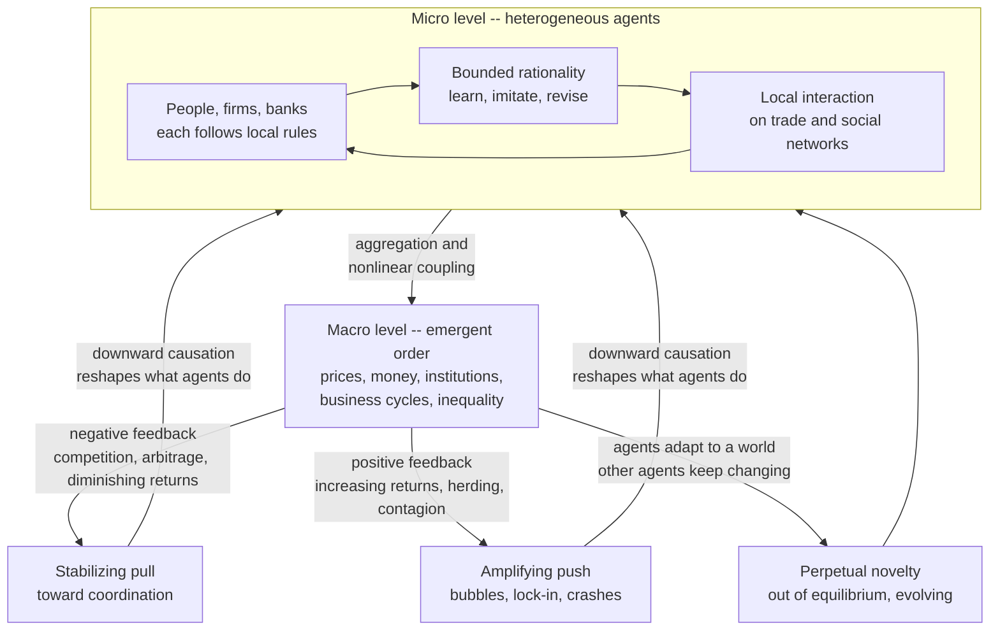

# 🐜 Economies as Complex Adaptive Systems

> [!abstract] TL;DR
> The founding move of **complexity economics** is to stop modelling the economy as a **machine** that solves for a unique equilibrium and instead treat it as a **complex adaptive system (CAS)**: a large population of **heterogeneous, boundedly-rational agents** — people, firms, banks — who **interact locally**, **adapt and learn** rather than globally optimize, with **no central controller**, and out of whose interactions sophisticated macro-order (prices, money, institutions, business cycles, inequality) **emerges** and **self-organizes** that no one designed. This is Adam Smith's invisible hand and Hayek's spontaneous order reread as **emergence**. Because the "adaptive" agents co-evolve — each adapting to a world the others keep changing — the interplay of stabilizing **negative feedback** and destabilizing **positive feedback** keeps the economy **perpetually out of equilibrium**. This ecology-not-machine worldview cannot be captured by representative-agent equilibrium solutions; it demands agent-based simulation, network analysis, and evolutionary thinking, and it is the foundational lens of the whole field. It is the worldview developed in the companion *Complexity_Economics_Overview* and set against orthodoxy in *The_Limits_of_Neoclassical_Equilibrium*.

---

## Intuition

**Analogy — London was never designed.** No committee decided where London's markets, banks, guilds, and neighborhoods should go. No architect drew the tangle of streets, the clustering of the money trade around the City, the emergence of Fleet Street as the home of print. Yet a staggeringly intricate, functional order **emerged** from centuries of individuals each pursuing their own local ends — a butcher choosing a corner, a lender opening near other lenders, a family settling where rent was cheap. An **anthill has no architect**; a **market has no central planner**; both are **complex adaptive systems** in which sophisticated global order arises from simple agents following local rules and adapting to one another.

The economy, complexity economics insists, is exactly this kind of thing: **an ecology, not a machine — grown, not built; evolving, not solved.** The temptation of orthodox theory is to see the economy as a well-oiled mechanism that computes its own equilibrium and sits there. But nobody computes the price of bread, nobody assigns firms to industries, nobody sets the business cycle in motion. These are all **emergent** — the results of human action but not of human design. Once you see the anthill in the marketplace, the whole research program follows.

---

## How It Works

### Core Mechanics

**1. The central conceptual move — the economy is a CAS.** The move that defines the field, developed at the **Santa Fe Institute** by **W. Brian Arthur**, **John Holland**, Stuart Kauffman, and others, is to import the machinery of [[Complex_Adaptive_Systems]] wholesale into economics. Strip the economy down to its actors and you find *many* agents that are *heterogeneous* (they differ in wealth, beliefs, strategies, and history), that *interact locally* (a firm responds to its customers, suppliers, and rivals, not to the whole world at once), that *adapt* (they learn, experiment, and revise their rules), and that answer to *no auctioneer* computing a clearing price. From these micro-interactions, macro-structure **emerges** and then loops back to reshape the agents. The economy is therefore best understood "as an ecology or an organism, not a machine."

**2. The hallmarks of a CAS, applied to the economy.** What makes a system *complex adaptive* rather than merely *complex* is a defining cluster of features — and every one has an economic face:

- **Many interacting components (heterogeneous agents).** Not one representative household but millions of distinct ones. Diversity is not noise to average away; it is the raw material of adaptation and the source of most interesting dynamics. This is the theme of the sibling note *Bounded_Rationality_and_Heterogeneous_Agents*.
- **Local interaction.** Each agent responds to its neighbors and local information — the prices it can see, the firms it competes with, the people it knows — not to a global blackboard. Interaction structure is often a **network**.
- **Adaptation and learning.** This is the word that separates economic CAS from a mere physical complex system such as a turbulent fluid. Agents *learn*, *experiment*, *form expectations*, and *change their rules*. They are **boundedly rational** ([[Bounded_Rationality_and_Satisficing]]) and they evolve their strategies over time.
- **Nonlinearity and feedback.** Small causes can have large effects; effects are not proportional to causes. Positive and negative [[Nonlinearity_and_Feedback|feedback loops]] dominate the behavior.
- **Emergence.** Macro patterns appear that are not present in, and not predictable from, any single agent's behavior.
- **Self-organization.** Order arises without central design.
- **Openness and evolution.** The system is open, never closed; it generates continual novelty and never stops changing.

**3. Emergence in the economy.** The key phenomenon. Market prices, money, institutions, the division of labor, business cycles, inequality, technological trajectories — all of these macro-level structures **emerge** from the interactions of individuals **without anyone designing or intending them**. This is the eighteenth-century insight of Adam Ferguson — social order is "the result of human action, but not the execution of any human design" — and it is Adam Smith's **invisible hand**, reread through a twenty-first-century lens as **emergence**. The whole is more than, and *different in kind* from, the sum of its parts: you cannot understand a market crash or the price level by studying one trader, however carefully. This is precisely why the **representative agent** — the orthodox device of modelling the whole economy as one scaled-up rational individual — is the wrong tool, a point pressed in *The_Limits_of_Neoclassical_Equilibrium*.

**4. Self-organization and spontaneous order.** The economy **organizes itself**. Markets discover prices, supply chains coordinate deliveries across continents, cities structure themselves into districts, and money itself **emerges as a convention** — all through decentralized interaction and feedback, not central planning. This is **Friedrich Hayek's "spontaneous order,"** and his **knowledge problem** is an early complexity insight of the first rank: the information needed to run an economy — who wants what, at what cost, where — is **dispersed** in fragments across millions of minds, known to no one in full, and the **price system coordinates that dispersed local knowledge** without ever centralizing it. Order for free, from the bottom up.

**5. The "adaptive" in CAS — what makes economies special.** A hurricane is a complex system, but its molecules do not *strategize*. Economic agents do. They **learn from experience**, **imitate what works**, **experiment**, and **form expectations about a future that other expectation-forming agents are also shaping**. And because everyone co-adapts to everyone else, the target is always moving: Arthur's dictum is that **"the economy is perpetually novel."** Adaptation is the engine of change, and it links directly to evolutionary treatments of the economy ([[Evolutionary_Economics_and_Bounded_Rationality]], [[Replicator_Dynamics]]) — strategies compete, spread, and die like species in an ecosystem.

**6. Feedback — the two kinds, and why both matter.** The dynamics turn on two feedbacks that orthodox theory weights very unequally:

- **Negative feedback stabilizes.** Diminishing returns, competition, and arbitrage all *pull the system back*: if a price is too high, buyers withdraw and it falls. This is the machinery underneath the tidy equilibrium picture, and it is real.
- **Positive feedback destabilizes and amplifies.** Increasing returns, network effects, herding, contagion, and speculation all *push the system away*: success breeds success, adoption breeds adoption, selling breeds selling. Positive feedback drives **lock-in**, **bubbles**, and **crashes** (see [[Herding_Bubbles_and_Crashes]]), and it is the theme of the sibling *Increasing_Returns_and_Path_Dependence*.

Real economies run on **both**, and the distinctive claim of complexity economics is that orthodox theory, by assuming diminishing returns nearly everywhere, systematically **neglected the positive-feedback dynamics** that generate the most consequential economic events. The interplay of the two shapes everything.

**7. The economy is perpetually out of equilibrium.** Here is the consequence. Because agents continually adapt to a world that other adapting agents are simultaneously changing, the economy **never settles into a fixed equilibrium** — it is a perpetually evolving, out-of-equilibrium *process*, not a resting state. "Equilibrium," on this view, is at best a temporary, local, approximate rest point that the system passes through, not the destination it computes and occupies. This is the **restless economy**, and it is developed at length in the sibling *Non_Equilibrium_and_Out_of_Equilibrium_Dynamics*.

**8. How you have to study it.** The methodological payoff. A CAS has **no closed-form equilibrium solution** to solve for. So you study it differently: you **simulate** it with **agent-based models** — grow the economy in silico, code the agents and their local adaptive rules, run it, and watch what emerges (the sibling *Agent_Based_Modeling_in_Economics*); you analyze its **networks**; you look for its **emergent statistical regularities**, especially **power laws**; and you think about its **evolution**. The approach is **bottom-up, computational, and empirical** — a genuinely different way of doing economics.

### Flow / Architecture



---

## Key Concepts

### Secondary
- **No planner, yet order appears.** Nobody sets the price of bread or plans a city's neighborhoods, yet a workable order emerges from millions of small local decisions — like an anthill with no architect.
- **The economy learns.** Unlike a machine that just runs, the economy is made of people who **learn and adapt**, so it keeps changing and never fully settles down.
- **Two kinds of feedback.** Some forces are **calming** (if something gets too expensive, people buy less and the price drops). Others are **snowballing** (a popular app gets more popular because it is popular). Real economies have both.
- **Ecology, not machine.** Think of the economy as a living ecosystem that grows and evolves, not a clockwork mechanism that clicks to a stop.

### Undergraduate
- **The CAS view (Santa Fe / Arthur / Holland).** Model the economy as a [[Complex_Adaptive_Systems|complex adaptive system]]: many heterogeneous, adaptive, locally-interacting agents with no auctioneer, producing emergent macro-order and generally sitting out of equilibrium.
- **Emergence vs the representative agent.** Macro phenomena (money, cycles, inequality) are **emergent** properties of interaction, so scaling up one "representative" rational agent throws away exactly what you want to explain.
- **Spontaneous order and Hayek's knowledge problem.** Dispersed local knowledge, coordinated by the **price system** without central collection — an early complexity insight ([[Market_Equilibrium]], [[Supply_and_Demand]]).
- **Adaptation and co-evolution.** Agents learn and imitate; because they adapt to each other, the "fitness landscape" keeps deforming (the Red Queen effect), so the system co-evolves.
- **Positive vs negative feedback.** Diminishing returns and arbitrage stabilize; increasing returns, network effects, and herding amplify. Complexity economics emphasizes the neglected positive-feedback side.
- **Out-of-equilibrium and simulation.** No closed-form solution, so the workhorse method is **agent-based modelling** plus network and statistical analysis.

### Graduate
- **Non-stationarity and reflexivity.** Because forecasts feed back into the process being forecast, the economy lacks a fixed data-generating distribution; a rational-expectations fixed point may fail to exist or may be one of many, undermining the deductive-equilibrium closure.
- **Inductive rationality (El Farol / Minority Game).** When the object to predict is what other predictors will do, deduction has no fixed point; agents reason **inductively**, holding competing hypotheses and keeping whichever predicts best — aggregate behavior then self-organizes to a statistical near-equilibrium while no agent is at rest.
- **Increasing returns and multiple equilibria.** Under positive feedback there are many possible equilibria; small early accidents get amplified and the system **locks in** to one, possibly inefficient, outcome — path dependence rather than a unique optimum.
- **Emergent statistical regularities.** Multiplicative growth, preferential attachment, and self-organized criticality generate the **power laws** (Pareto wealth, Zipf firm and city sizes, fat-tailed returns) that pervade economic data — treated in depth in the Systems-Thinking companion [[Economic_and_Social_Complexity]].
- **Downward causation and the micro-macro loop.** Emergent macro-structure (a price level, an institution, a norm) exerts real constraint back on the micro-agents, so the levels co-determine each other rather than reducing cleanly.
- **Methodological consequence.** The tractable objects of a reflexive, near-critical, out-of-equilibrium system are **distributions and tail risks**, not point predictions; understanding comes from [[Agent_Based_Modeling|agent-based simulation]], not analytic equilibrium.

---

## Python Demo

A minimal **decentralized market with no auctioneer**. Buyers hold private valuations and sellers hold private costs — heterogeneous types no one knows in aggregate. Each round, agents are **randomly paired**, and a deal happens only if a buyer's bid meets a seller's ask, at their bilateral midpoint. Crucially, **nobody computes the clearing price.** Each agent adapts by a simple local rule (directional reinforcement learning, the mechanism behind Vernon Smith's classic double-auction experiments): *if you traded, get a little greedier next time; if you failed, get more aggressive.* From dispersed, random opening quotes, the transaction price **self-organizes** toward the true (hidden) market-clearing price — **emergent price discovery**. Then we fire a **demand shock** (all buyer valuations jump), which moves the hidden clearing price, and watch the decentralized market **re-organize** to the new level — **adaptation and resilience**, not a frozen equilibrium. Uses only `numpy` and `matplotlib`.

```python
# Decentralized market as an economic CAS: boundedly-rational agents adapt via
# local trade feedback and the price SELF-ORGANIZES to the hidden clearing price
# with NO auctioneer; a shock shows the market ADAPTS. numpy + matplotlib only.
import numpy as np
import matplotlib.pyplot as plt

rng = np.random.default_rng(0)

N      = 300      # number of buyers AND sellers (N each)
ROUNDS = 600      # trading rounds
ETA    = 0.5      # step size: how far an agent nudges its margin each round
NOISE  = 0.5      # small exploration noise on the nudge
SHOCK  = 300      # round at which a demand shock hits
BOOST  = 30.0     # size of the demand shock (buyer valuations jump up)

# --- heterogeneous private types: no agent knows the aggregate clearing price ---
values = rng.uniform(0, 100, N)      # each buyer's private valuation
costs  = rng.uniform(0, 100, N)      # each seller's private cost

# --- adaptive strategic margins, starting random and DISPERSED ---
markdown = rng.uniform(0, 30, N)     # buyer i bids  value_i - markdown_i
markup   = rng.uniform(0, 30, N)     # seller j asks  cost_j + markup_j

def clearing_price(values, costs):
    # analytic clearing price for a dashed REFERENCE line only; agents never see it
    grid = np.arange(0.0, 161.0)
    demand = (values[:, None] >= grid[None, :]).sum(0)   # buyers willing at price p
    supply = (costs[:, None]  <= grid[None, :]).sum(0)    # sellers willing at price p
    return grid[np.argmin(np.abs(demand - supply))]

mean_price, price_disp, clearing = [], [], []

for t in range(ROUNDS):
    if t == SHOCK:                       # demand boom -> hidden clearing price shifts up
        values = values + BOOST
    clearing.append(clearing_price(values, costs))

    # agents post quotes from their CURRENT beliefs, bounded by their type
    bids = np.clip(values - markdown, 0, None)
    asks = np.clip(costs  + markup,   0, None)

    # decentralized RANDOM pairwise matching -- there is no central auctioneer
    b_idx, s_idx = rng.permutation(N), rng.permutation(N)
    b, s  = bids[b_idx], asks[s_idx]
    trade = b >= s                       # a deal happens iff the bid meets the ask
    px    = (b + s) / 2.0                # local bilateral transaction price

    done = px[trade]
    mean_price.append(done.mean() if trade.any() else np.nan)
    price_disp.append(done.std()  if trade.any() else np.nan)

    # --- ADAPTATION: directional learning from each agent's local outcome ---
    traded_b = np.zeros(N, bool); traded_b[b_idx[trade]] = True
    step_b = np.abs(ETA + NOISE * rng.standard_normal(N))
    markdown[ traded_b] += step_b[ traded_b]    # won  -> greedier (bid lower)
    markdown[~traded_b] -= step_b[~traded_b]    # lost -> aggressive (bid higher)
    np.clip(markdown, 0, None, out=markdown)

    traded_s = np.zeros(N, bool); traded_s[s_idx[trade]] = True
    step_s = np.abs(ETA + NOISE * rng.standard_normal(N))
    markup[ traded_s] += step_s[ traded_s]      # won  -> greedier (ask higher)
    markup[~traded_s] -= step_s[~traded_s]      # lost -> aggressive (ask lower)
    np.clip(markup, 0, None, out=markup)

# ------------------------------- plotting -------------------------------
rounds = np.arange(ROUNDS)
fig, (ax1, ax2) = plt.subplots(1, 2, figsize=(15, 5))

ax1.plot(rounds, mean_price, color="navy", lw=1.6, label="emergent transaction price")
ax1.plot(rounds, clearing, "--", color="crimson", lw=2, label="hidden clearing price")
ax1.axvline(SHOCK, color="gray", ls=":", lw=1.5)
ax1.text(SHOCK + 8, 20, "demand shock", color="gray", rotation=90, va="bottom")
ax1.set_title("Emergent price discovery, then adaptation to a shock")
ax1.set_xlabel("trading round"); ax1.set_ylabel("price")
ax1.legend(fontsize=9); ax1.grid(True, alpha=0.3)

ax2.plot(rounds, price_disp, color="darkgreen", lw=1.6)
ax2.axvline(SHOCK, color="gray", ls=":", lw=1.5)
ax2.set_title("Coordination tightens, shock disrupts, market re-organizes")
ax2.set_xlabel("trading round")
ax2.set_ylabel("dispersion of transaction prices  (std)")
ax2.grid(True, alpha=0.3)

plt.tight_layout(); plt.show()

pre  = np.nanmean(mean_price[SHOCK-50:SHOCK])
post = np.nanmean(mean_price[-50:])
print("Emergent price settled near {:.1f} (clearing ~{:.0f}) before the shock,"
      .format(pre, clearing[SHOCK-1]))
print("then RE-ORGANIZED to near {:.1f} (clearing ~{:.0f}) after it."
      .format(post, clearing[-1]))
```

Running it, the left panel shows the transaction price starting scattered and wandering, then **self-organizing** onto the hidden clearing line near 50 — no agent ever knew that number; it is what the local adaptive rules *add up to*. At the shock the clearing price jumps to about 65, the market is briefly thrown off, and the decentralized price **re-discovers** the new level. The right panel shows the same story through **dispersion**: coordination tightens as the market self-organizes, the shock spikes disagreement, and adaptation pulls the quotes back together. A static-equilibrium model would simply report the new fixed point; the CAS shows you the *process* of getting there — the emergence, the disruption, and the resilient re-organization that real economies actually live.

---

## Real-World Applications

> **Example — decentralized price discovery in real markets.** A NASDAQ order book or a fish market at dawn has **no auctioneer** dictating the price. Thousands of buyers and sellers post quotes, react to what they see, learn from fills and misses, and a price **emerges** and continually re-forms — exactly the demo above at scale. Vernon Smith's Nobel-winning experiments showed that even crude, boundedly-rational traders self-organize to the competitive price, and modern electronic markets are studied as adaptive CAS rather than as instantaneous equilibrium computers.

- **Financial systems and crises.** Systemic risk is an **emergent** network property, not a sum of individual risks; contagion, fire-sales, and flash crashes are what dense positive-feedback coupling produces — the CAS reading of the 2008 crisis ([[Cascades_and_Systemic_Risk]], [[Herding_Bubbles_and_Crashes]]).
- **The emergence of institutions, money, and norms.** Money as a spontaneously adopted convention, the rise of common standards and property norms, and the self-assembly of supply chains all emerge from decentralized interaction rather than decree ([[Evolutionary_Dynamics_in_Markets_and_Institutions]]).
- **Economic development and growth.** Growth is treated as an **evolving** search over an ever-expanding space of technologies and organizational forms — an open, novelty-generating process, not convergence to a balanced-growth path.
- **Cities and spatial economics.** Neighborhoods, districts, and Zipf's law of city sizes **self-organize** from millions of local location choices; no planner draws the map (echoing the London analogy and [[Community_Ecology|ecological]] self-structuring).
- **Policy as working *with* a CAS.** If the economy is an ecology, the aim of policy shifts from **control** toward **resilience**: build in slack and diversity, steer feedbacks, and expect interventions to be absorbed, rerouted, or amplified rather than to land as designed.

---

## Common Pitfalls

- **Mistaking the economy for a machine.** Assuming a unique equilibrium exists, is stable, and is where the system sits throws away the transient, adaptive, out-of-equilibrium behavior that *is* the phenomenon. In increasing-returns and adaptive settings there may be **many equilibria or none**.
- **Scaling up a representative agent.** Modelling the whole economy as one big rational household assumes away **heterogeneity and interaction** — precisely the ingredients from which emergence arises. You cannot recover a market crash or money from a single optimizing agent.
- **Treating emergence as magic.** Emergence is not mysticism; it is the lawful, **simulable** consequence of many local rules. Invoking it to dodge a mechanism is a cop-out, not an explanation — you still owe the generative model.
- **Seeing only negative feedback.** Focusing on stabilizing, diminishing-returns forces and ignoring **positive feedback** blinds you to lock-in, bubbles, and cascades — the very events that matter most.
- **Confusing "adaptive" with "physical" complexity.** A turbulent fluid is complex but its molecules do not strategize or learn. Economic agents **form expectations about each other**, which makes the system **reflexive** and non-stationary — a harder object than any physics.
- **Demanding point predictions.** Because the system is reflexive and near-critical, "what will the market do next Tuesday" is the wrong question; the tractable outputs are **distributions, tail risks, and scenario envelopes**.
- **Over-fitting agent-based models.** With enough free parameters an ABM reproduces anything. Without out-of-sample validation and sensitivity analysis, a pretty emergent pattern proves nothing.

---

## Related Concepts

- [[Complex_Adaptive_Systems]] — the parent framework from Systems Thinking; this note is its economics-specific application, importing agents, local interaction, adaptation, and emergence into economics.
- [[Economic_and_Social_Complexity]] — the Systems-Thinking companion covering the *quantitative* consequences (power laws, inequality, lock-in) that this conceptual note sets up.
- [[Emergence_and_Self_Organization]] — the process and result at the heart of the CAS view: macro-order arising with no designer.
- [[Nonlinearity_and_Feedback]] — the positive/negative feedback machinery that keeps the economy out of equilibrium.
- [[Adaptation_and_Learning_in_Systems]] — the "adaptive" in CAS: how agents learn, imitate, and revise rules over time.
- [[Agent_Based_Modeling]] — the workhorse method for a system with no closed-form solution: grow the economy in silico and study what emerges.
- [[Market_Equilibrium]] — the neoclassical equilibrium that complexity economics reframes as a temporary, approximate rest point rather than the general case.
- [[Supply_and_Demand]] — the price mechanism that Hayek saw as coordinating dispersed local knowledge, an early spontaneous-order insight.
- [[Returns_to_Scale]] — the microeconomic treatment of returns whose *increasing* case drives positive feedback and lock-in.
- [[Bounded_Rationality_and_Satisficing]] — the realistic-cognition microfoundation of adaptive economic agents.
- [[Herding_Bubbles_and_Crashes]] — positive-feedback dynamics in markets, the destabilizing side complexity economics foregrounds.
- [[Evolutionary_Economics_and_Bounded_Rationality]] — the evolutionary reading of adapting, competing economic strategies.
- [[Evolutionary_Dynamics_in_Markets_and_Institutions]] — how markets and institutions co-evolve, an evolutionary complement to the CAS view.
- [[Cascades_and_Systemic_Risk]] — emergent, networked systemic fragility, the CAS account of financial crises.
- [[Community_Ecology]] — the biological ecosystem that is the literal template for "the economy as an ecology."

---

## Review Questions

1. **(Conceptual)** Explain precisely why the **representative-agent** device is incompatible with treating the economy as a complex adaptive system. Which two CAS hallmarks does it assume away, and what class of economic phenomena becomes invisible as a result?
2. **(Scenario)** A central bank wants a single rule that, applied uniformly, will "steer the economy to its optimal equilibrium." Using the ideas of reflexivity, co-adaptation, and the interplay of positive and negative feedback, argue why this framing is likely to disappoint, and describe what a *CAS-aware* policy posture (resilience rather than control) would look like instead.
3. **(Trade-off / critique)** Complexity economics claims the economy is "perpetually out of equilibrium," yet the Python demo shows a decentralized market **settling** onto the clearing price. Reconcile these: in what sense is the emergent price an equilibrium, in what sense is it not, and what would you have to add to the model to make it genuinely and permanently restless?

---

## Sources

- Arthur, W. B. (2021). "Foundations of complexity economics." *Nature Reviews Physics, 3*, 136–145. — the definitive modern statement of the economy-as-CAS program.
- Arthur, W. B. (1999). "Complexity and the Economy." *Science, 284*(5411), 107–109. — the concise manifesto for out-of-equilibrium, adaptive economics.
- Beinhocker, E. D. (2006). *The Origin of Wealth: Evolution, Complexity, and the Radical Remaking of Economics.* Harvard Business Review Press. — book-length synthesis of the CAS, evolutionary, and emergent view of the economy.
- Hayek, F. A. (1945). "The Use of Knowledge in Society." *American Economic Review, 35*(4), 519–530. — the dispersed-knowledge and spontaneous-order argument that prefigures complexity economics.
- Holland, J. H. (1995). *Hidden Order: How Adaptation Builds Complexity.* Addison-Wesley. — the canonical account of complex adaptive systems and their mechanisms.
- Smith, V. L. (1962). "An Experimental Study of Competitive Market Behavior." *Journal of Political Economy, 70*(2), 111–137. — decentralized double-auction experiments in which prices self-organize to equilibrium with boundedly-rational traders.

---

#complexity-economics #complex-adaptive-systems #emergence #self-organization #adaptation
