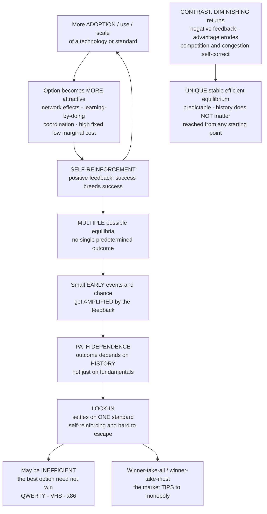

# 🔁 Increasing Returns and Path Dependence

> [!abstract] TL;DR
> **Increasing returns** is the phenomenon whereby doing or having *more* of something makes it *more* — not less — advantageous: the more a technology is used, a standard adopted, a product owned, or a city populated, the greater the returns to using, adopting, owning, or joining it. This is **positive feedback / self-reinforcement** — "success breeds success" — and it is W. Brian **Arthur's** foundational challenge to the neoclassical presumption of **diminishing returns** (negative feedback: more input → less marginal benefit; competition erodes advantage) that anchors the tidy world of a **unique, stable, efficient, predictable equilibrium**. Where diminishing returns rule (commodities, agriculture), the economy has one determinate optimal resting point. Where increasing returns rule (technology, knowledge, networks, the whole modern digital economy), the picture inverts: there are **multiple possible equilibria**, and *which one is selected* is decided not by fundamentals but by **history and chance** — small early events, amplified by the feedback, tip the outcome. The result is **path dependence** ("history matters"; the future is not determined by present conditions alone but by the accumulated sequence of past events) and **lock-in** to a technology or standard that becomes self-reinforcing and hard to escape — and which **need not be the best one** (QWERTY, VHS versus Betamax, internal combustion versus steam or electric, x86/Windows, English as a lingua franca). Formally, the dynamics are a **Polya-urn / random-walk-of-market-share** process that converges to a random, ex-ante unpredictable attractor: the economy is **non-ergodic** (the long run depends on the path, not just the parameters) and potentially **inefficient**. This single reversal — from determinate-and-optimal to contingent-and-multiple — explains the winner-take-all platform economy, agglomeration and regional divergence, standards wars, and the case for timing, strategy, and policy in shaping which of many possible futures the economy locks into. Mainstream journals rejected the idea for the better part of a decade before it became the cornerstone of complexity economics.

---

## Intuition

**Analogy — look down at your keyboard.** The top letter row spells **QWERTY**. That layout was designed in the 1870s for mechanical typewriters, and one of its explicit goals was to *slow typists down* — to space out common letter pairs so the physical typebars would not jam and clash. That mechanical problem vanished more than a century ago, and demonstrably faster layouts exist (Dvorak was patented in 1936). So why do billions of people, on glass touchscreens with no typebars to jam, still use a layout engineered around a solved problem of Victorian machinery? Because **everyone** learned QWERTY, so keyboard makers ship QWERTY, so schools and typing apps teach QWERTY, so the next generation learns QWERTY. Each adoption makes the next adoption more likely — a **self-reinforcing loop** that took an accident of 1870s engineering and **locked it in** as a permanent global standard. Nobody chose it on the merits; a small early lead, amplified by feedback, became irreversible.

That is **increasing returns and path dependence** in one object under your fingertips. In much of the modern economy, the more something is adopted, the more attractive it becomes to adopt — so **small, early, essentially accidental events get amplified into large, persistent, sometimes inferior outcomes**. History matters, and it does not have to be efficient. This inverts the intuition most economics is built on. In the world of **diminishing returns** — plant more wheat on the same land and each extra acre yields a little less; a firm that grows too big gets clumsy — advantage *erodes*, competition pulls everything back toward a single, stable, efficient balance, and *where you end up does not depend on how you got there*. In the world of **increasing returns**, advantage *compounds*, there are **many** possible balances, and **where you end up depends entirely on how you got there.** (Whether QWERTY is *truly* inferior is genuinely contested — see Common Pitfalls — but it remains the iconic image, and the *logic* it illustrates is not in doubt.)

---

## How It Works

### Core mechanics

**1. Two feedback regimes, two economics.** The deep divide is between **negative feedback** (diminishing returns) and **positive feedback** (increasing returns). Under *diminishing* returns, each additional unit of input yields *less* marginal benefit and any advantage a firm or technology gains is *eroded* by competition and congestion. Such a system is **self-correcting**: it has a **unique, stable, efficient equilibrium** that it reaches *regardless of starting point*, and it is *predictable* — this is the neoclassical world of [[Returns_to_Scale|constant/diminishing returns]], of commodities and agriculture, where price equals marginal cost and markets find the optimum. Under *increasing* returns, each additional adoption makes the option *more* attractive, so advantage is *amplified*. Such a system is **self-reinforcing**: it has **multiple possible equilibria**, it is **path-dependent** and potentially **inefficient**, and *which* equilibrium it selects is *unpredictable* from fundamentals. Arthur's core claim is that the **modern high-tech, knowledge, and digital economy is dominated by increasing returns** — and that neoclassical theory long ignored this precisely because positive feedback breaks the elegant, unique-equilibrium mathematics that made the theory tractable.

**2. Where positive feedback comes from — the sources of increasing returns.** Increasing returns is not one mechanism but a family:

- **Network effects.** A product is worth *more* to each user the *more* other people use it — telephones, fax machines, social platforms, payment rails, money itself, languages, marketplaces. Value scales super-linearly with the installed base (Metcalfe's rough $n^2$), so adoption feeds adoption.
- **Learning effects / learning-by-doing.** The more of something you produce, the *cheaper and better* you get at it (Arrow 1962; "experience curves" of 10–25 percent cost reduction per doubling of cumulative output in aircraft, chips, solar, batteries). Early volume lead → lower cost → more sales → more volume lead.
- **Coordination / standards.** There is value in *everyone using the same thing* even if the thing is arbitrary — QWERTY, file formats, protocols, gauges, driving on one side of the road. Compatibility is a payoff, so each adopter of a standard raises the payoff of that standard for the next adopter (this is the [[The_Evolution_of_Conventions_and_Norms|convention]] mechanism).
- **High fixed / low marginal cost.** Software, information, and digital goods cost a fortune to make once and almost nothing to copy. Average cost falls monotonically with scale — **increasing returns to scale** — so the biggest producer is the cheapest, and gets bigger.

**3. Multiple equilibria and self-reinforcement.** Because the payoff to an option *rises* with its own adoption, more than one configuration can be self-consistent: "everyone on standard A" is stable *and* "everyone on standard B" is stable. The system has **multiple attractors** (see [[Dynamical_Systems_and_Attractors]]). Which basin the economy falls into is not fixed by preferences or technology — it is up for grabs, and the mechanism that decides it is the **amplification of small early events**.

**4. Path dependence — history matters.** The outcome depends on the **path/history** taken, not just on the fundamentals. Small early events — who adopted first, an accident of timing, a chance endorsement, a marketing fluke — are **amplified by positive feedback** into large, persistent differences. The future is not determined by present conditions alone but by the **accumulated sequence of past events**. This is the opposite of a **path-independent** equilibrium, where you arrive at the same efficient point *regardless* of how you got there. Under path dependence, the past casts a long, non-fading shadow.

**5. Lock-in — the economy can get stuck, possibly on the wrong thing.** Increasing returns eventually **locks** the economy into one technology, standard, or pattern that becomes self-reinforcing and expensive to leave: to switch you would have to abandon a huge installed base, retrain, and re-coordinate everyone at once. Critically, **the market does not necessarily select the best option** — the winner is whatever the early feedback happened to favour. The canonical (if contested) illustrations: **QWERTY** over Dvorak, **VHS over Betamax**, **internal combustion** over steam and early electric cars, **x86/Windows**, and **English** as a global lingua franca. The system can be **stuck** on an inferior standard for generations.

**6. The formal core — the Polya urn / Arthur's competing-technologies model.** Model adoption as an **urn** starting with one ball of each colour (two competing technologies). Draw a ball at random, then return it *plus another of the same colour*: each adoption raises the probability of the *next* adoption of the same technology — exactly increasing returns. The **market share follows a reinforced random walk** that provably **converges** (a martingale settling down) — but to a **random** limit. Run it again with the same rules and it converges to a *different* limit. The mathematics says: the outcome is **selected by early chance events amplified by positive feedback**, and its distribution has **multiple attractors** (with strong, nonlinear increasing returns, the attractors are the corners 0 and 1 — full monopoly lock-in). This is Arthur, Ermoliev & Kaniovski's (1983, 1987) **generalized urn / stochastic-approximation** result.

**7. Non-ergodicity and the overturning of three neoclassical presumptions.** An increasing-returns economy is **non-ergodic**: its long-run behaviour depends on the *path and initial conditions*, not merely on the "fundamentals," so you cannot infer the outcome from preferences and technology alone — you must know the *history*. This dismantles the three pillars of the neoclassical picture at once: **uniqueness** (there are many equilibria, not one), **determinacy/predictability** (which one is selected is a matter of history and chance), and **optimality** (no guarantee the best equilibrium is selected). History and contingency are **restored to economics**.

### From positive feedback to lock-in — and the diminishing-returns contrast



---

## Key Concepts

### Secondary (intuitive)

- **Increasing returns = "success breeds success."** The more people use a thing, the better it gets to use it, so even more people use it. Diminishing returns is the opposite: the more you pile on, the less each extra bit helps.
- **History matters.** In an increasing-returns world, *how you got here* decides *where you end up*. A tiny early lead — luck, timing, a fad — can snowball into permanent dominance.
- **QWERTY / lock-in.** Once a standard is everywhere, you are stuck with it even if a better one exists, because switching means abandoning everyone you need to coordinate with.
- **The best does not always win.** Markets are supposed to select the fittest option. Under increasing returns they instead select *whatever got ahead early* — which may be inferior.
- **Winner-take-all.** This is why one search engine, one social network, one operating system tends to dominate its niche, rather than many sharing it.

### Undergraduate (formal)

- **Negative vs positive feedback.** Diminishing returns = negative feedback (deviations are damped → self-correcting → unique stable equilibrium). Increasing returns = positive feedback (deviations are amplified → self-reinforcing → multiple equilibria). This is the [[Nonlinearity_and_Feedback|nonlinearity-and-feedback]] distinction applied to economics.
- **The four sources of increasing returns.** (i) **Network effects** — value rises with installed base; (ii) **learning-by-doing** — unit cost falls with cumulative output (Arrow); (iii) **coordination / compatibility standards** — payoff to matching others; (iv) **high fixed / low marginal cost** — [[Returns_to_Scale|increasing returns to scale]] in information goods.
- **Path dependence (definition).** A process is path-dependent if its outcome is a function of the *sequence* of past events, not just the current state or the fundamentals. Contrast **path-independent** (ergodic) processes, whose limit is the same regardless of route.
- **Lock-in and potential inefficiency.** The self-reinforcing equilibrium the economy settles into may be **Pareto-inferior** to an unselected alternative; unlike a [[Market_Failures|standard market failure]] it arises from *dynamics and history*, not from a static externality alone (though [[Externalities_and_Pigouvian_Tax|network externalities]] are the underlying friction).
- **The Polya urn / Arthur model.** Two technologies; each adoption raises the probability of the next adoption of the same one. Market share is a **reinforced random walk** that converges almost surely to a **random** limit — a concrete, simulable model of "outcome selected by early chance amplified by feedback."

### Graduate (advanced)

- **Generalized urn schemes and stochastic approximation (Arthur, Ermoliev & Kaniovski).** Let $p_{n}$ be the share of technology A after $n$ adoptions and let the adoption probability be a **response function** $f(p)$. The share obeys a **stochastic-approximation** recursion $p_{n+1} = p_n + \tfrac{1}{n+1}\big(\mathbf{1}\{\text{adopt A}\} - p_n\big)$ with $\mathbb{E}[\cdot] = f(p_n) - p_n$. Its limit points are the **stable fixed points** of $f$ (where $f(p)=p$, $f'(p)<1$); **unstable** fixed points act as basin boundaries. *Linear* $f(p)=p$ (the classic Polya urn) gives a limit distribution spread across the whole interval (Beta-distributed). *Nonlinear, strongly reinforcing* $f$ with $f(p)>p$ above a threshold pushes the limit to the corners $\{0,1\}$ — **complete lock-in / monopoly**.
- **Non-ergodicity precisely.** The process is non-ergodic: the time-average along one realization does **not** equal the ensemble average over realizations, so long-run share is a genuine **random variable** with positive variance, not a constant fixed by parameters. This is the mathematical face of "history matters," and it is a **symmetry-breaking** phase transition of the same kind studied in statistical mechanics (see the planned sibling `Non_Equilibrium_and_Out_of_Equilibrium_Dynamics`).
- **Multiple equilibria and selection.** With increasing returns the excess-demand / best-response map is non-monotone, giving **odd numbers of equilibria** with alternating stability. Neoclassical **equilibrium selection** (refinements, tâtonnement) is silent on *which* one obtains; the honest answer is *history plus small events*, which is why the topic sits at the foundation of complexity economics (see the planned sibling `Economies_as_Complex_Adaptive_Systems`).
- **The Liebowitz–Margolis critique (essential for balance).** Not every lock-in is a *remediable* inefficiency. They distinguish **first-degree** path dependence (no inefficiency), **second-degree** (inefficiency that was unforeseeable, so not a "mistake"), and **third-degree** (inefficiency that is *both* knowable *and* correctable at a gain — the only kind that impugns markets). They argue the empirical QWERTY and Betamax cases are weak third-degree claims. Knowing this taxonomy is what separates a rigorous treatment from a slogan.

---

## Python Demo

We contrast the **two feedback regimes** with a **Polya-urn / Arthur competing-technologies** model. Two technologies compete for a stream of adopters. In the **increasing-returns** model, each adopter chooses technology A with probability equal to A's *current market share* — so **adopting A raises the next adopter's probability of choosing A** (positive feedback / increasing returns; the classic Polya urn). In the **diminishing-returns** model, the adopter chooses A with probability equal to $1 -$ A's share — whichever technology is *ahead* becomes *less* attractive (negative feedback: congestion, competition erodes advantage). We show that (i) the increasing-returns market share **converges to a lock-in in every run, but to a different, unpredictable one each time**, so across many runs the distribution of final shares is **spread across the whole range** (path dependence — the outcome is not set by fundamentals but by history and chance); while (ii) the diminishing-returns model **always converges to the same efficient 50/50 split**, regardless of early history. `numpy` and `matplotlib` only.

```python
# Increasing returns (positive feedback) vs diminishing returns (negative feedback):
# a Polya-urn / Arthur competing-technologies model of two rival technologies.
# Shows path dependence + lock-in vs a unique, predictable, efficient equilibrium.
import numpy as np
import matplotlib.pyplot as plt

def evolve(rule, R, T, rng):
    """Vectorized over R independent runs of T adoptions each.
    Start with one adopter of each technology (nA = nB = 1).
    'increasing': P(next adopts A) = current share of A  -> POSITIVE feedback.
    'diminishing': P(next adopts A) = 1 - share of A     -> NEGATIVE feedback.
    Returns the full share-of-A trajectory, shape (R, T)."""
    nA = np.ones(R)
    nB = np.ones(R)
    paths = np.empty((R, T))
    for t in range(T):
        shareA = nA / (nA + nB)
        pA = shareA if rule == "increasing" else 1.0 - shareA
        adopt_A = rng.random(R) < pA          # each run draws one new adopter
        nA += adopt_A                          # reinforce the chosen technology
        nB += ~adopt_A
        paths[:, t] = nA / (nA + nB)
    return paths

rng = np.random.default_rng(42)
T = 1500                                        # adopters per run
n_paths, n_runs = 12, 5000                      # a few paths to draw, many to histogram

# --- Sample trajectories (to visualize divergence vs convergence) ---
inc_paths = evolve("increasing",  n_paths, T, rng)
dim_paths = evolve("diminishing", n_paths, T, rng)

# --- Many runs: distribution of FINAL market share ---
inc_final = evolve("increasing",  n_runs, T, rng)[:, -1]
dim_final = evolve("diminishing", n_runs, T, rng)[:, -1]

print(f"INCREASING returns:  final-share mean = {inc_final.mean():.3f}, "
      f"std = {inc_final.std():.3f},  share of runs A wins (>0.5) = {(inc_final>0.5).mean():.2f}")
print(f"DIMINISHING returns: final-share mean = {dim_final.mean():.3f}, "
      f"std = {dim_final.std():.3f}")
print("Uniform(0,1) reference std = 0.289  ->  increasing-returns outcome is "
      "spread across the WHOLE range (history/chance), diminishing-returns is pinned to 0.5.")

# --- Visualize ---
fig, ax = plt.subplots(2, 2, figsize=(14, 9))
x = np.arange(1, T + 1)

# (top-left) increasing-returns sample paths -> diverge to different lock-ins
for p in inc_paths:
    ax[0, 0].plot(x, p, lw=1.2, alpha=0.85)
ax[0, 0].axhline(0.5, color="k", ls=":", lw=1)
ax[0, 0].set_title("INCREASING returns: sample paths DIVERGE\n"
                   "each locks in, but to a DIFFERENT, unpredictable share")
ax[0, 0].set_xlabel("number of adoptions"); ax[0, 0].set_ylabel("market share of A")
ax[0, 0].set_xscale("log"); ax[0, 0].set_ylim(-0.02, 1.02); ax[0, 0].grid(alpha=0.3)

# (top-right) increasing-returns histogram -> spread across the whole range
ax[0, 1].hist(inc_final, bins=25, range=(0, 1), color="#c0392b",
              edgecolor="white", density=True)
ax[0, 1].axhline(1.0, color="k", ls="--", lw=1.2, label="uniform reference")
ax[0, 1].set_title("INCREASING returns: distribution of FINAL share\n"
                   "SPREAD across the whole range -> path dependence")
ax[0, 1].set_xlabel("final market share of A"); ax[0, 1].set_ylabel("density")
ax[0, 1].legend(fontsize=9); ax[0, 1].grid(alpha=0.3, axis="y")

# (bottom-left) diminishing-returns sample paths -> all converge to 50/50
for p in dim_paths:
    ax[1, 0].plot(x, p, lw=1.2, alpha=0.85)
ax[1, 0].axhline(0.5, color="k", ls=":", lw=1)
ax[1, 0].set_title("DIMINISHING returns: sample paths CONVERGE\n"
                   "every run self-corrects to the SAME 50/50 split")
ax[1, 0].set_xlabel("number of adoptions"); ax[1, 0].set_ylabel("market share of A")
ax[1, 0].set_xscale("log"); ax[1, 0].set_ylim(-0.02, 1.02); ax[1, 0].grid(alpha=0.3)

# (bottom-right) diminishing-returns histogram -> sharp spike at 0.5
ax[1, 1].hist(dim_final, bins=25, range=(0, 1), color="#2980b9",
              edgecolor="white", density=True)
ax[1, 1].set_title("DIMINISHING returns: distribution of FINAL share\n"
                   "PINNED at 0.5 -> unique, efficient, predictable")
ax[1, 1].set_xlabel("final market share of A"); ax[1, 1].set_ylabel("density")
ax[1, 1].grid(alpha=0.3, axis="y")

plt.tight_layout()
plt.savefig("increasing_returns_path_dependence.png", dpi=120)
print("\nSaved figure -> increasing_returns_path_dependence.png")
```

Expected output (values vary slightly with the seed; the qualitative story is robust):

```
INCREASING returns:  final-share mean = 0.500, std = 0.28x,  share of runs A wins (>0.5) = 0.5x
DIMINISHING returns: final-share mean = 0.500, std = 0.01x
Uniform(0,1) reference std = 0.289  ->  increasing-returns outcome is spread across the WHOLE range ...

Saved figure -> increasing_returns_path_dependence.png
```

Read the four panels as one argument. **Top-left (increasing returns, paths):** every run *settles down* — each locks in — but the runs **fan out to different final shares**; identical rules, different histories, different destinies. **Top-right (increasing returns, histogram):** across 5000 runs the final share is **spread almost uniformly across the whole interval** — the standard deviation ($\approx 0.29$) matches a Uniform(0,1), the mathematical signature of a **non-ergodic** process whose outcome is a genuine random variable decided by early chance, *not* by fundamentals. The **mean is 0.5 yet essentially no single run ends near 0.5** — the average is an artefact of aggregating incompatible histories, exactly the trap of applying equilibrium intuition to a path-dependent world. **Bottom-left (diminishing returns, paths):** every run, whatever its early wobble, is **pulled back to 0.5** — negative feedback self-corrects. **Bottom-right (diminishing returns, histogram):** the final share is a **sharp spike at 0.5** (std $\approx 0.01$) — the **unique, stable, efficient, predictable** equilibrium of the neoclassical world. Same two technologies, same random draws; only the sign of the feedback differs — and that sign is the entire difference between "history is destiny" and "history is irrelevant." (Push the increasing-returns response function from linear to steeply nonlinear and the top-right histogram would pile up at the corners 0 and 1 instead — full **monopoly lock-in**, the winner-take-all case.)

---

## Real-World Applications

> **Example — the platform economy tips to monopoly.** Google in search, Meta in social, Amazon in marketplaces, and Microsoft in desktop operating systems are living demonstrations of increasing returns via **network effects** and **data/learning loops**: more users → more data and more content → a better product → more users. The feedback drives the market to **winner-take-most**, so a handful of firms dominate their niches not because rivals are hopeless but because *the market tipped early and locked in*. Which specific firm wins is partly historical accident (timing, an early viral moment, a default deal); *that* one firm wins is the near-certain consequence of the feedback. This is why platform strategy is obsessed with **getting big fast** and **seeding adoption** — under increasing returns, an early lead is not a nicety, it is the whole game.

- **Technology standards and standards wars.** VHS vs Betamax, Blu-ray vs HD-DVD, USB vs FireWire, iOS/Android — battles decided by installed base and complementary goods (tapes, discs, apps), not always by technical merit. The [[The_Evolution_of_Conventions_and_Norms|convention-selection]] dynamics (risk-dominant / first-mover wins, sometimes over the efficient option) are the game-theoretic twin of increasing-returns lock-in.
- **Agglomeration and cities.** Silicon Valley, Wall Street, Hollywood, London finance: economic activity **clusters** because being near others in your industry lowers costs and raises productivity — thick labour markets, knowledge spillovers, specialized suppliers. These are **increasing returns to location**; small historical head-starts (a university, a founder, a defence contract) snowball into durable dominance. The systems-thinking companion is [[Network_Dynamics_and_Contagion|network dynamics and contagion]].
- **Regional divergence — cumulative causation.** Gunnar Myrdal's "circular and cumulative causation" and the New Economic Geography (Krugman) explain why **rich regions get richer** and poor regions can stay trapped: capital, talent, and firms flow toward where they already are. Divergence, not the neoclassical convergence, is the increasing-returns prediction, complicating the diminishing-returns intuition of the [[Solow_Growth_Model|Solow model]].
- **Endogenous growth — increasing returns to knowledge.** Romer's insight that **ideas are non-rival** and generate spillovers makes knowledge a source of economy-wide increasing returns, breaking the diminishing-returns ceiling of Solow and producing sustained growth — the core of [[Endogenous_Growth_Theory|endogenous growth theory]] and a bridge to the planned sibling `Technological_Change_and_Growth_Dynamics`.
- **Antitrust in network industries.** When markets tip to [[Monopoly|monopoly]] by their own dynamics rather than by misconduct, competition policy faces a new problem: the dominant firm may not have "cheated," yet the lock-in is real and switching costs are prohibitive. Interoperability mandates, data portability, and standard-setting become the relevant levers — the subject of the planned sibling `Complexity_Economics_and_Public_Policy`.

---

## Common Pitfalls

- **Assuming markets always find the efficient outcome.** The reassuring theorem "competition selects the best" holds under **diminishing** returns. Under increasing returns the market can select — and *lock in* — an **inferior** standard, and stay there. Dropping this pitfall is the whole point of the topic.
- **Treating "the average" as "the outcome."** In the demo the mean final share is 0.5, yet almost no run ends near 0.5. In a **non-ergodic** process the ensemble average describes *no actual history*. Reasoning about a path-dependent economy with representative-agent, mean-value equilibrium intuition is a category error.
- **Confusing increasing returns to scale with path dependence.** [[Returns_to_Scale|Increasing returns to scale]] is a *static* property of a cost/production function (bigger is cheaper per unit). Path dependence is a *dynamic* property of a *process* (history selects among multiple equilibria). Increasing returns *causes* path dependence, but the two are not the same claim, and the exam trap is to blur them.
- **Overstating "the market picked the worst option."** The rigorous **Liebowitz–Margolis** point: showing an *alternative existed* is not showing a *remediable* inefficiency. Only **third-degree** path dependence — an inefficiency that was both *knowable in advance* and *correctable at a net gain* — actually indicts the market. The empirical QWERTY and Betamax cases are genuinely contested; cite them as *illustrations of the logic*, not as settled proof of market failure.
- **Believing lock-in is permanent.** Lock-in is *hard* to escape, not *impossible*. A large enough shock, a coordinated switch (Sweden moved from left- to right-hand driving overnight in 1967), or a new technology that resets the network (mobile leapfrogging landlines) can **tip** the system to a new basin — a [[Bifurcations_and_Tipping_Points|tipping point]]. Fatalism about lock-in is as wrong as denial of it.
- **Forgetting the "get big fast" corollary.** If you accept increasing returns, then **timing and early strategy dominate long-run merit**. Firms that treat a network-effects market like a diminishing-returns commodity market — competing patiently on unit quality while a rival buys the installed base — lose the market before quality ever gets a vote.
- **Assuming path dependence means "anything can happen."** History matters, but not everything is reachable. In the generalized-urn model, the possible limits are the **stable fixed points of the response function**; unstable points are barriers the process almost never rests at. Path dependence is *constrained* contingency, not pure noise.

---

## Related Concepts

- [[Returns_to_Scale]] — the static production-side face of increasing returns (falling average cost with scale); the mechanism that, made dynamic, produces path dependence.
- [[Nonlinearity_and_Feedback]] — the general systems distinction between positive (amplifying, multistable) and negative (damping, self-correcting) feedback of which this note is the economic application.
- [[The_Evolution_of_Conventions_and_Norms]] — the game-theoretic twin: coordination games with multiple equilibria, selected by history and lock-in on the risk-dominant (not always efficient) convention; the QWERTY story lives here too.
- [[Endogenous_Growth_Theory]] — increasing returns to knowledge and non-rival ideas break the diminishing-returns growth ceiling; the macro sibling of this idea.
- [[Solow_Growth_Model]] — the diminishing-returns benchmark predicting convergence, against which increasing-returns divergence is defined.
- [[Monopoly]] — the market structure that increasing returns and network effects tend to produce endogenously (winner-take-all), reframing antitrust.
- [[Market_Failures]] — the welfare category that inefficient lock-in extends into the *dynamic/historical* dimension.
- [[Externalities_and_Pigouvian_Tax]] — network effects are positive consumption externalities; the friction underlying coordination-driven increasing returns.
- [[Network_Dynamics_and_Contagion]] — how adoption spreads through a population, the micro-engine of network effects, agglomeration, and tipping.
- [[Small_World_and_Scale_Free_Networks]] — preferential attachment ("the rich get richer") is increasing returns operating on network structure, producing hubs and heavy tails.
- [[Bifurcations_and_Tipping_Points]] — lock-in and its rare escape are basin-crossing / tipping phenomena in a multistable system.
- [[Dynamical_Systems_and_Attractors]] — multiple equilibria are multiple attractors; which basin the economy lands in is the path-dependence question.
- [[Feedback_Loops_and_Causality]] — the reinforcing (positive) causal loop is the structural core of self-reinforcement.
- [[Complex_Adaptive_Systems]] — increasing returns is a defining feature of the economy as a complex adaptive system rather than an equilibrium machine.
- [[Economic_and_Social_Complexity]] — the applied systems-thinking treatment of economies as emergent, non-equilibrium, path-dependent systems.
- [[Finite_Populations_and_Stochastic_Dynamics]] — the finite-population, reinforcement-driven Markov-chain machinery that makes "history selects the outcome" mathematically precise.
- [[Nash_Equilibrium]] — increasing-returns games are exactly those with *multiple* Nash equilibria, so rationality alone cannot pick the outcome.
- [[Correlated_Equilibrium]] — a shared signal/standard as a device that selects one of the many increasing-returns equilibria.

**Planned siblings in this vault (referenced above in prose, not yet written):** `The_Limits_of_Neoclassical_Equilibrium` (why unique-efficient-equilibrium theory fails for the modern economy), `Economies_as_Complex_Adaptive_Systems` (the positive research programme this opens), `Non_Equilibrium_and_Out_of_Equilibrium_Dynamics` (the physics of symmetry breaking and non-ergodicity behind lock-in), `Economic_Networks_and_Interaction_Structure` (how interaction topology shapes which equilibrium is selected), `Technological_Change_and_Growth_Dynamics` (increasing returns as the engine of endogenous growth), and `Complexity_Economics_and_Public_Policy` (antitrust, standard-setting, and industrial policy when markets can lock in the wrong thing).

---

## Review Questions

1. **(Conceptual)** Explain precisely why **diminishing returns** yield a *unique, stable, efficient, predictable* equilibrium while **increasing returns** yield *multiple equilibria, path dependence, and possible inefficiency*. Your answer must turn on the **sign of the feedback** (self-correcting vs self-reinforcing), and you should name the four distinct **sources** of increasing returns and give one real product for each.

2. **(Scenario)** You run a startup entering a market with strong network effects, where a rival launched six months earlier and has a modest lead in users. A board member argues, "our product is technically better, so if we keep improving it we will win on the merits — be patient." Using **increasing returns, path dependence, and lock-in**, explain why this diminishing-returns intuition is dangerous here, what the model implies you should do instead, and what would have to be true (in Liebowitz–Margolis terms) for the eventual winner to be a genuinely *remediable* inefficiency.

3. **(Trade-off / synthesis)** The demo's increasing-returns process has a mean final market share of 0.5, yet essentially no single run ends near 0.5, while the diminishing-returns process has both mean *and* every run at 0.5. Explain what **non-ergodicity** means using exactly this contrast, why it makes representative-agent / mean-value equilibrium reasoning misleading for an increasing-returns economy, and what this implies for the *predictability* of technological and regional outcomes — and for the role of **policy and timing** in shaping them.

---

## Sources

- Arthur, W. B. (1989). "Competing Technologies, Increasing Returns, and Lock-In by Historical Events." *The Economic Journal*, 99(394), 116–131.
- Arthur, W. B. (1994). *Increasing Returns and Path Dependence in the Economy*. University of Michigan Press.
- Arthur, W. B. (1990). "Positive Feedbacks in the Economy." *Scientific American*, 262(2), 92–99.
- Arthur, W. B., Ermoliev, Y. M. & Kaniovski, Y. M. (1987). "Path-Dependent Processes and the Emergence of Macro-Structure." *European Journal of Operational Research*, 30(3), 294–303.
- David, P. A. (1985). "Clio and the Economics of QWERTY." *American Economic Review*, 75(2), 332–337.
- Liebowitz, S. J. & Margolis, S. E. (1995). "Path Dependence, Lock-In, and History." *Journal of Law, Economics & Organization*, 11(1), 205–226.

---

#complexity-economics #increasing-returns #path-dependence #lock-in #network-effects
