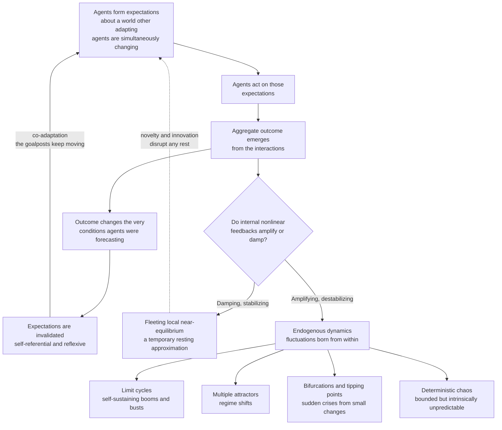

# 🌊 Non-Equilibrium and Out-of-Equilibrium Dynamics

> [!abstract] TL;DR
> The **central dynamical claim of complexity economics** is that the economy is **never in equilibrium** — it is a system **perpetually in motion**, continually adapting, where "equilibrium" is at best a fleeting, local, approximate condition. The reason is deep: agents endlessly **co-adapt** to a world that *other* adapting agents are simultaneously changing, and expectations are **self-referential** (my forecast depends on your forecast of my forecast), so there is no fixed target to converge to — the goalposts always move. This reframes booms and busts as potentially **endogenous** — generated by the economy's *own* nonlinear internal feedbacks — rather than as deviations caused by **external "shocks"** (the assumption baked into equilibrium models like **DSGE**). Out-of-equilibrium economies admit **limit cycles** (self-sustaining business cycles), **multiple attractors** (regime shifts), **bifurcations and tipping points** (sudden crises), and even **deterministic chaos** (bounded but intrinsically unpredictable dynamics). Methodologically it means **modelling the process** — via agent-based simulation and nonlinear dynamics — rather than *solving for* a resting state. As **W. Brian Arthur** puts it: study the economy **as a process, not a state**.

---

## Intuition

**Analogy — the river.** A river is never "at rest." It is a churning, swirling flow of eddies, standing waves, and currents — yet it has a stable overall **form**: you can point to *the* river, name it, map its banks. Freeze it into a static "equilibrium" — a block of ice — and you have killed the very thing that made it a river. The **form persists only because the water keeps moving through it**.

Neoclassical economics freezes the economy into equilibrium and then studies the ice. Complexity economics studies the **flow** — the perpetual churn of agents adapting to a world that other adapting agents keep changing, so the system never settles. Booms and busts, fashions and crashes, growth and decay are **not deviations from some resting equilibrium**; they *are* the economy — the natural dynamics of a system perpetually out of balance. Where the equilibrium view asks "what state does the economy settle into?", the out-of-equilibrium view asks "how does the economy *move and change over time*?" — and answers that it does not settle at all. (See the companion note *Complexity_Economics_Overview* for the wider programme, and *The_Limits_of_Neoclassical_Equilibrium* for the critique this replaces.)

---

## How It Works

### Core Mechanics

1. **Equilibrium is a resting state that the economy rarely reaches.** In the neoclassical picture, prices and quantities adjust until supply equals demand and no agent wishes to change behaviour — a **fixed point**. The theory then studies that fixed point (see [[Market_Equilibrium]]) and treats motion as transient. The out-of-equilibrium view inverts the emphasis: the interesting economics is in the **motion**, and the resting point is a fiction that is, at best, briefly and locally approximated.

2. **Why the economy never rests — co-adaptation.** Every agent chooses actions based on what *other* agents are doing. But those agents are simultaneously re-choosing based on the first agent. Everyone is **adapting to conditions that everyone else is changing**. There is no fixed landscape to climb — the landscape deforms as you move on it. This is the economic **Red Queen**: agents run to stay in place.

3. **Why the economy never rests — self-referential expectations.** In a social system, agents **predict the system they are part of** and act on those predictions, which then move the system. My forecast of the market depends on your forecast of my forecast, and so on — an infinite regress with **no fixed anchor**. This reflexivity (George Soros's term) is a source of instability *unique to social systems*: it produces **self-fulfilling** bubbles (optimism validates itself) and **self-defeating** crashes (panic validates itself) that rational-expectations equilibrium models suppress by assumption.

4. **Why the economy never rests — genuine novelty.** Innovation, new products, new strategies, and new institutions continually arrive and **disrupt any rest**. A world that keeps inventing itself cannot converge; the target is not just moving, it is being *newly created*. (This links to *Increasing_Returns_and_Path_Dependence*, where novelty plus positive feedback locks in one of many possible futures.)

5. **Endogenous vs exogenous fluctuations — the key contrast with mainstream macro.** In equilibrium models (Dynamic Stochastic General Equilibrium, DSGE), the economy is *stable* and would sit still forever; fluctuations must therefore be injected from **outside** as random **shocks** — technology surprises, policy changes, disasters. The economy is a stable ball at the bottom of a bowl, buffeted by external noise. Complexity economics shows that fluctuations can be **endogenous**: booms and busts arise **from within**, from the nonlinear feedback and interaction of the agents themselves. *The crisis came from inside the system.* (Developed in *Business_Cycles_and_Endogenous_Fluctuations*.)

6. **The nonlinear toolkit.** Because economies are **nonlinear** (see [[Nonlinearity_and_Feedback]]), their internal dynamics can produce:
   - **Limit cycles** — self-sustaining oscillations with no external driver (Goodwin's growth cycle; predator–prey wage–employment dynamics).
   - **Multiple attractors / equilibria** — the economy can settle into different regimes, and **regime shifts** jump between them (see [[Dynamical_Systems_and_Attractors]]).
   - **Bifurcations and tipping points** — a *small* parameter change triggers a *qualitative* shift: a sudden crisis (see [[Bifurcations_and_Tipping_Points]]).
   - **Deterministic chaos** — bounded, aperiodic, sensitively-dependent dynamics that *look* random but are fully deterministic (see [[Chaos_Theory_and_Sensitive_Dependence]]).

7. **Deterministic chaos in economics.** Simple deterministic nonlinear economic models — a **chaotic cobweb**, nonlinear multiplier–accelerator business-cycle models, or asset-price maps — can produce **chaotic** behaviour with **sensitive dependence on initial conditions** (the butterfly effect). The economy may be **deterministically unpredictable**: even with no random shocks and a perfectly known model, long-run forecasts collapse. This is the *chaos-in-economics* literature (Grandmont, Benhabib, Day). Its implication is humbling — the limits of prediction may be intrinsic, not just a matter of better data.

8. **Modelling process, not equilibrium.** The methodological shift is decisive: instead of *assuming* equilibrium and solving for it, complexity economics **models the dynamic process** and lets macro behaviour **emerge**. Tools include **agent-based simulation** (watch the economy evolve step by step — see [[Agent_Based_Modeling]] and *Agent_Based_Macroeconomics*), nonlinear dynamical systems, evolutionary dynamics, and disequilibrium adjustment models. You "grow" the economy and observe what happens, rather than imposing the resting state by fiat.

9. **The physics analogy.** Physics distinguishes **equilibrium** systems (thermodynamic rest — uniform, dead, maximum entropy) from **non-equilibrium** systems (open, driven, **dissipative** — where structure, order, and life arise). Ilya Prigogine's **dissipative structures** (see [[Dissipative_Structures_and_Nonequilibrium]]) show that interesting order exists *far from equilibrium*, sustained by throughput. Complexity economics adopts this stance: the economy is an **open, driven, dissipative** system — energy, resources, and information flow through it, and its structure is maintained *by* that flow, not despite it. Like the river, its form lives only on the motion.

### Flow / Architecture



---

## Key Concepts

### Secondary (intuition level)
- **Equilibrium vs out-of-equilibrium.** Equilibrium = a resting state where nothing wants to change; out-of-equilibrium = perpetual motion and adjustment. Complexity economics says the economy lives in the second world.
- **The river, not the ice.** The economy has a stable *form* but never stops *flowing*. Freeze it and you misunderstand it.
- **Endogenous vs exogenous.** *Exogenous* = fluctuations come from outside shocks. *Endogenous* = fluctuations are generated from inside, by the system's own interactions.
- **Why it never rests.** Because everyone adapts to what everyone else is doing, and everyone is changing at once, there is no fixed target to settle on.

### Undergraduate (mechanism level)
- **Goodwin growth cycle** — a predator–prey model of the business cycle: high employment bids up wages, squeezing profits, which cuts investment and employment, which eases wages, which restores profits — a self-sustaining **limit cycle** with no external shock.
- **Multiplier–accelerator models** — Samuelson/Hicks nonlinear versions generate endogenous cycles from investment feedback.
- **Cobweb model** — a market where producers set output on last period's price; with a nonlinear map it can cycle or become chaotic instead of converging (contrast with [[Market_Equilibrium]] and [[Comparative_Statics]]).
- **Adaptive vs rational expectations** — how agents forecast determines whether the system converges or destabilizes; self-referential forecasting undermines convergence.
- **Minsky's financial instability hypothesis** — stability breeds risk-taking breeds fragility breeds crisis; instability is **endogenous** to finance (see [[Business_Cycle_Indicators]] and [[Global_Financial_Crises]]).
- **Reflexivity (Soros)** — prices influence the fundamentals they are supposed to reflect, creating self-fulfilling bubbles and crashes (see [[Market_Anomalies_and_Bubbles]]).

### Graduate (formal level)
- **Nonlinear dynamical systems** — modelling the economy as $\dot{\mathbf{x}} = \mathbf{f}(\mathbf{x})$ or $x_{n+1} = f(x_n)$ and studying fixed points, cycles, and attractors rather than solving for a single equilibrium (see [[Systems_of_ODEs]], [[First_Order_ODEs]]).
- **Bifurcation theory** — how the *qualitative* behaviour changes as parameters cross critical values (Hopf bifurcation birthing a limit cycle; period-doubling cascade to chaos).
- **Deterministic chaos** — positive largest **Lyapunov exponent**, sensitive dependence, strange attractors; Grandmont (1985) endogenous competitive cycles, Benhabib–Day, Richard Day's chaotic growth.
- **Multiple equilibria and sunspots** — self-fulfilling expectations select among many equilibria; extrinsic "sunspot" beliefs move real outcomes.
- **Self-organized criticality** — economies may tune themselves to a critical state where avalanches (crises) of all sizes occur endogenously (links to [[Criticality_and_Phase_Transitions]]).
- **Non-equilibrium thermodynamics analogy** — the economy as an open dissipative structure far from equilibrium (Prigogine; see [[Dissipative_Structures_and_Nonequilibrium]]).
- **Agent-based macroeconomics** — grow the macro from heterogeneous, boundedly-rational, interacting agents; equilibrium is an emergent (and usually never-reached) property, not an input.

---

## Python Demo

```python
# Endogenous fluctuations WITHOUT external shocks.
# (A) Goodwin growth cycle  -> a nonlinear predator-prey system whose economy
#     CYCLES forever from its own internal dynamics, with NO random input.
# (B) Logistic map          -> a deterministic nonlinear asset-price / cobweb map
#     that goes CHAOTIC via period-doubling; plus a bifurcation diagram.
# (C) Contrast: a STABLE equilibrium system that just sits still unless you
#     inject external shocks -- the DSGE "stable ball buffeted by noise" view.
import numpy as np
import matplotlib.pyplot as plt

# ============================================================
# (A) GOODWIN GROWTH CYCLE  -- endogenous limit cycle, no shocks
#     v = employment rate (prey), u = wage share (predator).
#     High employment -> workers bid up wages -> wage share up -> profits down
#     -> investment & employment down -> wages ease -> profits recover -> ...
# ============================================================
def goodwin(u, v, alpha, beta, gamma, rho, sigma):
    du = u * (rho * v - (alpha + gamma))            # wage-share dynamics (Phillips curve)
    dv = v * ((1.0 - u) / sigma - (alpha + beta))   # employment dynamics (accumulation)
    return du, dv

alpha, beta, gamma, rho, sigma = 0.02, 0.01, 0.02, 0.10, 3.0
dt, n = 0.01, 60000
u = np.empty(n); v = np.empty(n)
u[0], v[0] = 0.80, 0.90                          # start OFF the fixed point
for k in range(n - 1):                           # RK4 integration (no noise term anywhere)
    d1u, d1v = goodwin(u[k],            v[k],            alpha, beta, gamma, rho, sigma)
    d2u, d2v = goodwin(u[k]+0.5*dt*d1u, v[k]+0.5*dt*d1v, alpha, beta, gamma, rho, sigma)
    d3u, d3v = goodwin(u[k]+0.5*dt*d2u, v[k]+0.5*dt*d2v, alpha, beta, gamma, rho, sigma)
    d4u, d4v = goodwin(u[k]+dt*d3u,     v[k]+dt*d3v,     alpha, beta, gamma, rho, sigma)
    u[k+1] = u[k] + (dt/6.0)*(d1u + 2*d2u + 2*d3u + d4u)
    v[k+1] = v[k] + (dt/6.0)*(d1v + 2*d2v + 2*d3v + d4v)
t = np.arange(n) * dt

# ============================================================
# (B) LOGISTIC MAP  -- deterministic chaos, no noise
#     x_{n+1} = r * x_n * (1 - x_n)  as a chaotic cobweb / asset-price map.
# ============================================================
def logistic(r, x0, steps):
    x = np.empty(steps); x[0] = x0
    for k in range(steps - 1):
        x[k+1] = r * x[k] * (1.0 - x[k])
    return x

chaos = logistic(3.9, 0.2, 120)                  # chaotic regime, purely deterministic

rs = np.linspace(2.8, 4.0, 1400)                 # bifurcation diagram
r_pts, x_pts = [], []
for r in rs:
    x = 0.2
    for _ in range(400):                          # discard transient
        x = r * x * (1.0 - x)
    for _ in range(120):                          # sample the attractor
        x = r * x * (1.0 - x)
        r_pts.append(r); x_pts.append(x)

# ============================================================
# (C) EQUILIBRIUM + SHOCKS VIEW  -- a stable linear system
#     x_{n+1} = phi * x_n (+ noise). Without shocks it decays to rest and SITS
#     STILL; it only fluctuates because external noise is added. Contrast A & B.
# ============================================================
phi, m = 0.7, 200
x_det = np.empty(m); x_det[0] = 1.0
for k in range(m - 1):
    x_det[k+1] = phi * x_det[k]                   # NO shocks -> flatlines to zero

rng = np.random.default_rng(0)
x_noise = np.empty(m); x_noise[0] = 0.0
for k in range(m - 1):
    x_noise[k+1] = phi * x_noise[k] + rng.normal(0, 0.3)  # only noise keeps it alive

# ============================================================
# PLOT
# ============================================================
fig, ax = plt.subplots(2, 3, figsize=(16, 9))

ax[0,0].plot(t, v, label="employment rate v")
ax[0,0].plot(t, u, label="wage share u")
ax[0,0].set_title("(A) Goodwin cycle: endogenous fluctuations, NO shocks")
ax[0,0].set_xlabel("time"); ax[0,0].set_ylabel("value"); ax[0,0].legend()

ax[0,1].plot(v, u, lw=0.6)
ax[0,1].set_title("(A) Phase portrait: a closed limit cycle (attractor)")
ax[0,1].set_xlabel("employment rate v"); ax[0,1].set_ylabel("wage share u")

ax[0,2].plot(chaos, marker="o", ms=3, lw=0.8)
ax[0,2].set_title("(B) Logistic map r=3.9: deterministic CHAOS, no noise")
ax[0,2].set_xlabel("period n"); ax[0,2].set_ylabel("x_n")

ax[1,0].plot(r_pts, x_pts, ",", color="black", alpha=0.25)
ax[1,0].set_title("(B) Bifurcation diagram: period-doubling road to chaos")
ax[1,0].set_xlabel("parameter r"); ax[1,0].set_ylabel("long-run x")

ax[1,1].plot(x_det); ax[1,1].axhline(0.0, color="grey", ls="--", lw=0.8)
ax[1,1].set_title("(C) Equilibrium view, NO shocks: system decays to rest")
ax[1,1].set_xlabel("time"); ax[1,1].set_ylabel("x")

ax[1,2].plot(x_noise)
ax[1,2].set_title("(C) Same system + external shocks: fluctuates only from noise")
ax[1,2].set_xlabel("time"); ax[1,2].set_ylabel("x")

plt.tight_layout()
plt.savefig("non_equilibrium_dynamics.png", dpi=110)
plt.show()

# Numeric proof that the Goodwin cycle is SELF-SUSTAINING (amplitude does not decay):
half = n // 2
amp_1 = round(float(v[:half].max() - v[:half].min()), 3)
amp_2 = round(float(v[half:].max() - v[half:].min()), 3)
print("Goodwin employment swing, first half :", amp_1)
print("Goodwin employment swing, second half:", amp_2)
print("=> amplitude persists: the cycle is generated from WITHIN, no shocks needed.")
```

**What to notice.** Panels (A) and (B) contain **no random number generator at all** on the economic side, yet the economy *cycles forever* and can go *chaotic* — fluctuations manufactured purely by internal nonlinear feedback. Panel (C) is the equilibrium-plus-shocks worldview: the identical dynamical rule, once *stable*, produces a flat line and only wiggles when you feed it external noise. The contrast is the whole argument in one figure: **do fluctuations come from inside the system, or must they be imported from outside?**

---

## Real-World Applications

- **Endogenous business cycles and financial crises.** Minsky's financial instability hypothesis treats the 2008 crisis as **generated inside** the financial system — leverage, euphoria, and fragility building up endogenously — not merely as an external shock. The out-of-equilibrium lens reframes crises as internal phase transitions rather than bad luck (see [[Global_Financial_Crises]], [[Business_Cycle_Indicators]]).
- **The limits of economic forecasting.** If macro dynamics are chaotic or near-critical, long-horizon point forecasts are intrinsically unreliable — arguing for **scenario analysis, ensembles, and continuous monitoring** over precise prediction and control (directly parallel to weather forecasting; see [[Chaos_Theory_and_Sensitive_Dependence]]).
- **Bubbles and reflexivity.** Dot-com, US housing, and crypto manias are self-fulfilling feedback loops between price and belief — reflexivity in action — that rational-expectations equilibrium models structurally cannot generate (see [[Market_Anomalies_and_Bubbles]]).
- **Regime shifts and tipping points.** Bank runs, currency crises, sudden stops, and climate-economy tipping points are **bifurcations**: small parameter changes flip the system to a qualitatively different attractor (see [[Bifurcations_and_Tipping_Points]]).
- **Agent-based macro at policy institutions.** Central banks and research groups increasingly build agent-based models (the Bank of England's ABM work, the EURACE model) that **grow** the macro economy from interacting agents and study its out-of-equilibrium dynamics directly (see [[Agent_Based_Modeling]]).

---

## Common Pitfalls

- **Confusing "unpredictable" with "random."** Deterministic chaos has *no* randomness — it is fully determined yet effectively unforecastable. Treating chaotic output as noise (or noise as chaos) leads to the wrong model entirely.
- **Assuming all fluctuations must be exogenous.** The DSGE reflex is to explain every wiggle with an outside shock. This can *fit* the data while *missing the mechanism* — feedback that manufactures cycles from within. Endogeneity is a live alternative, not a curiosity.
- **Over-claiming chaos in financial data.** Real markets are a mix of low-dimensional nonlinear structure *and* genuine stochastic noise. Naively "detecting chaos" in noisy short series is a classic error; distinguishing deterministic chaos from stochastic dynamics is statistically hard.
- **Throwing equilibrium out entirely.** Out-of-equilibrium does *not* mean equilibrium concepts are useless. Equilibrium is often a valid **local, fleeting approximation** — a useful benchmark. The claim is that it is not the *whole* story, not that it is always wrong.
- **Expecting endogenous models to forecast better.** Counterintuitively, taking internal nonlinear dynamics seriously often makes the system *harder* to predict, not easier. The payoff is realism and understanding of mechanism, not sharper point forecasts.
- **Ignoring reflexivity.** Models that impose rational expectations bake in a fixed point and *suppress* self-fulfilling dynamics — precisely the bubbles and panics that matter most in crises.

---

## Related Concepts

- [[Chaos_Theory_and_Sensitive_Dependence]] — the mathematics of deterministic-but-unpredictable dynamics; the source of "the economy may be deterministically unpredictable."
- [[Nonlinearity_and_Feedback]] — the ingredient that makes endogenous cycles, tipping points, and chaos possible; linearity forbids all of them.
- [[Dynamical_Systems_and_Attractors]] — fixed points, limit cycles, and multiple attractors that replace the single equilibrium as the objects of study.
- [[Bifurcations_and_Tipping_Points]] — how small parameter changes cause sudden qualitative shifts: the formal picture of a crisis.
- [[Complex_Adaptive_Systems]] — the co-adapting, expectation-forming agents whose interaction keeps the economy perpetually in motion (see also *Economies_as_Complex_Adaptive_Systems*).
- [[Dissipative_Structures_and_Nonequilibrium]] — Prigogine's physics of order sustained far from equilibrium; the direct inspiration for the economy-as-open-dissipative-system view.
- [[Criticality_and_Phase_Transitions]] — self-organized criticality as a route to endogenous avalanches and crises of all sizes.
- [[Agent_Based_Modeling]] — the primary tool for modelling the *process* rather than solving for equilibrium.
- [[Market_Equilibrium]] — the neoclassical resting state whose primacy this note challenges.
- [[Comparative_Statics]] — the equilibrium-to-equilibrium method that out-of-equilibrium dynamics replaces with genuine time paths.
- [[Business_Cycle_Indicators]] — the empirical fluctuations that endogenous-cycle theory seeks to explain from within.
- [[Global_Financial_Crises]] — real crises reread as endogenous instability (Minsky) rather than external shocks.
- [[Market_Anomalies_and_Bubbles]] — reflexivity and self-fulfilling dynamics behind bubbles.
- [[Systems_of_ODEs]] — the differential-equation machinery for continuous-time economic dynamics (e.g. the Goodwin model).
- [[First_Order_ODEs]] — foundational dynamics underlying adjustment and disequilibrium models.

*Not-yet-written companion notes in this vault:* **Complexity_Economics_Overview**, **The_Limits_of_Neoclassical_Equilibrium**, **Economies_as_Complex_Adaptive_Systems**, **Increasing_Returns_and_Path_Dependence**, **Business_Cycles_and_Endogenous_Fluctuations**, and **Agent_Based_Macroeconomics**.

---

## Review Questions

**Secondary (conceptual).**
1. Using the river-and-ice analogy, explain why complexity economics claims that "freezing" the economy into an equilibrium destroys the thing you are trying to study.
2. What is the difference between an **endogenous** and an **exogenous** fluctuation, and why does it matter whether the 2008 crisis was one or the other?

**Undergraduate (applied).**
3. In the Goodwin growth cycle, walk through one full loop of the wage–employment feedback and explain why the oscillation is **self-sustaining** rather than dying out. How does this differ from an economy that only fluctuates when hit by shocks?
4. Given an economy whose asset-price dynamics follow a nonlinear map that has entered its chaotic regime, what can and cannot a forecaster promise a client — and why does buying far more precise data help only a little?

**Graduate (research / trade-off).**
5. DSGE models fit macro data well by attributing fluctuations to a stack of exogenous shock processes; a nonlinear endogenous-cycle model can fit the same data with *no* shocks. On what grounds — empirical, methodological, or philosophical — would you prefer one over the other, and what evidence could discriminate between them?
6. Prigogine's dissipative structures and Soros's reflexivity are both invoked as foundations for out-of-equilibrium economics, yet one comes from physics and one is unique to social systems. What does reflexivity add that the physics analogy alone cannot capture, and why does it make economic prediction fundamentally different from weather prediction?

---

## Sources

- W. Brian Arthur, "Foundations of complexity economics," *Nature Reviews Physics* 3, 136–145 (2021).
- W. Brian Arthur, "Complexity and the Economy," *Science* 284, 107–109 (1999); and *Complexity and the Economy* (Oxford University Press, 2015).
- Richard M. Goodwin, "A Growth Cycle," in C. H. Feinstein (ed.), *Socialism, Capitalism and Economic Growth* (Cambridge University Press, 1967).
- Jean-Michel Grandmont, "On Endogenous Competitive Business Cycles," *Econometrica* 53(5), 995–1045 (1985).
- Hyman P. Minsky, *Stabilizing an Unstable Economy* (Yale University Press, 1986); "The Financial Instability Hypothesis," Levy Economics Institute Working Paper No. 74 (1992).
- Eric D. Beinhocker, *The Origin of Wealth: Evolution, Complexity, and the Radical Remaking of Economics* (Harvard Business School Press, 2006).
- Ilya Prigogine and Isabelle Stengers, *Order Out of Chaos: Man's New Dialogue with Nature* (Bantam, 1984).

---

#complexity-economics #non-equilibrium #nonlinear-dynamics #endogenous-cycles #chaos
