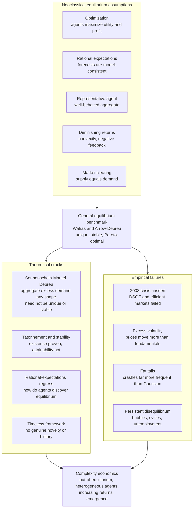

# ⚖️ The Limits of Neoclassical Equilibrium

> [!abstract] TL;DR
> **Neoclassical equilibrium economics** — rational optimizing agents, market-clearing equilibrium, a representative agent, rational expectations, and diminishing returns yielding a unique stable optimum — is an elegant, powerful **benchmark** that nonetheless has deep cracks. The **Sonnenschein–Mantel–Debreu theorem** shows general equilibrium need not be unique or stable; there is **no guaranteed process** by which agents actually *reach* equilibrium (existence is proven, attainability is not); the **representative-agent** shortcut erases the heterogeneity and interaction that drive real macro phenomena; and empirically it failed spectacularly to anticipate or explain the **2008 crisis**, fat-tailed crashes, excess volatility, and persistent disequilibrium. Recognizing precisely *where and why* equilibrium breaks — and treating it as a **special case** rather than a universal law — is the foundational motivation for complexity economics' out-of-equilibrium, heterogeneous-agent, emergence-based alternative.

---

## Intuition

**Analogy — describing a living forest using only the word "balance."** Imagine you are handed a photograph of a forest and told to describe it using a single concept: *equilibrium*. Every tree is perfectly sized, every animal population exactly steady, every nutrient flow precisely matched — the whole system frozen in one tidy, balanced arrangement. You would capture something real: forests *do* tend toward characteristic densities, and a disturbed patch *does* tend to regrow. But you would miss everything that makes a forest **alive** — the fires that reset it, the slow succession from grass to canopy, the competition and cooperation, the sudden die-offs and explosions of growth, the fact that the forest of a century ago is not the forest of today and the difference *is the story*.

Neoclassical economics describes the economy this way: as a system forever settling into a serene, optimal **equilibrium** where supply equals demand and no one wishes to change their behavior. It is elegant, mathematically powerful, and — in the moments that matter most, the bubbles and crashes and runaway inequality — spectacularly wrong. Understanding exactly **where** the equilibrium picture breaks and **why** is the doorway to complexity economics. The companion note *Complexity_Economics_Overview* frames the whole program as the study of the economy *as a living forest, not a frozen photograph*.

---

## How It Works

### The paradigm being challenged

Mainstream economics rests on three organizing commitments, so standard that Arthur summarizes the whole apparatus as **equilibrium + optimization**:

1. **Optimization.** Agents maximize something — households maximize utility, firms maximize profit — subject to constraints. Behavior is the *solution to a well-posed problem*.
2. **Equilibrium.** The economy is modeled as being in a **consistent, mutually-compatible state**: every agent's optimal plan is simultaneously feasible, markets **clear** (supply equals demand), and no one has an incentive to deviate. The economy is studied **at rest**, or converging to rest.
3. **A well-behaved aggregate.** To make the math tractable, the diverse population is collapsed into a **representative agent**, or an aggregate that behaves as if there were one.

Its crowning achievement is **General Equilibrium theory** — **Walras's** vision of all markets clearing at once, made rigorous by **Arrow and Debreu (1954)**, who proved that under convexity and continuity assumptions a competitive equilibrium **exists** and is **Pareto-optimal** (the two welfare theorems). This is the intellectual jewel: a mathematically watertight demonstration that decentralized self-interest, mediated by prices, can produce a coherent, efficient allocation. It is the benchmark [[Market_Equilibrium|supply-and-demand equilibrium]] scaled up to the entire economy, and it is genuinely one of the great achievements of social science.

### The five load-bearing assumptions

The elegance is bought with five assumptions, each of which makes the math tractable and each of which complexity economics questions:

1. **Optimization** — agents solve for the best action given preferences and constraints.
2. **Equilibrium / market-clearing** — the economy sits in a consistent state where plans mesh and markets clear.
3. **Representative agent** — heterogeneity is suppressed into one (or a few) types so aggregates are well-defined.
4. **Rational expectations** (Muth 1961, Lucas 1972) — agents' forecasts are **model-consistent**: on average they equal the outcomes the model itself generates, so agents are not *systematically* wrong.
5. **Diminishing returns / convexity** — the crucial technical assumption. Negative feedback (each extra unit is worth less, costs more) is what pins the system to a **unique, stable** equilibrium. Increasing returns would open the door to multiplicity and instability, so they are assumed away.

### Theoretical cracks — the theory's own unresolved problems

These are not outside criticisms; they are difficulties *internal* to the equilibrium program:

- **Sonnenschein–Mantel–Debreu (SMD), the "anything goes" theorem (1972–74).** One hopes that individually rational, well-behaved agents aggregate to a well-behaved economy. SMD proves the opposite: the **aggregate excess-demand function** can take *essentially any shape* consistent with Walras's law and homogeneity. Restrictions on individual behavior impose **almost no restrictions on the aggregate**. Consequence: general equilibrium need **not be unique** and need **not be stable**. The representative-agent shortcut — assuming the aggregate behaves like one nice agent — is not a harmless simplification; SMD shows it is *assuming away the problem*.
- **The stability / tâtonnement problem.** Arrow–Debreu proves an equilibrium **exists**; it does not prove any real economy **reaches** it. Walras imagined a fictional **auctioneer** calling out prices and adjusting them (*tâtonnement*, "groping") until markets clear, with no trade occurring out of equilibrium. Scarf (1960) produced examples where this adjustment process **oscillates forever** and never converges. Existence is a fixed-point theorem; **attainability is a dynamics question the theory largely leaves open**.
- **The rational-expectations regress.** For agents to hold model-consistent expectations, they must somehow *know* the equilibrium — but the equilibrium depends on everyone's expectations, which depend on the equilibrium. How is this coordinated? There is no specified learning process guaranteed to land there, and often **multiple self-fulfilling expectations** are possible. As Arthur puts it, the economy **must be discovered, not assumed** — expectations are formed *before* the outcome exists, an inherently out-of-equilibrium, inductive act.
- **The treatment of time and novelty.** Arrow–Debreu equilibrium is essentially **timeless**: all trades for all dates and states are settled "at the beginning." There is no genuine **history**, no true **innovation**, no path that could have gone otherwise. Yet innovation, growth, and structural change are exactly what economies *do*.

### Empirical failures — where the predictions meet reality

- **The 2008 financial crisis.** The dominant macro and finance models — **efficient-markets** finance and **DSGE** macro — neither anticipated nor could easily explain the crisis. Krugman called it "the economics profession's failure"; Queen Elizabeth II famously asked at the LSE, *"Why did no one see it coming?"* Models built on equilibrium and market-clearing had **no financial sector capable of collapsing**.
- **Excess volatility (Shiller 1981).** Stock prices move **far more** than the present value of subsequent dividends can justify. A variance bound that efficient-markets theory implies is **violated** in the data: markets are more volatile than fundamentals.
- **Fat tails.** Large crashes (1929, 1987, 2008, 2020) occur **far more often** than the Gaussian distributions embedded in equilibrium risk models predict — a 1987-style move is a "25-sigma" event under a normal model, i.e. effectively impossible, yet it happened. Returns follow **power laws**, not bell curves.
- **Persistent disequilibrium.** Involuntary unemployment, speculative bubbles, and business cycles are hard to square with continuous market-clearing. And innovation, endogenous growth, and the *dynamics* of inequality are not generated from within the framework — they are bolted on as exogenous shocks.

### The representative-agent problem, and DSGE

A specific, damaging simplification deserves its own spotlight. To obtain tractable aggregates, modern macro often collapses the entire economy into **one representative rational agent**. This **erases heterogeneity, interaction, and distribution** — precisely the ingredients that matter for inequality, coordination failures, bank runs, and emergent macro phenomena. Kirman's devastating question — *"Whom or what does the representative individual represent?"* — points out that a representative agent can prefer outcome A to B even when *every actual individual* prefers B to A; aggregation is **not innocent**.

**DSGE** (Dynamic Stochastic General Equilibrium) models — equilibrium + rational expectations + a representative (or limited-heterogeneity) agent + exogenous shocks — dominate central banks and policy institutions. They were heavily criticized post-2008 for assuming equilibrium, omitting the financial sector, and relying on **external shocks** to generate fluctuations (the cycle comes from *outside* the model, not from its own internal dynamics). The response has been a push toward **heterogeneous-agent** models (HANK — Heterogeneous-Agent New Keynesian) and **agent-based** alternatives, previewed in *Agent_Based_Macroeconomics*. The **Lucas critique** (1976) — that policy analysis using historical relationships fails because agents' behavior changes when policy changes — was itself the argument that forced microfoundations onto macro; complexity economics extends the same logic further, arguing the microfoundations should be *boundedly rational and heterogeneous*, not a single optimizer.

### What equilibrium gets right — and the honest verdict

Intellectual honesty requires the counterweight: equilibrium models are **powerful and genuinely useful**. Many markets *do* clear approximately; comparative statics, price theory, and welfare analysis deliver real insight; the general-equilibrium framework organizes a vast body of coherent results. The problem is **not** that equilibrium is useless — it is treating equilibrium as **universal**, assuming the economy is *always* at or near it. Complexity economics **complements** rather than wholly replaces the neoclassical picture: equilibrium is a **special, limiting case** of a broader out-of-equilibrium reality — the frozen photograph is a valid snapshot of a system that is usually in motion. The alternative, developed across *Economies_as_Complex_Adaptive_Systems*, *Bounded_Rationality_and_Heterogeneous_Agents*, *Increasing_Returns_and_Path_Dependence*, and *Non_Equilibrium_and_Out_of_Equilibrium_Dynamics*, replaces the five assumptions with **out-of-equilibrium dynamics, heterogeneous boundedly-rational agents, increasing returns, and emergence** — treating the economy as a **process to be simulated and observed, not an equilibrium to be solved**.

### Flow / Architecture



---

## Key Concepts

### Secondary
- **Equilibrium means "balance."** The mainstream picture says a market is like a scale that always settles level — the price where buyers and sellers exactly match, with no one wanting to change.
- **The problem: real economies don't settle.** Bubbles inflate, crashes strike, inequality runs away. A model that only knows "balance" cannot see the fires and floods.
- **One answer vs. many answers.** Equilibrium theory promises there is *one* correct resting price. In reality there can be *several* — or *none* — and history decides which, if any, the economy lands on.
- **Nobody rings the bell.** Even if a perfect balance point exists, there is no referee who moves prices there. Traders grope in the dark, and their groping can overshoot forever.

### Undergraduate
- **General equilibrium (Walras, Arrow–Debreu).** A proof that, under convexity, a set of prices exists at which *all* markets clear simultaneously, and the result is Pareto-optimal (the two welfare theorems). The rigorous heart of mainstream micro.
- **The five assumptions.** Optimization, equilibrium/market-clearing, representative agent, rational expectations, and diminishing returns — the last guarantees *uniqueness and stability* via negative feedback.
- **Rational expectations.** Agents' forecasts are correct on average (model-consistent); they make no *systematic* errors. Underpins the Lucas critique and DSGE.
- **The cobweb model.** A market where supply reacts to *last period's* price. Even though an equilibrium exists, naive backward-looking expectations can make prices **oscillate or explode** — existence does not imply stability or attainability.
- **Efficient markets & excess volatility.** Prices should equal fundamentals; Shiller showed they gyrate far more than fundamentals do.
- **DSGE and the representative agent.** The workhorse of policy macro: equilibrium + rational expectations + one representative agent + external shocks. Criticized post-2008 for missing finance and crises.

### Graduate
- **Sonnenschein–Mantel–Debreu, precisely.** Any function satisfying continuity, homogeneity of degree zero, and Walras's law can arise as the **aggregate excess-demand function** of an economy of rational agents. Individual rationality places *no* testable restrictions on aggregate demand ⇒ **no guarantee of uniqueness or global stability**, and the representative-agent construction is not derivable from micro theory.
- **Tâtonnement (in)stability.** Under the price-adjustment ODE $\dot p = Z(p)$ (excess demand), a rest point $p^*$ is locally stable iff the Jacobian of $Z$ has eigenvalues with negative real part; Scarf's examples exhibit **globally unstable** equilibria with limit cycles. Gross-substitutability restores stability but is a strong, non-generic assumption.
- **Rational-expectations fixed points.** RE is a **fixed point** of the map from beliefs to outcomes; such fixed points may be **non-unique** (sunspot / self-fulfilling equilibria) and **not learnable** — E-stability (Evans–Honkapohja) governs whether adaptive learning converges to a given RE equilibrium, and many do not.
- **Lucas critique & microfoundations.** Reduced-form parameters are not policy-invariant; behavior must be derived from "deep" preferences. Complexity economics accepts the critique but argues the deep primitives are **bounded rationality, heterogeneity, and interaction**, not a single optimizer — motivating HANK and agent-based macro.
- **Excess-volatility variance bound.** Under EMH, $\mathrm{Var}(P) \le \mathrm{Var}(P^*)$ where $P^*$ is the ex-post rational price; the bound is empirically violated (Shiller 1981; LeRoy–Porter).
- **Equilibrium as a limiting case.** In the complexity view, RE equilibrium is the fixed point that a heterogeneous adaptive system converges to *only* when interactions are weak, returns diminishing, and expectations coordinate — a measure-zero idealization of a generically out-of-equilibrium process.

---

## Python Demo

Two demonstrations of *where equilibrium fails*. **Part (a)** builds the classic **cobweb model**: a supply–demand market in which producers set output based on *last period's* price (naive, backward-looking expectations). A unique equilibrium price $P^*$ **exists in every case**, yet whether prices actually *reach* it depends entirely on the ratio of supply-to-demand slopes — they may converge, oscillate forever, or explode. This shows that equilibrium **existence does not imply stability** or that boundedly-rational agents can find it. **Part (b)** shows two ways the "tidy" prediction fails: **non-uniqueness** — an aggregate excess-demand function (à la Sonnenschein–Mantel–Debreu) that crosses zero *three times*, giving multiple equilibria of which one is **unstable**; and **non-Gaussianity** — aggregate returns generated with **herding/interaction** develop **fat tails** that a Gaussian model (the equilibrium-finance default) drastically under-predicts. Uses only `numpy` and `matplotlib`.

```python
# Where equilibrium fails: (a) cobweb (in)stability, (b) multiplicity & fat tails.
# numpy + matplotlib only.
import numpy as np
import matplotlib.pyplot as plt

rng = np.random.default_rng(0)

# =====================================================================
# PART (a): the COBWEB model -- existence of equilibrium != stability.
# Supply reacts to LAST period's price (naive, backward-looking
# expectations). The equilibrium P* exists in every case, but whether
# prices CONVERGE depends only on r = (supply slope) / (demand slope):
#   r < 1  -> damped oscillation, converges     (stable)
#   r = 1  -> perpetual oscillation             (marginal)
#   r > 1  -> explosive oscillation, diverges   (unstable)
# =====================================================================
Pstar, P0, T = 3.75, 6.0, 12

def cobweb_prices(r, Pstar, P0, T):
    P = np.empty(T + 1)
    P[0] = P0
    for t in range(1, T + 1):
        P[t] = Pstar * (1 + r) - r * P[t - 1]   # fixed point at P = Pstar
    return P

regimes = {"convergent  r=0.6": 0.6,
           "oscillating r=1.0": 1.0,
           "explosive   r=1.25": 1.25}

# --- supply/demand params for the CONVERGENT cobweb spiral (r = D/B = 0.6) ---
A, B, C, D = 10.0, 2.0, 2.0, 1.2
demand_price = lambda Q: (A - Q) / B          # inverse demand  P = (A - Q)/B
supply_qty   = lambda Pe: -C + D * Pe          # supply reacts to expected price
Pstar_s = (A + C) / (B + D)                    # spiral equilibrium price
Qstar_s = A - B * Pstar_s                       # spiral equilibrium quantity

P, path_Q, path_P = P0, [], []
for _ in range(8):
    Qs = supply_qty(P)                          # produce on expected price P
    path_Q += [Qs]; path_P += [P]               # point on SUPPLY curve
    Pd = demand_price(Qs)                        # market clears -> realised price
    path_Q += [Qs]; path_P += [Pd]              # vertical move to DEMAND curve
    P = Pd                                       # becomes next expectation

# =====================================================================
# PART (b1): NON-UNIQUENESS. Sonnenschein-Mantel-Debreu: aggregate excess
# demand Z(P) can have ALMOST ANY shape -> it may cross zero many times.
# Tatonnement dP/dt = Z(P): an equilibrium is stable iff Z'(P*) < 0.
# =====================================================================
Pg = np.linspace(0.4, 3.6, 400)
Z  = -(Pg - 1.0) * (Pg - 2.0) * (Pg - 3.0)      # zeros at 1, 2, 3
stable_eq, unstable_eq = [1.0, 3.0], [2.0]       # Z'(1),Z'(3)<0 stable; Z'(2)>0 unstable

# =====================================================================
# PART (b2): FAT TAILS from INTERACTION. Aggregate "return" = mean action
# of N agents. Independent actions -> Gaussian aggregate (CLT), the tidy
# case. With HERDING (rarely, the whole crowd copies one signal) aligned
# moves create a heavy tail a Gaussian massively under-predicts.
# =====================================================================
N, periods, h = 1000, 200_000, 0.03
indep = (2.0 * rng.binomial(N, 0.5, size=periods) - N) / N          # ~Normal(0,1/N)
base  = (2.0 * rng.binomial(N, 0.5, size=periods) - N) / N
herd_mask = rng.random(periods) < h
common    = rng.choice([-1.0, 1.0], size=periods)
herd  = np.where(herd_mask, common, base)                           # spikes on aligned days
gauss = rng.normal(0.0, herd.std(), size=periods)                  # Gaussian, matched std

def survival(x):                        # empirical P(|x| > value)
    a = np.sort(np.abs(x))
    return a, 1.0 - np.arange(a.size) / a.size

def kurt(x):
    z = (x - x.mean()) / x.std()
    return float((z**4).mean())

# ------------------------------- plotting -------------------------------
fig, ax = plt.subplots(2, 2, figsize=(14, 10))

# (a1) cobweb price trajectories
for label, r in regimes.items():
    ax[0, 0].plot(range(T + 1), cobweb_prices(r, Pstar, P0, T), marker="o", ms=3, label=label)
ax[0, 0].axhline(Pstar, color="k", ls="--", lw=1, label="equilibrium P*")
ax[0, 0].set_title("(a) Cobweb: equilibrium EXISTS, stability need not")
ax[0, 0].set_xlabel("period"); ax[0, 0].set_ylabel("price"); ax[0, 0].set_ylim(-25, 40)
ax[0, 0].legend(fontsize=8); ax[0, 0].grid(alpha=0.3)

# (a2) cobweb spiral in (Q, P) space, convergent case
Ql = np.linspace(0, 6, 50)
ax[0, 1].plot(Ql, demand_price(Ql), color="navy", lw=2, label="demand")
ax[0, 1].plot(Ql, (Ql + C) / D, color="crimson", lw=2, label="supply")
ax[0, 1].plot(path_Q, path_P, color="gray", lw=1, marker="o", ms=3, label="adjustment path")
ax[0, 1].plot([Qstar_s], [Pstar_s], "k*", ms=15, label="equilibrium")
ax[0, 1].set_title("(a) Cobweb spiral converging to P* (r < 1)")
ax[0, 1].set_xlabel("quantity"); ax[0, 1].set_ylabel("price")
ax[0, 1].legend(fontsize=8); ax[0, 1].grid(alpha=0.3)

# (b1) multiple equilibria via excess demand
ax[1, 0].plot(Pg, Z, color="purple", lw=2)
ax[1, 0].axhline(0, color="k", lw=0.8)
ax[1, 0].plot(stable_eq, [0, 0], "o", color="green", ms=11, label="stable  (Z' < 0)")
ax[1, 0].plot(unstable_eq, [0], "o", mfc="white", mec="red", mew=2.5, ms=11, label="unstable (Z' > 0)")
ax[1, 0].set_title("(b) Multiple equilibria (Sonnenschein-Mantel-Debreu)")
ax[1, 0].set_xlabel("price P"); ax[1, 0].set_ylabel("aggregate excess demand  Z(P)")
ax[1, 0].legend(fontsize=8); ax[1, 0].grid(alpha=0.3)

# (b2) fat tails vs Gaussian (survival on log y)
ah, ch = survival(herd); ai, ci = survival(indep); ag, cg = survival(gauss)
ax[1, 1].semilogy(ah, ch, color="crimson", lw=2, label="herding (interaction)")
ax[1, 1].semilogy(ag, cg, color="black", ls="--", lw=1.5, label="Gaussian, same std")
ax[1, 1].semilogy(ai, ci, color="navy", lw=1, alpha=0.6, label="independent agents")
ax[1, 1].set_title("(b) Fat tails from interaction vs Gaussian prediction")
ax[1, 1].set_xlabel("|aggregate return|"); ax[1, 1].set_ylabel("P(|return| > x)   [log]")
ax[1, 1].set_ylim(1e-6, 1.5); ax[1, 1].legend(fontsize=8); ax[1, 1].grid(alpha=0.3, which="both")

plt.tight_layout(); plt.show()

# --------------------------- numeric takeaways ---------------------------
five_sigma = 5.0 * herd.std()
print("Cobweb r=1.25 final price: {:.1f}  (equilibrium P* = {:.2f}) -> diverges".format(
      cobweb_prices(1.25, Pstar, P0, T)[-1], Pstar))
print("Excess demand has 3 equilibria at P = 1, 2, 3  (P = 2 is UNSTABLE)")
print("Herding kurtosis: {:.1f}   vs Gaussian ~3.0".format(kurt(herd)))
print("Moves beyond 5 sigma -- herding: {:.3%}   Gaussian: {:.6%}".format(
      (np.abs(herd) > five_sigma).mean(), (np.abs(gauss) > five_sigma).mean()))
```

**What you see.** In **(a)** the price series with $r<1$ spirals into $P^*$, $r=1$ orbits it forever at constant amplitude, and $r>1$ fans out to infinity — three qualitatively different fates for the *same* existing equilibrium, decided purely by slopes. The spiral panel shows the textbook cobweb winding inward toward the supply–demand crossing. In **(b)** the excess-demand curve crosses zero three times: the middle equilibrium is **unstable** (any nudge sends prices toward one of the outer two), so "the" equilibrium is neither unique nor a reliable prediction. And the survival plot shows the herding return distribution with a **fat tail orders of magnitude above the Gaussian** — moves beyond 5σ happen a few percent of the time under interaction but essentially *never* under the normal model that equilibrium finance assumes. Each panel is a place the tidy neoclassical story quietly breaks.

---

## Real-World Applications

> **Example — the 2008 crisis and the models that missed it.** Central banks ran **DSGE** models with a representative agent, rational expectations, and *no meaningful financial sector*: banks could not fail because in equilibrium debts always clear. When the housing bubble burst, the models had no mechanism for cascading default, fire sales, or a credit freeze — exactly the fat-tailed, out-of-equilibrium contagion that the [[Cascades_and_Systemic_Risk|networked systemic-risk]] view treats as structurally normal. The post-mortem drove the rise of heterogeneous-agent (HANK) and agent-based macro.

- **Financial risk management.** Value-at-Risk and portfolio models built on Gaussian returns systematically under-price tail risk; the [[Market_Anomalies_and_Limits_to_Arbitrage|limits-to-arbitrage]] and fat-tail literature (and 1987, 1998 LTCM, 2008, 2020) show why power-law-aware, stress-tested models are now mandated.
- **Central-bank forecasting.** The failure of equilibrium DSGE to forecast or explain the Great Recession pushed institutions (Bank of England, ECB) to build agent-based and heterogeneous-agent complements previewed in *Agent_Based_Macroeconomics*.
- **Technology and platform markets.** Increasing returns and network effects (QWERTY, VHS, operating systems, cloud platforms) produce **path-dependent lock-in** to possibly-inferior standards — outcomes the unique-equilibrium, diminishing-returns model cannot generate, developed in *Increasing_Returns_and_Path_Dependence*.
- **Inequality dynamics.** Persistent, heavy-tailed wealth distributions emerge from interaction and multiplicative growth (see [[Economic_and_Social_Complexity]]), not from the representative agent, which by construction has no distribution at all.
- **Macroprudential regulation.** Treating the financial system as a coupled network with endogenous instability — rather than a set of independent agents at equilibrium — underlies stress testing, circuit breakers, and systemic-risk surcharges.

---

## Common Pitfalls

- **Confusing existence with attainability.** Proving an equilibrium *exists* (a fixed-point theorem) says nothing about whether any real, boundedly-rational process *reaches* it. The cobweb demo makes the gap concrete: the equilibrium is right there and the market still diverges from it.
- **Confusing existence with uniqueness or stability.** SMD guarantees the aggregate can misbehave. Assuming "the" equilibrium — singular, stable — smuggles in an assumption the theory itself denies.
- **Treating the representative agent as innocent.** Aggregation is not neutral: a representative agent can hold preferences no individual holds, and it *erases* the heterogeneity, distribution, and interaction that drive inequality, coordination failure, and crises. Kirman's warning is the antidote.
- **Fitting a Gaussian to fat-tailed data.** Equilibrium finance's normal-distribution default under-predicts crashes by many orders of magnitude. Check for power-law tails *before* trusting any mean-variance risk number.
- **Reading "markets clear" as an empirical fact.** Market-clearing is an *assumption* chosen for tractability, not an observation. Involuntary unemployment, rationing, and bubbles are persistent disequilibria the assumption defines away.
- **Throwing equilibrium out entirely.** The opposite error. Equilibrium is a powerful special case — many markets *do* clear approximately, and comparative statics and welfare analysis remain valuable. The fix is to treat equilibrium as a *limiting case*, not a universal law.
- **Blaming exogenous shocks for everything.** DSGE explains fluctuations by hitting an otherwise-stable system with external shocks. If the cycle is generated *internally* (endogenous instability, as complexity economics argues), then attributing it to outside shocks is a category error.

---

## Related Concepts

- [[Market_Equilibrium]] — the neoclassical supply-and-demand equilibrium at the heart of the benchmark this note dissects; general equilibrium is this idea scaled to the whole economy.
- [[Supply_and_Demand]] — the price-adjustment intuition the cobweb model turns *unstable* when expectations are naive and slopes are wrong.
- [[Comparative_Statics]] — the "what equilibrium gets right" workhorse: comparing rest points across parameter changes, valid precisely when the system *is* near a stable equilibrium.
- [[Perfect_Competition]] — the idealized market structure whose assumptions (price-taking, no interaction, convexity) the general-equilibrium apparatus requires.
- [[The_Rational_Actor_Model_and_Its_Limits]] — the optimizing homo economicus that equilibrium theory assumes; its systematic violations are one crack in the paradigm.
- [[Bounded_Rationality_and_Satisficing]] — the replacement for perfect optimization: agents who satisfice and adapt, dissolving the rational-expectations regress.
- [[Complex_Adaptive_Systems]] — the parent framework of the alternative: many heterogeneous adaptive agents whose interactions generate emergent, out-of-equilibrium macro-order.
- [[Economic_and_Social_Complexity]] — the Santa Fe / Arthur complexity-economics program that operationalizes the alternative previewed here (increasing returns, El Farol, power laws).
- [[Emergence_and_Self_Organization]] — how macro patterns arise from micro interactions without being assumed into a representative agent.
- [[Nonlinearity_and_Feedback]] — increasing returns are positive feedback; they are exactly what break the unique-stable-equilibrium guarantee that diminishing returns provide.
- [[Dissipative_Structures_and_Nonequilibrium]] — the physics of systems held far from equilibrium, the natural home of an economy that never comes to rest.
- [[Chaos_Theory_and_Sensitive_Dependence]] — one route to persistent non-convergence and endogenous fluctuation, contrasting with imposed exogenous shocks.
- [[Criticality_and_Phase_Transitions]] — near-critical markets produce the fat-tailed fluctuations the Gaussian equilibrium models under-predict.
- [[Cascades_and_Systemic_Risk]] — the networked-contagion machinery behind 2008 that equilibrium DSGE could not represent.
- [[Agent_Based_Modeling]] — the primary method of the alternative: grow the economy in silico and observe what emerges rather than solving for equilibrium.
- [[Herding_Bubbles_and_Crashes]] — the interaction-driven dynamics reproduced in the fat-tail demo, treated as normal rather than anomalous.
- [[Market_Anomalies_and_Limits_to_Arbitrage]] — the finance evidence (excess volatility, anomalies) against the efficient-markets/equilibrium view.
- [[Foundations_of_Behavioral_Finance]] — the bounded-rationality microfoundations shared with the complexity alternative.
- [[Market_Anomalies_and_Bubbles]] — the recurring bubbles and crashes that persistent-disequilibrium models explain and equilibrium models treat as flukes.
- [[Global_Financial_Crises]] — the macro account of 2008-style contagion whose invisibility to equilibrium models motivates this critique.

---

## Review Questions

1. **(Conceptual)** Arrow and Debreu *proved* that a competitive general equilibrium exists. Explain why this theorem does **not** establish that a real economy will ever reach that equilibrium, and name the two distinct results (one about the *shape* of aggregate demand, one about the *dynamics* of adjustment) that expose the gap between existence and attainability.
2. **(Scenario)** A central bank's DSGE model, built on a representative agent with rational expectations, failed to anticipate a banking crisis. A colleague argues the fix is "add a bigger exogenous shock." Using the roles of (i) the representative-agent assumption and (ii) endogenous vs. exogenous fluctuation, explain why this fix misses the point, and describe what a heterogeneous-agent or agent-based alternative would change.
3. **(Trade-off / critique)** Complexity economics claims equilibrium is a "special case, not a universal law." Defend the *usefulness* of equilibrium models for at least one class of problems, then specify precisely the conditions (regarding returns to scale, agent heterogeneity, and expectation coordination) under which the equilibrium approximation is reliable versus dangerously misleading.

---

## Sources

- Arrow, K. J., & Debreu, G. (1954). "Existence of an Equilibrium for a Competitive Economy." *Econometrica, 22*(3), 265–290. — the rigorous existence proof at the core of general-equilibrium theory.
- Kirman, A. P. (1992). "Whom or What Does the Representative Individual Represent?" *Journal of Economic Perspectives, 6*(2), 117–136. — the definitive critique of the representative-agent shortcut and SMD's implications.
- Shiller, R. J. (1981). "Do Stock Prices Move Too Much to Be Justified by Subsequent Changes in Dividends?" *American Economic Review, 71*(3), 421–436. — the excess-volatility evidence against efficient-markets equilibrium.
- Arthur, W. B. (2021). "Foundations of Complexity Economics." *Nature Reviews Physics, 3*, 136–145. — the equilibrium-vs-complexity contrast and the out-of-equilibrium research program.
- Kirman, A. P. (2010). "The Economic Crisis Is a Crisis for Economic Theory." *CESifo Economic Studies, 56*(4), 498–535. — post-2008 assessment of equilibrium macro's empirical failure.
- Lucas, R. E. (1976). "Econometric Policy Evaluation: A Critique." *Carnegie-Rochester Conference Series, 1*, 19–46. — the microfoundations argument that reshaped modern macro.

---

#complexity-economics #equilibrium #neoclassical-economics #rational-expectations #critique
