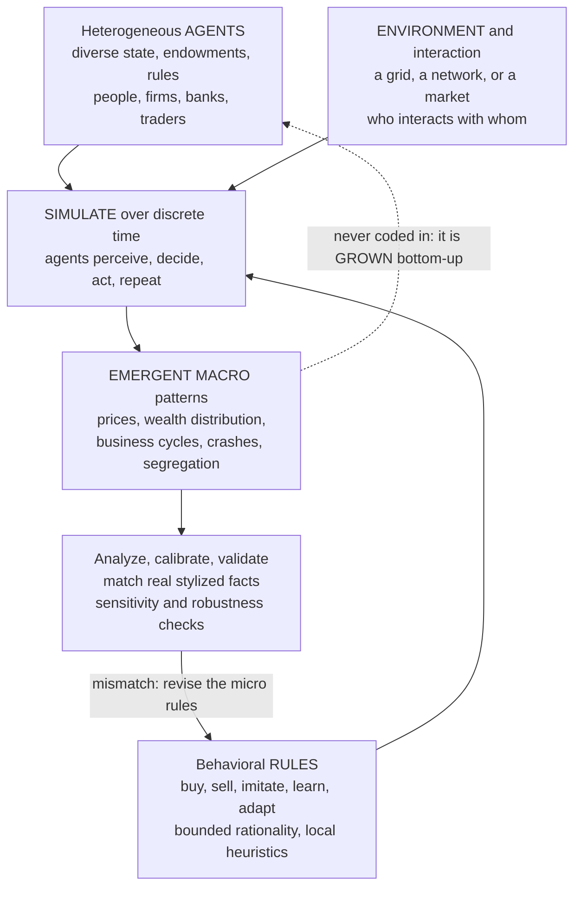

# 🐦 Agent-Based Modeling in Economics

> [!abstract] TL;DR
> **Agent-based modeling (ABM)** — the signature method of complexity economics, also called **agent-based computational economics (ACE)** — builds an economy *from the bottom up* out of many **heterogeneous, autonomous agents**, each carrying its own state and simple behavioral **rules**, places them in an environment, lets them **interact over time in simulation**, and then *watches* the macro-level patterns — market prices, wealth distributions, business cycles, crashes, segregation — **emerge** without ever being assumed. Instead of *solving* for an equilibrium, you **grow the economy in silico**. It embodies Joshua Epstein's generative motto, *"if you didn't grow it, you didn't explain it,"* and naturally handles the heterogeneity, interaction, adaptation, networks, and out-of-equilibrium dynamics that analytical models cannot — at the cost of harder calibration and less transparency. From Schelling and Sugarscape to the Santa Fe artificial stock market, and vaulted to prominence after 2008 by Farmer and Foley's *Nature* call, it is now a growing policy tool at central banks and in epidemiology, finance, and macroeconomics. This note opens the vault's *Agent-Based Computational Economics* section.

---

## Intuition

**Analogy:** To understand a flock of starlings wheeling and folding across an evening sky, you do **not** sit down and write one equation for "the flock" — there isn't one. There is no master bird, no choreographer, no aggregate law of murmuration to solve. Instead you do something stranger and far more powerful: you write the rulebook for *one single bird* — three tiny local rules, *stay close to your neighbors, match their speed, don't collide* — hand that same rulebook to a thousand simulated birds, and let them loose. Nobody programmed the breathtaking rolling, splitting, and reforming patterns. Yet they **emerge on their own**, purely from a thousand birds each minding its three rules and its handful of neighbors.

Agent-based modeling does exactly this for the economy. Rather than *assuming* the market sits at an aggregate equilibrium and solving for its price, you program thousands of individual agents — traders, households, firms, banks — each with simple behaviors and a little local information, let them buy, sell, imitate, and adapt in a computer, and then **watch** the market price, the business cycle, the wealth distribution, or the crash **emerge from the bottom up**. You never describe the macro-economy directly. You grow it, and by growing it you discover which individual behaviors are sufficient to produce it. If the pattern appears, you have a candidate explanation; if it stubbornly refuses to appear no matter how you tune the agents, you have learned your micro-story is wrong.

---

## How It Works

### The core move: grow it, don't solve it

Mainstream economics traditionally *deduces* aggregate outcomes: assume a **representative agent** who optimizes perfectly, impose a **market-clearing equilibrium**, and solve the resulting equations for prices and quantities. Powerful, but it finesses away the very things that make an economy interesting — that agents **differ**, **interact locally**, **adapt**, and spend most of their time **out of equilibrium**. ABM inverts the procedure. You do not assume the aggregate; you **construct** it. The macro-economy becomes an *output* of the simulation, not an input assumption — a shift the vault develops in the section-opener `Complexity_Economics_Overview`.

### The anatomy of an ABM

Every agent-based economic model is assembled from four ingredients and one loop.

1. **Agents (heterogeneous).** Autonomous entities with internal **state** (money, inventory, price expectations, employment) and — crucially — **diversity**: they are *not* identical. One agent can be poorer, more risk-averse, better-connected, or slower to learn than another. Agents can be people, firms, banks, or traders. This variance is not noise to be averaged away; it is the engine of the interesting behavior, developed in `Bounded_Rationality_and_Heterogeneous_Agents`.
2. **Behavioral rules.** Each agent follows simple **rules or heuristics** — buy below a target price, imitate a neighbor who did well, adjust a bid after a loss, save a fixed fraction of income. This is **bounded rationality** (Herbert Simon), not global optimization: agents *satisfice* and *adapt* rather than solve a lifetime constrained-maximization problem.
3. **Interaction structure / environment.** *Who interacts with whom*: a spatial grid, a social or financial **network**, or a **market** where agents post and match orders. Agents act on **local** information, never on a global blackboard.
4. **Time / dynamics.** Agents act **repeatedly** over discrete steps, so the system **evolves**; the scientific payload is the resulting time series of the aggregate.

The **loop**: initialize the population, then step time forward. On each step every agent **perceives** its local surroundings, **decides** via its rules, and **acts** (trades, moves, adapts, updates state); the environment updates; and the modeler **aggregates** macro-measures — a price, a Gini coefficient, an output level — that nobody wrote down directly.

### Generative social science

Epstein reframed the goal of the whole enterprise: **to *explain* a macroscopic economic regularity is to exhibit a population of agents whose local interactions *generate* it.** Fitting a curve to aggregate data is *description*, not explanation; only a working micro-mechanism that *produces* the pattern counts as an explanation. Hence the manifesto — *"if you didn't grow it, you didn't explain it"* — a **constructive, generative** standard that contrasts with the deductive equilibrium proofs of analytical economics. You understand a phenomenon when you can **build** it. Demonstrating a *sufficient* micro-mechanism is the deliverable, explored further in `Emergence_of_Macro_from_Micro`.

### Emergence from the bottom up

The payoff is **emergence**: macro patterns — market prices, wealth distributions, business cycles, segregation, institutions, crashes — appear **without being programmed in or assumed**. The model reveals *how* micro-behavior aggregates into macro-outcomes — the **micro-macro link** that representative-agent models paper over by fiat. Classic emergent results include **Schelling segregation** (mild individual preferences produce stark neighborhood separation), **Sugarscape** wealth distributions (foraging rules grow real-looking inequality), and **artificial stock market** fat tails and volatility clustering (heterogeneous adaptive traders generate realistic market statistics).

### Workflow and the micro-to-macro link



### ABM versus equilibrium / analytical models

The sharpest way to grasp ABM is against its foil, the **analytical equilibrium model**.

- **Advantages of ABM.** It handles **heterogeneity**, **interaction**, **adaptation**, **out-of-equilibrium dynamics**, **networks**, and **emergence** *naturally* — things closed-form models cannot express. No need to assume a representative agent or that the system ever reaches equilibrium.
- **Disadvantages of ABM.** Less analytical transparency — the model can be a **"black box"** where you know *what* happened but struggle to prove *why*. Many parameters and rules give it dangerous flexibility (the "you can grow anything" critique). And **calibration and validation** against real data are genuinely hard, alongside real computational cost.

This is the "wilderness of the assumptions" critique (there is no unique ABM, unlike the unique equilibrium) traded against a large **realism gain**. The two families are best seen as **complementary tools**, not rivals — the analytical model for tractable insight, the ABM for the messy, heterogeneous, out-of-equilibrium reality.

### The central methodological challenge: calibration and validation

The frontier of making ABM a rigorous empirical science is **credibility**. **Calibration** tunes parameters and rules so outputs match data; **validation** asks whether the model reproduces real **stylized facts** — fat-tailed returns, volatility clustering, business-cycle co-movements — that it was *not* fitted to, plus out-of-sample patterns and sensitivity analysis. The ever-present danger is **overfitting**: with enough free rules an ABM can reproduce almost anything, so a good fit is weak evidence. This "credibility problem" is the subject of `Calibration_and_Validation_of_Agent_Based_Models`.

---

## Key Concepts

**Secondary (intuition level)**
- **Model the individual, watch the economy.** You write the rulebook for one trader or household, copy it thousands of times, run it, and the market price or wealth gap appears on its own.
- **The flock has no leader.** Just as a starling flock's shape emerges from birds following local rules, a market's price and a society's inequality emerge from agents following simple rules — nobody is in charge of the aggregate.
- **"If you didn't grow it, you didn't explain it."** You have explained an economic pattern only when you can build the little artificial world that produces it.
- **Grow it, don't solve it.** Instead of assuming the economy sits at a tidy equilibrium, you *run* it forward and see what happens.

**Undergraduate (formal level)**
- **The four ingredients.** Heterogeneous **agents** (state + rules), **behavioral rules** (bounded-rational heuristics), an **interaction structure** (grid, network, or market), and **time** (repeated action), driven by a perceive-decide-act loop.
- **ACE — agent-based computational economics.** The subfield (Tesfatsion, LeBaron, Farmer) that applies ABM specifically to economies: markets, industries, macroeconomies, and financial systems modeled as populations of interacting agents.
- **Generative explanation.** Explaining a macro regularity by *generating* it from plausible micro-behavior — a *sufficiency* claim about mechanism, contrasted with deductive equilibrium proofs.
- **Emergence and the micro-macro link.** Aggregate patterns (prices, distributions, cycles) that are not present in any single agent's rules but arise from their interaction — the link representative-agent models assume away.
- **The canonical models.** **Schelling** segregation (1971), **Sugarscape** (Epstein-Axtell 1996), the **Santa Fe Artificial Stock Market** (Arthur, LeBaron, Palmer 1997), and the **El Farol / minority game** (Arthur 1994) — each covered in its own vault note.

**Graduate (research level)**
- **ABM versus DSGE.** Agent-based macro (heterogeneous firms and households, no market-clearing assumption, out-of-equilibrium adjustment) as an alternative to **Dynamic Stochastic General Equilibrium** models built on a representative optimizing agent and rational expectations — the debate reignited after 2008 and taken up in `Agent_Based_Macroeconomics`.
- **Validation strategies.** Reproducing **multiple stylized facts** simultaneously (pattern-oriented modeling), indirect inference / simulated method of moments for estimation, sensitivity and robustness analysis, and out-of-sample forecasting — the toolkit that separates a controlled computational experiment from a "just-so" story.
- **The identification and equifinality problem.** Many distinct micro-mechanisms can generate the *same* macro pattern, so matching a fact proves *sufficiency*, never *necessity*; robustness and parsimony are the defenses against arbitrariness.
- **Out-of-equilibrium foundations.** ABM operationalizes the complexity-economics claim (Arthur, Beinhocker, the Santa Fe program) that the economy is a **non-equilibrium complex adaptive system** with endogenous novelty and fat-tailed fluctuations, the computational sibling of evolutionary game dynamics and multi-agent reinforcement learning.
- **Systemic risk and networks.** Agent-based models of interbank networks, contagion, fire sales, and flash crashes give regulators a laboratory for stress-testing the *interactions* that equilibrium risk models treat as exogenous.

---

## Python Demo

We **grow a wealth distribution from the bottom up** with a minimal **kinetic wealth-exchange model** (Dragulescu & Yakovenko 2000; Chakraborti & Chakrabarti 2000). Every agent starts with *exactly the same* money. Then, over and over, two agents meet at random and **redistribute their pooled money by a random split** — a crude stand-in for a trade whose terms neither party fully controls. **No agent intends inequality; nobody optimizes; there is no equilibrium being solved.** Yet a stable, sharply unequal **macro wealth distribution emerges** purely from random pairwise exchange.

Part (a) shows the emergent distribution and *its evolution over time* (via the Gini coefficient rising from zero). Part (b) demonstrates the **micro-to-macro link**: changing a single agent **rule** — a *saving propensity* `lambda`, the fraction of wealth each agent refuses to put at stake — transforms the emergent macro outcome from a highly unequal **exponential (Boltzmann-Gibbs)** distribution into a far more equal, peaked **Gamma** distribution. One micro rule; a completely different macro society. Uses only `numpy` and `matplotlib`.

```python
# Kinetic wealth-exchange ABM: a macro wealth DISTRIBUTION grows from the
# bottom up out of nothing but random pairwise trades. No agent intends
# inequality and no equilibrium is solved -- the distribution EMERGES.
# Changing one agent rule (a saving propensity lambda) changes the macro
# outcome: the micro-to-macro link at the heart of agent-based economics.
import numpy as np
import matplotlib.pyplot as plt
from math import gamma as gamma_fn

def gini(w):
    """Gini coefficient of a wealth vector: 0 = perfect equality, 1 = max inequality."""
    w = np.sort(w)
    n = w.size
    idx = np.arange(1, n + 1)
    return (2.0 * np.sum(idx * w)) / (n * np.sum(w)) - (n + 1.0) / n

def run_exchange(N=1000, T=300_000, lam=0.0, seed=0, record_every=2000):
    """N agents, everyone starts with 1 unit of money (total is conserved).
    Each step two random agents pool the fraction they are willing to risk,
    (1 - lam) of each one's money, and split that pool by a random draw eps.
    lam = 0 -> classic exchange (exponential wealth). lam > 0 -> agents SAVE."""
    rng = np.random.default_rng(seed)
    w = np.full(N, 1.0)                      # start perfectly equal
    times, ginis = [], []
    for t in range(T):
        i, j = rng.integers(N), rng.integers(N)
        if i == j:
            continue
        wi, wj = w[i], w[j]
        pool = (1.0 - lam) * (wi + wj)       # the money actually put at stake
        eps = rng.random()                   # random split of the pool
        w[i] = lam * wi + eps * pool
        w[j] = lam * wj + (1.0 - eps) * pool # total money conserved every trade
        if t % record_every == 0:
            times.append(t); ginis.append(gini(w))
    return w, np.array(times), np.array(ginis)

# (a) NO saving: exponential (Boltzmann-Gibbs) inequality emerges from random trade.
w_free, t_free, g_free = run_exchange(lam=0.0, seed=1)
# (b) HIGH saving rule: same model, one changed rule -> a far more equal society.
LAM = 0.7
w_save, t_save, g_save = run_exchange(lam=LAM, seed=1)

# --- theoretical emergent shapes (mean wealth = 1 by construction) ---
x = np.linspace(0, 6, 400)
boltzmann = np.exp(-x)                                   # P(m) ~ exp(-m/<m>)
n_shape = 1.0 + 3.0 * LAM / (1.0 - LAM)                  # Gamma shape for saving model
gamma_pdf = (n_shape ** n_shape / gamma_fn(n_shape)) * x ** (n_shape - 1) * np.exp(-n_shape * x)

# --- visualize the emergent macro outcomes ---
fig, ax = plt.subplots(1, 3, figsize=(15, 4.6))

ax[0].hist(w_free, bins=60, density=True, color="#c0392b", alpha=0.7,
           label="emergent wealth")
ax[0].plot(x, boltzmann, "k--", lw=2, label="exp(-m):  Boltzmann")
ax[0].set_title("Rule lambda = 0 (no saving)\nEXPONENTIAL inequality emerges")
ax[0].set_xlabel("wealth  (mean = 1)"); ax[0].set_ylabel("density"); ax[0].legend()

ax[1].hist(w_save, bins=60, density=True, color="#27ae60", alpha=0.7,
           label="emergent wealth")
ax[1].plot(x, gamma_pdf, "k--", lw=2, label="Gamma fit")
ax[1].set_title("Rule lambda = 0.7 (agents save)\nPEAKED, far MORE EQUAL")
ax[1].set_xlabel("wealth  (mean = 1)"); ax[1].set_ylabel("density"); ax[1].legend()

ax[2].plot(t_free, g_free, color="#c0392b", lw=2, label="lambda = 0")
ax[2].plot(t_save, g_save, color="#27ae60", lw=2, label="lambda = 0.7")
ax[2].set_title("Inequality (Gini) GROWS over time,\nthen a rule change resets the macro outcome")
ax[2].set_xlabel("trades"); ax[2].set_ylabel("Gini coefficient"); ax[2].legend()
ax[2].set_ylim(0, 0.6)

fig.suptitle("Growing a wealth distribution in silico: macro inequality EMERGES "
             "from random micro-trades; one changed rule reshapes it", fontsize=12)
fig.tight_layout(rect=[0, 0, 1, 0.93])
plt.savefig("kinetic_wealth_abm.png", dpi=120)

# --- numerical confirmation of the micro-to-macro link ---
print("Everyone started perfectly equal (Gini = 0).")
print("lambda = 0.0  (no saving) -> emergent Gini = {:.3f}  (exponential, very unequal)"
      .format(gini(w_free)))
print("lambda = 0.7  (agents save) -> emergent Gini = {:.3f}  (Gamma, much more equal)"
      .format(gini(w_save)))
print("Same random-exchange model; ONE changed agent rule; a different macro society.")
plt.show()
```

**What the output shows.** Every agent begins with identical wealth, so inequality starts at **Gini = 0**. With no saving rule (`lambda = 0`), random pairwise trades alone drive the population to a stable **exponential (Boltzmann-Gibbs) distribution** — most agents poor, a long thin tail of the lucky-rich, Gini roughly **0.5** — and the third panel shows this inequality *growing over time* and then holding steady, an emergent macro fact that **no agent chose**. Flip a single micro rule — let each agent **save** a fraction `lambda = 0.7` of its wealth rather than risk it all — and the *same* model grows a completely different society: a **peaked Gamma distribution** clustered near the mean, with inequality slashed to Gini roughly **0.2**. That is the micro-to-macro link made concrete: a small change in individual behavior reshapes the aggregate, exactly the kind of claim ABM exists to make and that a representative-agent model cannot even pose.

---

## Real-World Applications

> **Example — the Bank of England's agent-based housing model.** After the 2008 crisis exposed how badly equilibrium models had missed the housing bubble, the Bank of England built an **agent-based model of the UK housing market** (Baptista et al., 2016): thousands of heterogeneous households — first-time buyers, movers, and buy-to-let investors — each following simple rules for bidding, borrowing, and renting, interacting through a market that clears house-by-house. The model *grows* boom-bust dynamics and lets regulators test **macroprudential policy** — loan-to-income caps, loan-to-value limits — by watching how a rule change on individual borrowing ripples up into aggregate credit and price stability. It is now a live input to financial-stability policy, precisely because it can represent the buy-to-let investors and credit-constrained buyers that a representative agent erases.

- **Financial markets and systemic risk.** Agent-based **artificial stock markets** (the Santa Fe model) reproduce fat-tailed returns and volatility clustering from heterogeneous adaptive traders; regulators and central banks use agent-based models of interbank networks, **contagion**, fire sales, and **flash crashes** for stress-testing — a new tool where equilibrium risk models are blind to interaction.
- **Macroeconomic modeling.** "Agent-based macro" platforms (the **EURACE** project, the Schumpeter-meeting-Keynes / "K+S" models of Dosi, Fagiolo, and Roventini) build economies of heterogeneous firms, banks, and households as an alternative to DSGE, generating endogenous business cycles and studying fiscal-monetary policy out of equilibrium.
- **Epidemiology and policy.** Agent-based epidemic models (the Imperial College and network-SEIR **COVID-19** models) simulate specific people, households, schools, and workplaces to test targeted interventions that a well-mixed compartmental model cannot represent — the same generative logic applied to disease.
- **Supply chains, energy, and climate-economy.** Agent-based models of supplier networks, electricity markets, and integrated **climate-economy** systems test resilience, contagion of shortages, and the effect of carbon-pricing rules on a heterogeneous population of firms and consumers.
- **Market design and urban systems.** Auction and matching-market design, congestion-pricing and evacuation planning, and traffic simulation (MATSim) all deploy ABM as a **computational laboratory** to trial policies before deploying them in the real world.

---

## Common Pitfalls

- **"You can grow anything" (overfitting).** A flexible ABM with many free rules can reproduce almost any target series, so a good fit is *weak* evidence. Validate against **stylized facts it was not calibrated on**, prefer parsimonious rule sets, and pre-register predictions — the credibility program of `Calibration_and_Validation_of_Agent_Based_Models`.
- **Treating the model as a black box.** Because outcomes are emergent, it is easy to report *what* happened without understanding *why*. Trace the mechanism, run controlled "knockout" experiments on individual rules, and use sensitivity analysis to find which inputs actually drive the result.
- **Skipping sensitivity analysis.** Emergent macro results can secretly hinge on an obscure parameter — a neighborhood radius, a boundary condition, or the agent **update order** (synchronous versus asynchronous). Without global sensitivity analysis you cannot know whether a headline finding is robust or an artifact.
- **Confusing sufficiency with necessity.** Growing a wealth distribution from random exchange proves the mechanism is *sufficient*, never that it is what actually produces real inequality. Many micro-stories generate the same macro pattern (equifinality); empirical validation, not a pretty plot, is the bar.
- **Parameter explosion / KISS violation.** Rich agents invite dozens of knobs and an uninterpretable input space. Start with the *simplest* model that could possibly show the effect and add complexity only when a specific pattern demands it.
- **Reaching for ABM when an equation would do.** If heterogeneity, interaction, and out-of-equilibrium dynamics wash out, a tractable analytical or system-dynamics model is cheaper and clearer. ABM earns its cost only when individuals and structure genuinely matter.
- **Mistaking "bounded rationality" for "irrationality."** Agents using imitation and satisficing heuristics are *procedurally* rational; the claim is that the aggregate still self-organizes, not that individuals are foolish.

---

## Related Concepts

- [[Agent_Based_Modeling]] — the general-purpose systems-thinking treatment of the method; this note specializes it to economies and markets.
- [[Complex_Adaptive_Systems]] — the framing of the economy as many heterogeneous adapting agents; ABM is its primary experimental laboratory.
- [[Emergence_and_Self_Organization]] — the phenomenon ABM makes measurable; prices and wealth distributions are emergence you can grow and replicate.
- [[Economic_and_Social_Complexity]] — the Santa Fe / Arthur / Beinhocker complexity-economics program that ABM operationalizes.
- [[Evolutionary_Economics_and_Bounded_Rationality]] — the low-rationality, imitation-and-selection microfoundations that ABM agents typically embody.
- [[Evolutionary_Dynamics_in_Markets_and_Institutions]] — agent-based markets and institutional evolution studied with the same computational tools.
- [[Replicator_Dynamics]] — the mean-field imitation law that many ABM agent rules reduce to when heterogeneity and space are averaged out.
- [[Spatial_and_Network_Games]] — agents playing games on a grid or network: the game-theoretic cousin of economic ABM's interaction structure.
- [[The_Ising_Model_and_Statistical_Physics]] — the physics ancestor of kinetic and opinion ABMs; the wealth-exchange demo is econophysics in the Ising lineage.
- [[The_Metropolis_Algorithm_and_MCMC]] — the stochastic-simulation machinery shared by agent-based and Monte Carlo methods.
- [[Monte_Carlo_Integration]] — random-sampling estimation that underpins how ABM outputs are aggregated and their uncertainty quantified.
- [[Cascades_and_Systemic_Risk]] — contagion and systemic failure on networks, a flagship application of agent-based finance.
- [[Market_Equilibrium]] — the static supply-demand fixed point that ABM recasts as an emergent, possibly out-of-equilibrium state.
- [[Supply_and_Demand]] — the aggregate relationship ABM derives bottom-up from individual buyers and sellers instead of assuming.
- [[Business_Cycle_Indicators]] — the macro fluctuations that agent-based macro models aim to generate endogenously rather than impose.
- [[Global_Financial_Crises]] — the 2008 failure of equilibrium models that motivated Farmer and Foley's call for ABM.
- [[Multi_Agent_Systems]] — the AI framing of many interacting autonomous agents; ABM is its social-science counterpart.
- [[Multi_Agent_and_Inverse_RL]] — engineered cousin where agents *learn* their rules rather than being hand-coded; both study behavior emerging from many local optimizers.

> Siblings planned for this *Agent-Based Computational Economics* section — `Complexity_Economics_Overview` (the paradigm shift), `Bounded_Rationality_and_Heterogeneous_Agents` (the agents themselves), `The_Santa_Fe_Artificial_Stock_Market` (adaptive traders and fat tails), `Schelling_Segregation_and_Emergent_Patterns` (mild preferences, stark macro-segregation), `The_Sugarscape_Model` (an artificial society from foraging rules), `Emergence_of_Macro_from_Micro` (the micro-macro link), `Calibration_and_Validation_of_Agent_Based_Models` (making ABM empirically credible), and `Agent_Based_Macroeconomics` (the DSGE alternative) — will each link back to this section-opener.

---

## Review Questions

**Tier 1 — Conceptual**
1. Explain the starling-flock analogy for agent-based modeling. Why does ABM "grow" an economy from individual agents instead of writing one equation for the aggregate, and what does Epstein's slogan *"if you didn't grow it, you didn't explain it"* demand of a genuine explanation?
2. Name the four ingredients of any agent-based economic model and, in one sentence each, say what role each plays. What does it mean to call the resulting macro pattern **emergent**?

**Tier 2 — Applied**
3. In the wealth-exchange demo, every agent starts perfectly equal and no one intends inequality, yet a highly unequal exponential distribution emerges. Explain *mechanically* how random pairwise trade produces inequality, and then explain why adding a saving-propensity rule (`lambda = 0.7`) makes the emergent society far more equal. What general lesson about the micro-to-macro link does the contrast teach?
4. A central bank wants to evaluate a new loan-to-value cap on mortgages. Give two concrete features of the real housing market that would make you insist on an agent-based model over a representative-agent equilibrium model, and one situation in which the simpler analytical model would be the better choice.

**Tier 3 — Analytical / Open-ended**
5. A critic dismisses ABM with "you can grow anything, so it explains nothing." Steel-man the objection, then rebut it using the concepts of *sufficiency versus necessity*, *equifinality*, *stylized-fact validation*, *sensitivity analysis*, and *out-of-sample prediction*. What additional evidence would convince you that a well-fitting ABM is an explanation rather than a coincidence?
6. Compare agent-based macroeconomics with DSGE. What exactly does each assume about agents, rationality, and equilibrium, and why did the 2008 crisis (and Farmer and Foley's 2009 *Nature* call) push agent-based methods toward the policy mainstream? Where do the two approaches most sharply disagree, and where might they be complementary?

---

## Sources

- Epstein, J. M., & Axtell, R. (1996). *Growing Artificial Societies: Social Science from the Bottom Up*. Brookings Institution Press / MIT Press. — Sugarscape and the generative program.
- Epstein, J. M. (1999). "Agent-Based Computational Models and Generative Social Science." *Complexity* 4(5), 41-60. — source of "if you didn't grow it, you didn't explain it."
- Tesfatsion, L. (2006). "Agent-Based Computational Economics: A Constructive Approach to Economic Theory." In *Handbook of Computational Economics, Vol. 2*, Elsevier. — the definitive statement of ACE.
- Farmer, J. D., & Foley, D. (2009). "The economy needs agent-based modelling." *Nature* 460, 685-686. — the post-2008 call to arms.
- Bonabeau, E. (2002). "Agent-based modeling: Methods and techniques for simulating human systems." *PNAS* 99(suppl. 3), 7280-7287. — a compact methodological primer.
- Dragulescu, A., & Yakovenko, V. M. (2000). "Statistical mechanics of money." *European Physical Journal B* 17, 723-729. — the kinetic wealth-exchange model behind the demo.
- Chakraborti, A., & Chakrabarti, B. K. (2000). "Statistical mechanics of money: how saving propensity affects its distribution." *European Physical Journal B* 17, 167-170. — the saving-propensity rule change in the demo.

---

#complexity-economics #agent-based-modeling #computational-economics #emergence #simulation
