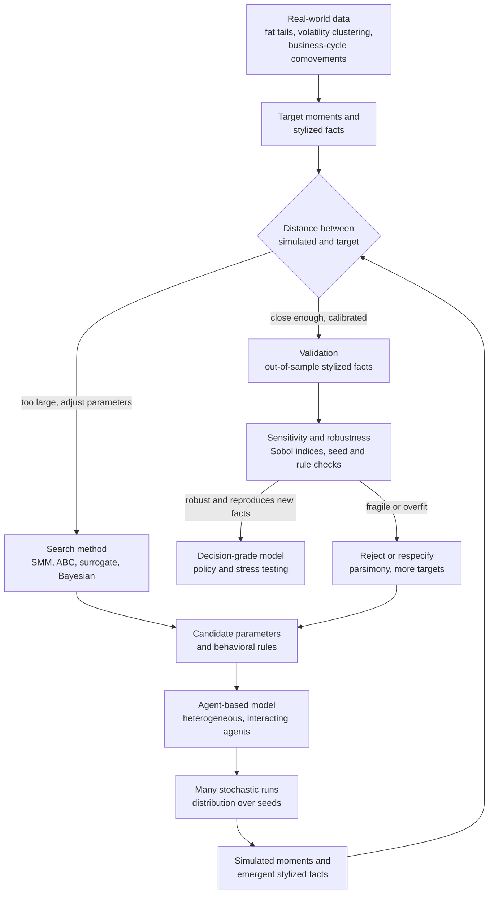

# 🎯 Calibration and Validation of Agent-Based Models

> [!abstract] TL;DR
> **Calibration** and **validation** are the disciplines that make agent-based models — and complexity economics as a whole — *empirically credible* rather than merely suggestive. Because an ABM is so **flexible** (many agents, rules, and free parameters) that it can seemingly "grow" almost any outcome, it faces a central charge of **overfitting and unfalsifiability**. The answer has two parts. **Calibration** *fits* the model — choosing parameters so its output matches observed data, usually by the **simulated method of moments** and, because ABM likelihoods are intractable, by **likelihood-free** methods such as **Approximate Bayesian Computation** and **machine-learning surrogate models**. **Validation** *tests* the model — checking that it reproduces real, ideally **out-of-sample**, **stylized facts** (fat tails, volatility clustering, business-cycle comovements) and survives rigorous **sensitivity and robustness** analysis. Matching *many independent emergent regularities from a few micro-rules* is strong evidence, and this unglamorous methodology is precisely what elevates ABMs from illustrative toys into **decision-grade instruments** now used by central banks, financial regulators, and public-health agencies.

---

## Intuition

**Analogy — the flight simulator you built yourself.** An agent-based model is a bit like a flight simulator you coded from scratch: enormously flexible, able to reproduce almost any scenario you want — which is exactly the problem. If your simulated economy can be tuned to show a **boom**, or a **bust**, or **steady growth**, just by fiddling a few knobs, how do you know it captures the *real* economy rather than just your own assumptions? A simulator that can fly like anything tells you nothing about how *this* aircraft actually flies until you have matched it against real flight data — and then checked it against manoeuvres you did *not* use to tune it. This is the central credibility challenge of complexity economics: with great flexibility comes the burden of proof.

**Calibration and validation are the disciplines that turn a suggestive simulation into a trustworthy scientific instrument.** *Calibration* is the tuning: set the knobs so the simulator's outputs line up with measured reality. *Validation* is the acceptance test: fly the tuned simulator through situations it was never tuned on and see whether it still behaves like the real thing. A model you can only ever fit, but never independently test, is a toy; a model that survives out-of-sample testing is an instrument. Everything in this note is machinery for crossing that line — the frontier of making complexity economics rigorous.

---

## How It Works

### Core Mechanics

**1. The credibility problem, stated plainly.** The founding move of the field — treating the economy as a [[Economies_as_Complex_Adaptive_Systems|complex adaptive system]] grown from the bottom up in an ABM (the sibling *Agent_Based_Modeling_in_Economics*) — buys realism at a price. A model with heterogeneous agents, behavioral rules, interaction networks, and a dozen free parameters is a *very expressive function*. Expressiveness cuts both ways: it is the source of the model's realism **and** its greatest weakness, because with enough knobs you can seemingly reproduce any target series. Joshua Epstein's slogan "if you didn't grow it, you didn't explain it" sets the bar, but growing *something that looks right once* is not the same as capturing the mechanism. Calibration and validation are the answer to the sceptic's fair question: *did your model discover reality, or just memorize it?*

**2. Calibration versus validation — fitting versus testing.** These are two different jobs and both are needed.
- **Calibration** = choosing the model's **parameters** (and sometimes its rules) so that its output **matches observed data**. This is *fitting the model to reality* — turning the knobs until the simulator agrees with what we measured.
- **Validation** = checking whether the *already-calibrated* model **correctly reproduces real-world patterns**, especially ones **not used in the fitting** — out-of-sample data, additional stylized facts, or genuine predictions. This asks the harder question: *does the model actually work?*

A one-line mnemonic: **calibration fits, validation tests.** A model that fits beautifully but fails every out-of-sample check has been *overfit*; a model that was never fit to data at all cannot claim quantitative relevance. Credibility requires passing both.

**3. Why this is genuinely hard for ABMs.** Standard econometric estimation assumes a tractable likelihood. ABMs violate almost every convenient assumption:
1. **Many parameters and rules.** The model lives in a high-dimensional, flexible space — the direct source of the overfitting and arbitrariness worry.
2. **Stochasticity.** ABMs are random: every run differs, so a single simulation means nothing. Every quantity must be a **distribution over many seeds**, not a point.
3. **Intractable likelihood.** There is usually no closed-form probability of the data given the parameters, so classical maximum-likelihood and textbook Bayesian estimation cannot be applied directly. Estimation must be **likelihood-free**.
4. **Computational cost.** Every single evaluation of the objective is a *full simulation* (often many, for the seed average) — expensive, which rules out brute-force search over rich parameter spaces.
5. **Emergence.** Outputs are **emergent, nonlinear** functions of the parameters, so the input-output map is hard to invert or even to reason about.
6. **Identification.** Different parameter settings can produce the *same* output — the model may be **non-identifiable**, so a good fit does not pin down a unique parameter set.

Together these make ABM estimation one of the hard problems of computational social science.

**4. Matching stylized facts — the qualitative first bar.** The classic validation approach asks whether the model reproduces the robust empirical regularities — the **stylized facts** — of its target system, *without those facts being hard-coded in*. For financial markets the canonical set (the sibling *Fat_Tails_and_Financial_Market_Statistics*) is **fat tails** in returns, **volatility clustering**, near-zero autocorrelation of raw returns, and the **leverage effect**; for macroeconomics, **business-cycle comovements** ([[Business_Cycle_Indicators]]) and the shape of recessions; for firms, the right-skewed **size distribution**. A model passes this bar if those patterns *emerge* from its micro-rules — as they do in the Santa Fe Artificial Stock Market (the sibling *The_Santa_Fe_Artificial_Stock_Market*) and in Sugarscape's wealth distribution (the sibling *The_Sugarscape_Model*). Qualitative pattern-matching is necessary but not sufficient: many mechanisms can produce a fat tail.

**5. Simulated method of moments — the quantitative workhorse.** To go beyond "looks right," choose parameters that **minimize the distance** between **moments** computed from the *simulated* data and the *real* data. The moments can be means, variances, autocorrelations, higher moments such as kurtosis, or any summary statistic. This is the **simulated method of moments (SMM)** / **indirect inference** family, and it is the standard for calibrating ABMs to quantitative targets — matching *summary statistics* precisely because you cannot match *likelihoods*. It is the direct computational cousin of how DSGE macro models are calibrated and estimated (the parallel note [[Non_Equilibrium_and_Out_of_Equilibrium_Dynamics]] explains why the ABM version cannot fall back on a closed-form equilibrium).

**6. Likelihood-free and Bayesian methods — the modern toolkit.** Because the likelihood is intractable, the frontier uses **simulation-based inference**:
- **Approximate Bayesian Computation (ABC):** accept a sampled parameter vector when its simulated summary statistics fall *close* to the observed ones; the accepted samples approximate the posterior, no likelihood required. Built on the same [[Bayesian_Statistics|Bayesian]] machinery, but "likelihood-free."
- **Surrogate / emulator models:** fit a *fast* statistical model — a Gaussian process, a random forest, or a neural network — to the ABM's expensive input-output map, then calibrate or optimize the cheap surrogate instead of the simulator. This is **machine learning meeting complexity economics** (the sibling *Complexity_Economics_and_Machine_Learning*), and it shares its toolbox with Bayesian optimization and [[Hyperparameter_Tuning|hyperparameter search]].
- **Synthetic likelihood** and other simulation-based inference: approximate the likelihood of the summary statistics with a tractable form estimated from simulations.

These are the state of the art for *estimating* — not merely illustrating — an agent-based model.

**7. Sensitivity analysis and robustness — the diagnostics that build trust.** A fit is worthless if it is a knife-edge artifact. Two checks are essential:
- **Sensitivity analysis:** how do outputs depend on parameters and rules? **Global** methods such as **Sobol indices** and Latin-hypercube sampling reveal *which assumptions actually matter* and which are irrelevant.
- **Robustness checks:** do the results survive across parameter ranges, across random seeds, and across reasonable variations of the behavioral rules — or are they fragile coincidences? The goal is to separate **robust emergent results** from **knife-edge artifacts**, because only robust findings deserve trust.

**8. The overfitting critique, and the honest answer.** The chief criticism of ABMs — and of complexity economics generally — is that their flexibility makes them prone to **overfitting** and even **unfalsifiable**: with enough free parameters you can curve-fit any data, which is description dressed up as explanation. This objection deserves to be taken seriously, and the discipline's answer is a bundle of practices: **parsimony** (the KISS principle — the simplest model that could show the effect), **out-of-sample validation** and [[Cross_Validation|cross-validation]], matching **multiple independent stylized facts** at once (much harder to fake than one), **pre-registration** of predictions and standardized protocols, and the deeper argument that *reproducing many emergent facts from a few micro-rules is itself strong evidence* of a real mechanism. The same worry haunts quantitative trading, where it is fought with [[Overfitting_in_Finance|the same weapons]].

**9. Documentation and reproducibility — making ABMs scientific.** Because an ABM *is* code, prose descriptions of it are ambiguous, feeding the "black box" complaint. The **ODD protocol** (Overview, Design concepts, Details; Grimm et al.) standardizes model description; open-source code and fixed seeds make runs reproducible; **docking** re-implements a model in a second framework to check that a finding is a property of the *theory*, not the *implementation*. This professionalization of methodology is what makes an ABM auditable.

### Flow / Architecture



---

## Key Concepts

### Secondary
- **A flexible model can fake almost anything.** With enough knobs a simulation can be tuned to show a boom or a bust, so a single good-looking run proves nothing on its own.
- **Fit, then test.** *Calibration* turns the knobs so the model matches real data; *validation* checks the tuned model on data it was **never** shown. Both are needed.
- **Stylized facts.** Robust patterns that always show up in real data — like the fact that stock returns have occasional huge jumps (fat tails) and that calm and stormy periods cluster together. A good model should *produce* these by itself.
- **The honest worry.** If you can fit anything, have you explained anything? The way out is to reproduce *many* independent patterns from *few* simple rules, and to succeed on data you did not use to tune the model.

### Undergraduate
- **Calibration vs validation.** Calibration = choose parameters to match observed data (fitting); validation = check the calibrated model reproduces patterns, ideally **out-of-sample** (testing). Calibration fits, validation tests.
- **Why ABMs are hard to estimate.** Many parameters, stochastic output (use distributions over seeds), an **intractable likelihood** (no closed form), high computational cost, emergent nonlinear input-output maps, and possible **non-identifiability**.
- **Matching stylized facts.** Validate a financial ABM if it emergently generates fat tails, volatility clustering, and vanishing return autocorrelation; validate a macro ABM against business-cycle comovements ([[Business_Cycle_Indicators]]).
- **Simulated method of moments.** Pick parameters that minimize the distance between simulated and empirical moments — the workhorse quantitative calibration when likelihoods are unavailable; the sibling of DSGE calibration.
- **Sensitivity and robustness.** Global sensitivity analysis (Sobol indices) shows which parameters matter; robustness checks (seeds, ranges, rule variants) separate real results from artifacts.
- **The overfitting defense.** Parsimony (KISS), out-of-sample [[Cross_Validation|cross-validation]], and matching *multiple independent* stylized facts are how you answer the "you can grow anything" critique.

### Graduate
- **Likelihood-free inference.** Because the likelihood is intractable, use **Approximate Bayesian Computation** (accept parameters whose simulated summaries are close to observed), **synthetic likelihood**, or general **simulation-based inference**; all rest on [[Bayesian_Statistics|Bayesian]] posteriors approximated through simulation rather than closed forms.
- **Surrogate-assisted calibration.** Fit a Gaussian process, random forest, or neural emulator to the costly ABM input-output map, then optimize the surrogate — the [[Hyperparameter_Tuning|Bayesian-optimization]] paradigm imported into economics (Lamperti-Roventini-Sani; the sibling *Complexity_Economics_and_Machine_Learning*).
- **Identification and the bias-variance tension.** Non-identification means distinct parameter sets yield the same summary statistics; a flat or ridged objective has no unique minimizer. Choosing *informative, independent* moments is the identification problem, and richer moment sets trade [[Cross_Validation|variance for bias]] exactly as in supervised learning.
- **Efficient SMM and weighting.** The choice of moments and of the (optimal) weighting matrix governs efficiency; over-identification (more moments than parameters) supplies a specification test — a model that cannot match *all* the moments jointly is misspecified, not merely mis-tuned.
- **Pattern-oriented and multi-scale validation.** Grimm's pattern-oriented modeling constrains the many degrees of freedom by demanding the model reproduce *several observed patterns at different scales at once*, sharply reducing the space of admissible mechanisms.
- **Ergodicity and non-stationarity.** ABMs of reflexive economies may be **non-ergodic** and path-dependent, so time-averages and ensemble-averages diverge and a fixed data-generating distribution may not exist — a deep obstacle to standard estimation, tied to the out-of-equilibrium worldview of [[Non_Equilibrium_and_Out_of_Equilibrium_Dynamics]].

---

## Python Demo

We calibrate a genuinely emergent, stochastic ABM by **matching a stylized fact via the simulated method of moments**, then expose the **identification / overfitting** problem. The model is the **kinetic wealth-exchange ABM** (Chakraborti-Chakrabarti): `N` agents start with equal money; each round they are randomly paired, each *keeps a fraction `lambda` of its money* (the **saving propensity**), and the pooled remainder is split at random. The wealth distribution — and its **Gini coefficient**, a robust empirical stylized fact of income data — *emerges* from these micro-rules.

**(a) Calibration.** We sweep the free parameter `lambda`, compute the emergent Gini (averaged over seeds, because the model is stochastic), and pick the `lambda*` whose Gini best matches a target `G* = 0.30` — the simulated method of moments with a single moment. The curve is monotone, so one moment identifies `lambda` cleanly. **(b) The identification problem.** We then add a second knob — a flat **redistribution rate `tau`** that nudges wealth toward the mean each round. Now *many* `(lambda, tau)` pairs reproduce the **same** target Gini: the objective has a flat **ridge**, not a unique minimizer — the model is **non-identified by one moment**, the mathematical face of "you can grow the same number many ways." Uses only `numpy` and `matplotlib`.

```python
# Calibrating an ABM by MATCHING A STYLIZED FACT (a target Gini) via the
# simulated method of moments -- and then seeing the IDENTIFICATION problem:
# with two knobs a whole RIDGE of parameters reproduces the same single moment.
import numpy as np
import matplotlib.pyplot as plt

def run_wealth_abm(lam, tau=0.0, N=400, rounds=400, seed=0):
    """Kinetic wealth-exchange ABM (Chakraborti-Chakrabarti saving model).
    Agents start equal; each round they are randomly paired, each KEEPS a
    fraction 'lam' of its money, and the pooled remainder is split at random.
    Optional flat redistribution 'tau' nudges everyone toward the mean each
    round. The wealth distribution -- and its Gini -- EMERGES from the rules."""
    rng = np.random.default_rng(seed)
    w = np.ones(N)
    m = N // 2
    for _ in range(rounds):
        p = rng.permutation(N)
        a, b = p[:m], p[m:2 * m]              # a random perfect matching
        pool = (1.0 - lam) * (w[a] + w[b])    # the money actually put at stake
        f = rng.random(m)                     # random split of each pool
        w[a] = lam * w[a] + f * pool
        w[b] = lam * w[b] + (1.0 - f) * pool  # money is conserved every trade
        if tau > 0.0:                         # flat redistribution toward mean
            w = (1.0 - tau) * w + tau * w.mean()
    return w

def gini(w):
    """Gini coefficient of a wealth vector (sorted formula)."""
    x = np.sort(w); n = x.size; i = np.arange(1, n + 1)
    return (2.0 * np.sum(i * x)) / (n * np.sum(x)) - (n + 1.0) / n

def top_share(w, q=0.10):
    """Fraction of total wealth held by the richest q of agents."""
    x = np.sort(w); k = int(round((1.0 - q) * x.size))
    return x[k:].sum() / x.sum()

G_TARGET = 0.30                                # a stylized fact from "real" data

# --- (a) CALIBRATION: sweep lambda, match the single Gini moment (SMM) --------
lam_grid = np.linspace(0.0, 0.9, 19)
gini_curve = np.array([np.mean([gini(run_wealth_abm(l, seed=s))
                                for s in (0, 1, 2)]) for l in lam_grid])
lam_star = lam_grid[np.argmin((gini_curve - G_TARGET) ** 2)]

# --- (b) IDENTIFICATION: add redistribution tau -> a whole RIDGE matches ------
lam_ax = np.linspace(0.0, 0.8, 17)
tau_ax = np.linspace(0.0, 0.5, 17)
LL, TT = np.meshgrid(lam_ax, tau_ax)
G_grid = np.array([[gini(run_wealth_abm(LL[r, c], TT[r, c], seed=0))
                    for c in range(LL.shape[1])] for r in range(LL.shape[0])])

# find one on-ridge tau for lambda = 0, to compare against the tau = 0 fit
tau_scan = np.linspace(0.0, 0.6, 31)
tau_star = tau_scan[np.argmin([(gini(run_wealth_abm(0.0, tau=t, seed=0))
                                - G_TARGET) ** 2 for t in tau_scan])]

# --- plots -------------------------------------------------------------------
fig, ax = plt.subplots(1, 2, figsize=(15, 5.5))

ax[0].plot(lam_grid, gini_curve, "o-", color="navy", label="emergent Gini")
ax[0].axhline(G_TARGET, color="crimson", ls="--", lw=2, label="target stylized fact")
ax[0].axvline(lam_star, color="green", ls=":", lw=2, label="calibrated lambda*")
ax[0].set_title("(a) Calibration: tune lambda to match one moment")
ax[0].set_xlabel("saving propensity  lambda"); ax[0].set_ylabel("emergent Gini")
ax[0].legend(fontsize=9); ax[0].grid(True, alpha=0.3)

cf = ax[1].contourf(LL, TT, G_grid, levels=14, cmap="viridis")
ax[1].contour(LL, TT, G_grid, levels=[G_TARGET], colors="red", linewidths=3)
fig.colorbar(cf, ax=ax[1], label="emergent Gini")
ax[1].set_title("(b) Non-identification: one moment, a whole ridge")
ax[1].set_xlabel("saving propensity  lambda"); ax[1].set_ylabel("redistribution  tau")
ax[1].text(0.10, 0.42, "every point on the red curve\nmatches the target Gini",
           color="white", fontsize=9)

plt.tight_layout(); plt.show()

# two DIFFERENT mechanisms that fit the SAME single moment equally well
wA = run_wealth_abm(lam_star, tau=0.0,      seed=0)   # equality via saving
wB = run_wealth_abm(0.0,      tau=tau_star, seed=0)   # equality via redistribution
print("calibrated (one moment, tau=0): lambda* = {:.3f}".format(lam_star))
print("A  saving        lambda={:.2f} tau=0.00 -> Gini={:.3f}, top-10% share={:.3f}"
      .format(lam_star, gini(wA), top_share(wA)))
print("B  redistribution lambda=0.00 tau={:.2f} -> Gini={:.3f}, top-10% share={:.3f}"
      .format(tau_star, gini(wB), top_share(wB)))
print("Same target Gini, different mechanisms and different tails: one stylized "
      "fact cannot identify the model -- you need MORE, INDEPENDENT moments.")
```

Running it, panel **(a)** shows the emergent Gini falling smoothly as saving `lambda` rises (from `0.5` at `lambda = 0`, pure random exchange, toward `0` as agents hoard), crossing the target line at a single, well-identified `lambda*` — clean single-moment calibration. Panel **(b)** tells the cautionary tale: once a second knob `tau` is added, the red **target-Gini contour is a whole curve across the plane**, so an entire *ridge* of `(lambda, tau)` pairs fits the one moment equally well — the objective is flat along that ridge and the parameters are **non-identified**. The printout drives it home: an economy made equal by private **saving** and one made equal by **redistribution** post the *same* Gini yet differ in their top-10% share and tail shape. The lesson is the whole point of the note — *matching one stylized fact is never enough; credibility comes from matching many independent facts, out-of-sample, plus sensitivity analysis to prove the fit is not a knife-edge artifact.*

---

## Real-World Applications

> **Example — central banks stress-testing the financial system.** The Bank of England and the ECB run agent-based and heterogeneous-agent models for **macroprudential policy**: housing-market ABMs with mortgaged households, buy-to-let investors, and banks, calibrated to loan-to-income distributions and transaction volumes, then *validated* against the observed house-price cycle and used to test policies (loan-to-value caps) on scenarios outside the calibration window. Because these models inform real regulation, they are held to exactly the calibration-and-validation standard above — a suggestive academic ABM would never be allowed near a policy lever.

- **Financial-market ABMs.** Models in the Santa Fe / Lux-Marchesi lineage are validated by their emergent reproduction of **fat tails and volatility clustering** — the very facts that [[GARCH_Models|GARCH]] models describe statistically but do not *explain* from behavior. Matching those facts *and* the leverage effect *and* trading-volume statistics is the multi-moment bar.
- **Epidemic ABMs for public health.** Individual-based COVID-19 models (Imperial College, network-SEIR) were calibrated to case, hospitalization, and serology data and validated against later waves before informing lockdown and vaccination policy — a textbook case of out-of-sample validation raising the stakes from academic to life-and-death.
- **Macroeconomic ABMs.** Large models such as the "Schumpeter meeting Keynes" (K+S) family and JAMEL are validated against a battery of macro stylized facts — output-investment comovement, the fat-tailed distribution of GDP growth, Okun and Phillips relations ([[Business_Cycle_Indicators]]) — the ambition of the sibling *Agent_Based_Macroeconomics*.
- **Systemic-risk and contagion models.** Interbank-network ABMs used by regulators are validated on their ability to reproduce observed default cascades and fire-sale dynamics ([[Cascades_and_Systemic_Risk]]) rather than any single number.
- **Machine-learning surrogates in practice.** Because each policy scenario is an expensive simulation, agencies increasingly fit Gaussian-process or neural surrogates to the ABM and calibrate the emulator — the industrial version of the *Complexity_Economics_and_Machine_Learning* frontier.

---

## Common Pitfalls

- **Confusing calibration with validation.** Reporting a great in-sample fit and stopping there. A model that was *tuned* to a pattern has not been *tested*; without out-of-sample checks the fit is unfalsified, and possibly overfit.
- **Matching a single moment.** Tuning one statistic (a mean, a volatility, a Gini) and declaring victory. As the demo shows, one moment can be non-identifying and is trivially game-able; robust validation needs **multiple independent** stylized facts.
- **Ignoring stochasticity.** Judging the model on one simulation run. ABM outputs are random; every quantity must be a **distribution over many seeds**, and calibration must target the distribution, not a lucky draw.
- **Skipping sensitivity analysis.** A headline result can secretly hinge on an obscure parameter, the update order, or a boundary condition. Without global sensitivity analysis (Sobol indices) you cannot tell a robust emergent finding from a **knife-edge artifact**.
- **Parameter explosion and overfitting.** Adding rules and knobs until the model fits makes a good fit *weak* evidence. Prefer the simplest model that could show the effect (KISS), and remember that flexibility is a liability to be disciplined, not a virtue.
- **Treating the ABM likelihood as if it existed.** Reaching for maximum-likelihood or off-the-shelf Bayesian estimation. ABM likelihoods are intractable; you must go **likelihood-free** (SMM, ABC, synthetic likelihood, surrogates).
- **Non-reproducible black boxes.** Publishing conclusions without code, seeds, or an ODD-style description. An unauditable ABM invites — and deserves — the "you can grow anything" dismissal.
- **Assuming ergodicity.** Applying long-run time-averages to a path-dependent, non-ergodic model whose ensemble and time behavior diverge. In reflexive, out-of-equilibrium economies a fixed data-generating distribution may not even exist.

---

## Related Concepts

- [[Agent_Based_Modeling]] — the bottom-up simulation method whose empirical credibility this note is entirely about; calibration and validation are its acceptance tests.
- [[Economies_as_Complex_Adaptive_Systems]] — the worldview that *forces* the use of ABMs, and thus creates the calibration problem, since a CAS has no closed-form equilibrium to solve.
- [[Non_Equilibrium_and_Out_of_Equilibrium_Dynamics]] — explains why ABM likelihoods are intractable and why ergodicity can fail, the deep obstacles to estimation.
- [[Economic_and_Social_Complexity]] — the power-law and inequality stylized facts (Pareto wealth, Zipf sizes) that ABMs are asked to reproduce and be validated against.
- [[Cascades_and_Systemic_Risk]] — the systemic-risk ABMs that regulators must calibrate and validate before trusting for stress tests.
- [[Bayesian_Statistics]] — the foundation of Approximate Bayesian Computation and synthetic-likelihood, the likelihood-free inference used to estimate ABMs.
- [[Statistical_Inference]] — moments, estimators, and identification, the classical machinery the simulated method of moments generalizes.
- [[Cross_Validation]] — the out-of-sample discipline imported from ML to defend ABMs against overfitting.
- [[Overfitting_in_Finance]] — the same "you can fit anything" hazard and its defenses, in a quantitative-trading context.
- [[GARCH_Models]] — the econometric benchmark that *describes* volatility clustering, a key stylized fact an ABM must *emergently generate* to be validated.
- [[Business_Cycle_Indicators]] — the macro comovements that agent-based macro models are validated against.
- [[Bias_Variance_Tradeoff]] — the flexibility-versus-generalization tension that underlies the overfitting critique.
- [[Hyperparameter_Tuning]] — surrogate-model and Bayesian-optimization calibration is the same search problem under a different name.
- [[Monte_Carlo_Integration]] — the stochastic-sampling backbone of every seed-averaged ABM estimate.
- [[Modeling_and_Simulation_of_Complex_Systems]] — the broader simulation methodology, of which ABM calibration is the empirical wing.

---

## Review Questions

1. **(Conceptual — Secondary/Undergraduate)** Distinguish **calibration** from **validation** in one sentence each, and explain why a model that fits its calibration data perfectly can still be worthless. What single practice most directly separates a genuine explanation from an overfit curve?
2. **(Scenario — Undergraduate/Graduate)** You have a financial-market ABM with five free parameters. You tune it so the simulated returns' *volatility* exactly matches the S&P 500's, and it looks great. Your reviewer is unmoved. Using the ideas of stylized facts, the simulated method of moments, identification, and out-of-sample testing, lay out the *additional* evidence you would produce to make the model credible — and explain why matching several moments is much harder to fake than matching one.
3. **(Trade-off / critique — Graduate)** A colleague argues that because ABMs are so flexible they are "unfalsifiable in principle" and therefore unscientific. Steelman the objection, then rebut it: explain how likelihood-free estimation (SMM, ABC, surrogates), pattern-oriented multi-scale validation, sensitivity analysis, and the "many emergent facts from few micro-rules" argument together answer the charge — and identify one situation (for example, a non-ergodic, reflexive economy) where the objection retains real force.

---

## Sources

- Fagiolo, G., Moneta, A., & Windrum, P. (2007). "A Critical Guide to Empirical Validation of Agent-Based Models in Economics: Methodologies, Procedures, and Open Problems." *Computational Economics, 30*(3), 195–226. — the standard survey of the whole problem.
- Grimm, V., et al. (2005). "Pattern-Oriented Modeling of Agent-Based Complex Systems: Lessons from Ecology." *Science, 310*(5750), 987–991. — validating against multiple patterns at once to constrain flexibility.
- Grazzini, J., Richiardi, M. G., & Tsionas, M. (2017). "Bayesian estimation of agent-based models." *Journal of Economic Dynamics and Control, 77*, 26–47. — likelihood-free and Bayesian estimation of ABMs.
- Lamperti, F., Roventini, A., & Sani, A. (2018). "Agent-based model calibration using machine learning surrogates." *Journal of Economic Dynamics and Control, 90*, 366–389. — surrogate/emulator calibration.
- Platt, D. (2020). "A comparison of economic agent-based model calibration methods." *Journal of Economic Dynamics and Control, 113*, 103859. — SMM, ABC, and surrogate methods benchmarked.
- Chakraborti, A., & Chakrabarti, B. K. (2000). "Statistical mechanics of money: how saving propensity affects its distribution." *European Physical Journal B, 17*, 167–170. — the wealth-exchange ABM used in the demo.

---

#complexity-economics #agent-based-modeling #calibration #validation #stylized-facts
