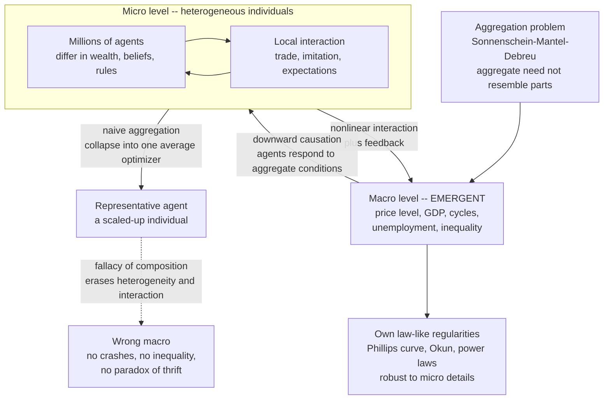

# 🌊 Emergence of Macro from Micro

> [!abstract] TL;DR
> The deepest question in economics is the **micro–macro problem**: how do **macro** phenomena — GDP, the price level, inflation, unemployment, business cycles, inequality, growth — arise from the **micro** behavior and interactions of millions of individual agents? Complexity economics' core claim is that macro **emerges** from micro-interaction in ways that **cannot be recovered by simply aggregating or averaging** individuals. A single person has no "price level," just as a single molecule has no "wetness." This exposes the fallacy of the **representative agent** — modelling the whole economy as one scaled-up optimizer — which erases the very heterogeneity and interaction that generate emergent macro, and commits the **fallacy of composition** (e.g. the **paradox of thrift**, where individually-prudent saving makes everyone poorer). The **Sonnenschein–Mantel–Debreu** theorem proves the technical version: aggregate behavior need not resemble individual behavior at all. Yet emergent macro variables can obey their own **robust, micro-detail-independent regularities** (a statistical-mechanics-like universality) while *also* reaching back down to shape micro-behavior (**downward causation**). So complexity economics **grows** the macro from interacting micro-agents and studies emergent macro statistics directly — a genuine micro-to-macro science rather than a representative-agent shortcut.

---

## Intuition

**Analogy — a single water molecule is not "wet."** Take one H₂O molecule and study it as hard as you like: measure its bond angle, its dipole, its vibration. You will never find "wetness," and you will never find "liquid," because *those properties do not exist at the scale of one molecule*. Wetness, liquidity, surface tension, viscosity — these are properties that only appear when **trillions** of molecules interact. They are real, measurable, and lawful, but they belong to the **collective**, not to the part. You cannot derive them by staring at one molecule harder; you have to let many molecules interact and watch what appears.

Now transpose this to economics. "The price level," "the business cycle," "the unemployment rate," "GDP," "inflation" — none of these is a property of any individual. No single person *has* an unemployment rate or a business cycle. They **emerge** from the interactions of millions of people, and — this is the startling part — they can have **their own laws**, regularities you will never derive by staring harder at one rational agent. The relationship between the **micro** (individuals, firms) and the **macro** (the economy) — how one gives rise to the other — is the deepest and hardest question in economics, and the one on which complexity economics and mainstream theory most sharply disagree. The mainstream tries to skip the crowd and model "the average molecule"; complexity economics insists you must simulate the whole ocean. This note is the conceptual heart of the field, built on *Economies_as_Complex_Adaptive_Systems* and the critique in *The_Limits_of_Neoclassical_Equilibrium*.

---

## How It Works

### Emergence, defined

**Emergence** is the arising of novel, higher-level **properties, patterns, and regularities** from the interactions of lower-level components — properties that the components do **not** individually possess and that are not obvious from studying them in isolation. Wetness from molecules, life from chemistry, mind from neurons, the economy from individuals: at each jump in scale a **new vocabulary** becomes the natural and predictive one. Philip Anderson's slogan — **"more is different"** — is the whole idea in three words: quantity, past a threshold, becomes a difference in *kind*. Economists inherit the concept from [[Emergence_and_Self_Organization|systems thinking]], where it is the defining feature of a [[Complex_Adaptive_Systems|complex adaptive system]].

Philosophers split emergence into two grades, and the distinction matters for method:

- **Weak emergence** — the macro pattern is genuinely novel and cannot be *shortcut* analytically, but it is fully **derivable by simulating the micro-interactions**. This is the sense that agent-based modelling operationalizes: you cannot write down a closed-form equation for the outcome, but you can *grow* it and watch it appear. Almost all emergent economic phenomena are weakly emergent.
- **Strong emergence** — the macro property is claimed to be **irreducible in principle**, possessing causal powers not fixed by the micro-facts. This is philosophically radical and contested; the economy does not require it. Weak emergence is already enough to break the representative-agent program.

### The micro–macro problem

The central and deepest question: **how do macro-economic phenomena arise from the micro-behavior and interactions of individual agents?** It is the economic instance of the general **problem of levels** — how the parts relate to the whole. Mainstream economics has an answer it treats as almost automatic: *aggregate the individuals* (usually by positing one representative individual) and read the macro off as a scaled-up micro. Complexity economics' answer is a flat contradiction: **macro emerges from micro-interaction in ways that cannot be captured by aggregating or averaging** — because the interaction, the heterogeneity, and the feedback are exactly what generate the emergent macro, and those are precisely what aggregation throws away. The whole is **not** a big version of the part.

### Why naive aggregation fails — the representative agent

Modern macroeconomics routinely models the entire economy as a single **representative agent**: one "average" optimizing household and one representative firm, whose choices *are* the aggregate. This is analytically seductive — it collapses millions of coupled decisions into one tractable optimization — but it smuggles in a fatal assumption: **that the macro is just a scaled-up individual.** It therefore commits the classic **fallacy of composition** — inferring that what is true of the parts must be true of the whole. Alan Kirman's famous question, *"Whom or what does the representative individual represent?"*, delivers the verdict: a representative agent can prefer outcome A to B even when *every actual individual* prefers B to A. The device does not represent a real heterogeneous economy; it **defines heterogeneity and interaction out of existence** — and with them, every emergent phenomenon that depends on them. This critique is developed at length in *The_Limits_of_Neoclassical_Equilibrium* and its companion on heterogeneity, *Bounded_Rationality_and_Heterogeneous_Agents*.

### The aggregation problem — the technical heart

Even setting rhetoric aside, there is a hard theorem. When you actually try to sum up heterogeneous, individually-rational agents, you do **not** in general get a well-behaved "aggregate agent." The **Sonnenschein–Mantel–Debreu (SMD) theorem** (1972–74) proves that the **aggregate excess-demand function** of an economy of perfectly rational consumers can take **essentially any shape** consistent with Walras's law and homogeneity. Individual rationality imposes **almost no restrictions** on aggregate behavior. The corollary is devastating for the shortcut: *aggregate relationships need not resemble individual ones at all*, aggregate equilibrium need not be unique or stable, and there is no valid derivation of a representative agent from micro-theory. You **cannot cleanly "sum up" the micro to get the macro** — the aggregate has its own emergent structure. (See the SMD treatment and cobweb demo in *The_Limits_of_Neoclassical_Equilibrium*.)

### The fallacy of composition and its paradoxes

The failure is not merely technical — it produces concrete, often perverse, emergent macro effects where **"what is true for one is false for all":**

- **The paradox of thrift (Keynes).** If one household saves more, it prudently grows richer. If **everyone** saves more at once, aggregate demand falls, output and incomes contract, and the population can end up **poorer** — with realized aggregate saving no higher than before. The whole behaves *opposite* to the part.
- **Bank runs.** Withdrawing your deposit when you fear a collapse is individually rational; if everyone does it, the collective act **causes** the collapse that each was trying to escape — a self-fulfilling emergent outcome.
- **Coordination failures** and the fallacy of composition generally: standing up at a stadium to see better works for one and fails for all; competitive austerity, deleveraging spirals, and "sell before the others sell" cascades are the same structure. Individually-sensible behavior produces a collectively-bad or **qualitatively different** macro outcome that has its own logic.

### Emergent macro with its own dynamics

Here is the striking positive claim. Emergent macro variables can possess **stable, law-like regularities of their own** — the **Phillips curve** (inflation–unemployment), **Okun's law** (output–unemployment), business-cycle regularities, and **power-law** wealth and firm-size distributions. These are properties of the **system**, not of any individual, and — crucially — they are often **robust to the micro-details**: many different micro-configurations of agents produce the *same* macro pattern. This is exactly the **universality** that [[Criticality_and_Phase_Transitions|statistical mechanics]] discovered — a gas obeys the ideal-gas law regardless of which particular molecules compose it, and a magnet's critical exponents ignore the microscopic lattice. The emergent macro is a **level with its own science**, which is why studying macro statistics *directly* (distributions, scaling laws) is legitimate rather than a failure of "microfoundations."

### Downward causation — the loop, not the ladder

Emergence is **not only bottom-up**. Once the macro level exists, it **constrains and shapes** the micro. Prices, institutions, norms, the business cycle, the inflation regime — these emergent aggregates *feed back down* and change what individuals do: agents respond to aggregate conditions **they themselves collectively create**. This two-way coupling is **downward causation**, and its economic face is **reflexivity** — forecasts and beliefs about the aggregate alter the aggregate being forecast. The micro and macro therefore **co-evolve**; the correct picture is a **micro↔macro loop**, not a one-way aggregation ladder. Any model that only sums upward, and never lets the emergent whole reach back down, is missing half the machinery.

### How complexity economics handles it

Instead of assuming a representative agent, the complexity approach **grows the macro from heterogeneous, interacting micro-agents** — the method of **agent-based computational economics** (developed in the sibling notes *Agent_Based_Modeling_in_Economics*, *The_Sugarscape_Model*, and *Schelling_Segregation_and_Emergent_Patterns*) — and simply **observes** the emergent aggregate. It then studies the **emergent macro statistics** — distributions, power laws, fluctuation patterns (the econophysics / statistical-mechanics analogy, treated in *Power_Laws_and_Heavy_Tails_in_Economics* and [[Economic_and_Social_Complexity]]) — as first-class objects. The payoff, developed in *Agent_Based_Macroeconomics*, is a genuine **micro-to-macro science** that embraces emergence and universality rather than a representative-agent shortcut that assumes the answer.

### Flow / Architecture



---

## Key Concepts

### Secondary
- **The whole is not a big version of the part.** One water molecule is not "wet"; wetness only exists for trillions together. In the same way, no single person has a "price level" or an "unemployment rate" — those belong to the whole economy.
- **What is good for one can be bad for all.** If *you* save more, you get richer. If *everyone* saves more at the same time, spending dries up, businesses shrink, and everyone can end up poorer — the **paradox of thrift**.
- **You cannot understand a crowd by studying one average person.** Modelling the economy as a single "typical" household throws away the differences between people, and it is exactly those differences and interactions that make the interesting things happen.
- **The economy has its own weather.** Booms, busts, and inflation are patterns of the *whole system*, with their own rhythms — not something you can see inside any one shopper or firm.

### Undergraduate
- **The micro–macro problem.** How macro variables (GDP, inflation, unemployment, cycles, inequality) arise from micro-behavior. Complexity economics: they **emerge** from interaction and cannot be recovered by aggregating/averaging.
- **Emergence (weak vs strong).** Novel higher-level properties from lower-level interaction; **weak** = derivable only by simulating the interactions (the ABM sense); **strong** = irreducible in principle (contested, and unnecessary here).
- **The representative-agent fallacy.** Modelling the economy as one average optimizer assumes the macro is a scaled-up micro, committing the **fallacy of composition** and erasing the heterogeneity/interaction that generate emergent macro (Kirman).
- **The aggregation problem.** Summing heterogeneous rational agents need not yield a well-behaved aggregate agent; aggregate relationships need not resemble individual ones (Sonnenschein–Mantel–Debreu).
- **Emergent macro regularities.** The [[Aggregate_Demand|aggregate demand]] curve, Phillips curve, Okun's law, and power-law distributions are properties of the system, often robust to micro-details (universality).
- **Downward causation.** Emergent macro (prices, institutions, the cycle) feeds back to shape micro-behavior; the micro and macro co-evolve — a loop, not a ladder.

### Graduate
- **SMD, precisely.** Any continuous function homogeneous of degree zero and satisfying Walras's law can be the aggregate excess-demand function of an economy of utility-maximizing consumers (Sonnenschein 1972; Debreu 1974; Mantel 1974). Individual rationality places **no testable restrictions** on aggregate demand ⇒ no guaranteed uniqueness/stability, and the representative agent is not micro-derivable. Hildenbrand's response: restrictions must come from the **distribution** of characteristics across the population, not from individual axioms — aggregation is an empirical, distributional question.
- **Jensen and the aggregation of nonlinear behavior.** If individual behavior $c(y)$ is nonlinear, aggregate behavior $\sum_i c(y_i) = N\,\overline{c(y)}$ depends on the **whole distribution** of $y$, not the mean: for concave $c$, $\overline{c(y)} \le c(\bar y)$ (Jensen), so a representative agent using $\bar y$ systematically mis-predicts, and **redistribution changes the aggregate at constant mean** — invisible to the representative agent.
- **Downward causation / supervenience.** The macro **supervenes** on the micro (no macro change without some micro change), yet exerts constraint via boundary conditions on the micro dynamics (reflexive expectations, institutional constraints). Compatible with weak emergence; strong (ontological) downward causation remains contested — see the parallel debate over mind and matter in [[Dualism_vs_Physicalism]].
- **Universality and robustness.** Emergent macro regularities are often insensitive to micro-details, the economic analogue of a **universality class**: many micro-specifications flow to the same macro law under coarse-graining, licensing direct study of macro statistics (power laws via multiplicative growth, preferential attachment, self-organized criticality).
- **Methodological upshot.** Replace the representative-agent closure with **generative sufficiency**: a macro fact is "explained" when a population of heterogeneous interacting agents is shown to *grow* it (Epstein's "if you didn't grow it, you didn't explain it") — the program of *Agent_Based_Macroeconomics* and HANK-style heterogeneous-agent models.

---

## Python Demo

Two clean demonstrations that **macro is not the representative/average agent**. **Panel A** grows an aggregate economy from micro spending-flows and shows the **paradox of thrift**: when *every* agent raises its saving rate (individually prudent), the emergent aggregate income *falls* and realized aggregate saving stays pinned to autonomous investment — while the naive **representative-agent** prediction ("save a bigger fraction of income ⇒ save more") points the wrong way. This is the **fallacy of composition** made quantitative. **Panel B** demonstrates the **aggregation problem**: with a *concave* individual consumption rule (richer agents spend a smaller fraction), aggregate demand depends on the entire **income distribution**, not the mean — so rising inequality *lowers* aggregate consumption even at constant mean income, a fact the representative agent (a function of the mean only) is structurally blind to. Both use only `numpy` and `matplotlib`.

```python
# Macro is NOT the average agent: (A) paradox of thrift from micro spending
# flows, (B) the aggregation problem via a concave consumption rule.
# numpy + matplotlib only.
import numpy as np
import matplotlib.pyplot as plt

rng = np.random.default_rng(0)

# =====================================================================
# PANEL A -- PARADOX OF THRIFT (fallacy of composition).
# Agent-based circular flow: each round an agent CONSUMES a fraction
# (1 - s) of the income it received; that spending becomes OTHERS' income
# next round; a fixed autonomous injection A (investment/government) is
# added every round. AGGREGATE income EMERGES from these micro flows and
# settles at Y* = A / s, so realized saving s*Y* = A is PINNED to A.
# =====================================================================
N, A_TOTAL, ROUNDS = 500, 100.0, 400

def emergent_income(s, N, A_total, rounds, rng):
    inj = np.full(N, A_total / N)          # autonomous injection share per agent
    y   = inj.copy()                       # seed each agent's income
    path = []
    for _ in range(rounds):
        spend = (1.0 - s) * y              # each agent consumes (1-s) of its income
        w = rng.random(N); w /= w.sum()    # spending is received across agents
        y = inj + spend.sum() * w          # next income = injection + received demand
        path.append(y.sum())
    return np.array(path)

conv = emergent_income(0.25, N, A_TOTAL, ROUNDS, rng)   # convergence trace

s_grid = np.linspace(0.10, 0.50, 25)                    # sweep economy-wide saving rate
Y_em = np.array([emergent_income(s, N, A_TOTAL, ROUNDS, rng)[-50:].mean()
                 for s in s_grid])
S_em = s_grid * Y_em                                     # realized aggregate saving
Y0   = Y_em[0]                                           # income when thrift is LOW
S_rep = s_grid * Y0        # NAIVE representative agent: hold income fixed at Y0

# =====================================================================
# PANEL B -- THE AGGREGATION PROBLEM.
# Heterogeneous agents, CONCAVE individual consumption c(y) = y**alpha
# (declining marginal propensity to consume: the rich save a larger share).
# Aggregate consumption sum_i c(y_i) depends on the WHOLE income
# distribution; a representative agent using MEAN income predicts N*c(ybar)
# and is blind to inequality. Hold the MEAN fixed, vary inequality.
# =====================================================================
Nc, MEAN_Y, alpha = 4000, 50.0, 0.7
c = lambda y: y ** alpha
sigmas = np.linspace(0.05, 1.20, 30)                    # dispersion of log-income
C_actual, C_rep = [], []
for sig in sigmas:
    mu = np.log(MEAN_Y) - 0.5 * sig**2                  # keep E[y] = MEAN_Y exactly
    y  = rng.lognormal(mu, sig, Nc)
    C_actual.append(c(y).sum())                         # emergent aggregate demand
    C_rep.append(Nc * c(y.mean()))                      # representative agent (mean only)
C_actual, C_rep = np.array(C_actual), np.array(C_rep)

# ------------------------------- plotting -------------------------------
fig, (ax1, ax2, ax3) = plt.subplots(1, 3, figsize=(16.5, 5))

ax1.plot(conv, color="navy", lw=1.8)
ax1.axhline(A_TOTAL / 0.25, color="crimson", ls="--", lw=1.5,
            label="theory  Y* = A / s")
ax1.set_title("(A0) Macro income EMERGES from micro spending flows")
ax1.set_xlabel("round"); ax1.set_ylabel("aggregate income  Y")
ax1.legend(fontsize=9); ax1.grid(alpha=0.3)

ax2.plot(s_grid, Y_em,  color="navy",     lw=2, marker="o", ms=3,
         label="emergent income  Y")
ax2.plot(s_grid, S_em,  color="darkgreen",lw=2, marker="s", ms=3,
         label="realized aggregate saving")
ax2.plot(s_grid, S_rep, color="crimson", ls="--", lw=2,
         label="representative-agent saving  s*Y0")
ax2.set_title("(A) Paradox of thrift: thriftier -> poorer, saving unchanged")
ax2.set_xlabel("economy-wide saving rate  s"); ax2.set_ylabel("level")
ax2.legend(fontsize=8.5); ax2.grid(alpha=0.3)

ax3.plot(sigmas, C_actual, color="navy", lw=2, marker="o", ms=3,
         label="emergent aggregate consumption")
ax3.plot(sigmas, C_rep, color="crimson", ls="--", lw=2,
         label="representative agent  N*c(mean)")
ax3.set_title("(B) Aggregation problem: inequality lowers aggregate demand")
ax3.set_xlabel("income inequality  (dispersion of log-income)")
ax3.set_ylabel("aggregate consumption  C")
ax3.legend(fontsize=8.5); ax3.grid(alpha=0.3)

plt.tight_layout(); plt.show()

# --------------------------- numeric takeaways ---------------------------
print("PARADOX OF THRIFT")
print("  s=0.10 -> emergent income {:6.0f}, realized saving {:5.1f}".format(Y_em[0],  S_em[0]))
print("  s=0.50 -> emergent income {:6.0f}, realized saving {:5.1f}".format(Y_em[-1], S_em[-1]))
print("  realized aggregate saving stays ~= autonomous injection A = {:.0f}".format(A_TOTAL))
print("  representative agent WRONGLY predicts saving rising {:.0f} -> {:.0f}".format(S_rep[0], S_rep[-1]))
print("\nAGGREGATION PROBLEM (mean income held fixed at {:.0f})".format(MEAN_Y))
print("  low inequality : actual C {:8.0f} vs representative {:8.0f}".format(C_actual[0],  C_rep[0]))
print("  high inequality: actual C {:8.0f} vs representative {:8.0f}".format(C_actual[-1], C_rep[-1]))
print("  representative agent is ~flat; reality FALLS with inequality (Jensen).")
```

**What you see.** Panel **(A0)** shows aggregate income *self-assembling* from purely local spending flows onto the emergent macro law $Y^\*=A/s$ — no agent computes it. Panel **(A)** is the paradox of thrift: as the whole economy turns thriftier, **emergent income falls** (everyone poorer) and **realized aggregate saving stays flat**, pinned to autonomous injection — while the dashed representative-agent line, reasoning as if income were fixed, confidently predicts saving *rising*. The individually-correct intuition is collectively **backwards**. Panel **(B)** is the aggregation problem: holding mean income *exactly* fixed, **rising inequality drives emergent aggregate consumption down**, because the concave individual rule means the whole distribution matters — yet the representative agent, a function of the mean alone, predicts a **flat line** and never sees it. In both panels the macro is demonstrably *not* the average agent scaled up.

---

## Real-World Applications

> **Example — the microfoundations debate and heterogeneous-agent macro.** For decades, central-bank **DSGE** models linked micro and macro through a single representative agent, which by construction has *no distribution* — no inequality, no coordination failure, no paradox of thrift. After 2008 these models' blindness to distributional and financial dynamics forced a pivot to **HANK** (Heterogeneous-Agent New Keynesian) and **agent-based macro** models that *grow* aggregates from heterogeneous agents — precisely the micro-to-macro move argued here and detailed in *Agent_Based_Macroeconomics*. HANK found that fiscal and monetary transmission depend heavily on *who* holds the marginal dollar, exactly the distributional dependence Panel B illustrates.

- **Inequality and wealth distributions.** Emergent, heavy-tailed (Pareto) wealth distributions arise from multiplicative growth and interaction among heterogeneous agents, not from any representative household — studied directly as emergent macro statistics in *Power_Laws_and_Heavy_Tails_in_Economics* and [[Economic_and_Social_Complexity]].
- **Endogenous business cycles and financial instability.** Booms and busts as **emergent** dynamics of interacting, leveraged, expectation-forming agents ([[Herding_Bubbles_and_Crashes]], [[Cascades_and_Systemic_Risk]]) — cycles generated *inside* the system rather than imposed by exogenous shocks.
- **Policy and the fallacy of composition.** Interventions must account for emergent aggregate responses: austerity that is prudent for one household can shrink demand for all (paradox of thrift); a deposit guarantee stops the *collective* logic of a bank run that no individual reassurance can. **What helps one may hurt all.**
- **Emergent segregation and spatial patterns.** Schelling's model shows sharp macro segregation emerging from mild individual preferences — no individual "wants" the segregated city that emerges (see the sibling *Schelling_Segregation_and_Emergent_Patterns*).
- **The general science of levels.** The micro–macro problem is the economic instance of how levels relate across the sciences — molecules→thermodynamics, neurons→mind, individuals→society — linking economics to [[Emergence_and_Self_Organization|emergence]] and [[Complex_Adaptive_Systems|complex adaptive systems]].

---

## Common Pitfalls

- **Assuming the macro is a scaled-up micro.** The representative-agent shortcut *defines away* heterogeneity and interaction — the very ingredients of emergence. It cannot, in principle, generate inequality, coordination failure, bank runs, or the paradox of thrift.
- **Committing the fallacy of composition.** Inferring "true of each ⇒ true of all." Individually-prudent saving, deleveraging, or selling can be collectively ruinous. Always check whether an individual-level intuition survives simultaneous adoption by everyone.
- **Treating aggregation as innocent summing.** SMD proves the aggregate need not resemble the parts, and Jensen shows nonlinear individual behavior makes the aggregate depend on the *whole distribution*. "Just take the average agent" is a substantive, usually false, assumption.
- **Confusing weak with strong emergence.** You do not need spooky irreducibility. Weak emergence — derivable only by *simulating* the interactions — already defeats the representative agent and grounds the agent-based method.
- **Forgetting downward causation.** Emergence is a loop, not a ladder. Models that only sum upward and never let prices, institutions, or the cycle reshape micro-behavior miss reflexivity and the co-evolution of the two levels.
- **Demanding representative-agent "microfoundations" as the only rigor.** Growing a macro fact from heterogeneous interacting agents (generative sufficiency) is a *stronger* explanation, not a weaker one — and directly studying emergent macro statistics (universality) is legitimate, not a cop-out.
- **Reading emergent regularities as fragile.** Because emergent macro laws are often *universal* (robust to micro-details), tinkering with individual assumptions may leave the macro pattern intact — and conversely, a good micro-fit guarantees nothing about the macro.

---

## Related Concepts

- [[Economies_as_Complex_Adaptive_Systems]] — the parent worldview: the economy as heterogeneous adaptive agents whose interactions generate emergent macro-order; this note is its sharpest single claim.
- [[The_Limits_of_Neoclassical_Equilibrium]] — houses the SMD theorem and the representative-agent critique in full; the negative case this note builds the positive program on.
- [[Bounded_Rationality_and_Heterogeneous_Agents]] — the heterogeneity and non-optimizing behavior that aggregation must respect and that emergence feeds on.
- [[Emergence_and_Self_Organization]] — the general systems-thinking treatment of weak/strong emergence and downward causation that economics imports here.
- [[Complex_Adaptive_Systems]] — the formal framework in which emergent, multi-level, adaptive macro-order is the defining feature.
- [[Economic_and_Social_Complexity]] — the quantitative emergent macro statistics (power laws, inequality, lock-in) that this conceptual note sets up.
- [[Aggregate_Demand]] — the canonical macro construct whose curve, per the aggregation problem, need not resemble any individual demand curve.
- [[Aggregate_Supply]] — the paired emergent macro relation whose shape and short-run behavior are system properties, not individual ones.
- [[Nonlinearity_and_Feedback]] — nonlinear interaction and feedback are what make the whole differ from the sum; the engine of emergence.
- [[Feedback_Loops_and_Causality]] — the two-way coupling underlying downward causation and reflexivity between macro and micro.
- [[System_Boundaries_and_Hierarchy]] — the general problem of levels and how higher levels acquire their own laws and constrain lower ones.
- [[Criticality_and_Phase_Transitions]] — the statistical-mechanics source of *universality*: many micro-configurations yielding the same macro law.
- [[Herding_Bubbles_and_Crashes]] — interaction-driven emergent macro dynamics where collective outcomes diverge sharply from individual intentions.
- [[Cascades_and_Systemic_Risk]] — emergent, networked macro-fragility that is invisible to a representative agent.
- [[The_Rational_Actor_Model_and_Its_Limits]] — the optimizing individual whose axioms, per SMD, impose almost no structure on the aggregate.
- [[Dualism_vs_Physicalism]] — the parallel philosophy-of-mind debate over reduction, supervenience, and downward causation between levels.

---

## Review Questions

1. **(Conceptual)** A colleague argues: "If every household in our model optimizes correctly, then the economy as a whole must behave like one big optimizing household — that's just adding up." Using **emergence**, the **fallacy of composition**, and the **Sonnenschein–Mantel–Debreu** theorem, explain precisely why this inference fails, and name one macro phenomenon that becomes invisible as a result.
2. **(Scenario)** In a recession the government urges every household to "tighten its belt and save." Each household's reasoning is individually sound. Using the paradox of thrift and the micro↔macro loop (including downward causation), predict the aggregate outcome, explain why the representative-agent view would endorse the advice, and describe what an agent-based model would reveal instead.
3. **(Trade-off / critique)** Complexity economists claim emergent macro laws are *universal* — robust to micro-details — yet they also insist you must model heterogeneous micro-agents explicitly. Reconcile these: if the macro pattern is insensitive to the micro, why not just model the macro directly? Under what conditions does the micro-detail genuinely matter for the macro, and when can it safely be coarse-grained away?

---

## Sources

- Anderson, P. W. (1972). "More Is Different." *Science, 177*(4047), 393–396. — the foundational statement that new laws emerge at each scale and cannot be read off the parts.
- Kirman, A. P. (1992). "Whom or What Does the Representative Individual Represent?" *Journal of Economic Perspectives, 6*(2), 117–136. — the decisive critique of the representative-agent shortcut and the aggregation problem.
- Kirman, A. P. (1989). "The Intrinsic Limits of Modern Economic Theory: The Emperor Has No Clothes." *Economic Journal, 99*(395), 126–139. — the implications of Sonnenschein–Mantel–Debreu for the micro–macro link.
- Schelling, T. C. (1978). *Micromotives and Macrobehavior.* W. W. Norton. — the classic on how aggregate patterns diverge from and are not intended by individual motives.
- Epstein, J. M., & Axtell, R. (1996). *Growing Artificial Societies: Social Science from the Bottom Up.* MIT Press. — the generative, agent-based program for explaining macro by growing it from micro.
- Arthur, W. B. (2021). "Foundations of Complexity Economics." *Nature Reviews Physics, 3*, 136–145. — the modern statement of out-of-equilibrium, emergence-based, micro-to-macro economics.

---

#complexity-economics #emergence #micro-macro #aggregation #representative-agent
