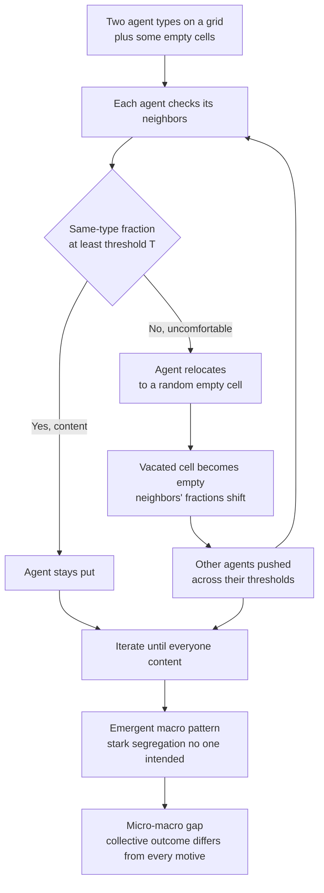

# 🏘️ Schelling Segregation and Emergent Patterns

> [!abstract] TL;DR
> Thomas Schelling's **segregation model** (1971; Nobel 2005) puts two types of agents on a grid, gives each a **mild** same-type preference — an agent is content as long as *some modest fraction* of its neighbors are like it — and lets unhappy agents relocate. The stunning result: even when everyone is quite **tolerant**, the neighborhood self-sorts into **stark, near-total segregation** that no individual wanted or intended. It is the founding parable of the **micro–macro gap** — collective outcomes can be dramatically different from, and even contrary to, the motives of the individuals who produce them — and the archetype of **agent-based** "generative" explanation: you *grow* the pattern to explain it.

---

## Intuition

**Analogy:** Picture a checkerboard neighborhood where everyone is remarkably easygoing. Each resident is perfectly happy living in a mixed, diverse area — they only feel uncomfortable enough to consider moving if *fewer than a third* of their immediate neighbors are like them. Nobody insists on a majority; nobody is a bigot; each person would be delighted to stay in a two-to-one *minority*. Surely such gentle preferences produce a nicely integrated town, a salt-and-pepper mix? Now run the simulation and watch in dismay. The board sorts itself into two great blocks, each almost entirely one color, with a thin no-man's-land between them. No one chose this. No one is a racist in the model. Yet segregation emerges anyway, relentlessly.

That is the whole unsettling lesson in one picture. Schelling's tiny toy delivered one of social science's most durable shocks: **you cannot read the macro pattern off the individual preferences.** A town that looks brutally segregated need not be full of people who *want* segregation — a population of tolerant people, each merely avoiding the discomfort of extreme minority status, can generate exactly the same map. The aggregate has a mind of its own.

---

## How It Works

### The elegant minimal setup

Schelling's model is famous partly because it is almost embarrassingly simple — he first worked it out by hand, moving coins and dimes on a checkerboard.

1. **A space and two types.** Take a grid (Schelling also used a one-dimensional line). Populate most cells with agents of two types — call them red and blue — and leave a fraction of cells **empty**. The empties matter: they are the vacancies that make relocation possible.
2. **A tolerance threshold.** Each agent has a single number, its **tolerance threshold** `T` — the minimum fraction of its occupied neighbors that must be its own type for it to stay put. If at least a fraction `T` of neighbors are same-type, the agent is **happy** and does nothing. Note the framing: a threshold of `0.30` means the agent is content being a **70 percent minority** — an extremely mild, tolerant preference.
3. **Relocation of the unhappy.** Any agent below its threshold is **unhappy** and moves to a random empty cell that satisfies it (or simply to any random empty cell). Its old cell becomes a new vacancy that someone else might use.
4. **Iterate to a stable state.** Sweep through the unhappy agents, let them move, and repeat. The process halts when everyone is happy — an **equilibrium** — or settles into a stable configuration. Minimal rules; profound result.

### The stunning result: micro tolerance, macro segregation

Here is the core finding that made the model canonical. Even when agents are quite **tolerant** — content in a diverse neighborhood, wanting only *not* to be a tiny minority, happy with just 30 percent same-type neighbors — the system evolves to **extreme segregation**, with neighborhoods becoming roughly 70 to 100 percent one type. The measured segregation of the *final* map (average same-type neighbor fraction well above 0.7) sits far above the *individual* threshold (0.3) that produced it. No agent wanted or intended full segregation; none is racist in the model; yet the separation emerges anyway. The gap between the benign micro-preference and the starkly different macro-outcome is the entire point.

The mechanism is a quiet ratchet. A single unhappy agent leaves a cell, which slightly lowers the same-type fraction for the neighbors it abandoned and slightly raises it where it lands. Each move that soothes one agent nudges others across their own thresholds, triggering further moves. Integration is unstable; clustering is self-reinforcing. There is no equilibrium of gentle mixing to fall into — the only stable states are segregated ones.

### The micro–macro gap and emergence

The general lesson generalizes far beyond housing. The **aggregate outcome can be dramatically different from, and even contrary to, the intentions of the individuals composing it.** You cannot infer the macro pattern from the micro motives, and you cannot infer the motives from the pattern. This is the thesis of Schelling's book title — *Micromotives and Macrobehavior* — and it is a foundational demonstration of **emergence** in social systems: a vivid warning against reading intentions off outcomes, or outcomes off intentions. Emergence, the signature theme of complexity economics, is made concrete and disquieting here.

### Tipping and thresholds

Schelling also pioneered **tipping** models of neighborhood change. Once a neighborhood's composition crosses a critical threshold, a self-reinforcing cascade — the classic "white flight" or rapid resorting — can tip it fully from one type to the other. Below the threshold the mix is stable; above it, departures beget departures. These **tipping points** in social systems connect the segregation model to the broader dynamics of neighborhood change, to critical thresholds and cascades in complex systems, and to the norm-cascade ideas of behavioral economics.

### Flow: from micro rule to macro pattern



---

## Key Concepts

**Secondary (intuition level)**
- **Mild wishes, harsh result.** People who are happy being a local minority still end up sorted into one-color blocks. Nobody planned it.
- **The empty cells are the engine.** Without vacancies to move into, nothing can rearrange; the gaps let the pattern crystallize.
- **You cannot read minds from maps.** A segregated town does not prove its residents are prejudiced — mild preferences plus movement are enough.
- **Coins on a checkerboard.** Schelling discovered the whole effect by hand, with no computer, which is why it is such a clean teaching parable.

**Undergraduate (mechanism level)**
- **The tolerance threshold `T`.** The single control parameter: the minimum same-type neighbor fraction an agent will accept. Low `T` means high individual tolerance — yet still yields high macro segregation.
- **The segregation index.** The standard macro measure is the **average same-type neighbor fraction** across all agents. It starts near `0.5` for a random mix and climbs well above `0.7` at equilibrium, far exceeding `T`.
- **Emergence and the micro–macro gap.** The final pattern is *grown*, never programmed; it is an unintended aggregate of independent local decisions. This is the model's real subject.
- **Tipping dynamics.** Schelling's companion insight: composition can be stable up to a critical fraction, then cascade — the origin of "tipping point" language in social science.
- **The archetype of ABM.** Simple heterogeneous agents plus local rules plus interaction plus iteration equals an emergent macro pattern — the cleanest illustration of the agent-based method and of "if you didn't grow it, you didn't explain it."

**Graduate (nuance and reach)**
- **Sufficiency, not necessity.** The model proves a *mechanism is sufficient* to produce segregation; it does **not** claim preferences are the *sole* or *actual* cause. Real segregation also involves discrimination, income, institutions, and policy. The value is conceptual — showing what a mild mechanism alone can do — not a complete empirical account.
- **Robustness of the result.** The qualitative outcome is remarkably insensitive to grid shape, neighborhood definition, initial density, and update order; segregation appears across a wide band of thresholds. This robustness is precisely what makes it a *finding* rather than an artifact.
- **A phase-transition-like structure.** As `T` rises, final segregation increases, but the interesting regime is intermediate: for very low `T` little happens, for very high `T` no equilibrium exists, and in between a modest preference yields disproportionate sorting — a soft, tipping-like transition rather than a linear response.
- **Generative explanation.** The model exemplifies Epstein's "generative" standard: to explain a macroscopic regularity is to exhibit a population of agents whose local interactions *generate* it. Segregation is *grown* to be explained.
- **Policy bite.** If emergent dynamics, not just individual attitudes, drive segregation, then integration policy must overcome the dynamics themselves — changing attitudes alone may not reverse a pattern that mild preferences plus relocation keep regenerating.

---

## Python Demo

This demo does two things. **Part (a)** implements Schelling's model: a grid of two agent types (plus empty cells), where each agent is happy if at least a fraction `T` of its neighbors are the same type, and unhappy agents move to a random empty cell. It visualizes the grid evolving from a random, integrated start to a strikingly segregated final state and computes a **segregation index** (average same-type neighbor fraction) that rises far above the individual threshold. **Part (b)** shows the key result: sweeping the tolerance threshold and plotting final segregation versus `T`, demonstrating that even low individual intolerance (wanting just 30 percent similar neighbors) produces high macro segregation (70 percent or more), with a tipping-like rise — the gap between micro preference and macro outcome. Uses only `numpy` and `matplotlib`.

```python
# Schelling segregation: tolerant local rules -> intolerant global pattern.
# Two agent types (1, 2) on a grid; 0 = empty. An agent is "happy" if the
# fraction of same-type OCCUPIED neighbors is >= threshold T; unhappy agents
# relocate to a random empty cell. We (a) watch the grid segregate and
# (b) plot final segregation vs the tolerance threshold.
import numpy as np
import matplotlib.pyplot as plt
from matplotlib.colors import ListedColormap

rng = np.random.default_rng(7)

N          = 50      # grid side length
EMPTY_FRAC = 0.10    # fraction of empty cells (vacancies enable relocation)
STEPS      = 80      # max relocation sweeps

def make_grid(n, empty_frac):
    """Random, well-mixed initial grid: 0 empty, 1 red, 2 blue."""
    r = rng.random((n, n))
    grid = np.where(r < empty_frac, 0,
           np.where(r < empty_frac + (1 - empty_frac) / 2, 1, 2))
    return grid.astype(int)

def same_fraction(grid, i, j):
    """Fraction of occupied Moore-neighbors sharing this agent's type."""
    t = grid[i, j]
    i0, i1 = max(i - 1, 0), min(i + 2, grid.shape[0])
    j0, j1 = max(j - 1, 0), min(j + 2, grid.shape[1])
    block = grid[i0:i1, j0:j1]
    occupied = np.count_nonzero(block) - 1        # exclude self
    if occupied == 0:
        return 1.0                                # no neighbors -> content
    same = np.count_nonzero(block == t) - 1       # exclude self
    return same / occupied

def segregation_index(grid):
    """Macro measure: mean same-type neighbor fraction across all agents."""
    return float(np.mean([same_fraction(grid, i, j)
                          for i, j in zip(*np.nonzero(grid))]))

def run(grid, threshold, steps=STEPS):
    """Relocate unhappy agents until happy or steps exhausted."""
    grid = grid.copy()
    for _ in range(steps):
        empties = list(zip(*np.where(grid == 0)))
        agents  = list(zip(*np.nonzero(grid)))
        rng.shuffle(agents)
        moved = 0
        for (i, j) in agents:
            if same_fraction(grid, i, j) < threshold and empties:
                k = rng.integers(len(empties))
                ei, ej = empties[k]
                grid[ei, ej] = grid[i, j]         # agent moves to a vacancy
                grid[i, j] = 0                    # old cell becomes empty
                empties[k] = (i, j)
                moved += 1
        if moved == 0:                            # reached equilibrium
            break
    return grid

# --- Part (a): one run at a TOLERANT threshold of 0.30 ---
T = 0.30
base   = make_grid(N, EMPTY_FRAC)
before = base.copy()
after  = run(base, T)
seg0, seg1 = segregation_index(before), segregation_index(after)

# --- Part (b): sweep the tolerance threshold, record final segregation ---
thresholds = np.linspace(0.0, 0.70, 15)
final_seg  = []
for t in thresholds:
    g = run(make_grid(N, EMPTY_FRAC), t)
    final_seg.append(segregation_index(g))
final_seg = np.array(final_seg)

# --- visualize: before grid, after grid, segregation-vs-threshold curve ---
cmap = ListedColormap(["white", "#d62728", "#1f77b4"])
fig, ax = plt.subplots(1, 3, figsize=(15, 4.6))

ax[0].imshow(before, cmap=cmap, vmin=0, vmax=2)
ax[0].set_title(f"Before (integrated)\nseg index = {seg0:.2f}")
ax[1].imshow(after, cmap=cmap, vmin=0, vmax=2)
ax[1].set_title(f"After, T = {T:.2f} (segregated)\nseg index = {seg1:.2f}")
for a in ax[:2]:
    a.set_xticks([]); a.set_yticks([])

ax[2].plot(thresholds, final_seg, "o-", color="purple")
ax[2].plot([0, 0.7], [0, 0.7], "--", color="gray", label="if macro = micro")
ax[2].axhline(0.5, ls=":", c="black", label="random baseline ~0.5")
ax[2].axvline(0.30, ls=":", c="green")
ax[2].set_xlabel("tolerance threshold T (individual preference)")
ax[2].set_ylabel("final segregation index (macro outcome)")
ax[2].set_title("Mild preference -> stark segregation")
ax[2].legend()
plt.tight_layout(); plt.show()

print(f"Part (a): threshold T = {T:.2f}")
print(f"  segregation index: {seg0:.2f} (random) -> {seg1:.2f} (final)")
print(f"Part (b): at T = 0.30, final segregation ~ {final_seg[6]:.2f}")
print("  the macro outcome sits FAR above the diagonal 'macro = micro' line")
```

Running it, Part (a) shows the grid transform from a uniform salt-and-pepper mix (segregation index near `0.5`) into two sharply separated blocks (index climbing above `0.75`), even though every agent is content being a 70 percent minority. Part (b) is the punchline: the final-segregation curve rises **far above** the dashed "macro equals micro" diagonal — at a mild `T = 0.30` the neighborhood reaches roughly 0.7 to 0.8 same-type clustering, and the curve steepens through the intermediate range in a tipping-like way. The macro outcome is not the micro preference scaled up; it is qualitatively harsher, and nobody chose it.

---

## Real-World Applications

> **Example — residential segregation without bigots.** Schelling's model is used by sociologists and urban economists to argue that observed residential segregation need not imply strong individual prejudice. Mild same-type preferences plus relocation dynamics can, by themselves, produce and *sustain* sharp separation. This reframes both the causes (emergent dynamics, not only attitudes) and the policy (integration efforts must counteract the dynamics, not merely change minds), because a pattern regenerated by everyone's small preferences is hard to reverse by attitude change alone.

- **Urban segregation and integration policy.** The model underpins debates on why cities stay segregated despite falling reported prejudice, and why race-neutral mild preferences plus mobility can lock in separation that policy must actively overcome.
- **Neighborhood tipping and gentrification.** Schelling's tipping-point analysis models how a district can flip rapidly once composition crosses a critical fraction — the dynamics of white flight, and, in reverse, gentrification cascades.
- **Political polarization and echo chambers.** Opinion-dynamics variants of the same emergent-sorting logic explain how mild homophily in whom we follow and befriend produces starkly polarized, self-reinforcing communities online and offline.
- **Economic geography and agglomeration.** The clustering-from-local-preference mechanism informs models of why firms and industries concentrate into clusters and cities, an emergent spatial pattern from local interaction advantages.
- **Social norm and behavior cascades.** Threshold-and-relocation logic generalizes to the emergence and tipping of norms — once enough people adopt a behavior, the rest cascade — connecting the model to the broader science of emergent social patterns.

The model sits within a broader family of emergent-pattern ABMs — cellular automata such as Conway's Game of Life, flocking rules, spatial cooperation games, and traffic-jam models — where **local interactions produce emergent spatial and social patterns**. A fuller treatment of that method belongs to the sibling notes on *Agent_Based_Modeling_in_Economics* and *The_Sugarscape_Model*; the general micro-to-macro logic to *Emergence_of_Macro_from_Micro*; the interaction-topology dimension to *Economic_Networks_and_Interaction_Structure*; and the adoption-cascade cousins to *Diffusion_of_Innovations_and_Adoption_Dynamics*.

---

## Common Pitfalls

- **Inferring bigotry from segregation.** The headline error the model warns against: reading strong individual prejudice off a segregated map. Mild preferences suffice, so a segregated outcome is weak evidence about motives. This is the whole cautionary payload of the micro–macro gap.
- **Claiming preferences are the *sole* cause.** The reverse over-reach. The model shows preferences are *sufficient* to generate segregation; it does not show they are the *actual* or *only* cause. Discrimination, income, and institutions also operate in the real world — the model establishes conceptual sufficiency, not empirical completeness.
- **Forgetting the empty cells.** With no vacancies there is nowhere to move and no dynamics; the fraction of empty cells and the neighborhood definition materially shape how fast and how sharply the pattern forms. Report them.
- **Confusing individual and collective magnitudes.** Treating the equilibrium segregation index as if it should equal the threshold `T`. The entire result is that the macro number sits *far above* the micro one — expecting them to match misses the point.
- **Reading a static snapshot as an equilibrium.** A partially sorted grid may still be churning; conclusions should be drawn only after the process stabilizes (no more moves), or the "outcome" is just a transient.
- **Over-generalizing the parable.** The model is a conceptual proof-of-concept, not a calibrated forecast. Using it to predict specific real neighborhood compositions confuses a mechanism demonstration with an empirical model.

---

## Related Concepts

- [[Agent_Based_Modeling]] — Schelling's model is the textbook first example of the agent-based method: heterogeneous agents, local rules, iteration, emergent macro pattern.
- [[Emergence_and_Self_Organization]] — segregation is the canonical case of an emergent macro pattern that no part possesses and no controller imposes.
- [[Bifurcations_and_Tipping_Points]] — Schelling's neighborhood-tipping analysis introduced critical-threshold, cascade dynamics to social science.
- [[Cascades_and_Systemic_Risk]] — the self-reinforcing relocation ratchet is a spatial cousin of the cascade dynamics that sweep through networked systems.
- [[Criticality_and_Phase_Transitions]] — final segregation rises sharply through an intermediate threshold band, a soft phase-transition-like structure.
- [[Complex_Adaptive_Systems]] — the model is a minimal complex adaptive system: many adapting agents whose local interactions produce collective order.
- [[Cellular_Automata]] — the grid-and-local-rule framework Schelling shares with the broader class of emergent spatial-pattern models.
- [[Spatial_and_Network_Games]] — the evolutionary-game analogue where spatial structure, as in Schelling, changes which macro outcomes emerge.
- [[Social_Norms_and_Conformity]] — threshold-and-cascade dynamics link Schelling's tipping to the emergence and tipping of social norms.
- [[Network_Dynamics_and_Contagion]] — the same local-influence-plus-threshold logic drives contagion and sorting on networks rather than grids.
- [[Collective_Behavior_and_Crowds]] — the sociological family of unintended macro patterns from local behavior that Schelling most cleanly formalizes.
- [[Race_Ethnicity_and_Racism]] — the substantive domain the model addresses, and where its "sufficiency, not necessity" caveat matters most.
- [[Urban_Sociology_and_the_City]] — residential segregation, neighborhood change, and tipping are core urban-sociology phenomena the model illuminates.
- [[Democratic_Backsliding_and_Polarization]] — political polarization as emergent sorting, a direct modern application of Schelling-type dynamics.

---

## Review Questions

1. **(Conceptual)** Explain, in your own words, why a population of *tolerant* agents — each happy being a large local minority — nonetheless produces a *segregated* map. What is the ratchet mechanism, and why is a gently integrated configuration unstable? Use this to state precisely what the "micro–macro gap" means.
2. **(Scenario)** A city official observes sharply segregated neighborhoods and concludes residents must be strongly prejudiced, then proposes an anti-bias education campaign. Using the Schelling model, construct a counter-argument. What single parameter would you vary in the simulation to make your point, and why might the education campaign fail to integrate the city even if it fully succeeds at changing attitudes?
3. **(Trade-off / interpretive)** The model shows that mild preferences are *sufficient* to generate segregation. A critic says this proves segregation is caused by preferences, not discrimination, so anti-discrimination policy is misguided. A defender says the model proves nothing about the *real* causes at all. Adjudicate: what exactly does a "generative" model like Schelling's establish, what does it *not* establish, and how should its conceptual result inform — without over-determining — real policy?

---

## Sources

- Schelling, T. C. (1971). "Dynamic Models of Segregation." *Journal of Mathematical Sociology*, 1(2), 143–186. [Taylor & Francis](https://www.tandfonline.com/doi/abs/10.1080/0022250X.1971.9989794)
- Schelling, T. C. (1978). *Micromotives and Macrobehavior*. W. W. Norton. — The book that names and develops the micro–macro gap and tipping models.
- Epstein, J. M., & Axtell, R. (1996). *Growing Artificial Societies: Social Science from the Bottom Up*. Brookings / MIT Press. — Positions Schelling as the archetype of generative, agent-based social science.
- Clark, W. A. V., & Fossett, M. (2008). "Understanding the social context of the Schelling segregation model." *PNAS*, 105(11), 4109–4114. [PNAS](https://www.pnas.org/doi/10.1073/pnas.0708155105)
- Hatna, E., & Benenson, I. (2012). "The Schelling Model of Ethnic Residential Dynamics: Beyond the Integrated–Segregated Dichotomy of Patterns." *Journal of Artificial Societies and Social Simulation*, 15(1). [JASSS](https://www.jasss.org/15/1/6.html)

---

#complexity-economics #schelling-model #segregation #emergence #agent-based-modeling
