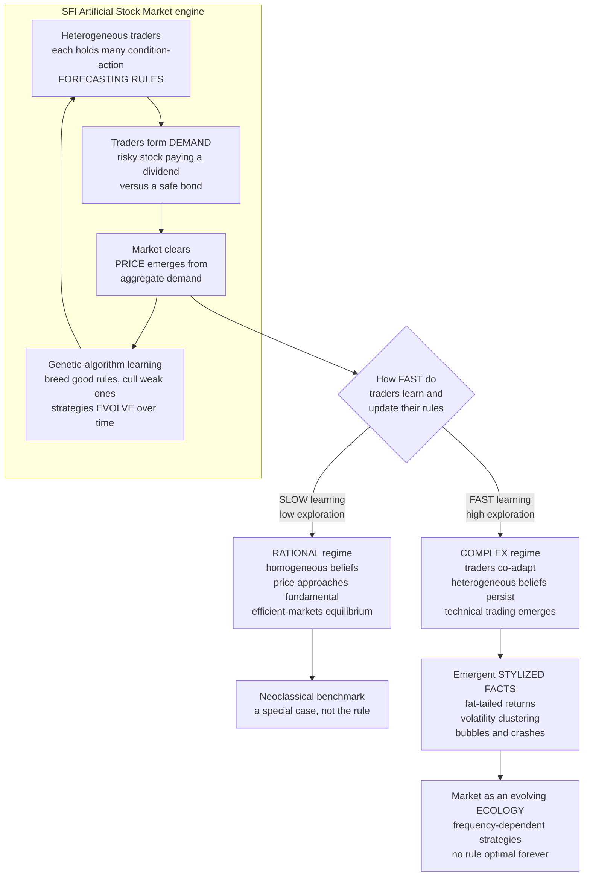

# 📈 The Santa Fe Artificial Stock Market

> [!abstract] TL;DR
> The **Santa Fe Artificial Stock Market (SFI-ASM)** — built at the Santa Fe Institute in the 1990s by **Arthur, Holland, LeBaron, Palmer, and Tayler** — is the archetypal **agent-based model of a financial market**: a computer market filled with artificial traders who each carry a set of **evolving, heterogeneous forecasting rules** (encoded like a genetic-algorithm/classifier system) and trade a dividend-paying risky stock against a safe bond, with a **market-clearing price emerging from their aggregate demand**. Its pivotal result is that the market has **two regimes selected by how fast traders learn**: a **slow-learning ("rational") regime** that converges to the **rational-expectations / efficient-markets equilibrium** (price ≈ fundamental — the neoclassical benchmark appears as a *special case*), and a **fast-learning ("complex") regime** where traders co-adapt, **technical/trend trading emerges and persists**, and the market spontaneously reproduces the empirical **stylized facts** real markets show but efficient-markets theory cannot explain — **fat-tailed returns, volatility clustering, and bubbles and crashes**. It revealed the market to be an **evolving ecology of frequency-dependent competing strategies** rather than a serene equilibrium, and launched the whole field of **agent-based and heterogeneous-agent finance** (Brock-Hommes, Lux-Marchesi, LeBaron).

---

## Intuition

**Analogy:** Efficient-market theory says a stock's price is a serene mirror of its true value — it sits still and moves only when genuine news arrives, so its wobbles should be small, independent, and bell-curve tame. But anyone who has watched a real market knows it is a **moody, violent, herd-driven thing**: placid for months, then convulsing for no clear reason, crashing far more often than any bell curve allows, inflating bubbles out of nothing but its own enthusiasm. So the Santa Fe researchers asked a beautifully literal question: **what if you built a market inside a computer, filled it with hundreds of artificial traders who each *learn* and *adapt* their strategies, and just let it run?** They did exactly that — and out of the churn of adapting, disagreeing, imitating traders **emerged all the "impossible" features of real markets** that the tidy theory sweeps under the rug.

The formal move is to stop writing a single equation for "the price" and instead **grow** the price from the bottom up. Each trader is a little bundle of **if-then forecasting rules** — "if the price has been rising and the dividend is high, expect it to keep rising" — and those rules are **bred and culled by a genetic algorithm**, so the population of strategies **evolves** the way species do in an ecosystem. The market is not solved; it is **cultivated**, and what grows in the dish depends on one dial: how fast the traders are allowed to learn.

---

## How It Works

### The setup: a market grown from adaptive traders

The SFI-ASM is an **agent-based computational economics** model — the financial cousin of the segregation and flocking models studied in `[[Agent_Based_Modeling]]`. Its ingredients:

1. **Traders.** Many artificial agents, each with wealth to allocate between a **risky stock** (paying a stochastic **dividend**) and a **risk-free bond**. Each trader wants to hold more stock when it expects a high risk-adjusted return.
2. **Forecasting rules (predictors).** This is the heart of it. Every trader holds a *set* of **condition-action rules**: the *condition* is a pattern of market descriptors (is the price above a moving average? is the dividend high? is price-over-dividend rich?), encoded as a bit-string mask, and the *action* is a **linear forecast** of next period's price-plus-dividend. At each step a trader activates its currently **best-performing** matching rule and forms demand from that forecast. Traders are thus **heterogeneous** — they literally read the same market through different rules.
3. **Price formation.** The market **clears**: the price is set so that aggregate demand equals the fixed supply of shares. The **price emerges from the traders' collective orders** — nobody sets it exogenously, and it feeds straight back into everyone's next forecast.
4. **Learning by evolution.** Periodically a **genetic algorithm** operates on each trader's rule set: successful predictors are **retained and recombined**, poor ones are **discarded and mutated** into new ones. Strategies therefore **evolve** — the market is a living **ecology of predictors** competing for accuracy, not a fixed set of equations.

Crucially, a rule's success is **frequency-dependent**: whether "buy the dip" or "ride the trend" pays depends on **what everyone else is currently doing**. When the whole crowd is fundamentalist, a chartist rule can invade and profit; when trend-followers dominate, mean-reversion pays. No strategy is permanently optimal — the same insight formalized in `[[Evolutionary_Dynamics_in_Markets_and_Institutions]]` as **market ecology**.

### The pivotal result: two regimes, one dial

The famous finding is that the market's entire character is governed by **how fast traders update their rules** (the genetic-algorithm invocation rate, i.e. the exploration/learning rate):

- **Slow-learning ("rational") regime.** When traders explore rarely and adapt slowly, the population **converges to homogeneous rational beliefs** and the price settles near the **fundamental value** predicted by the **rational-expectations / efficient-markets equilibrium**. Technical trading dies out because there are no persistent patterns to exploit. The neoclassical benchmark **emerges as a special case** of the model — proof the theory is *consistent*, not that it is *general*.
- **Fast-learning ("complex") regime.** When traders explore and adapt quickly, they **continually co-adapt** to one another. Heterogeneous beliefs **never collapse**; **technical, trend-following strategies self-organize and persist** because they are intermittently profitable; and the price develops a rich, out-of-equilibrium life of its own. The market **sits permanently off the efficient equilibrium**, circling it but never resting there.

The same model contains **both worlds** — the equilibrium world and the complexity world — and a single learning-rate parameter selects between them. Real markets, populated by fast-adapting, heterogeneous humans and algorithms, live in the **complex regime**.

### The payoff: stylized facts emerge from the bottom up

In the complex regime the artificial market **spontaneously reproduces the empirical "stylized facts"** of real financial data — the very anomalies efficient-markets theory struggles to generate:

- **Fat-tailed (leptokurtic) returns.** Crashes and spikes occur **far more often than a Gaussian allows** — excess kurtosis, exactly as in real return series (the theme of the future sibling note `Fat_Tails_and_Financial_Market_Statistics`).
- **Volatility clustering.** Turbulent and calm periods **clump** — "large changes tend to be followed by large changes" — the GARCH-like autocorrelation of *squared* returns seen in real data and formalized in `[[GARCH_Models]]`.
- **Bubbles and crashes.** The price **deviates persistently from fundamentals then corrects**, driven purely by internal trend-following feedback — **no external news required**.
- **Exploitable technical signals.** Because heterogeneity persists, temporary correlations appear that **chartist rules can actually profit from** — technical trading works *because the market is complex*.

The model **generates the anomalies endogenously**, validating the complexity view: these are not measurement noise or irrationality bolted on, but **emergent properties of a market of adaptive, diverse agents**.

### Why this matters versus efficient markets

The theoretical punch line: the **Efficient Market Hypothesis** (prices equal fundamentals, no exploitable patterns, roughly Gaussian returns, no endogenous bubbles) is the **slow-learning special case**, *not* the general truth. A market of genuinely **adaptive, heterogeneous** traders lives in the **complex regime**, endogenously producing fat tails, clustering, and bubbles **without any outside shock**. The SFI-ASM is thus a **computational refutation of the efficient-markets assumption** and a **bottom-up explanation** of the behavioral and econophysics anomalies documented in `[[Behavioral_Finance_Foundations]]` and the future sibling `Econophysics_and_Statistical_Mechanics_of_Markets`. It is the constructive complement to the bounded-rationality tradition (the future sibling `Bounded_Rationality_and_Heterogeneous_Agents`), showing *how* heterogeneity survives rather than merely assuming it.

### Flow / Architecture



---

## Key Concepts

### Secondary (intuition level)
- **A market you can grow in a computer.** Fill a simulation with hundreds of artificial traders, let each one *learn*, press play, and watch a price emerge from their buying and selling.
- **Traders disagree and adapt.** Each trader has its own little rulebook of "if this, then buy/sell," and a **genetic algorithm** keeps breeding better rules and killing off bad ones.
- **One dial changes everything.** Learn *slowly* and the market turns calm and "efficient," price hugging true value. Learn *fast* and it turns wild — bubbles, crashes, and stormy stretches.
- **The wildness is real-looking.** The fast-learning market crashes too often for a bell curve, has calm and stormy spells that clump together, and inflates bubbles out of nothing — exactly like real markets.

### Undergraduate (formal level)
- **Agent-based computational finance.** Bottom-up simulation where a market-clearing **price** is an *output* of many heterogeneous agents' demands, not an assumption (contrast the top-down equilibrium of the EMH).
- **Condition-action predictors.** Each rule maps a bit-encoded **market state** (price/dividend descriptors, moving-average signals) to a **linear forecast** of next-period price-plus-dividend; traders act on their best-matching, best-performing rule.
- **Genetic-algorithm learning.** Predictors are **selected, recombined, and mutated** by fitness (forecast accuracy / realized profit) — the strategy set **co-evolves** with the market it helps create.
- **Two-regime result.** A **learning-rate / exploration** parameter tunes the market between a **rational-expectations equilibrium** (slow) and a **complex, non-equilibrium** regime (fast); the EMH is recovered as the slow-learning limit.
- **Emergent stylized facts.** In the complex regime: **excess kurtosis** (fat tails), **volatility clustering** (persistent autocorrelation of squared/absolute returns), **bubbles and crashes**, and **profitable technical trading** — none programmed in.
- **Frequency dependence and market ecology.** A strategy's payoff depends on the current mix of strategies; heterogeneity is **endogenously maintained** because any dominant rule invites a counter-strategy (`[[Evolutionary_Dynamics_in_Markets_and_Institutions]]`).

### Graduate (research level)
- **Endogenous expectations and the self-referential loop.** Forecasts determine the price, which determines forecast accuracy — a **fixed-point-free, out-of-equilibrium** learning problem for which no analytic rational-expectations solution is compelling; the SFI-ASM resolves it *inductively* (Arthur's inductive rationality).
- **Bifurcation to complexity.** The transition between regimes is a **learning-rate-driven bifurcation**; near it, noise interacts with the nonlinear switching to produce **intermittent volatility bursts** — the same mechanism `[[Criticality_and_Phase_Transitions]]` describes and that Brock-Hommes call the **"rational route to randomness."**
- **Heterogeneous-agent models (HAM).** The SFI-ASM's "fundamentalist vs chartist" switching was distilled into **analytically tractable** adaptive-belief systems — **Brock-Hommes (1998)** discrete-choice fraction dynamics and **Lux-Marchesi (1999)** stochastic multi-agent models — that reproduce fat tails and clustering with far fewer moving parts.
- **A design controversy.** LeBaron, Arthur & Palmer showed the stylized facts hinge on the **learning speed and the memory / GA schedule**; later work (e.g. the "bit condition" and forecast-accuracy vs wealth-based selection debate) showed some emergent technical trading was **partly an artifact of the GA mutation on unused bits** — a caution that emergent findings in rich ABMs need careful sensitivity analysis (see `[[Agent_Based_Modeling]]` on the docking/overfitting problems).
- **Relation to econophysics.** The power-law tails and clustering connect to the **statistical mechanics of markets** — herding, criticality, and scaling laws — the province of the future sibling `Econophysics_and_Statistical_Mechanics_of_Markets`.

---

## Python Demo

We build a **simplified adaptive-market ABM** in the spirit of the SFI-ASM and its analytic descendant, the **Brock-Hommes adaptive belief system**. A population of traders mixes two strategies — **fundamentalists** (bet the price reverts to fundamental value) and **chartists / trend-followers** (bet the recent trend continues) — and the **fraction** using each strategy **evolves** based on recent profitability (evolutionary/adaptive switching). A far-from-fundamental damping (Gaunersdorfer-Hommes) makes over-extended chartists lose confidence, so bubbles eventually collapse. The **price emerges from their combined demand**. We show that this **heterogeneous adaptive** market generates the **stylized facts** — **bubbles/crashes**, **volatility clustering**, and **fat-tailed returns** — that are **absent** from a **homogeneous rational (fundamentalist-only)** market. Uses only `numpy` and `matplotlib`.

```python
# Adaptive fundamentalist-vs-chartist market (Brock-Hommes / SFI-ASM style).
# The FRACTION of each strategy evolves by recent profitability; the price
# emerges from combined demand. Heterogeneous + adaptive -> bubbles, volatility
# clustering, and fat tails. Homogeneous rational -> smooth, efficient, Gaussian.
import numpy as np
import matplotlib.pyplot as plt

def simulate(T=6000, adaptive=True, seed=0,
             g=1.20,      # chartist trend-extrapolation gain (>1 -> can bubble)
             phi=0.25,    # fundamentalist mean-reversion strength
             beta=6.0,    # intensity of choice (how sharply traders chase profit)
             eta=0.90,    # memory of the fitness measure
             alpha=0.6,   # far-from-fundamental damping scale for chartists
             sigma=0.03): # news / dividend noise
    rng = np.random.default_rng(seed)
    x  = np.zeros(T)   # log price deviation from fundamental (0 = fair value)
    r  = np.zeros(T)   # one-step return  r_t = x_t - x_{t-1}
    wc = np.zeros(T)   # fraction of chartists
    Uc = Uf = 0.0      # accumulated fitness (realized profit) of each strategy

    for t in range(2, T):
        # --- realized profit of last period's positions (fitness) ---
        # chartist position ~ trend g*r_{t-2}; fundamentalist position ~ -phi*x_{t-2}
        prof_c = (g * r[t-2]) * r[t-1]
        prof_f = (-phi * x[t-2]) * r[t-1]
        Uc = eta * Uc + (1 - eta) * prof_c
        Uf = eta * Uf + (1 - eta) * prof_f

        if adaptive:
            # discrete-choice (logit) switching toward the more profitable strategy
            m = np.clip(beta * (Uc - Uf), -50, 50)
            frac_c = 1.0 / (1.0 + np.exp(-m))
            # far-from-fundamental damping: over-extended chartists lose nerve
            frac_c *= np.exp(-(x[t-1] ** 2) / alpha)
        else:
            frac_c = 0.0            # homogeneous RATIONAL market = all fundamentalists
        wc[t] = frac_c
        wf = 1.0 - frac_c

        # --- price emerges from combined demand ---
        # chartists push price along the trend; fundamentalists pull it to value
        r[t] = wf * (-phi * x[t-1]) + frac_c * (g * r[t-1]) + sigma * rng.standard_normal()
        x[t] = np.clip(x[t-1] + r[t], -12, 12)
        r[t] = x[t] - x[t-1]
    return x, r, wc

def excess_kurtosis(v):
    v = v - v.mean()
    return (v**4).mean() / (v.var()**2) - 3.0

def vol_clustering(v, lags=20):
    """Autocorrelation of squared returns = signature of volatility clustering."""
    s = v**2 - (v**2).mean()
    denom = (s**2).mean()
    return np.array([(s[:-k] * s[k:]).mean() / denom for k in range(1, lags + 1)])

# --- run both markets ---
xa, ra, wca = simulate(adaptive=True,  seed=1)   # heterogeneous + adaptive
xr, rr, _   = simulate(adaptive=False, seed=1)   # homogeneous  + rational
burn = 500
ra, rr = ra[burn:], rr[burn:]
za = (ra - ra.mean()) / ra.std()                 # standardized returns
zr = (rr - rr.mean()) / rr.std()

print("EXCESS KURTOSIS (0 = Gaussian):")
print(f"  adaptive/complex market : {excess_kurtosis(ra):6.2f}  (fat tails)")
print(f"  rational/efficient market: {excess_kurtosis(rr):6.2f}  (near Gaussian)")
print("Lag-1 autocorr of squared returns (volatility clustering):")
print(f"  adaptive : {vol_clustering(ra)[0]:.3f}   rational: {vol_clustering(rr)[0]:.3f}")

# --- visualize ---
fig, ax = plt.subplots(2, 3, figsize=(15, 8))
grid = np.linspace(-6, 6, 200)
gauss = np.exp(-grid**2 / 2) / np.sqrt(2 * np.pi)

# Row 1: adaptive / COMPLEX market
ax[0, 0].plot(np.exp(xa[burn:]), color="#c0392b", lw=0.7)
ax[0, 0].axhline(1.0, color="#2c7fb8", ls="--", lw=1, label="fundamental value")
ax[0, 0].set_title("Adaptive market: price vs fundamental (BUBBLES + crashes)")
ax[0, 0].set_ylabel("price / fundamental"); ax[0, 0].legend(fontsize=8)

ax[0, 1].plot(ra, color="#c0392b", lw=0.5)
ax[0, 1].set_title("Returns: VOLATILITY CLUSTERING (calm and storm)")
ax[0, 1].set_ylabel("return")

ax[0, 2].hist(za, bins=120, density=True, color="#c0392b", alpha=0.65)
ax[0, 2].plot(grid, gauss, "k--", lw=1.5, label="Gaussian")
ax[0, 2].set_yscale("log")
ax[0, 2].set_title(f"FAT TAILS: excess kurtosis = {excess_kurtosis(ra):.1f}")
ax[0, 2].set_xlabel("standardized return"); ax[0, 2].legend(fontsize=8)

# Row 2: homogeneous RATIONAL market
ax[1, 0].plot(np.exp(xr[burn:]), color="#2c7fb8", lw=0.7)
ax[1, 0].axhline(1.0, color="#333333", ls="--", lw=1, label="fundamental value")
ax[1, 0].set_title("Rational market: price hugs fundamental (efficient)")
ax[1, 0].set_ylabel("price / fundamental"); ax[1, 0].legend(fontsize=8)

ax[1, 1].plot(rr, color="#2c7fb8", lw=0.5)
ax[1, 1].set_title("Returns: homoskedastic (no clustering)")
ax[1, 1].set_ylabel("return"); ax[1, 1].set_xlabel("time")

ax[1, 2].hist(zr, bins=120, density=True, color="#2c7fb8", alpha=0.65)
ax[1, 2].plot(grid, gauss, "k--", lw=1.5, label="Gaussian")
ax[1, 2].set_yscale("log")
ax[1, 2].set_title(f"Near-Gaussian: excess kurtosis = {excess_kurtosis(rr):.1f}")
ax[1, 2].set_xlabel("standardized return"); ax[1, 2].legend(fontsize=8)

fig.suptitle("SFI-ASM style: adaptive heterogeneous traders GENERATE the stylized "
             "facts; a homogeneous rational market does not", fontsize=12)
fig.tight_layout(rect=[0, 0, 1, 0.96])
plt.savefig("santa_fe_artificial_market.png", dpi=120)
plt.show()
```

**What the output shows.** The **adaptive/complex** market (top row) — where the fraction of chartists rises and falls with recent profitability — produces a price that **inflates bubbles and crashes back** toward fundamental value (top-left), a return series with **visibly clustered** calm and turbulent stretches (top-middle), and a return distribution with a **sharp peak and fat tails** sitting well above the Gaussian dashed line, with **large positive excess kurtosis** (top-right). The **homogeneous rational** market (bottom row) — pure fundamentalists — keeps the price **pinned near fundamental** value, has **homoskedastic** returns with no clustering, and a return distribution **close to Gaussian** (near-zero excess kurtosis). The only difference between the two runs is whether traders are allowed to **adapt and disagree** — recovering the SFI-ASM's central lesson that the market's realistic "misbehavior" is an **emergent property of adaptive heterogeneity**, and that the efficient benchmark is the special case you get when adaptation is switched off.

---

## Real-World Applications

> **Example — the analytic descendants that model real return data.** The SFI-ASM's "fundamentalist vs chartist" adaptive-switching idea was distilled into the **Brock-Hommes adaptive belief system** and the **Lux-Marchesi model**, which reproduce the *quantitative* stylized facts of real equity and FX returns — power-law tails with exponent near three and slowly-decaying volatility autocorrelation — from heterogeneous adaptive agents alone. These are now standard benchmarks in **agent-based computational finance**, the field the SFI-ASM founded.

- **Explaining market anomalies.** Agent-based and heterogeneous-agent models give a **bottom-up account** of fat tails, volatility clustering, bubbles, and momentum/reversal effects that equilibrium asset pricing struggles to generate — complementing the behavioral evidence in `[[Behavioral_Finance_Foundations]]`, `[[Herding_Bubbles_and_Crashes]]`, and `[[Market_Anomalies_and_Limits_to_Arbitrage]]`, and formalized statistically in `[[GARCH_Models]]`.
- **Systemic risk and flash crashes.** Regulators and central banks run **agent-based market simulations** to study how coupled algorithmic strategies can produce **flash crashes** and destabilizing feedback loops — emergent instability no single agent intends (`[[High_Frequency_Trading]]`, `[[Cascades_and_Systemic_Risk]]`, and the future sibling `Cascades_Contagion_and_Financial_Crises`).
- **Market design and algorithmic trading.** Artificial markets are a **laboratory** for testing how trading rules, tick sizes, circuit breakers, and the growth of **high-frequency / algorithmic** participants change stability and price quality *before* deploying them live (`[[Reinforcement_Learning_Trading]]`).
- **Stress testing and scenario analysis.** Because the model generates crises **endogenously**, it lets analysts probe how a market responds to shocks and structural changes without assuming the crisis away — the argument Farmer & Foley made in *Nature* for agent-based macro-finance.
- **A bridge to complexity economics.** The SFI-ASM anchors the broader Santa Fe program that treats the economy as a **complex adaptive system** (`[[Complex_Adaptive_Systems]]`, `[[Economic_and_Social_Complexity]]`, `[[Evolutionary_Dynamics_in_Markets_and_Institutions]]`), and the still-to-be-written siblings `Agent_Based_Modeling_in_Economics`, `Evolutionary_Economics_and_Selection`, and `Bounded_Rationality_and_Heterogeneous_Agents`.

---

## Common Pitfalls

- **"The efficient-markets equilibrium is the truth; the SFI-ASM just adds noise."** Backwards. The efficient equilibrium is the **slow-learning special case**; the complex regime — where real, fast-adapting markets live — is the **general case**, and its fat tails and bubbles are *structural*, not noise bolted on.
- **"Bubbles need external news."** In the complex regime the price departs from fundamentals and crashes back **purely from internal trend-following feedback** — the model manufactures bubbles with *no* news shock. Attributing every large move to news misreads the mechanism.
- **"A profitable rule stays profitable."** Strategy payoffs are **frequency-dependent**: as chartists crowd in, their edge inflates a bubble that fundamentalists then profit from destroying. No rule is optimal forever — the market is an **ecology**, not an optimization (`[[Evolutionary_Dynamics_in_Markets_and_Institutions]]`).
- **"Any emergent result in the ABM is a real economic finding."** Some SFI-ASM "technical trading" was later shown to be **sensitive to the genetic-algorithm schedule and to mutation on unused condition bits**. Rich ABMs demand **sensitivity analysis and docking** before an emergent pattern is believed (`[[Agent_Based_Modeling]]`).
- **"Learning speed is a minor detail."** It is the **control parameter** that selects the entire regime. Reporting results without stating the learning/exploration rate is like reporting a phase without stating the temperature (`[[Criticality_and_Phase_Transitions]]`).
- **"Homogeneous representative-agent models are good enough."** By construction they **cannot** produce the endogenous heterogeneity that drives the stylized facts; a single representative rational agent gives you the efficient benchmark and nothing else. Heterogeneity is the phenomenon, not an inconvenience to average away.

---

## Related Concepts

- [[Agent_Based_Modeling]] — the bottom-up simulation method the SFI-ASM is a landmark instance of; the "grow it to explain it" epistemology applied to finance.
- [[Evolutionary_Dynamics_in_Markets_and_Institutions]] — the market-ecology / Adaptive-Markets framing that generalizes the SFI-ASM's frequency-dependent, co-evolving strategies.
- [[Complex_Adaptive_Systems]] — the Santa Fe framing of markets as many adaptive agents producing emergent, non-equilibrium order.
- [[Economic_and_Social_Complexity]] — the broader complexity-economics program this model helped launch.
- [[Emergence_and_Self_Organization]] — how bubbles, clustering, and near-efficiency arise from local trader behavior with no central design.
- [[Criticality_and_Phase_Transitions]] — the learning-rate bifurcation between the rational and complex regimes; the "rational route to randomness."
- [[Behavioral_Finance_Foundations]] — the behavioral anomalies the SFI-ASM reproduces mechanistically from adaptive heterogeneity.
- [[Herding_Bubbles_and_Crashes]] — the herding-driven bubble dynamics the complex regime generates endogenously.
- [[Sentiment_and_Noise_Trading]] — the noise-trader / chartist behavior whose survival the model explains.
- [[Market_Anomalies_and_Limits_to_Arbitrage]] — why exploitable patterns persist when heterogeneity does not collapse.
- [[GARCH_Models]] — the econometric formalization of the volatility clustering the model produces.
- [[High_Frequency_Trading]] — the modern fast algorithmic ecology whose coupled feedbacks the SFI-ASM tradition studies.
- [[Cascades_and_Systemic_Risk]] — agent-based markets as a tool for flash-crash and systemic-risk analysis.
- [[Reinforcement_Learning_Trading]] — adaptive learning agents in markets, a modern descendant of the evolving predictors.
- [[Bounded_Rationality_and_Satisficing]] — the inductive, boundedly-rational reasoning Arthur used in place of rational expectations.

> Not-yet-written siblings referenced in prose only — `Agent_Based_Modeling_in_Economics`, `Bounded_Rationality_and_Heterogeneous_Agents`, `Fat_Tails_and_Financial_Market_Statistics`, `Econophysics_and_Statistical_Mechanics_of_Markets`, `Cascades_Contagion_and_Financial_Crises`, and `Evolutionary_Economics_and_Selection` — will link back here once created.

---

## Review Questions

**Tier 1 — Conceptual**
1. Explain, without equations, why the Santa Fe Artificial Stock Market can contain **both** an efficient-markets equilibrium and a wild, bubble-prone market. What single feature of the traders decides which one you get, and what does that imply about whether the Efficient Market Hypothesis is a general law or a special case?
2. What are the three headline "stylized facts" the SFI-ASM reproduces in its complex regime, and why is it significant that they emerge **without any external news shock**?

**Tier 2 — Applied**
3. In the Python demo, the only difference between the two markets is whether the chartist fraction is allowed to adapt. Trace the causal chain by which **adaptive switching** produces a bubble-then-crash, and explain the role of the **far-from-fundamental damping** term in making bubbles collapse rather than run to infinity. Why does the fundamentalist-only market have near-zero excess kurtosis?
4. A regulator wants to test whether a proposed circuit-breaker rule would reduce flash crashes. Explain why an SFI-ASM-style agent-based model is better suited to this than a representative-agent equilibrium model, and name one validation danger (from the ABM pitfalls) they must guard against.

**Tier 3 — Analytical / Open-ended**
5. The SFI-ASM's emergent technical trading was later found to be partly sensitive to the genetic-algorithm schedule and to mutation on unused condition bits. Discuss how this "artifact vs finding" controversy should shape our confidence in emergent results from rich agent-based models, and what specific robustness checks (sensitivity analysis, docking, pattern-oriented validation) you would demand.
6. Andrew Lo's Adaptive Markets Hypothesis, the Brock-Hommes adaptive belief system, and the SFI-ASM all reframe "efficiency" as an evolutionary, time-varying outcome rather than a fixed property. Critically assess this reframing: what does treating the market as an **ecology of frequency-dependent strategies** explain that the Efficient Market Hypothesis cannot — and where might the biological analogy mislead?

---

## Sources

- Palmer, R. G., Arthur, W. B., Holland, J. H., LeBaron, B., & Tayler, P. (1994). "Artificial economic life: a simple model of a stockmarket." *Physica D*, 75(1-3), 264-274. — the original SFI-ASM.
- Arthur, W. B., Holland, J. H., LeBaron, B., Palmer, R., & Tayler, P. (1997). "Asset Pricing Under Endogenous Expectations in an Artificial Stock Market." In *The Economy as an Evolving Complex System II* (eds. Arthur, Durlauf, Lane), Addison-Wesley, 15-44.
- LeBaron, B., Arthur, W. B., & Palmer, R. (1999). "Time series properties of an artificial stock market." *Journal of Economic Dynamics and Control*, 23(9-10), 1487-1516.
- Brock, W. A., & Hommes, C. H. (1998). "Heterogeneous Beliefs and Routes to Chaos in a Simple Asset Pricing Model." *Journal of Economic Dynamics and Control*, 22(8-9), 1235-1274.
- Lux, T., & Marchesi, M. (1999). "Scaling and criticality in a stochastic multi-agent model of a financial market." *Nature*, 397, 498-500.
- Farmer, J. D., & Foley, D. (2009). "The economy needs agent-based modelling." *Nature*, 460, 685-686.

---

#complexity-economics #artificial-stock-market #agent-based-finance #stylized-facts #market-dynamics
