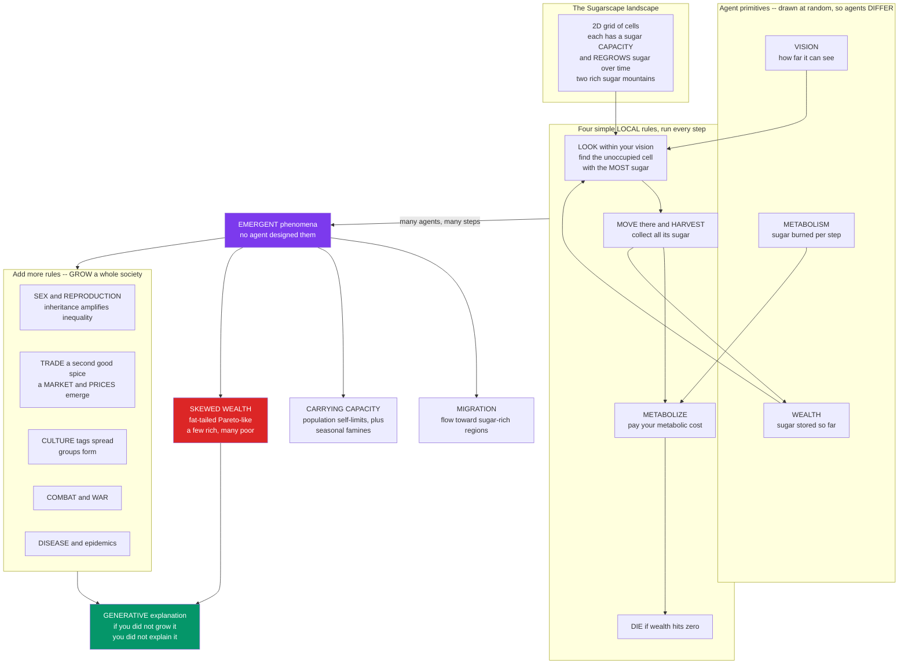

# 🏝️ The Sugarscape Model

> [!abstract] TL;DR
> **Sugarscape** — Joshua **Epstein** and Robert **Axtell's** landmark 1996 model in *Growing Artificial Societies* — is the founding demonstration of **agent-based computational social science**: a simulated world of simple **agents** foraging a 2D landscape of regenerating **"sugar."** Each agent has only a **vision** (how far it sees), a **metabolism** (sugar burned per step), and accumulated **wealth**, and obeys four trivial rules — *look within your vision, move to the unoccupied cell with the most sugar, harvest it, pay your metabolic cost, and die if your wealth runs out.* From these bare-bones rules a startling range of social and economic phenomena **emerge from the bottom up**: **migration** toward sugar-rich regions, an ecological **carrying capacity** that self-limits the population, and — above all — a strongly **skewed, fat-tailed, Pareto-like wealth distribution** (a few rich, many poor) that arises purely from agent **heterogeneity** (differing vision, metabolism, and lucky starting positions), *not* from unfair rules or exploitation. Extending the model — adding **sex and reproduction, trade** of a second good ("spice") from which a **market and prices emerge, cultural** transmission, **combat/war,** and **disease** — grows an entire artificial society piece by piece. Sugarscape embodies Epstein's **generative** creed — *"if you didn't grow it, you didn't explain it"* — and stands as the canonical proof-of-concept that complex societal patterns, especially **inequality**, can arise from decentralized interaction **without equilibrium, a representative agent, or central design**.

---

## Intuition

**Analogy — grow a society in a petri dish.** Imagine you could grow an entire society from scratch inside a computer, the way a biologist grows bacteria on a nutrient plate. You spread some food — call it **"sugar"** — unevenly across a landscape, piling it into a couple of rich mountains and leaving deserts in between. Then you scatter a few hundred tiny **agents** across the plate and hand each one a pathetically short list of instincts: *look around as far as your eyesight lets you, walk to the richest patch of sugar you can see that nobody else is standing on, eat it, and burn a little energy each step to stay alive; if you ever run out, you die.* No agent has a plan. No agent can see the whole world. No auctioneer sets prices; no government redistributes; no invisible hand is written into the code.

You would expect a dull foraging simulation — dots wandering toward food. Instead, press play and a whole **social order boils up out of the rules**. The agents stream toward the sugar mountains in great **migrations**. The population, left to breed, doesn't explode forever — it self-throttles to exactly what the landscape can feed, an emergent **carrying capacity**. And most striking of all, wealth stops being evenly spread: within a few hundred steps a **tiny minority hoards most of the sugar while a large underclass scrapes by** — a sharply **skewed, Pareto-like distribution of wealth** that looks eerily like the real world's. Add a second food and let agents swap it, and a **market with prices** appears. Let them carry cultural "tags" and groups form. Let them fight and **war** breaks out; let a pathogen loose and **epidemics** sweep the plate.

The punchline that made Sugarscape a landmark: the grand patterns of human society — migration, markets, and above all the stubborn skew of **inequality** — can be **grown from the bottom up**, emerging from simple, selfish, local behavior and nothing more. You don't have to *assume* inequality or *impose* a market; you *grow* them, and watch them appear.

---

## How It Works

### Core Mechanics

**1. The landscape — the "Sugarscape."** The world is a 2D lattice (typically a 50×50 grid). Every cell has a fixed **sugar capacity** — the maximum sugar it can hold — arranged so the landscape has two rich **sugar mountains** (a north-east and a south-west peak in Epstein–Axtell's original) separated by lean regions. A cell's current sugar is harvested to zero when an agent eats it, then **regrows** back toward its capacity at some **growback rate** (e.g. one unit per time step). The landscape is thus a *renewable resource field* with an intrinsic productivity that varies enormously by location — geography as destiny.

**2. The agents — three primitives and nothing more.** Each agent lives on one cell and carries just three attributes, drawn *randomly and independently* at birth so the population is **heterogeneous**:
- **Vision** — how many cells it can see along the lattice directions (say 1 to 6). High vision is an information advantage.
- **Metabolism** — how much sugar it burns each step just to stay alive (say 1 to 4). Low metabolism is a cost advantage.
- **Wealth** — the sugar it has accumulated and stored. Starting wealth is a random endowment — pure **luck**.

**3. The movement rule (rule "M") — the whole behavioral engine.** Each step, in random order, every agent executes one trivially simple, entirely **local, myopic** rule:
1. **Look** — survey the unoccupied cells within your **vision** along the four principal lattice directions.
2. **Move** — go to the *nearest* unoccupied cell holding the **most sugar** (stay put if nothing you can see beats your current cell).
3. **Harvest** — collect *all* the sugar on your new cell; the cell drops to zero.
4. **Metabolize** — subtract your **metabolism** from your wealth.
5. **Die** — if your wealth hits zero, you starve and are removed.

That is the entire model. No optimization over the future, no strategic reasoning about other agents, no prices, no equilibrium condition. Greedy, one-step, local hill-climbing on sugar — repeated by every agent, every step.

**4. Emergent migration and carrying capacity.** Run it and the first things to appear are *ecological*. Agents **migrate** — they flow off the barren flats and pile up on the two sugar mountains, self-sorting toward productivity like water finding a basin (a spatial cousin of the biological **ideal free distribution**). Second, the population does *not* grow without limit even when reproduction is switched on: it self-limits to the number the landscape's growback can feed — an emergent **carrying capacity**, a Malthusian/ecological equilibrium that no line of code sets. Add **seasonal** variation (sugar growback that waxes and wanes on one side) and you get **seasonal migration** and periodic **famines** — social dynamics falling straight out of resource plus rules.

**5. The signature result — emergent wealth inequality.** The most cited outcome. Even though every agent runs the *identical* rule, the **distribution of wealth across agents becomes strongly skewed** — a fat-tailed, roughly **Pareto/lognormal** shape with a few very rich agents and a long tail of the poor. This is startling because there is **no unfairness in the rules**: no theft (in the basic model), no rigged prices, no discrimination. The inequality emerges from **heterogeneity amplified by dynamics** — agents that happen to have high vision, low metabolism, or a lucky starting position near a sugar peak accumulate a lead, and the lead compounds (wealth buys survival, survival buys more harvesting). Inequality is thus **grown**, not assumed — a bottom-up, generative account of exactly the skewed wealth distributions seen in real economies, and a direct link to the study of *Power_Laws_and_Heavy_Tails_in_Economics* and *Wealth_and_Income_Inequality_Dynamics*.

**6. Extensions — "growing artificial societies" piece by piece.** Epstein and Axtell's ambition was to *assemble a whole society* by bolting on new rules, each generating fresh emergent phenomena:
- **Sex and reproduction.** Agents mate when adjacent and fertile, producing offspring that **inherit** a blend of parental traits and wealth — introducing genuine population dynamics and *amplifying* inequality across generations through inheritance.
- **Trade.** Add a *second* resource, **"spice,"** and give agents preferences over both goods (a Cobb–Douglas welfare function). Let neighboring agents **trade** sugar for spice at a bilaterally bargained price. A **market with emergent prices** appears; total welfare improves through gains from trade — yet inequality *persists*. Bottom-up **market emergence** with no Walrasian auctioneer.
- **Culture.** Give each agent a string of cultural "tags" that flip toward the majority of their neighbors. **Cultural transmission**, group formation, and tag-based in-groups emerge and evolve (a mechanism shared with cultural-evolution models).
- **Combat / war.** Let agents seize the wealth of weaker neighbors of a different group. **Conflict dynamics**, raiding, and territorial fronts emerge.
- **Disease.** Introduce pathogens that spread between adjacent agents and sap metabolism. **Epidemics** ripple through the population — seeding an entire tradition of agent-based **epidemiology**.

**7. Generative social science — the methodological manifesto.** Sugarscape is not just a simulation; it is an argument about *what it means to explain*. Epstein's **generative** standard says: to explain a macro social phenomenon — inequality, migration, a market, an epidemic — you must **grow it from the bottom up** out of plausible, autonomous agent behaviors. If a candidate micro-mechanism, when simulated, *produces* the macro-pattern, you have a candidate explanation; if it cannot, you have not explained it. Epstein's slogan: **"If you didn't grow it, you didn't explain it."** This reframes social science as **constructive, computational, and emergent** — a genuine third way beside pure deduction and pure induction.

### Flow / Architecture



---

## Key Concepts

### Secondary Level

**Growing a make-believe society in a computer.** Scatter some food ("sugar") on a map, drop in little "people," and give each one the same simple instincts: *go to the most food you can see, eat it, and you need to keep eating or you die.* That is the whole game. Yet watching it play out, real-looking patterns appear on their own.

**The three things that make agents different.** Each agent has an **eyesight** (how far it can see food), a **hunger** (how fast it burns food), and a **savings** (food stored up). They start with *random* amounts of each — some got lucky, some didn't.

**The big surprise — a few rich, many poor.** Even though everyone follows the *exact same* rules and nobody cheats, wealth ends up **very unequal**: a small group hoards most of the sugar and a big crowd stays poor. The inequality comes from **luck and differences** (better eyesight, lower hunger, a lucky starting spot), not from unfair rules. That is the headline lesson.

**Other patterns that appear by themselves:**

| You put in | You get out, for free |
|---|---|
| Food on a map + simple foragers | Crowds **migrating** toward the rich patches |
| "Eat or die" | Population that **stops growing** at what the land can feed |
| Random eyesight, hunger, luck | A **rich-and-poor** wealth gap |
| A second food they can swap | A **market with prices** |

### Undergraduate Level

**The formal setup.** Sugarscape is a **cellular grid** (a lattice) carrying a renewable **sugar field** with fixed per-cell **capacities** (two peaks) and a **growback** rule that refills harvested cells over time. On it live heterogeneous **agents** with random **vision** *v*, **metabolism** *m*, and **wealth** *w*. The behavioral core is **rule M**: each step, look up to *v* cells along the axes, move to the nearest unoccupied cell with maximum sugar, harvest it fully, subtract *m*, and die if *w ≤ 0*. It is myopic, greedy, decentralized hill-climbing — a canonical **agent-based model** ([[Agent_Based_Modeling]]).

**Why inequality emerges without unfair rules.** This is the conceptual heart. The rules are symmetric; the *agents and their circumstances are not*. An agent with high vision sees more sugar (better information); one with low metabolism needs less (lower burn rate); one born near a peak harvests more from step one (locational luck). These endowment differences give small early advantages that **compound**: wealthier agents survive lean patches that kill the poor, and survival means more harvesting. The result is a **right-skewed wealth distribution** with a heavy tail — the same qualitative shape as empirical wealth data. Crucially, this shows inequality can be a *generic emergent property of heterogeneous foraging*, not necessarily evidence of exploitation — a subtle and much-debated result that complements the sociological study of [[Social_Class_and_Stratification]].

**Emergent ecology — migration and carrying capacity.** The population **migrates** to the sugar mountains (spatial self-sorting) and, once reproduction is on, self-limits to a **carrying capacity** set by the landscape's total growback versus aggregate metabolism — a computational realization of Malthusian [[Population_Ecology]]. Seasonal growback yields seasonal migration and famines. These are *ecological equilibria that emerge*, never imposed.

**Emergent markets (the trade extension).** Add **spice** as a second good and Cobb–Douglas preferences, and let neighbors trade to their mutual benefit at a bargained price (typically the geometric mean of their marginal rates of substitution). A **decentralized market** self-organizes: trade prices form, cluster, and improve welfare — a bottom-up account of price formation with **no auctioneer and no assumption of equilibrium**, echoing the decentralized price discovery treated in [[Economies_as_Complex_Adaptive_Systems]]. Notably, prices do **not** fully converge to a single Walrasian value — dispersion persists — which is itself an out-of-equilibrium finding.

### Graduate Level

**Generative sufficiency versus necessity.** Sugarscape is the flagship of **generative** social science: a macro-explanandum (skewed wealth, a market, an epidemic) is *explained* by exhibiting a set of autonomous, locally-interacting agent rules whose simulation *generates* it. The logical status is **sufficiency**, not necessity — the model shows the micro-mechanism *can* produce the macro-pattern, establishing it as a *candidate* generator, not the unique one. Epstein's *Generative Social Science* (2006) formalizes this as a distinct epistemology, sitting alongside (and in tension with) the deductive equilibrium tradition and the inductive statistical one. The demand is constructive: *"If you didn't grow it, you didn't explain it."*

**Heterogeneity as the engine, not the noise.** Neoclassical modeling routinely collapses populations into a **representative agent**; Sugarscape shows why that move can *destroy the phenomenon*. The skewed wealth distribution is a direct product of the *cross-sectional variance* in vision, metabolism, and initial position interacting with a nonlinear survival threshold (die at *w ≤ 0*). Averaging the agents away — replacing the distribution with its mean — removes exactly the heterogeneity that the inequality is made of. This is the agent-based critique of representative-agent macro in concrete, runnable form.

**Out-of-equilibrium markets and the SMD backdrop.** The trade extension is significant precisely because prices **self-organize without converging** to a unique Walrasian price and without any tâtonnement. This resonates with the **Sonnenschein–Mantel–Debreu** result (aggregate excess demand is essentially unrestricted, so uniqueness and stability of general equilibrium are not guaranteed): Sugarscape offers a *constructive* alternative in which the object of study is the disequilibrium *process* of decentralized bilateral exchange, with equilibrium — if it appears — an emergent, approximate, possibly transient statistical regularity rather than an axiom.

**Robustness, path dependence, and validation.** Because Sugarscape is stochastic and path-dependent (random draws, random activation order, tie-breaking), *single runs prove nothing*; credible inference requires **ensembles**, sensitivity analysis over parameters (vision range, metabolism range, growback rate), and attention to which **stylized facts** (Pareto tail exponent, migration fronts, carrying-capacity level) are robust. This is the honest boundary between a **generative demonstration** (what mechanisms *can* produce) and a **calibrated, validated empirical model** (what *did* produce the data) — the concern of *Calibration_and_Validation_of_Agent_Based_Models*, and the reason Sugarscape is best read as a conceptual "flight simulator" for social theory rather than a forecasting tool.

---

## Python Demo

```python
import numpy as np
import matplotlib
matplotlib.use("Agg")
import matplotlib.pyplot as plt

# ----------------------------------------------------------------------
# SUGARSCAPE (Epstein & Axtell, "Growing Artificial Societies", 1996).
#
# A 2D landscape of REGENERATING sugar with two rich "sugar mountains".
# Heterogeneous agents each have random VISION, METABOLISM, and starting
# WEALTH. Every step, in random order, each agent runs rule M:
#   look within vision -> move to the nearest unoccupied cell with the
#   MOST sugar -> harvest it all -> pay its metabolism -> die if broke.
#
# From these identical, myopic rules two things EMERGE with NO unfair
# rule and NO central design:
#   (a) MIGRATION -- agents pile onto the sugar mountains;
#   (b) a strongly SKEWED, Pareto-like WEALTH distribution -- a few rich,
#       many poor -- purely from agent heterogeneity (vision, metabolism,
#       lucky starting position). We track the Gini coefficient rising
#       over time and plot the Lorenz curve and skewed wealth histogram.
# ----------------------------------------------------------------------
rng = np.random.default_rng(42)

# ---------------- build the regenerating sugar landscape ----------------
G = 50                                    # G x G grid
xs, ys = np.meshgrid(np.arange(G), np.arange(G), indexing="ij")

def peak(cx, cy, s):                      # a smooth sugar mountain
    return np.exp(-((xs - cx) ** 2 + (ys - cy) ** 2) / (2.0 * s ** 2))

field = peak(15, 35, 9) + peak(35, 15, 9)                 # two mountains (NW, SE)
capacity = np.rint(4 * field / field.max()).astype(float) # integer capacity 0..4
sugar = capacity.copy()                                   # current sugar = full
GROWBACK = 1.0                                            # regrow 1 unit/step to cap

# ------------------------------ agents ---------------------------------
N = 260
occupied = np.zeros((G, G), bool)
start = rng.choice(G * G, size=N, replace=False)          # distinct start cells
ax_, ay_ = start // G, start % G
occupied[ax_, ay_] = True

vision     = rng.integers(1, 7, N)        # sees 1..6 cells  (info advantage)
metabolism = rng.integers(1, 5, N)        # burns 1..4/step  (cost advantage)
wealth     = rng.uniform(5, 25, N)        # random endowment (pure luck)
alive      = np.ones(N, bool)

DIRS = ((1, 0), (-1, 0), (0, 1), (0, -1)) # von Neumann look directions

def gini(w):
    w = np.sort(np.asarray(w, float))
    n = w.size
    if n == 0 or w.sum() == 0:
        return 0.0
    idx = np.arange(1, n + 1)
    return (2 * (idx * w).sum()) / (n * w.sum()) - (n + 1) / n

STEPS = 120
gini_hist, pop_hist = [], []

for t in range(STEPS):
    for i in rng.permutation(N):
        if not alive[i]:
            continue
        cx, cy = ax_[i], ay_[i]
        best_s, best_d, best = sugar[cx, cy], 0, (cx, cy)   # default: stay put
        for dx, dy in DIRS:                                  # look along each axis
            for d in range(1, vision[i] + 1):
                nx, ny = cx + dx * d, cy + dy * d
                if not (0 <= nx < G and 0 <= ny < G):
                    break                                    # fell off the grid
                if occupied[nx, ny]:
                    continue                                 # cell taken
                s = sugar[nx, ny]
                if s > best_s or (s == best_s and d < best_d):
                    best_s, best_d, best = s, d, (nx, ny)    # richest, then nearest
        nx, ny = best
        occupied[cx, cy] = False                            # move
        ax_[i], ay_[i] = nx, ny
        wealth[i] += sugar[nx, ny]                          # harvest ALL sugar here
        sugar[nx, ny] = 0.0
        wealth[i] -= metabolism[i]                          # metabolize
        if wealth[i] <= 0:                                  # starve
            alive[i] = False
        else:
            occupied[nx, ny] = True
    sugar = np.minimum(capacity, sugar + GROWBACK)          # sugar grows back
    gini_hist.append(gini(wealth[alive]))
    pop_hist.append(int(alive.sum()))

# ------------------------------ results --------------------------------
final_w = np.sort(wealth[alive])
top10 = final_w[int(0.9 * final_w.size):].sum() / final_w.sum()
print("=" * 60)
print("SUGARSCAPE -- emergent inequality from identical rules")
print("=" * 60)
print(f"  agents: {N} start -> {alive.sum()} survive (carrying capacity)")
print(f"  starting-wealth Gini : {gini(np.random.default_rng(42).uniform(5,25,N)):.3f}"
      "  (near-equal)")
print(f"  final-wealth Gini    : {gini_hist[-1]:.3f}  (strongly UNEQUAL)")
print(f"  richest 10 percent hold {100*top10:.0f} percent of all sugar wealth")

# ------------------------------- figure --------------------------------
fig = plt.figure(figsize=(15, 10))
fig.suptitle("Sugarscape: migration and EMERGENT wealth inequality "
             "from simple rules", fontsize=14, fontweight="bold")

# (1) landscape + agents -> migration onto the sugar mountains
axA = fig.add_subplot(2, 2, 1)
axA.imshow(capacity.T, origin="lower", cmap="YlOrBr", alpha=0.9)
axA.scatter(ax_[alive], ay_[alive], s=14, c="#1a1a2e",
            edgecolors="white", linewidths=0.3, label="surviving agents")
axA.set_title("Landscape + agents:\nMIGRATION toward the two sugar mountains",
              fontsize=10)
axA.set_xlabel("x"); axA.set_ylabel("y"); axA.legend(fontsize=8, loc="upper right")

# (2) skewed / fat-tailed wealth histogram -> a few rich, many poor
axB = fig.add_subplot(2, 2, 2)
axB.hist(final_w, bins=30, color="#dc2626", alpha=0.8, edgecolor="white")
axB.axvline(final_w.mean(), color="black", ls="--", lw=1.5,
            label=f"mean = {final_w.mean():.0f}")
axB.set_title("Emergent WEALTH distribution:\nstrongly SKEWED (a few rich, many poor)",
              fontsize=10)
axB.set_xlabel("wealth (stored sugar)"); axB.set_ylabel("number of agents")
axB.legend(fontsize=8)

# (3) Lorenz curve -> gap from equality = inequality
axC = fig.add_subplot(2, 2, 3)
cum = np.insert(np.cumsum(final_w), 0, 0) / final_w.sum()
frac = np.linspace(0, 1, cum.size)
axC.plot([0, 1], [0, 1], "k--", lw=1.3, label="perfect equality")
axC.plot(frac, cum, color="#7c3aed", lw=2.2, label="Sugarscape Lorenz curve")
axC.fill_between(frac, cum, frac, color="#7c3aed", alpha=0.15)
axC.set_title(f"Lorenz curve  (final Gini = {gini_hist[-1]:.2f})", fontsize=10)
axC.set_xlabel("cumulative share of agents (poorest first)")
axC.set_ylabel("cumulative share of wealth"); axC.legend(fontsize=8, loc="upper left")

# (4) inequality RISING over time as the dynamics compound advantage
axD = fig.add_subplot(2, 2, 4)
axD.plot(gini_hist, color="#059669", lw=2, label="Gini coefficient")
axD.set_ylim(0, 1)
axD.set_title("Inequality EMERGES and grows:\nGini rises as advantage compounds",
              fontsize=10)
axD.set_xlabel("time step"); axD.set_ylabel("Gini coefficient")
axD.legend(fontsize=8, loc="lower right"); axD.grid(alpha=0.25)

plt.tight_layout(rect=[0, 0, 1, 0.95])
plt.savefig("sugarscape_inequality.png", dpi=110, bbox_inches="tight")
plt.show()
```

**What the demo shows:**

- **Panel 1 (landscape + agents).** The two sugar mountains are visible as bright patches; the surviving agents have **migrated** onto and around them, deserting the lean flats. No agent was told where the food is in aggregate — each just climbed the local sugar gradient, and collectively they self-sorted onto the productive terrain.
- **Panel 2 (wealth histogram).** Starting wealth was near-uniform, but the final distribution is sharply **right-skewed** — a tall bar of poor agents and a long thin tail of the very rich, with the mean pulled far to the right of the median. This is the **Pareto-like signature** that made Sugarscape famous.
- **Panel 3 (Lorenz curve).** The purple curve bows far below the diagonal of perfect equality; the shaded gap *is* the inequality, and the reported **Gini** (typically ~0.4–0.5) is squarely in real-economy territory.
- **Panel 4 (Gini over time).** Inequality is not present at the start — it **emerges and grows** as the dynamics compound small endowment advantages (better vision, lower metabolism, lucky position) into large wealth gaps. The rising curve is the whole thesis in one line: *unequal outcomes from equal rules.*

The takeaway: **identical rules, radically unequal outcomes.** Nobody cheats, nobody is favored by the code — yet heterogeneity plus a survival threshold plus time reliably grows a fat-tailed wealth distribution. Inequality here is an *emergent property of the system*, not a moral fact about the agents.

---

## Real-World Applications

> **Explaining wealth and income inequality.** Sugarscape's headline result — a Pareto-like wealth distribution emerging from agent heterogeneity rather than unfair rules — seeded a whole literature on the **generative mechanisms of inequality**. It shows that skew is *cheap to produce*: multiplicative advantage, survival thresholds, and locational luck suffice. This feeds the complexity-economics account of empirically observed heavy-tailed wealth and is the conceptual ancestor of countless agent-based inequality models (the sibling note *Wealth_and_Income_Inequality_Dynamics*).

> **Agent-based epidemiology.** The disease extension made Sugarscape a template for **epidemic simulation on populations of interacting agents**. Epstein went on to build large-scale agent-based models of smallpox and influenza spread used in pandemic-preparedness policy — a direct lineage from a few pathogen rules on the sugar grid to models that inform real public-health planning.

> **Models of civil violence and conflict.** The combat extension prefigured Epstein's influential **agent-based model of civil violence** (2002), in which decentralized agents with grievance and risk-perception generate emergent rebellions, tipping points, and ethnic-conflict dynamics — used to study the outbreak and suppression of unrest.

> **Migration, settlement, and archaeology.** Sugarscape-style landscapes underpin agent-based reconstructions of human settlement, most famously the **Artificial Anasazi** project, which grew the population dynamics of the prehistoric Long House Valley from agent foraging rules and validated them against the archaeological record — an early, rare attempt at *calibrated* generative history.

> **Pedagogy and the NetLogo tradition.** Sugarscape is the **canonical teaching model** of agent-based social science; its various rule sets ship as standard models in **NetLogo** and other ABM toolkits, making it the first hands-on encounter most students have with emergence, carrying capacity, and generative explanation.

---

## Common Pitfalls

- **Reading "inequality emerged without unfair rules" as "inequality is fair/natural."** The model shows inequality *can* arise from heterogeneity alone — a statement about **sufficiency of mechanisms**, not a normative verdict. It does *not* prove real-world inequality is merely luck-and-talent, nor that exploitation is absent from actual economies. Overreaching from the toy to a political claim is the most common and most serious misuse.
- **Treating Sugarscape as a calibrated, predictive model.** It is a **conceptual, illustrative** artificial society, not fit to data. It demonstrates what patterns *can* be grown, not what *did* generate any particular dataset. Confusing generative sufficiency with empirical validation ignores the whole calibration/validation problem (the sibling *Calibration_and_Validation_of_Agent_Based_Models*).
- **Drawing conclusions from a single run.** The model is stochastic and path-dependent (random traits, random activation order, tie-breaking). One run is an anecdote. Robust claims require **ensembles**, parameter sweeps, and reporting the *distribution* of outcomes, not a screenshot.
- **Assuming the emergent market clears at a Walrasian price.** In the trade extension, prices self-organize but **do not fully converge** to a single equilibrium price — dispersion persists. Expecting textbook market-clearing misreads the out-of-equilibrium point of the exercise.
- **Confusing "emergent" with "programmed."** The migration, carrying capacity, and skew are *not* coded in — they are consequences of local rules you can watch appear. If you find yourself hard-coding the target pattern, you have assumed what you meant to grow, defeating the generative method.
- **Ignoring that boundary and grid choices matter.** Grid size, edge handling, growback rate, and vision/metabolism ranges all shift the results (e.g. the Gini level, the carrying capacity). Reporting a number without stating these parameters makes the result irreproducible.

---

## Related Concepts

**Foundations of the method (Systems Thinking + this vault):**

- [[Agent_Based_Modeling]] — Sugarscape is the *canonical* agent-based model; this is the general method it exemplifies.
- [[Emergence_and_Self_Organization]] — the core phenomenon: migration, carrying capacity, and skewed wealth all *emerge* from local rules with no designer.
- [[Complex_Adaptive_Systems]] — the parent framework; the sugar-agent world is a textbook CAS of heterogeneous, locally-interacting adaptive agents.
- [[Economies_as_Complex_Adaptive_Systems]] — the sibling foundations note; Sugarscape is a concrete, runnable instance of "the economy as an ecology, not a machine."
- [[Cellular_Automata]] — the lattice-plus-local-update substrate Sugarscape sits on; agents add mobile, heterogeneous actors to the CA world.
- [[Nonlinearity_and_Feedback]] — the compounding of small endowment advantages into large wealth gaps is positive feedback in action.
- [[Criticality_and_Phase_Transitions]] — the statistical-physics lens on the fat-tailed, power-law-like wealth distribution Sugarscape produces.
- [[Modeling_and_Simulation_of_Complex_Systems]] — the broader simulation methodology, including the ensembles and sweeps Sugarscape claims require.

**The emergent economics and society:**

- [[Market_Equilibrium]] — the Walrasian resting state that the trade extension pointedly does *not* fully reach; prices self-organize out of equilibrium instead.
- [[Supply_and_Demand]] — the price-formation mechanism Sugarscape grows bottom-up from bilateral barter, with no auctioneer.
- [[Social_Class_and_Stratification]] — the sociology of the skewed wealth distribution Sugarscape generates; a real-world counterpart to the emergent inequality.
- [[Poverty_Social_Mobility_and_Life_Chances]] — the lived face of the fat lower tail; how endowment and luck lock in life chances.
- [[Global_Inequality_and_Development]] — Pareto wealth skew at the societal scale that Sugarscape reproduces in miniature.
- [[Migration_and_Diaspora]] — the emergent migration toward resource-rich regions, mirrored in human population movement.

**The ecological and evolutionary cousins:**

- [[Population_Ecology]] — carrying capacity and Malthusian self-limitation, which Sugarscape realizes computationally.
- [[Community_Ecology]] — the ecosystem template for "the economy as an ecology" that Sugarscape literally instantiates.
- [[Foraging_and_the_Ideal_Free_Distribution]] — the behavioral-ecology principle behind agents self-sorting onto the richest patches.
- [[Spatial_and_Network_Games]] — the spatial, locally-interacting agent framework Sugarscape shares with spatial evolutionary game theory.
- [[Cultural_Evolution_and_Social_Learning]] — the mechanism behind Sugarscape's culture-tag extension: traits spreading and evolving among neighbors.

**Forthcoming siblings in this section (planned, not yet written):** *Agent_Based_Modeling_in_Economics* (the general method), *Schelling_Segregation_and_Emergent_Patterns* (the other founding ABM of emergent social pattern), *Emergence_of_Macro_from_Micro* (the conceptual core), *Wealth_and_Income_Inequality_Dynamics* (the inequality result at scale), *Power_Laws_and_Heavy_Tails_in_Economics* (the fat-tailed distribution), and *Calibration_and_Validation_of_Agent_Based_Models* (turning generative demos into empirical science). This note is the landmark exemplar those concepts generalize.

---

## Review Questions

### Secondary

1. In Sugarscape everyone follows the *same* rules and nobody cheats, yet some agents end up rich and many end up poor. In your own words, where does the inequality come from if the rules are fair to everyone?
2. The agents pile up on the "sugar mountains" even though no single agent can see the whole map. Explain how a crowd can find the food without anyone being in charge or knowing where it all is.
3. Why is it fair to call Sugarscape a way to "grow a society in a computer" rather than just a game about eating dots? Name two real social patterns that appear on their own.

### Undergraduate

1. State the four parts of Sugarscape's movement rule M and identify which agent attribute (vision, metabolism, wealth) matters at each part. Then explain precisely why *heterogeneity* in those attributes is necessary for a skewed wealth distribution to emerge.
2. The trade extension grows a market with prices but the prices do **not** fully converge to a single Walrasian value. Explain what this out-of-equilibrium result demonstrates about decentralized exchange, and how it contrasts with the [[Market_Equilibrium]] benchmark.
3. Explain the emergent **carrying capacity** in Sugarscape in terms of total sugar growback versus aggregate metabolism, and connect it to Malthusian [[Population_Ecology]]. What happens if you double the growback rate, and why?

### Graduate

1. Epstein's generative motto is *"if you didn't grow it, you didn't explain it."* Explain the difference between generative **sufficiency** and **necessity**, and argue why Sugarscape's inequality result establishes a *candidate* generator of skewed wealth rather than a validated empirical explanation. What additional evidence would be needed to close that gap?
2. The skewed wealth distribution is destroyed if you replace the agent population with a **representative agent** at the population mean. Use this to state the agent-based critique of representative-agent modeling, identifying exactly which mathematical feature (cross-sectional variance interacting with the *w ≤ 0* survival threshold) carries the result.
3. Relate Sugarscape's non-converging emergent prices to the **Sonnenschein–Mantel–Debreu** theorem and the broader complexity-economics decision to make *dynamics* primary. In what sense is any "equilibrium" in Sugarscape emergent, approximate, and possibly transient rather than axiomatic?

---

## Sources

- [Epstein, J. M. & Axtell, R. (1996). *Growing Artificial Societies: Social Science from the Bottom Up*. Brookings Institution Press / MIT Press](https://mitpress.mit.edu/9780262550253/growing-artificial-societies/)
- [Epstein, J. M. (2006). *Generative Social Science: Studies in Agent-Based Computational Modeling*. Princeton University Press](https://press.princeton.edu/books/paperback/9780691158884/generative-social-science)
- [Epstein, J. M. (2008). "Why Model?" *Journal of Artificial Societies and Social Simulation*, 11(4), 12](https://www.jasss.org/11/4/12.html)
- [Epstein, J. M. (2002). "Modeling civil violence: An agent-based computational approach." *PNAS*, 99(suppl. 3), 7243–7250](https://doi.org/10.1073/pnas.092080199)
- [Axtell, R. L. et al. (2002). "Population growth and collapse in a multiagent model of the Kayenta Anasazi in Long House Valley." *PNAS*, 99(suppl. 3), 7275–7279](https://doi.org/10.1073/pnas.092080799)

---

#complexity-economics #sugarscape #agent-based-modeling #wealth-distribution #artificial-society
