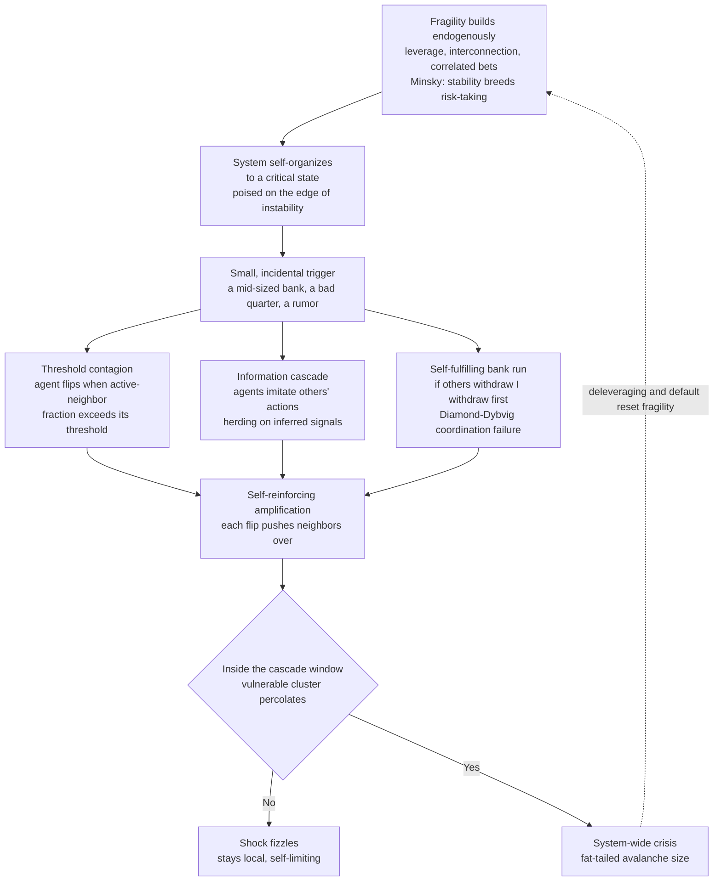

# 🌪️ Cascades, Contagion, and Financial Crises

> [!abstract] TL;DR
> Complexity economics reframes financial crises as **emergent cascade phenomena**, not responses to large external shocks. For years a system quietly accumulates **fragility** — leverage, interconnection, correlated bets — until some unremarkable **trigger** (a mid-sized bank, a bad quarter) sets off a **self-reinforcing cascade** in which one agent's failure or panic flips its neighbors, whose flips flip still others. The dynamics run through three engines: **threshold / complex contagion** (Granovetter–Watts — you flip when *enough* neighbors do, producing a sharp **cascade window**), **information cascades and herding** (you rationally imitate others' actions, so the whole crowd stampedes the same way), and **self-fulfilling bank runs** (Diamond–Dybvig — if I think you will withdraw, I withdraw first, so the solvent bank collapses on belief alone). Because the system self-organizes to a **critical state** (Bak's sandpile; Minsky's instability hypothesis), crisis sizes are **fat-tailed / power-law** — most triggers fizzle, rare ones are catastrophic — making the *timing and size* of the next crisis fundamentally unpredictable. The policy lesson is not to predict the incidental trigger but to **reduce fragility and build firebreaks**.

---

## Intuition

**Analogy — the sandpile avalanche.** Drop grains of sand, one at a time, onto a flat table. A pile builds. Most grains do nothing at all — they land, they stick, the slope inches steeper. But every so often a single, utterly ordinary grain lands on an over-steep spot and triggers an **avalanche** — sometimes a tiny slip of a few grains, once in a great while a slide that reshapes the entire pile. Here is the unsettling part: there is no *special* grain. The one that starts the big avalanche is identical to the millions that did nothing. The avalanche is not a property of the grain; it is a property of the **pile's precarious state**, a fragility built up silently, grain by grain, until the whole slope sits on the edge of collapse.

Financial crises are economic avalanches. For years, risk and leverage and interconnection quietly accumulate; the system grows more fragile even as it *looks* calm and profitable, until some unremarkable trigger sets off a cascade that no one predicted and everyone, in hindsight, "should have seen." The mistake in hindsight is to hunt for the guilty grain — the one bank, the one bad loan, the one tweet. There was no guilty grain. The crisis was **in the system**, waiting. The trigger was almost incidental; the fragility was the story.

---

## How It Works

The mainstream view treats a crisis as the system's *response* to a big **exogenous shock** — a war, an oil spike, a policy error — that arrives from outside and knocks a stable equilibrium off its perch. Complexity economics inverts this. A crisis is **endogenous**: the system's own internal dynamics build up fragility and then generate the collapse from within, needing only a small trigger to release energy that was already stored. "Where did the shock come from?" is often the wrong question. The right one is: *why was the system poised to amplify a nudge into a catastrophe?*

### Core mechanics of a cascade

1. **Fragility accumulates endogenously.** In good times, low volatility and cheap credit reward more leverage, tighter coupling, and more correlated bets. Everyone crowds into the same trades, the same funding, the same risk models. This is **Minsky's financial-instability hypothesis**: *stability breeds risk-taking breeds fragility* — the system drives itself, hedge finance to speculative to Ponzi, toward the brink. Calm is not the absence of danger; calm is how the danger is manufactured.

2. **Threshold / complex contagion (Granovetter–Watts).** Each agent flips — defaults, sells, joins a run, adopts a panic — when the **fraction** of its neighbors who have already flipped exceeds its personal **threshold**. This is *complex* contagion: unlike a disease that can spread from a single infected contact, adopting a costly or scary behavior usually needs **multiple confirmations** — several neighbors, not one. The threshold rule produces a sharp **cascade window**: in a critical range of connectivity a tiny seed sweeps the whole system, while just outside it the identical shock fizzles. The response is violently nonlinear.

3. **Information cascades and herding.** A distinct engine. When you cannot see fundamentals but *can* see what others do, it is **rational to imitate** — their action reveals private information you lack. But once a few early movers tip one way, everyone infers from *them* and piles on, ignoring their own signals. The crowd converges on a consensus built from almost no independent information — a **fragile, information-poor herd** that can be right, wrong, or reverse in an instant. Bank runs, fire sales, and bubbles all ride this "madness of crowds." (See [[Herding_Bubbles_and_Crashes]].)

4. **Self-fulfilling bank runs (Diamond–Dybvig).** The purest coordination failure. A bank funds illiquid long-term loans with deposits redeemable on demand. If I believe others will withdraw, my best move is to **withdraw first** (the bank can only pay the early birds), so I run — and so does everyone, and the *solvent* bank collapses. The model has **multiple equilibria**: a "calm" equilibrium where no one runs and a "panic" equilibrium where everyone does. Nothing about fundamentals need change — only **beliefs** (a rumor, a "sunspot") tip the system from one equilibrium to the other. The prophecy makes itself true.

5. **Self-organized criticality (Bak).** Like the sandpile, a financial system may *self-organize* to a **critical state** where it is perpetually poised on the edge of instability — not tuned there by anyone, but driven there by its own incentives. At criticality, avalanches of *all sizes* occur, following a **power-law** distribution: many small tremors, rare system-wide collapses, no characteristic scale. Crises are then **intrinsic** to the system's critical state, not anomalies to be explained away.

6. **Fat-tailed outcomes.** The statistical fingerprint of all of this: cascade sizes are **heavy-tailed**. *Most* triggers do nothing; *rare* ones are systemic. You cannot know in advance which trigger or when, and large crises are **far more frequent** than a Gaussian world would allow. Worse, the very largest events may be **"dragon kings"** (Sornette) — outliers even fatter than the power law predicts, born of the extra amplification that only a fully coupled, critical system can produce.

7. **Structure decides spread.** Whether a cascade percolates or is contained depends on **network structure**: dense connectivity, hubs, and correlated exposures make a system cascade-prone, while **modularity and firebreaks** contain contagion. Dynamics and structure are two halves of one story.

### Flow: from quiet fragility to system-wide crisis



---

## Key Concepts

**Secondary (intuition level)**
- **The avalanche is in the pile, not the grain.** The trigger that starts a crisis is ordinary; the fragility that lets it spread is the real cause. Blaming the last grain misses the point.
- **Small cause, huge effect — or nothing.** The same tiny push does nothing a hundred times and topples everything once. Trigger size tells you almost nothing about crisis size.
- **Panics are self-fulfilling.** A bank run happens because people *think* it will happen. Believing others will run makes running the smart move, which makes the run real.
- **Everyone runs to the same exit.** In a herd we copy each other, so the whole crowd can stampede the same wrong way at once.

**Undergraduate (mechanism level)**
- **Endogenous vs. exogenous crises.** Mainstream models: crisis = response to a big outside shock. Complexity economics: crisis = internally generated release of fragility the system built itself.
- **Threshold model (Granovetter).** Collective behavior as a distribution of individual thresholds; a few low-threshold actors can start a chain that pulls in the cautious majority.
- **Watts cascade window.** Global cascades occur only inside an intermediate band of connectivity — too sparse to conduct, too dense to be sensitive. A phase transition, not a slope.
- **Complex contagion.** Costly/risky behaviors need *multiple* exposures to spread, unlike simple (single-contact) disease contagion — which changes which network structures spread them.
- **Diamond–Dybvig multiple equilibria.** A demand-deposit bank has both a no-run and a run equilibrium; a shift in beliefs (a "sunspot") selects between them. Deposit insurance works by removing the panic equilibrium.
- **Information cascade.** Rational imitation: once public actions dominate private signals, agents herd, and the aggregate stops aggregating information.

**Graduate (nuance and reach)**
- **Self-organized criticality (Bak–Tang–Wiesenfeld).** Dissipative systems driven slowly can evolve *without tuning* to a critical point with scale-free avalanches; proposed as a metaphor for markets by Bak, Sornette, and others.
- **Power laws and dragon-kings.** Crisis sizes are heavy-tailed; Sornette argues the largest events are **dragon-kings** — endogenously amplified outliers *beyond* the power law, in principle carrying faint precursors (log-periodic signatures) that pure power-law tails would not.
- **Global games (Morris–Shin).** Adding a little private-information noise to Diamond–Dybvig *selects a unique* equilibrium and pins down the belief threshold at which the run tips — turning "multiple equilibria" into a computable coordination-failure boundary.
- **Contagion on financial networks (Gai–Kapadia; Battiston DebtRank).** Default cascades along interbank exposures show a **robust-yet-fragile** regime: more connectivity diversifies small shocks *and* enlarges the channel for rare systemic ones. "Too central to fail" can matter more than "too big to fail."
- **Critical slowing down (Scheffer).** Near a tipping point recovery from perturbations slows, so **variance and lag-1 autocorrelation rise** — a generic early-warning signal, though one that first-order (abrupt) transitions can defeat entirely.
- **Minsky formalized.** Endogenous leverage cycles (Geanakoplos), agent-based Minsky models, and financial-accelerator mechanisms turn "stability breeds instability" into dynamical systems with endogenous booms and busts.

---

## Python Demo

Two experiments, `numpy` + `matplotlib` only. **Part (a)** implements **Watts' threshold cascade** on random networks: each node flips from *inactive* to *active* ("default", "panic", "sell") once the **fraction** of its active neighbors exceeds its personal threshold. We seed a *single* node and sweep the average degree, showing that whether a **global cascade** erupts depends nonlinearly on connectivity — there is a sharp **cascade window** where a one-node seed can flip the whole system, and outside it the identical shock fizzles. We also collect the **distribution of cascade sizes** inside the window: it is heavy-tailed and bimodal — most triggers do nothing, rare ones are catastrophic (sandpile avalanches). **Part (b)** illustrates the **self-fulfilling bank run** as a coordination failure: with depositors who each run if enough others do, best-response dynamics have **two stable equilibria** (calm and panic) separated by an unstable **tipping point**; a rumor just below the tipping point dies out, while one just above cascades into a full run — a solvent bank collapsing on belief alone.

```python
# Cascades & crises: (a) Watts threshold cascade / cascade window / fat tails,
# (b) Diamond-Dybvig-style self-fulfilling bank run with multiple equilibria.
import numpy as np
import matplotlib.pyplot as plt
from collections import deque

rng = np.random.default_rng(1)

# ---------- graph + cascade machinery ----------
def er_graph(N, z):
    """Erdos-Renyi graph, mean degree ~z, as deduped neighbor lists (sets->lists)."""
    m = int(round(z * N / 2))                      # number of edges
    a = rng.integers(0, N, size=m)
    b = rng.integers(0, N, size=m)
    adj = [set() for _ in range(N)]
    for x, y in zip(a, b):
        if x != y:
            adj[x].add(y); adj[y].add(x)           # undirected, no self-loops/dupes
    nbrs = [list(s) for s in adj]
    deg = np.array([len(s) for s in nbrs], dtype=int)
    return nbrs, deg

def watts_cascade(nbrs, deg, thresholds, seeds):
    """Threshold cascade to a fixed point: node w flips when the fraction of its
    active neighbors reaches thresholds[w]. Returns the number of active nodes."""
    N = len(nbrs)
    active = np.zeros(N, dtype=bool)
    active_nbrs = np.zeros(N, dtype=int)
    q = deque()
    for s in seeds:
        if not active[s]:
            active[s] = True; q.append(s)          # seeds forced active
    while q:
        u = q.popleft()
        for w in nbrs[u]:
            if not active[w]:
                active_nbrs[w] += 1
                if deg[w] > 0 and active_nbrs[w] >= thresholds[w] * deg[w]:
                    active[w] = True; q.append(w)   # w just crossed its threshold
    return int(active.sum())

# ---------- (a) cascade window: single seed, sweep average degree ----------
N, PHI, TRIALS = 800, 0.18, 40                      # phi = 0.18 is Watts' canonical value
z_grid = np.linspace(0.5, 9.0, 22)
mean_size = np.zeros_like(z_grid)
p_global  = np.zeros_like(z_grid)
for j, z in enumerate(z_grid):
    sizes = np.empty(TRIALS)
    for t in range(TRIALS):
        nbrs, deg = er_graph(N, z)
        thr = np.full(N, PHI)
        seed = [int(rng.integers(N))]               # ONE random seed node
        sizes[t] = watts_cascade(nbrs, deg, thr, seed) / N
    mean_size[j] = sizes.mean()
    p_global[j] = np.mean(sizes > 0.10)             # "global" = reached >10% of nodes

# ---------- fat-tailed cascade-size distribution at a z INSIDE the window ----------
Z_IN, BATCH = 2.5, 500
dist = np.empty(BATCH)
for t in range(BATCH):
    nbrs, deg = er_graph(N, Z_IN)
    dist[t] = watts_cascade(nbrs, deg, np.full(N, PHI), [int(rng.integers(N))]) / N

# ---------- (b) self-fulfilling bank run: multiple equilibria ----------
# Each depositor has a "run threshold" t ~ Beta(5,5): she withdraws if the fraction
# of others already running exceeds t. Best response: x_next = F(x) = share with t<=x.
run_thr = rng.beta(5, 5, size=20000)
F = lambda x: np.mean(run_thr <= x)                 # fraction who run if x already run
xs = np.linspace(0, 1, 200)
Fx = np.array([F(x) for x in xs])

def run_dynamics(x0, steps=40):
    """Iterate the best-response map from an initial rumor level x0."""
    path = [x0]
    for _ in range(steps):
        path.append(F(path[-1]))
    return np.array(path)

calm  = run_dynamics(0.45)                           # rumor just BELOW the tipping point
panic = run_dynamics(0.55)                           # rumor just ABOVE the tipping point

# ---------------------------- plotting ----------------------------
fig, ax = plt.subplots(2, 2, figsize=(13, 9))

ax[0,0].plot(z_grid, mean_size, "o-", color="navy", label="mean cascade size")
ax[0,0].plot(z_grid, p_global, "s--", color="crimson", label="P(global cascade)")
win = z_grid[p_global > 0.05]
if win.size:
    ax[0,0].axvspan(win.min(), win.max(), color="gold", alpha=0.25, label="cascade window")
ax[0,0].set_title(f"(a) Cascade window  (single seed, phi = {PHI})")
ax[0,0].set_xlabel("average degree  z  (connectivity)")
ax[0,0].set_ylabel("fraction of system")
ax[0,0].legend(fontsize=8); ax[0,0].grid(alpha=0.3)

ax[0,1].hist(dist, bins=40, color="darkorange", edgecolor="k", log=True)
ax[0,1].set_title(f"(a) Fat-tailed cascade sizes  (z = {Z_IN}, inside window)")
ax[0,1].set_xlabel("cascade size  (fraction of system flipped)")
ax[0,1].set_ylabel("count  (log scale)")
ax[0,1].grid(alpha=0.3)
ax[0,1].text(0.3, 0.8, "most triggers fizzle\n(spike near 0)\n\nrare triggers are\ncatastrophic (tail)",
             transform=ax[0,1].transAxes, fontsize=9)

ax[1,0].plot(xs, Fx, color="purple", lw=2, label="best response  F(x)")
ax[1,0].plot([0,1], [0,1], "k--", lw=1, label="fixed points  y = x")
ax[1,0].plot([0], [0], "go", ms=11, label="calm equilibrium (stable)")
ax[1,0].plot([1], [1], "rs", ms=11, label="panic equilibrium (stable)")
ax[1,0].plot([0.5], [0.5], "kx", ms=13, mew=3, label="tipping point (unstable)")
ax[1,0].set_title("(b) Self-fulfilling bank run: multiple equilibria")
ax[1,0].set_xlabel("fraction currently running  x")
ax[1,0].set_ylabel("fraction who then run  F(x)")
ax[1,0].legend(fontsize=8); ax[1,0].grid(alpha=0.3)

ax[1,1].plot(calm,  "o-", color="green", label="rumor x0 = 0.45  ->  calm")
ax[1,1].plot(panic, "o-", color="red",   label="rumor x0 = 0.55  ->  full run")
ax[1,1].axhline(0.5, ls=":", c="gray", label="tipping point")
ax[1,1].set_title("(b) A belief shift across the tipping point flips the outcome")
ax[1,1].set_xlabel("iteration"); ax[1,1].set_ylabel("fraction running")
ax[1,1].legend(fontsize=8); ax[1,1].grid(alpha=0.3)

plt.tight_layout(); plt.show()

# ---------- console summary ----------
if win.size:
    print(f"(a) Cascade window (P>0.05): z in [{win.min():.1f}, {win.max():.1f}]")
print(f"(a) At z={Z_IN}: {np.mean(dist < 0.02):.0%} of triggers fizzle (<2% of system), "
      f"but {np.mean(dist > 0.30):.0%} go systemic (>30%). Heavy-tailed, not Gaussian.")
print(f"(b) Bank run: rumor 0.45 -> {calm[-1]:.2f} (calm); "
      f"rumor 0.55 -> {panic[-1]:.2f} (full run). Same fundamentals, beliefs decide.")
```

Running it: panel **(a-left)** reproduces Watts' signature — `P(global cascade)` is *zero* for sparse networks (a lone seed is trapped in a fragment), rises to a plateau across an intermediate **cascade window** (shaded gold), then collapses back to zero as the network densifies (every node too well-buffered for one flip to matter). Panel **(a-right)** is the crisis lesson: inside the window the cascade-size distribution is **heavy-tailed and bimodal** — a towering spike of triggers that fizzled and a thin tail of triggers that flipped a huge fraction of the system, exactly the sandpile signature where the *mean* hides the catastrophe. Panels **(b)** show the **self-fulfilling run**: the best-response map crosses the 45-degree line three times — a stable *calm* equilibrium at zero, a stable *panic* equilibrium at one, and an unstable **tipping point** between them — so an identical solvent bank ends up fine or destroyed depending only on whether the rumor pushed beliefs past the tipping point.

---

## Real-World Applications

> **Example — Silicon Valley Bank, March 2023.** SVB is a near-perfect Diamond–Dybvig cascade at digital speed. Fragility built endogenously: deposits ballooned during easy money, and the bank parked them in long-duration bonds that lost mark-to-market value as rates rose — a **correlated, leveraged, duration-mismatched bet** the whole system had made. The trigger was almost incidental: a capital-raise announcement and a few venture funds telling portfolio companies to pull cash. Then the **information cascade** ran through Slack and Twitter, thresholds were crossed, and roughly \$42 billion was demanded in a single day — a **self-fulfilling run** that killed a bank whose assets, held to maturity, would have paid out. The 2008 collapse of Lehman/Bear, the euro-area sovereign–bank "doom loop," and stablecoin de-pegs (Terra/UST) are the same cascade in different plumbing.

- **Systemic banking crises (2008).** Interbank, repo, and derivatives exposures form a dense network; one failure makes counterparties unable to pay *their* counterparties — a default cascade. Regulators now measure "too central to fail," not just "too big to fail." See [[Global_Financial_Crises]].
- **Modern digital bank runs.** SVB (2023), Signature, Credit Suisse, and money-market/stablecoin runs show runs are faster than ever: mobile banking and social media compress the herding-and-withdrawal cascade from days to hours.
- **Market crashes and flash crashes.** Fire-sale spirals, stop-loss and margin-call cascades, and portfolio-insurance dynamics (1987) turn a small price dip into a self-reinforcing collapse — leverage as the amplifier.
- **Sovereign-debt and currency contagion.** Belief-driven runs on a country's debt or currency (the Asian crisis, the euro crisis) are Diamond–Dybvig at national scale, with multiple equilibria and self-fulfilling attacks (see [[Currency_Crises]]).
- **Beyond finance.** Power-grid cascading failures, supply-chain disruptions, and social/political cascades (revolutions, viral movements, protest mobilization) obey the same threshold-and-percolation logic — a **general theory of systemic breakdown**.

This note sits within a family of complexity-economics siblings: the *structural* companion **Financial_Networks_and_Systemic_Risk** (how the network of exposures shapes contagion) and **Economic_Networks_and_Interaction_Structure** (the interaction topology on which cascades run); the *critical-state* foundation in **Self_Organized_Criticality_in_Economics**; the *statistical* fingerprint in **Power_Laws_and_Heavy_Tails_in_Economics** and **Fat_Tails_and_Financial_Market_Statistics**; and the *macro-dynamics* cousin **Business_Cycles_and_Endogenous_Fluctuations**, where the same endogenous logic drives booms and busts even without crises.

---

## Common Pitfalls

- **Hunting for the guilty grain.** After every crisis we blame the one bank, loan, or tweet that "caused" it. In a critical system the trigger is interchangeable — manage the **fragility**, not the spark. The counterfactual "if only X hadn't happened" is usually false; something else would have.
- **Treating crises as exogenous shocks.** Modeling a crisis as an unlucky draw from outside the system excuses the buildup that made the system explosive. The dangerous work — leverage, correlation, coupling — happened in the calm *before* the trigger.
- **"It was only a small event."** Because cascade size is nearly independent of trigger size, a small failure is not reassurance; it is exactly the profile of events that occasionally go global. Small-and-contained and small-and-catastrophic look identical at the start.
- **Averaging a fat-tailed distribution.** Reporting the *mean* or a Gaussian VaR hides the tail where the systemic event lives. Value-at-risk models that assume thin tails systematically under-price crises; use tail-aware (heavy-tailed / stress-test) thinking.
- **Assuming more connectivity is always safer.** Connectivity that diversifies *small* shocks also builds the channel for *rare systemic* ones — the "robust-yet-fragile" trap. Diversification and interconnection can trade frequent small losses for infrequent total ones.
- **Believing crises can be timed.** Fragility is measurable; the *trigger and timing* are not. Chasing a precise crisis-date forecast is the wrong goal — build resilience so the unpredictable trigger matters less.
- **Trusting early-warning signals as guarantees.** Rising variance and autocorrelation (critical slowing down) can precede a tipping point, but abrupt, first-order transitions can arrive with **no warning at all**. Absence of a signal is not safety.

---

## Related Concepts

- [[Cascades_and_Systemic_Risk]] — the systems-thinking treatment of the same Watts/Granovetter cascade window and interdependent-network fragility; this note is its financial-crisis specialization.
- [[Network_Dynamics_and_Contagion]] — the general dynamics of spread on networks that threshold and information cascades instantiate.
- [[Criticality_and_Phase_Transitions]] — self-organized criticality, sandpile avalanches, and power-law event sizes: the physics beneath fat-tailed crises.
- [[Bifurcations_and_Tipping_Points]] — the multiple-equilibria and tipping structure behind self-fulfilling bank runs and belief-driven panics.
- [[Herding_Bubbles_and_Crashes]] — the behavioral-finance account of information cascades, herding, and the bubble-then-crash pattern.
- [[Global_Financial_Crises]] — the macroeconomic anatomy of 2008-style contagion, too-big-to-fail, and systemic collapse this note models as cascades.
- [[Currency_Crises]] — self-fulfilling, multiple-equilibria speculative attacks: Diamond–Dybvig logic at national scale.
- [[Money_and_Banking]] — maturity transformation and demand deposits, the structural setup that makes banks run-prone in the first place.
- [[Economies_as_Complex_Adaptive_Systems]] — the parent frame: crises as emergent properties of an adaptive system, not equilibrium responses to shocks.
- [[Non_Equilibrium_and_Out_of_Equilibrium_Dynamics]] — endogenous fluctuations and disequilibrium dynamics, the engine that drives a system to its critical state.
- [[Schelling_Segregation_and_Emergent_Patterns]] — the sibling threshold/tipping model where local rules produce an unintended macro pattern.
- [[Complex_Adaptive_Systems]] — the general class of systems in which fragility self-organizes and cascades emerge.
- [[Feedback_Loops_and_Causality]] — a cascade is a runaway *reinforcing* feedback loop across a network: each flip makes the next more likely.
- [[Resilience_and_Robustness]] — the design response: modularity, buffers, and firebreaks that bound a cascade's blast radius.
- [[Small_World_and_Scale_Free_Networks]] — hub-heavy, short-path topologies that make contagion fast and "too central to fail" real.
- [[Collective_Behavior_and_Crowds]] — the sociological family of panics, manias, and stampedes that information cascades formalize.
- [[Social_Norms_and_Conformity]] — threshold-and-cascade dynamics for the adoption and tipping of behaviors, the non-financial cousin of runs.

---

## Review Questions

1. **(Conceptual)** Complexity economics claims a financial crisis is *endogenous and emergent* rather than a response to a large *exogenous shock*. Using the sandpile analogy and the threshold-cascade mechanism, explain precisely what "the crisis was in the system, waiting" means. Why does the near-independence of *cascade size* from *trigger size* make hunting for "the cause" of a crisis largely misguided?
2. **(Scenario)** A finance minister, watching a solvent domestic bank face a sudden withdrawal wave sparked by a viral rumor, asks whether the run is "justified by fundamentals." Using the Diamond–Dybvig multiple-equilibria picture and the demo's best-response map, explain why that is the wrong question. Which *single* policy tool most directly eliminates the panic equilibrium, and what is the mechanism by which it works even if it is never actually used?
3. **(Trade-off / critique)** A bank regulator argues that greater interconnection among institutions is safer because it diversifies idiosyncratic shocks. A complexity economist replies "robust-yet-fragile." Reconcile them: under what regime does more connectivity reduce risk, under what regime does it manufacture systemic risk, and how does the fat-tailed / power-law nature of crisis sizes change how you should *price* the efficiency gains that interconnection buys?

---

## Sources

- Watts, D. J. (2002). "A simple model of global cascades on random networks." *Proceedings of the National Academy of Sciences, 99*(9), 5766–5771. — threshold cascades and the cascade window.
- Granovetter, M. (1978). "Threshold Models of Collective Behavior." *American Journal of Sociology, 83*(6), 1420–1443. — the individual-threshold origin of collective cascades.
- Diamond, D. W., & Dybvig, P. H. (1983). "Bank Runs, Deposit Insurance, and Liquidity." *Journal of Political Economy, 91*(3), 401–419. — the multiple-equilibria, self-fulfilling bank-run model.
- Bikhchandani, S., Hirshleifer, D., & Welch, I. (1992). "A Theory of Fads, Fashion, Custom, and Cultural Change as Informational Cascades." *Journal of Political Economy, 100*(5), 992–1026. — rational herding and information cascades.
- Bak, P., Tang, C., & Wiesenfeld, K. (1987). "Self-Organized Criticality: An Explanation of 1/f Noise." *Physical Review Letters, 59*(4), 381–384. — the sandpile and self-organized criticality; extended to economics in Bak (1996) *How Nature Works*.
- Minsky, H. P. (1992). "The Financial Instability Hypothesis." *Levy Economics Institute Working Paper No. 74.* — stability breeds fragility; the endogenous-crisis thesis. See also Sornette, D. (2009), "Dragon-Kings, Black Swans and the Prediction of Crises."

---

#complexity-economics #cascades #contagion #financial-crises #tipping-points
