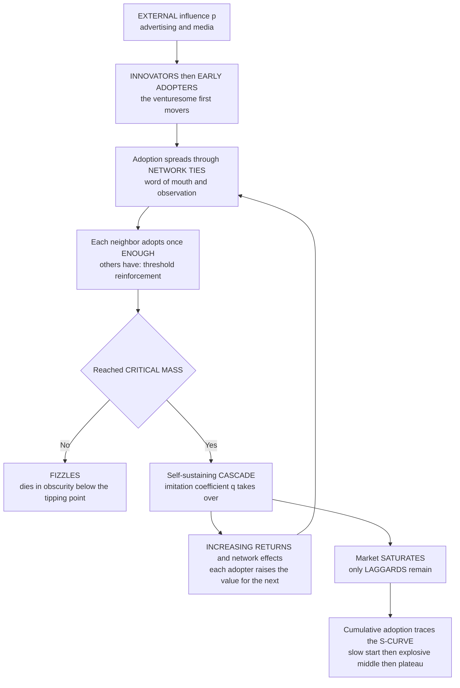

# 📈 Diffusion of Innovations and Adoption Dynamics

> [!abstract] TL;DR
> **Diffusion of innovations** is the process by which a new idea, product, technology, or behavior **spreads through a population over time** — a *social contagion* running along the ties of a network. Plot the cumulative number of adopters against time and you almost always get the same signature: the **S-CURVE** — a **slow start** (a few venturesome adopters), then **self-accelerating growth** as adoption *feeds on itself* through imitation, social proof, and network effects, then a **slowdown** as the market **saturates**. The instantaneous adoption *rate* is therefore **bell-shaped**, peaking mid-diffusion. Everett **Rogers** segmented the population into **innovators, early adopters, early and late majority, and laggards**, and Geoffrey **Moore** named the **"chasm"** — the treacherous gap between the early adopters and the pragmatic mainstream that kills most innovations. Frank **Bass** (1969) turned the whole thing into a workhorse equation: new adoptions come from **innovation** (external influence — advertising and media, coefficient $p$) plus **imitation** (internal/social influence proportional to the fraction already adopted, coefficient $q$), reproducing the S-curve and forecasting new-product sales. The deep complexity-economics twist is that diffusion runs through **network structure** and often demands **complex contagion** — adoption requires *reinforcement from several neighbors*, not a single exposure — so whether an innovation reaches **critical mass** and **tips** into self-sustaining mass adoption, or **fizzles** in obscurity, depends sensitively on **seeding, network topology, thresholds, and increasing-returns/network effects** that can lock in a winner. This positive-feedback, network-based, tipping-prone dynamic drives marketing, technology forecasting, behavior-change policy, and the spread of everything from smartphones to social norms to misinformation.

---

## Intuition

**Analogy — a new idea rarely explodes overnight; it spreads, person to person, like a contagion.** Think of how a slang word, a messaging app, or a fashion catches on. It does not arrive fully formed in everyone's head at once. First a handful of **adventurous early adopters** try it — the friend who is always first with a new gadget, the office that installs Slack before anyone has heard of it. If it catches, each new user makes it *more visible and more attractive* to their neighbors: you download the app because three friends already messaged you on it. That is a **self-accelerating wave** — the more people who have it, the faster the next people join — until nearly everyone who will ever adopt has adopted, and growth **tapers off** because the market is **saturated**. Plot the total number of adopters over time and you get the famous **S-CURVE**: a slow crawl, an explosive middle, a gentle plateau.

Here is the crucial part. Whether a new thing *tips* into that explosive middle or *dies in obscurity* is not mainly about how good it is — it is about the **network it spreads through** and the **tipping dynamics of social influence**. The same idea can go viral in one town and vanish in the next, depending on who tried it first, how clustered the community is, and how much peer reinforcement people need before they will jump. Adoption is a **contagion whose fate hangs on structure and critical mass**, not a verdict of pure merit. That single reframing — spread as network contagion rather than rational individual choice — is why diffusion sits at the heart of complexity economics.

---

## How It Works

### Core mechanics

**1. The S-curve and why it is ubiquitous.** Cumulative adoption over time follows an **S-shaped (logistic-like) curve**: a **slow start** while adopters are few and rare, then **accelerating growth** as adoption *feeds on itself* — social proof, word of mouth, and network effects mean each adopter recruits more — then a **slowdown** as the pool of remaining non-adopters shrinks and the market **saturates**. Because the cumulative curve is S-shaped, its slope — the **adoption rate** (new adopters per period) — is **bell-shaped**, peaking in the middle of the diffusion. This signature recurs across telephones, radios, televisions, refrigerators, mobile phones, the internet, and social media, which is why "the adoption curve" is a near-universal template for spreading processes.

**2. Rogers' adopter categories.** Everett Rogers segmented the bell-shaped adoption rate into five groups by *when* they adopt: **innovators** (the venturesome first, roughly one in forty), **early adopters** (respected local opinion leaders, roughly one in seven), the **early majority** (deliberate pragmatists) and **late majority** (skeptical, adopt only under pressure) who together form the bulk, and **laggards** (tradition-bound, last to adopt, the final one-sixth). Diffusion succeeds by moving *left to right* across these categories, each group taking its cue partly from the one before.

**3. The chasm.** Geoffrey Moore's addition to Rogers: the hardest and most lethal gap is between the **early adopters** (who love novelty and tolerate rough edges) and the **early majority** (who want proven, reliable, whole solutions with references). Many innovations get an enthusiastic early-adopter following and then **fall into the chasm**, never crossing into the mainstream, because what appeals to visionaries repels pragmatists.

**4. The Bass model — innovation plus imitation.** Frank Bass (1969) captured the S-curve with one differential equation. Let $F(t)$ be the cumulative *fraction* of the market that has adopted. New adoptions arrive from two sources:
- **Innovation** — an **external** influence (advertising, media, independent discovery), a constant hazard $p$ acting on everyone not yet adopted, *independent of how many others have adopted*.
- **Imitation** — an **internal/social** influence proportional to the fraction $F$ who have *already* adopted (word of mouth, observation, contagion), with strength $q$.

$$\frac{dF}{dt} = \underbrace{p\,(1-F)}_{\text{innovation}} \;+\; \underbrace{q\,F\,(1-F)}_{\text{imitation}} \;=\; \big(p + qF\big)\,(1-F)$$

The $p$ term seeds the process early (when $F \approx 0$); the $qF$ term is **positive feedback** that ignites the explosive middle; the $(1-F)$ factor is **saturation**. The pair $(p,q)$ characterizes a product's diffusion and is estimated from early sales to **forecast** the rest of the curve.

**5. Social / network contagion.** The Bass model treats the population as **well-mixed** — anyone can influence anyone. Reality is a **network**: innovations spread through **ties** (word of mouth, observation, influence), so the *structure* of the social network governs diffusion. **Hubs and influencers** accelerate spread; **clustering** can either trap a contagion or nucleate it; **weak ties** (Granovetter) bridge otherwise separate communities and carry novel information across them. Critically, contagions come in two flavors:
- **Simple contagion** — a *single* exposure suffices, like a disease or a viral joke. Spreads fastest through long-range weak ties and small-world shortcuts.
- **Complex contagion** (Centola & Macy) — adoption needs **reinforcement from multiple neighbors**, because the behavior is *costly, risky, or normative* and one endorsement is not enough. Complex contagions spread through **wide bridges** and **dense clusters**, *not* long-range shortcuts — the opposite of simple contagion. Most consequential adoptions (expensive technologies, risky health behaviors, new norms) are complex.

**6. Thresholds, critical mass, and tipping.** Granovetter's and Schelling's **threshold models** make the tipping precise: each person adopts once **enough** others already have, and people differ in their thresholds. Diffusion becomes **self-sustaining** only if the seed activates enough low-threshold adopters to push the next tier over *their* thresholds, and so on — a **cascade**. If the initial push falls short of **critical mass**, the chain breaks and the innovation **fizzles**. Whether it **tips** into mass adoption is highly sensitive to **seeding** (who and how many you start with), **network structure**, and the **threshold distribution** — there is a narrow "cascade window" in which global adoption is even possible.

**7. Increasing returns and network effects — the amplifier.** Many innovations have **network effects**: they become *more valuable the more others adopt them* (phones, fax machines, payment rails, platforms, standards, languages). This is **increasing returns / positive feedback** on top of contagion — adoption raises the *payoff* of adopting, not just its visibility — so diffusion accelerates further and can produce **winner-take-all lock-in**: whichever option reaches critical mass first wins the market, sometimes over a technically better rival. This is exactly why "get big fast" and aggressive **seeding strategies** dominate platform competition, and it is the bridge to [[Increasing_Returns_and_Path_Dependence]].

**8. Who drives diffusion — heterogeneity and the influentials debate.** Adopters differ in thresholds, connectivity, and susceptibility. A long-running question is whether a **few key influencers / opinion leaders** (highly connected or trusted nodes) are decisive, or whether it is the **susceptibility of the many** that matters. Watts and Dodds argued via simulation that large cascades are usually driven not by exceptional influentials but by a **critical mass of easily-influenced ordinary people**, so targeting a handful of "special" seeds is a fragile strategy — the network, not the individual, makes the cascade.

### Flow — external push, network contagion, tipping, and the S-curve



---

## Key Concepts

### Secondary (intuitive)

- **Ideas spread like contagions.** A new product catches on person to person, not all at once — first a few, then a rush, then everyone who ever will.
- **The S-curve.** Total adopters over time make an S: slow start, steep middle, flat top. The *rate* of new adopters is a bell that peaks in the middle.
- **Adopter types.** Innovators and early adopters go first; the cautious majority follows only once it feels safe; laggards come last, if at all.
- **The chasm.** Lots of cool things win over enthusiasts and then die because normal, practical people never pick them up.
- **Tipping and critical mass.** A trend either reaches a tipping point and takes off, or it fizzles — and which happens depends on *who* adopts early and how connected they are, not just on how good the thing is.

### Undergraduate (formal)

- **Bass model.** $\dot F = (p + qF)(1-F)$, with $F$ = cumulative adopted fraction, $p$ = **coefficient of innovation** (external), $q$ = **coefficient of imitation** (internal/social). Peak adoption rate occurs at $t^{*} = \frac{\ln(q/p)}{p+q}$ when $q>p$; larger $q$ relative to $p$ means a *later, sharper* peak — word of mouth makes the S steeper.
- **Logistic limit.** With $p \to 0$ the Bass equation becomes the pure **logistic** $\dot F = qF(1-F)$ — imitation only, the canonical self-reinforcing S-curve. With $q \to 0$ it becomes $\dot F = p(1-F)$ — external-only exponential saturation with *no* S-shape (no explosive middle).
- **Rogers categories as a normal partition.** Slicing the bell-shaped adoption rate at the mean $\pm$ standard deviations gives innovators ($\sim 2.5\%$), early adopters ($\sim 13.5\%$), early majority ($\sim 34\%$), late majority ($\sim 34\%$), laggards ($\sim 16\%$).
- **Threshold model (Granovetter).** Each agent $i$ has a threshold $\theta_i$; it adopts once the fraction of adopted contacts reaches $\theta_i$. The *distribution* of thresholds — not the average — decides whether a cascade completes; one missing threshold breaks the chain.
- **Simple vs complex contagion.** Simple: hazard rises with *any* exposed neighbor (like SIR epidemics), spreads via weak ties/shortcuts. Complex: requires $\ge \theta$ *fraction* of neighbors adopted; spreads via wide bridges and clustering, *impeded* by long-range ties.

### Graduate (advanced)

- **Bass as a mixture / hazard model.** The adoption hazard $h(t) = p + qF(t)$ is affine in the cumulative fraction; integrating gives the closed form $F(t) = \dfrac{1 - e^{-(p+q)t}}{1 + (q/p)\,e^{-(p+q)t}}$. Estimating $(p,q,m)$ (with $m$ the ultimate market size) from early sales is the standard **new-product forecasting** procedure; the generalized Bass model adds price and advertising as time-varying covariates on the hazard.
- **Watts' global-cascade condition.** On a random network with threshold contagion, global cascades require a percolating **"vulnerable cluster"** of nodes whose threshold is low enough to flip on a *single* adopted neighbor; cascades are possible only in a **connectivity window** — too sparse and the seed cannot propagate, too dense and each node has too many neighbors ever to cross its fractional threshold. Large cascades are therefore **rare but heavy-tailed** (see [[Cascades_and_Systemic_Risk]]).
- **Complex contagion and the weakness of long ties (Centola & Macy).** For $\theta \ge 2$ reinforcement, **wide bridges** (multiple independent ties between clusters) are required; a single long-range shortcut — invaluable for simple contagion — cannot transmit a complex contagion because the target sees only *one* adopted neighbor. This inverts the small-world intuition: rewiring toward randomness *speeds* simple diffusion but can *halt* complex diffusion.
- **The influentials debate (Watts & Dodds).** In threshold-model simulations, cascade size is governed far more by the **global density of easily-influenced nodes** than by the exceptional connectivity of a few seeds; "influentials" are, on average, only marginally more effective than random seeds, and cascades are an emergent property of the network's susceptibility, not of special individuals. Seeding strategy should therefore hedge across many seeds rather than bet on a handful of stars.
- **Diffusion, increasing returns, and lock-in.** When adoption confers **network externalities**, the imitation term is reinforced by a *value* feedback, not just a *visibility* feedback, sharpening the tipping into **winner-take-all** dynamics (see [[Increasing_Returns_and_Path_Dependence]]); competing standards become a race to critical mass, and the loser is starved below its own tipping point — connecting adoption dynamics to path dependence and the not-yet-written sibling `Technological_Change_and_Growth_Dynamics`.

---

## Python Demo

Two demonstrations, `numpy` and `matplotlib` only. **Part (a) — the Bass diffusion model:** integrate $\dot F = (p+qF)(1-F)$ for several innovation/imitation balances, showing the classic **S-curve** of cumulative adoption and the **bell-shaped** adoption rate, and how word of mouth (raising $q$) makes the curve start slower but rise more explosively and peak later. **Part (b) — network diffusion and tipping:** spread adoption on a **network** (a ring lattice) by **complex-contagion threshold** rules — a node adopts only when a *fraction* $\theta$ of its neighbors already have (reinforcement from several neighbors). We show that whether adoption reaches **critical mass** and **tips** into widespread adoption — versus **fizzling** — depends on the **seeding**: sweeping the seed fraction reveals a **tipping point**, and two example runs with the *same network and threshold* diverge into a **successful cascade** and a **failed** one purely because of seed size.

```python
# Diffusion of innovations & adoption dynamics:
# (a) the Bass model  -> S-curve + bell-shaped adoption rate (innovation p + imitation q)
# (b) network threshold (complex) contagion -> tipping / critical mass: cascade vs fizzle
import numpy as np
import matplotlib.pyplot as plt

# ============================================================
# PART (a) - BASS DIFFUSION MODEL
#   dF/dt = (p + q*F) * (1 - F)
#   p = coefficient of INNOVATION (external: advertising, media)
#   q = coefficient of IMITATION  (internal/social: word of mouth)
#   F = cumulative fraction of the market that has adopted
# ============================================================
def bass(p, q, T=30.0, dt=0.005):
    n = int(T / dt)
    t = np.arange(n) * dt
    F = np.zeros(n)          # cumulative adopters (fraction)
    rate = np.zeros(n)       # new adopters per unit time (dF/dt)
    for i in range(1, n):
        dF = (p + q * F[i - 1]) * (1.0 - F[i - 1])
        rate[i] = dF
        F[i] = min(F[i - 1] + dF * dt, 1.0)
    return t, F, rate

# Same market, different balance of external push vs social imitation
scenarios = [
    ("p=0.03, q=0.38  classic word-of-mouth",   0.03, 0.38, "#c0392b"),
    ("p=0.03, q=0.00  ads only, NO imitation",   0.03, 0.00, "#7f8c8d"),
    ("p=0.001,q=0.55  viral: tiny seed, big WOM", 0.001, 0.55, "#2980b9"),
    ("p=0.15, q=0.15  heavy external push",      0.15, 0.15, "#27ae60"),
]

# ============================================================
# PART (b) - NETWORK THRESHOLD (COMPLEX) CONTAGION
#   Ring lattice: each node tied to k nearest neighbors.
#   A node adopts if the FRACTION of adopted neighbors >= theta,
#   i.e. it needs REINFORCEMENT from several neighbors (complex contagion).
#   Whether adoption tips to CRITICAL MASS depends on the seeding.
# ============================================================
def ring_lattice(N, k):
    A = np.zeros((N, N), dtype=float)
    idx = np.arange(N)
    for d in range(1, k // 2 + 1):
        A[idx, (idx + d) % N] = 1.0
        A[idx, (idx - d) % N] = 1.0
    return A

def cascade(A, seed_mask, theta, max_steps=2000):
    deg = A.sum(1)
    adopted = seed_mask.astype(float).copy()
    traj = [adopted.mean()]
    for _ in range(max_steps):
        frac = (A @ adopted) / deg                 # fraction of neighbors adopted
        nxt = np.maximum(adopted, (frac >= theta).astype(float))
        if nxt.sum() == adopted.sum():             # no new adopters -> stop
            break
        adopted = nxt
        traj.append(adopted.mean())
    return adopted, traj

rng = np.random.default_rng(0)
N, k, theta = 500, 6, 0.5      # needs >= 3 of 6 neighbors -> COMPLEX contagion
A = ring_lattice(N, k)

# (b1) tipping curve: random seed FRACTION vs final adoption (averaged)
rhos = np.linspace(0.0, 0.35, 15)
final = []
for rho in rhos:
    reached = [cascade(A, rng.random(N) < rho, theta)[0].mean() for _ in range(10)]
    final.append(np.mean(reached))
final = np.array(final)

# (b2) two example runs: contiguous seed BELOW vs ABOVE the critical mass
def contiguous_seed(N, size, start=0):
    s = np.zeros(N, dtype=bool)
    s[(np.arange(size) + start) % N] = True
    return s

_, traj_fizzle  = cascade(A, contiguous_seed(N, 2), theta)   # below critical mass
_, traj_cascade = cascade(A, contiguous_seed(N, 4), theta)   # above critical mass

# ============================================================
# VISUALIZE
# ============================================================
fig, ax = plt.subplots(2, 2, figsize=(14, 9))

# (top-left) Bass cumulative adoption: the S-CURVE
for label, p, q, c in scenarios:
    t, F, _ = bass(p, q)
    ax[0, 0].plot(t, F, color=c, lw=2, label=label)
ax[0, 0].set_title("Bass model: cumulative adoption = the S-CURVE")
ax[0, 0].set_xlabel("time"); ax[0, 0].set_ylabel("cumulative fraction adopted F(t)")
ax[0, 0].legend(fontsize=8); ax[0, 0].grid(alpha=0.3); ax[0, 0].set_ylim(0, 1.02)

# (top-right) Bass adoption RATE: the bell curve
for label, p, q, c in scenarios:
    t, _, rate = bass(p, q)
    ax[0, 1].plot(t, rate, color=c, lw=2, label=label)
ax[0, 1].set_title("Bass model: adoption RATE is bell-shaped (peaks mid-diffusion)")
ax[0, 1].set_xlabel("time"); ax[0, 1].set_ylabel("new adopters per unit time")
ax[0, 1].legend(fontsize=8); ax[0, 1].grid(alpha=0.3)

# (bottom-left) network tipping: CRITICAL MASS
ax[1, 0].plot(rhos, final, "o-", color="#8e44ad", lw=2)
ax[1, 0].axhline(1.0, ls=":", c="gray")
ax[1, 0].set_title("Network diffusion: tipping at a CRITICAL MASS of seeds")
ax[1, 0].set_xlabel("initial seed fraction (random)")
ax[1, 0].set_ylabel("final fraction adopted")
ax[1, 0].grid(alpha=0.3); ax[1, 0].set_ylim(-0.02, 1.05)

# (bottom-right) same network, same threshold: seeding decides tip vs fizzle
ax[1, 1].plot(traj_cascade, color="#c0392b", lw=2,
              label=f"seed size 4 -> CASCADE ({traj_cascade[-1]*100:.0f} pct adopt)")
ax[1, 1].plot(traj_fizzle, color="#7f8c8d", lw=2,
              label=f"seed size 2 -> FIZZLES ({traj_fizzle[-1]*100:.1f} pct adopt)")
ax[1, 1].set_title("Same network & threshold: seeding decides tip vs fizzle")
ax[1, 1].set_xlabel("update step"); ax[1, 1].set_ylabel("fraction adopted")
ax[1, 1].legend(fontsize=9); ax[1, 1].grid(alpha=0.3); ax[1, 1].set_ylim(-0.02, 1.05)

plt.tight_layout()
plt.savefig("diffusion_and_adoption_dynamics.png", dpi=120)
print("Saved figure -> diffusion_and_adoption_dynamics.png")

# numeric readout
t, _, r = bass(0.03, 0.38)
print(f"Bass (p=0.03, q=0.38): peak adoption rate at t ~ {t[np.argmax(r)]:.1f}")
print(f"Network: seed size 2 -> final {traj_fizzle[-1]*100:.1f} pct  |  "
      f"seed size 4 -> final {traj_cascade[-1]*100:.0f} pct")
print("Tipping curve rises from ~seed level to ~100 pct across a critical seed fraction.")
```

Expected output (values vary slightly with parameters; the qualitative story is robust):

```
Saved figure -> diffusion_and_adoption_dynamics.png
Bass (p=0.03, q=0.38): peak adoption rate at t ~ 7.x
Network: seed size 2 -> final 0.4 pct  |  seed size 4 -> final 100 pct
Tipping curve rises from ~seed level to ~100 pct across a critical seed fraction.
```

Read the four panels as one argument. **Top-left (Bass, cumulative):** every scenario with imitation ($q>0$) traces the tell-tale **S-curve** — a slow start, an explosive middle where word of mouth ignites, and a saturating plateau; the *ads-only* case ($q=0$, grey) has **no explosive middle at all**, just diminishing exponential saturation, because nothing feeds on itself. **Top-right (Bass, rate):** the adoption *rate* is a **bell** — new adopters peak in the middle of the diffusion — and raising $q$ relative to $p$ (blue, viral) makes the bell **taller, sharper, and later**: strong word of mouth means a slower start but a more violent takeoff. **Bottom-left (network tipping):** with a **complex-contagion** threshold, final adoption stays near zero for small seed fractions, then **rises sharply through a critical seed fraction** to engulf the whole network — a **tipping point / critical mass**, not a smooth linear response to effort. **Bottom-right (fizzle vs cascade):** the punchline — on the *identical* network with the *identical* threshold, a contiguous seed of **size 2 fizzles** (never gathers enough local reinforcement to grow) while a seed of **size 4 tips into a global cascade** that fills the network. Same idea, same medium; only the seeding differs — and that difference is the entire gap between a movement and a dud. (Sparser seeds, higher thresholds, or long-range-only ties would each push a would-be cascade back below its tipping point.)

---

## Real-World Applications

> **Example — the smartphone/social-app S-curve and the race to critical mass.** The global adoption of smartphones, and of individual apps like WhatsApp, Facebook, TikTok, and Zoom, traces textbook S-curves: a slow innovator/early-adopter phase, an explosive middle powered by **network effects and imitation** (you join because your friends are there, and your joining pulls in the next person), then saturation. Because messaging and social platforms have strong **network externalities**, the diffusion is a **race to critical mass** — the first to tip locks in a self-sustaining advantage, which is why these firms burn enormous capital on **seeding and growth** (referral bonuses, free tiers, pre-installs) to get past the tipping point *before* a rival does. The math is Bass on the surface and complex-contagion-with-increasing-returns underneath.

- **Marketing and new-product forecasting.** The **Bass model** is a staple for forecasting new-product adoption and sales from early data (estimating $p$, $q$, and market size $m$), planning production and inventory, and timing launches; **viral / word-of-mouth marketing** and **seeding strategies** are direct attempts to raise the imitation term $q$ and to place seeds where they will reach critical mass. **Crossing the chasm** (Moore) frames go-to-market strategy for the leap from early adopters to the mainstream.
- **Technology adoption and forecasting.** **S-curves** anchor technology road-mapping and substitution analysis (one technology's S-curve overtaking another's — gas lamps to electric, film to digital, ICE to EV), feeding capacity planning and R&D timing; the sibling `Technological_Change_and_Growth_Dynamics` treats diffusion as the micro-engine of endogenous growth.
- **Public health and behavior change.** Spreading healthy behaviors — vaccination, contraception, hand-washing, PrEP, smoking cessation — is diffusion, and often **complex contagion** requiring reinforcement, so interventions seed **dense clusters and wide bridges** rather than scattering influencers (Centola's field experiments). Epidemic modeling shares the very same threshold/reproduction-number math (see [[Network_Dynamics_and_Contagion]]).
- **Policy and social change.** The spread of norms, reforms, and government programs follows diffusion dynamics; **nudges** and defaults exploit thresholds and social proof to push behaviors past tipping points (see [[Nudges_and_Choice_Architecture]] and [[Social_Norms_and_Conformity]]).
- **Development and agriculture.** Rogers' original studies were of **hybrid-corn adoption** among Iowa farmers; diffusion analysis still guides how agricultural and development interventions spread through village networks via demonstration and opinion leaders.
- **Virality and misinformation online.** The spread of memes, rumors, and misinformation is diffusion with a dark twist — simple-contagion *information* can outrun complex-contagion *correction* — making the same models central to platform integrity, the not-yet-written sibling `Cascades_Contagion_and_Financial_Crises`, and the study of fads, bubbles, and herding ([[Herding_Bubbles_and_Crashes]]).

---

## Common Pitfalls

- **Confusing "good product" with "will diffuse."** Merit is neither necessary nor sufficient. A superior innovation that never reaches **critical mass** dies below its tipping point, while an inferior one that tips first can lock in the market (increasing returns). Diffusion is decided by **structure, seeding, and thresholds**, not by quality alone — the core lesson.
- **Modeling a complex contagion as a simple one.** Using an epidemic/independent-cascade (single-exposure) model for a behavior that actually needs **social reinforcement** predicts spread through weak ties and lone influencers that never materializes — and prescribes exactly the wrong seeding (scattered stars instead of dense clusters and wide bridges). This is the single most consequential modeling error in viral marketing and behavior-change campaigns.
- **Betting the campaign on a few "influentials."** The Watts–Dodds result: large cascades are usually driven by a **critical mass of ordinary, easily-influenced people**, not by exceptional hubs. Paying a fortune for a handful of star seeds is fragile; hedging across many seeds is robust.
- **Assuming the S-curve is guaranteed.** The S-shape requires the **imitation** term ($q>0$). Pure external-push adoption ($q\approx 0$) is exponential-saturating with *no explosive middle* — no self-reinforcement, no takeoff. If your diffusion has no social feedback, do not expect (or forecast) an S.
- **Extrapolating an S-curve too early.** Fitting a Bass/logistic curve to the *initial* accelerating phase wildly overestimates the ceiling and timing, because early growth looks exponential and the saturation term has not yet bitten. Forecasts stabilize only once the inflection (peak rate) is in the data.
- **Ignoring the chasm.** Treating early-adopter traction as proof of mainstream success. The early majority wants proven, whole, low-risk solutions; the features and messaging that won the visionaries often actively repel the pragmatists, and the innovation stalls in the chasm.
- **Reading the aggregate S-curve as a smooth, controllable dial.** Beneath the tidy curve is a **tipping process**: outcomes are bimodal (tip or fizzle) and sensitive to seeding and topology. Averaging over many launches yields a smooth curve that describes *no single* launch — the same non-ergodic trap as in [[Increasing_Returns_and_Path_Dependence]].

---

## Related Concepts

- [[Increasing_Returns_and_Path_Dependence]] — network effects turn adoption into positive feedback with winner-take-all lock-in; the value-side amplifier of diffusion and its most important economic sibling.
- [[Network_Dynamics_and_Contagion]] — the shared machinery: reproduction numbers, epidemic thresholds, simple vs complex contagion, and how topology governs spread (Granovetter, Watts, Centola).
- [[Cascades_and_Systemic_Risk]] — threshold cascades and the "cascade window" are the tipping mechanism behind both successful diffusion and systemic failure.
- [[Bifurcations_and_Tipping_Points]] — critical mass and the tip-vs-fizzle divide are a basin-crossing bifurcation in a multistable adoption system.
- [[Criticality_and_Phase_Transitions]] — the sharp jump in cascade size at a critical seed fraction is a phase-transition-like threshold.
- [[Small_World_and_Scale_Free_Networks]] — hubs, shortcuts, and wide bridges are the substrate that speeds simple contagion but can block complex contagion.
- [[Network_Science_Fundamentals]] — the graph concepts (degree, clustering, paths) that make "diffusion runs through network structure" precise.
- [[Centrality_and_Community_Structure]] — who to seed: central nodes, bridges, and community boundaries shape whether a cascade reaches critical mass.
- [[Nonlinearity_and_Feedback]] — the imitation term is a reinforcing (positive) feedback loop; its sign and strength decide whether an S-curve even exists.
- [[Feedback_Loops_and_Causality]] — "adoption feeds adoption" is the reinforcing causal loop at the heart of the S-curve.
- [[Complex_Adaptive_Systems]] — diffusion is emergent adoption from many interacting heterogeneous adopters, a defining complexity-economics phenomenon.
- [[Schelling_Segregation_and_Emergent_Patterns]] — the sibling threshold-and-tipping model of emergent social pattern from local rules.
- [[Emergence_of_Macro_from_Micro]] — the macro S-curve emerges from micro adoption decisions along network ties; you must grow it to explain it.
- [[Agent_Based_Modeling_in_Economics]] — network-diffusion and threshold-cascade models are canonical agent-based simulations.
- [[Complexity_Economics_Overview]] — situates diffusion within the positive-feedback, network, out-of-equilibrium research programme.
- [[Social_Norms_and_Conformity]] — norm adoption is diffusion by social influence; tipping and social proof drive both.
- [[Herding_Bubbles_and_Crashes]] — bubbles are diffusion of a belief/behavior with runaway positive feedback and eventual collapse.
- [[Nudges_and_Choice_Architecture]] — defaults and social-proof nudges engineer thresholds and seeding to push adoption past its tipping point.
- [[Cultural_Evolution_and_Social_Learning]] — the evolutionary account of how behaviors spread by imitation and conformist transmission, the biology-of-diffusion sibling.
- [[The_Evolution_of_Conventions_and_Norms]] — standards and conventions are diffusions that lock in on a coordination equilibrium, the game-theoretic twin of increasing-returns adoption.
- [[Social_Networks_and_Social_Ties]] — Granovetter's strength-of-weak-ties: the network topology through which innovations and information actually travel.
- [[Collective_Behavior_and_Crowds]] — Granovetter's riot/threshold model, the sociological root of critical-mass cascades in adoption.
- [[Social_Movements_and_Revolution]] — mobilization as complex contagion needing dense reinforcement, a high-stakes cousin of product diffusion.
- [[Monopoly]] — the market structure that increasing-returns diffusion tends to produce endogenously when the first to critical mass takes all.

**Planned siblings in this vault (referenced above in prose, not yet written):** `Economic_Networks_and_Interaction_Structure` (how interaction topology shapes which innovations spread and which equilibrium is selected), `Technological_Change_and_Growth_Dynamics` (diffusion S-curves as the micro-engine of endogenous growth and technological substitution), `Cascades_Contagion_and_Financial_Crises` (the same threshold/contagion math applied to panics, runs, and misinformation), and `Innovation_Recombination_and_the_Adjacent_Possible` (where the *new* things that then diffuse come from).

---

## Review Questions

1. **(Conceptual)** Derive the shape intuition of the Bass model: starting from $\dot F = (p+qF)(1-F)$, explain precisely which term produces the **slow start**, which produces the **explosive middle**, and which produces the **saturating plateau**, and show why setting $q=0$ **destroys the S-shape** entirely. Then explain why raising $q$ relative to $p$ makes the adoption-rate bell **later and sharper**. What real-world lever does each of $p$ and $q$ correspond to?

2. **(Scenario)** You are launching a *costly, somewhat risky* new professional tool that only pays off if a user's collaborators also adopt it. Your growth team proposes the standard playbook: identify a few dozen high-follower "influencers" scattered across the industry and give them free access to spark a viral cascade. Using **complex contagion, wide bridges, critical mass, and the Watts–Dodds influentials result**, explain why this plan is likely to **fizzle**, and design a seeding strategy that would instead push the diffusion past its **tipping point**. When *would* the scattered-influencer playbook have been the right call?

3. **(Trade-off / synthesis)** The demo shows that on the *same* network with the *same* threshold, a seed of size 2 fizzles while a seed of size 4 tips into a global cascade, and that final adoption jumps sharply at a critical seed fraction. Connect this to **increasing returns and winner-take-all** dynamics: explain why, in a market with **network effects**, an objectively *inferior* product can win, what this implies for the value of **timing and "get big fast"** over incremental product quality, and why a smooth aggregate S-curve fit to many launches is a **misleading** guide to the fate of any single launch (invoke non-ergodicity).

---

## Sources

- Rogers, E. M. (2003). *Diffusion of Innovations* (5th ed.). Free Press. — the foundational text; adopter categories, opinion leaders, the S-curve, hybrid-corn studies.
- Bass, F. M. (1969). "A New Product Growth for Model Consumer Durables." *Management Science*, 15(5), 215–227. — the innovation-plus-imitation diffusion equation.
- Granovetter, M. (1978). "Threshold Models of Collective Behavior." *American Journal of Sociology*, 83(6), 1420–1443. — heterogeneous thresholds, critical mass, and cascades.
- Centola, D., & Macy, M. (2007). "Complex Contagions and the Weakness of Long Ties." *American Journal of Sociology*, 113(3), 702–734. — simple vs complex contagion and why wide bridges matter.
- Watts, D. J., & Dodds, P. S. (2007). "Influentials, Networks, and Public Opinion Formation." *Journal of Consumer Research*, 34(4), 441–458. — the case that critical mass beats special influentials.
- Moore, G. A. (1991). *Crossing the Chasm*. HarperBusiness. — the gap between early adopters and the mainstream majority.

---

#complexity-economics #diffusion-of-innovations #adoption #s-curve #network-effects
