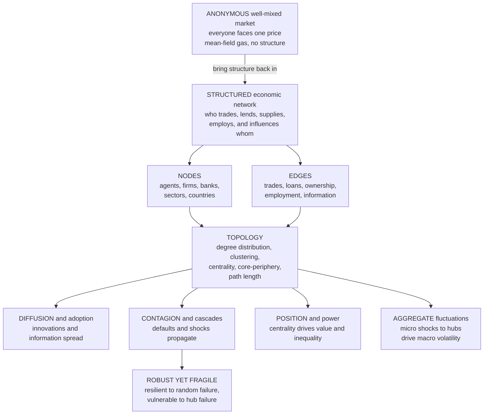

# 🕸️ Economic Networks and Interaction Structure

> [!abstract] TL;DR
> Standard economics imagines an **anonymous, well-mixed market** where everyone trades with everyone through a single price — a mean-field gas of interchangeable agents. Real economic life instead runs on **who-knows-whom**: you get your job through a friend, banks lend to *specific* other banks, firms buy from *particular* suppliers, and a shock to one node ripples through the exact **wiring** of these relationships. **Economic networks** replace the fiction of the structureless market with **structured interaction** — agents, firms, banks, sectors, and countries as **nodes**; trades, loans, ownership, employment, and information as **edges** — and the central claim of this section is that **structure is destiny**: network **topology** (heavy-tailed degree distributions with a few dominant **hubs**, core-periphery organization, centrality) governs how shocks propagate, who holds economic power, and how innovations diffuse. Connectivity makes systems efficient but **"robust yet fragile"** — resilient to random failures, catastrophically vulnerable to hub failures and targeted contagion — network **position** drives inequality and market power, and, most importantly, network structure explains how idiosyncratic **micro** shocks to central firms or banks **aggregate** into **macro** fluctuations and systemic crises rather than washing out. This note opens the vault's *Networks, Interaction & Contagion* section.

---

## Intuition

**Analogy:** Standard economics pictures the market as a room full of **gas molecules**. Each molecule (buyer, seller) bounces around at random, colliding with every other molecule with equal probability, and the only thing that matters in the end is the *average* — the temperature, the pressure, the single market-clearing **price** that every anonymous particle faces alike. No molecule has a name; no collision is special; swap any two and nothing changes. It is a beautiful, tractable fiction, and it is almost never how real economies work.

Real economic life is not a gas — it is a **wiring diagram**. You did not get your last job by broadcasting to an anonymous labor market; you got it because a *specific* friend-of-a-friend tipped you off. Lehman Brothers did not fail into a featureless void; it failed into a dense mesh of *particular* counterparties who had lent it money, and their losses cascaded down the *specific* links that bound them. A car plant does not buy "steel" from "the market"; it buys a *particular* wire-harness from a *particular* factory in a *particular* town, and when a fire closes that one factory the whole assembly line stops. The invisible web of **who-interacts-with-whom** — the network structure — is what decides whether a local disturbance fizzles out or **cascades into system-wide collapse**. The molecules have names, the collisions are wired, and **structure is destiny**.

---

## How It Works

### The departure from the anonymous market

Neoclassical theory buys its tractability by assuming interaction away. The **representative agent**, the single price, the **well-mixed market** where every buyer meets every seller — these are **mean-field** assumptions borrowed straight from the physics of ideal gases, and the vault develops the critique in `The_Limits_of_Neoclassical_Equilibrium` and the paradigm-level `Complexity_Economics_Overview`. Their appeal is that *structure cancels out*: if everyone interacts with everyone equally, the only thing left is the average, and averages are easy.

But real economies are **sparse, specific, and structured**. You trade with a handful of partners, on particular platforms, through particular intermediaries. Most possible economic relationships **do not exist** — you have never transacted with 99.9999% of the firms on Earth — and the ones that *do* exist are far from random. Bringing that structure back in is the whole project: **who** interacts with **whom** matters enormously, because local structure determines diffusion, market power, coordination, and contagion in ways that no aggregate price can capture.

### Nodes, edges, and the types of economic networks

An economic network is just **nodes** joined by **edges**, but the economic content lives in *what they represent*. Nodes are economic actors — individuals, firms, banks, sectors, or countries. Edges are economic relationships — a transaction, a loan, an ownership stake, an employment tie, a flow of information. This section maps the major families:

- **Financial networks** — interbank lending and counterparty exposures; the substrate of **systemic risk** and the object of post-2008 macroprudential regulation (developed in the planned sibling `Financial_Networks_and_Systemic_Risk`).
- **Production / input-output networks** — firms and sectors buying inputs from one another; supply chains along which shocks propagate (the planned `Input_Output_Networks_and_Production`).
- **Trade networks** — countries and firms exchanging goods; the topology of globalization and supply-chain fragility (the planned `Trade_and_Supply_Chain_Networks`).
- **Social networks** — job search, information, influence, and technology diffusion; the home of Granovetter's *strength of weak ties* (the planned `Diffusion_of_Innovations_and_Adoption_Dynamics`).
- **Ownership and corporate-control networks** — who owns whom, and how control concentrates in a few holding hubs.
- **Payment networks** — the rails along which money actually moves.

### Why topology matters

Once you draw the wiring, a handful of **structural statistics** turn out to govern almost everything the economy does:

1. **Degree distribution** — how many connections each node has. Economic networks are overwhelmingly **heavy-tailed** (often approximately scale-free): a few enormously connected **hubs** — the big banks, the keystone suppliers, the hub airports — coexist with a mass of sparsely connected nodes. This links directly to power laws and to `Small_World_and_Scale_Free_Networks`.
2. **Clustering** — tightly knit groups whose members are all connected to one another (a trading bloc, an industrial district), which trap and amplify local dynamics.
3. **Centrality** — which nodes are most important, influential, or *systemic*. A node's centrality predicts how much flow passes through it and how much damage its failure inflicts (see `Centrality_and_Community_Structure`).
4. **Core-periphery structure** — a densely interconnected **core** of big players surrounded by a loosely attached **periphery**. This is the canonical shape of the interbank system: a few money-center banks trade intensely with each other, and everyone else hangs off the edge.
5. **Path length / small-world structure** — how many hops separate two nodes. Short paths mean anything (a payment, a panic, a rumor) can reach the whole system fast.

Topology governs **how things flow, who has power, and how shocks spread**.

### Robust yet fragile — the double edge of connectivity

The most important structural insight is a paradox. A hub-dominated (scale-free) network is **robust to random failure**: knock out a node at random and you almost certainly hit an unimportant peripheral one, so the system barely notices. But it is **fragile to targeted or hub failure**: lose one of the few central hubs and the network shatters or the shock reverberates everywhere. The very structure that makes financial and trade networks *efficient* — funneling flows through a handful of super-connected intermediaries — is what makes them *vulnerable* to the failure of those intermediaries. Doyne Farmer and Andrew Haldane both named this the **"robust yet fragile"** property, and it is the fundamental trade-off between **efficiency and resilience** that runs through `Cascades_and_Systemic_Risk` and `Resilience_and_Robustness`.

### From micro shocks to macro fluctuations

The macro payoff is where economic networks overturn a cornerstone of mainstream theory. The classic **diversification argument** says idiosyncratic shocks to individual firms should **wash out** in a large economy — one firm's bad luck cancels another's good luck, leaving aggregate output smooth. That argument **assumes no structure**. Acemoglu, Carvalho, Ozdaglar, and Tahbaz-Salehi (2012) showed that when the production network is **heavy-tailed** — a few sectors supply inputs to almost everyone — a shock to one of those central sectors does **not** cancel out; it propagates downstream to the whole economy and shows up as **aggregate volatility**. Networks are the *missing link* between micro shocks and macro outcomes, and they explain phenomena — the fragility of supply chains, the propagation of financial crises — that are structurally invisible to representative-agent models.

### The wiring and its consequences



---

## Key Concepts

**Secondary (intuition level)**
- **The economy is a wiring diagram, not a gas.** You do business with *specific* partners, not with an anonymous everyone-at-once market — and that wiring decides what happens.
- **Who you know is what you get.** Jobs come through friends, loans flow between particular banks, parts come from particular factories. Position in the web is a form of wealth.
- **A few nodes matter enormously.** Some banks, suppliers, and platforms are **hubs** with far more connections than everyone else; the whole system leans on them.
- **Connectivity spreads good and bad alike.** The same links that let a great new product go viral also let a bank failure or a supply shortage cascade across the economy.
- **Robust yet fragile.** A hub-heavy network shrugs off random breakdowns but collapses if one of its central hubs goes down.

**Undergraduate (formal level)**
- **Nodes and edges.** Agents / firms / banks / sectors / countries as nodes; transactions, loans, ownership, employment, and information flows as edges. The **adjacency matrix** encodes who connects to whom.
- **Degree distribution.** Economic networks are typically **heavy-tailed** (approximately scale-free), unlike the **Poisson** distribution of a random graph — a few hubs plus many low-degree nodes, linking to power laws and preferential attachment.
- **Centrality measures.** Degree, eigenvector, betweenness, and Katz-Bonacich centrality quantify a node's importance, influence, or systemic weight; a node's *return* or *power* often tracks its centrality.
- **Core-periphery structure.** A densely linked core of large players surrounded by a sparsely attached periphery — the empirical shape of interbank and trade networks.
- **Interaction structure vs the representative agent.** Mean-field / well-mixed assumptions erase structure; network models restore it, and *who* interacts with *whom* changes diffusion, coordination, market power, and contagion.
- **Strength of weak ties.** Granovetter (1973): novel information and job opportunities travel disproportionately along *weak*, bridging ties, not strong ones — a structural, not behavioral, result.

**Graduate (research level)**
- **Network origins of aggregate fluctuations.** Acemoglu et al. (2012): with a heavy-tailed input-output network, idiosyncratic sectoral shocks fail to diversify away; aggregate volatility decays much more slowly than the `1/sqrt(n)` of the diversification argument, scaling with the network's degree-sequence tail. **Granular** origins of the business cycle (Gabaix 2011) are the firm-level analogue — a few giant firms drive GDP volatility.
- **Contagion and cascade models.** Eisenberg-Noe (2001) clearing vectors for interbank default cascades; Gai-Kapadia (2010) show contagion is a **"robust yet fragile"** knife-edge in the connectivity parameter; Elliott-Golub-Jackson (2014) separate **integration** (how much a node relies on others) from **diversification** (over how many) and show both extremes can be dangerous.
- **DebtRank and systemic-risk metrics.** Battiston et al. (2012) define feedback-centrality measures of how much distress a node can impart to the whole system — the basis for identifying **systemically important** institutions (G-SIBs).
- **Core-periphery and endogenous formation.** Networks are not exogenous: strategic **network-formation games** (Jackson-Wolinsky, Bala-Goyal) explain *why* core-periphery and star topologies emerge, and why the **efficient** network often differs from the **stable** one (a wedge with policy consequences).
- **Robustness/percolation duality.** For scale-free networks with degree exponent `2 < gamma < 3`, the percolation threshold under random failure vanishes while the threshold under targeted hub removal is tiny — the formal statement of robust-yet-fragile, shared with epidemic-threshold theory (Pastor-Satorras-Vespignani: no epidemic threshold on scale-free contact networks).
- **Position, power, and inequality.** Ballester-Calvó-Armengol-Zenou (2006) link an agent's equilibrium action and payoff to its **Bonacich centrality**; the "key player" for intervention is the one whose removal most reduces aggregate activity. Preferential attachment ("the connected get rich, the rich get connected") makes network position a structural engine of inequality.

---

## Python Demo

We show that **structure is destiny** by building two economic networks with the *same number of nodes and the same average number of connections* but **different topology**, then subjecting each to failures. The first is an **Erdős-Rényi random network** — every pair of nodes wired independently, a stand-in for the anonymous well-mixed market — whose degrees follow a tight **Poisson** hump. The second is a **Barabási-Albert scale-free network** grown by *preferential attachment* — a stand-in for a real financial or production system — whose degrees are **heavy-tailed**, producing a few giant **hubs**.

Panel (a) plots the two **degree distributions** on log-log axes, the structural statistic that drives everything. Panels (b) and (c) run the same **shock-propagation experiment** on both: we progressively remove nodes and track the fraction of the economy still connected in one giant component (a proxy for a functioning market). We remove nodes two ways — **at random** (a random firm goes bust) and **targeted at the hubs** (the most-connected banks fail first) — and the result is the **"robust yet fragile"** signature: the scale-free economy is *more* resilient than the random one to random failure, yet *far* more fragile to hub failure. Uses only `numpy` and `matplotlib`.

```python
# Structure is destiny: same node count, same mean degree, DIFFERENT topology.
# A random (well-mixed) economy vs a scale-free (hub-dominated) economy.
# We (a) contrast their degree distributions, then (b,c) shock each network by
# removing nodes randomly vs targeting hubs, tracking the giant connected
# component -- exposing the "robust yet fragile" property of real economic nets.
# numpy + matplotlib only; adjacency stored as lists of neighbor sets.
import numpy as np
import matplotlib.pyplot as plt


def barabasi_albert(n, m, seed=0):
    """Grow a scale-free network: each new node makes m edges to existing nodes
    with probability proportional to their degree ('the connected get more
    connected'). Implemented with a degree-weighted endpoint pool."""
    rng = np.random.default_rng(seed)
    adj = [set() for _ in range(n)]
    pool = []
    for i in range(m):                       # seed clique of the first m nodes
        for j in range(i + 1, m):
            adj[i].add(j); adj[j].add(i)
            pool += [i, j]
    for new in range(m, n):
        targets = set()
        while len(targets) < m:
            targets.add(pool[rng.integers(len(pool))])   # P(pick) ~ degree
        for t in targets:
            adj[new].add(t); adj[t].add(new)
            pool += [new, t]
    return adj


def erdos_renyi(n, mean_deg, seed=1):
    """Well-mixed random network: each possible edge present independently with
    probability p chosen to match the target mean degree."""
    rng = np.random.default_rng(seed)
    p = mean_deg / (n - 1)
    iu = np.triu_indices(n, k=1)
    present = rng.random(iu[0].size) < p
    adj = [set() for _ in range(n)]
    for a, b in zip(iu[0][present], iu[1][present]):
        adj[int(a)].add(int(b)); adj[int(b)].add(int(a))
    return adj


def giant_component_fraction(adj, removed):
    """Fraction of nodes in the largest connected component after 'removed'
    nodes are deleted (BFS flood-fill over the surviving nodes)."""
    n = len(adj)
    alive = np.ones(n, dtype=bool)
    if removed:
        alive[list(removed)] = False
    visited = np.zeros(n, dtype=bool)
    best = 0
    for s in range(n):
        if alive[s] and not visited[s]:
            stack, size = [s], 0
            visited[s] = True
            while stack:
                u = stack.pop(); size += 1
                for v in adj[u]:
                    if alive[v] and not visited[v]:
                        visited[v] = True; stack.append(v)
            best = max(best, size)
    return best / n


def robustness_curve(adj, order, fracs):
    """Giant-component fraction as we remove the first f*n nodes given by 'order'."""
    n = len(adj)
    return np.array([giant_component_fraction(adj, set(order[:int(f * n)]))
                     for f in fracs])


# --- build two economies: same size, same mean degree, different structure ---
N, M = 1500, 2                     # mean degree ~ 2*M = 4 for both networks
ba = barabasi_albert(N, M, seed=42)
er = erdos_renyi(N, mean_deg=2 * M, seed=7)

deg_ba = np.array([len(a) for a in ba])
deg_er = np.array([len(a) for a in er])

# removal orders: random shuffle vs hubs-first (highest degree first)
rng = np.random.default_rng(0)
rand_ba = rng.permutation(N); rand_er = rng.permutation(N)
targ_ba = np.argsort(-deg_ba); targ_er = np.argsort(-deg_er)

fracs = np.linspace(0.0, 0.45, 19)
r_ba = robustness_curve(ba, rand_ba, fracs)   # scale-free, random failure
t_ba = robustness_curve(ba, targ_ba, fracs)   # scale-free, hub failure
r_er = robustness_curve(er, rand_er, fracs)   # random,     random failure
t_er = robustness_curve(er, targ_er, fracs)   # random,     hub failure


# --- (a) degree distributions on log-log axes ------------------------------
def degree_pdf(deg):
    counts = np.bincount(deg)
    k = np.nonzero(counts)[0]
    return k, counts[k] / counts.sum()


fig, ax = plt.subplots(1, 3, figsize=(16, 5))

k_ba, p_ba = degree_pdf(deg_ba)
k_er, p_er = degree_pdf(deg_er)
ax[0].loglog(k_ba, p_ba, "o", ms=6, color="#c0392b",
             label=f"scale-free  hub degree = {deg_ba.max()}")
ax[0].loglog(k_er, p_er, "s", ms=6, color="#2471a3",
             label=f"random  max degree = {deg_er.max()}")
ax[0].set_xlabel("degree  k  (number of connections)")
ax[0].set_ylabel("fraction of nodes  P of k")
ax[0].set_title("(a) STRUCTURE: heavy-tailed hubs\nvs a Poisson peak")
ax[0].legend(fontsize=9); ax[0].grid(True, which="both", alpha=0.3)

# --- (b) robustness curves --------------------------------------------------
ax[1].plot(fracs, r_ba, "-o", ms=4, color="#c0392b",
           label="scale-free, RANDOM failure")
ax[1].plot(fracs, t_ba, "--o", ms=4, color="#c0392b",
           label="scale-free, HUB-targeted failure")
ax[1].plot(fracs, r_er, "-s", ms=4, color="#2471a3",
           label="random, RANDOM failure")
ax[1].plot(fracs, t_er, "--s", ms=4, color="#2471a3",
           label="random, HUB-targeted failure")
ax[1].set_xlabel("fraction of nodes removed")
ax[1].set_ylabel("giant component  (functioning economy)")
ax[1].set_title("(b) SHOCK PROPAGATION:\nhow fast connectivity collapses")
ax[1].legend(fontsize=8); ax[1].grid(True, alpha=0.3)

# --- (c) the 'robust yet fragile' summary at one removal level --------------
idx = np.argmin(np.abs(fracs - 0.10))          # remove 10% of nodes
bars = [r_ba[idx], t_ba[idx], r_er[idx], t_er[idx]]
labels = ["scale-free\nrandom", "scale-free\nhub-hit",
          "random\nrandom", "random\nhub-hit"]
colors = ["#c0392b", "#7b241c", "#2471a3", "#1a5276"]
ax[2].bar(labels, bars, color=colors)
ax[2].set_ylabel("giant component after removing 10% of nodes")
ax[2].set_title("(c) ROBUST YET FRAGILE:\nsame network, opposite fate")
ax[2].set_ylim(0, 1)
for i, v in enumerate(bars):
    ax[2].text(i, v + 0.02, f"{v:.2f}", ha="center", fontsize=9)

fig.suptitle("Economic networks: identical size and mean degree, but TOPOLOGY "
             "decides how shocks propagate", fontsize=13)
fig.tight_layout(rect=[0, 0, 1, 0.94])
plt.savefig("economic_networks_robust_yet_fragile.png", dpi=120)

# --- numerical confirmation -------------------------------------------------
print(f"Scale-free network: mean degree {deg_ba.mean():.2f}, biggest HUB has "
      f"{deg_ba.max()} connections.")
print(f"Random network:     mean degree {deg_er.mean():.2f}, most-connected node "
      f"has only {deg_er.max()} connections.")
print("\nAfter removing 10% of nodes, giant component remaining:")
print(f"  scale-free, RANDOM failure : {r_ba[idx]:.2f}  (ROBUST)")
print(f"  scale-free, HUB-targeted   : {t_ba[idx]:.2f}  (FRAGILE)")
print("Same hub-dominated structure -> resilient to random loss, "
      "catastrophic when the hubs are hit.")
plt.show()
```

**What the output shows.** Both economies have the *same* 1500 nodes and the *same* average of four connections, yet panel (a) reveals they are structurally worlds apart: the random network's degrees cluster in a tight Poisson hump (its biggest node has ~10-12 links), while the scale-free network's degrees fall along a heavy-tailed line with a **hub** carrying dozens to over a hundred connections — a node that a random economy structurally cannot produce. Panels (b) and (c) then show the consequence. Under **random** failure the scale-free curve stays *higher* than the random one — knocking out random nodes almost always spares the hubs, so the economy keeps functioning: it is **robust**. But under **hub-targeted** failure the scale-free curve **plummets** — removing just the top few percent of nodes fragments the whole network — while the random network, having no hubs to target, degrades at nearly the same gentle rate either way. That crossover *is* "robust yet fragile": the very hubs that make the network efficient and resilient to random loss are its Achilles' heel. Structure, not the average, decided the outcome.

---

## Real-World Applications

> **Example — mapping the interbank network after 2008.** When Lehman Brothers failed in September 2008, the damage was not proportional to Lehman's size; it was proportional to its **position** in the network of counterparty exposures. Regulators discovered they had almost no map of who was exposed to whom, and a local default detonated a global cascade. In the aftermath, central banks made **network mapping** a macroprudential priority: the ECB, the Bank of England, the Fed, and the BIS now reconstruct interbank exposure networks, compute systemic-risk metrics like **DebtRank** and **SRISK**, and designate **G-SIBs** (globally systemically important banks) whose *centrality* — not just size — earns them extra capital surcharges. The core-periphery topology of the interbank market, with a handful of money-center hubs, is precisely why the system was "robust yet fragile," and why regulators now stress-test the *wiring*, not just individual balance sheets.

- **Supply-chain resilience.** COVID-19 and the 2021 semiconductor shortage showed that a shock at one keystone supplier (a single chip fab, the Suez Canal, a magnesium plant) propagates through the **production network** to shutter assembly lines worldwide. Firms and governments now map input-output networks to find critical single-source suppliers and build redundancy — the practical face of `Input_Output_Networks_and_Production` and `Trade_and_Supply_Chain_Networks`.
- **Systemic-risk regulation.** Macroprudential policy (Basel III's SIB framework, the FSB, the ESRB) is fundamentally network analysis: identify the **too-central-to-fail** nodes, monitor concentration and interconnectedness, and require the hubs to hold more capital — the subject of the planned `Financial_Networks_and_Systemic_Risk` and `Cascades_Contagion_and_Financial_Crises`.
- **Labor markets.** Roughly half of all jobs are found through personal contacts (Granovetter). Referral networks, LinkedIn, and the *strength of weak ties* mean that access to opportunity is a **structural** phenomenon — your network position shapes your wage and mobility.
- **Platform market power and antitrust.** Digital platforms (Amazon, Visa/Mastercard, app stores, ad exchanges) are literal network **hubs** whose dominance flows from network effects and preferential attachment; competition authorities increasingly reason about market power in explicitly network terms.
- **Technology and innovation diffusion.** How fast a new product, practice, or standard spreads depends on the social/economic network it travels through — the positive twin of contagion, taken up in the planned `Diffusion_of_Innovations_and_Adoption_Dynamics`.

---

## Common Pitfalls

- **Assuming the anonymous market.** Modeling the economy as a well-mixed mean-field of interchangeable agents throws away exactly the structure that produces contagion, market power, and aggregate volatility. If interaction is sparse and specific, the average is not enough.
- **Reading "robust" as "safe."** Scale-free robustness is *specifically* to **random** failure. The same hubs make the network acutely vulnerable to **targeted** failure and to contagion that spreads through hubs with no threshold. Robustness and fragility are two faces of one structure.
- **Believing the diversification argument.** "Idiosyncratic shocks wash out in a large economy" holds only when the network has *no* central nodes. With a heavy-tailed production or financial network, micro shocks to hubs **do not** cancel — they drive macro fluctuations.
- **Treating the network as exogenous and fixed.** Economic networks are *formed* by strategic, adaptive agents and **rewire** in response to shocks (banks pull credit lines, firms re-source suppliers), so a static snapshot can badly misjudge resilience. Endogenous formation is part of the story.
- **Declaring "scale-free" from a straight-ish log-log plot.** Heavy-tailed is not the same as a genuine power law; lognormal and other distributions mimic it. The economic conclusions (robust-yet-fragile, granular volatility) need heterogeneity and hubs, but claiming a specific exponent requires rigorous fitting.
- **Confusing size with systemic importance.** A mid-sized but highly **central** intermediary (a clearing house, a keystone supplier) can be far more systemic than a large but peripheral player. Centrality, not size, predicts cascade damage.
- **Ignoring the sign of a link.** Not all connectivity is bad: the same edges that transmit crises transmit prosperity, credit, and innovation. Cutting connectivity to reduce contagion also cuts the efficiency and diffusion benefits — the efficiency-resilience trade-off is real, not free.

---

## Related Concepts

- [[Complexity_Economics_Overview]] — the paradigm this section instantiates; structured interaction is a pillar of the complexity-economics program, alongside heterogeneity, adaptation, and out-of-equilibrium dynamics.
- [[Economies_as_Complex_Adaptive_Systems]] — economic networks are the *interaction substrate* of a complex adaptive economy; topology is where agent interaction becomes system behavior.
- [[The_Limits_of_Neoclassical_Equilibrium]] — the anonymous well-mixed market this note departs from; networks are the concrete alternative to the representative agent.
- [[Increasing_Returns_and_Path_Dependence]] — preferential attachment ("the connected get rich, the rich get connected") is the network face of increasing returns, generating hubs and inequality.
- [[Agent_Based_Modeling_in_Economics]] — the computational method for simulating economies *on* networks; interaction structure is one of ABM's four core ingredients.
- [[Bounded_Rationality_and_Heterogeneous_Agents]] — the heterogeneous agents that occupy the nodes; degree and position are themselves a form of heterogeneity.
- [[Network_Science_Fundamentals]] — supplies the underlying vocabulary (nodes, edges, degree, path length, clustering, adjacency) that economic-network analysis is built on.
- [[Small_World_and_Scale_Free_Networks]] — the topologies (heavy-tailed degrees, hubs, preferential attachment) that recur in financial, trade, and production networks; this note is their economics-specific application.
- [[Cascades_and_Systemic_Risk]] — the general theory of how failures propagate on networks; economic contagion (defaults, fire sales, bank runs) is its flagship case.
- [[Network_Dynamics_and_Contagion]] — spreading processes on networks (diffusion, epidemics, information), the dynamical engine behind both economic contagion and innovation diffusion.
- [[Centrality_and_Community_Structure]] — the measures that identify systemically important nodes and tightly knit blocs; central firms/banks capture value and inflict damage.
- [[Resilience_and_Robustness]] — the robust-to-random / fragile-to-targeted duality and the efficiency-resilience trade-off, applied here to financial and supply-chain fragility.
- [[Complex_Adaptive_Systems]] — the systems-thinking framing of many interacting adaptive components, of which a networked economy is a prime example.
- [[Economic_and_Social_Complexity]] — the Santa Fe / Arthur / Beinhocker program in which structured economic interaction is a central theme.
- [[Social_Networks_and_Social_Ties]] — the sociological substrate of job search, influence, and Granovetter's weak ties, which are economic networks in the social domain.
- [[Social_Capital_and_Trust]] — network position as an asset; brokerage and closure convert connections into economic and informational returns.
- [[Graph_Theory]] — the mathematical foundation (graphs, adjacency matrices, connectivity, paths) that all network analysis formalizes.
- [[Global_Financial_Crises]] — the 2008 crisis whose network propagation motivated systemic-risk mapping and macroprudential regulation.
- [[Business_Cycle_Indicators]] — the macro fluctuations that network models (Acemoglu, Gabaix) trace to shocks at central firms and sectors rather than to a representative shock.
- [[Monopoly]] — network-effect platforms concentrate power in hubs; the network view complements the standard theory of market power.
- [[Oligopoly]] — strategic interaction among a few interconnected firms; network position shapes competitive advantage and coordination.
- [[Nash_Equilibrium_Applications]] — network-formation and games-on-networks recast strategic interaction over an explicit interaction structure.
- [[Asymmetric_Information]] — networks channel *who knows what*; information advantages accrue to well-positioned, central nodes.
- [[Currency_Crises]] — cross-border financial linkages transmit crises internationally, a trade/financial-network contagion phenomenon.

> Siblings planned for this *Networks, Interaction & Contagion* section — `Financial_Networks_and_Systemic_Risk` (interbank exposures and too-central-to-fail), `Cascades_Contagion_and_Financial_Crises` (how defaults and panics propagate), `Input_Output_Networks_and_Production` (sectoral shock propagation and granular volatility), `Trade_and_Supply_Chain_Networks` (globalization and supply-chain fragility), and `Diffusion_of_Innovations_and_Adoption_Dynamics` (how good things spread through networks) — will each link back to this section-opener.

---

## Review Questions

**Tier 1 — Conceptual**
1. Explain the "gas of molecules" versus "wiring diagram" contrast. What exactly does the anonymous well-mixed market assume, and give two concrete features of real economic life (one financial, one from the labor market) that the assumption erases.
2. Define nodes and edges for three different kinds of economic network (financial, production, and social), and name one structural statistic (degree distribution, centrality, or core-periphery) whose value would materially change how a shock spreads through that network.

**Tier 2 — Applied**
3. In the Python demo, the scale-free network is *more* resilient than the random network to random failure yet *far* more fragile to hub-targeted failure, even though both have the same average degree. Explain mechanically why the same heavy-tailed degree distribution produces both outcomes, and translate the result into a concrete statement about a real interbank network and a regulator's priorities.
4. A supply-chain manager says, "We've diversified — we buy from 200 suppliers, so one supplier failing is a rounding error." Using the network origins of aggregate fluctuations, describe two structural situations in which this reassurance is false, and what the manager should measure instead of just the *number* of suppliers.

**Tier 3 — Analytical / Open-ended**
5. Acemoglu et al. (2012) argue that idiosyncratic micro shocks need *not* wash out in a large economy. State the classic diversification argument they overturn, explain precisely which network property makes aggregate volatility decay far more slowly than `1/sqrt(n)`, and discuss what this implies for the representative-agent foundations of mainstream macroeconomics.
6. Connectivity is simultaneously the source of efficiency and diffusion (good) and of contagion and systemic risk (bad). Frame this as an efficiency-versus-resilience trade-off, discuss whether a regulator should ever *reduce* financial interconnectedness, and explain why the *stable* network that self-interested banks form may differ from the *efficient* or *socially resilient* one.

---

## Sources

- Jackson, M. O. (2008). *Social and Economic Networks.* Princeton University Press. — the standard graduate text on the economics of networks.
- Goyal, S. (2007). *Connections: An Introduction to the Economics of Networks.* Princeton University Press. — a concise economics-focused introduction.
- Acemoglu, D., Carvalho, V. M., Ozdaglar, A., & Tahbaz-Salehi, A. (2012). "The Network Origins of Aggregate Fluctuations." [*Econometrica, 80*(5), 1977–2016](https://doi.org/10.3982/ECTA9623). — micro shocks to central sectors drive macro volatility.
- Schweitzer, F., Fagiolo, G., Sornette, D., Vega-Redondo, F., Vespignani, A., & White, D. R. (2009). "Economic Networks: The New Challenges." [*Science, 325*(5939), 422–425](https://doi.org/10.1126/science.1173644). — the agenda-setting call for economic-network science.
- Haldane, A. G., & May, R. M. (2011). "Systemic risk in banking ecosystems." [*Nature, 469*, 351–355](https://doi.org/10.1038/nature09659). — the "robust yet fragile" view of financial networks.
- Newman, M. E. J. (2018). *Networks* (2nd ed.). Oxford University Press. — the comprehensive reference on network structure, percolation, and robustness.
- Granovetter, M. (1973). "The Strength of Weak Ties." [*American Journal of Sociology, 78*(6), 1360–1380](https://doi.org/10.1086/225469). — bridging ties, information, and labor markets.

---

#complexity-economics #economic-networks #network-topology #systemic-risk #interaction-structure
