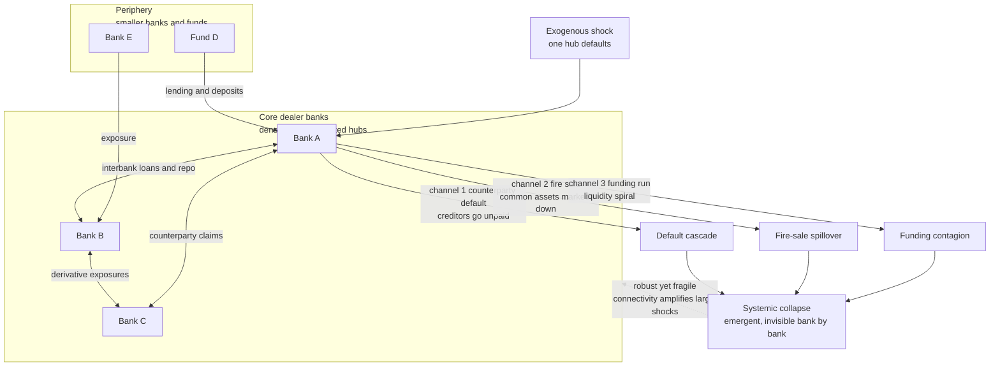

# 🕸️ Financial Networks and Systemic Risk

> [!abstract] TL;DR
> **Systemic risk** is the danger that an *entire* financial system collapses — not because any single institution is unsound, but because the institutions are **wired together** by a dense web of interbank loans, derivative contracts, and shared asset holdings. It is an **emergent property of the network**: invisible when you examine banks one at a time (the pre-2008 *microprudential* view), it lives in the **connections**. Distress **cascades** through those connections by three reinforcing channels — **counterparty default** (dominoes of unpaid debts), **fire sales** of common assets (prices crash and mark down everyone who holds them), and **funding runs** (confidence and liquidity evaporate). The core-periphery structure of real financial networks is **"robust yet fragile"**: it diversifies small shocks but *amplifies* large ones past a nonlinear tipping point, and highly-connected hubs are **too-connected-to-fail** regardless of size. Measuring this (DebtRank, SRISK) and regulating it (**macroprudential** policy) is a flagship application of complexity economics to the prevention of financial crises.

---

## Intuition

**Analogy — the doctor who checks each patient but never looks at the ward's plumbing.** Before 2008, regulators watched each bank individually, like a doctor taking each patient's temperature in turn. If every patient looked healthy, the ward was declared safe. But the banks in this ward are not independent patients — they are joined by a hidden circulatory system of loans and obligations, everyone owing and owed by everyone else. When Lehman Brothers collapsed, the shock did not stay in one bed. It raced through the shared plumbing: institutions that "looked fine" on their own suddenly could not collect the billions they were owed by Lehman, so *they* could not pay *their* creditors, and the whole ward seized up at once.

That is the entire unsettling lesson. **Systemic risk is a danger that lives not IN any single bank but in the CONNECTIONS between them.** It is an emergent property of the network — no examination of any individual institution, however thorough, can reveal it, because it is not a property of institutions at all. It is a property of the wiring. You can certify every bank as solvent and still be sitting on a system that will collapse the moment one node fails and the failure has somewhere to travel.

---

## How It Works

### Core Mechanics

1. **The financial network is a graph of obligations.** The **nodes** are financial institutions — banks, dealers, insurers, funds, clearinghouses. The **edges** are financial claims: **interbank loans**, **repo**, **derivative** exposures (who owes whom on a swap), and — crucially — **shared holdings** of the same assets. It is a dense, constantly-rewiring web of *who-owes-whom* and *who-holds-what*, and it is the medium through which both **liquidity** flows in good times and **panic** flows in bad ones.

2. **Real financial networks are core-periphery.** Empirically (mapped from central-bank exposure data), the topology is not random or evenly-meshed. A small, tightly-interconnected **core** of large dealer banks intermediates almost everything, surrounded by a **periphery** of many smaller institutions that connect mainly *to the core*, not to each other. This structure is efficient — the core is a super-highway for capital — but it concentrates systemic importance in a handful of hubs.

3. **Channel 1 — counterparty / default contagion.** When bank *j* defaults, its creditors do not get repaid. Each creditor *i* absorbs a loss on its claim, eroding *i*'s capital buffer. If the loss exceeds *i*'s capital, *i* becomes insolvent and defaults in turn, hitting *its* creditors — a **domino cascade**. This is the mechanism of the **Eisenberg-Noe** clearing model and the recursive **DebtRank** measure.

4. **Channel 2 — fire-sale / common-asset contagion.** A distressed bank raises cash by **selling assets**. Large forced sales depress the price of those assets, and because *other* banks hold the *same* assets, their balance sheets are marked down too — even though they have no direct link to the seller. This **indirect contagion through overlapping portfolios** can be *larger* than the direct-link channel, and it turns the mere *correlation* of holdings into a transmission mechanism.

5. **Channel 3 — funding / liquidity contagion.** A loss of confidence triggers **runs**: lenders refuse to roll over short-term funding, forcing more asset sales, which depress prices, which trigger more margin calls and more runs — a self-reinforcing **liquidity spiral** (Brunnermeier-Pedersen). A fourth, subtler **information channel** completes the set: bad news about one bank makes creditors doubt all *similar* banks, spreading distress by inference rather than by direct exposure.

6. **"Robust yet fragile."** Here is the structural paradox at the heart of the field. Connectivity is a **shock absorber** for *small* shocks — a loss shared across many counterparties is diluted, and dense links diversify idiosyncratic risk (the system is *robust*). But the same links are **shock spreaders** for *large* shocks — once losses exceed capital buffers, connectivity carries the failure everywhere (the system is *fragile*). The very wiring that stabilizes in calm times destabilizes in a crisis. Acemoglu-Ozdaglar-Tahbaz-Salehi formalize this as a **phase transition**: more connectivity is stabilizing below a threshold shock and *de*stabilizing above it.

7. **Too-connected-to-fail and emergence.** Because a highly-central node's failure can reach the whole network, **connectivity — not just size — creates systemic importance**. A modest-sized but hyper-connected institution (AIG's derivatives desk) can be more dangerous than a larger but peripheral one. Systemic importance is a **network** property. And because the risk is a property of the *interconnections*, it is **emergent and invisible to bank-by-bank supervision** — precisely the blind spot 2008 exposed.

### Flow / Architecture



---

## Key Concepts

### Secondary (intuition level)
- **The risk is in the wiring, not the boxes.** You can check every bank and find them all healthy, yet the *system* can be primed to collapse — because the danger lives in the connections between banks, which no single-bank checkup can see.
- **Dominoes of debt.** If a bank that owes you money fails, you take a loss; if that loss is big enough, *you* fail too, hurting whoever *you* owe. Failure travels along the "who-owes-whom" links.
- **Fire sales hurt bystanders.** A panicking bank dumping assets pushes their price down, damaging every *other* bank that holds the same assets — even ones it never did business with.
- **Robust yet fragile.** The same connections that quietly share and absorb little bumps in good times become the highways that spread a big shock everywhere in a crisis.

### Undergraduate (mechanism level)
- **Financial network.** Institutions as nodes; interbank loans, derivatives, and shared assets as edges. Typically **core-periphery**: a dense core of dealer banks plus a sparse periphery.
- **Three contagion channels.** (1) **Counterparty/default** — unpaid debts erode creditors' capital (Eisenberg-Noe, Furfine algorithm). (2) **Fire-sale/common-asset** — forced selling depresses prices, marking down co-holders (indirect contagion). (3) **Funding/liquidity** — runs and a liquidity spiral (Brunnermeier-Pedersen).
- **Too-connected-to-fail / SIFI.** A **Systemically Important Financial Institution** is systemic because of its *centrality and interconnectedness*, not only its balance-sheet size.
- **Microprudential vs macroprudential.** Regulating each bank's *own* safety versus regulating the *system's* risk — the network, its interconnections, and correlated exposures. 2008 was the failure of the former to catch the latter.
- **DebtRank.** A recursive, centrality-like measure (Battiston et al.) of how much total economic value is affected if a given node distresses — quantifying "too-central-to-fail."

### Graduate (nuance and frontier)
- **Eisenberg-Noe clearing vector.** Given an interbank liability matrix and outside assets, there exists a unique *clearing payment vector* solving who can pay whom under limited liability and proportional repayment; it is the fixed point that determines the default set and defines contagion rigorously.
- **The connectivity-stability trade-off / phase transition.** Gai-Kapadia and Acemoglu et al. show that as interbank connectivity rises, the probability of contagion is *non-monotonic*: dense networks are **robust yet fragile** — they suppress small-shock contagion (risk-sharing) but exhibit an abrupt **discontinuous jump** to system-wide collapse once shocks exceed a threshold. Contagion is highly **nonlinear** with a critical point, echoing criticality in physical systems.
- **Indirect contagion can dominate.** Cont-Schaanning and Greenwood-Landier-Thesmar model **fire-sale spillovers** and **overlapping portfolios**; empirically the common-asset channel often propagates *more* systemic loss than direct interbank links, because balance-sheet *correlation* is far denser than the contract graph.
- **Systemic-risk measures.** Beyond DebtRank: **SRISK** (expected capital shortfall in a crisis, Brownlees-Engle), **CoVaR** (Adrian-Brunnermeier — a system's VaR conditional on an institution's distress), **SinkRank**, and network-flow centrality. Each answers "who is systemic and by how much."
- **The diversification-of-diversity problem.** Haldane and Beale et al. argue that individually-optimal **diversification** makes banks' portfolios *homogeneous* — a monoculture — so a shock hits everyone at once. What is prudent for one node is dangerous for the system: the network needs **diversity across** institutions, not just diversification within each.

---

## Python Demo

The demo builds a stylized **core-periphery interbank network** (a few tightly-linked dealer banks plus many peripheral ones), each with a capital buffer and interbank claims. **Part (a)** runs a **Furfine / Eisenberg-Noe-style default cascade**: a shocked bank fails to repay its creditors, whose losses may exceed their capital and push them into default in turn, propagating until no new bank fails; we count total failures and show how the cascade depends on (i) *where* the shock lands — a central hub versus a peripheral node — and (ii) the *coupling/leverage* of the network, demonstrating the **"robust yet fragile"** and **nonlinear tipping** (phase-transition-like jump) behavior. **Part (b)** illustrates the **fire-sale / common-asset channel**: banks holding overlapping portfolios are marked down when a distressed bank dumps assets, so raising the price-impact turns a handful of direct failures into a system-wide indirect cascade. Uses only `numpy` and `matplotlib`.

```python
# Financial contagion in a core-periphery interbank network.
# (a) Furfine / Eisenberg-Noe default cascade: a defaulting bank fails to repay
#     creditors; if a creditor's loss exceeds its capital it defaults too.
#     We show cascade size vs shock size and vs coupling, for a HUB vs a
#     PERIPHERY seed -> robust-yet-fragile, nonlinear tipping.
# (b) Fire-sale / common-asset channel: forced selling depresses shared-asset
#     prices, marking down co-holders -> indirect contagion.
import numpy as np
import matplotlib.pyplot as plt

rng = np.random.default_rng(7)


# ----------------------------- build the network -----------------------------
def build_core_periphery(n_core=6, n_periph=44, kappa=0.03, w_core=1.0,
                         w_periph=0.25, ext_cushion=5.0, seed_rng=None):
    """W[i, j] = i's CLAIM on j (money i lent to j). Capital = kappa * assets."""
    r = seed_rng or rng
    N = n_core + n_periph
    core = np.arange(n_core)
    periph = np.arange(n_core, N)
    W = np.zeros((N, N))
    for i in core:                                  # dense, large core-core links
        for j in core:
            if i != j:
                W[i, j] = w_core * r.uniform(0.5, 1.5)
    for p in periph:                                # periphery links to 2 core hubs
        for c in r.choice(core, size=2, replace=False):
            W[p, c] = w_periph * r.uniform(0.5, 1.5)   # p's claim on core c
            W[c, p] = w_periph * r.uniform(0.5, 1.5)   # core c's claim on p
    interbank_assets = W.sum(axis=1)                # row sum = total claims held
    external_assets = interbank_assets + ext_cushion
    total_assets = external_assets + interbank_assets
    capital = kappa * total_assets                  # equity buffer (fixed)
    return W, capital, external_assets, core, periph


def furfine_cascade(W, capital, shock):
    """Loss-given-default = 1. `shock` is a vector of exogenous capital losses.
    Returns a boolean default mask after the cascade reaches a fixed point."""
    resid = capital - shock
    defaulted = resid < 0
    stack = list(np.where(defaulted)[0])
    while stack:
        j = stack.pop()
        resid = resid - W[:, j]                     # creditors of j lose their claim
        newly = np.where((~defaulted) & (resid < 0))[0]
        for k in newly:
            defaulted[k] = True
            stack.append(int(k))
    return defaulted


W, capital, ext, core, periph = build_core_periphery()
N = len(capital)
hub = int(core[0])                                  # a central dealer bank
edge = int(periph[-1])                              # a peripheral bank


# --------- (A) cascade size vs SHOCK size: hub vs periphery seed ----------
shock_grid = np.linspace(0.0, 0.15, 40)             # shock as fraction of assets
casc_hub, casc_edge = [], []
for s in shock_grid:
    for seed_node, out in ((hub, casc_hub), (edge, casc_edge)):
        shock = np.zeros(N)
        shock[seed_node] = s * ext[seed_node]        # wipe s% of the bank's assets
        out.append(furfine_cascade(W, capital, shock).mean())
casc_hub, casc_edge = np.array(casc_hub), np.array(casc_edge)


# --------- (B) cascade size vs COUPLING (robust yet fragile) ----------
# Scale interbank exposures by m while holding capital fixed: rising coupling.
coupling = np.linspace(0.2, 3.0, 40)
frag_hub, frag_edge = [], []
for m in coupling:
    Wm = W * m
    for seed_node, out in ((hub, frag_hub), (edge, frag_edge)):
        shock = np.zeros(N)
        shock[seed_node] = capital[seed_node] + 1e-6    # force the seed to fail
        out.append(furfine_cascade(Wm, capital, shock).mean())
frag_hub, frag_edge = np.array(frag_hub), np.array(frag_edge)


# --------- (b) fire-sale / common-asset channel ----------
def fire_sale(H, cash, debt, shock_assets, shock_size, impact, rounds=50):
    """Overlapping portfolios H (banks x assets). A price shock forces insolvent
    banks to liquidate; sales depress shared-asset prices, marking down others."""
    n, M = H.shape
    p = np.ones(M)
    p[shock_assets] -= shock_size
    defaulted = np.zeros(n, dtype=bool)
    holdings = H.astype(float).copy()
    for _ in range(rounds):
        equity = holdings @ p + cash - debt
        newly = (equity < 0) & (~defaulted)
        if not newly.any():
            break
        sell = holdings[newly].sum(axis=0)          # fire-sale volume per asset
        holdings[newly] = 0.0
        defaulted[newly] = True
        p = np.clip(p - impact * sell, 0.0, None)   # linear price impact
    return int(defaulted.sum())

nB, M = 60, 5
H = (rng.random((nB, M)) < 0.5) * rng.uniform(1.0, 3.0, (nB, M))  # overlapping books
cash = rng.uniform(1.0, 2.0, nB)
debt = H.sum(axis=1) + cash - 0.9                   # thin ~0.9 equity buffer each
impact_grid = np.linspace(0.0, 0.06, 40)
fs_defaults = [fire_sale(H, cash, debt, shock_assets=[0, 1], shock_size=0.25,
                         impact=imp) / nB for imp in impact_grid]


# ------------------------------- plotting -------------------------------
fig, (axA, axB, axC) = plt.subplots(1, 3, figsize=(16, 4.8))

axA.plot(shock_grid, casc_hub, "o-", color="crimson", label="shock hits a HUB (core)")
axA.plot(shock_grid, casc_edge, "s--", color="navy", label="shock hits PERIPHERY")
axA.set_title("(A) Nonlinear tipping vs shock size")
axA.set_xlabel("shock as fraction of bank assets")
axA.set_ylabel("fraction of banks defaulted")
axA.legend(fontsize=8); axA.grid(True, alpha=0.3)

axB.plot(coupling, frag_hub, "o-", color="crimson", label="hub seed forced to fail")
axB.plot(coupling, frag_edge, "s--", color="navy", label="periphery seed forced to fail")
axB.axvspan(0.2, 1.0, color="green", alpha=0.12, label="robust: shocks absorbed")
axB.set_title("(B) Robust yet fragile vs coupling")
axB.set_xlabel("interbank coupling / leverage  (exposure scale)")
axB.set_ylabel("fraction of banks defaulted")
axB.legend(fontsize=8); axB.grid(True, alpha=0.3)

axC.plot(impact_grid, fs_defaults, "o-", color="darkorange")
axC.axvline(0.0, color="gray", ls=":")
axC.set_title("(b) Fire-sale / common-asset channel")
axC.set_xlabel("price-impact strength")
axC.set_ylabel("fraction of banks defaulted")
axC.grid(True, alpha=0.3)

plt.tight_layout(); plt.show()

print(f"Network: {N} banks ({len(core)} core, {len(periph)} periphery)")
print(f"Hub-shock cascade at 6% shock:       {casc_hub[shock_grid.searchsorted(0.06)]:.0%}")
print(f"Periphery-shock cascade at 6% shock:  {casc_edge[shock_grid.searchsorted(0.06)]:.0%}")
print(f"Fire sale: defaults with zero impact {fs_defaults[0]:.0%} -> "
      f"with impact {fs_defaults[-1]:.0%}")
```

Panel **(A)** is the tipping signature: shocking a **peripheral** bank barely moves the system (its small exposures die out locally — a single failure), but once a shock to a **hub** exceeds its thin capital buffer, the cascade jumps **discontinuously** to a system-wide default — same rule, same buffers, only the *location* changed. Panel **(B)** is **robust yet fragile**: at low coupling the network *absorbs* even a hub's failure (creditors' losses stay below capital — shaded "robust" region), but as interbank exposures grow relative to the fixed capital buffer, one hub failure abruptly topples the whole core — connectivity flips from shock-absorber to shock-amplifier. Panel **(b)** shows the **fire-sale channel**: with zero price impact only the directly-shocked banks fail, but as forced selling depresses shared-asset prices, mark-to-market losses cascade through banks that *never traded with each other* — indirect contagion through overlapping portfolios, often the larger threat.

---

## Real-World Applications

> **Example — the 2008 Global Financial Crisis, the archetype.** 2008 revealed systemic risk vividly and at scale. **Lehman Brothers'** failure cascaded through *counterparty* networks (funds and banks that were owed money by Lehman suddenly could not pay their own creditors) and *funding* networks (the tri-party repo and money-market funds froze — the Reserve Primary Fund "broke the buck," sparking a run). **AIG's** derivative web meant one insurer's collapse threatened dozens of major banks that had bought protection from it, forcing a public bailout of a *connection*, not a bank. And **fire sales** of mortgage assets marked down every institution that held them. Regulators had supervised banks **individually** (microprudential) and missed the **system-level** (macroprudential) risk in the connections — captured by "the Queen's question" ("why did nobody see it coming?") and Andrew Haldane's *Rethinking the Financial Network*, the speech that put financial-network science on the regulatory map.

- **Macroprudential regulation and central-bank stress testing.** Post-2008 supervisors (Fed, Bank of England, ECB, BIS) now **map interbank and exposure networks** and run **network stress tests** that simulate cascades, moving from regulating parts to regulating the system. Tools include **capital surcharges for SIFIs**, limits on interconnectedness and concentration, and continuous network monitoring.
- **Identifying and regulating SIFIs.** Basel III's G-SIB framework scores banks partly on **interconnectedness**, and measures like **DebtRank**, **SRISK**, and **CoVaR** rank institutions by systemic contribution — formalizing *too-connected-to-fail*.
- **Central clearing (CCPs).** After 2008, derivatives were pushed into **central counterparties** to net exposures and mutualize risk — but a CCP **concentrates** risk into a single node, creating a *new* too-big-to-fail entity whose own failure is now a top-tier systemic concern.
- **Crypto and DeFi systemic risk.** The 2022 collapses (Terra/Luna, Three Arrows, FTX) were textbook network contagions in a new, tightly-coupled, highly-leveraged system — cascading counterparty defaults and fire sales of correlated tokens — extending financial-network analysis to on-chain graphs.
- **Circuit breakers and market-infrastructure design.** Trading halts, margin rules, and **firebreaks** are deliberate attempts to interrupt cascades before they go global — engineering resilience into the network.

---

## Common Pitfalls

- **The microprudential fallacy — sound parts, unsound whole.** Certifying every bank as individually solvent tells you almost nothing about systemic safety, because the risk is a property of the *connections*, not the nodes. This was *the* 2008 blind spot: supervising banks one at a time cannot see an emergent network risk.
- **Assuming more connectivity is always safer (the diversification trap).** Connectivity that shares *losses* also shares *failures*. Below a threshold it diversifies and stabilizes; above it, it propagates and destabilizes — "robust yet fragile." Adding links can push a system *into* the fragile regime, not out of it.
- **Ignoring the fire-sale / common-asset channel.** Focusing only on direct contractual links misses the often-larger **indirect** contagion through **overlapping portfolios**: banks with no direct exposure to each other still sink together when they hold the same assets and one is forced to sell.
- **Individually-prudent diversification breeding a monoculture.** When every bank diversifies into the *same* optimal portfolio, the system becomes **homogeneous** and a single shock hits everyone at once — Haldane's "diversification of diversity" warning. What is safe for one node is dangerous for the system.
- **Averaging away the tail.** Systemic loss is **nonlinear and bimodal** — usually tiny, occasionally catastrophic. Reporting an *expected* loss hides the phase-transition jump where the real danger lives. Manage the tail, not the mean.
- **Trusting early-warning signals as guarantees.** Rising correlation and interconnectedness can precede a crisis, but cascades — especially fire-sale and funding spirals — can arrive abruptly with little warning. Absence of a signal is not safety.

---

## Related Concepts

- [[Cascades_and_Systemic_Risk]] — the general systems-thinking treatment (Watts cascade window, tight coupling, interdependent networks); *this* note is the finance-specific instantiation of that machinery.
- [[Network_Dynamics_and_Contagion]] — the threshold-and-spreading dynamics that drive contagion on any network, of which financial contagion is a leading case.
- [[Network_Science_Fundamentals]] — nodes, edges, degree, and the topology of the who-owes-whom graph.
- [[Centrality_and_Community_Structure]] — the centrality measures (adapted into DebtRank, SinkRank) that identify systemically-important hubs — *too-connected-to-fail*.
- [[Small_World_and_Scale_Free_Networks]] — the hub-heavy topology of core-periphery finance and why hubs concentrate systemic risk.
- [[Criticality_and_Phase_Transitions]] — the nonlinear tipping point where the network flips abruptly from robust to catastrophic — the "robust yet fragile" phase transition.
- [[Resilience_and_Robustness]] — modularity, buffers, and firebreaks as network-design responses; the resilience-vs-efficiency trade-off.
- [[Bifurcations_and_Tipping_Points]] — the mathematics of the sudden, discontinuous jump that makes crises hard to predict and price.
- [[Economies_as_Complex_Adaptive_Systems]] — systemic risk as emergence: a property of the interacting whole, not of any component.
- [[Complexity_Economics_Overview]] — the broader program of which financial-network analysis is a flagship application.
- [[Agent_Based_Modeling_in_Economics]] — the simulation method used to grow contagion cascades and stress-test network structures.
- [[Credit_Risk]] — the institution-level modeling of default and counterparty exposure that forms the *edges* of the contagion network.
- [[Value_at_Risk]] — the tail-risk framing; network measures like CoVaR and SRISK generalize VaR from a single institution to the system.
- [[Global_Financial_Crises]] — the macroeconomic account of 2008-style contagion, too-big-to-fail, and systemic collapse this note models structurally.
- [[Herding_Bubbles_and_Crashes]] — correlated behavior and information contagion that homogenize exposures and prime the network for a cascade.

Within this section, this note connects in prose to the not-yet-written siblings *Economic_Networks_and_Interaction_Structure* (the general economic-network topology), *Cascades_Contagion_and_Financial_Crises* (the dynamics of crisis propagation), *Power_Laws_and_Heavy_Tails_in_Economics* and *Fat_Tails_and_Financial_Market_Statistics* (why systemic losses are heavy-tailed and non-Gaussian), and *Complexity_and_Financial_Regulation* (the macroprudential policy program).

---

## Review Questions

1. **(Conceptual)** Explain why systemic risk is called an *emergent* property "invisible to bank-by-bank supervision." Using the doctor-and-ward analogy, state precisely what a microprudential examination measures, what it *structurally cannot* measure, and why certifying every institution as solvent can still leave the system primed to collapse.
2. **(Scenario)** You regulate a banking system that is highly interconnected and has just come through a decade of calm — connectivity is at an all-time high and everyone points to how well small shocks have been absorbed. Using the "robust yet fragile" result and the phase-transition behavior in the demo, argue whether rising connectivity should reassure or alarm you, and name two macroprudential levers you would pull *before* a large shock arrives — explaining which contagion channel each one targets.
3. **(Trade-off / critique)** A bank's risk officer notes that its portfolio is beautifully diversified and its VaR is low, so it is individually safe. A systemic-risk analyst counters that *every* major bank has diversified into the *same* optimal portfolio. Adjudicate: how can a decision that lowers each bank's *individual* risk *raise* systemic risk? Reference the fire-sale/common-asset channel and Haldane's "diversification of diversity," and explain why DebtRank or SRISK would flag a danger that VaR misses.

---

## Sources

- Haldane, A. G. (2009). "Rethinking the Financial Network." *Speech at the Financial Student Association, Amsterdam*, Bank of England. — the speech that put financial-network science on the regulatory map; robust-yet-fragile.
- Battiston, S., Puliga, M., Kaushik, R., Tasca, P., & Caldarelli, G. (2012). "DebtRank: Too Central to Fail? Financial Networks, the FED and Systemic Risk." *Scientific Reports, 2*, 541. — recursive centrality measure of systemic impact.
- Acemoglu, D., Ozdaglar, A., & Tahbaz-Salehi, A. (2015). "Systemic Risk and Stability in Financial Networks." *American Economic Review, 105*(2), 564–608. — the connectivity phase transition: stable for small shocks, fragile for large ones.
- Gai, P., & Kapadia, S. (2010). "Contagion in Financial Networks." *Proceedings of the Royal Society A, 466*, 2401–2423. — analytic model of default cascades and the robust-yet-fragile property.
- Eisenberg, L., & Noe, T. H. (2001). "Systemic Risk in Financial Systems." *Management Science, 47*(2), 236–249. — the clearing-vector model of default contagion.
- Brunnermeier, M. K., & Pedersen, L. H. (2009). "Market Liquidity and Funding Liquidity." *Review of Financial Studies, 22*(6), 2201–2238. — the funding-liquidity spiral channel.

---

#complexity-economics #systemic-risk #financial-networks #contagion #macroprudential
