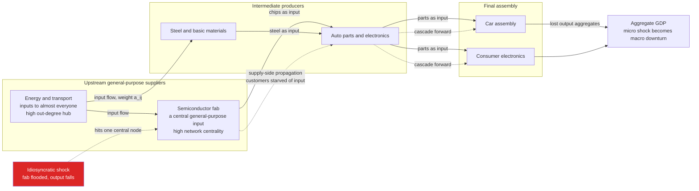

# 🏭 Input-Output Networks and Production

> [!abstract] TL;DR
> The economy's **production side is a network**: firms and sectors are **nodes**, and the fact that one sector's **output** is another's **input** wires them into a vast web of **supplier-customer** links — the map of who-supplies-whom that turns raw materials into final goods, first formalized by **Leontief's input-output tables** (Nobel 1973). This structure is decisive. A shock to one sector does **not** stay local: it propagates **upstream** (a supplier's disruption starves its customers of inputs — the dominant supply-chain channel) and **downstream** (a customer's collapse removes demand for its suppliers). And — the landmark **"network origins of aggregate fluctuations"** result of **Acemoglu, Carvalho, Ozdaglar & Tahbaz-Salehi (2012)** — because the network is **heavy-tailed** (a few **general-purpose suppliers** like energy, transport, and semiconductors feed almost everyone), **idiosyncratic** sector shocks do **not** wash out as the naive `1/sqrt(N)` diversification argument predicts. Instead they aggregate, through the network's **central** nodes, into **macro** volatility and business cycles — an effect reinforced by **Gabaix's granularity** (giant firms' shocks moving the aggregate because the size distribution is fat-tailed). This network view explains modern **supply-chain fragility** (chip shortages, COVID, the Suez blockage), pinpoints **chokepoint** sectors for resilience policy, and links production structure to growth. Micro disturbances become macro fluctuations *through the wiring*.

---

## Intuition

**Analogy:** A car is not made by "the car industry." It is *assembled* from parts bought from suppliers, who buy sub-components and materials from *their* suppliers, who depend on specialized chips from a single fabrication plant in Taiwan, which itself cannot run without one particular lithography machine built by one company in the Netherlands, which needs rare optics from one workshop in Germany. Follow any product backward and it fans out into a sprawling, intricate web of firms and sectors feeding into one another — steel needs coal, coal needs transport, transport needs fuel, fuel needs refineries, refineries need pumps and chips and steel again. The economy is that web.

Now choke one node. A factory floods in Thailand; a container ship wedges sideways in the Suez Canal; a fire closes the one plant that makes a particular wire-harness; a virus shutters assembly lines across a continent. The disruption does **not** stay where it started. It ripples **up and down** the production web — customers of the stricken node run out of an input they cannot substitute and halt their own lines, whose customers then halt, and so on — and a tiny, local, "idiosyncratic" shock can amplify into a national recession. Standard macroeconomics, which treats sectors as independent and imagines shocks averaging harmlessly away, is structurally **blind** to this. The whole point of the input-output view is that the *wiring* is what turns a stuck ship into a supply crisis, and a chip shortage into a lost year of auto production.

---

## How It Works

### The production side as a network

Draw the economy as a directed, weighted graph. Each **node** is a sector (or firm). A directed **edge** from sector `i` to sector `j` means "`i` supplies an input to `j`," and its **weight** is *how much* of `i`'s output `j` needs per unit of its own production. This is the **input-output** picture: agriculture supplies food processing, steel supplies autos, energy and transport supply nearly everyone. The output of one node is the input of another, and the whole graph is the machine that transforms primary factors (labor, capital, raw materials) into final consumption goods.

Two structural facts about this graph do all the work:

1. **It is heavy-tailed, not balanced.** A handful of sectors are **general-purpose suppliers** — energy, transport, finance, semiconductors, basic chemicals — feeding into a huge number of downstream industries. In network terms they have enormous **weighted out-degree** and high **centrality**. Most sectors, by contrast, sell to only a few customers. The out-degree distribution has a fat tail: a few hubs, many peripheral nodes.
2. **Inputs are complements, not substitutes (in the short run).** You cannot make a car with 90 percent of the parts. Leontief's original assumption of **fixed proportions** — no substituting labor for chips on short notice — is what makes a *missing* input catastrophic rather than merely costly. This complementarity is the amplifier behind supply-chain cascades.

### The Leontief input-output framework

Wassily Leontief's input-output tables (Nobel 1973) are the data backbone. Collect the **technical coefficient matrix** `A`, where `A[i,j]` records how much of sector `i`'s output is needed to produce one unit of sector `j`'s output. If `x` is the vector of gross outputs and `d` the vector of **final demand** (consumption, investment, exports), then output must satisfy

> `x = A x + d`  — each sector's output covers what other sectors consume as intermediate input (`A x`) plus final demand (`d`).

Solving gives the celebrated **Leontief inverse**:

> `x = (I - A)^{-1} d`  — where `L = (I - A)^{-1}` is the total-requirements matrix.

`L` is a *network* object: `L = I + A + A^2 + A^3 + ...` sums the **direct** requirement (`A`, first-order suppliers), plus **indirect** requirements through paths of every length (you need steel to make cars, coal to make steel, transport for coal, fuel for transport...). Entry `L[i,j]` is the total output of `i` — direct and indirect — triggered by one unit of final demand for `j`. Row sums of `L` measure how important each sector is as an upstream supplier; a general-purpose input like energy has a huge row sum. This gives each sector a **Domar weight** (its sales as a share of GDP), which — by **Hulten's theorem** — is exactly the elasticity of aggregate output to a productivity shock in that sector. Central suppliers have large Domar weights; peripheral ones tiny.

### Shock propagation: upstream and downstream

A disturbance to one node moves through the graph along two channels:

- **Upstream / supply-side propagation (the dominant supply-chain channel).** A supplier is disrupted, so its customers lose an input they cannot fully substitute; their output falls; *their* customers then lose *their* input, and so on **forward** through the network. A flooded chip fab does not just hurt the fab — it starves every downstream industry that needs chips. This is the channel behind the semiconductor and COVID disruptions.
- **Downstream / demand-side propagation.** A customer collapses, so demand for its suppliers' output evaporates; the suppliers cut production, hurting *their* suppliers **backward** through the network. An auto-sales crash ripples back to parts, steel, and coal.

How far and how hard a shock travels is governed by **network structure**: shock a chokepoint hub and the disruption reaches almost everyone; shock a peripheral node and it dies out. The network is the transmission mechanism.

### The network origins of aggregate fluctuations

Here is the landmark result. The old **diversification argument** says: an economy of `N` sectors hit by *independent, idiosyncratic* shocks should have those shocks average out — aggregate volatility ought to fall like `1/sqrt(N)` (the law of large numbers), so by the time `N` is in the hundreds, sector-specific shocks are macroeconomically invisible, and only *aggregate* shocks (monetary, technological) could possibly drive business cycles. **Lucas (1977)** used exactly this logic to dismiss sectoral shocks as a source of the cycle.

**Acemoglu, Carvalho, Ozdaglar & Tahbaz-Salehi (2012)** showed the argument fails when the production network is **heavy-tailed**. If a few sectors are central general-purpose suppliers, the vector of Domar weights is *concentrated*, and aggregate volatility decays **far more slowly** than `1/sqrt(N)` — its decay rate is set by the fatness of the network's degree tail, not by the number of sectors. Idiosyncratic shocks to **central** sectors do **not** diversify away; they propagate through the hubs and drive **macro** volatility and business cycles. Micro disturbances become macro fluctuations **through the network** — a profound challenge to the idea that macro fluctuations require aggregate shocks.

**Gabaix's granularity (2011)** is the complementary firm-level insight. Because the **firm-size distribution is fat-tailed** (a few giants — Walmart, a dominant chipmaker, a systemic bank — account for a huge share of output; this links to power laws), idiosyncratic shocks to the *largest* firms do not average away either. The economy is **"granular"**: its aggregate fluctuations are partly the sum of shocks to a small number of very large units. Empirically, Gabaix found that idiosyncratic shocks to the top 100 US firms explain roughly a *third* of aggregate volatility. Granularity (firm size) and network centrality (position) are two faces of the same failure of the law of large numbers under heavy tails.



---

## Key Concepts

### Secondary Level

- **The economy is a supply web, not a list of separate industries.** Everything is made from something else. Chips go into cars *and* phones *and* medical machines; energy goes into everything. Draw arrows for "who supplies whom" and you get a giant web.
- **Choke one node and the trouble spreads.** When a key factory or shipping lane goes down, the companies that needed its output cannot make *their* products, so *their* customers are stuck too. The problem does not stay put — it travels along the web.
- **A few nodes matter enormously.** Losing a corner-store supplier barely registers; losing the country's power grid or its main chip source is a disaster. Some nodes are wired into almost everything, and those are the ones to watch.
- **This is why one shortage can shrink the whole economy.** A single missing input — a chip, a stuck ship in the Suez Canal — can idle whole industries at once, which is how a small local problem becomes a national slowdown.

### Undergraduate Level

- **Input-output matrix `A`.** `A[i,j]` = amount of sector `i`'s output used to make one unit of sector `j`'s output. Columns describe a sector's "recipe" of inputs; rows describe who a sector supplies. This is Leontief's core object.
- **The Leontief inverse `L = (I - A)^{-1}`.** Turns final demand into total (direct + indirect) output: `x = L d`. Its power series `I + A + A^2 + ...` literally sums supplier-of-supplier-of-supplier chains of every length. **Output multipliers** are column sums; **supplier importance / Domar weights** track row sums.
- **Upstream vs downstream propagation.** Supply-side (upstream disruption starving customers) is the dominant channel for physical supply chains; demand-side (downstream collapse removing orders) is the classic Keynesian multiplier direction. Real shocks use both.
- **Hulten's theorem.** To first order, `dlog(GDP) = sum_i v_i * dlog(A_i)`, where `v_i` is sector `i`'s Domar weight (sales/GDP). Only a sector's *sales share* matters for the first-order aggregate effect of its productivity shock — and central suppliers have big sales shares.
- **Why `1/sqrt(N)` can fail.** Aggregate volatility equals `sigma * ||v||_2`, the norm of the Domar-weight vector. For a *balanced* network `v_i = 1/N` and `||v|| = 1/sqrt(N)` (full diversification). For a *heavy-tailed* network `v` is concentrated and `||v||` decays much slower — sector shocks survive aggregation.

### Graduate Level

- **The Acemoglu et al. (2012) decay rates.** Aggregate volatility scales like `||v||_2`. If the *weighted out-degree* (second-order interconnectivity) distribution has a power-law tail with exponent `beta in (1,2)`, aggregate volatility decays no faster than `N^{-(beta-1)/beta}`, strictly slower than `N^{-1/2}`. First-order effects come from *direct* out-degree; a *second-order* term captures whether important sectors supply *other* important sectors (cascades of hubs). The tail index of the network, not `N`, sets how fast idiosyncratic shocks diversify.
- **Granularity as the firm-level dual.** Gabaix (2011): with a firm-size distribution that is Zipf-like (`P(size > s) ~ s^{-zeta}` with `zeta` near 1), the sum of independent firm shocks has fluctuations governed by the largest firms, decaying like `1/log(N)` rather than `1/sqrt(N)`. Network centrality and firm size are two channels by which the same heavy tail defeats the law of large numbers.
- **Nonlinear amplification beyond the linear approximation.** Hulten's theorem is a *first-order* result and is famously *loose* for large shocks. With Leontief complementarities (low elasticity of substitution), the second-order term is large and negative: disruptions to essential inputs cause **convex, cascading** output losses far exceeding the Domar-weight prediction (Baqaee & Farhi, 2019). This is why real supply-chain disruptions (a single missing part halting an assembly line) hit harder than the linear sales-share logic suggests.
- **Upstreamness and downstreamness.** Antràs, Chor et al. build measures of how "far from final demand" a sector sits (its average distance along `L`). Highly *upstream*, general-purpose sectors are the chokepoints whose disruption propagates furthest; the position statistics identify systemic sectors.
- **Sufficiency vs identification.** The network view establishes that structure is *sufficient* to convert micro shocks into macro fluctuations and to break diversification. It does not claim networks are the *sole* source of the cycle; disentangling network-propagated sectoral shocks from genuine aggregate shocks is an active empirical problem (Foerster, Sarte & Watson).

---

## Python Demo

This demo builds a small **input-output / production network** and shows the two headline results. **Part (a)** constructs a heavy-tailed production network (a Leontief-style technical-coefficient matrix `A` where a few **general-purpose suppliers** feed many downstream sectors), applies an idiosyncratic productivity shock to *one* sector at a time, and propagates it through the Leontief inverse to compute the **aggregate GDP impact** (Hulten's theorem, `impact = v_i * shock`). It demonstrates that (i) shocking a **central** hub sector causes a large aggregate downturn while shocking a **peripheral** sector barely registers, and (ii) because the network is heavy-tailed, aggregate volatility `||v||_2` decays **much slower** than the `1/sqrt(N)` "independent sectors" diversification benchmark — Acemoglu / Gabaix granularity. **Part (b)** illustrates a **supply-chain cascade** under Leontief complementarity: a sector *halts* if too large a share of its inputs comes from failed suppliers, so removing a hub idles a large fraction of the economy. Uses only `numpy` and `matplotlib`.

```python
# Input-output / production networks: how a shock to ONE sector propagates
# through supplier-customer links into an AGGREGATE (GDP) fluctuation, and
# why heavy-tailed structure defeats the 1/sqrt(N) diversification argument.
import numpy as np
import matplotlib
matplotlib.use("Agg")
import matplotlib.pyplot as plt

rng = np.random.default_rng(42)

INTERMEDIATE_SHARE = 0.5   # 1 - labor share: fraction of a sector's cost that is intermediate inputs

def build_io_network(n, rng, tail=1.3, kmin=3, kmax=8):
    """Random production network with HEAVY-TAILED supplier importance.
    A[i, j] = units of sector i's output needed per unit of sector j's output.
    A few 'general-purpose' sectors (energy, chips, transport) supply MANY others."""
    s = rng.pareto(tail, n) + 1.0            # supplier attractiveness ~ heavy-tailed -> a few hubs
    p = s / s.sum()
    W = np.zeros((n, n))
    for j in range(n):                       # build each sector j's input 'recipe'
        k = min(int(rng.integers(kmin, kmax + 1)), n - 1)
        suppliers = rng.choice(n, size=k, replace=False, p=p)   # popular suppliers preferred
        suppliers = suppliers[suppliers != j]                   # no self-supply
        if suppliers.size == 0:
            suppliers = np.array([(j + 1) % n])
        w = rng.random(suppliers.size); w /= w.sum()            # input shares sum to 1
        W[suppliers, j] = w
    return INTERMEDIATE_SHARE * W            # technical-coefficient matrix A (column sums = 0.5 < 1)

def domar_weights(A):
    """Influence / Domar-weight vector v: each sector's gross-output share of GDP.
    v_i = row-sum of the Leontief inverse (I-A)^-1, normalized to sum 1.
    By Hulten's theorem a productivity shock to sector i moves log-GDP by v_i."""
    n = A.shape[0]
    L = np.linalg.inv(np.eye(n) - A)         # Leontief inverse = I + A + A^2 + ... (direct + indirect)
    x = L @ (np.ones(n) / n)                 # gross output under uniform final demand
    return x / x.sum()

# ---------------- Part (a.i): central vs peripheral shock ----------------
n = 60
A = build_io_network(n, rng)
v = domar_weights(A)
out_deg = (A > 0).sum(axis=1)                # number of customers each sector supplies

SHOCK = 0.10                                 # a 10 percent productivity drop in one sector
agg_impact = v * SHOCK * 100.0               # resulting loss in aggregate output, in percent of GDP
central, periph = int(np.argmax(v)), int(np.argmin(v))

# ---------------- Part (a.ii): non-diversification vs 1/sqrt(N) ----------
Ns = np.array([10, 20, 40, 80, 160, 320])
vnorm = np.array([np.linalg.norm(domar_weights(build_io_network(N, rng))) for N in Ns])
benchmark = 1.0 / np.sqrt(Ns)               # balanced-network diversification law
slope_net = np.polyfit(np.log(Ns), np.log(vnorm), 1)[0]

# ---------------- Part (b): Leontief supply-chain cascade ----------------
def cascade(A, removed, tau=0.30):
    """Leontief no-substitution cascade: a sector HALTS if more than fraction tau of
    its intermediate inputs come from failed suppliers. Iterate to a fixed point."""
    n = A.shape[0]
    col_tot = A.sum(axis=0); col_tot[col_tot == 0] = 1e-9   # each sector's total input share
    failed = np.zeros(n, bool); failed[removed] = True
    while True:
        disrupted = (A * failed[:, None]).sum(axis=0) / col_tot   # share of inputs that are down
        newfail = failed | (disrupted > tau)
        if newfail.sum() == failed.sum():
            return failed.mean()             # fraction of the economy halted
        failed = newfail

cascade_frac = np.array([cascade(A, i) for i in range(n)])

print("=" * 66)
print("INPUT-OUTPUT NETWORK: shock propagation and (non-)diversification")
print("=" * 66)
print(f"  CENTRAL  sector {central:2d}: Domar weight {v[central]:.4f}, "
      f"{out_deg[central]:2d} customers -> {agg_impact[central]:.2f}% GDP hit")
print(f"  PERIPHERAL sector {periph:2d}: Domar weight {v[periph]:.4f}, "
      f"{out_deg[periph]:2d} customers -> {agg_impact[periph]:.2f}% GDP hit")
print(f"  ratio central/peripheral impact: {agg_impact[central]/agg_impact[periph]:.0f}x")
print(f"  aggregate-volatility decay slope: {slope_net:.2f}  "
      f"(diversification benchmark = -0.50)")
print(f"  removing the CENTRAL hub halts {cascade_frac[central]*100:.0f}% of sectors; "
      f"removing the PERIPHERAL one halts {cascade_frac[periph]*100:.0f}%")

# ------------------------------- FIGURE ---------------------------------
fig, ax = plt.subplots(2, 2, figsize=(14, 10))
fig.suptitle("Production networks: micro shocks become macro fluctuations through the wiring",
             fontsize=13, fontweight="bold")

# Panel A: aggregate impact vs how central (out-degree) the shocked sector is
axA = ax[0, 0]
axA.scatter(out_deg, agg_impact, s=40, color="#1f77b4", alpha=0.7)
axA.scatter(out_deg[central], agg_impact[central], s=160, color="#dc2626",
            zorder=5, label="central hub (energy / chips)")
axA.scatter(out_deg[periph], agg_impact[periph], s=160, color="#2ca02c",
            zorder=5, label="peripheral sector")
axA.set_xlabel("out-degree of shocked sector (number of customers)")
axA.set_ylabel("aggregate GDP loss from a 10% shock  [%]")
axA.set_title("Shocking a CENTRAL sector tanks GDP;\na peripheral one barely registers")
axA.legend(fontsize=8); axA.grid(alpha=0.25)

# Panel B: aggregate volatility does NOT diversify away like 1/sqrt(N)
axB = ax[0, 1]
axB.loglog(Ns, vnorm, "o-", color="#dc2626", lw=2,
           label=f"heavy-tailed network  (slope {slope_net:.2f})")
axB.loglog(Ns, benchmark, "s--", color="#1a1a2e", lw=2,
           label="independent sectors  (slope -0.50)")
axB.set_xlabel("number of sectors N")
axB.set_ylabel("aggregate volatility  ||v||_2")
axB.set_title("Idiosyncratic shocks do NOT wash out:\nvolatility decays far slower than 1/sqrt(N)")
axB.legend(fontsize=8); axB.grid(alpha=0.25, which="both")

# Panel C: granularity -- the Domar-weight distribution is heavy-tailed
axC = ax[1, 0]
rank = np.arange(1, n + 1)
axC.loglog(rank, np.sort(v)[::-1], "o-", color="#7c3aed", lw=1.5,
           label="Domar weights (sorted)")
axC.loglog(rank, np.full(n, 1.0 / n), "--", color="gray",
           label="if all sectors equal (1/N)")
axC.set_xlabel("sector rank")
axC.set_ylabel("Domar weight  v_i (sales / GDP)")
axC.set_title("GRANULARITY: a few sectors dominate output,\nso their shocks move the aggregate")
axC.legend(fontsize=8); axC.grid(alpha=0.25, which="both")

# Panel D: Leontief cascade -- removing a hub halts a large share of the economy
axD = ax[1, 1]
axD.scatter(out_deg, cascade_frac * 100, s=40, color="#ff7f0e", alpha=0.7)
axD.scatter(out_deg[central], cascade_frac[central] * 100, s=160, color="#dc2626",
            zorder=5, label="remove central hub")
axD.scatter(out_deg[periph], cascade_frac[periph] * 100, s=160, color="#2ca02c",
            zorder=5, label="remove peripheral node")
axD.set_xlabel("out-degree of removed sector")
axD.set_ylabel("share of economy halted by cascade  [%]")
axD.set_title("Supply-chain cascade (Leontief complementarity):\na missing key input idles downstream production")
axD.legend(fontsize=8); axD.grid(alpha=0.25)

plt.tight_layout(rect=[0, 0, 1, 0.95])
plt.savefig("input_output_networks.png", dpi=110, bbox_inches="tight")
plt.show()
```

**What the demo shows:**

- **Panel A (central vs peripheral shock).** The *same* 10 percent productivity shock produces wildly different aggregate outcomes depending on *where* it lands. Hit the central general-purpose supplier (high out-degree, large Domar weight) and GDP drops by a large multiple; hit a peripheral node and the aggregate barely moves. Location in the network — not the size of the shock — decides the macro damage.
- **Panel B (non-diversification).** The heavy-tailed production network's aggregate volatility `||v||_2` decays with a slope *shallower* than `-0.5` — visibly above the dashed `1/sqrt(N)` line. Idiosyncratic sector shocks refuse to average away as the diversification argument demands; they survive aggregation and drive macro volatility. This is the Acemoglu et al. "network origins of aggregate fluctuations."
- **Panel C (granularity).** The Domar-weight distribution is far from the flat `1/N` line — a few sectors carry a disproportionate share of output. Because the size distribution is fat-tailed, shocks to those few big sectors move the aggregate (Gabaix's granular hypothesis): the law of large numbers fails under heavy tails.
- **Panel D (supply-chain cascade).** Under Leontief complementarity (a sector halts when too much of its input supply is disrupted), removing the central hub triggers a cascade that idles a large fraction of the economy, while removing a peripheral node stays contained. This is the vivid, nonlinear face of upstream propagation — a single missing input halting downstream production, as in the chip shortage.

The one-line takeaway: **structure decides everything.** Feed identical shocks into the *same* set of sectors and the macro outcome depends entirely on the network's wiring — central hubs turn tiny local shocks into recessions, and heavy tails ensure those shocks never diversify away.

---

## Real-World Applications

> **Supply-chain risk management and resilience.** The dominant post-COVID application. Firms and governments now *map* their production networks to find hidden **single-supplier chokepoints** — the one plant, deep in tier-3, that feeds a whole industry. Input-output and firm-level network data are used to stress-test supply chains, identify critical dependencies, and weigh **just-in-time** efficiency against **just-in-case** resilience (buffer stocks, dual sourcing, reshoring). The 2011 Japan/Thailand floods (which idled global auto and hard-drive production), the 2021 **semiconductor shortage** (one input choking cars and electronics for over a year), and the Suez Canal blockage all became textbook cases of upstream propagation through a fragile, optimized global network — see [[Cascades_and_Systemic_Risk]] and [[Resilience_and_Robustness]].

> **Macroeconomics of the business cycle.** Central banks and academic macroeconomists increasingly use production-network models to explain how sectoral disturbances propagate into aggregate fluctuations, complementing (and challenging) representative-agent DSGE accounts of [[Business_Cycle_Indicators]]. The Acemoglu-Gabaix insight reframes part of the business cycle as the network-amplified sum of sectoral and firm-level shocks rather than the product of a single aggregate shock.

> **Economic-impact and multiplier analysis.** The classic Leontief use: estimate how a shock or policy to *one* sector (a new plant, a carbon tax, a strike, a defense-spending change) ripples through *all* sectors via the total-requirements matrix. Regional input-output tables drive economic-impact studies, computing employment and output multipliers that feed directly into [[GDP_and_Measurement]] accounting.

> **Climate and disaster economics.** Natural-disaster and climate shocks (floods, droughts, heatwaves closing power plants) are increasingly modeled as *localized* production-network shocks that propagate globally. Network models quantify how a regional climate event — a drought hitting one agricultural region, a hurricane closing Gulf refineries — cascades through supply chains into distant, seemingly unrelated sectors.

> **Trade policy, reshoring, and economic development.** Global **trade networks** are the international extension of the production network. Their topology governs supply-chain fragility, the leverage of chokepoint economies (rare earths, advanced lithography), and the case for **reshoring** critical industries. And the *structure* of a country's production network predicts its growth: the complexity and connectedness of what a nation can make — and what new capabilities sit "adjacent" to its current ones — forecasts development far better than capital stocks alone (see [[Development_Economics]]).

Fuller treatments of neighboring topics belong to the planned sibling notes: the international layer to *Trade_and_Supply_Chain_Networks*; the statistics of the fat tails driving granularity to *Power_Laws_and_Heavy_Tails_in_Economics* and *Firm_Size_and_City_Size_Distributions*; the growth-and-capabilities link to *Economic_Complexity_and_the_Product_Space*; and the cycle mechanics to *Business_Cycles_and_Endogenous_Fluctuations*. This note is the production-network foundation those build on, and it opens from [[Economic_Networks_and_Interaction_Structure]].

---

## Common Pitfalls

- **Assuming shocks diversify away (`1/sqrt(N)` blindness).** The classic error: treating sectors as independent and concluding that with hundreds of sectors, idiosyncratic shocks are macroeconomically irrelevant. This is *only* true for a balanced network. Under the empirically observed heavy-tailed structure, aggregate volatility decays far slower, and sector shocks drive the cycle. Never apply the law of large numbers to a fat-tailed network.
- **Treating the Leontief model as literally linear and substitution-free forever.** The fixed-proportions, no-substitution assumption is a *short-run* device. Over time firms substitute inputs, find new suppliers, and re-optimize, which *dampens* propagation. Using the raw linear Leontief inverse for long-run or large-shock analysis overstates rigidity; ignoring complementarity entirely understates short-run cascades. Match the time horizon to the assumption.
- **Confusing output multipliers with supplier importance.** Column sums of `L` (output multipliers, upstream requirements of a sector's *final demand*) are a different object from row sums / Domar weights (a sector's importance as an upstream *supplier*). Central general-purpose suppliers are identified by the *row* quantity; mixing them up mis-ranks systemic sectors.
- **Confusing the two propagation directions.** Upstream/supply-side (a supplier's disruption starving customers) and downstream/demand-side (a customer's collapse cutting supplier orders) are distinct channels with opposite direction on the graph. Supply-chain fragility is mostly the *supply-side, forward* channel; the Keynesian multiplier is the *demand-side, backward* channel. Naming the wrong one mis-diagnoses the crisis.
- **Missing the nonlinearity of Hulten's theorem.** Hulten's `dlog(GDP) = sum v_i dlog(A_i)` is a *first-order* approximation, accurate only for *small* shocks. For large disruptions with strong complementarities, actual losses are convex and can vastly exceed the Domar-weight prediction — which is exactly why a single missing part can halt an entire assembly line. Do not extrapolate the linear multiplier to a catastrophe.
- **Ignoring firm-level granularity by aggregating to sectors.** Sector-level input-output tables can hide that a "sector" is really *one dominant firm* (a single foundry, a single OS vendor). Aggregating away that concentration erases the granular channel and understates systemic risk from individual giant firms.

---

## Related Concepts

- [[Economic_Networks_and_Interaction_Structure]] — the section-opening note; production/input-output networks are one of its major network families, and this note is its production-side deep-dive.
- [[Complexity_Economics_Overview]] — the paradigm-level map; "micro shocks become macro fluctuations through structure" is one of its load-bearing claims, made concrete here.
- [[Emergence_of_Macro_from_Micro]] — the general theme that aggregate patterns emerge from micro interaction; the network origins of fluctuations is a quantitative instance.
- [[Cascades_and_Systemic_Risk]] — the general contagion mechanism; supply-chain cascades are its production-network form, and financial and production cascades share the same "robust yet fragile" topology.
- [[Network_Dynamics_and_Contagion]] — how disturbances spread over networks; upstream/downstream propagation is the economic case.
- [[Centrality_and_Community_Structure]] — the formal tools for identifying the central hub sectors and chokepoints whose disruption has outsized effects.
- [[Small_World_and_Scale_Free_Networks]] — the heavy-tailed topology (a few high-degree hubs) that breaks the `1/sqrt(N)` diversification argument.
- [[Resilience_and_Robustness]] — the resilience-vs-efficiency trade-off behind just-in-time versus just-in-case supply chains.
- [[Network_Science_Fundamentals]] — degree distributions, weighted graphs, and adjacency matrices; the toolkit underlying the input-output matrix.
- [[Production_Functions]] — the microeconomic recipe for turning inputs into output; Leontief's fixed-proportions production function is the complementarity that amplifies cascades.
- [[Returns_to_Scale]] — how output scales with inputs; relevant to whether shocks amplify or dampen along the chain.
- [[Factor_Demand]] — a firm's demand for inputs; the microfoundation of the columns of the input-output matrix.
- [[Cost_Functions]] — the cost side of input use, determining input shares and substitutability under shocks.
- [[Business_Cycle_Indicators]] — the aggregate fluctuations that network propagation of sectoral shocks helps explain.
- [[GDP_and_Measurement]] — the national-accounts aggregate; input-output tables are part of its statistical backbone, and Domar weights are sales shares of GDP.
- [[Development_Economics]] — production-network structure and capability-adjacency predict growth and structural transformation.
- [[Solow_Growth_Model]] — the aggregate-production-function benchmark that the network view disaggregates into interacting sectors.
- [[Global_Financial_Crises]] — the financial-network analogue of supply-chain cascades; both are heavy-tailed propagation of local shocks.
- [[Matrices_and_Determinants]] — the linear-algebra object at the core: the input-output matrix `A`.
- [[Systems_of_Linear_Equations]] — `x = A x + d` is the linear system the Leontief inverse solves.
- [[Eigenvalues_and_Eigenvectors]] — the spectral radius of `A` (below 1) guarantees the Leontief inverse exists, and eigenvector centrality ranks systemic sectors.
- [[Graph_Theory]] — the directed, weighted graph formalism for the supplier-customer network.
- [[Economic_and_Social_Complexity]] — the Systems Thinking vault's application note; this is its economics-production deep-dive.

---

## Review Questions

### Secondary

1. Explain, using the car-and-chip example, what it means to say "one sector's output is another sector's input" and why a fire at a single small factory can idle a whole car assembly line far away.
2. Why does losing the electricity or semiconductor sector damage the economy far more than losing a single corner bakery? Use the idea of "a node wired into almost everything."
3. What is a "supply chain," and give one real example (COVID, the chip shortage, or the Suez Canal) where a local disruption spread to hurt distant, seemingly unrelated industries.

### Undergraduate

1. Write down the input-output relation `x = A x + d` and the Leontief inverse `x = (I - A)^{-1} d`. Explain, using the power series `I + A + A^2 + ...`, why the inverse captures *indirect* as well as direct input requirements, and what a "Domar weight" measures.
2. State the naive diversification argument (aggregate volatility `~ 1/sqrt(N)`) and explain precisely, using the Domar-weight vector `v` and the fact that aggregate volatility `= sigma ||v||_2`, why it fails for a heavy-tailed production network but holds for a balanced one.
3. Distinguish upstream (supply-side) from downstream (demand-side) shock propagation. For a semiconductor-fab disruption, which channel dominates and why, and what does that imply about which sectors to protect for resilience?

### Graduate

1. State Hulten's theorem and explain why it is a *first-order* result. Under Leontief complementarity (low elasticity of substitution), why is the second-order term large and negative, and how does this reconcile the modest Domar-weight prediction with the severe observed impact of a single missing critical input (Baqaee & Farhi)?
2. Contrast Acemoglu et al.'s network-centrality channel with Gabaix's granularity channel as explanations for why idiosyncratic shocks fail to diversify. In what sense are they the same phenomenon (a heavy tail defeating the law of large numbers), and what distinct data — sectoral network structure versus the firm-size distribution — does each require to measure?
3. A policymaker wants to make the economy more resilient to supply-chain shocks with limited resources. Using upstreamness, centrality, and the cascade dynamics from the demo, design a principled criterion for which sectors/firms to target for buffer stocks or dual sourcing, and discuss the efficiency (just-in-time) cost of that resilience.

---

## Sources

- [Acemoglu, D., Carvalho, V. M., Ozdaglar, A., & Tahbaz-Salehi, A. (2012). "The Network Origins of Aggregate Fluctuations." *Econometrica*, 80(5), 1977–2016](https://doi.org/10.3982/ECTA9623)
- [Gabaix, X. (2011). "The Granular Origins of Aggregate Fluctuations." *Econometrica*, 79(3), 733–772](https://doi.org/10.3982/ECTA8769)
- [Baqaee, D. R., & Farhi, E. (2019). "The Macroeconomic Impact of Microeconomic Shocks: Beyond Hulten's Theorem." *Econometrica*, 87(4), 1155–1203](https://doi.org/10.3982/ECTA15202)
- [Carvalho, V. M., & Tahbaz-Salehi, A. (2019). "Production Networks: A Primer." *Annual Review of Economics*, 11, 635–663](https://doi.org/10.1146/annurev-economics-080218-030212)
- [Leontief, W. (1936). "Quantitative Input and Output Relations in the Economic System of the United States." *Review of Economics and Statistics*, 18(3), 105–125](https://doi.org/10.2307/1927837)
- [Carvalho, V. M., Nirei, M., Saito, Y. U., & Tahbaz-Salehi, A. (2021). "Supply Chain Disruptions: Evidence from the Great East Japan Earthquake." *Quarterly Journal of Economics*, 136(2), 1255–1321](https://doi.org/10.1093/qje/qjaa044)

---

#complexity-economics #input-output-networks #production-networks #supply-chains #aggregate-fluctuations
