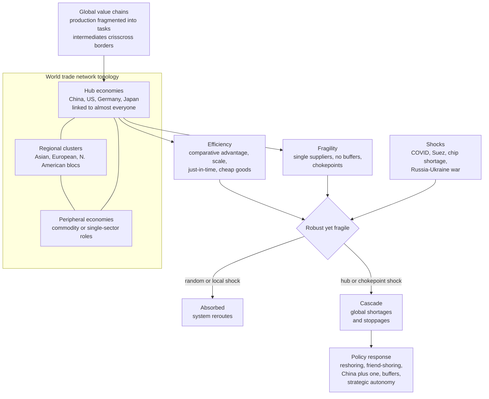

# 🌐 Trade and Supply Chain Networks

> [!abstract] TL;DR
> International trade and modern production form a vast, **hub-dominated network** of **global value chains** in which no country makes a complex product alone — a smartphone or a car embodies dozens of nations linked into a web of "trade in tasks." That web delivered enormous **efficiency**: comparative advantage, economies of scale, just-in-time inventories, and cheap goods that lifted billions from poverty. But complexity economics reveals the network is **"robust yet fragile"** — the same dense, optimized, single-sourced interdependence that spread prosperity also spreads *disruption*. It tolerates random, local shocks but **cascades catastrophically** when a hub or chokepoint fails, as COVID-19, the semiconductor shortage, the Suez blockage, and the Russia-Ukraine war vividly exposed. Understanding this **efficiency-resilience trade-off** — now driving reshoring and friend-shoring — and how a country's **network position** shapes its development, makes trade-and-supply-chain networks central to modern systemic risk and geoeconomics.

---

## Intuition

**Analogy:** Trace the origin of a single smartphone in your pocket and you will circle the entire globe. The rare-earth metals are refined in China; the processor is *designed* in California but *etched* atom-by-atom in Taiwan on lithography machines that only the Netherlands can build; the display glass comes from Korea, the memory from Japan, the case metal from India; it is all snapped together in Vietnam, then financed, branded, and sold from the United States. **No single country makes a smartphone. The world does** — through a staggeringly intricate web of trade links, each firm doing the one narrow task it does best and shipping the result onward.

For decades this web looked like pure magic: it delivered dazzling variety at astonishingly low prices, on time, with almost no one holding excess inventory. Then a pandemic shut factories, a war cut off wheat and neon gas, and a single container ship wedged itself sideways across the Suez Canal — and the magic curdled into panic. Suddenly the *same dense connections* that had spread prosperity were spreading paralysis: a shortage of one obscure chip idled entire car plants continents away. The lesson complexity economics draws is unsettling: a network optimized for **efficiency** is, almost by construction, optimized *against* **resilience**. Disruption travels the network at the speed of a broken link.

---

## How It Works

### Production as a network, not a place

The old picture of trade — Britain sells cloth, Portugal sells wine — is obsolete. Modern production is **fragmented**: a good's stages (research, design, components, sub-assembly, final assembly, distribution, after-sales) are each performed *wherever it is cheapest or best*, then stitched back together across borders. Richard Baldwin calls this the **"unbundling"** of production, and the result is **global value chains (GVCs)**: most world trade today is not final goods but **intermediates and tasks** flowing between firms mid-process. Complexity economics models the whole thing as an **evolving complex network** — countries and firms are **nodes**, trade flows and supplier relationships are **edges** — whose *topology* determines both how efficient and how vulnerable the system is. This is the network-and-topology view developed in the sibling note *Economic_Networks_and_Interaction_Structure*, and the who-supplies-whom production layer beneath it in *Input_Output_Networks_and_Production*.

### The empirical topology: heavy-tailed and hub-dominated

Network scientists (Serrano and Boguñá, Fagiolo, and others) mapped the **World Trade Web** from customs data and found it is *not* a random, evenly-connected mesh. Its structure is:

1. **Heavy-tailed and hub-dominated.** A handful of economies — China, the US, Germany, Japan — are **massive hubs** trading with almost everyone; the vast majority of countries are **peripheral**, connected to only a few partners. The distribution of trade volume is highly skewed, akin to the [[Small_World_and_Scale_Free_Networks]] found across natural and technological systems.
2. **Core-periphery / hierarchical.** A tightly-interlinked **core** of major economies sits at the center; peripheral nations attach to the core rather than to each other, often in low-value commodity roles.
3. **Regionally clustered.** Dense sub-communities form the great trade blocs — an Asian cluster around China, a European cluster around Germany, a North American cluster around the US — high connectivity within, sparser links between.
4. **High but uneven connectivity.** This skewed, clustered "backbone of globalization" is what makes the system simultaneously *powerful* and *precarious*.

### Efficiency: the triumph of the web

The upside is enormous. A dense, specialized global network lets every player exploit **comparative advantage** and **economies of scale** (see [[Scarcity_and_Opportunity_Cost]]), driving down costs. Firms adopted **just-in-time (JIT)** production — lean inventories, parts arriving exactly when needed — which slashed the capital tied up in warehouses. The integration pulled hundreds of millions in Asia out of poverty and gave rich-country consumers cheap, abundant goods. This hyper-efficiency-through-connectivity was the central promise of globalization, and for thirty years it delivered.

### "Robust yet fragile": the hidden cost

Here is the deep insight. The *very same* optimizations that produced efficiency also produced fragility:

- **Single or few suppliers** for critical inputs (one country dominates a key chip, mineral, or component) create **single points of failure**.
- **Just-in-time with no buffers** means a one-week disruption anywhere becomes an immediate stoppage everywhere downstream — there is no inventory to absorb the shock.
- **Deep interdependence** means a failure *anywhere* can cascade *everywhere*.

Such a network is **robust yet fragile** (the phrase comes from complex-systems and internet-topology research): it *tolerates* small, random, local failures — knock out a peripheral supplier and the system reroutes — but it is *acutely vulnerable* to **hub failures, chokepoint blockages, and correlated global shocks**. Efficiency and resilience are in direct tension, and hyper-optimization silently trades the second away for the first.

### Cascades: how a local shock goes global

Disruptions **propagate through the network**. A supplier's shutdown starves the downstream producers that depend on its output, whose stoppage then starves *their* customers — a cascade that runs along the input-output links of the production graph (the cascade machinery lives in *Cascades_Contagion_and_Financial_Crises* and the propagation dynamics in *Financial_Networks_and_Systemic_Risk*). Compounding this is the **bullwhip effect**: small demand fluctuations at the retail end amplify into wild swings upstream as each tier over-orders to protect itself. The network is a **conduit for economic contagion** across borders — exactly the dynamics studied in [[Network_Dynamics_and_Contagion]] and [[Cascades_and_Systemic_Risk]].

### The response: from just-in-time to just-in-case

The 2020s exposed all of this at once, and the policy pendulum swung toward **resilience**: **reshoring** (bringing production home), **friend-shoring / near-shoring** (concentrating trade among geopolitical allies — fragmenting globalization along political lines), supplier **diversification** ("China+1"), building **buffers** ("just-in-case" over "just-in-time"), and pursuing **strategic autonomy** in critical goods (the CHIPS Act for semiconductors, secure supplies of pharmaceuticals and rare earths). This is the retreat from hyper-efficiency toward security — "slowbalization" and "de-risking" — an explicit re-pricing of the efficiency-resilience trade-off.



---

## Key Concepts

**Secondary (intuition level)**
- **No one makes it alone.** A modern product is assembled from tasks done in dozens of countries; trade is a web, not a set of bilateral deals.
- **A few giants, many minnows.** Trade concentrates on a handful of hub economies; most countries hang off the edges.
- **Cheap has a price.** The lean, single-sourced setup that makes goods cheap is exactly what makes them vanish when one link breaks.
- **A stuck ship stops the world.** One container ship blocking the Suez Canal halted a large share of global trade for days — a chokepoint made visible.

**Undergraduate (mechanism level)**
- **Global value chains (GVCs).** Trade in *intermediates and tasks*, not just final goods — the "unbundling" of production across borders (Baldwin).
- **Hub-and-periphery topology.** The World Trade Web is heavy-tailed with a dense core and a sparse periphery, plus regional clusters — a scale-free-like structure, not a random mesh.
- **Just-in-time vs just-in-case.** JIT minimizes inventory cost but eliminates the buffers that absorb shocks; just-in-case restores buffers at a cost.
- **The bullwhip effect.** Demand variability amplifies upstream as each tier over-orders — a network-amplified oscillation.
- **Robust yet fragile.** Tolerant of random/peripheral failures, acutely vulnerable to targeted hub or chokepoint failures and correlated shocks.

**Graduate (nuance and reach)**
- **Efficiency-resilience frontier.** Diversifying suppliers, holding buffers, and adding redundancy *reduce* systemic fragility but *raise* cost — an explicit optimization trade-off, not a free lunch. Firms and states now solve for a point *inside* the efficient frontier.
- **Chokepoints and weaponized interdependence.** Concentrated control of critical nodes (TSMC for advanced chips, dominance in rare-earth refining, key financial-messaging systems) turns network position into geoeconomic *power* — export controls and sanctions weaponize the topology.
- **Cascade dynamics on production networks.** Shock propagation depends on reliance shares, substitutability of inputs, and network structure; targeted (hub) attacks collapse connectivity far faster than random failures — the same asymmetry seen in scale-free network percolation.
- **Network position as economic destiny.** A country's location in the GVC network — central high-value-added versus peripheral commodity role — shapes its growth. **Economic complexity** (the diversity and sophistication of what a country exports) predicts future growth, developed in *Economic_Complexity_and_the_Product_Space*.
- **Correlated shocks defeat diversification.** Diversifying suppliers helps against *idiosyncratic* failures but not against *systemic* shocks (a pandemic, a regional war) that hit many nodes at once — the resilience calculus must distinguish shock *correlation*.

---

## Python Demo

This demo builds a stylized **world trade network** and stress-tests it, illustrating "robust yet fragile." **Part (a)** constructs a directed, weighted trade matrix using a gravity-style rule (flow between two countries scales with the product of their economic sizes), where a heavy-tailed size distribution produces a **hub-dominated** network; it computes trade "strength" and eigenvector **centrality** and confirms a few economies dominate. **Part (b)** simulates **disruption**: it shocks a country, cascades the loss downstream through supplier-reliance links, and shows that hitting a **hub** causes far larger network-wide output loss than hitting a peripheral country — plus a **percolation** curve showing the network tolerates random node removal but collapses under targeted hub removal. **Part (c)** illustrates the **efficiency-resilience trade-off**: diversifying a critical input across more suppliers lowers worst-case exposure but raises unit cost. Uses only `numpy` and `matplotlib`.

```python
# World trade network: hub-dominated structure + "robust yet fragile" cascades.
# (a) build a gravity-style trade matrix, measure hubs/centrality
# (b) cascade a shock through supplier links; hub vs peripheral vs random;
#     plus a percolation curve (random vs targeted node removal)
# (c) efficiency-resilience trade-off of supplier diversification
import numpy as np
import matplotlib.pyplot as plt

rng = np.random.default_rng(42)

# ----------------------------------------------------------------------
# (a) BUILD a synthetic World Trade Network
#     Heavy-tailed economic "size" -> a few giant hub economies.
#     Gravity rule: expected flow_ij ~ size_i * size_j  => hub-dominated web.
# ----------------------------------------------------------------------
N = 60
size = rng.pareto(a=1.6, size=N) + 0.1          # heavy-tailed sizes
size = np.sort(size)[::-1]                        # index 0 = biggest economy
size = size / size.sum()

S = np.outer(size, size)                          # gravity-style joint size
np.fill_diagonal(S, 0.0)
P = 1.0 - np.exp(-45.0 * S)                        # bigger pairs -> likelier link
active = (rng.random((N, N)) < P)
np.fill_diagonal(active, False)
W = S * active * 1e4                               # weighted DIRECTED trade matrix
                                                   # W[i, j] = exports from i to j

out_strength = W.sum(axis=1)                       # total exports
in_strength  = W.sum(axis=0)                       # total imports
total_trade  = out_strength + in_strength          # trade "strength" centrality
degree       = (active | active.T).sum(axis=1)     # number of trade partners

# eigenvector centrality via power iteration on symmetric trade intensity
A = W + W.T
c = np.ones(N)
for _ in range(300):
    c = A @ c
    c = c / np.linalg.norm(c)
eig_cent = c / c.sum()

names = {0: "CHN", 1: "USA", 2: "DEU", 3: "JPN"}   # label the top hubs
top = np.argsort(total_trade)[::-1][:4]
print("Top trade hubs (share of total trade strength):")
for r in top:
    print(f"  {names.get(r, f'C{r:02d}')}: {total_trade[r]/total_trade.sum():.1%}"
          f"   partners={degree[r]}")

# ----------------------------------------------------------------------
# (b) DISRUPTION CASCADE
#     reliance[i, j] = share of importer j's inputs sourced from i.
#     Shock a node -> its output drops to 0 -> downstream loses reliance*loss,
#     propagating with elasticity alpha. Impact = size-weighted output lost.
# ----------------------------------------------------------------------
col = W.sum(axis=0)
reliance = W / np.where(col > 0, col, 1.0)          # reliance[i, j], columns sum to 1

def cascade_loss(shock_node, alpha=0.6, rounds=8):
    loss = np.zeros(N)
    loss[shock_node] = 1.0
    for _ in range(rounds):
        spread = alpha * (reliance.T @ loss)         # inbound loss for each importer
        loss = np.minimum(1.0, np.maximum(loss, spread))
        loss[shock_node] = 1.0                       # shocked node stays down
    return loss

impact = np.array([np.sum(cascade_loss(s) * size) for s in range(N)])

hub_node  = int(top[0])                              # biggest hub
peri_node = int(np.argsort(total_trade)[0])          # smallest peripheral node
print(f"\nCascade impact (size-weighted global output lost):")
print(f"  shock HUB  ({names.get(hub_node,'hub')}): {impact[hub_node]:.3f}")
print(f"  shock PERIPHERY        : {impact[peri_node]:.3f}")
print(f"  average over all nodes : {impact.mean():.3f}")

# percolation: remove nodes and track surviving trade (random vs targeted hubs)
def remaining_trade(order):
    alive = np.ones(N, bool); tot0 = W.sum(); frac = []
    for node in order:
        alive[node] = False
        frac.append(W[np.ix_(alive, alive)].sum() / tot0)
    return np.array(frac)

x = np.arange(1, N + 1) / N
rand_curve = np.mean([remaining_trade(rng.permutation(N)) for _ in range(20)], axis=0)
targ_curve = remaining_trade(np.argsort(total_trade)[::-1])   # hubs first

# ----------------------------------------------------------------------
# (c) EFFICIENCY vs RESILIENCE: sourcing a critical input from k suppliers.
#     Single-sourcing (k=1) is cheapest but worst-case loss = 100% of input.
#     Diversifying to k suppliers cuts worst-case exposure to ~1/k,
#     but each extra supplier adds a coordination/overhead premium.
# ----------------------------------------------------------------------
ks       = np.arange(1, 9)
exposure = 1.0 / ks                                  # worst-case input share lost
cost     = 1.0 + 0.10 * (ks - 1)                     # diversification premium

# ----------------------------------------------------------------------
# VISUALIZE
# ----------------------------------------------------------------------
fig, ax = plt.subplots(2, 3, figsize=(16, 9.5))

# panel 1: trade network layout (hubs pulled toward center)
theta  = rng.uniform(0, 2 * np.pi, N)
radius = 1.0 - 0.7 * (total_trade / total_trade.max())
pos = np.column_stack([radius * np.cos(theta), radius * np.sin(theta)])
ii, jj = np.where(active)
wmax = W.max()
for i, j in zip(ii, jj):
    ax[0, 0].plot([pos[i, 0], pos[j, 0]], [pos[i, 1], pos[j, 1]],
                  color="gray", lw=0.3, alpha=0.15 + 0.6 * W[i, j] / wmax, zorder=1)
ax[0, 0].scatter(pos[:, 0], pos[:, 1], s=40 + 4000 * total_trade / total_trade.sum(),
                 c=eig_cent, cmap="viridis", edgecolor="k", lw=0.4, zorder=2)
for r in top:
    ax[0, 0].annotate(names.get(r, f"C{r}"), pos[r], fontsize=9, fontweight="bold")
ax[0, 0].set_title("World trade network\nnode size = trade volume, color = centrality")
ax[0, 0].axis("off")

# panel 2: heavy-tailed hub distribution (rank-size, log-log)
srt = np.sort(total_trade)[::-1]
ax[0, 1].loglog(np.arange(1, N + 1), srt, "o-", color="#1f77b4")
ax[0, 1].set_xlabel("rank"); ax[0, 1].set_ylabel("trade strength")
ax[0, 1].set_title("Heavy-tailed, hub-dominated\n(a few economies carry most trade)")
ax[0, 1].grid(True, which="both", ls=":", alpha=0.5)

# panel 3: percolation robustness (random vs targeted removal)
ax[0, 2].plot(x, rand_curve, "-", color="green", lw=2, label="random failures")
ax[0, 2].plot(x, targ_curve, "-", color="red", lw=2, label="targeted (hubs first)")
ax[0, 2].set_xlabel("fraction of countries removed")
ax[0, 2].set_ylabel("surviving trade")
ax[0, 2].set_title("Robust yet fragile\nrandom tolerated, hub attack collapses")
ax[0, 2].legend(); ax[0, 2].grid(True, ls=":", alpha=0.5)

# panel 4: cascade impact per node (which node is hit)
order = np.argsort(impact)[::-1]
colors = ["red" if n == hub_node else "orange" if n == peri_node else "#888"
          for n in order]
ax[1, 0].bar(range(N), impact[order], color=colors)
ax[1, 0].set_xlabel("countries (sorted by disruption impact)")
ax[1, 0].set_ylabel("size-weighted output lost")
ax[1, 0].set_title("Disruption impact vs which node is hit\nred = hub, orange = periphery")

# panel 5: cascade footprint on the network for a HUB shock
loss_vec = cascade_loss(hub_node)
for i, j in zip(ii, jj):
    ax[1, 1].plot([pos[i, 0], pos[j, 0]], [pos[i, 1], pos[j, 1]],
                  color="gray", lw=0.3, alpha=0.1, zorder=1)
sc = ax[1, 1].scatter(pos[:, 0], pos[:, 1], s=60, c=loss_vec, cmap="Reds",
                      vmin=0, vmax=1, edgecolor="k", lw=0.4, zorder=2)
ax[1, 1].annotate(names.get(hub_node, "hub"), pos[hub_node], fontsize=9, fontweight="bold")
ax[1, 1].set_title("Cascade footprint of a HUB shock\n(red = output lost)")
ax[1, 1].axis("off")
fig.colorbar(sc, ax=ax[1, 1], fraction=0.046, label="output lost")

# panel 6: efficiency vs resilience trade-off
axb = ax[1, 2]; axb2 = axb.twinx()
axb.plot(ks, exposure, "o-", color="crimson", label="worst-case exposure")
axb2.plot(ks, cost, "s--", color="navy", label="unit cost")
axb.set_xlabel("number of suppliers for critical input (k)")
axb.set_ylabel("worst-case input lost", color="crimson")
axb2.set_ylabel("relative unit cost", color="navy")
axb.set_title("Efficiency vs resilience\ndiversify -> safer but pricier")
axb.grid(True, ls=":", alpha=0.5)

plt.tight_layout()
plt.show()
```

Running it, Part (a) prints a top-heavy hub list (a few "economies" carry a large share of total trade strength) and the rank-size panel is a near-straight log-log line — the heavy tail. Part (b) shows the punchline: shocking the **hub** wipes out several times more size-weighted global output than shocking the **periphery** or an average node, and the percolation panel separates cleanly — the green "random failures" curve degrades gracefully while the red "targeted hubs first" curve **collapses** after only a few removals. The cascade-footprint panel lights up much of the network in red when the hub is hit. Part (c) draws the trade-off explicitly: worst-case exposure falls as `1/k` while unit cost climbs — you buy resilience with efficiency.

---

## Real-World Applications

> **Example — the 2020-2023 semiconductor shortage.** Advanced logic chips are a textbook **chokepoint**: a single firm, TSMC in Taiwan, fabricates the large majority of the world's most advanced processors, using lithography machines only ASML in the Netherlands can build. When COVID scrambled demand and a few fabs stalled, the shortage cascaded through *every* downstream industry that embeds chips — most visibly automakers, who idled plants worldwide and lost hundreds of billions in revenue because one tiny, cheap component was missing. It is the "robust yet fragile" network in one story: hyper-efficient single-sourcing, no buffers, and a hub failure propagating globally. The direct policy response was the US and EU **CHIPS Acts** — subsidizing domestic fabrication to *reshore* a critical node.

- **Supply-chain risk management.** Firms now **map** their multi-tier supplier networks to find hidden single points of failure (often a sub-supplier three tiers down that everyone unknowingly shares), stress-test for chokepoints, and hold strategic buffers — corporate resilience as network analysis.
- **Trade policy and geoeconomics.** Tariffs, export controls (advanced chips to China), and sanctions (cutting Russia from financial-messaging and technology networks) are all attempts to *use or weaponize* network position — attacking or defending specific nodes and edges of the trade graph.
- **Economic-development strategy.** Countries deliberately try to **upgrade their position** in value chains — moving from peripheral commodity roles to central, high-value-added tasks (design, advanced manufacturing) — because network position predicts growth, the core claim of economic-complexity analysis.
- **Crisis response and forecasting.** After the Suez blockage, the 2011 Japan tsunami, and the Thailand floods (which alone caused a global hard-disk shortage), governments and insurers model **cascade propagation** to anticipate which local disruptions will go global.
- **Friend-shoring and de-risking.** The post-pandemic, post-Ukraine push to concentrate critical trade among geopolitical allies is an explicit, politically-driven **rewiring** of the trade network — trading some efficiency for perceived security and strategic autonomy.

The systemic-risk and contagion machinery here is shared with financial networks — the topic of the sibling note *Financial_Networks_and_Systemic_Risk* — and the general cascade dynamics with *Cascades_Contagion_and_Financial_Crises*; the production layer of who-supplies-whom is developed in *Input_Output_Networks_and_Production*; and the development/inequality dimension in *Economic_Complexity_and_the_Product_Space*.

---

## Common Pitfalls

- **Confusing efficiency with robustness.** The single biggest error: assuming a lean, cost-optimized supply chain is also a *safe* one. Optimization for average-case cost systematically strips out the redundancy that protects against tail-risk shocks — efficiency and resilience are in tension, not alignment.
- **Ignoring hidden tier-N dependencies.** A firm may have diversified its direct suppliers yet still have all of them depend on the *same* sub-supplier, mineral, or region far upstream. Mapping only tier-1 suppliers gives a false sense of resilience; correlated failure lurks deep in the network.
- **Treating random and targeted failures the same.** Reliability estimates built on *random* failure rates dramatically understate the risk from *targeted* or *correlated* shocks (a hub attack, a regional war, a pandemic). Robust-yet-fragile means average-case reliability is nearly useless for tail risk.
- **Diversification as a cure-all.** Spreading suppliers helps against *idiosyncratic* shocks but does little against *systemic* ones that hit many nodes simultaneously. If your five suppliers are all in the same earthquake zone or trade bloc, you are not diversified.
- **Over-reshoring / autarky romance.** Assuming that bringing everything home eliminates risk. Reshoring concentrates *different* risks (higher cost, loss of specialization, domestic single points of failure) and can reduce overall welfare — resilience has a price and a limit, and full autarky forfeits the gains from trade entirely.
- **Static snapshots of an evolving network.** Trade networks continuously rewire (new entrants, shifting blocs, technological change). A resilience assessment based on last year's topology can miss the chokepoint that just formed.

---

## Related Concepts

- [[Network_Science_Fundamentals]] — the trade web is a canonical real-world network; nodes, edges, degree, and paths are the basic vocabulary for analyzing it.
- [[Small_World_and_Scale_Free_Networks]] — the heavy-tailed, hub-dominated structure of world trade mirrors scale-free topology, explaining its robust-yet-fragile behavior.
- [[Centrality_and_Community_Structure]] — hub identification, chokepoint detection, and the regional trade blocs are exactly centrality and community-detection problems.
- [[Cascades_and_Systemic_Risk]] — a supplier failure starving downstream producers is a production-network cascade, the same dynamics that generate systemic risk.
- [[Network_Dynamics_and_Contagion]] — trade shocks and the bullwhip effect are contagion processes spreading across the network as a conduit.
- [[Resilience_and_Robustness]] — the efficiency-resilience trade-off, buffers, redundancy, and graceful-vs-catastrophic degradation are the core resilience concepts applied to supply chains.
- [[Economies_as_Complex_Adaptive_Systems]] — the global economy as an evolving, adaptive network of interacting agents, the framing complexity economics brings to trade.
- [[Complexity_Economics_Overview]] — trade-and-supply-chain networks are a flagship application of the complexity-economics program.
- [[Increasing_Returns_and_Path_Dependence]] — clustering and lock-in of production in particular hubs reflect increasing returns and path-dependent agglomeration.
- [[Agent_Based_Modeling_in_Economics]] — firm-level supply-chain formation and disruption cascades are frequently studied with agent-based models.
- [[Graph_Theory]] — the mathematical foundation (directed weighted graphs, connectivity, percolation) underlying trade-network analysis.
- [[Scarcity_and_Opportunity_Cost]] — comparative advantage and opportunity cost are the microeconomic logic that first drives specialization and trade.
- [[Balance_of_Payments]] — the macro accounting of the trade flows that these networks represent at the country level.
- [[Development_Economics]] — a country's position in global value chains shapes its growth trajectory and development prospects.
- [[Globalization_and_Its_Discontents]] — the political-economy backlash against the very interdependence that trade networks embody, driving reshoring and friend-shoring.
- [[Geopolitics_and_Power_Politics]] — weaponized interdependence, export controls, and friend-shoring are trade-network position turned into geopolitical power.
- [[Global_Financial_Crises]] — the financial analogue: shocks cascading through an interconnected network of institutions, sharing the systemic-risk logic.

---

## Review Questions

1. **(Conceptual)** Explain precisely what "robust yet fragile" means for a supply-chain network. Why does the *same* set of optimizations (single-sourcing, just-in-time, deep specialization) that maximizes efficiency simultaneously maximize fragility? Contrast how the network responds to a *random* peripheral failure versus a *targeted* hub failure, and connect this to the topology of scale-free networks.
2. **(Scenario)** You are the chief risk officer of a carmaker that single-sources a critical chip from one supplier in one country to minimize cost. A pandemic and a regional geopolitical crisis are both plausible over the next five years. Design a resilience strategy: which levers (diversification, buffers, reshoring, friend-shoring) would you pull, in what order, and how would you decide *how much* efficiency to sacrifice? Explain why simply "adding more suppliers" might fail to protect you, referencing the difference between idiosyncratic and correlated shocks.
3. **(Trade-off / interpretive)** Governments are pushing reshoring and friend-shoring to make supply chains resilient and to secure strategic autonomy in chips, pharmaceuticals, and rare earths. Critics warn this sacrifices the gains from trade, raises costs and inflation, and fragments the global network along geopolitical lines. Using the efficiency-resilience frontier and the idea of network position as economic destiny, adjudicate: under what conditions is trading efficiency for resilience *worth it*, and when does the "retreat from hyper-efficiency" overshoot into costly, self-defeating autarky?

---

## Sources

- Baldwin, R. (2016). *The Great Convergence: Information Technology and the New Globalization*. Harvard University Press. — The definitive account of production "unbundling" and global value chains.
- Serrano, M. Á., & Boguñá, M. (2003). "Topology of the world trade web." *Physical Review E*, 68(1), 015101. [APS](https://journals.aps.org/pre/abstract/10.1103/PhysRevE.68.015101)
- Fagiolo, G., Reyes, J., & Schiavo, S. (2009). "World-trade web: Topological properties, dynamics, and evolution." *Physical Review E*, 79(3), 036115. [APS](https://journals.aps.org/pre/abstract/10.1103/PhysRevE.79.036115)
- Hidalgo, C. A., & Hausmann, R. (2009). "The building blocks of economic complexity." *PNAS*, 106(26), 10570–10575. [PNAS](https://www.pnas.org/doi/10.1073/pnas.0900943106)
- Miller, R. E., & Blair, P. D. (2009). *Input-Output Analysis: Foundations and Extensions* (2nd ed.). Cambridge University Press. — The production-network / cascade foundations.
- McKinsey Global Institute (2020). *Risk, Resilience, and Rebalancing in Global Value Chains*. [McKinsey](https://www.mckinsey.com/capabilities/operations/our-insights/risk-resilience-and-rebalancing-in-global-value-chains)

---

#complexity-economics #trade-networks #supply-chains #globalization #resilience
