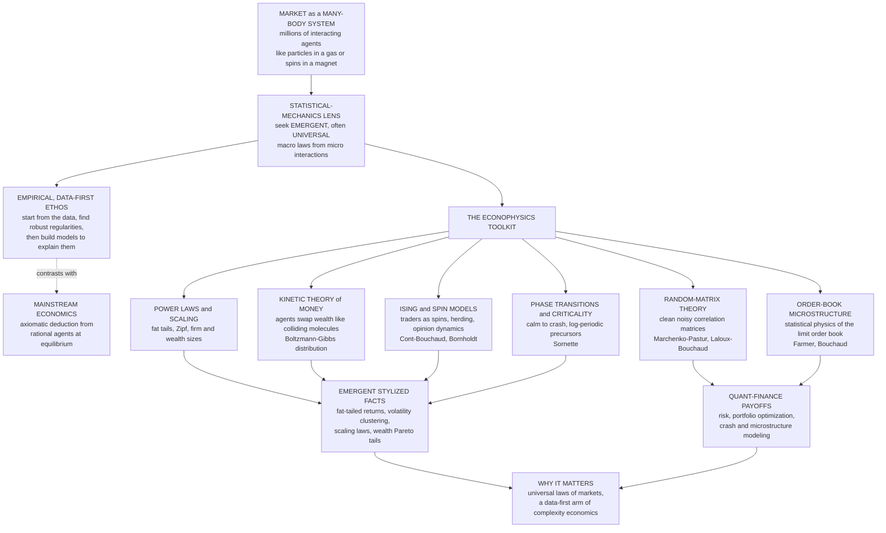

# ⚛️ Econophysics and the Statistical Mechanics of Markets

> [!abstract] TL;DR
> **Econophysics** (a term coined around **1995 by H. Eugene Stanley**) applies the theories and methods of **statistical physics** to **economic and financial systems** — treating a market or an economy as a **many-body system** of interacting "particles" (agents) whose **collective** behavior produces **emergent, often universal** statistical regularities: fat-tailed returns, power-law firm and wealth sizes, volatility clustering, and crashes. Its ethos is a sharp counterpoint to mainstream economics: **empirical and data-first** — start from huge datasets, find the robust **stylized facts**, then build models to explain them — rather than **axiomatic** deduction from rational agents at equilibrium. The imported toolkit includes **power-law/scaling analysis** of heavy tails, the **kinetic theory of money** (agents swapping wealth like gas molecules exchanging energy, yielding **Boltzmann-Gibbs** wealth distributions with power-law tails when saving is added), **Ising/spin models** of herding markets and opinion dynamics with a **phase transition** from calm to crash (Cont-Bouchaud, Bornholdt), **criticality** models of crashes (Sornette's log-periodic precursors), **random-matrix theory** for cleaning noisy correlation matrices (Laloux, Bouchaud), and the **statistical physics of the limit order book** (Farmer, Bouchaud). Contested at the economics-physics border for sometimes describing patterns without an economic mechanism, econophysics is nonetheless a **core methodological arm of complexity economics** that shares its statistical-physics lens with the **physics of machine learning**, and it has delivered both deep insight into market emergence and practical quant-finance advances in **risk and portfolio management**.

---

## Intuition

**Analogy:** A physicist looks at a stock market and, instead of seeing accountants and news tickers, sees something eerily familiar — a system of **countless interacting particles**. The traders are the particles; their buying and selling is the jostling; and out of all that microscopic chaos emerges something **macroscopic and measurable**, just as the frantic collisions of molecules in a box of gas produce the smooth, lawful quantities we call **temperature** and **pressure**, and just as the tug-of-war between billions of atomic spins in a piece of iron produces its overall **magnetization**. The physicist has spent a century building extraordinarily powerful tools — **statistical mechanics** — for exactly this problem: how the collective behavior of many simple interacting parts gives rise to sharp, universal macro-laws that don't care about the details of any single part.

So the physicist makes an audacious bet: **why not point those tools at the economy?** If magnetization can undergo a sudden **phase transition** at a critical temperature, maybe a market can undergo a sudden transition from calm to crash. If wealth distributions look like the Boltzmann distribution of energies, maybe money is exchanged like energy. If the crashes are far too frequent for a bell curve, maybe markets — like matter near a critical point — obey **power laws** and **scaling** with universal exponents that transcend the institutional details of any particular exchange. That bet, with its conviction that markets (like matter) have **universal laws waiting to be found in the data**, is **econophysics**: physicists invading economics, armed with data and a very different idea of what an economic theory should look like.

---

## How It Works

Econophysics is the **application of statistical-mechanics tools to economic systems**. Its founding move is to treat a market as a **many-body system**: not a serene machine populated by one rational representative agent gliding to equilibrium (the picture challenged in `[[The_Limits_of_Neoclassical_Equilibrium]]`), but a churning ensemble of many **interacting** agents whose aggregate behavior is a proper object of statistical physics. The wager is that the same mathematics that derives **thermodynamics from molecular chaos** can derive **market statistics from trader interactions** — and, crucially, that the resulting macro-laws are **universal**, largely independent of the microscopic institutional details, the way the critical exponents of a magnet are shared by wildly different physical systems.

### The physicist's view of markets

The founding perspective is structural. Gases, magnets, and spin glasses are systems of many interacting components whose **collective** behavior physicists have learned to master; a market is *also* a system of many interacting components (traders, firms, funds) whose collective behavior produces emergent macro-patterns — **prices, volatility, bubbles, crashes**. If the analogy holds, the market should exhibit the hallmarks of a statistical-mechanical system: **emergent order parameters** (net demand as a kind of magnetization), **fluctuations** that grow near instability, and **universal statistics** (power laws) rather than the tame Gaussian of an efficient, well-mixed equilibrium.

### The empirical, data-first ethos

The methodological signature — and the sharpest contrast with mainstream economics — is that econophysics is **empirically driven**. The workflow is: **(1)** start from the **data** (the field was catalyzed by the arrival of huge tick-by-tick financial datasets), **(2)** find the **robust statistical regularities** — the **stylized facts**: heavy tails, scaling, volatility clustering, correlation structure — and **(3)** build models to *explain* those regularities. This is a physicist's **model-testing empiricism** ("let the data speak") set against an economist's **axiomatic deduction** from postulates of rationality and equilibrium. Where a mainstream theorist asks "what follows logically from utility maximization at equilibrium?", the econophysicist asks "what does the return distribution actually look like, and what minimal interacting-agent model reproduces it?" The clash is real, but so is the complementarity — the best work marries **mechanism** (economics) with **measurement** (physics).

### The econophysics toolkit

The methods are imported wholesale from statistical physics:

1. **Power-law and scaling analysis.** Documenting and fitting the **fat tails** of returns (a power-law tail with exponent near three — the "inverse cubic law" of Stanley and collaborators), **Zipf's law** for city and firm sizes, and **Pareto tails** for wealth and income. Heavy tails are the fingerprint of a system operating far from a placid Gaussian equilibrium — the theme of the future siblings `Power_Laws_and_Heavy_Tails_in_Economics` and `Fat_Tails_and_Financial_Market_Statistics`.
2. **The kinetic theory of money/wealth.** Model agents exchanging money the way gas molecules exchange **energy** in collisions; the equilibrium distribution is a **Boltzmann-Gibbs exponential** (Dragulescu-Yakovenko), acquiring a **power-law tail** once saving propensity or heterogeneity is added — a physics-style derivation of inequality (future sibling `Wealth_and_Income_Inequality_Dynamics`).
3. **Spin/Ising models of markets and opinion.** Traders are **spins** (buy = +1, sell = -1) that tend to **align with their neighbors** (herding) under a **random field** (private information); the **Cont-Bouchaud percolation model** and **Bornholdt's** feedback-spin model generate crashes and fat tails from herding.
4. **Phase transitions and criticality.** Model the shift from a calm, mean-reverting market to a herding, aligned market as a **phase transition** across a critical interaction strength; **crashes as critical points** with **log-periodic power-law** precursors (Sornette). Markets may sit **near criticality** by self-organization — the link to `Self_Organized_Criticality_in_Economics`.
5. **Random-matrix theory (RMT).** Borrowed from **nuclear physics**, RMT separates **genuine correlations** among asset returns (a few large eigenvalues — the market mode and sectors) from **pure noise** (the bulk of eigenvalues following the **Marchenko-Pastur** law) — Laloux, Cizeau, Bouchaud, Potters.
6. **Market microstructure / order-book physics.** The **statistical mechanics of the limit order book** — the statistics of order flow, price impact, and liquidity as an emergent, scaling phenomenon (Farmer, Bouchaud, and collaborators).

### Phase transitions in markets

A signature theme is modeling market phenomena as **phase transitions**. As an interaction or confidence parameter (how strongly traders imitate one another) crosses a **critical value**, the market flips from a **disordered** state — balanced buying and selling, small mean-reverting price moves — to an **ordered** state where everyone **aligns** (a herd all buying or all selling), producing **bubbles and crashes** and large moves. This is precisely the **Ising ferromagnet** crossing its Curie temperature: below the critical coupling the spins point every which way and net magnetization is near zero; above it, spontaneous magnetization appears. Near the critical point, **fluctuations diverge** and the response becomes **fat-tailed** — the mechanism that turns small news into occasional enormous swings. **Sornette** pushed this further, modeling speculative **crashes as critical points** foreshadowed by **log-periodic power-law** oscillations of accelerating frequency — a controversial program of crash "prediction."

### The kinetic theory of money/wealth

A flagship result. Treat money as a **conserved** quantity and wealth exchange as a **kinetic** process: agents meet pairwise and reshuffle money like particles exchanging energy in elastic collisions. Under simple random exchange, the equilibrium wealth distribution is a **Boltzmann-Gibbs exponential**, `P(w) ∝ exp(-w / T)`, where the "temperature" `T` is the **average money per agent** — a direct import of the statistical mechanics of an ideal gas (Dragulescu-Yakovenko, 2000). Add a **saving propensity** (agents keep a fraction of wealth each trade) and the bulk becomes a Gamma-like distribution; add **heterogeneous** saving and the **tail becomes a Pareto power law** — reproducing the empirical split between a Boltzmann body and a Pareto tail in real income data. It is a concrete, falsifiable econophysics success: a wealth distribution *derived* from physics-style conservation and exchange rather than assumed.

### Random-matrix theory and correlations

A widely-used practical tool. The **correlation matrix** of `N` assets estimated from `T` return observations is dominated by **measurement noise** when `T` is not enormously larger than `N`. RMT gives the null model: if returns were pure noise, the eigenvalues of the correlation matrix would fill the **Marchenko-Pastur** spectrum, whose edges depend only on the ratio `q = N / T`. Eigenvalues **inside** that bulk are indistinguishable from noise; the **few large eigenvalues poking above** the upper edge are the **genuine** structure — the dominant one is the **market mode** (everything moves together), the next few are **sectors**. **Cleaning** the correlation matrix by shrinking or replacing the noisy bulk yields far more stable **portfolio optimization** and **risk** estimates (Laloux-Cizeau-Bouchaud-Potters) — physics directly improving quantitative finance, the province of `[[Modern_Portfolio_Theory]]` and `[[Value_at_Risk]]`.

### Flow / Architecture



---

## Key Concepts

### Secondary Level

**What econophysics is.** Physicists are experts at a strange trick: they take a box with trillions of jiggling molecules — far too many to track — and still predict its temperature and pressure exactly. Econophysics asks: **markets also have huge numbers of jiggling parts (traders) — can we predict *their* big patterns the same way?** So physicists started studying crashes, prices, and wealth the way they study gases and magnets.

**Markets act like magnets.** In a magnet, tiny atomic compasses either point every-which-way (weak magnetism) or suddenly all snap into line (strong magnetism) when you cool it past a special temperature. Traders are like those compasses: usually a messy mix of buyers and sellers, but sometimes — when everyone copies everyone else — they **all snap into "buy" or all snap into "sell."** That snap is a **bubble or a crash**.

**Money moves like heat.** Bump two molecules together and they swap energy; bump two people together in trade and they swap money. Physicists showed that if money just gets shuffled around randomly, wealth ends up spread out in the **same bell-of-energy shape** physics predicts for gas molecules — and adding a little "saving" makes a few people end up extremely rich, matching the real world.

**Why it matters.** Real crashes happen **far more often** than the tidy "bell curve" of old finance allows. Econophysics takes those violent, fat-tailed markets seriously — because it expects markets, like matter, to have their own universal laws hiding in the data.

### Undergraduate Level

**The many-body framing.** Statistical mechanics derives macroscopic laws (thermodynamics) from the collective behavior of `~10^23` interacting microscopic particles, without tracking any single one. Econophysics posits the same for markets: **macro observables** (price, volatility, the return distribution, wealth distribution) are **emergent** properties of many interacting agents, to be characterized statistically rather than deduced from one optimizer.

**Stylized facts as the empirical target.** The robust, cross-market regularities econophysics aims to explain: (i) **heavy-tailed returns** — the distribution of price changes decays as a **power law** `P(r) ∝ |r|^(-(1+α))` with tail exponent `α ≈ 3` (the "inverse cubic law"), far fatter than Gaussian; (ii) **volatility clustering** — the long-memory autocorrelation of *absolute/squared* returns (formalized econometrically in `[[GARCH_Models]]`); (iii) **aggregational Gaussianity** — tails fatten at short horizons and thin toward Gaussian at long horizons; (iv) **absence of linear autocorrelation** in raw returns. These are the "experimental data" the models must reproduce.

**The Ising market.** Encode each trader's action as a spin `s_i ∈ {+1, -1}` (buy/sell). A trader's decision responds to a **local field** `h_i = J·m + b_i`, where `m` is the average spin (**net demand**, the analogue of magnetization), `J` is the **herding/interaction strength**, and `b_i` is a **random field** (private information/news). The **order parameter** is `m`. Below a critical `J_c`, `m ≈ 0` (balanced market, small moves); above `J_c`, `|m|` becomes large (herded market — everyone aligned). **Price change** is proportional to the change in net demand, so the herding transition manifests as **large moves and fat tails** — the essence of the **Cont-Bouchaud** and **Bornholdt** models.

**Kinetic wealth exchange.** With total money conserved and random pairwise reshuffling, detailed-balance arguments yield the **Boltzmann-Gibbs** stationary distribution `P(w) ∝ exp(-w/T)`, `T = <w>`. A uniform **saving propensity** `λ` narrows it (Gamma-like); a **distribution of** `λ` across agents produces a **Pareto power-law tail**, `P(w) ∝ w^(-(1+ν))` — matching the two-regime shape (exponential bulk, power-law tail) seen in real income data.

**Random-matrix cleaning.** For `N` assets and `T` observations with `q = N/T`, a pure-noise correlation matrix has eigenvalues bounded by the **Marchenko-Pastur** edges `λ± = (1 ± √q)²`. Empirical eigenvalues **below** `λ+` are statistically noise; only the **outliers above** it carry signal. Cleaning the noisy bulk stabilizes covariance estimates for `[[Portfolio_Optimization]]` and risk (see `[[Eigenvalues_and_Eigenvectors]]`, `[[Singular_Value_Decomposition]]`).

### Graduate Level

**Universality and the search for critical exponents.** The deepest claim of econophysics is **universality**: near a critical point, the macroscopic statistics (critical exponents, tail exponents, scaling functions) depend only on gross features — dimensionality, symmetry, interaction range — not microscopic detail. If markets are critical or near-critical many-body systems, their **stylized facts should be universal** across assets, exchanges, and eras — an empirically testable and largely confirmed prediction (the inverse-cubic tail recurs across markets). The **renormalization-group** intuition that underlies universality in physics (`[[Phase_Transitions_and_Critical_Phenomena]]`) is the conceptual justification for expecting institution-independent market laws.

**The Cont-Bouchaud percolation model.** Agents occupy a random graph; connected **clusters** act as a single trading unit that jointly buys, sells, or abstains. When the mean connectivity approaches the **percolation threshold**, the cluster-size distribution becomes a **power law**, and aggregate demand — a sum over clusters of power-law-distributed sizes — inherits **fat tails** with a tunable exponent. It is a beautifully minimal derivation of leptokurtic returns from **herding-as-percolation**, with an explicit critical point.

**Bornholdt's spin market and self-organized criticality.** Bornholdt (2001) couples ferromagnetic **local imitation** to a **global anti-imitation** (minority) coupling to the overall magnetization. The competition prevents the system from locking into a frozen ordered phase and instead drives it to **hover near criticality**, spontaneously generating **volatility clustering** and **fat tails** without fine-tuning `J` — a market realization of **self-organized criticality** (`Self_Organized_Criticality_in_Economics`, `[[Criticality_and_Phase_Transitions]]`).

**Log-periodic critical crashes (Sornette).** Model a bubble as a super-exponential rise driven by positive feedback among imitating traders approaching a **critical time** `t_c`; discrete scale invariance decorates the power-law divergence with **log-periodic oscillations**, `p(t) ≈ A + B(t_c - t)^β · [1 + C·cos(ω·ln(t_c - t) + φ)]`. Fitting this form to bubble price paths is Sornette's controversial crash-diagnosis program — celebrated for some ex-ante calls, criticized for overfitting flexibility and selection bias.

**Random-matrix theory and eigenvector structure.** Beyond the eigenvalue spectrum, the **eigenvectors** matter: the top eigenvector (market mode) is roughly uniform; the next few localize on **sectors**; the bulk eigenvectors are delocalized noise consistent with **Porter-Thomas** statistics. Improved estimators (rotationally-invariant / RIE, Ledoit-Wolf shrinkage) exploit this to produce covariance matrices that beat the sample estimator **out of sample** — a rigorously validated quant-finance advance, adjacent to `[[Factor_Models]]` and `[[Statistical_Arbitrage]]`.

**The mechanism critique.** The strongest economist objection: matching a distribution is not explaining it. A power-law tail is consistent with **many** generative mechanisms (multiplicative noise, preferential attachment, criticality, mixtures), so fitting one does not identify the economic cause, and econophysics models often omit **incentives, budget constraints, information, and strategic behavior** that economics treats as central. The mature response is that mechanism and measurement are **complementary**: econophysics supplies the empirical constraints and candidate minimal mechanisms; economics supplies the incentive-level micro-foundations. The shared statistical-physics language also links this program to the **physics of machine learning** — the same Ising models, Boltzmann distributions, spin glasses, and phase transitions appear in `[[Statistical_Mechanics_of_Machine_Learning_Overview]]`, `[[The_Boltzmann_Distribution_in_Learning]]`, `[[Spin_Glasses_and_the_Energy_Landscape_of_Networks]]`, and `[[Phase_Transitions_in_Learning_and_Inference]]` (the connection the future sibling `Complexity_Economics_and_Machine_Learning` develops).

---

## Python Demo

We implement the **Ising / spin model of a market** (in the spirit of the **Cont-Bouchaud** and **Bornholdt** models). Each of `N` traders is a **spin** `s_i ∈ {+1, -1}` (buy/sell) that tends to **align with the crowd** via a herding coupling `J`, plus a small **random field** (private news). We use exact **mean-field heat-bath dynamics**: given the current net demand `m` (the magnetization / order parameter), each spin turns "buy" with probability `1 / (1 + exp(-2(J·m + b)))`, so the number of buyers next step is `Binomial(N, p)`. The **phase transition** sits at `J_c = 1`: below it the market is disordered (balanced, small moves); above it herding wins and the market **spontaneously polarizes** (a bubble/crash of net demand). We define the **return** as the change in net demand (price impact) and show that **near criticality** the returns become strongly **fat-tailed**, while a **calm** market is nearly Gaussian. Uses only `numpy` and `matplotlib`.

```python
# Ising / spin model of a MARKET (Cont-Bouchaud / Bornholdt flavour).
# Traders are spins (buy=+1 / sell=-1) that ALIGN with the crowd (herding J)
# under a random field (private news). Mean-field heat-bath dynamics.
#   order parameter m = net demand (magnetization); price change ~ change in m.
# As herding J crosses J_c = 1 the market PHASE-TRANSITIONS from disordered
# (calm) to ordered (herded -> bubbles/crashes); near criticality the returns
# are FAT-TAILED. We plot (1) the transition and (2) the fat tails.
import numpy as np
import matplotlib
matplotlib.use("Agg")
import matplotlib.pyplot as plt

def ising_market(J, N=2000, T=20000, b_sigma=0.05, seed=0, burn=2000):
    """Mean-field Ising market. Returns the net-demand (magnetization) series."""
    rng = np.random.default_rng(seed)
    m = 0.0
    ms = np.empty(T)
    for t in range(T):
        b = b_sigma * rng.standard_normal()        # random field = private news
        p_up = 1.0 / (1.0 + np.exp(-2.0 * (J * m + b)))  # heat-bath flip prob
        n_up = rng.binomial(N, p_up)               # exact mean-field update
        m = 2.0 * n_up / N - 1.0                   # net demand in [-1, 1]
        ms[t] = m
    return ms[burn:]

def excess_kurtosis(v):
    """0 for a Gaussian; large positive => fat tails."""
    v = v - v.mean()
    return (v**4).mean() / (v.var()**2) - 3.0

# --- (1) PHASE TRANSITION: time-averaged |net demand| vs herding strength J ---
Js = np.linspace(0.2, 1.8, 33)
order_param = np.array([np.abs(ising_market(J, N=800, T=4000, b_sigma=0.0,
                                            seed=3, burn=1500)).mean()
                        for J in Js])

# --- (2) RETURNS near vs far from criticality --------------------------------
m_near = ising_market(J=1.00, N=2000, T=20000, b_sigma=0.05, seed=11)  # critical
m_calm = ising_market(J=0.55, N=2000, T=20000, b_sigma=0.05, seed=11)  # calm
r_near = np.diff(m_near)                 # return = change in net demand
r_calm = np.diff(m_calm)
z_near = (r_near - r_near.mean()) / r_near.std()   # standardize for comparison
z_calm = (r_calm - r_calm.mean()) / r_calm.std()

k_near, k_calm = excess_kurtosis(r_near), excess_kurtosis(r_calm)
print("=" * 60)
print("ISING MARKET: phase transition and fat tails")
print("=" * 60)
print(f"  critical point (mean field)      : J_c = 1.00")
print(f"  <|net demand|> at J=0.55 (calm)  : {np.abs(m_calm).mean():.3f}")
print(f"  <|net demand|> at J=1.00 (crit)  : {np.abs(m_near).mean():.3f}")
print(f"  excess kurtosis  near criticality: {k_near:6.2f}  (FAT TAILS)")
print(f"  excess kurtosis  calm market     : {k_calm:6.2f}  (near Gaussian)")

# ------------------------------- FIGURE --------------------------------------
fig, ax = plt.subplots(1, 3, figsize=(17, 5.2))
fig.suptitle("Ising model of a market: a herding PHASE TRANSITION and "
             "emergent FAT TAILS near criticality", fontsize=13, fontweight="bold")

# Panel 1: the phase transition (order parameter vs herding strength)
ax[0].plot(Js, order_param, "o-", color="#c0392b", lw=1.6, ms=4)
ax[0].axvline(1.0, color="#1a1a2e", ls="--", lw=1.4, label="critical $J_c = 1$")
ax[0].fill_betweenx([0, 1], 0.2, 1.0, color="#2c7fb8", alpha=0.08)
ax[0].text(0.60, 0.82, "DISORDERED\n(calm, balanced\nbuy/sell)",
           ha="center", fontsize=9, color="#2c7fb8")
ax[0].text(1.42, 0.30, "ORDERED\n(herding:\nbubbles/crashes)",
           ha="center", fontsize=9, color="#c0392b")
ax[0].set_title("PHASE TRANSITION\norder parameter vs herding strength", fontsize=10)
ax[0].set_xlabel("herding strength  J"); ax[0].set_ylabel("net demand  <|m|>")
ax[0].set_ylim(-0.02, 1.02); ax[0].legend(fontsize=9); ax[0].grid(alpha=0.25)

# Panel 2: net-demand time series -- calm vs near-critical (large swings)
ax[1].plot(m_calm[:3000], color="#2c7fb8", lw=0.6, label="calm  (J=0.55)")
ax[1].plot(m_near[:3000], color="#c0392b", lw=0.6, label="near critical  (J=1.00)")
ax[1].axhline(0, color="black", lw=0.7)
ax[1].set_title("Net demand over time\nlarge intermittent swings near $J_c$", fontsize=10)
ax[1].set_xlabel("time step"); ax[1].set_ylabel("net demand  m")
ax[1].legend(fontsize=8, loc="upper right"); ax[1].grid(alpha=0.25)

# Panel 3: fat-tailed return distribution near criticality vs Gaussian
grid = np.linspace(-7, 7, 200)
gauss = np.exp(-grid**2 / 2) / np.sqrt(2 * np.pi)
ax[2].hist(z_near, bins=120, density=True, color="#c0392b", alpha=0.6,
           label=f"near critical (exc. kurt {k_near:.1f})")
ax[2].hist(z_calm, bins=120, density=True, histtype="step", color="#2c7fb8",
           lw=1.6, label=f"calm (exc. kurt {k_calm:.1f})")
ax[2].plot(grid, gauss, "k--", lw=1.5, label="Gaussian")
ax[2].set_yscale("log")
ax[2].set_title("Return distribution\nFAT TAILS near criticality", fontsize=10)
ax[2].set_xlabel("standardized return"); ax[2].set_ylabel("density (log scale)")
ax[2].legend(fontsize=8, loc="upper center"); ax[2].grid(alpha=0.25)

plt.tight_layout(rect=[0, 0, 1, 0.92])
plt.savefig("econophysics_ising_market.png", dpi=110, bbox_inches="tight")
plt.show()
```

**What the demo shows.**

- **Panel 1 (phase transition).** Sweeping the **herding strength** `J` and plotting the time-averaged net demand `<|m|>` reveals the classic **order-parameter curve**: for `J < J_c = 1` the market is **disordered** — buyers and sellers roughly balance, net demand hovers near zero, price moves are small and mean-reverting. Past the critical `J_c` the market **spontaneously polarizes** — herding wins, `|m|` rises toward one, and the market is stuck in a lopsided "everyone buying" or "everyone selling" state (a bubble or crash of net demand). A tiny change in the *interaction* parameter flips the market's entire macro-character — exactly the structure of a magnet crossing its Curie temperature.
- **Panel 2 (net demand over time).** The **calm** market (`J=0.55`, blue) jitters tightly around zero. The **near-critical** market (`J=1.00`, red) makes **large, intermittent excursions** — long quiet stretches punctuated by violent herding swings. Criticality is where the market's susceptibility is largest, so small news gets amplified into occasional enormous moves.
- **Panel 3 (fat tails).** Standardizing the returns (changes in net demand) and plotting them on a **log** axis, the near-critical distribution towers far above the Gaussian dashed line in the **tails**, with **large positive excess kurtosis**, while the calm market is close to Gaussian. This is the econophysics punchline in miniature: **fat-tailed returns emerge endogenously from herding near a critical point** — no exogenous fat-tailed shock required. It is the same lesson the agent-based `[[The_Santa_Fe_Artificial_Stock_Market]]` and `[[Complexity_Economics_Overview]]` reach from a different modeling tradition.

---

## Real-World Applications

> **Example — random-matrix cleaning in quant risk (Bouchaud, Capital Fund Management).** The single most consequential econophysics export to industry is **RMT covariance cleaning**. A fund estimating the covariance of thousands of assets from a few years of data has a correlation matrix that is **mostly noise**; naive **Markowitz** optimization on it produces wildly unstable, over-leveraged portfolios that blow up out of sample. Applying the **Marchenko-Pastur** null model to identify and shrink the noisy eigenvalue bulk — keeping only the market and sector modes — yields covariance estimates that demonstrably improve **portfolio optimization** and **risk forecasting** out of sample. This is now standard practice in `[[Modern_Portfolio_Theory]]`, `[[Portfolio_Optimization]]`, and `[[Value_at_Risk]]` at quantitative funds and banks.

- **Understanding market dynamics and crashes.** Ising/percolation herding models (Cont-Bouchaud, Bornholdt) and self-organized-criticality framings explain **volatility clustering**, **fat tails**, and endogenous **bubbles and crashes** as emergent phase-transition phenomena — complementing the agent-based account in `[[The_Santa_Fe_Artificial_Stock_Market]]` and the cascade dynamics of `[[Financial_Networks_and_Systemic_Risk]]` and `[[Cascades_Contagion_and_Financial_Crises]]`.
- **Wealth and income distribution modeling.** The **kinetic theory of money** derives the empirical **exponential body + Pareto tail** of income distributions from conservation and exchange, giving a physics-based generative model of inequality (future sibling `Wealth_and_Income_Inequality_Dynamics`).
- **Market microstructure and high-frequency data.** The **statistical physics of the limit order book** — power-law price impact, order-flow long memory, the "square-root law" of market impact — informs execution and liquidity modeling in `[[Market_Microstructure]]` and `[[High_Frequency_Trading]]`, and underpins strategies in `[[Statistical_Arbitrage]]`.
- **Extreme-value and fat-tail risk management.** Taking heavy tails seriously (power-law fits, tail-exponent estimation) yields more honest tail-risk measures than Gaussian value-at-risk — the very failure mode that broke pre-2008 risk models, and a bridge to `[[GARCH_Models]]` and `[[Factor_Models]]`.
- **Crash diagnosis.** Sornette's **log-periodic power-law** fits are used (controversially) to flag markets in a **super-exponential bubble regime** approaching a critical time — a concrete, if contested, attempt at early warning.

---

## Common Pitfalls

- **"Matching a power law explains the phenomenon."** A heavy tail is consistent with **many** mechanisms (multiplicative noise, preferential attachment, criticality, mixtures of Gaussians). Fitting a power law documents a stylized fact; it does **not** identify the economic cause. Always ask which *distinct* predictions separate your mechanism from the alternatives.
- **"It is a power law" without checking.** Many claimed power laws are actually log-normals or stretched exponentials over a limited range. Fit tail exponents properly (Hill estimator, maximum likelihood, Clauset-Shalizi-Newman method with goodness-of-fit), report the fitting range, and compare against non-power-law nulls — eyeballing a straight line on a log-log plot is not evidence.
- **"Reinventing known results."** A frequent economist criticism: some early econophysics rediscovered facts long known in economics (Pareto's own 1896 law, Mandelbrot's 1963 fat tails). Cite the economics literature and add genuine value (mechanism, cleaner data, sharper universality claims) rather than re-deriving Pareto.
- **"Ignoring incentives, budget constraints, and strategy."** Treating agents as structureless particles can miss the economics that matters — optimization, information asymmetry, arbitrage that erases the very patterns you model. Conservation of money is a modeling choice, not a law of nature; real economies create and destroy money via credit.
- **"Overfitting log-periodic crash predictions."** The log-periodic form has enough free parameters to fit many bubble-like paths; without pre-registration and out-of-sample discipline, apparent crash "predictions" suffer from selection bias and hindsight. Treat them as diagnostics, not oracles.
- **"Confusing correlation cleaning with a free lunch."** RMT tells you which eigenvalues are noise, not that the surviving structure is stable forever. Correlations **themselves** shift in crises (they spike toward one), so a cleaned static matrix can still mislead precisely when it matters most — regime awareness is essential.
- **"Criticality is everywhere."** Attractive as it is, not every heavy tail signals a system at a critical point. Distinguish genuine self-organized criticality (with its scaling and finite-size signatures) from ordinary heavy-tailed noise before invoking the full machinery of critical phenomena.

---

## Related Concepts

**Within Complexity Economics (this vault):**

- [[Complexity_Economics_Overview]] — econophysics is a core methodological arm of the complexity-economics program; this note is its statistical-physics leg.
- [[The_Santa_Fe_Artificial_Stock_Market]] — the agent-based sibling that reaches the same stylized facts (fat tails, clustering, bubbles) from an adaptive-agent rather than spin-model tradition.
- [[Agent_Based_Modeling_in_Economics]] — the bottom-up simulation method that shares econophysics' emergent, data-first ethos.
- [[Emergence_of_Macro_from_Micro]] — the general principle that macro patterns (prices, volatility) emerge from micro interactions, exactly what the Ising market illustrates.
- [[Financial_Networks_and_Systemic_Risk]] — herding and contagion as network/percolation phenomena, adjacent to the Cont-Bouchaud percolation picture.
- [[Cascades_Contagion_and_Financial_Crises]] — crashes as avalanche-like cascades, the dynamical cousin of the critical-point view of crashes.
- [[Non_Equilibrium_and_Out_of_Equilibrium_Dynamics]] — the disequilibrium worldview econophysics shares with complexity economics.
- [[The_Limits_of_Neoclassical_Equilibrium]] — the axiomatic-equilibrium benchmark that econophysics' data-first ethos challenges.
- [[Bounded_Rationality_and_Heterogeneous_Agents]] — the heterogeneous, imitating agents that spin/herding models formalize.

**Statistical physics and critical phenomena (Physics, Systems Thinking):**

- [[Criticality_and_Phase_Transitions]] — the physics of fat tails and sudden regime change; the conceptual core of the market phase transition.
- [[Phase_Transitions_and_Critical_Phenomena]] — critical exponents, universality, and the renormalization-group intuition behind institution-independent market laws.
- [[Classical_Statistical_Mechanics]] — the Boltzmann-Gibbs framework the kinetic theory of money imports wholesale.
- [[Kinetic_Theory_of_Gases]] — the molecular-collision picture that the kinetic wealth-exchange model is literally patterned on.
- [[Emergence_and_Self_Organization]] — how net demand, bubbles, and crashes self-organize from local trader interaction.
- [[Small_World_and_Scale_Free_Networks]] — the interaction structures through which herding percolates and heavy tails arise.
- [[Fractals_and_Self_Similarity]] — the scale invariance behind power laws and Mandelbrot's fractal view of markets.

**The shared statistical-mechanics toolkit (Stat-Mech ↔ ML, Comp Physics):**

- [[The_Ising_Model_and_Statistical_Physics]] — the spin model the market model is built on; the same Monte Carlo machinery.
- [[Statistical_Mechanics_of_Machine_Learning_Overview]] — the parallel program applying the *same* statistical-physics tools to learning systems.
- [[The_Boltzmann_Distribution_in_Learning]] — the exponential-family distribution shared by wealth-exchange models and energy-based learning.
- [[Spin_Glasses_and_the_Energy_Landscape_of_Networks]] — disordered spin systems, the technology behind heterogeneous-interaction market models.
- [[Phase_Transitions_in_Learning_and_Inference]] — critical phenomena in ML, the machine-learning mirror of market phase transitions.

**Quantitative finance and linear algebra (Quant Finance, Mathematics):**

- [[Modern_Portfolio_Theory]] — the Markowitz framework that random-matrix cleaning stabilizes.
- [[Portfolio_Optimization]] — the direct beneficiary of RMT-cleaned covariance matrices.
- [[Value_at_Risk]] — tail-risk measurement that fat-tail/extreme-value econophysics sharpens.
- [[Factor_Models]] — the large eigenvalues of the cleaned correlation matrix *are* market and sector factors.
- [[Statistical_Arbitrage]] — strategies built on the residual structure RMT separates from noise.
- [[GARCH_Models]] — the econometric capture of the volatility clustering econophysics explains mechanistically.
- [[Market_Microstructure]] — the order-book physics of price impact and liquidity.
- [[High_Frequency_Trading]] — the fast, data-rich arena where order-book statistical mechanics applies.
- [[Eigenvalues_and_Eigenvectors]] — the spectral decomposition at the heart of random-matrix correlation analysis.
- [[Singular_Value_Decomposition]] — the low-rank-plus-noise structure that RMT formalizes for correlation matrices.

> Not-yet-written siblings referenced in prose only — `Power_Laws_and_Heavy_Tails_in_Economics`, `Fat_Tails_and_Financial_Market_Statistics`, `Self_Organized_Criticality_in_Economics`, `Wealth_and_Income_Inequality_Dynamics`, and `Complexity_Economics_and_Machine_Learning` — will link back here once created.

---

## Review Questions

### Secondary

1. Physicists can predict a gas's temperature and pressure without tracking a single molecule. In your own words, why does that same trick tempt physicists to study stock markets, and what plays the role of "molecules" in a market?
2. Explain, using the magnet analogy, how a market can suddenly flip from "a messy mix of buyers and sellers" to "everyone buying or everyone selling." What is that flip called, and what real market event does it correspond to?
3. Why do real market crashes happen far more often than the old "bell curve" of finance predicts, and why does econophysics find that unsurprising?

### Undergraduate

1. Define the **order parameter** and the **critical coupling** in the Ising market model. Explain why net demand stays near zero for weak herding but becomes large and persistent once herding exceeds the critical value, and why price moves are largest **near** the critical point rather than deep inside either phase.
2. Walk through the **kinetic theory of money**: what physical process is money exchange analogized to, why does simple random exchange yield a **Boltzmann-Gibbs exponential** wealth distribution, and what additional ingredient is needed to produce a realistic **Pareto power-law tail**?
3. A quant estimates a correlation matrix for 500 stocks from 750 days of returns. Using the **Marchenko-Pastur** idea, explain how random-matrix theory decides which of the estimated correlations are real signal and which are noise, and why "cleaning" the matrix improves out-of-sample portfolio risk.

### Graduate

1. Universality in statistical physics says critical exponents depend only on symmetry, dimensionality, and interaction range — not microscopic detail. Explain how this justifies econophysics' expectation of **institution-independent** market laws (e.g. the inverse-cubic tail), and describe an empirical test that would support or falsify the universality claim across markets.
2. Contrast the **Cont-Bouchaud percolation** model and **Bornholdt's** spin market as generators of fat tails. Why does Cont-Bouchaud require tuning connectivity to the percolation threshold, whereas Bornholdt reaches criticality via **self-organization** (a minority/anti-imitation coupling)? What does this say about whether real markets are fine-tuned or self-organized to criticality?
3. The core economist critique is that econophysics "describes patterns without economic mechanism." Steelman both sides: give a concrete case where matching a distribution genuinely fails to identify the cause, and a concrete case where an econophysics model (kinetic money, RMT cleaning, or spin herding) delivers something economics did not. Where should the fields divide labor?

---

## Sources

- [Mantegna, R. N. & Stanley, H. E. (2000). *An Introduction to Econophysics: Correlations and Complexity in Finance*. Cambridge University Press](https://doi.org/10.1017/CBO9780511755767)
- [Bouchaud, J.-P. & Potters, M. (2003). *Theory of Financial Risk and Derivative Pricing: From Statistical Physics to Risk Management*. Cambridge University Press](https://doi.org/10.1017/CBO9780511753893)
- [Dragulescu, A. & Yakovenko, V. M. (2000). "Statistical mechanics of money." *European Physical Journal B* 17, 723-729](https://doi.org/10.1007/s100510070114)
- [Cont, R. & Bouchaud, J.-P. (2000). "Herd behavior and aggregate fluctuations in financial markets." *Macroeconomic Dynamics* 4(2), 170-196](https://doi.org/10.1017/S1365100500015029)
- [Laloux, L., Cizeau, P., Bouchaud, J.-P. & Potters, M. (1999). "Noise Dressing of Financial Correlation Matrices." *Physical Review Letters* 83, 1467](https://doi.org/10.1103/PhysRevLett.83.1467)
- [Bornholdt, S. (2001). "Expectation bubbles in a spin model of markets: Intermittency from frustration across scales." *International Journal of Modern Physics C* 12(5), 667-674](https://doi.org/10.1142/S0129183101001845)
- [Sornette, D. (2003). *Why Stock Markets Crash: Critical Events in Complex Financial Systems*. Princeton University Press](https://press.princeton.edu/books/paperback/9780691175959/why-stock-markets-crash)

---

#complexity-economics #econophysics #statistical-mechanics #phase-transitions #markets
