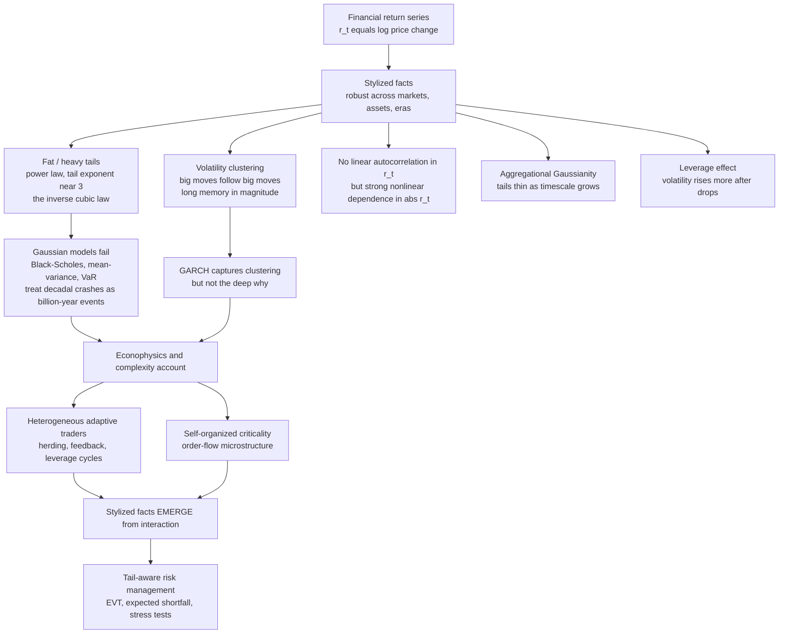

# 📉 Fat Tails and Financial Market Statistics

> [!abstract] TL;DR
> Financial returns are **not** drawn from a Gaussian bell curve. Across every market, asset, and era they display the same robust **stylized facts** — above all **fat (heavy) tails** (the distribution of returns decays like a **power law**, with an empirical tail exponent near **3**, the "inverse cubic law," so crashes are far more frequent than Gaussian math allows) and **volatility clustering** (turbulent periods clump together and volatility has **long memory**, even though the *direction* of returns is nearly unpredictable). The standard framework built on Gaussian assumptions — geometric Brownian motion, Black-Scholes, mean-variance portfolios, and Value-at-Risk — systematically **underestimates tail risk**, a modeling failure implicated in blowups from LTCM to the 2008 Gaussian-copula catastrophe. Complexity economics and **econophysics** explain these regularities as **emergent** from the interactions of heterogeneous adaptive traders, herding, leverage cycles, and self-organized criticality, motivating tail-aware risk management (extreme-value theory, expected shortfall, stress testing). Getting the tails right is, quite literally, a matter of financial survival.

---

## Intuition

**Analogy — the crash that "cannot" happen.** On **October 19, 1987** ("Black Monday"), the US stock market fell **23 percent in a single day**. According to the Gaussian bell-curve models on which Wall Street was built, a daily move that large is roughly a **20-sigma** event — and under a normal distribution a 20-sigma day should occur about **once every several billion billion years**, vastly longer than the age of the universe. Yet these "impossible" crashes keep arriving: 1987, the 1998 LTCM collapse, the 2008 meltdown, the 2010 flash crash, the 2020 COVID plunge — roughly one per decade. The models were not slightly off; they were **catastrophically** off, because they used the wrong probability distribution.

Real market returns do not follow a bell curve. They have **fat tails**: extreme moves are rare, but nowhere near as rare as the comfortable Gaussian math pretends. Picture two dartboards for "tomorrow's return." The Gaussian board has almost all its area packed near the center and essentially **nothing** past the edges. The real market's board is **taller and skinnier in the middle** (most days are calm — low volatility) **but with far more darts scattered out in the far corners** (the rare violent days). Betting your bank on the first board when you are actually playing the second is how banks, funds, and economies get blown up. The tails are where the danger lives — and the Gaussian model is blind to them.

---

## How It Works

The mainstream finance framework assumes returns are **independent, identically distributed, and Gaussian** — a random walk whose increments are normal, giving the elegant machinery of geometric Brownian motion, Black-Scholes, and mean-variance optimization. Decades of empirical work, crystallized in Rama Cont's canonical survey *"Empirical properties of asset returns: stylized facts and statistical issues"* (2001), show this assumption is empirically false in specific, **universal** ways. The **stylized facts** are the robust statistical regularities of returns that recur across stocks, currencies, commodities, and centuries — the empirical fingerprint that any real theory of markets must reproduce, and that the Gaussian efficient-market picture cannot.

### The core stylized facts

1. **Fat (heavy) tails — the headline fact.** The unconditional distribution of returns has tails that decay as a **power law**, `P(|r| > x) ~ x^(-alpha)`, not the exponential-squared decay of a Gaussian. Gopikrishnan, Plerou, and Stanley's analysis of millions of price movements found a remarkably stable **tail exponent alpha near 3** — the "**inverse cubic law**" — holding across individual stocks, indices, and markets. A power-law tail means extreme moves are *scale-free*: there is no characteristic "largest plausible" crash. Concretely, the distribution is **leptokurtic** — more **peaked in the center** and **heavier in the tails** than a Gaussian, giving high (often *infinite* in the limit) **excess kurtosis**.

2. **Volatility clustering — the second key fact.** Benoit Mandelbrot observed in 1963 that "large changes tend to be followed by large changes, of either sign, and small changes tend to be followed by small changes." Volatility arrives in **clusters**: calm stretches and turbulent stretches, not a steady drizzle of risk. Crucially, while **raw returns show almost no linear autocorrelation** (you cannot predict tomorrow's *direction* — near-efficiency), the **magnitude** of returns (`|r|` or `r^2`) has strong, **slowly decaying (power-law) autocorrelation** — **long memory**. The *sign* is unpredictable; the *size* is persistent.

3. **Absence of linear autocorrelation, presence of nonlinear dependence.** Returns are close to serially uncorrelated (consistent with weak-form efficiency), yet they are **not independent** — there is powerful **nonlinear dependence** in the volatility. "Uncorrelated" is not "independent," and conflating the two is the root statistical error.

4. **Aggregational Gaussianity.** As you aggregate returns over **longer** horizons (daily to weekly to monthly), the distribution looks **progressively more Gaussian** — the tails thin out. The fat tails are a **short-timescale** phenomenon, most violent at the high-frequency end where microstructure and feedback dominate.

5. **The leverage effect.** Volatility responds **asymmetrically** to returns: it tends to rise more after a price **drop** than after an equivalent rise. Fear is more explosive than greed. This gain-loss asymmetry (large drawdowns without symmetric run-ups) is what makes the **volatility smile/skew** in option prices skewed rather than symmetric.

6. **Further regularities.** **Volume-volatility correlation** (trading volume and volatility co-move), and **multifractal scaling** (Mandelbrot: different moments of returns scale with different exponents, so a single fractal dimension does not suffice — the roughness itself is scale-dependent). Together these paint markets as objects with rich, non-Gaussian statistical structure.

### Why the Gaussian models fail

The entire edifice of classical quantitative finance encodes the Gaussian assumption: the **random walk / geometric Brownian motion** for prices, the **Black-Scholes** option-pricing formula, **Modern Portfolio Theory** (mean-variance, which needs variance to be a *sufficient* risk measure), and **Value-at-Risk** (VaR, which reads a loss quantile off an assumed distribution). Because the Gaussian tail vanishes so fast, every one of these tools **systematically underprices extreme risk** — treating decadal crashes as billion-year events. The infamous **Gaussian copula** (David Li's model of default dependence for CDOs) assumed away tail co-movement and became "the formula that killed Wall Street" in 2008. **LTCM** blew up in 1998 on moves its models called "10-sigma." **Black swans** (Taleb) are precisely the consequential events that live in the fat tails the models pretend are empty.

### Where the fat tails come from — the econophysics account

Complexity economics inverts the mainstream logic: the stylized facts are not noise to be assumed away but the **emergent signature of markets as complex adaptive systems**. **Econophysics** (physicists such as Mantegna and Stanley, Bouchaud, and Farmer, applying statistical mechanics to markets) shows these power-law and scaling regularities **emerge bottom-up** from the interactions of **heterogeneous, adaptive traders**: herding and imitation, leverage and margin cycles, and order-flow microstructure generate clustering and fat tails without any external Gaussian noise. Agent-based artificial markets like the Santa Fe model (see [[The_Santa_Fe_Artificial_Stock_Market]]) *reproduce* fat tails and volatility clustering endogenously, and **self-organized criticality** frames markets as perpetually poised near a critical state where avalanches of all sizes occur. Mandelbrot supplied the intellectual foundation: from the 1960s he showed cotton prices and financial returns are **fractal** — self-similar and scale-invariant, "wild" rather than "mild" randomness — the same statistical roughness at every time scale.



---

## Key Concepts

**Secondary (intuition level)**
- **The bell curve lies about extremes.** Real markets have far more calm days *and* far more violent days than a normal distribution predicts. Averages hide the danger.
- **Crashes are recurring, not freakish.** A "once-in-a-billion-years" move under the Gaussian happens every decade in reality, because the real tails are fat.
- **Calm predicts calm, storms predict storms — but not direction.** You cannot guess whether tomorrow is up or down, yet you *can* guess whether it will be a big-move day, because turbulence clusters.
- **The tails are where the action and the danger are.** Most of the profit and loss over a lifetime of investing comes from a handful of extreme days.

**Undergraduate (mechanism level)**
- **Fat / heavy tails.** `P(|r| > x) ~ x^(-alpha)` (power law) rather than Gaussian decay; the **inverse cubic law** puts the tail exponent `alpha` near 3 for many markets (Gopikrishnan-Stanley).
- **Leptokurtosis.** The return distribution is peaked with heavy tails; **excess kurtosis** (fourth standardized moment minus 3) is large and positive, whereas a Gaussian has excess kurtosis of exactly 0.
- **Volatility clustering and long memory.** Near-zero autocorrelation in `r`, but slow (power-law) decay in the autocorrelation of `|r|` and `r^2`. Captured statistically by **ARCH/GARCH** models (see [[GARCH_Models]]).
- **Aggregational Gaussianity.** The Central Limit Theorem partially "wins" at long horizons: tails thin as returns are summed over time. Fat tails are strongest at high frequency.
- **The leverage effect and the volatility smile.** Volatility rises more after drops; Black-Scholes' constant-volatility assumption is violated, so implied volatility forms a **smile/skew** across strikes (see [[Volatility_Smile]]).

**Graduate (nuance and reach)**
- **Levy-stable vs. finite-variance heavy tails.** Mandelbrot first proposed **alpha-stable Levy** distributions (infinite variance). Empirical tail exponents near 3 lie **outside** the stable range (alpha < 2), so returns have **finite variance but infinite fourth moment** — "truncated Levy" / power-law tails, not fully stable. The distinction matters for whether the CLT applies.
- **Multifractality.** Mandelbrot's **Multifractal Model of Asset Returns** (MMAR) and multiplicative cascades: the scaling exponent of the `q`-th moment is a **nonlinear** function of `q`, so returns are not self-similar with a single exponent but a spectrum of them.
- **GARCH generates unconditional fat tails.** Even with Gaussian innovations, a GARCH(1,1) process has **heavy unconditional tails** and clustering — a minimal mechanism showing that conditional heteroskedasticity alone manufactures the stylized facts.
- **Estimating the tail — the Hill estimator and EVT.** Extreme-value theory models the tail directly (generalized Pareto / generalized extreme value); the **Hill estimator** gives `alpha` from the top-`k` order statistics. Tail estimation is treacherous: too few points and the estimate is noisy, too many and the bulk contaminates the tail.
- **Dragon-kings vs. black swans.** Sornette argues the very largest crashes may be **dragon-kings** — endogenously amplified outliers even *beyond* the power law, in principle carrying faint precursors, unlike Taleb's unpredictable black swans.
- **Risk-measure coherence.** VaR is **not subadditive** (it can penalize diversification) and is blind to the shape of losses *beyond* the quantile; **Expected Shortfall / CVaR** is coherent and tail-sensitive, which is why Basel moved regulatory capital from VaR toward ES (see [[Expected_Shortfall]]).

---

## Python Demo

We simulate a **GARCH(1,1)** return series with Student-t innovations — a minimal engine that endogenously produces **both** headline stylized facts — and then exhibit the empirical fingerprint of real markets. **(a)** We demonstrate **fat tails** three ways: a log-scale histogram of standardized returns against a fitted Gaussian, a QQ plot whose tails bend violently away from the Gaussian line, and a log-log survival plot whose near-linear tail betrays a power law (with a **Hill** tail-exponent estimate). We also report the **excess kurtosis** and compute how many "sigma" the single largest move is and how absurdly unlikely a Gaussian says it should be. **(b)** We show **volatility clustering**: `|returns|` over time visibly clumps into turbulent and calm regimes, and the autocorrelation of `|returns|` decays slowly (long memory) while the autocorrelation of raw returns sits at essentially zero. **(c)** We show the **risk implication**: across confidence levels, the empirical frequency of breaching the **Gaussian-VaR** threshold vastly exceeds what the Gaussian assumes — the systematic underestimation of tail risk, quantified.

```python
# Fat tails & the stylized facts of financial returns.
# (a) fat tails: log-hist vs Gaussian, QQ plot, log-log power-law tail + Hill exponent
# (b) volatility clustering: |returns| time series + slow ACF of |r| vs ~0 ACF of r
# (c) risk: Gaussian-VaR exceedance frequency vs the actual (fat-tailed) frequency
import numpy as np
import matplotlib.pyplot as plt
from math import erfc, sqrt

rng = np.random.default_rng(42)

# ---------------- simulate a GARCH(1,1) return series ----------------
# GARCH endogenously generates BOTH fat tails and volatility clustering.
# Student-t(df=5) innovations make the heavy tail unmistakable, as real markets show.
N = 120_000                              # ~475 trading years of daily returns
omega, alpha, beta = 2e-6, 0.09, 0.90    # alpha + beta < 1 -> stationary
df = 5.0                                  # Student-t degrees of freedom (fat innovations)
z = rng.standard_t(df, size=N) * np.sqrt((df - 2) / df)   # unit-variance t innovations

sigma2 = np.empty(N)
r = np.empty(N)
sigma2[0] = omega / (1.0 - alpha - beta)  # unconditional variance
r[0] = np.sqrt(sigma2[0]) * z[0]
for t in range(1, N):
    sigma2[t] = omega + alpha * r[t-1]**2 + beta * sigma2[t-1]   # conditional variance
    r[t] = np.sqrt(sigma2[t]) * z[t]

r = r - r.mean()
r_std = r / r.std()                       # standardized returns (unit variance)

# ---------------- (a) FAT TAILS: kurtosis + the largest move in sigma ----------------
excess_kurt = np.mean(r_std**4) - 3.0     # 0 for a Gaussian
max_sigma = float(np.max(np.abs(r_std)))
p_gauss = erfc(max_sigma / sqrt(2.0))     # Gaussian P(|Z| > max_sigma), two-sided
years_between = 1.0 / (p_gauss * 252.0)   # expected years between such days under a Gaussian

# Hill tail-exponent estimate on the top-k |returns| (inverse-cubic law -> ~3 in markets)
k = 4000
top = np.sort(np.abs(r_std))[-k:]
hill_alpha = 1.0 / np.mean(np.log(top / top[0]))

# ---------------- (b) VOLATILITY CLUSTERING: autocorrelation ----------------
def acf(x, lags):
    x = x - x.mean()
    denom = np.dot(x, x)
    return np.array([np.dot(x[:len(x)-k], x[k:]) / denom for k in range(lags + 1)])

LAGS = 60
acf_r = acf(r_std, LAGS)                  # raw returns: ~0
acf_absr = acf(np.abs(r_std), LAGS)       # |returns|: slow (long-memory) decay

# ---------------- (c) VaR: Gaussian-assumed vs empirical exceedance ----------------
levels = np.array([0.99, 0.995, 0.999, 0.9997])          # confidence levels
zscore = np.array([2.326, 2.576, 3.090, 3.432])          # Gaussian VaR z at those levels
gauss_freq = 1.0 - levels                                 # Gaussian-assumed loss frequency
emp_freq = np.array([np.mean(r_std < -z) for z in zscore])  # actual breach frequency (lower tail)

# ================================ plotting ================================
fig, ax = plt.subplots(2, 3, figsize=(16, 9))

# (a1) log-scale histogram vs fitted Gaussian
counts, edges = np.histogram(r_std, bins=200)
centers = 0.5 * (edges[:-1] + edges[1:])
binw = edges[1] - edges[0]
gauss = N * binw * np.exp(-centers**2 / 2.0) / np.sqrt(2.0 * np.pi)
ax[0,0].step(centers, np.maximum(counts, 0.1), where="mid", color="navy", label="market returns")
ax[0,0].plot(centers, gauss, "r--", lw=2, label="fitted Gaussian")
ax[0,0].set_yscale("log")
ax[0,0].set_title("(a) Fat tails: log-scale histogram")
ax[0,0].set_xlabel("standardized return  (sigma units)")
ax[0,0].set_ylabel("count  (log scale)")
ax[0,0].legend(fontsize=8); ax[0,0].grid(alpha=0.3)

# (a2) QQ plot: empirical order statistics vs equal-size Gaussian sample
gsample = np.sort(rng.standard_normal(N))
esample = np.sort(r_std)
idx = np.linspace(0, N - 1, 3000).astype(int)
ax[0,1].plot(gsample[idx], esample[idx], ".", color="darkorange", ms=4)
lim = max(abs(esample[0]), esample[-1])
ax[0,1].plot([-6, 6], [-6, 6], "k--", lw=1, label="Gaussian reference")
ax[0,1].set_xlim(-6, 6); ax[0,1].set_ylim(-lim, lim)
ax[0,1].set_title("(a) QQ plot: tails bend away from Gaussian")
ax[0,1].set_xlabel("Gaussian quantiles"); ax[0,1].set_ylabel("market quantiles")
ax[0,1].legend(fontsize=8); ax[0,1].grid(alpha=0.3)

# (a3) log-log survival (CCDF) of |returns|: power-law tail vs Gaussian
absr = np.sort(np.abs(r_std))[::-1]
ccdf = np.arange(1, N + 1) / N
sub = np.unique(np.geomspace(1, N - 1, 400).astype(int))
xg = np.linspace(0.5, 8, 200)
ccdf_gauss = np.array([erfc(x / sqrt(2.0)) for x in xg])
ax[0,2].loglog(absr[sub], ccdf[sub], ".", color="crimson", ms=4, label="market  P(|r|>x)")
ax[0,2].loglog(xg, ccdf_gauss, "b--", lw=2, label="Gaussian  P(|Z|>x)")
ax[0,2].set_title(f"(a) Power-law tail (Hill alpha = {hill_alpha:.1f})")
ax[0,2].set_xlabel("x  (sigma units, log)"); ax[0,2].set_ylabel("survival prob (log)")
ax[0,2].legend(fontsize=8); ax[0,2].grid(alpha=0.3, which="both")

# (b1) |returns| over time -> visible clustering
seg = slice(0, 4000)
ax[1,0].plot(np.abs(r_std)[seg], color="teal", lw=0.6)
ax[1,0].set_title("(b) Volatility clustering: |returns| over time")
ax[1,0].set_xlabel("trading day"); ax[1,0].set_ylabel("|standardized return|")
ax[1,0].grid(alpha=0.3)

# (b2) ACF: raw returns ~0 vs |returns| slow decay (long memory)
lags = np.arange(LAGS + 1)
ax[1,1].bar(lags - 0.2, acf_r, width=0.4, color="gray", label="ACF of returns r")
ax[1,1].bar(lags + 0.2, acf_absr, width=0.4, color="purple", label="ACF of |returns|")
ax[1,1].axhline(0, color="k", lw=0.8)
ax[1,1].set_title("(b) Direction unpredictable, magnitude persistent")
ax[1,1].set_xlabel("lag (days)"); ax[1,1].set_ylabel("autocorrelation")
ax[1,1].legend(fontsize=8); ax[1,1].grid(alpha=0.3)

# (c) Gaussian-assumed vs actual VaR-breach frequency
xpos = np.arange(len(levels))
ax[1,2].bar(xpos - 0.2, gauss_freq, width=0.4, color="steelblue", label="Gaussian assumes")
ax[1,2].bar(xpos + 0.2, emp_freq, width=0.4, color="firebrick", label="actually happens")
ax[1,2].set_yscale("log")
ax[1,2].set_xticks(xpos)
ax[1,2].set_xticklabels([f"{100*l:.2f}" for l in levels])
ax[1,2].set_title("(c) VaR underestimates tail risk")
ax[1,2].set_xlabel("VaR confidence level (percent)")
ax[1,2].set_ylabel("loss-breach frequency (log)")
ax[1,2].legend(fontsize=8); ax[1,2].grid(alpha=0.3, axis="y")

plt.tight_layout(); plt.show()

# ---------------------------- console summary ----------------------------
print(f"Excess kurtosis: {excess_kurt:.1f}  (Gaussian = 0; markets are strongly leptokurtic)")
print(f"Largest move: {max_sigma:.1f} sigma.  Under a Gaussian a day this extreme")
print(f"  should occur about once every {years_between:.2e} years -- yet it is in the sample.")
print(f"Hill tail-exponent estimate alpha ~ {hill_alpha:.1f}  (empirical markets cluster near 3).")
ratio = emp_freq[2] / gauss_freq[2]
print(f"At the 99.9% VaR level: losses breach it {ratio:.0f}x more often than the Gaussian predicts.")
```

Running it, the console prints a large positive **excess kurtosis**, a **largest move of many sigma** whose Gaussian recurrence time is astronomically longer than the age of the universe (yet it sits in the sample), a **Hill exponent** in the low single digits, and a **99.9 percent VaR** that is breached many times more often than the Gaussian permits. Panel **(a)** shows the fat tails from three angles — the histogram's wings poke *above* the Gaussian dashes, the QQ plot flares into an S at the extremes, and the survival plot's tail is a near-straight line on log-log axes (a power law) while the Gaussian curve plunges. Panel **(b)** shows `|returns|` clumping into turbulent bursts, with the autocorrelation of `|returns|` decaying slowly (long memory) while the raw-return autocorrelation is a flat carpet at zero. Panel **(c)** is the risk lesson in one chart: what the Gaussian treats as a "1-in-1000-day" loss actually happens far more often. The bell curve is not merely imprecise about markets — it is dangerously wrong exactly where money is lost.

---

## Real-World Applications

> **Example — Value-at-Risk and the 2008 crisis.** Pre-crisis bank risk desks ran **Gaussian (or thin-tailed) VaR** to size trading books and set regulatory capital. A "99 percent one-day VaR" tells you the loss you should exceed only 1 day in 100 — but it says *nothing* about how bad the other days get, and if the assumed distribution is Gaussian it badly underprices those days. When the mortgage market turned, banks logged strings of "25-sigma events, several days in a row" (in the words of Goldman's CFO) — a statement that is nonsense under a Gaussian and merely a Tuesday under fat tails. The **Gaussian copula** used to rate CDO tranches assumed defaults were weakly, normally dependent; when housing fell everywhere at once, the tail dependence the model excluded is exactly what materialized. The post-crisis regulatory response (Basel 2.5 / FRTB) shifted the capital measure from VaR toward **Expected Shortfall**, precisely because ES integrates over the fat tail instead of ignoring it.

- **Risk management and capital adequacy.** Tail-aware VaR/ES, stress testing beyond Gaussian scenarios, and back-testing exceedances are the daily bread of bank and fund risk desks (see [[Value_at_Risk]], [[Expected_Shortfall]]).
- **Option pricing and hedging.** Fat tails and the leverage effect produce the **volatility smile/skew** that flat Black-Scholes cannot generate; practitioners layer on stochastic-volatility and jump-diffusion models to price out-of-the-money options correctly (see [[Black_Scholes_Model]], [[Volatility_Smile]]).
- **Portfolio construction.** Mean-variance optimization assumes variance captures risk; with fat tails and skew, higher moments matter, motivating tail-risk hedging, CVaR-optimized portfolios, and Taleb-style **anti-fragile / barbell** allocations positioned *for* the tails.
- **Systemic risk and crashes.** Fat-tailed loss distributions are the statistical fingerprint of the cascade dynamics in [[Cascades_Contagion_and_Financial_Crises]] and the interconnected exposures in [[Financial_Networks_and_Systemic_Risk]].
- **High-frequency and algorithmic trading.** Microstructure statistics — order-flow, the fattest tails living at the shortest timescales, and flash-crash dynamics — are central to execution and market-making (see [[High_Frequency_Trading]]).

This note is the **statistical / econophysics** treatment of markets as complex systems; it complements not-yet-written siblings **Power_Laws_and_Heavy_Tails_in_Economics** (the general power-law machinery behind the inverse-cubic law), **Econophysics_and_Statistical_Mechanics_of_Markets** (the statistical-mechanics toolkit and its practitioners), and **Self_Organized_Criticality_in_Economics** (the critical-state mechanism that generates scale-free avalanches), and connects to the agent-based generator in [[The_Santa_Fe_Artificial_Stock_Market]].

---

## Common Pitfalls

- **Assuming Gaussian by default.** Reaching for the normal distribution "because it is convenient" is the original sin. It is not a neutral simplification; it deletes exactly the tail where catastrophe lives. Always check kurtosis and the tail before trusting a mean-variance or VaR number.
- **Confusing "uncorrelated" with "independent."** Returns are nearly uncorrelated, which tempts modelers to treat them as i.i.d. But the strong nonlinear dependence in volatility means they are far from independent — and it is the dependence that produces clustering and fat conditional tails.
- **Trusting a single VaR number.** VaR reports a *threshold* and is silent about the shape of losses beyond it; it is also not sub-additive, so it can wrongly penalize diversification. Prefer Expected Shortfall and stress tests that probe the tail's magnitude, not just its edge.
- **Under-sampling the tail.** With only a few years of data you will *never* see the rare event, then conclude it "cannot happen." The largest historical move is a lower bound on the possible, not the maximum. Use long histories, pooled cross-sections, and EVT to estimate the tail you have not yet observed.
- **Naive Hill / tail-exponent estimation.** Tail estimates are unstable: too few order statistics gives huge variance, too many lets the Gaussian-like bulk bias `alpha` upward. Use several thresholds, plot the Hill estimate against `k`, and report a range, not a point.
- **Over-reading "aggregational Gaussianity."** Because monthly returns look more Gaussian, some conclude the tail problem "washes out." It does not for the risks that matter — a single day (1987, 2020) can wipe out a leveraged book long before any monthly averaging helps.
- **Mistaking a fitted GARCH for understanding.** GARCH *describes* clustering and manufactures fat tails, but it is a statistical black box. It does not tell you *why* traders herd or when the leverage cycle turns — that is the job of the agent-based and complexity account.

---

## Related Concepts

- [[The_Santa_Fe_Artificial_Stock_Market]] — the agent-based artificial market that endogenously *reproduces* fat tails and volatility clustering from heterogeneous adaptive traders.
- [[Cascades_Contagion_and_Financial_Crises]] — the cascade dynamics whose statistical fingerprint is the fat-tailed distribution of crisis sizes analyzed here.
- [[Financial_Networks_and_Systemic_Risk]] — how interconnected exposures create the correlated, tail-heavy losses that Gaussian risk models miss.
- [[Economies_as_Complex_Adaptive_Systems]] — the parent frame: stylized facts as emergent properties of an adaptive system, not equilibrium noise.
- [[Bounded_Rationality_and_Heterogeneous_Agents]] — the micro-behavioral foundations (diverse strategies, adaptation) from which clustering and fat tails emerge.
- [[Non_Equilibrium_and_Out_of_Equilibrium_Dynamics]] — the disequilibrium engine that keeps markets far from the tidy Gaussian random walk.
- [[Value_at_Risk]] — the quantile risk measure that systematically underestimates tail loss under Gaussian assumptions.
- [[Expected_Shortfall]] — the coherent, tail-sensitive alternative to VaR that integrates over the fat tail.
- [[GARCH_Models]] — the workhorse statistical model of volatility clustering and conditional heteroskedasticity.
- [[Black_Scholes_Model]] — the Gaussian option-pricing model whose constant-volatility assumption the stylized facts break.
- [[Volatility_Smile]] — the market's empirical fingerprint of fat tails and the leverage effect, priced into options.
- [[Modern_Portfolio_Theory]] — mean-variance optimization, valid only if variance captures risk, which fat tails deny.
- [[High_Frequency_Trading]] — where microstructure and the fattest short-timescale tails live, and flash crashes originate.
- [[Herding_Bubbles_and_Crashes]] — the behavioral-finance mechanism (imitation, feedback) that helps generate fat tails and clustering.
- [[Sentiment_and_Noise_Trading]] — noise traders and sentiment as sources of the excess volatility and non-Gaussian dynamics.
- [[Behavioral_Finance_Foundations]] — the behavioral departures from rational-expectations efficiency that complexity economics formalizes.
- [[Market_Anomalies_and_Limits_to_Arbitrage]] — why mispricings and non-Gaussian dynamics persist rather than being arbitraged away.
- [[Fractals_and_Self_Similarity]] — Mandelbrot's scale-invariant, self-similar structure of price series ("wild" randomness).
- [[Criticality_and_Phase_Transitions]] — self-organized criticality and scale-free avalanche sizes: the physics beneath fat-tailed events.
- [[Small_World_and_Scale_Free_Networks]] — power-law structure in interaction topologies, the cousin of power-law return tails.
- [[Cascades_and_Systemic_Risk]] — the systems-thinking treatment of threshold cascades producing heavy-tailed event sizes.
- [[Phase_Transitions_and_Critical_Phenomena]] — the statistical-physics theory of criticality and power laws that econophysics imports.
- [[Classical_Statistical_Mechanics]] — the statistical-mechanics toolkit econophysicists apply to markets of interacting agents.
- [[Common_Probability_Distributions]] — the Gaussian, Student-t, Pareto, and Levy distributions at the heart of the fat-tail debate.

---

## Review Questions

1. **(Conceptual)** A colleague says returns are "basically a random walk, so they must be Gaussian." Separate the two claims. Explain how returns can be nearly **serially uncorrelated** (consistent with a random walk in *direction*) yet strongly **non-independent** and **fat-tailed**, and identify which stylized fact captures the dependence a random-walk-plus-Gaussian model misses.
2. **(Scenario)** You inherit a trading book whose risk is monitored by a Gaussian 99 percent one-day VaR that has "never been breached in three years." Using excess kurtosis, aggregational Gaussianity, and the demo's VaR panel, explain why this track record is *not* evidence the model is safe. What two concrete changes to the risk methodology would you make, and what does each fix?
3. **(Trade-off / critique)** Econophysics claims the fat tails and volatility clustering **emerge** from herding, leverage, and self-organized criticality among heterogeneous traders, while a GARCH modeler simply *fits* the clustering statistically. Compare the two approaches: what does each buy you for (a) forecasting next week's volatility, (b) sizing capital against a once-a-decade crash, and (c) understanding *why* the tail exponent sits near 3? Under what circumstances is the "merely descriptive" GARCH good enough, and when is the mechanistic complexity account indispensable?

---

## Sources

- Cont, R. (2001). "Empirical properties of asset returns: stylized facts and statistical issues." *Quantitative Finance, 1*(2), 223–236. — the canonical catalogue of the stylized facts.
- Mandelbrot, B. (1963). "The Variation of Certain Speculative Prices." *Journal of Business, 36*(4), 394–419. — fat tails and fractal structure in cotton and commodity prices; see also Mandelbrot & Hudson (2004), *The (Mis)behavior of Markets*.
- Gopikrishnan, P., Plerou, V., Amaral, L. A. N., Meyer, M., & Stanley, H. E. (1999). "Scaling of the distribution of fluctuations of financial market indices." *Physical Review E, 60*(5), 5305–5316. — the inverse-cubic tail-exponent law.
- Mantegna, R. N., & Stanley, H. E. (2000). *An Introduction to Econophysics: Correlations and Complexity in Finance.* Cambridge University Press. — the founding econophysics text.
- Bouchaud, J.-P., & Potters, M. (2003). *Theory of Financial Risk and Derivative Pricing* (2nd ed.). Cambridge University Press. — heavy-tailed risk, extreme-value theory, and non-Gaussian option pricing.
- Taleb, N. N. (2007). *The Black Swan: The Impact of the Highly Improbable.* Random House. — the practical and philosophical case for respecting the fat tails the models ignore.

---

#complexity-economics #fat-tails #financial-markets #volatility-clustering #tail-risk
