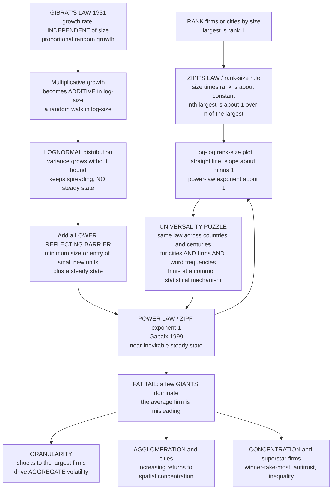

# 🏙️ Firm Size and City Size Distributions

> [!abstract] TL;DR
> Two of the most striking, precise, and *universal* empirical regularities in all of economics are the **size distributions of firms and cities**: both follow a **power law** — approximately **Zipf's law**, a power law with exponent close to **1**. Rank the entities by size (largest = rank 1) and you find **size × rank ≈ constant**: the second-biggest city or firm is about *half* the biggest, the tenth is about a *tenth*, and the *n*th is about **1/n** of the largest. On a **log-log rank-size plot** this is a **straight line with slope ≈ −1**, and it holds astonishingly well for cities *across different countries and stable over centuries*, and approximately for firms. The universality is the puzzle: why exponent ≈ 1, and why the *same* law for cities in ancient Rome and modern China, for firms, and even for word frequencies? The answer is that a **simple statistical growth process — not detailed economic fundamentals — drives the distribution**. **Gibrat's law of proportionate effect** (1931) says entities grow at rates *independent of their size* (proportional random growth); proportional growth is *additive in logs*, a **random walk in log-size** that spreads forever into a **lognormal**. Add one ingredient — a **lower reflecting barrier** (a minimum size, or the continual entry of small new units) or a steady state — and **Xavier Gabaix (1999)** proved this near-*inevitably* generates **Zipf's law with exponent 1**. The fat-tailed dominance of a few giants has deep consequences: because idiosyncratic shocks to the *largest* firms do not diversify away, the economy is **granular** (Gabaix 2011) — firm-level shocks drive *aggregate* volatility; a handful of **superstar firms** capture huge shares of output, employment, R&D, and profit; **agglomeration** economies make cities engines of productivity; and the whole picture frames modern debates over **market concentration, antitrust, the labor share, and inequality**. These size distributions are the canonical illustration of **power laws, universality, and emergent order** in complexity economics.

---

## Intuition

**Analogy — rank the world's cities and watch something magical appear.** Line up every city on Earth from largest to smallest and write down each one's population next to its rank. A pattern jumps out that looks almost like a law of physics. The biggest city is some size *S*. The second-biggest is not a random fraction of it — it is close to **half** of *S*. The third is close to **a third**, the fourth close to **a quarter**, the tenth close to **a tenth**. Multiply any city's *rank* by its *size* and you get roughly the **same number every time**. This is **Zipf's law**, and the eerie part is not that it holds for one country in one decade — it is that it holds for cities in the United States and in India, in medieval Europe and in the modern megacities of Asia, and it has held for *centuries*. Nobody sat in a planning ministry and arranged the world's cities into this ratio. It **emerged**.

Now do the same for *companies*. Rank every firm by employees or revenue and the same lopsided fingerprint appears: a tiny number of corporate titans, then a long, fat tail of small businesses, in a remarkably regular mathematical proportion — again, close to the *n*th firm being **1/n** the size of the largest. The **average firm** turns out to be a nearly meaningless notion: the mean is dragged around by a handful of giants that dwarf everyone else. The deep question this note answers is *why*. Why should cities — shaped by geography, politics, war, and trade — and firms — shaped by technology, management, and markets — obey the **same simple law**? The universality is a giant clue: it says the pattern is *not* about the specific economics at all. It is what you get, almost inevitably, from a very general growth process. Follow that clue and you arrive at one of the most elegant results in the field. (This is a flagship example of the broader family of **power laws in economics** — see the planned sibling `Power_Laws_and_Heavy_Tails_in_Economics`.)

---

## How It Works

### Core mechanics

**1. The empirical regularity — power laws for firms and cities.** Empirically, if you count how many cities (or firms) have size at least *S*, that count falls off as a **power law**, `count of size >= S is proportional to S to the power minus alpha`, with the exponent **α close to 1**. Equivalently, the probability *density* falls as `S to the power minus (1 + alpha)` — a **heavy, fat tail** that decays polynomially, not exponentially. A power law has **no characteristic scale**: unlike a bell curve, there is no "typical" city or firm around which the rest cluster. Instead you see structure at every scale — a few giants, more mid-sized ones, a mass of small ones — and the *ratios* between successive scales are constant. This is why the distribution is called **scale-free** (the same machinery behind [[Small_World_and_Scale_Free_Networks|scale-free networks]] and [[Fractals_and_Self_Similarity|fractal self-similarity]]).

**2. Zipf's law and the rank-size rule — the specific pattern.** **Zipf's law** is the special, sharp case **α = 1**. State it operationally: *rank* the entities by size, largest = rank 1. Then

> **size × rank ≈ constant**,   equivalently   **size of the *n*th largest ≈ (size of the largest) / n**.

So the 2nd is ~½ the 1st, the 10th ~1/10 the 1st. Because `size proportional to 1 over rank`, taking logs gives `log size = constant minus 1 times log rank` — a **straight line of slope −1 on a log-log rank-size plot**. (In cumulative/CCDF form the same distribution has exponent ≈ 1; the rank *is* essentially the empirical survival function times the sample size, which is why the rank-size slope equals **−1/α** and Zipf's α = 1 gives slope −1.) City sizes track this line with uncanny fidelity across countries and eras; firm sizes follow it approximately, with the U.S. firm-size distribution measured at α very close to 1 (**Axtell 2001**, *Science*).

**3. The universality puzzle — why exponent ≈ 1, and why *everywhere*?** Here is the mystery that makes this a *complexity* topic rather than a curiosity. The exponent is not just *some* number — it clusters near **1** (Zipf), and it does so for wildly different systems: cities in dozens of countries, firms, and even the frequency of words in language (Zipf's original 1949 observation). Different economies, institutions, technologies, and centuries — *same law*. Two entities as different as "a metropolis" and "a corporation" should not share a distribution unless something *general* — something **independent of the specific economics** — is generating both. Universality of this kind is a fingerprint that statistical physicists recognize instantly: it signals a **common generative mechanism** in which microscopic details wash out and only the coarse structure survives (the same logic as universality classes near [[Criticality_and_Phase_Transitions|critical points]]). The puzzle *demands* a mechanism, and the mechanism turns out to be almost embarrassingly simple.

**4. Gibrat's law — the generative key.** In 1931 Robert **Gibrat** proposed the **law of proportionate effect**: entities grow at rates that are **independent of their current size**. A firm's *percentage* growth in a given year does not systematically depend on whether it is tiny or enormous — the small corner shop and the multinational face growth *rates* drawn from the same distribution. Formally, `size next period = size now times a random growth factor`, where the factor's distribution is the **same regardless of size**. This one assumption — proportional (multiplicative) random growth — is the engine. Run it alone and it produces a **lognormal** distribution. Run it with one small addition and it produces **Zipf**.

**5. Why Gibrat + a barrier → Zipf (Gabaix's mechanism).** Take logs. Multiplicative growth becomes **additive** growth in log-size, so `log size` performs a **random walk** (a random increment each period, independent of the current level). A random walk *spreads*: its variance grows without bound, so the size distribution becomes an ever-widening **lognormal** with **no steady state** — it never settles into a stable shape. That, by itself, is *not* a power law. Now add the missing ingredient: a **lower reflecting barrier** — a minimum viable size below which a firm dies or a city ceases to exist, *or* the continual **entry of new small units** at the bottom. The barrier stops the downward spread and, combined with the requirement of a **steady state** (a distribution that stops changing shape), forces the random walk into a **stationary distribution that is a power law**. **Xavier Gabaix (1999)** proved the sharp result: **Gibrat's law of proportional growth plus a lower bound yields Zipf's law with exponent exactly 1** in the balanced-growth limit where all entities share the same *mean* growth rate. Zipf is not a coincidence tuned by economics — it is the **near-inevitable steady state of proportional growth with a floor**.

**6. Why exponent 1 specifically, and how deviations move it.** The Zipf value α = 1 corresponds to the knife-edge case where **expected size is stationary** — where the mean growth rate, after normalizing by the growing total, is zero (all units have the *same* expected growth, the "balanced growth" case). Systematic **deviations from Gibrat** modulate the exponent: if small firms or small cities grow *faster* than large ones (mean reversion, which is empirically true to some degree), the tail gets *thinner* and α rises above 1; if large ones grow faster, α falls below 1 and concentration intensifies. So Zipf is the reference point, and the *departures* from it are themselves economically informative.

**7. Economic consequence I — granularity.** Because the firm-size distribution is **fat-tailed**, the standard intuition that "idiosyncratic firm shocks cancel out across millions of firms" **fails**. With a thin-tailed (e.g. Gaussian) size distribution, aggregate volatility from firm-level shocks vanishes like `1 over square root of N`. But with a **Zipf** distribution, a few giant firms are so large that their private shocks do *not* diversify away — they move the macroeconomy. Gabaix (2011) called this the **granularity** of aggregate fluctuations: the largest ~100 U.S. firms can account for a substantial share of GDP volatility. The economy is not a smooth continuum of atoms; it is **grainy**, dominated by a few boulders. This connects the size distribution directly to production networks and macro volatility (see [[Economic_Networks_and_Interaction_Structure|economic networks]] and the planned sibling `Input_Output_Networks_and_Production`).

**8. Economic consequence II — agglomeration and cities.** Why do cities exist at all, and why Zipf? Cities are driven by **agglomeration economies** — *increasing returns to spatial concentration*: firms and people cluster to share thick labor markets, specialized suppliers, and — crucially — the **ideas and knowledge spillovers** that make dense places disproportionately innovative and productive. These are exactly the **increasing returns and positive feedback** of [[Increasing_Returns_and_Path_Dependence|increasing returns and path dependence]]: bigness begets bigness. The size distribution is the balance between agglomeration *benefits* (pulling people in) and congestion *costs* (pushing them out), and Gibrat-style proportional growth of this balance regenerates the power law. Larger cities also exhibit **superlinear scaling** of wages, patents, and GDP — a separate but related regularity (planned deep dive; compare [[Urban_and_Infrastructure_Systems|urban and infrastructure systems]]).

**9. Economic consequence III — superstar firms and concentration.** The modern relevance is acute. Rising **market concentration** and the ascent of **superstar firms** — a few dominant companies, especially tech platforms, capturing growing shares of sales, profit, and market value (**Autor et al. 2020**) — are the *fat tail getting fatter*. In industries with strong increasing returns and network effects, dynamics are **winner-take-most**, and the resulting concentration has been linked to a **falling labor share** and rising inequality. Viewing these through the power-law lens reframes competition and antitrust policy: when concentration arises from the *dynamics* of proportional growth and network effects rather than misconduct, the policy problem changes (this bridges to the planned siblings `Wealth_and_Income_Inequality_Dynamics` and `Economic_Complexity_and_the_Product_Space`).

### From proportional growth to Zipf — and its consequences



---

## Key Concepts

### Secondary (intuitive)

- **Zipf's law in one line.** Rank things by size; the *n*th biggest is about **1/n** of the biggest. The 2nd city is half the 1st, the 10th is a tenth. **Rank times size stays about constant.**
- **A few giants, a long tail.** Both cities and firms have a handful of huge ones and enormous numbers of small ones — never a tidy "average-sized" majority. The **average is misleading** because a few outliers dominate.
- **Nobody planned it.** These distributions **emerge** from simple growth, not from design — and the *same* pattern shows up in country after country and century after century, which is the real shock.
- **Gibrat's idea.** Big and small grow at the same *percentage* rate on average. That simple rule, plus a floor at the bottom, is enough to produce the whole lopsided pattern.

### Undergraduate (formal)

- **Power law vs lognormal.** A **power law** has a polynomial (fat) tail, `density proportional to S to the minus (1 + alpha)`; a **lognormal** is `log S` normally distributed. Pure proportional growth gives **lognormal**; proportional growth **with a lower barrier / steady state** gives a **power law**. Distinguishing them empirically in the far tail is genuinely hard (see Pitfalls).
- **The rank-size regression.** Fit `log(size) = c - b * log(rank)`. Zipf ⟺ **b ≈ 1**. This slope equals **−1/α** where α is the tail (CCDF) exponent, so Zipf's α = 1 gives slope −1. Beware the well-known **downward small-sample bias** in this OLS estimate (Gabaix–Ibragimov correction: regress on `rank − 1/2`).
- **Gibrat's law of proportionate effect.** `S(t+1) = S(t) * (1 + g(t))` with `g(t)` drawn independently of `S(t)`. Growth **rate** independent of size ⟹ in logs, `log S` is a **random walk with drift**.
- **Gabaix (1999) result.** Random growth (Gibrat) + a **reflecting lower barrier** (minimum size) + a steady state ⟹ **Zipf, α = 1**, when mean normalized growth is zero (balanced growth). The barrier is essential: without it the process is non-stationary lognormal.
- **Granularity (Gabaix 2011).** With a fat-tailed firm-size distribution, aggregate volatility from idiosyncratic firm shocks decays like `1 over log N` (for α ≈ 1), **not** `1 over square root of N`. Large-firm shocks therefore **do not wash out** and drive macro fluctuations.

### Graduate (advanced)

- **Reflected geometric Brownian motion and the stationary power law.** Let `x = log S` follow `dx = nu dt + sigma dW` with a **reflecting barrier** at `x_min`. For `nu < 0` a stationary density exists and is **exponential in x**: `p(x) proportional to exp(lambda (x - x_min))` with `lambda = 2 nu / sigma^2 < 0`. Transforming back, `p(S) proportional to S to the minus (1 + alpha)` with **α = |lambda| = 2|nu|/sigma²**. The **Zipf case α = 1** is exactly `nu = -sigma²/2`, i.e. the drift for which **E[S] is constant** — balanced growth. This is the analytic heart of the demo below.
- **Kesten processes and stochastic recurrence.** More generally, `S(t+1) = A(t) S(t) + B(t)` with random `A, B` (multiplicative growth `A` plus additive reset/entry `B`) is a **Kesten process**, whose stationary distribution has a power-law tail with exponent `alpha` solving `E[A^alpha] = 1`. Gibrat + barrier is the boundary case; adding an additive term `B` (entry, minimum size) is what pins down a finite α. This is the modern, general route (Gabaix 2009 review).
- **Deviations from Gibrat and the exponent.** Empirically small firms and cities grow **faster and more variably** (mean reversion, higher variance) — a violation of strict Gibrat. Size-dependent drift and variance perturb the stationary tail and explain why measured α scatters *around* 1 rather than sitting exactly on it. The Rossi-Hansberg–Wright and Córdoba analyses derive α from the underlying productivity/amenity processes.
- **Why universality.** Because the power-law exponent depends only on **coarse features** of the growth process (the drift-to-variance ratio and the barrier), *not* on institutional detail, systems with utterly different microeconomics fall into the **same universality class**. This is the economics analogue of critical universality — the reason a mechanism, not fundamentals, explains the regularity, and the philosophical payload of the whole topic (see [[Economies_as_Complex_Adaptive_Systems|economies as complex adaptive systems]]).
- **Granularity, formally.** If firm sizes are Zipf (α ≈ 1), the Herfindahl of the size distribution does **not** vanish as `N` grows; sales-weighted idiosyncratic shocks aggregate to an `O(1 / log N)` standard deviation of GDP growth — turning **micro** volatility into **macro** volatility, and making the identity of the *largest* firms a first-order macro object.

---

## Python Demo

We demonstrate **Zipf's law and its generative mechanism** end to end with only `numpy` and `matplotlib`. **Panel (a)** shows **Zipf's law** itself: draw power-law "city/firm sizes", sort them, and plot **size vs rank on log-log axes** — the characteristic **straight line with slope ≈ −1** where **rank × size ≈ constant**. **Panels (b)–(d)** *generate* that line from **Gibrat's law**: we simulate 20,000 "firms" that grow by **proportional random growth** (each period, size is multiplied by a random factor whose distribution is the *same regardless of size* — Gibrat's law of proportionate effect). **With a lower reflecting barrier** (a minimum size), the size distribution converges to a **power law / Zipf** — a straight rank-size line — *purely* from proportional growth plus a floor (Gabaix's mechanism). **Without the barrier**, the very same growth process gives a **lognormal that keeps spreading** — a *curved* rank-size line and no steady state. Panel (d) makes the mechanism explicit: the spread of log-size **saturates** with a barrier (steady state → power law) but **grows forever** without one (lognormal).

```python
# Zipf's law and its generative mechanism (Gibrat + a lower barrier -> Gabaix).
# (a) Zipf's law: rank-size log-log line with slope ~ -1  (rank x size ~ constant).
# (b) Gibrat WITH a reflecting lower barrier -> emergent Zipf (straight rank-size line).
# (c) Gibrat WITHOUT the barrier -> lognormal (curved rank-size line, keeps spreading).
# (d) spread of log-size over time: saturates (steady state) with a barrier, grows without.
import numpy as np
import matplotlib.pyplot as plt

rng = np.random.default_rng(0)

# ---------- (a) ZIPF'S LAW: draw power-law sizes and show the rank-size rule ----------
N = 5000
alpha = 1.0                                   # tail exponent 1 == Zipf (rank-size slope -1)
sizes = rng.pareto(alpha, N) + 1.0            # classical Pareto, x_min = 1, CCDF ~ x^-alpha
sizes = np.sort(sizes)[::-1]                  # largest first
rank = np.arange(1, N + 1)

def rank_size_slope(sz, r, lo, hi):
    """Fit log(size) = c - b*log(rank) over ranks [lo, hi]; return (slope, intercept)."""
    m = (r >= lo) & (r <= hi)
    b, c = np.polyfit(np.log(r[m]), np.log(sz[m]), 1)
    return b, c

slope_a, _ = rank_size_slope(sizes, rank, 10, 1500)
print(f"(a) Zipf draw:      rank-size slope = {slope_a:.2f}  (Zipf predicts -1.00)")

# ---------- (b,c) GIBRAT'S LAW: proportional random growth for many 'firms' ----------
def gibrat(M, T, sigma, barrier, rng, record_every=100):
    """Proportional random growth: each step multiply size by exp(increment),
    increment ~ Normal(mu, sigma) INDEPENDENT of current size (Gibrat's law).
    mu = -sigma^2/2  => E[size] constant (balanced growth) => Zipf exponent 1.
    barrier not None => reflecting lower bound at log-size = log(barrier)."""
    mu = -0.5 * sigma**2
    x = np.zeros(M)                           # log-size; every firm starts at size 1
    xmin = None if barrier is None else np.log(barrier)
    ts, spread = [], []
    for t in range(1, T + 1):
        x += rng.normal(mu, sigma, M)         # multiplicative growth = additive in logs
        if xmin is not None:
            np.maximum(x, xmin, out=x)        # reflecting lower barrier / minimum size
        if t % record_every == 0:
            ts.append(t); spread.append(x.std())
    return np.exp(x), np.array(ts), np.array(spread)

M, T, sigma = 20000, 8000, 0.15
size_bar,  ts, sd_bar  = gibrat(M, T, sigma, barrier=1.0,  rng=rng)   # WITH floor
size_free, _,  sd_free = gibrat(M, T, sigma, barrier=None, rng=rng)   # NO floor

size_bar_s  = np.sort(size_bar)[::-1]
size_free_s = np.sort(size_free)[::-1]
rk = np.arange(1, M + 1)

slope_b, c_b = rank_size_slope(size_bar_s, rk, 20, 2000)
print(f"(b) Gibrat+barrier: rank-size slope = {slope_b:.2f}  -> Zipf EMERGES from growth+floor")
for r in (1, 10, 100, 1000):                  # rank x size ~ constant is the Zipf signature
    print(f"      rank {r:>4}: size = {size_bar_s[r-1]:8.1f}   rank*size = {r*size_bar_s[r-1]:8.0f}")

# ---------- plot ----------
fig, ax = plt.subplots(2, 2, figsize=(14, 10))

# (a) Zipf's law rank-size line
ax[0,0].loglog(rank, sizes, ".", ms=3, color="#34495e", alpha=0.5)
xr = np.array([1.0, N])
ax[0,0].loglog(xr, sizes[0] * xr**(-1.0), "r--", lw=2, label="slope -1 (Zipf)")
ax[0,0].set_title(f"(a) ZIPF'S LAW: rank-size rule\nfitted slope = {slope_a:.2f}  (rank x size ~ const)")
ax[0,0].set_xlabel("rank"); ax[0,0].set_ylabel("size"); ax[0,0].legend(); ax[0,0].grid(alpha=0.3, which="both")

# (b) Gibrat WITH barrier -> emergent Zipf
ax[0,1].loglog(rk, size_bar_s, ".", ms=3, color="#c0392b", alpha=0.5)
ax[0,1].loglog(rk, np.exp(c_b) * rk**slope_b, "k--", lw=2, label=f"slope {slope_b:.2f}")
ax[0,1].set_title("(b) GIBRAT + lower barrier -> EMERGENT ZIPF\nproportional growth + floor makes the straight line")
ax[0,1].set_xlabel("rank"); ax[0,1].set_ylabel("size"); ax[0,1].legend(); ax[0,1].grid(alpha=0.3, which="both")

# (c) Gibrat WITHOUT barrier -> lognormal (curved)
ax[1,0].loglog(rk, size_free_s / np.median(size_free_s), ".", ms=3, color="#2980b9", alpha=0.5,
               label="no barrier (lognormal)")
ax[1,0].loglog(rk, size_bar_s / np.median(size_bar_s), ".", ms=3, color="#c0392b", alpha=0.4,
               label="with barrier (Zipf)")
ax[1,0].set_title("(c) NO barrier -> LOGNORMAL (curved rank-size)\nsame growth, but it just keeps spreading")
ax[1,0].set_xlabel("rank"); ax[1,0].set_ylabel("size / median"); ax[1,0].legend(); ax[1,0].grid(alpha=0.3, which="both")

# (d) spread of log-size over time: steady state vs endless spreading
ax[1,1].plot(ts, sd_bar,  color="#c0392b", lw=2, label="with barrier -> SATURATES (steady state)")
ax[1,1].plot(ts, sd_free, color="#2980b9", lw=2, label="no barrier -> grows ~ sqrt(t) (spreads)")
ax[1,1].set_title("(d) MECHANISM: spread of log-size over time\nbarrier gives a steady state -> power law; none -> lognormal")
ax[1,1].set_xlabel("growth period"); ax[1,1].set_ylabel("std of log-size"); ax[1,1].legend(); ax[1,1].grid(alpha=0.3)

plt.tight_layout()
plt.savefig("firm_city_zipf_gibrat.png", dpi=120)
print("\nSaved figure -> firm_city_zipf_gibrat.png")
```

Expected output (values vary slightly with the seed; the qualitative story is robust):

```
(a) Zipf draw:      rank-size slope = -1.0x  (Zipf predicts -1.00)
(b) Gibrat+barrier: rank-size slope = -1.0x  -> Zipf EMERGES from growth+floor
      rank    1: size =  xxxxx.x   rank*size =    xxxxx
      rank   10: size =   xxxx.x   rank*size =    xxxxx
      rank  100: size =    xxx.x   rank*size =    xxxxx
      rank 1000: size =     xx.x   rank*size =    xxxxx

Saved figure -> firm_city_zipf_gibrat.png
```

Read the four panels as one argument. **(a)** The drawn power-law sizes fall on a **straight log-log line of slope ≈ −1** — this *is* Zipf's law, and the printed `rank × size` values hover around a **constant**, exactly "the *n*th is 1/*n* of the largest." **(b)** The punchline: 20,000 firms given nothing but **Gibrat's proportional random growth plus a lower floor** self-organize into the *same* straight rank-size line, slope ≈ −1 — **Zipf emerges from a pure statistical growth process**, no economic fundamentals required (Gabaix's mechanism). **(c)** Strip out the floor and the identical growth process instead produces a **curved** rank-size line — a **lognormal** — because the log-size random walk just keeps spreading with nothing to stationarize it. **(d)** exposes the mechanism directly: with the barrier the spread of log-size **levels off** into a **steady state** (which *is* the power law), while without it the spread grows like `sqrt(t)` **forever** (the ever-widening lognormal). One ingredient — a floor plus a steady state — is the entire difference between an emergent Zipf and a runaway lognormal.

---

## Real-World Applications

> **Example — U.S. firm sizes are Zipf, and it makes the macroeconomy granular.** Robert **Axtell (2001)** measured the size distribution of all ~5.5 million U.S. firms and found a near-perfect **Zipf law** (α ≈ 1.06) spanning six orders of magnitude — from sole proprietors to Walmart. Xavier **Gabaix (2011)** then showed the macro consequence: because the tail is this fat, shocks to the ~100 largest firms do **not** average away, and firm-level idiosyncratic events explain roughly a **third** of aggregate U.S. output-growth volatility. So when a single giant — a Boeing grounding its fleet, an Intel supply shock, an oil major's outage — stumbles, the *whole* economy's growth number moves. "The average firm" tells you almost nothing; **the boulders** do the work.

- **Urban economics and policy.** City-size distributions are the empirical bedrock of urban economics. Zipf's law disciplines models of **agglomeration**, informs debates over whether a country has "too many" or "too few" large cities (primacy), and frames infrastructure and housing policy. Deviations from Zipf (e.g. an oversized primate capital) often flag distorting policies. Connects to [[Urban_and_Infrastructure_Systems|urban and infrastructure systems]] and [[Urban_Sociology_and_the_City|urban sociology]].
- **Industrial organization and antitrust.** The firm-size distribution and its tail are the raw material for measuring **market concentration**, identifying **superstar firms** (Autor et al. 2020), and reasoning about whether concentration reflects efficient increasing returns or anticompetitive dominance — reframing [[Monopoly|monopoly]] policy for the platform era.
- **Macroeconomics and growth.** Granularity ties firm-level microdata to aggregate fluctuations, changing how we think about the sources of business cycles and the outsized role of large firms in R&D, exports, and productivity growth — a complement to the [[Solow_Growth_Model|Solow]] and [[Endogenous_Growth_Theory|endogenous-growth]] frameworks that traditionally abstract from the size distribution.
- **Economic geography and regional development.** The number and size of cities, the pull of agglomeration versus congestion, and the persistence of regional hierarchies all inhabit the rank-size framework; it also guides thinking on why some regions diverge rather than converge (see [[Development_Economics|development economics]]).
- **A methodological template.** The workflow — spot a **universal statistical law** (Zipf), infer a **general mechanism** (Gibrat + barrier) that transcends the specific economics — is a reusable model for how complexity economics reads emergent order out of data, and recurs for [[Small_World_and_Scale_Free_Networks|scale-free networks]] and wealth distributions.

---

## Common Pitfalls

- **Confusing lognormal with power law.** Proportional growth *alone* gives a **lognormal**, which can masquerade as a power law over a limited range but is **not** heavy-tailed the same way. The distinguishing ingredient is the **lower barrier / steady state**. Claiming "Zipf" from a rough straight-ish log-log stretch, without checking the far tail, is the classic error — and lognormal-vs-power-law is genuinely hard to separate on finite data.
- **The rank-size OLS bias.** Regressing `log(size)` on `log(rank)` gives a **downward-biased** slope estimate in finite samples, with an understated standard error. Use the **Gabaix–Ibragimov (2011)** fix: regress on `log(rank − 1/2)` and report the standard error as `slope × sqrt(2/N)`. Naive OLS "confirms Zipf" too easily.
- **Reading a mechanism off a distribution.** A power law is **consistent with** Gibrat + barrier, but also with Kesten processes, preferential attachment, optimization, and more. The *shape* alone does not prove the *mechanism*; you need growth-rate microdata (is growth really size-independent?) to nail it down.
- **Assuming strict Gibrat holds exactly.** Empirically **small firms and cities grow faster and more erratically** than large ones — a real violation of Gibrat. It does not destroy the power law but **shifts the exponent** away from 1, so treat α = 1 as the reference case, not a law of nature.
- **Forgetting the barrier / entry.** The whole result hinges on the **floor** — a minimum size or the continual entry of small units. Model proportional growth without it and you will get a non-stationary lognormal and wrongly conclude "no power law emerges." The barrier is not a technicality; it is the mechanism.
- **Taking the mean seriously.** For a Zipf (α ≈ 1) distribution the mean is dominated by, and unstable in, the tail; the **"average firm" or "average city" describes almost no real entity.** Representative-agent reasoning built on the mean is a category error for fat-tailed populations (the same trap as in [[Increasing_Returns_and_Path_Dependence|path-dependent, non-ergodic]] settings).
- **Over-reading policy implications.** High concentration under Zipf can arise from *benign* increasing returns *or* from anticompetitive conduct; the distribution alone cannot tell you which. Diagnosing superstar-firm concentration requires the causal story, not just the tail exponent.

---

## Related Concepts

- [[Increasing_Returns_and_Path_Dependence]] — the positive-feedback engine behind agglomeration and winner-take-most concentration; "the rich get richer" is proportional growth with a bias, the microfoundation of fat tails.
- [[Small_World_and_Scale_Free_Networks]] — **preferential attachment** producing scale-free degree distributions is the *network* twin of Gibrat's law producing Zipf sizes; same power-law fingerprint, same "growth plus proportional advantage" mechanism.
- [[Fractals_and_Self_Similarity]] — a power law is scale-free / self-similar: no characteristic size, structure repeating across scales; the geometric intuition for "no typical city."
- [[Criticality_and_Phase_Transitions]] — power laws and *universality* (mechanism-not-details) are the signature of critical phenomena; the reason Zipf appears across unrelated systems.
- [[Economies_as_Complex_Adaptive_Systems]] — size distributions as **emergent order**: macro regularities arising from simple micro growth rules, no designer required.
- [[Economic_Networks_and_Interaction_Structure]] — granularity operates through the production network; large-firm shocks propagate along input-output links to become aggregate volatility.
- [[Emergence_of_Macro_from_Micro]] — Zipf is a canonical case of a robust macro pattern generated by heterogeneous micro dynamics.
- [[Common_Probability_Distributions]] — the mathematical cast: lognormal (pure proportional growth), Pareto / power law (growth with a barrier), and how they differ in the tail.
- [[Random_Variables]] — the random-walk-in-logs and reflected-process machinery underlying the derivation.
- [[Returns_to_Scale]] — increasing returns (agglomeration, high-fixed/low-marginal-cost) is the economic force pushing the size distribution toward heavier tails.
- [[Monopoly]] — the market structure that fat-tailed concentration and superstar-firm dynamics tend to produce endogenously, reframing antitrust.
- [[Solow_Growth_Model]] — the aggregate benchmark that abstracts from the firm-size distribution; granularity is precisely what it omits.
- [[Endogenous_Growth_Theory]] — increasing returns to knowledge and spillovers, the growth-side complement to agglomeration in cities.
- [[Urban_and_Infrastructure_Systems]] — cities as agglomeration engines with superlinear scaling; the systems-thinking view of the city-size side.
- [[Urban_Sociology_and_the_City]] — the sociological reading of urban concentration and hierarchy that Zipf quantifies.
- [[Development_Economics]] — regional divergence, urban primacy, and the role of city hierarchies in growth.

**Planned siblings in this vault (referenced above in prose, not yet written):** `Power_Laws_and_Heavy_Tails_in_Economics` (the general theory of fat tails of which firm/city sizes are the flagship case), `Wealth_and_Income_Inequality_Dynamics` (the Pareto tail of wealth, another proportional-growth-plus-friction power law), `Input_Output_Networks_and_Production` (how granular large-firm shocks propagate through production networks into aggregate volatility), and `Economic_Complexity_and_the_Product_Space` (heavy-tailed structure in what economies actually produce and export).

---

## Review Questions

1. **(Conceptual)** State **Zipf's law / the rank-size rule** precisely, and explain why it appears as a straight line of slope ≈ −1 on a log-log rank-size plot. Then explain the **universality puzzle**: why is it a deep clue — rather than a coincidence — that cities *and* firms *and* word frequencies, across different countries and centuries, all obey approximately the *same* exponent? What does that universality tell you about where the explanation must lie?

2. **(Scenario / derivation)** You simulate 50,000 "firms", all starting at size 1, each growing every period by a factor drawn from the same size-independent distribution (**Gibrat's law**). In run A there is a **reflecting lower barrier** at size 1; in run B there is none. Predict the resulting size distribution in each run and the shape of each rank-size plot, and explain *why* one becomes a **power law (Zipf)** and the other a **spreading lognormal**. What single parameter of the log-growth increment must you set to target the **Zipf exponent of exactly 1**, and what does that condition mean economically?

3. **(Trade-off / synthesis)** Because the firm-size distribution is Zipf rather than thin-tailed, the economy is **granular**. Explain what granularity means, why idiosyncratic shocks to the largest firms **fail to diversify away** (contrast `1/sqrt(N)` with the Zipf case), and what this implies for the sources of aggregate volatility and for macroeconomic modeling. Then connect the *same* fat tail to the contemporary debate over **superstar firms and market concentration**: when concentration arises from proportional growth and increasing returns rather than misconduct, how should that reshape antitrust and inequality policy — and what would you need to measure to tell the two cases apart?

---

## Sources

- Zipf, G. K. (1949). *Human Behavior and the Principle of Least Effort*. Addison-Wesley.
- Gabaix, X. (1999). "Zipf's Law for Cities: An Explanation." *Quarterly Journal of Economics*, 114(3), 739–767.
- Axtell, R. L. (2001). "Zipf Distribution of U.S. Firm Sizes." *Science*, 293(5536), 1818–1820.
- Gabaix, X. (2011). "The Granularity of Aggregate Fluctuations." *Econometrica*, 79(3), 733–772.
- Gabaix, X. (2009). "Power Laws in Economics and Finance." *Annual Review of Economics*, 1, 255–294.
- Autor, D., Dorn, D., Katz, L. F., Patterson, C., & Van Reenen, J. (2020). "The Fall of the Labor Share and the Rise of Superstar Firms." *Quarterly Journal of Economics*, 135(2), 645–709.

---

#complexity-economics #zipfs-law #firm-size #city-size #gibrats-law
