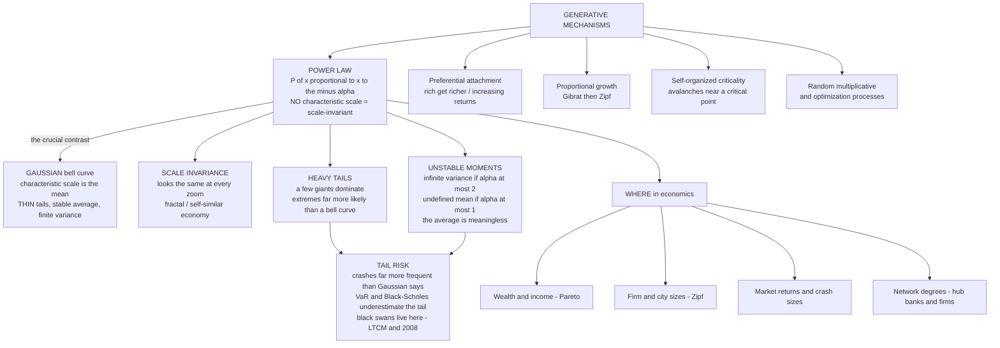

# 📉 Power Laws and Heavy Tails in Economics

> [!abstract] TL;DR
> A **power law** is a probability distribution whose frequency falls as a **power of size** — $P(x) \propto x^{-\alpha}$ — so that there is **no characteristic scale** (the distribution is **scale-invariant / scale-free**: it looks statistically the same at every magnification), a handful of enormous events **dominate** the total, and extreme events are **orders of magnitude more likely** than a bell curve would ever allow. This is the diametric opposite of the **Gaussian** (normal) distribution that anchors standard statistics, finance, and risk management: the Gaussian has a *characteristic scale* (its mean), **thin tails** (a six-sigma event essentially never happens), and a **stable, well-defined average** guaranteed by the central limit theorem. Power laws instead have **heavy ("fat") tails**, and for small exponents they can have **infinite variance** ($\alpha \le 2$) or even an **undefined mean** ($\alpha \le 1$) — so "the average" and "the standard deviation" become unstable or outright meaningless. This is Mandelbrot's distinction between **"mild"** (Gaussian) and **"wild"** (fractal, power-law) randomness. Power laws are not a curiosity in economics — they are the **rule**: **wealth and income** (Pareto's original 80–20 law), **firm and city sizes** (Zipf's law), **market returns and the size of crashes**, trading volumes, recession depths, and the **degree distributions of financial networks** all obey them. They are generated by a small family of **universal mechanisms** — **preferential attachment** ("the rich get richer"), **proportional / Gibrat growth**, **self-organized criticality**, and random multiplicative processes — and they are a **hallmark of complex systems**. Their practical stakes are enormous: because economic and financial quantities are power-law distributed, standard risk machinery built on the Gaussian (Value-at-Risk, mean-variance portfolio theory, Black-Scholes, the Gaussian copula) **systematically underestimates tail risk**, a proximate cause of blow-ups from LTCM to 2008, where Taleb's **black swans** live in the fat tails. This note opens the vault's *Power Laws, Scaling & Distributions* section; the economics-specific treatment complements the general power-law and scale-free-network material developed under [[Small_World_and_Scale_Free_Networks]] and [[Fractals_and_Self_Similarity]].

---

## Intuition

**Analogy — imagine human HEIGHTS suddenly followed the same distribution as human WEALTH.** Height is the poster child for the **bell curve**. Almost everyone is between about five and six and a half feet tall; the tallest adult in recorded history (Robert Wadlow, 8 ft 11 in) was only about 1.5 times the average, and *nobody* is 20 feet tall or 6 inches tall. Height clusters tidily around a meaningful average, and the extremes are gently, symmetrically rare. If a Martian knew only the average human height, it could predict essentially everyone's height to within a foot. This is **"mild" randomness** — the world of the Gaussian.

Now suppose heights obeyed the distribution of **wealth** instead. In that world most people would be a few *inches* tall, the "average" person would be dwarfed by a small elite towering hundreds of feet high, a handful of individuals would stand **miles** into the sky, and **one person would be as tall as the distance to the Moon.** In such a world the "average height" is a useless number: it tells you nothing about the typical person (who is far below it) and nothing about the giants (who are far above it), and a single new giant can swing the average by any amount. There is **no typical size** at all. This is **"wild" randomness** — the world of the **power law**.

Height does not work this way — but **wealth, firm sizes, city sizes, market crashes, and financial returns do.** A few giants dwarf everyone else, the notion of an "average" is treacherous, and the record-holder is not 1.5x the second-place but often 100x or 1000x. These **heavy-tailed** distributions are pervasive in economics, they **shatter the bell-curve intuitions** that underpin standard theory and risk management, and their presence is a **signature of complex systems**. The rest of this note is about *why* they arise, *where* they show up, and *why ignoring them is catastrophically expensive.*

---

## How It Works

### What a power law actually is

A quantity $x$ follows a **power law** if the probability density (or the frequency, or the survival probability) decays as a *power* of $x$:

$$P(x) \propto x^{-\alpha}, \qquad \alpha > 0 .$$

The defining property is best seen on **log-log axes**: taking logarithms of $P(x) \propto x^{-\alpha}$ gives $\log P = c - \alpha \log x$, a **straight line of slope $-\alpha$**. A power law is the *only* distribution that plots as a straight line on log-log axes — that straight line is the visual fingerprint, and the slope *is* the exponent. The **complementary cumulative distribution** (the survival function, $P(X > x) \propto x^{-(\alpha-1)}$) is the version you should actually fit, because it is far less noisy in the tail than a raw histogram.

**Scale invariance — the deep meaning.** The signature property of a power law is **no characteristic scale**. Rescale $x \to bx$ and the *shape* is unchanged: $P(bx) \propto (bx)^{-\alpha} = b^{-\alpha}P(x)$ — you get the same function times a constant. There is no "typical" value around which the distribution clusters; it looks the **same at every zoom level**. This is exactly the **self-similarity** of a **fractal** ([[Fractals_and_Self_Similarity]]), which is why Mandelbrot called markets **fractal**: the statistical texture of minute-by-minute price moves resembles that of month-by-month moves. Contrast the Gaussian, which is *defined by* a characteristic scale — its standard deviation $\sigma$ sets the width, and values more than a few $\sigma$ from the mean are essentially forbidden.

### Power laws versus the Gaussian — the crucial contrast

This single contrast is the intellectual pivot of the whole section.

| Property | **Gaussian** (bell curve) | **Power law** (heavy / fat tail) |
|---|---|---|
| Characteristic scale | Yes — the mean / $\sigma$ | **None** — scale-free |
| Tail | **Thin** — decays like $e^{-x^2}$ | **Heavy** — decays like $x^{-\alpha}$ |
| A "6-sigma" event | Essentially never ($\sim 10^{-9}$) | Routine — happens on a schedule |
| Mean | Always well-defined and stable | **Undefined if $\alpha \le 1$** |
| Variance | Always finite | **Infinite if $\alpha \le 2$** |
| Central limit behaviour | Sums converge to a Gaussian | Sums converge to a **Lévy stable** law |
| Dominant contribution | Many typical events | **A few giant events** |

The Gaussian is the mathematical embodiment of **"the average is destiny"**: by the central limit theorem, the sum of many small independent shocks is Gaussian, its mean and variance are stable, and extremes are negligible. It is the foundation of standard statistics, mean-variance finance, and quantitative risk. A power law with small $\alpha$ *breaks every one of these guarantees*. When $\alpha \le 2$ the **variance is infinite** — the sample standard deviation never settles down, it just keeps growing as you collect more data, so "volatility" is not a stable number. When $\alpha \le 1$ the **mean itself is infinite/undefined** — the sample average is dominated by whatever the largest observation happened to be, so it *never* converges. In such a world, the two summary statistics on which all of standard risk management rests — the mean and the standard deviation — are **mirages**. Mandelbrot summarised the whole matter as the difference between **"mild" randomness** (Gaussian, the coin-flip world where the law of large numbers tames the extremes) and **"wild" randomness** (fractal/power-law, where a single observation can dwarf the sum of all the others). Bell-curve intuition does not merely mislead here — it **catastrophically fails**.

### Where power laws appear in economics — the empirical catalogue

Power laws are the rule, not the exception, in economic data:

- **Wealth and income.** Vilfredo **Pareto** (1896) found that the top tail of the income distribution follows $P(\text{income} > x) \propto x^{-\alpha}$ with $\alpha \approx 1.5$ — the original **"80–20 law."** The upper tail of wealth is even heavier ($\alpha \approx 1$–$1.5$). This underwrites the study of **inequality dynamics** (planned sibling `Wealth_and_Income_Inequality_Dynamics`).
- **Firm sizes.** The distribution of firm sizes (by employees, sales, or assets) is a power law close to **Zipf** — a few giant corporations coexist with a fat tail of tiny firms (planned sibling `Firm_Size_and_City_Size_Distributions`).
- **City sizes.** The most famous case: **Zipf's law** — the $n$-th largest city is roughly $1/n$ the size of the largest (exponent $\approx 1$). Remarkably stable across countries and centuries.
- **Market returns and price changes.** Daily and intraday returns are **not** Gaussian; their tails follow an "**inverse cubic law**" $P(|r| > x) \propto x^{-3}$ (Gabaix, Stanley et al.). This is the home of **crashes** (planned sibling `Fat_Tails_and_Financial_Market_Statistics`).
- **The size of crashes and large market moves**, **trading volumes** ($\alpha \approx 1.5$), the **incomes of the super-rich**, the **depths of recessions and bankruptcy sizes**, and the **degree distributions of financial and trade networks** (a few hub banks/firms — [[Economic_Networks_and_Interaction_Structure]]).

Power laws recur so often across independent economic domains that finding one is now less a discovery than an *expectation* — and that ubiquity is precisely what marks economics as a **complex system**.

### Zipf's law — the striking special case

A conspicuous number of these are not just power laws but specifically follow **Zipf's law**: a power law with exponent $\alpha \approx 1$, equivalently the **rank-size rule** — plot size against rank on log-log axes and you get a straight line of slope $-1$, so the second-largest is about half the largest, the third about a third, and so on. City sizes, firm sizes, and word frequencies all obey it, with startling universality and stability across time and geography. The puzzle — *why exponent one, so precisely, so universally?* — is a deep one, and its resolution (Gabaix's derivation from **Gibrat's law of proportional growth** plus a lower reflecting barrier) is one of the triumphs of the field. Zipf's law is a **signature regularity** of complex socio-economic systems.

### The generative mechanisms — why power laws arise

Power laws are not accidents; a small family of **universal mechanisms** produces them, which is why they appear in so many unrelated places:

1. **Preferential attachment / "rich get richer" / cumulative advantage.** The more you already have — wealth, links, market share, citations, customers — the more you *gain*. Formalised by **Yule** (1925), **Simon** (1955), and **Barabási-Albert** (1999), this **positive feedback / increasing returns** ([[Increasing_Returns_and_Path_Dependence]]) generates a power law with an exponent set by the attachment rule. It is the network face of the same feedback that produces hubs in [[Small_World_and_Scale_Free_Networks]].
2. **Proportional / multiplicative growth (Gibrat's law).** If entities grow by a random *percentage* each period (growth independent of size), the distribution becomes **lognormal** — already heavy-tailed. Add a **lower reflecting barrier** (a minimum size, or entry of new small units) and the stationary distribution becomes a **power law**; Gabaix (1999) showed this yields **Zipf's law** for cities.
3. **Self-organized criticality (SOC).** Systems that self-tune to a **critical state** emit avalanches whose sizes are **power-law distributed** — Per **Bak's** sandpile. Economic analogues (planned sibling `Self_Organized_Criticality_in_Economics`) treat crashes, cascades, and bankruptcy waves as avalanches near [[Criticality_and_Phase_Transitions|criticality]].
4. **Optimization, combination, and random multiplicative processes.** Constrained optimization (Mandelbrot's derivation of Zipf for word frequencies), mixtures of exponentials, and multiplicative random processes all generate heavy tails as well.

The lesson: **heavy tails have common roots.** Positive feedback and multiplicative dynamics — both endemic to economies — *manufacture* power laws.

### Why it matters — tail risk

Because economic and financial quantities are power-law distributed, **extreme events are far more frequent and far more severe than any Gaussian model assumes.** A market that a Gaussian model says should crash by 20 percent once in a *billion* years does so about once a decade. Standard risk machinery — **Value-at-Risk** ([[Value_at_Risk]]), mean-variance **portfolio theory**, **Black-Scholes**, the notorious **Gaussian copula** — is built on thin-tailed assumptions and therefore **systematically underprices the tail**. This is not an academic quibble: it is a proximate cause of real financial blow-ups (LTCM in 1998, the 2008 crisis and "the formula that killed Wall Street"). Taleb's **black swans** *live in the fat tails*, and the catastrophic cost of pretending they are Gaussian is the practical reason power laws belong at the foundation of economics.



---

## Key Concepts

### Secondary (intuitive)

- **A power law means "a few giants dominate everything."** The biggest city, firm, or fortune is not a bit bigger than the rest — it is *enormously* bigger, and a small handful account for most of the total.
- **There is no "typical" size.** Unlike height, where almost everyone is near the average, wealth and firm size have no meaningful average — the "average" is dragged around by the giants and describes almost nobody.
- **Extremes are common, not rare.** A bell curve says a huge crash "can't happen." A power law says huge crashes happen on a schedule — they are built into the distribution.
- **The 80–20 rule.** Pareto's observation that a small fraction (the top 20 percent) holds most of the total (80 percent) is the everyday face of a power law.
- **"Success breeds success."** The reason a few get so big is usually **the rich get richer** — advantage compounds, so early leaders run away with the market.

### Undergraduate (formal)

- **Power law vs Gaussian, precisely.** $P(x) \propto x^{-\alpha}$ (polynomial, heavy tail, straight line on log-log) versus $P(x) \propto e^{-(x-\mu)^2/2\sigma^2}$ (exponential-squared, thin tail, single scale $\sigma$). Fit the **survival function** $P(X>x) \propto x^{-(\alpha-1)}$, not the histogram, to read the tail cleanly.
- **Moments and their divergence.** The $k$-th moment $\int x^k \, x^{-\alpha}\,dx$ **diverges** when $k \ge \alpha - 1$. So variance ($k=2$) is infinite for $\alpha \le 3$ (density exponent), and the mean ($k=1$) is undefined for $\alpha \le 2$. (Using the survival-function exponent $\hat\alpha = \alpha - 1$: infinite variance for $\hat\alpha \le 2$, undefined mean for $\hat\alpha \le 1$.) The upshot is the same: **for heavy enough tails, the mean and variance are not stable numbers.**
- **Zipf's law and the rank-size rule.** Rank the observations from largest ($r=1$) down; $\text{size}(r) \propto r^{-1}$ is Zipf. On log-log rank-size axes it is a line of slope $-1$; equivalently a power-law survival function with exponent $\approx 1$.
- **Pareto distribution.** $P(X>x) = (x_m/x)^{\alpha}$ for $x \ge x_m$ — the canonical power law of the upper tail of income and wealth; $\alpha$ is the **Pareto (tail) index** (see [[Common_Probability_Distributions]]).
- **The four mechanisms.** Preferential attachment (Yule-Simon-BA), Gibrat proportional growth (+ barrier → Zipf), self-organized criticality (Bak), and random multiplicative processes — all produce power laws, which is why they are ubiquitous.
- **Generalized central limit theorem.** Sums of infinite-variance ($\alpha < 2$) i.i.d. variables do **not** converge to a Gaussian; they converge to a **Lévy $\alpha$-stable** distribution — the reason Mandelbrot proposed stable laws for cotton prices.

### Graduate (advanced)

- **Lévy stable laws and self-similarity of returns.** For $\alpha_{\text{stable}} < 2$, stable distributions have infinite variance and power-law tails $\sim |x|^{-(\alpha_{\text{stable}}+1)}$; they are the *only* possible limits of normalized sums and are **self-affine** under time aggregation ($X_{t} \stackrel{d}{=} t^{1/\alpha} X_1$), formalising the fractal scaling of prices. Empirically the *return* tail index ($\approx 3$) lies **outside** the stable range ($<2$), giving the **"inverse cubic law"** and finite variance but infinite fourth moment — hence extreme kurtosis and volatility clustering ([[GARCH_Models]]).
- **Gabaix's derivation of Zipf.** A population of cities/firms growing by i.i.d. multiplicative shocks (Gibrat) with a small reflecting lower barrier has a **stationary size distribution** that is Pareto with exponent $\to 1$; Zipf's law is a **robust attractor** of proportional growth, not a coincidence. Deviations (e.g. size-dependent growth or friction) predict deviations from exponent 1.
- **Kesten processes and the wealth tail.** Random recurrence $x_{t+1} = a_t x_t + b_t$ with random multiplicative coefficient $a_t$ (returns) and additive $b_t$ (labour income) has a **Pareto stationary tail** with index $\alpha$ solving $\mathbb{E}[a^{\alpha}] = 1$ (Kesten 1973). This is the modern engine of wealth-inequality models (Benhabib-Bisin-Zhu, Gabaix-Lasry-Lions-Moll) — the tail is set by the *stochastic return on capital*, not by labour income.
- **Self-organized criticality and economic avalanches.** Bak-Tang-Wiesenfeld: dissipative systems with a slow drive and threshold dynamics self-tune to a critical point emitting scale-free avalanches. Bak-Chen-Scheinkman-Woodford applied SOC to aggregate fluctuations; the debate over whether markets are *genuinely* critical (endogenous, à la Sornette's **log-periodic power-law** crash signatures) versus merely heavy-tailed is live (`Self_Organized_Criticality_in_Economics`, `Econophysics_and_Statistical_Mechanics_of_Markets`).
- **Rigorous estimation — Clauset-Shalizi-Newman.** Straight-ish log-log plots are *not* evidence of a power law. The CSN protocol: (i) estimate $x_{\min}$ by minimizing the KS distance between data and fitted tail; (ii) MLE the exponent on $x \ge x_{\min}$ via the **Hill estimator** $\hat\alpha = 1 + n\big[\sum_i \ln(x_i/x_{\min})\big]^{-1}$; (iii) test goodness-of-fit with a **bootstrapped KS $p$-value**; (iv) compare against **lognormal, stretched-exponential, and truncated** alternatives via **likelihood ratios**. Most "power laws" in the literature fail this at the "clearly power-law vs lognormal" step.
- **Why the exact form is often undecidable — and why it may not matter.** Over a finite range, lognormal with large $\sigma$, truncated power laws, and stretched exponentials are **statistically indistinguishable** from a power law. But the *economically decisive* qualitative facts — **heavy tails, dominance of extremes, unstable variance, tail-risk underestimation** — are robust to which heavy-tailed family is correct. Intellectual honesty about the exact exponent must not become an excuse to retreat to the Gaussian.

---

## Python Demo

We stage the whole argument in three acts using only `numpy` and `matplotlib`. **(a)** We sample a **Pareto power law** alongside a **Gaussian** and show the dramatic difference: on **log-log** axes the power-law tail is a **straight line** (scale-free) while the Gaussian tail falls off a cliff, and the running sample mean of a heavy-tailed sample **refuses to converge** (its "average" is meaningless). **(b)** We run a **generative mechanism** — **preferential attachment** ("the rich get richer": each new unit of wealth is awarded to an agent with probability proportional to the wealth it already holds) — and show the emergent **heavy-tailed** wealth distribution, then **fit the exponent** with the Clauset-Hill MLE. **(c)** We quantify the **tail-risk** implication: the probability of an extreme "crash" under a power-law tail versus a Gaussian, which differ by **many orders of magnitude**.

```python
# Power laws & heavy tails vs the bell curve, in three acts:
#   (a) Pareto power law vs Gaussian  -> scale-free straight line + unstable mean
#   (b) preferential attachment ("rich get richer") -> emergent power law, fit alpha
#   (c) tail-risk contrast: P(extreme crash) power law vs Gaussian, orders of magnitude
# numpy + matplotlib only.
import numpy as np
import matplotlib.pyplot as plt
from math import erfc, sqrt

rng = np.random.default_rng(7)

# ----------------------------------------------------------------------
# (a) POWER LAW vs GAUSSIAN
# ----------------------------------------------------------------------
N = 200_000
alpha = 2.5                       # Pareto tail (survival) index
xmin = 1.0
# inverse-transform sample: P(X > x) = (xmin/x)^alpha  ->  x = xmin * U^(-1/alpha)
pareto = xmin * rng.random(N) ** (-1.0 / alpha)
gauss  = rng.normal(loc=5.0, scale=1.0, size=N)   # a tidy bell curve for contrast

def ccdf(data):
    """Empirical survival function P(X >= x); the clean way to see a tail."""
    xs = np.sort(data)
    ys = 1.0 - np.arange(xs.size) / xs.size
    return xs, ys

# running sample mean: does 'the average' settle down?
def running_mean(data):
    return np.cumsum(data) / np.arange(1, data.size + 1)

# an alpha<=1 sample whose mean is mathematically UNDEFINED (never converges)
wild = xmin * rng.random(N) ** (-1.0 / 0.8)        # alpha = 0.8  -> infinite mean

# ----------------------------------------------------------------------
# (b) GENERATIVE MECHANISM: preferential attachment ("rich get richer")
#     Each new unit of wealth goes to an agent with prob proportional to its
#     current wealth. Implemented in O(units) with a token pool: a random token
#     points to its owner, so owners are drawn in proportion to their holdings.
# ----------------------------------------------------------------------
n_agents = 3_000
n_units  = 400_000
tokens = np.empty(n_agents + n_units, dtype=np.int64)
tokens[:n_agents] = np.arange(n_agents)            # everyone starts with 1 unit
wealth = np.ones(n_agents, dtype=np.int64)
count = n_agents
for _ in range(n_units):
    owner = tokens[rng.integers(count)]            # pick a random unit -> its owner
    tokens[count] = owner                          # award a new unit to that owner
    count += 1
    wealth[owner] += 1

# fit the tail exponent with the Clauset-Hill MLE on the top of the distribution
w = wealth.astype(float)
xmin_fit = np.quantile(w, 0.60)                    # fit only the tail x >= xmin_fit
tail = w[w >= xmin_fit]
alpha_hat = 1.0 + tail.size / np.sum(np.log(tail / xmin_fit))   # survival index + 1
top1 = np.sort(w)[-int(0.01 * n_agents):].sum() / w.sum()       # share held by top 1%

# ----------------------------------------------------------------------
# (c) TAIL RISK: probability of an extreme move, power law vs Gaussian
# ----------------------------------------------------------------------
def gauss_sf(z):
    """Gaussian survival P(Z > z) via the complementary error function."""
    return 0.5 * erfc(z / sqrt(2.0))
# Calibrate both tails to AGREE at a moderate 3-sigma move, then compare deeper.
z_match = 3.0
pl_index = 3.0                                      # empirical 'inverse cubic' return tail
C = gauss_sf(z_match) * z_match ** pl_index          # power-law const matched at z=3
def power_sf(z):
    return C * z ** (-pl_index)
zs = np.array([3, 4, 5, 6, 8, 10, 15, 20], dtype=float)
g_sf = np.array([gauss_sf(z) for z in zs])
p_sf = power_sf(zs)

print("=== (a) heavy tail breaks 'the average' ===")
print(f"Pareto alpha=2.5  : max sample = {pareto.max():,.0f}  (Gaussian max = {gauss.max():.1f})")
print(f"Pareto alpha=0.8  : running mean is diverging -> last value = {running_mean(wild)[-1]:,.0f}")
print(f"                    (double N and it jumps again; the mean does NOT exist)")
print("\n=== (b) preferential attachment -> emergent power law ===")
print(f"Fitted tail exponent  alpha_hat = {alpha_hat:.2f}  (rich-get-richer gives ~2)")
print(f"Richest agent holds {w.max()/w.sum()*100:.1f}% of all wealth; "
      f"top 1% of agents hold {top1*100:.1f}%")
print("\n=== (c) tail risk: how many times MORE likely under a power law ===")
for z, gs, ps in zip(zs, g_sf, p_sf):
    print(f"  {z:>4.0f}-sigma move : Gaussian {gs:.2e}   power law {ps:.2e}   "
          f"ratio ~ {ps/gs:,.0f}x")

# ----------------------------------------------------------------------
# Plots
# ----------------------------------------------------------------------
fig, ax = plt.subplots(2, 2, figsize=(14, 10))

# (a1) histograms: the Pareto tail runs off the page the Gaussian never reaches
ax[0, 0].hist(gauss, bins=80, density=True, alpha=0.7, color="#2471a3",
              label="Gaussian (thin tail)")
ax[0, 0].hist(np.clip(pareto, 0, 25), bins=80, density=True, alpha=0.6,
              color="#c0392b", label="Pareto power law (clipped at 25)")
ax[0, 0].set_title("(a) Same scale, different worlds:\nGaussian clusters, power law spills a heavy tail")
ax[0, 0].set_xlabel("value"); ax[0, 0].set_ylabel("density")
ax[0, 0].legend(fontsize=9); ax[0, 0].grid(alpha=0.3)

# (a2) log-log survival: power law is a STRAIGHT LINE, Gaussian falls off a cliff
xg, yg = ccdf(gauss - gauss.min() + 1e-6)          # shift positive for log axes
xp, yp = ccdf(pareto)
ax[0, 1].loglog(xp, yp, color="#c0392b", lw=2, label=f"power law (slope ~ -{alpha:.1f})")
ax[0, 1].loglog(xg, yg, color="#2471a3", lw=2, label="Gaussian (thin tail)")
ax[0, 1].set_title("(a) LOG-LOG survival P(X > x):\nstraight line = scale-free power law")
ax[0, 1].set_xlabel("x"); ax[0, 1].set_ylabel("P(X > x)")
ax[0, 1].legend(fontsize=9); ax[0, 1].grid(True, which="both", alpha=0.3)

# (b) preferential-attachment wealth: emergent power law + fitted slope
xw, yw = ccdf(w)
ax[1, 0].loglog(xw, yw, "o", ms=3, color="#7d3c98", alpha=0.5, label="simulated wealth")
xx = np.linspace(xmin_fit, w.max(), 100)
yy = (tail.size / w.size) * (xx / xmin_fit) ** (-(alpha_hat - 1.0))
ax[1, 0].loglog(xx, yy, "--", color="k", lw=2,
                label=f"fitted power law  alpha = {alpha_hat:.2f}")
ax[1, 0].axvline(xmin_fit, color="gray", ls=":", lw=1, label="x_min (tail cutoff)")
ax[1, 0].set_title("(b) 'Rich get richer' MANUFACTURES a power law\n(preferential attachment)")
ax[1, 0].set_xlabel("wealth"); ax[1, 0].set_ylabel("P(wealth > x)")
ax[1, 0].legend(fontsize=8); ax[1, 0].grid(True, which="both", alpha=0.3)

# (c) tail-risk contrast on a log-y scale: the fat tail dwarfs the Gaussian
ax[1, 1].semilogy(zs, g_sf, "-o", color="#2471a3", lw=2, label="Gaussian tail")
ax[1, 1].semilogy(zs, p_sf, "-o", color="#c0392b", lw=2, label="power-law tail (inverse cubic)")
ax[1, 1].set_title("(c) TAIL RISK: probability of an extreme move\n"
                   "matched at 3-sigma, then worlds apart")
ax[1, 1].set_xlabel("size of move (in sigma)"); ax[1, 1].set_ylabel("P(move > x)  [log]")
ax[1, 1].annotate(f"at 10-sigma:\n{p_sf[5]/g_sf[5]:,.0f}x more likely",
                  xy=(10, p_sf[5]), xytext=(11, p_sf[5] * 40),
                  fontsize=9, arrowprops=dict(arrowstyle="->"))
ax[1, 1].legend(fontsize=9); ax[1, 1].grid(True, which="both", alpha=0.3)

fig.suptitle("Power laws & heavy tails vs the bell curve: scale-free tails, "
             "a generative mechanism, and tail risk", fontsize=13)
fig.tight_layout(rect=[0, 0, 1, 0.95])
plt.savefig("power_laws_and_heavy_tails.png", dpi=120)
print("\nSaved figure -> power_laws_and_heavy_tails.png")
plt.show()
```

**What the output shows.** *Panel (a), histograms:* both samples live on the same axis, but the Gaussian is a tidy hump between about 2 and 8 while the Pareto piles up near its minimum and then throws a **heavy tail** far to the right (clipped at 25 only so the plot is legible — the true maximum is in the *thousands*). *Panel (a), log-log survival:* the decisive picture — the power law is a **ruler-straight line** (scale-free, slope $\approx -\alpha$), while the Gaussian's survival curve **plunges vertically** once you pass a few $\sigma$: its tail is not just smaller, it is a *different kind* of object. The printed running means make the moment story concrete: the $\alpha=0.8$ sample's "average" **keeps climbing as you add data and never settles** — its mean is mathematically infinite, so the sample average is a number about nothing. *Panel (b):* pure "rich get richer" dynamics, with no designed-in inequality, **spontaneously manufacture** a heavy-tailed wealth distribution whose fitted exponent lands near the preferential-attachment value ($\alpha \approx 2$), with the single richest agent and the top 1 percent holding wildly disproportionate shares — a **generative** origin of Pareto inequality. *Panel (c):* the punchline for risk. Calibrate a Gaussian and a power-law return model to **agree exactly at a 3-sigma move**, and by 10-sigma the power law rates the event **hundreds of thousands to millions of times more likely** than the Gaussian does. A "once per the-age-of-the-universe" crash under the bell curve becomes a "once per decade" crash under the power law. That gap is not a rounding error — it is the space in which financial systems blow up.

---

## Real-World Applications

> **Example — the Gaussian copula that broke Wall Street.** In the 2000s, the entire market for collateralized debt obligations (CDOs) was priced with David Li's **Gaussian copula**, which modelled the joint default of thousands of mortgages using a single correlation number and — fatally — **Gaussian (thin) tails** for the dependence structure. The model implied that the simultaneous default of many mortgages was a fantastically rare, essentially impossible event; rating agencies stamped the senior tranches AAA on that basis. But mortgage defaults are **heavy-tailed and strongly tail-dependent** — in a downturn they cluster and cascade rather than cancel out. When U.S. house prices fell nationwide in 2007-08, the "impossible" joint-default event arrived, the AAA tranches imploded, and the Gaussian assumption at the heart of the machinery turned a housing slump into a global financial crisis. The episode is the textbook case of the general lesson: **modelling a power-law world with a Gaussian model does not merely mis-measure risk — it hides exactly the risk that matters** (see [[Value_at_Risk]], [[Expected_Shortfall]], [[Market_Anomalies_and_Bubbles]]).

- **Financial risk management.** Because returns follow an inverse-cubic power law, **Value-at-Risk** and mean-variance optimization built on the normal distribution understate tail losses; the fix is **extreme-value theory** (fitting the tail directly), **Expected Shortfall** (which at least averages over the tail), fat-tailed simulation, and stress tests calibrated to power-law, not Gaussian, extremes. Post-2008 regulation (Basel) explicitly moved from VaR toward tail-aware measures.
- **Inequality analysis.** The Pareto/Kesten tail of wealth is the quantitative core of modern inequality economics; the tail exponent is a policy-sensitive object (it *falls* — inequality worsens — when the stochastic return on capital rises relative to growth), linking directly to the planned sibling `Wealth_and_Income_Inequality_Dynamics`.
- **Urban and firm-size economics.** Zipf's law for cities and firms disciplines models of agglomeration, growth, and industrial organization; a good model of the economy must *reproduce* the observed power-law size distribution, which rules out many otherwise-plausible mechanisms (planned sibling `Firm_Size_and_City_Size_Distributions`).
- **Systemic risk and networks.** The heavy-tailed **degree distribution** of interbank and production networks — a few hub banks and keystone suppliers — means shocks to hubs drive aggregate volatility and cascades ([[Economic_Networks_and_Interaction_Structure]], [[Cascades_and_Systemic_Risk]]); power-law connectivity is what makes these networks "robust yet fragile."
- **Econophysics.** The statistical-mechanics tradition (Mantegna-Stanley, Bouchaud, Sornette) treats markets as many-body systems whose emergent power laws — return tails, volume, volatility clustering, crash sizes — are the empirical bedrock (planned sibling `Econophysics_and_Statistical_Mechanics_of_Markets`).

---

## Common Pitfalls

- **Assuming Gaussian tails "to be safe."** The normal distribution is a *convenient*, not a *conservative*, assumption. In a heavy-tailed world it is the least safe choice available, because it makes the ruinous events look impossible. "We used the standard model" is exactly how the biggest blow-ups happen.
- **Trusting the mean and standard deviation.** With a heavy enough tail ($\alpha \le 2$ variance, $\alpha \le 1$ mean), these statistics **do not converge** — the sample mean lurches with every new record observation. Reporting a "volatility" or an "expected return" for such data is reporting a number that describes nothing stable.
- **Declaring a power law from a straight-ish log-log plot.** Almost anything looks linear on log-log over a decade or two. **Lognormal, stretched-exponential, and truncated** distributions masquerade as power laws. Use the **Clauset-Shalizi-Newman** protocol — MLE the tail, bootstrap the goodness-of-fit, and *compare against alternatives* — before claiming an exponent.
- **Fitting the whole distribution instead of the tail.** A power law is usually a claim about the **tail only** ($x \ge x_{\min}$). Regressing a straight line through a log-log *histogram* of all the data (including the noisy tail bins) gives biased, often nonsensical exponents; fit the **survival function** by maximum likelihood on the tail.
- **Confusing "heavy-tailed" with "exactly power-law."** The economically decisive facts (fat tails, dominance of extremes, unstable variance) hold for *many* heavy-tailed families. Do not let an inability to prove the *precise* form become a license to fall back on the Gaussian — that throws the baby out with the bathwater.
- **Ignoring dependence and clustering.** Real returns are not i.i.d. draws from a fat-tailed law; extremes **cluster** (volatility clustering, [[GARCH_Models]]) and are **tail-dependent** across assets. A model with the right marginal tail but Gaussian dependence (the copula mistake) still catastrophically underprices joint crashes.
- **Believing a big enough dataset will "average out" the tail.** Under thin tails the law of large numbers tames extremes; under heavy tails ($\alpha < 2$) it does not — a single new observation can dominate the entire sample, so more data does **not** stabilize the estimate the way Gaussian intuition promises.
- **Treating the exponent as a constant of nature.** Tail indices *move* with policy and regime (tax rates, capital returns, leverage, regulation). Zipf's exponent-one is robust for cities, but wealth and return tail indices drift, and that drift is itself the interesting economics.

---

## Related Concepts

- [[Complexity_Economics_Overview]] — the paradigm this section instantiates; pervasive power laws are a central empirical pillar of complexity economics, alongside heterogeneity, networks, and out-of-equilibrium dynamics.
- [[Economies_as_Complex_Adaptive_Systems]] — heavy-tailed distributions are a *hallmark* of complex adaptive systems; their ubiquity in economic data is direct evidence the economy is one.
- [[Increasing_Returns_and_Path_Dependence]] — "the rich get richer" (preferential attachment) is increasing returns / positive feedback operating on wealth, size, or links, and is the leading generator of economic power laws.
- [[Economic_Networks_and_Interaction_Structure]] — economic networks have heavy-tailed (scale-free) degree distributions with hub firms and banks; power laws are what make them robust yet fragile.
- [[Small_World_and_Scale_Free_Networks]] — the general (network-science) treatment of scale-free degree distributions and preferential attachment that this note applies to economics.
- [[Fractals_and_Self_Similarity]] — scale invariance is self-similarity; Mandelbrot's fractal view of markets is the geometric face of power-law returns.
- [[Criticality_and_Phase_Transitions]] — self-organized criticality tunes systems to a critical point that emits power-law avalanches, one of the mechanisms behind economic power laws and crashes.
- [[Cascades_and_Systemic_Risk]] — cascade and avalanche sizes on economic networks are power-law distributed; the tail of the crash-size distribution is the systemic-risk object.
- [[Common_Probability_Distributions]] — situates the Pareto and power-law distributions among the standard families and against the Gaussian benchmark.
- [[Random_Variables]] — the moments (mean, variance) whose *divergence* under heavy tails is the crux of why power laws break standard statistics.
- [[Value_at_Risk]] — the flagship risk measure that, built on Gaussian assumptions, systematically underestimates power-law tail losses.
- [[Expected_Shortfall]] — the tail-averaging alternative to VaR, motivated precisely by the need to account for heavy tails.
- [[Market_Anomalies_and_Bubbles]] — bubbles and crashes are the extreme events living in the fat tails; their sizes are power-law distributed.
- [[GARCH_Models]] — volatility clustering generates heavy-tailed *unconditional* return distributions; the econometric complement to the power-law tail.
- [[Phase_Transitions_and_Critical_Phenomena]] — at a critical point, physical systems exhibit power-law (scale-free) fluctuations; the physics prototype of self-organized criticality in economics.
- [[Classical_Statistical_Mechanics]] — the many-body statistical-mechanics toolkit that econophysics imports to derive emergent economic power laws.
- [[Global_Financial_Crises]] — the 2008 crisis whose Gaussian-copula mispricing of tail-dependent, heavy-tailed defaults is the cautionary tale of ignoring power laws.
- [[Economic_and_Social_Complexity]] — the applied systems-thinking framing in which scale-free economic distributions are a recurring signature.
- [[Network_Dynamics_and_Contagion]] — the spreading processes on heavy-tailed networks whose event sizes inherit power-law tails.
- [[Network_Science_Fundamentals]] — the underlying vocabulary of degree distributions and heavy tails that the economic applications build on.

> Siblings planned for this *Power Laws, Scaling & Distributions* section — referenced above in prose, not yet written — `Firm_Size_and_City_Size_Distributions` (Zipf's law for firms and cities), `Wealth_and_Income_Inequality_Dynamics` (the Pareto/Kesten tail of wealth and its policy sensitivity), `Fat_Tails_and_Financial_Market_Statistics` (the inverse-cubic return law, volatility clustering, and crash statistics), `Self_Organized_Criticality_in_Economics` (crashes and cascades as critical avalanches), and `Econophysics_and_Statistical_Mechanics_of_Markets` (the statistical-mechanics approach to emergent economic power laws) — will each link back to this section-opener.

---

## Review Questions

**Tier 1 — Conceptual**
1. Using the "if heights followed wealth" analogy, explain the three ways a power law differs from a bell curve: (i) *no characteristic scale*, (ii) *heavy tails*, and (iii) an *unstable or meaningless average*. Why is "the average human is X feet tall" a useful statement while "the average person's wealth is $Y" can be deeply misleading?
2. What does it mean, visually and mathematically, that a power law is a **straight line on log-log axes** but the Gaussian is not? What does the slope of that line tell you, and why should you fit the *survival function* rather than the raw histogram?

**Tier 2 — Applied**
3. In the Python demo, "rich get richer" preferential attachment produces a power-law wealth distribution *with no inequality designed in*. Explain the mechanism, why it generates a heavy tail rather than a bell curve, and name two other economic quantities that the *same* mechanism is thought to explain. What would change the fitted exponent?
4. A risk manager calibrates a Gaussian model and a power-law model to agree exactly on the probability of a 3-sigma daily loss, then reports that "for normal-sized moves the models are identical, so the choice doesn't matter." Using the demo's panel (c), explain precisely why this reasoning is dangerous, and translate the 10-sigma probability ratio into a concrete statement about how often a given market model expects a major crash.

**Tier 3 — Analytical / Open-ended**
5. Explain what it means for a distribution to have **infinite variance** ($\alpha \le 2$) or an **undefined mean** ($\alpha \le 1$), and why this is not a mathematical technicality but a direct threat to the entire apparatus of mean-variance portfolio theory, Value-at-Risk, and Black-Scholes. What replaces "mean and standard deviation" as the right way to summarize such data?
6. Clauset, Shalizi, and Newman argue that most claimed power laws in the literature do not survive rigorous testing against lognormal and other heavy-tailed alternatives, yet the *economic* conclusions (fat tails, tail-risk underestimation) are robust regardless of the exact form. Reconcile these two statements: how can it be both true that "we often can't prove it's *exactly* a power law" and that "assuming Gaussian tails is still catastrophically wrong"?

---

## Sources

- Gabaix, X. (2009). "Power Laws in Economics and Finance." [*Annual Review of Economics, 1*, 255–294](https://doi.org/10.1146/annurev.economics.050708.142940). — the definitive survey of economic power laws and their generative mechanisms.
- Newman, M. E. J. (2005). "Power laws, Pareto distributions and Zipf's law." [*Contemporary Physics, 46*(5), 323–351](https://doi.org/10.1080/00107510500052444). — the clearest general introduction to power laws, mechanisms, and pitfalls.
- Clauset, A., Shalizi, C. R., & Newman, M. E. J. (2009). "Power-law distributions in empirical data." [*SIAM Review, 51*(4), 661–703](https://doi.org/10.1137/070710111). — the rigorous statistical protocol for fitting and testing power laws.
- Mandelbrot, B. B., & Hudson, R. L. (2004). *The (Mis)behavior of Markets: A Fractal View of Financial Turbulence.* Basic Books. — "mild" vs "wild" randomness and the fractal, heavy-tailed nature of markets.
- Sornette, D. (2003). *Why Stock Markets Crash: Critical Events in Complex Financial Systems.* Princeton University Press. — self-organized criticality, power laws, and crash prediction.
- Taleb, N. N. (2007). *The Black Swan: The Impact of the Highly Improbable.* Random House. — the practical stakes of fat tails and the failure of Gaussian risk models.
- Pareto, V. (1896). *Cours d'économie politique.* Lausanne. — the original observation of the power-law tail of income.

---

#complexity-economics #power-laws #heavy-tails #pareto #scale-invariance
