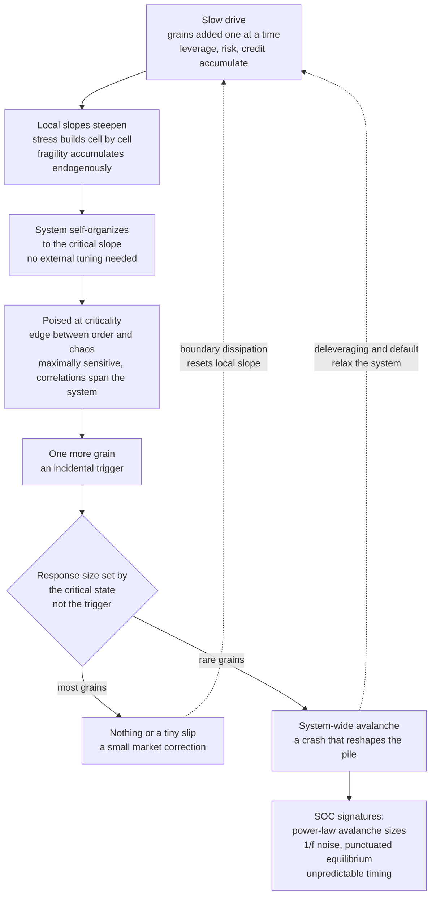

# 🏔️ Self-Organized Criticality in Economics

> [!abstract] TL;DR
> **Self-organized criticality (SOC)** — discovered by **Per Bak, Chao Tang, and Kurt Wiesenfeld (1987)** — is the phenomenon where a slowly *driven* system evolves, entirely on its own and **without any external tuning**, to a **critical state** poised on the edge between order and chaos, where disturbances trigger **scale-free "avalanches"** whose sizes follow a **power law** and whose temporal signal shows **1/f (pink) noise**. The canonical picture is the **sandpile**: drip sand grain by grain and the pile builds itself to a critical slope where a single grain may do nothing, cause a tiny slip, or — rarely — set off a catastrophic avalanche, with no *characteristic* avalanche size. The provocative economic hypothesis is that **markets and economies are self-organized critical**: they endogenously build up **fragility** — leverage, interconnection, correlated positions, stretched valuations (**Minsky's financial-instability hypothesis**, *stability breeds risk-taking breeds fragility*) — toward a crash-prone critical state where **crises of all sizes are intrinsic, power-law distributed, and fundamentally unpredictable in timing** (the triggering "grain" is incidental; the fragility is the cause). The unsettling corollary is the **paradox of stability**: suppressing small fluctuations lets stress build to larger ones, so over-stabilized systems breed bigger catastrophes. SOC is contested as the *literal* mechanism behind economic power laws, but it is an influential conceptual lens on the inevitability of tail events and the fragility of over-optimized systems.

---

## Intuition

**Analogy — the sandpile.** Slowly drip sand, one grain at a time, onto a flat table. A pile builds, its slope steepening until it reaches a **critical angle** — and then it stays there, poised on the edge of collapse. Add one more grain and you might get *nothing*, or a *tiny slide*, or — rarely — a *catastrophic avalanche* that reshapes the whole pile. Here is the haunting part: no one set the slope. The pile **tuned itself** to this critical, avalanche-prone state — no engineer adjusted a knob, no controller held it at the edge. Bak, Tang, and Wiesenfeld called this **self-organized criticality**, and its suggestion for economics is that markets and economies may likewise organize *themselves* to the brink of instability, where crashes of all sizes are not anomalies but the system's natural, unavoidable behavior.

Notice what the analogy kills. There is no *special* grain — the one that triggers the great avalanche is identical to the millions that did nothing. The avalanche is not a property of the grain; it is a property of the **pile's critical state**, a fragility built silently, grain by grain, until the whole slope sits ready to slide. Translate to finance: for years leverage and risk and interconnection quietly accumulate; the system grows fragile even as it *looks* calm and profitable, until some unremarkable trigger releases the stored energy. Hunting the "guilty grain" after a crash — the one bank, the one bad loan, the one tweet — misses the point. The crisis was **in the system**, waiting.

---

## How It Works

The mainstream instinct is to explain a big event with a big cause: a crash needs an external shock, a critical state needs a fine-tuned parameter. SOC overturns both. In an ordinary phase transition (see [[Criticality_and_Phase_Transitions]]) you must *tune* a control knob — temperature to exactly 100 degrees, connectivity to exactly `p_c` — to reach the critical point. SOC's discovery is that certain **slowly driven, dissipative** systems reach that same critical point *by themselves* and *stay there*: criticality becomes an **attractor** of the dynamics, not a razor's edge you have to balance on.

### The sandpile paradigm (Bak-Tang-Wiesenfeld)

1. **Slow drive.** Add grains one at a time to random cells of a grid. Each cell holds a local "slope" or stress.
2. **Local threshold and toppling.** When a cell's height reaches a threshold, it becomes unstable and **topples**, shedding grains to its neighbors and possibly pushing *them* over their thresholds.
3. **Avalanches / chain reactions.** One toppling can trigger a cascade of topplings — an **avalanche** — that relaxes before the next grain is added. Grains falling off the boundary are lost, which is the **dissipation** that lets the system reach a steady state.
4. **Self-organization.** Starting from empty, the pile builds until its average slope reaches a **critical value** and then fluctuates around it forever. No one set that slope; the drive-and-relax dynamics *found* it.
5. **Scale-free output.** At the critical slope, avalanches occur at **all sizes** with a **power-law size distribution** `P(s) ~ s^(-tau)` — a straight line on log-log axes. There is **no characteristic avalanche size**: most are tiny, a few are system-spanning, and everything in between occurs.

### The four hallmarks of SOC

- **Power-law event sizes** — scale-free avalanches, the statistical fingerprint linking SOC to the ubiquity of power laws and fat tails in economics (the sibling notes *Power_Laws_and_Heavy_Tails_in_Economics* and *Fat_Tails_and_Financial_Market_Statistics* develop this).
- **1/f (pink) noise in time** — the activity signal has power spectrum `~ 1/f`, meaning correlations across all time scales; the original 1987 paper was literally titled *"...An Explanation of 1/f Noise."*
- **Criticality as an emergent attractor** — the system is *poised* at the critical point with no fine-tuning; that is the "self-organized" in the name.
- **Unpredictability of large events** — you cannot predict *which* small grain triggers the big avalanche, because the cause is the system's **critical state**, not the incidental trigger.

### The critical state — edge of chaos and fragility

At criticality the correlation length is effectively infinite: a local disturbance can, in principle, propagate across the *entire* system. The pile is **maximally sensitive** — a small perturbation can trigger a response of any size — and perpetually poised on the edge of instability. Long quiet periods are punctuated by sudden avalanches (**punctuated equilibrium**), and the buildup of long-range correlations is exactly what makes system-wide cascades possible. Criticality is thus a state of *latent, ever-present catastrophe-potential*.

### The economic / financial SOC hypothesis

The provocative claim: **economies and financial markets may be self-organized critical.** They endogenously build **fragility** — leverage, interconnection, correlated positions, stretched valuations — toward a critical, crash-prone state where crises of all sizes occur, power-law distributed, with unpredictable timing. The *mechanism of self-organization* is **Minsky's financial-instability hypothesis**: in calm, profitable times, low volatility rewards more leverage and tighter coupling, so *stability itself breeds risk-taking breeds fragility* — the economy drives *itself* to the brink (hedge finance to speculative to Ponzi). Markets are the sandpile; leverage and risk are the grains; **crashes are avalanches, not anomalies**. The cascade dynamics that release the fragility are the subject of [[Cascades_Contagion_and_Financial_Crises]], and the network structure that channels them is developed in [[Financial_Networks_and_Systemic_Risk]]; the same endogenous logic driving ordinary booms and busts is the sibling *Business_Cycles_and_Endogenous_Fluctuations*.

### SOC as one candidate origin of economic power laws

SOC is theoretically appealing because it offers a *single mechanism* for the ubiquity of power laws and fat tails in economics — market-move sizes, crash sizes, firm-size and wealth distributions, avalanche-like recessions. If the economy self-organizes to criticality, power laws are *expected* output. But SOC is only **one candidate among several** power-law generators — alongside **preferential attachment**, **proportional (Gibrat) growth**, and **herding** — and distinguishing genuine SOC from these other heavy-tail generators is genuinely hard, which is why the hypothesis remains contested (see the critiques below and the sibling *Econophysics_and_Statistical_Mechanics_of_Markets*).



---

## Key Concepts

**Secondary (intuition level)**
- **The pile tunes itself.** Nobody sets the sandpile's slope; the dripping-and-sliding builds it to the critical angle automatically. That "no one's in charge" self-tuning is the whole idea of *self-organized* criticality.
- **The avalanche is in the pile, not the grain.** The grain that triggers a giant avalanche is identical to the millions that did nothing. Blaming the trigger for a crash is like blaming one grain of sand.
- **All sizes happen.** Most avalanches are tiny, some are medium, a rare few are enormous — and there is no "typical" size. Crashes come in every magnitude, so a small tremor is not proof of safety.
- **Calm is how danger is built.** Long quiet stretches are when leverage and risk pile up, steepening the slope. The quiet is not the absence of danger; it is the manufacturing of it.

**Undergraduate (mechanism level)**
- **Self-organized criticality vs. tuned criticality.** A normal phase transition needs a control parameter set *exactly* at its critical value; SOC systems reach and *hold* the critical point without tuning — criticality is a dynamical **attractor**.
- **The BTW sandpile.** Slow drive + local toppling threshold + boundary dissipation → a stationary critical state with **power-law avalanche sizes** `P(s) ~ s^(-tau)` and no characteristic scale.
- **The four SOC signatures.** Power-law event sizes, 1/f noise, an emergent critical attractor, and unpredictability of large events — together the fingerprint of a self-organized critical system.
- **Minsky as the economic drive.** *Stability breeds risk-taking breeds fragility* is the economic analogue of dripping grains: profitable calm endogenously steepens the financial slope toward a critical, crash-prone state.
- **Endogenous, not exogenous, crises.** Crashes are internally generated releases of self-built fragility, not responses to large outside shocks — the trigger merely *releases* energy already stored.
- **Punctuated equilibrium.** Long quiescent periods interrupted by sudden avalanches — a generic SOC temporal pattern that maps onto the "long expansions, sharp crises" shape of financial history.

**Graduate (nuance and reach)**
- **Conservation and dissipation.** True SOC requires a slowly driven system with a local conservation law and open (dissipative) boundaries; the separation of time scales (drive slow, relax fast) is essential. Debate over whether real markets satisfy these conditions is central to the critique.
- **Distinguishing SOC from other power-law generators.** Preferential attachment, proportional growth (Gibrat/Kesten), multiplicative noise, and herding all produce heavy tails *without* genuine self-organized criticality; identifying "true" SOC from time-series data alone is notoriously underdetermined.
- **Dragon-kings vs. pure power laws (Sornette).** The very largest events may be **dragon-kings** — endogenously amplified outliers *beyond* the power law, born of the extra coupling only a critical system supplies, and in principle carrying faint precursors (log-periodic signatures) that a pure power-law tail would not.
- **The paradox of stability / Great Moderation.** Suppressing small fluctuations lets stress accumulate to larger ones; the low-volatility "Great Moderation" preceded 2008, and Taleb's *antifragility* frames this as **fragility manufactured by suppressing volatility**. Over-stabilization is not free.
- **Robust-yet-fragile and macroprudential humility.** If crises are intrinsic to a critical state, policy should target **fragility** (leverage, coupling, correlation) rather than chase incidental triggers, and should distrust any regime that looks *too* calm.
- **Early-warning signals and their limits.** Critical slowing down (rising variance and autocorrelation near a tipping point) can hint at approaching instability, but abrupt, first-order transitions can arrive with **no warning at all** — absence of a signal is not safety.

---

## Python Demo

Two experiments, `numpy` + `matplotlib` only. **Part (a)** implements the actual **Bak-Tang-Wiesenfeld sandpile**: grains are dropped on random cells of a grid; a cell that reaches the threshold **topples**, distributing grains to its neighbors and possibly triggering a chain reaction (an **avalanche**), with grains at the boundary lost (dissipation). Driven from empty, the pile **self-organizes** to a critical mean height and then hovers there forever — criticality as an attractor, with no knob tuned. We record avalanche sizes in the stationary regime and show that they follow a **power law** (a straight line on log-log axes): many tiny, rare huge, no characteristic scale. **Part (b)** draws the **economic analogy** by *reinterpreting the same run*: grains become accumulating stress / leverage / risk and avalanches become market corrections and crises of all sizes. We plot the avalanche *time series* — long quiet stretches punctuated by sudden large events, the sandpile's punctuated equilibrium — and the **1/f-like power spectrum** of that activity signal, the SOC temporal fingerprint. The lesson is baked into the data: you cannot predict *which* grain triggers the big one.

```python
# Self-organized criticality: the BTW sandpile and power-law avalanches,
# reinterpreted as accumulating economic stress and market crises of all sizes.
import numpy as np
import matplotlib.pyplot as plt

rng = np.random.default_rng(7)

# ---------------- (a) the Bak-Tang-Wiesenfeld sandpile ----------------
L      = 50          # LxL grid of "cells"; each holds a local stress / slope
THRESH = 4           # a cell with >= 4 grains topples (2D BTW rule)
Z      = np.zeros((L, L), dtype=np.int64)

def drive_once():
    """Add one grain at a random cell, then relax all topplings.
    Returns the avalanche size = number of toppling events triggered."""
    i, j = int(rng.integers(L)), int(rng.integers(L))
    Z[i, j] += 1
    size  = 0
    stack = [(i, j)] if Z[i, j] >= THRESH else []
    while stack:
        x, y = stack.pop()
        if Z[x, y] < THRESH:
            continue
        Z[x, y] -= THRESH          # topple: shed 4 grains to the 4 neighbors
        size += 1
        for nx, ny in ((x+1, y), (x-1, y), (x, y+1), (x, y-1)):
            if 0 <= nx < L and 0 <= ny < L:   # off-boundary grains are LOST (dissipation)
                Z[nx, ny] += 1
                if Z[nx, ny] >= THRESH:
                    stack.append((nx, ny))
        if Z[x, y] >= THRESH:      # site may still be unstable (had >= 8): re-check
            stack.append((x, y))
    return size

# Phase 1 -- WARMUP: drive from empty; the pile self-organizes to criticality
WARMUP  = 12000
MEASURE = 45000
height_trace = []
for t in range(WARMUP):
    drive_once()
    if t % 100 == 0:
        height_trace.append(Z.mean())
warmup_samples = len(height_trace)

# Phase 2 -- MEASURE: keep driving at the critical state; record avalanche sizes
signal = np.zeros(MEASURE)          # full activity time series (incl. zeros)
for t in range(MEASURE):
    s = drive_once()
    signal[t] = s
    if t % 100 == 0:
        height_trace.append(Z.mean())
sizes = signal[signal > 0]          # nonzero avalanches for the size distribution

# log-binned avalanche-size distribution -> straight line on log-log = power law
smax  = sizes.max()
bins  = np.logspace(0, np.log10(smax + 1), 22)
dens, edges = np.histogram(sizes, bins=bins, density=True)
ctr   = np.sqrt(edges[:-1] * edges[1:])
ok    = dens > 0
# rough power-law exponent from a straight-line fit over the scaling region
fit   = (ctr > 2) & (ctr < smax / 3) & ok
slope, intercept = np.polyfit(np.log10(ctr[fit]), np.log10(dens[fit]), 1)

# ---------------- (b) 1/f-like temporal structure of the activity ----------------
sig = signal - signal.mean()
ps  = np.abs(np.fft.rfft(sig)) ** 2
frq = np.fft.rfftfreq(len(sig))
pos = frq > 0
# log-bin the spectrum for a readable 1/f trend
fb  = np.logspace(np.log10(frq[pos].min()), np.log10(frq[pos].max()), 30)
idx = np.digitize(frq[pos], fb)
fc  = np.array([frq[pos][idx == k].mean() for k in range(1, len(fb)) if np.any(idx == k)])
pc  = np.array([ps[pos][idx == k].mean()  for k in range(1, len(fb)) if np.any(idx == k)])

# ---------------------------------- plots ----------------------------------
fig, ax = plt.subplots(2, 2, figsize=(13, 9))

# self-organization to criticality
ggrid = np.arange(len(height_trace)) * 100
ax[0, 0].plot(ggrid, height_trace, color="saddlebrown", lw=1.4)
ax[0, 0].axvline(warmup_samples * 100, ls="--", c="gray", label="warmup ends")
ax[0, 0].set_title("(a) Pile self-organizes to a critical mean height")
ax[0, 0].set_xlabel("grains added (time)")
ax[0, 0].set_ylabel("mean height  (average stress)")
ax[0, 0].legend(fontsize=8); ax[0, 0].grid(alpha=0.3)

# power-law avalanche-size distribution
ax[0, 1].loglog(ctr[ok], dens[ok], "o", color="darkorange", label="avalanche sizes")
ax[0, 1].loglog(ctr[fit], 10**intercept * ctr[fit]**slope, "k--",
                label=f"power law  slope tau = {-slope:.2f}")
ax[0, 1].set_title("(a) Avalanche sizes follow a power law")
ax[0, 1].set_xlabel("avalanche size  s  (number of topplings)")
ax[0, 1].set_ylabel("probability density  P of s")
ax[0, 1].legend(fontsize=8); ax[0, 1].grid(alpha=0.3, which="both")

# economic reinterpretation: quiet periods punctuated by crises of all sizes
seg = signal[:4000]
ax[1, 0].plot(seg, color="steelblue", lw=0.7)
big = np.where(seg > np.quantile(sizes, 0.995))[0]
ax[1, 0].plot(big, seg[big], "rv", ms=7, label="largest events -> 'crises'")
ax[1, 0].set_title("(b) Grains = stress/leverage;  avalanches = market corrections & crises")
ax[1, 0].set_xlabel("time (grains added)")
ax[1, 0].set_ylabel("avalanche size (correction magnitude)")
ax[1, 0].legend(fontsize=8); ax[1, 0].grid(alpha=0.3)

# 1/f-like power spectrum of the activity signal
ax[1, 1].loglog(fc, pc, "o-", color="purple", ms=4, label="activity spectrum")
ref = pc[3] * (fc / fc[3]) ** (-1.0)
ax[1, 1].loglog(fc, ref, "k--", label="1/f reference (slope -1)")
ax[1, 1].set_title("(b) 1/f-like temporal structure (SOC fingerprint)")
ax[1, 1].set_xlabel("frequency  f")
ax[1, 1].set_ylabel("power")
ax[1, 1].legend(fontsize=8); ax[1, 1].grid(alpha=0.3, which="both")

plt.tight_layout(); plt.show()

# ------------------------------ console summary ------------------------------
print(f"(a) Self-organized to mean height ~ {np.mean(height_trace[-30:]):.2f} "
      f"(critical slope, reached with NO tuning).")
print(f"(a) Avalanche-size power law: P(s) ~ s^-{-slope:.2f}  "
      f"(largest avalanche = {int(smax)} topplings; no characteristic size).")
print(f"(b) Of {sizes.size} avalanches, {np.mean(sizes < 5):.0%} are tiny (<5), "
      f"but {np.mean(sizes > 100):.1%} exceed 100 topplings -> heavy-tailed 'crises'.")
print("(b) You cannot predict WHICH grain triggers the big one -- the cause is "
      "the critical state, not the trigger.")
```

Running it: panel **(a-left)** shows the pile driven from empty climbing to a **critical mean height** and then fluctuating around it forever — the system *found* criticality on its own, no knob tuned. Panel **(a-right)** is the payoff: the avalanche-size distribution is a **straight line on log-log axes**, a power law `P(s) ~ s^(-tau)` spanning orders of magnitude — many tiny avalanches, a thin tail of system-spanning ones, and *no* typical size. Panel **(b-left)** reinterprets the identical run as an economy: grains are accumulating leverage and risk, avalanches are market corrections and crises, and the time series shows the signature shape — long quiet stretches punctuated by sudden events of every magnitude, with the largest flagged as "crises." Panel **(b-right)** shows the **1/f-like power spectrum** of the activity, the SOC temporal fingerprint. The console line makes the sobering point explicit: the huge avalanche was not caused by a special grain — it was caused by the pile's critical state, which is exactly why crisis *timing* is unpredictable.

---

## Real-World Applications

> **Example — the "Great Moderation" and 2008.** From the mid-1980s to 2007, macroeconomic volatility fell so steadily that economists named the era the Great Moderation and congratulated themselves on having tamed the business cycle. Through the SOC lens, that calm was not safety being achieved — it was the **slope steepening**: suppressed volatility rewarded ever more leverage, securitization, and correlated exposure (housing, ratings, repo funding), driving the financial system toward a critical, crash-prone state exactly as Minsky predicted. The 2008 collapse was then the avalanche, and the specific trigger — subprime mortgages, or Lehman, or any of a dozen alternatives — was almost incidental. This is the **paradox of stability** made concrete: the very quiet that looked like success was manufacturing the catastrophe. Reducing small fluctuations had let stress build to a system-wide one.

- **Financial-crisis skepticism and crash prediction.** If markets are self-organized critical, then *large crises are intrinsic and their timing is fundamentally unpredictable* — you can measure fragility (leverage, coupling, correlation) but not forecast the incidental trigger. This underwrites deep skepticism toward precise crash-date forecasts and toward "the crisis was caused by X" post-mortems. See [[Global_Financial_Crises]].
- **Fat tails and risk models.** SOC offers a *mechanism* for why market-move sizes, drawdowns, and crash sizes are heavy-tailed rather than Gaussian — the natural output of a critical system. Risk measures like [[Value_at_Risk]] that assume thin tails systematically under-price the tail where the systemic event actually lives.
- **The fragility of over-optimized systems.** SOC formalizes the intuition that squeezing out slack, buffers, and small failures makes a system *more* prone to rare catastrophic ones — relevant to lean supply chains, tightly coupled infrastructure, and heavily hedged, correlated trading books.
- **Macroprudential humility.** If crises are intrinsic to a critical state, policy should target the *self-organization* to fragility — countercyclical capital, leverage caps, distrust of "too calm" regimes — rather than chase the next trigger. Structural fragility is the developed subject of [[Financial_Networks_and_Systemic_Risk]].
- **Cascading failures beyond finance.** SOC's reach is broad: earthquakes (Gutenberg-Richter power law), forest fires, mass extinctions, power-grid blackouts, and traffic jams all show sandpile-like avalanche statistics, making SOC a general lens on systemic breakdown that connects economics to the wider [[Criticality_and_Phase_Transitions]] literature.

This note sits within a family of Power-Laws-and-Distributions siblings: the *statistical* companions *Power_Laws_and_Heavy_Tails_in_Economics* and *Fat_Tails_and_Financial_Market_Statistics* (the distributions SOC would generate), the *dynamical* foundation in [[Non_Equilibrium_and_Out_of_Equilibrium_Dynamics]] (the disequilibrium engine that drives a system to criticality), the *release* mechanism in [[Cascades_Contagion_and_Financial_Crises]] (how the fragility actually discharges), the *macro-dynamics* cousin *Business_Cycles_and_Endogenous_Fluctuations*, and the *methodological* home *Econophysics_and_Statistical_Mechanics_of_Markets*.

---

## Common Pitfalls

- **Confusing SOC with tuned criticality.** The novelty is *self-organization* — no external parameter is set. If your model only reaches the critical point because you dialed a knob to it, that is ordinary criticality, not SOC. The economic claim rests specifically on the system driving *itself* there (Minsky), which is the contestable part.
- **Treating SOC as established fact for economies.** SOC is a **suggestive hypothesis**, not a proven mechanism for markets. Real economic power laws may arise from preferential attachment, proportional growth, or herding without any genuine SOC; distinguishing them from time-series data alone is very hard. Assert SOC as a *lens*, not a theorem.
- **Hunting for the guilty grain.** After every crash we blame the one bank, loan, or tweet. In a critical system the trigger is interchangeable — manage the **fragility**, not the spark. The counterfactual "if only X hadn't happened" is usually false; something else would have.
- **Reading "unpredictable" as "unmanageable."** SOC says the *timing and size* of the next crisis are unpredictable — it does *not* say fragility is unmeasurable. You can track leverage, coupling, and correlation and build resilience; you just cannot forecast the date. Confusing the two leads either to fatalism or to false-precision forecasting.
- **Ignoring the paradox of stability.** Judging a system safe because it is *calm* is exactly backwards: prolonged low volatility is when the slope steepens. Over-stabilization (suppressing small fluctuations) can breed larger catastrophes — the Great-Moderation-then-2008 trap.
- **Trusting early-warning signals as guarantees.** Critical slowing down (rising variance, autocorrelation) can precede a tipping point, but abrupt first-order transitions can arrive with *no* warning. Absence of a signal is not safety.
- **Over-literal sandpile metaphors.** The BTW grid is a metaphor whose precise mapping to markets (what are "grains," "toppling," "dissipation"?) is debated. Use it to build intuition and generate hypotheses, not to make quantitative claims the analogy cannot support.

---

## Related Concepts

- [[Criticality_and_Phase_Transitions]] — the general systems-thinking treatment of self-organized criticality, sandpiles, power laws, and percolation; **this note is its economics-specific specialization**.
- [[Cascades_Contagion_and_Financial_Crises]] — how the fragility built up at criticality actually *discharges*: threshold cascades, herding, and self-fulfilling runs as the avalanche mechanism.
- [[Economies_as_Complex_Adaptive_Systems]] — the parent frame in which crises are emergent properties of an adaptive system, not equilibrium responses to shocks.
- [[Non_Equilibrium_and_Out_of_Equilibrium_Dynamics]] — the disequilibrium engine that drives an economy toward, and holds it at, a critical state.
- [[Financial_Networks_and_Systemic_Risk]] — the structural companion: the network of exposures that channels avalanches and makes a system cascade-prone.
- [[Global_Financial_Crises]] — the macroeconomic anatomy of 2008-style collapse that SOC reframes as an intrinsic avalanche rather than an anomaly.
- [[Phase_Transitions_and_Critical_Phenomena]] — the condensed-matter physics of critical points, correlation length, and universality that SOC borrows and self-organizes into.
- [[Percolation_and_Random_Processes]] — the cleanest geometric model of a connectivity-driven critical transition, closely related to the sandpile's scale-free clusters.
- [[The_Ising_Model_and_Statistical_Physics]] — the canonical tuned-criticality model whose power-law fluctuations SOC reproduces without tuning.
- [[Bifurcations_and_Tipping_Points]] — the tipping structure and critical-slowing-down early-warning signals relevant to approaching an economic critical state.
- [[Emergence_and_Self_Organization]] — the broader principle of order (here, a critical slope) arising with no external controller.
- [[Fractals_and_Self_Similarity]] — the scale-invariance underlying power laws: avalanches, like fractals, look the same at every scale.
- [[Cellular_Automata]] — the discrete-lattice update-rule paradigm the BTW sandpile belongs to.
- [[Business_Cycle_Indicators]] — the macro data whose "long expansions, sharp contractions" shape mirrors SOC's punctuated equilibrium.
- [[Value_at_Risk]] — the mainstream risk measure whose thin-tailed assumptions SOC's fat-tailed avalanches systematically break.

---

## Review Questions

1. **(Conceptual)** Explain precisely what the word *self-organized* adds to *criticality*. Using the sandpile, contrast SOC with the ordinary (tuned) phase transition of boiling water, and state the economic analogue of "slow drive," "local toppling threshold," and "boundary dissipation." Why does the near-independence of *avalanche size* from *trigger size* make hunting for "the cause" of a crash largely misguided?
2. **(Scenario)** A central banker points to a decade of falling macroeconomic volatility as evidence that systemic risk has been reduced. Using the SOC hypothesis, Minsky's mechanism, and the paradox of stability, argue why this evidence could mean the *opposite*. What would you measure instead of volatility to assess whether the system is being driven toward a critical state, and why can you still not forecast the *date* of the next crisis?
3. **(Trade-off / critique)** SOC offers one candidate explanation for the ubiquity of economic power laws, competing with preferential attachment, proportional growth, and herding. Given only a time series of crash sizes that fits a power law, why is it hard to conclude that the economy is *genuinely* self-organized critical? What additional evidence (e.g., dragon-kings, 1/f structure, conservation-and-dissipation conditions) would strengthen or weaken the SOC claim, and does it matter for policy whether SOC is *literally* true versus merely a useful lens?

---

## Sources

- Bak, P., Tang, C., & Wiesenfeld, K. (1987). "Self-Organized Criticality: An Explanation of 1/f Noise." *Physical Review Letters, 59*(4), 381–384. — the founding paper and the BTW sandpile.
- Bak, P. (1996). *How Nature Works: The Science of Self-Organized Criticality.* Copernicus/Springer. — book-length treatment, including economic and market analogies.
- Minsky, H. P. (1992). "The Financial Instability Hypothesis." *Levy Economics Institute Working Paper No. 74.* — stability breeds fragility; the endogenous mechanism of self-organization to a critical financial state.
- Sornette, D. (2003). *Why Stock Markets Crash: Critical Events in Complex Financial Systems.* Princeton University Press. — critical phenomena, dragon-kings, and log-periodic precursors in markets. See also Sornette (2009), "Dragon-Kings, Black Swans and the Prediction of Crises."
- Taleb, N. N. (2012). *Antifragile: Things That Gain from Disorder.* Random House. — the paradox of stability and fragility manufactured by suppressing volatility.
- Watkins, N. W., Pruessner, G., Chapman, S. C., Crosby, N. B., & Klages, H. J. (2016). "25 Years of Self-Organized Criticality: Concepts and Controversies." *Space Science Reviews, 198*, 3–44. — a balanced review of SOC's scope, evidence, and critiques.

---

#complexity-economics #self-organized-criticality #sandpile #power-laws #minsky
